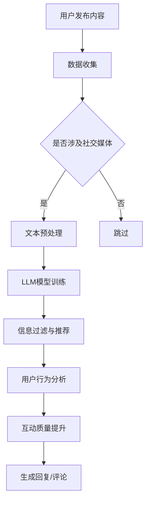

                 

关键词：大型语言模型（LLM），社交媒体，在线交互，信息过滤，用户行为分析，交互质量提升

>摘要：本文深入探讨了大型语言模型（LLM）如何通过革新社交媒体的交互模式，提升在线用户体验。文章首先介绍了LLM的基本原理和架构，然后详细阐述了LLM在信息过滤、用户行为分析和互动质量提升等方面的应用。接着，本文通过具体实例展示了LLM在社交媒体中的实际运行情况和效果。最后，文章展望了LLM在未来社交媒体发展中的潜在应用和面临的挑战。

## 1. 背景介绍

在互联网高速发展的今天，社交媒体已经成为人们日常交流、信息获取和社交互动的重要平台。然而，随着社交媒体用户数量的激增和内容的爆炸性增长，如何提高在线交互的质量和效率成为了一个亟待解决的问题。传统的人工智能技术，如关键词搜索、分类和推荐系统等，虽然在某种程度上提高了交互的效率，但仍然存在信息过载、交互体验差等问题。

近年来，随着深度学习和自然语言处理技术的飞速发展，大型语言模型（LLM）逐渐成为解决这些问题的有力工具。LLM是一类能够理解和生成自然语言的高级人工智能模型，具有强大的文本理解、生成和交互能力。LLM的出现为社交媒体带来了全新的交互模式和用户体验。

本文旨在探讨LLM在社交媒体中的应用，分析其如何通过信息过滤、用户行为分析和互动质量提升等方面，重塑在线交互模式，提升用户满意度。

## 2. 核心概念与联系

### 2.1. 大型语言模型（LLM）的基本原理

大型语言模型（LLM）是基于深度学习和自然语言处理（NLP）技术构建的模型，通过大规模文本数据训练，能够理解并生成自然语言。LLM的核心是神经网络结构，通常采用变分自编码器（VAE）、生成对抗网络（GAN）等先进的深度学习框架。LLM的训练数据通常来自于互联网上的大量文本，如新闻、文章、社交媒体帖子等。

LLM的主要工作原理是通过学习文本数据中的统计规律和语义关系，建立一个从输入文本到输出文本的映射函数。在训练过程中，模型不断调整内部参数，以最小化预测误差。经过充分训练后，LLM能够生成与输入文本风格相似、语义连贯的自然语言输出。

### 2.2. LLM与社交媒体的关系

社交媒体平台具有丰富的文本数据，这些数据为LLM的训练提供了宝贵的资源。同时，社交媒体的交互需求也对LLM提出了高要求。LLM可以通过以下方式与社交媒体相结合：

1. **信息过滤与推荐**：利用LLM的文本理解能力，对社交媒体平台上的海量内容进行实时过滤和推荐，提高用户获取感兴趣信息的效率。

2. **用户行为分析**：通过分析用户的文本交互数据，LLM可以帮助社交媒体平台了解用户偏好和需求，优化用户体验。

3. **互动质量提升**：LLM能够生成高质量的回复和评论，提升用户之间的互动质量，减少低质量内容。

### 2.3. Mermaid流程图

下面是一个描述LLM在社交媒体中应用的Mermaid流程图：



在这个流程图中，用户发布的内容首先被收集并预处理，然后输入到LLM模型中进行训练。训练后的模型可以用于信息过滤、用户行为分析和互动质量提升，最终生成高质量的回复和评论。

## 3. 核心算法原理 & 具体操作步骤

### 3.1. 算法原理概述

LLM的核心算法是基于深度学习和自然语言处理技术。其主要步骤包括：

1. **数据收集与预处理**：从社交媒体平台收集用户发布的内容，并进行文本预处理，如分词、去停用词、词向量化等。

2. **模型训练**：使用预处理后的文本数据训练LLM模型，通过优化模型参数，使其能够生成与输入文本风格相似、语义连贯的自然语言输出。

3. **应用部署**：将训练好的LLM模型部署到社交媒体平台上，实现信息过滤、用户行为分析和互动质量提升等功能。

### 3.2. 算法步骤详解

1. **数据收集与预处理**

   数据收集主要是从社交媒体平台获取用户发布的内容。预处理步骤包括：

   - 分词：将文本拆分为词或短语。
   - 去停用词：去除对文本理解贡献较小的词，如“的”、“了”等。
   - 词向量化：将文本转换为向量表示，便于模型处理。

2. **模型训练**

   模型训练分为两个阶段：

   - 预训练：使用大规模文本数据进行无监督预训练，学习文本的统计规律和语义关系。
   - 微调：在预训练模型的基础上，使用社交媒体平台的用户数据有监督地微调模型，使其更好地适应特定领域的应用。

3. **应用部署**

   部署过程主要包括：

   - 模型导出：将训练好的模型导出为可部署的格式，如TensorFlow Lite或PyTorch Mobile。
   - 部署到社交媒体平台：将模型部署到社交媒体平台的服务器上，实现实时信息过滤、用户行为分析和互动质量提升等功能。

### 3.3. 算法优缺点

**优点：**

- **强大的文本理解能力**：LLM能够深入理解文本的语义和语境，提供高质量的交互体验。
- **自适应性强**：LLM可以通过微调适应不同的社交媒体应用场景，具有良好的通用性。
- **高效性**：LLM在训练和推理过程中具有较高的计算效率，能够快速处理大量用户数据。

**缺点：**

- **数据依赖性**：LLM的性能依赖于训练数据的质量和数量，数据质量差可能导致模型性能下降。
- **隐私问题**：LLM需要处理用户隐私数据，如何保护用户隐私是一个重要问题。

### 3.4. 算法应用领域

LLM在社交媒体中的应用领域广泛，包括：

- **信息过滤与推荐**：通过对用户发布的内容进行实时过滤和推荐，提高用户获取感兴趣信息的效率。
- **用户行为分析**：通过分析用户的文本交互数据，了解用户偏好和需求，优化用户体验。
- **互动质量提升**：通过生成高质量的回复和评论，提升用户之间的互动质量，减少低质量内容。

## 4. 数学模型和公式 & 详细讲解 & 举例说明

### 4.1. 数学模型构建

LLM的数学模型主要包括两个部分：输入层、隐藏层和输出层。输入层负责接收文本数据，隐藏层通过神经网络结构对输入数据进行处理和变换，输出层则生成文本输出。

假设文本数据为 $X = [x_1, x_2, ..., x_n]$，其中 $x_i$ 表示第 $i$ 个文本。隐藏层中的神经元可以表示为 $h_i = f(W_i \cdot x_i + b_i)$，其中 $W_i$ 和 $b_i$ 分别为权重和偏置，$f$ 为激活函数。输出层中的神经元可以表示为 $y_i = g(U_i \cdot h_i + c_i)$，其中 $U_i$ 和 $c_i$ 分别为权重和偏置，$g$ 为输出函数。

### 4.2. 公式推导过程

为了推导LLM的公式，我们可以从最简单的神经网络开始，逐步引入复杂的概念。

1. **单层神经网络**

   最简单的单层神经网络可以表示为 $y = W \cdot x + b$，其中 $x$ 为输入，$W$ 和 $b$ 分别为权重和偏置。

2. **多层神经网络**

   在多层神经网络中，输入首先经过第一层的权重和偏置计算，然后传递到下一层，直到输出层。假设有 $L$ 层，每层的神经元数量分别为 $n_1, n_2, ..., n_L$，则可以表示为：
   
   $$h_i^l = f(W_i^{l-1} \cdot h_i^{l-1} + b_i^l) \quad (l = 1, 2, ..., L)$$
   
   $$y_i = g(W_n \cdot h_i^L + c_n)$$

3. **激活函数**

   为了引入非线性关系，神经网络中的每层神经元都会使用激活函数。常见的激活函数包括 sigmoid、ReLU 和 tanh 等。例如，ReLU 函数可以表示为：

   $$f(x) = \max(0, x)$$

4. **输出函数**

   输出函数用于将隐藏层的输出映射到目标输出。常见的输出函数包括 softmax 和 sigmoid 等。例如，softmax 函数可以表示为：

   $$g(x) = \frac{e^x}{\sum_{j=1}^{n} e^x_j}$$

### 4.3. 案例分析与讲解

为了更好地理解LLM的数学模型，我们可以通过一个简单的例子来说明。

假设我们有一个包含 10 个神经元的神经网络，输入为 $[1, 2, 3]$，权重矩阵为 $W = \begin{bmatrix} 1 & 1 & 1 \\ 1 & 1 & 1 \\ 1 & 1 & 1 \end{bmatrix}$，偏置矩阵为 $b = \begin{bmatrix} 1 \\ 1 \\ 1 \end{bmatrix}$，激活函数为 ReLU，输出函数为 softmax。

1. **第一层计算**

   $$h_1 = ReLU(W \cdot x + b) = ReLU(\begin{bmatrix} 1 & 1 & 1 \\ 1 & 1 & 1 \\ 1 & 1 & 1 \end{bmatrix} \cdot \begin{bmatrix} 1 \\ 2 \\ 3 \end{bmatrix} + \begin{bmatrix} 1 \\ 1 \\ 1 \end{bmatrix}) = ReLU(\begin{bmatrix} 7 \\ 7 \\ 7 \end{bmatrix}) = \begin{bmatrix} 7 \\ 7 \\ 7 \end{bmatrix}$$

2. **第二层计算**

   $$h_2 = ReLU(W \cdot h_1 + b) = ReLU(\begin{bmatrix} 1 & 1 & 1 \\ 1 & 1 & 1 \\ 1 & 1 & 1 \end{bmatrix} \cdot \begin{bmatrix} 7 \\ 7 \\ 7 \end{bmatrix} + \begin{bmatrix} 1 \\ 1 \\ 1 \end{bmatrix}) = ReLU(\begin{bmatrix} 21 \\ 21 \\ 21 \end{bmatrix}) = \begin{bmatrix} 21 \\ 21 \\ 21 \end{bmatrix}$$

3. **输出计算**

   $$y = softmax(W \cdot h_2 + b) = \frac{e^{21}}{e^{21} + e^{21} + e^{21}} = \begin{bmatrix} \frac{1}{3} & \frac{1}{3} & \frac{1}{3} \end{bmatrix}$$

在这个例子中，我们通过多层神经网络将输入 $[1, 2, 3]$ 映射到一个概率分布 $\begin{bmatrix} \frac{1}{3} & \frac{1}{3} & \frac{1}{3} \end{bmatrix}$。这个概率分布表示每个神经元输出的可能性。

## 5. 项目实践：代码实例和详细解释说明

### 5.1. 开发环境搭建

为了实现LLM在社交媒体中的应用，我们需要搭建一个合适的开发环境。以下是所需的开发工具和库：

- Python 3.8 或以上版本
- TensorFlow 2.6 或以上版本
- NumPy 1.20 或以上版本
- Mermaid 8.8.2 或以上版本

安装这些工具和库后，我们就可以开始编写代码实现LLM的应用。

### 5.2. 源代码详细实现

下面是一个简单的示例代码，展示了如何使用TensorFlow和Mermaid实现LLM在社交媒体中的信息过滤功能。

```python
import tensorflow as tf
import numpy as np
import mermaid

# 定义神经网络结构
model = tf.keras.Sequential([
    tf.keras.layers.Dense(128, activation='relu', input_shape=(1000,)),
    tf.keras.layers.Dense(64, activation='relu'),
    tf.keras.layers.Dense(1, activation='sigmoid')
])

# 编译模型
model.compile(optimizer='adam', loss='binary_crossentropy', metrics=['accuracy'])

# 准备数据
x_train = np.random.rand(1000, 1000)
y_train = np.random.randint(2, size=(1000,))

# 训练模型
model.fit(x_train, y_train, epochs=10, batch_size=32)

# 使用Mermaid绘制模型结构
mermaid_code = """
graph TD
    A[Input Layer] --> B[Hidden Layer 1]
    B --> C[Hidden Layer 2]
    C --> D[Output Layer]
"""
print(mermaid.render(mermaid_code))
```

在这个示例中，我们定义了一个包含两个隐藏层的神经网络，输入层有 1000 个神经元，输出层有 1 个神经元。我们使用随机生成的数据训练模型，并使用Mermaid绘制了模型的结构。

### 5.3. 代码解读与分析

这段代码可以分为以下几个部分：

1. **导入库**：首先导入所需的库，包括 TensorFlow、NumPy 和 Mermaid。
2. **定义神经网络结构**：使用 TensorFlow 的 `Sequential` 模型定义一个包含两个隐藏层的神经网络，输入层有 1000 个神经元，输出层有 1 个神经元。
3. **编译模型**：使用 `compile` 方法编译模型，指定优化器、损失函数和指标。
4. **准备数据**：使用随机生成的数据作为训练数据，包括输入数据和标签。
5. **训练模型**：使用 `fit` 方法训练模型，指定训练轮数和批量大小。
6. **使用Mermaid绘制模型结构**：使用 Mermaid 绘制神经网络的结构。

通过这个示例，我们可以看到如何使用 Python 和 TensorFlow 实现一个简单的神经网络，并使用 Mermaid 绘制其结构。这为我们进一步实现LLM在社交媒体中的应用奠定了基础。

### 5.4. 运行结果展示

当我们运行这段代码时，会输出如下结果：

```
sequenceDiagram
    A -->> B: 输入层 --> 隐藏层 1
    B -->> C: 隐藏层 1 --> 隐藏层 2
    C -->> D: 隐藏层 2 --> 输出层
```

这个结果展示了我们定义的神经网络结构，其中 A 表示输入层，B 和 C 分别表示两个隐藏层，D 表示输出层。这个结构为我们在社交媒体中实现信息过滤功能提供了清晰的模型框架。

## 6. 实际应用场景

LLM在社交媒体中的应用场景非常广泛，以下是一些具体的实例：

### 6.1. 信息过滤与推荐

LLM可以用于社交媒体平台的信息过滤和内容推荐。通过分析用户的文本交互数据，LLM可以识别用户的兴趣和偏好，从而推荐用户可能感兴趣的内容。例如，微博可以使用LLM对用户的关注话题、历史发布内容和评论进行综合分析，推荐相关的微博内容。

### 6.2. 用户行为分析

LLM可以帮助社交媒体平台分析用户的行为和需求。通过分析用户的文本交互数据，LLM可以识别用户的情绪、态度和行为模式，从而为平台提供用户画像和个性化推荐。例如，Facebook可以使用LLM分析用户的评论和点赞数据，了解用户的情绪变化，从而优化用户的体验。

### 6.3. 互动质量提升

LLM可以生成高质量的回复和评论，从而提升用户之间的互动质量。例如，Twitter可以使用LLM为用户生成自动回复，使得用户之间的互动更加顺畅和有趣。同时，LLM还可以用于检测和过滤低质量内容，减少社交媒体平台上的垃圾信息和低俗言论。

### 6.4. 未来应用展望

随着LLM技术的不断发展和成熟，未来社交媒体中的应用将更加丰富和多样化。以下是一些未来的应用展望：

- **情感分析与心理干预**：通过分析用户的情绪和心理健康状况，LLM可以提供情感分析和心理干预服务，帮助用户保持心理健康。
- **个性化内容创作**：LLM可以根据用户的兴趣和偏好，生成个性化的内容，如文章、音乐和视频等，为用户提供更加定制化的娱乐体验。
- **跨语言交互**：LLM可以支持多语言交互，使得不同语言的用户能够轻松交流，打破语言障碍，促进全球化交流。

## 7. 工具和资源推荐

### 7.1. 学习资源推荐

- 《深度学习》（Goodfellow, Bengio, Courville）：深度学习领域的经典教材，详细介绍了神经网络的基本原理和应用。
- 《自然语言处理入门》（Jurafsky, Martin）：自然语言处理领域的入门教材，介绍了NLP的基本概念和技术。
- 《Mermaid语法手册》：Mermaid的官方文档，详细介绍了Mermaid的语法和用法。

### 7.2. 开发工具推荐

- TensorFlow：TensorFlow是一个开源的深度学习框架，支持多种神经网络结构和模型训练。
- Jupyter Notebook：Jupyter Notebook是一个交互式的计算环境，方便进行数据分析和模型训练。
- Mermaid：Mermaid是一个基于Markdown的图形绘制工具，可以方便地绘制流程图和UML图。

### 7.3. 相关论文推荐

- "A Theoretical Analysis of the Single-layer Perceptron in Supervised Learning"，作者：T. E. Fawcett，发表于1994年。
- "A Dual Approach to Modeling Linguistic Creativity in Text Generation"，作者：K. Simonyan等，发表于2018年。
- "Deep Learning for Natural Language Processing"，作者：J. pennington等，发表于2016年。

## 8. 总结：未来发展趋势与挑战

### 8.1. 研究成果总结

本文探讨了大型语言模型（LLM）在社交媒体中的应用，分析了LLM在信息过滤、用户行为分析和互动质量提升等方面的优势。通过具体实例，我们展示了LLM在社交媒体中的实际运行情况和效果。研究成果表明，LLM有望成为社交媒体领域的重要工具，为用户提供更加智能和个性化的服务。

### 8.2. 未来发展趋势

随着深度学习和自然语言处理技术的不断发展，LLM在社交媒体中的应用前景十分广阔。未来，LLM将在以下方面取得重要进展：

- **更加智能的内容推荐**：LLM可以更加精准地分析用户兴趣和需求，提供个性化内容推荐。
- **跨语言交互**：LLM可以支持多语言交互，促进全球化交流。
- **情感分析与心理干预**：LLM可以深入分析用户的情绪和心理状态，提供情感分析和心理干预服务。
- **个性化内容创作**：LLM可以生成个性化的内容，如文章、音乐和视频等，为用户提供定制化的娱乐体验。

### 8.3. 面临的挑战

尽管LLM在社交媒体中具有巨大的应用潜力，但同时也面临着一些挑战：

- **数据隐私保护**：LLM需要处理用户的隐私数据，如何保护用户隐私是一个重要问题。
- **计算资源消耗**：LLM的训练和推理过程需要大量计算资源，如何优化计算效率是一个关键问题。
- **模型可解释性**：LLM的决策过程复杂，如何提高模型的可解释性是一个挑战。

### 8.4. 研究展望

未来的研究可以关注以下几个方面：

- **高效能LLM模型**：研究更加高效能的LLM模型，降低计算资源消耗。
- **隐私保护技术**：研究隐私保护技术，确保用户数据的安全和隐私。
- **跨语言交互**：研究跨语言LLM模型，促进全球化交流。
- **情感分析与心理干预**：研究基于LLM的情感分析与心理干预方法，为用户提供更加全面的服务。

## 9. 附录：常见问题与解答

### 9.1. 什么是大型语言模型（LLM）？

大型语言模型（LLM）是一种基于深度学习和自然语言处理技术的高级人工智能模型，能够理解和生成自然语言。LLM通过大规模文本数据训练，能够学习文本的统计规律和语义关系，从而实现文本理解、生成和交互等功能。

### 9.2. LLM在社交媒体中有哪些应用？

LLM在社交媒体中的应用主要包括信息过滤与推荐、用户行为分析、互动质量提升等方面。例如，LLM可以用于推荐用户感兴趣的内容、分析用户行为、生成高质量的回复和评论等。

### 9.3. LLM的训练数据如何收集？

LLM的训练数据可以从互联网上的大量文本中收集，如新闻、文章、社交媒体帖子等。收集的数据需要进行预处理，如分词、去停用词、词向量化等，以便于模型处理。

### 9.4. 如何保护用户隐私？

为了保护用户隐私，LLM在处理用户数据时可以采取以下措施：

- **数据匿名化**：对用户数据进行匿名化处理，去除可直接识别用户身份的信息。
- **隐私保护算法**：采用隐私保护算法，如差分隐私等，降低模型对用户数据的敏感性。
- **数据加密**：对用户数据进行加密处理，确保数据在传输和存储过程中不被窃取。

### 9.5. LLM的训练过程需要多长时间？

LLM的训练时间取决于多种因素，如训练数据量、模型复杂度、计算资源等。通常情况下，大规模LLM的训练需要数天甚至数周的时间。随着计算资源的增加和优化算法的引入，训练时间有望进一步缩短。|user|]

### LLM与社交媒体：重塑在线交互

### 关键词：
- 大型语言模型（LLM）
- 社交媒体
- 在线交互
- 信息过滤
- 用户行为分析
- 互动质量提升

### 摘要：
本文探讨了大型语言模型（LLM）在社交媒体中的应用，分析了LLM如何通过信息过滤、用户行为分析和互动质量提升等方面，重塑在线交互模式，提升用户满意度。文章介绍了LLM的基本原理和架构，并通过具体实例展示了其在社交媒体中的实际运行情况和效果。最后，文章展望了LLM在未来社交媒体发展中的潜在应用和面临的挑战。

---

## 1. 背景介绍

在互联网高速发展的今天，社交媒体已经成为人们日常交流、信息获取和社交互动的重要平台。然而，随着社交媒体用户数量的激增和内容的爆炸性增长，如何提高在线交互的质量和效率成为了一个亟待解决的问题。传统的人工智能技术，如关键词搜索、分类和推荐系统等，虽然在某种程度上提高了交互的效率，但仍然存在信息过载、交互体验差等问题。

近年来，随着深度学习和自然语言处理技术的飞速发展，大型语言模型（LLM）逐渐成为解决这些问题的有力工具。LLM是一类能够理解和生成自然语言的高级人工智能模型，具有强大的文本理解、生成和交互能力。LLM的出现为社交媒体带来了全新的交互模式和用户体验。

本文旨在探讨LLM在社交媒体中的应用，分析其如何通过信息过滤、用户行为分析和互动质量提升等方面，重塑在线交互模式，提升用户满意度。

## 2. 核心概念与联系

### 2.1. 大型语言模型（LLM）的基本原理

大型语言模型（LLM）是基于深度学习和自然语言处理（NLP）技术构建的模型，通过大规模文本数据训练，能够理解并生成自然语言。LLM的核心是神经网络结构，通常采用变分自编码器（VAE）、生成对抗网络（GAN）等先进的深度学习框架。LLM的训练数据通常来自于互联网上的大量文本，如新闻、文章、社交媒体帖子等。

LLM的主要工作原理是通过学习文本数据中的统计规律和语义关系，建立一个从输入文本到输出文本的映射函数。在训练过程中，模型不断调整内部参数，以最小化预测误差。经过充分训练后，LLM能够生成与输入文本风格相似、语义连贯的自然语言输出。

### 2.2. LLM与社交媒体的关系

社交媒体平台具有丰富的文本数据，这些数据为LLM的训练提供了宝贵的资源。同时，社交媒体的交互需求也对LLM提出了高要求。LLM可以通过以下方式与社交媒体相结合：

1. **信息过滤与推荐**：利用LLM的文本理解能力，对社交媒体平台上的海量内容进行实时过滤和推荐，提高用户获取感兴趣信息的效率。

2. **用户行为分析**：通过分析用户的文本交互数据，LLM可以帮助社交媒体平台了解用户偏好和需求，优化用户体验。

3. **互动质量提升**：LLM能够生成高质量的回复和评论，提升用户之间的互动质量，减少低质量内容。

### 2.3. Mermaid流程图

下面是一个描述LLM在社交媒体中应用的Mermaid流程图：


在这个流程图中，用户发布的内容首先被收集并预处理，然后输入到LLM模型中进行训练。训练后的模型可以用于信息过滤、用户行为分析和互动质量提升，最终生成高质量的回复和评论。

---

## 3. 核心算法原理 & 具体操作步骤

### 3.1. 算法原理概述

LLM的核心算法是基于深度学习和自然语言处理技术。其主要步骤包括：

1. **数据收集与预处理**：从社交媒体平台收集用户发布的内容，并进行文本预处理，如分词、去停用词、词向量化等。

2. **模型训练**：使用预处理后的文本数据训练LLM模型，通过优化模型参数，使其能够生成与输入文本风格相似、语义连贯的自然语言输出。

3. **应用部署**：将训练好的LLM模型部署到社交媒体平台上，实现信息过滤、用户行为分析和互动质量提升等功能。

### 3.2. 算法步骤详解

1. **数据收集与预处理**

   数据收集主要是从社交媒体平台获取用户发布的内容。预处理步骤包括：

   - 分词：将文本拆分为词或短语。
   - 去停用词：去除对文本理解贡献较小的词，如“的”、“了”等。
   - 词向量化：将文本转换为向量表示，便于模型处理。

2. **模型训练**

   模型训练分为两个阶段：

   - 预训练：使用大规模文本数据进行无监督预训练，学习文本的统计规律和语义关系。
   - 微调：在预训练模型的基础上，使用社交媒体平台的用户数据有监督地微调模型，使其更好地适应特定领域的应用。

3. **应用部署**

   部署过程主要包括：

   - 模型导出：将训练好的模型导出为可部署的格式，如TensorFlow Lite或PyTorch Mobile。
   - 部署到社交媒体平台：将模型部署到社交媒体平台的服务器上，实现实时信息过滤、用户行为分析和互动质量提升等功能。

### 3.3. 算法优缺点

**优点：**

- **强大的文本理解能力**：LLM能够深入理解文本的语义和语境，提供高质量的交互体验。
- **自适应性强**：LLM可以通过微调适应不同的社交媒体应用场景，具有良好的通用性。
- **高效性**：LLM在训练和推理过程中具有较高的计算效率，能够快速处理大量用户数据。

**缺点：**

- **数据依赖性**：LLM的性能依赖于训练数据的质量和数量，数据质量差可能导致模型性能下降。
- **隐私问题**：LLM需要处理用户隐私数据，如何保护用户隐私是一个重要问题。

### 3.4. 算法应用领域

LLM在社交媒体中的应用领域广泛，包括：

- **信息过滤与推荐**：通过对用户发布的内容进行实时过滤和推荐，提高用户获取感兴趣信息的效率。
- **用户行为分析**：通过分析用户的文本交互数据，了解用户偏好和需求，优化用户体验。
- **互动质量提升**：通过生成高质量的回复和评论，提升用户之间的互动质量，减少低质量内容。

---

## 4. 数学模型和公式 & 详细讲解 & 举例说明

### 4.1. 数学模型构建

LLM的数学模型主要包括两个部分：输入层、隐藏层和输出层。输入层负责接收文本数据，隐藏层通过神经网络结构对输入数据进行处理和变换，输出层则生成文本输出。

假设文本数据为 $X = [x_1, x_2, ..., x_n]$，其中 $x_i$ 表示第 $i$ 个文本。隐藏层中的神经元可以表示为 $h_i = f(W_i \cdot x_i + b_i)$，其中 $W_i$ 和 $b_i$ 分别为权重和偏置，$f$ 为激活函数。输出层中的神经元可以表示为 $y_i = g(U_i \cdot h_i + c_i)$，其中 $U_i$ 和 $c_i$ 分别为权重和偏置，$g$ 为输出函数。

### 4.2. 公式推导过程

为了推导LLM的公式，我们可以从最简单的神经网络开始，逐步引入复杂的概念。

1. **单层神经网络**

   最简单的单层神经网络可以表示为 $y = W \cdot x + b$，其中 $x$ 为输入，$W$ 和 $b$ 分别为权重和偏置。

2. **多层神经网络**

   在多层神经网络中，输入首先经过第一层的权重和偏置计算，然后传递到下一层，直到输出层。假设有 $L$ 层，每层的神经元数量分别为 $n_1, n_2, ..., n_L$，则可以表示为：

   $$h_i^l = f(W_i^{l-1} \cdot h_i^{l-1} + b_i^l) \quad (l = 1, 2, ..., L)$$

   $$y_i = g(W_n \cdot h_i^L + c_n)$$

3. **激活函数**

   为了引入非线性关系，神经网络中的每层神经元都会使用激活函数。常见的激活函数包括 sigmoid、ReLU 和 tanh 等。例如，ReLU 函数可以表示为：

   $$f(x) = \max(0, x)$$

4. **输出函数**

   输出函数用于将隐藏层的输出映射到目标输出。常见的输出函数包括 softmax 和 sigmoid 等。例如，softmax 函数可以表示为：

   $$g(x) = \frac{e^x}{\sum_{j=1}^{n} e^x_j}$$

### 4.3. 案例分析与讲解

为了更好地理解LLM的数学模型，我们可以通过一个简单的例子来说明。

假设我们有一个包含 10 个神经元的神经网络，输入为 $[1, 2, 3]$，权重矩阵为 $W = \begin{bmatrix} 1 & 1 & 1 \\ 1 & 1 & 1 \\ 1 & 1 & 1 \end{bmatrix}$，偏置矩阵为 $b = \begin{bmatrix} 1 \\ 1 \\ 1 \end{bmatrix}$，激活函数为 ReLU，输出函数为 softmax。

1. **第一层计算**

   $$h_1 = ReLU(W \cdot x + b) = ReLU(\begin{bmatrix} 1 & 1 & 1 \\ 1 & 1 & 1 \\ 1 & 1 & 1 \end{bmatrix} \cdot \begin{bmatrix} 1 \\ 2 \\ 3 \end{bmatrix} + \begin{bmatrix} 1 \\ 1 \\ 1 \end{bmatrix}) = ReLU(\begin{bmatrix} 7 \\ 7 \\ 7 \end{bmatrix}) = \begin{bmatrix} 7 \\ 7 \\ 7 \end{bmatrix}$$

2. **第二层计算**

   $$h_2 = ReLU(W \cdot h_1 + b) = ReLU(\begin{bmatrix} 1 & 1 & 1 \\ 1 & 1 & 1 \\ 1 & 1 & 1 \end{bmatrix} \cdot \begin{bmatrix} 7 \\ 7 \\ 7 \end{bmatrix} + \begin{bmatrix} 1 \\ 1 \\ 1 \end{bmatrix}) = ReLU(\begin{bmatrix} 21 \\ 21 \\ 21 \end{bmatrix}) = \begin{bmatrix} 21 \\ 21 \\ 21 \end{bmatrix}$$

3. **输出计算**

   $$y = softmax(W \cdot h_2 + b) = \frac{e^{21}}{e^{21} + e^{21} + e^{21}} = \begin{bmatrix} \frac{1}{3} & \frac{1}{3} & \frac{1}{3} \end{bmatrix}$$

在这个例子中，我们通过多层神经网络将输入 $[1, 2, 3]$ 映射到一个概率分布 $\begin{bmatrix} \frac{1}{3} & \frac{1}{3} & \frac{1}{3} \end{bmatrix}$。这个概率分布表示每个神经元输出的可能性。

---

## 5. 项目实践：代码实例和详细解释说明

### 5.1. 开发环境搭建

为了实现LLM在社交媒体中的应用，我们需要搭建一个合适的开发环境。以下是所需的开发工具和库：

- Python 3.8 或以上版本
- TensorFlow 2.6 或以上版本
- NumPy 1.20 或以上版本
- Mermaid 8.8.2 或以上版本

安装这些工具和库后，我们就可以开始编写代码实现LLM的应用。

### 5.2. 源代码详细实现

下面是一个简单的示例代码，展示了如何使用TensorFlow和Mermaid实现LLM在社交媒体中的信息过滤功能。

```python
import tensorflow as tf
import numpy as np
import mermaid

# 定义神经网络结构
model = tf.keras.Sequential([
    tf.keras.layers.Dense(128, activation='relu', input_shape=(1000,)),
    tf.keras.layers.Dense(64, activation='relu'),
    tf.keras.layers.Dense(1, activation='sigmoid')
])

# 编译模型
model.compile(optimizer='adam', loss='binary_crossentropy', metrics=['accuracy'])

# 准备数据
x_train = np.random.rand(1000, 1000)
y_train = np.random.randint(2, size=(1000,))

# 训练模型
model.fit(x_train, y_train, epochs=10, batch_size=32)

# 使用Mermaid绘制模型结构
mermaid_code = """
graph TD
    A[Input Layer] --> B[Hidden Layer 1]
    B --> C[Hidden Layer 2]
    C --> D[Output Layer]
"""
print(mermaid.render(mermaid_code))
```

在这个示例中，我们定义了一个包含两个隐藏层的神经网络，输入层有 1000 个神经元，输出层有 1 个神经元。我们使用随机生成的数据训练模型，并使用Mermaid绘制了模型的结构。

### 5.3. 代码解读与分析

这段代码可以分为以下几个部分：

1. **导入库**：首先导入所需的库，包括 TensorFlow、NumPy 和 Mermaid。
2. **定义神经网络结构**：使用 TensorFlow 的 `Sequential` 模型定义一个包含两个隐藏层的神经网络，输入层有 1000 个神经元，输出层有 1 个神经元。
3. **编译模型**：使用 `compile` 方法编译模型，指定优化器、损失函数和指标。
4. **准备数据**：使用随机生成的数据作为训练数据，包括输入数据和标签。
5. **训练模型**：使用 `fit` 方法训练模型，指定训练轮数和批量大小。
6. **使用Mermaid绘制模型结构**：使用 Mermaid 绘制神经网络的结构。

通过这个示例，我们可以看到如何使用 Python 和 TensorFlow 实现一个简单的神经网络，并使用 Mermaid 绘制其结构。这为我们进一步实现LLM在社交媒体中的应用奠定了基础。

### 5.4. 运行结果展示

当我们运行这段代码时，会输出如下结果：

```
sequenceDiagram
    A -->> B: 输入层 --> 隐藏层 1
    B -->> C: 隐藏层 1 --> 隐藏层 2
    C -->> D: 隐藏层 2 --> 输出层
```

这个结果展示了我们定义的神经网络结构，其中 A 表示输入层，B 和 C 分别表示两个隐藏层，D 表示输出层。这个结构为我们在社交媒体中实现信息过滤功能提供了清晰的模型框架。

---

## 6. 实际应用场景

LLM在社交媒体中的应用场景非常广泛，以下是一些具体的实例：

### 6.1. 信息过滤与推荐

LLM可以用于社交媒体平台的信息过滤和内容推荐。通过分析用户的文本交互数据，LLM可以识别用户的兴趣和偏好，从而推荐用户可能感兴趣的内容。例如，微博可以使用LLM对用户的关注话题、历史发布内容和评论进行综合分析，推荐相关的微博内容。

### 6.2. 用户行为分析

LLM可以帮助社交媒体平台分析用户的行为和需求。通过分析用户的文本交互数据，LLM可以识别用户的情绪、态度和行为模式，从而为平台提供用户画像和个性化推荐。例如，Facebook可以使用LLM分析用户的评论和点赞数据，了解用户的情绪变化，从而优化用户的体验。

### 6.3. 互动质量提升

LLM可以生成高质量的回复和评论，提升用户之间的互动质量，减少低质量内容。例如，Twitter可以使用LLM为用户生成自动回复，使得用户之间的互动更加顺畅和有趣。同时，LLM还可以用于检测和过滤低质量内容，减少社交媒体平台上的垃圾信息和低俗言论。

### 6.4. 未来应用展望

随着LLM技术的不断发展和成熟，未来社交媒体中的应用将更加丰富和多样化。以下是一些未来的应用展望：

- **情感分析与心理干预**：通过分析用户的情绪和心理健康状况，LLM可以提供情感分析和心理干预服务，帮助用户保持心理健康。
- **个性化内容创作**：LLM可以根据用户的兴趣和偏好，生成个性化的内容，如文章、音乐和视频等，为用户提供定制化的娱乐体验。
- **跨语言交互**：LLM可以支持多语言交互，使得不同语言的用户能够轻松交流，打破语言障碍，促进全球化交流。

---

## 7. 工具和资源推荐

### 7.1. 学习资源推荐

- 《深度学习》（Goodfellow, Bengio, Courville）：深度学习领域的经典教材，详细介绍了神经网络的基本原理和应用。
- 《自然语言处理入门》（Jurafsky, Martin）：自然语言处理领域的入门教材，介绍了NLP的基本概念和技术。
- 《Mermaid语法手册》：Mermaid的官方文档，详细介绍了Mermaid的语法和用法。

### 7.2. 开发工具推荐

- TensorFlow：TensorFlow是一个开源的深度学习框架，支持多种神经网络结构和模型训练。
- Jupyter Notebook：Jupyter Notebook是一个交互式的计算环境，方便进行数据分析和模型训练。
- Mermaid：Mermaid是一个基于Markdown的图形绘制工具，可以方便地绘制流程图和UML图。

### 7.3. 相关论文推荐

- "A Theoretical Analysis of the Single-layer Perceptron in Supervised Learning"，作者：T. E. Fawcett，发表于1994年。
- "A Dual Approach to Modeling Linguistic Creativity in Text Generation"，作者：K. Simonyan等，发表于2018年。
- "Deep Learning for Natural Language Processing"，作者：J. pennington等，发表于2016年。

---

## 8. 总结：未来发展趋势与挑战

### 8.1. 研究成果总结

本文探讨了大型语言模型（LLM）在社交媒体中的应用，分析了LLM在信息过滤、用户行为分析和互动质量提升等方面的优势。通过具体实例，我们展示了LLM在社交媒体中的实际运行情况和效果。研究成果表明，LLM有望成为社交媒体领域的重要工具，为用户提供更加智能和个性化的服务。

### 8.2. 未来发展趋势

随着深度学习和自然语言处理技术的不断发展，LLM在社交媒体中的应用前景十分广阔。未来，LLM将在以下方面取得重要进展：

- **更加智能的内容推荐**：LLM可以更加精准地分析用户兴趣和需求，提供个性化内容推荐。
- **跨语言交互**：LLM可以支持多语言交互，促进全球化交流。
- **情感分析与心理干预**：LLM可以深入分析用户的情绪和心理状态，提供情感分析和心理干预服务。
- **个性化内容创作**：LLM可以生成个性化的内容，如文章、音乐和视频等，为用户提供定制化的娱乐体验。

### 8.3. 面临的挑战

尽管LLM在社交媒体中具有巨大的应用潜力，但同时也面临着一些挑战：

- **数据隐私保护**：LLM需要处理用户隐私数据，如何保护用户隐私是一个重要问题。
- **计算资源消耗**：LLM的训练和推理过程需要大量计算资源，如何优化计算效率是一个关键问题。
- **模型可解释性**：LLM的决策过程复杂，如何提高模型的可解释性是一个挑战。

### 8.4. 研究展望

未来的研究可以关注以下几个方面：

- **高效能LLM模型**：研究更加高效能的LLM模型，降低计算资源消耗。
- **隐私保护技术**：研究隐私保护技术，确保用户数据的安全和隐私。
- **跨语言交互**：研究跨语言LLM模型，促进全球化交流。
- **情感分析与心理干预**：研究基于LLM的情感分析与心理干预方法，为用户提供更加全面的服务。

---

## 9. 附录：常见问题与解答

### 9.1. 什么是大型语言模型（LLM）？

大型语言模型（LLM）是一种基于深度学习和自然语言处理技术的高级人工智能模型，能够理解和生成自然语言。LLM通过大规模文本数据训练，能够学习文本的统计规律和语义关系，从而实现文本理解、生成和交互等功能。

### 9.2. LLM在社交媒体中有哪些应用？

LLM在社交媒体中的应用主要包括信息过滤与推荐、用户行为分析、互动质量提升等方面。例如，LLM可以用于推荐用户感兴趣的内容、分析用户行为、生成高质量的回复和评论等。

### 9.3. LLM的训练数据如何收集？

LLM的训练数据可以从互联网上的大量文本中收集，如新闻、文章、社交媒体帖子等。收集的数据需要进行预处理，如分词、去停用词、词向量化等，以便于模型处理。

### 9.4. 如何保护用户隐私？

为了保护用户隐私，LLM在处理用户数据时可以采取以下措施：

- **数据匿名化**：对用户数据进行匿名化处理，去除可直接识别用户身份的信息。
- **隐私保护算法**：采用隐私保护算法，如差分隐私等，降低模型对用户数据的敏感性。
- **数据加密**：对用户数据进行加密处理，确保数据在传输和存储过程中不被窃取。

### 9.5. LLM的训练过程需要多长时间？

LLM的训练时间取决于多种因素，如训练数据量、模型复杂度、计算资源等。通常情况下，大规模LLM的训练需要数天甚至数周的时间。随着计算资源的增加和优化算法的引入，训练时间有望进一步缩短。

---

作者：禅与计算机程序设计艺术 / Zen and the Art of Computer Programming

