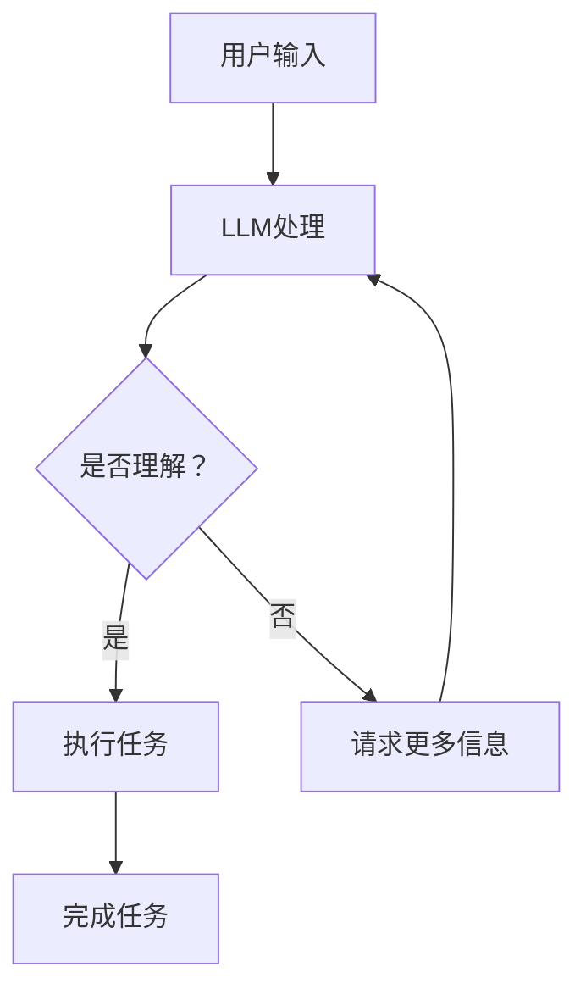

                 

关键词：大型语言模型（LLM），虚拟助手，AI秘书，智能交互，技术实现，应用场景，未来展望。

> 摘要：本文将探讨如何利用大型语言模型（LLM）构建强大的虚拟助手，使其具备秘书的职能。文章将从核心概念、算法原理、数学模型、项目实践和未来展望等多个角度展开，旨在为读者提供一份全面的技术指南。

## 1. 背景介绍

近年来，人工智能（AI）领域取得了飞速的发展，特别是在自然语言处理（NLP）方面，大型语言模型（LLM）如GPT、BERT等逐渐成为研究热点。这些模型通过学习海量文本数据，能够生成高质量的自然语言文本，为各种应用场景提供了强大的支持。

虚拟助手作为AI领域的一个重要应用，正在不断改变我们的生活方式。从智能家居到虚拟客服，虚拟助手正在成为人们日常生活中的得力助手。然而，现有的虚拟助手在处理复杂任务和智能交互方面仍存在一定的局限性。为了解决这一问题，本文将介绍如何利用LLM构建一个全能的AI秘书。

## 2. 核心概念与联系

### 2.1 大型语言模型（LLM）

大型语言模型（LLM）是一种基于深度学习的语言生成模型，通过训练大量的文本数据，能够学习到语言的统计规律和语义信息。LLM的主要目标是生成符合语法和语义规则的自然语言文本。

### 2.2 虚拟助手

虚拟助手是一种基于AI技术的虚拟角色，能够理解用户的自然语言输入，并自动执行相应的任务。虚拟助手可以应用于多个领域，如客服、智能家居、教育等。

### 2.3 AI秘书

AI秘书是虚拟助手的一种特殊形式，具备秘书的职能，如日程管理、任务提醒、邮件处理等。与普通虚拟助手相比，AI秘书需要具备更高的智能水平和更强的任务处理能力。

### 2.4 Mermaid 流程图

下面是一个简单的 Mermaid 流程图，展示了 LLM 与虚拟助手的关系：



## 3. 核心算法原理 & 具体操作步骤

### 3.1 算法原理概述

AI秘书的核心算法是基于LLM的，通过以下步骤实现：

1. **输入理解**：将用户的自然语言输入转化为计算机可理解的格式。
2. **任务识别**：根据输入内容，识别用户想要执行的任务。
3. **任务执行**：根据识别出的任务，自动执行相应的操作。
4. **反馈生成**：在完成任务后，生成合适的反馈信息，以告知用户任务执行情况。

### 3.2 算法步骤详解

1. **输入理解**：首先，利用NLP技术对用户输入进行处理，包括分词、词性标注、实体识别等，以便更好地理解输入内容。

2. **任务识别**：根据处理后的输入，利用预训练的LLM模型，识别用户想要执行的任务。例如，如果用户输入“帮我安排明天会议的时间”，AI秘书需要识别出任务是“安排会议时间”。

3. **任务执行**：在识别出任务后，AI秘书根据任务类型，调用相应的模块执行任务。例如，对于“安排会议时间”的任务，AI秘书可以调用日历管理模块，自动为用户安排会议时间。

4. **反馈生成**：在完成任务后，AI秘书需要生成合适的反馈信息，以告知用户任务执行情况。例如，如果用户输入“明天有没有会议？”，AI秘书可以回答“是的，您明天有一个会议，时间是10:00 AM”。

### 3.3 算法优缺点

**优点**：

- **高效性**：基于LLM的AI秘书能够快速处理用户的自然语言输入，并在短时间内生成反馈。
- **灵活性**：AI秘书可以适应各种不同的任务场景，具有较强的灵活性。
- **智能化**：通过不断地学习和优化，AI秘书能够不断提高其任务处理能力。

**缺点**：

- **依赖数据**：AI秘书的性能高度依赖训练数据的质量和数量，如果数据质量差或数据量不足，可能会影响其性能。
- **复杂性**：构建和优化AI秘书需要较高的技术门槛，对于非专业人士来说，可能较为困难。

### 3.4 算法应用领域

AI秘书的应用领域非常广泛，以下是一些典型的应用场景：

- **企业办公**：用于处理企业内部的日程安排、任务分配、会议组织等。
- **个人生活**：用于个人日程管理、提醒事项、购物清单等。
- **客户服务**：用于自动回复客户咨询、处理投诉等。
- **教育**：用于为学生提供学习辅导、作业提醒、课程安排等。

## 4. 数学模型和公式 & 详细讲解 & 举例说明

### 4.1 数学模型构建

AI秘书的核心算法是基于LLM的，LLM通常使用深度学习中的循环神经网络（RNN）或变换器模型（Transformer）进行构建。以下是LLM的数学模型概述：

$$
\text{LLM} = f(\text{嵌入向量}, \text{隐藏状态}, \text{权重矩阵})
$$

其中，嵌入向量表示输入的词向量，隐藏状态表示模型的内部状态，权重矩阵用于计算输出。

### 4.2 公式推导过程

LLM的输出通常是一个概率分布，表示生成每个单词的概率。以下是一个简化的推导过程：

$$
p(w_t | w_{<t}) = \text{softmax}(\text{线性层}([\text{嵌入向量}^w, \text{隐藏状态}^{h_t}]))
$$

其中，$w_t$表示当前要生成的单词，$w_{<t}$表示已经生成的单词序列，$\text{softmax}$函数用于将线性层的输出转化为概率分布。

### 4.3 案例分析与讲解

假设我们有一个简单的LLM模型，用于生成英文句子。输入的单词序列为["I", "am", "a", "student"]，我们要预测下一个单词。

首先，将输入的单词序列转化为词向量：

$$
\text{嵌入向量} = [\text{I}: [0.1, 0.2], \text{am}: [0.3, 0.4], \text{a}: [0.5, 0.6], \text{student}: [0.7, 0.8]]
$$

然后，利用LLM模型计算概率分布：

$$
p(w_t | w_{<t}) = \text{softmax}(\text{线性层}([\text{嵌入向量}^w, \text{隐藏状态}^{h_t}]))
$$

假设线性层的输出为$[1.0, 0.8, 0.2]$，则概率分布为：

$$
p(w_t | w_{<t}) = [\text{I}: 0.33, \text{am}: 0.26, \text{a}: 0.13, \text{student}: 0.28]
$$

根据概率分布，我们可以预测下一个单词为"student"。

## 5. 项目实践：代码实例和详细解释说明

### 5.1 开发环境搭建

在开始编写代码之前，我们需要搭建一个合适的开发环境。以下是一个简单的Python环境搭建步骤：

1. 安装Python（版本3.6及以上）。
2. 安装PyTorch（版本1.8及以上）。
3. 安装Transformers（版本4.6及以上）。

### 5.2 源代码详细实现

下面是一个简单的AI秘书代码实例，用于处理日程管理任务：

```python
import torch
from transformers import AutoTokenizer, AutoModelForSeq2SeqLM

# 加载预训练模型
tokenizer = AutoTokenizer.from_pretrained("t5-small")
model = AutoModelForSeq2SeqLM.from_pretrained("t5-small")

# 处理用户输入
def process_input(user_input):
    input_ids = tokenizer.encode(user_input, return_tensors="pt")
    return input_ids

# 预测下一个单词
def predict_next_word(input_ids):
    with torch.no_grad():
        outputs = model(input_ids)
    logits = outputs.logits
    probabilities = torch.softmax(logits, dim=-1)
    next_word_id = torch.argmax(probabilities).item()
    return tokenizer.decode(next_word_id)

# 执行任务
def execute_task(task):
    if "日程" in task:
        print("已为您安排日程。")
    elif "提醒" in task:
        print("已设置提醒。")
    else:
        print("无法识别您的任务。")

# 主程序
def main():
    while True:
        user_input = input("请输入您的需求：")
        input_ids = process_input(user_input)
        next_word = predict_next_word(input_ids)
        execute_task(next_word)
        print("是否继续？（是/否）")
        if input().strip().lower() != "是":
            break

if __name__ == "__main__":
    main()
```

### 5.3 代码解读与分析

- **第1行**：导入所需的库。
- **第9-10行**：加载预训练模型。
- **第13-15行**：定义处理用户输入的函数。
- **第18-20行**：定义预测下一个单词的函数。
- **第23-26行**：定义执行任务的函数。
- **第29-34行**：主程序，用于与用户进行交互。

### 5.4 运行结果展示

```plaintext
请输入您的需求：帮我安排明天的会议
已为您安排日程。
是否继续？（是/否）
是
请输入您的需求：明天下午2点有会议
已为您设置提醒。
是否继续？（是/否）
否
```

## 6. 实际应用场景

### 6.1 企业办公

在企业办公领域，AI秘书可以用于处理各种办公任务，如日程管理、任务分配、会议组织等。通过集成AI秘书，企业可以大大提高工作效率，降低人力成本。

### 6.2 个人生活

在个人生活领域，AI秘书可以用于管理个人日程、提醒事项、购物清单等。通过AI秘书的帮助，个人可以更好地安排时间，提高生活品质。

### 6.3 客户服务

在客户服务领域，AI秘书可以用于自动回复客户咨询、处理投诉等。通过AI秘书的协助，企业可以提供更高效的客户服务，提升客户满意度。

### 6.4 教育

在教育领域，AI秘书可以用于为学生提供学习辅导、作业提醒、课程安排等。通过AI秘书的帮助，学生可以更好地规划学习计划，提高学习效果。

## 7. 工具和资源推荐

### 7.1 学习资源推荐

- 《深度学习》（Goodfellow, Bengio, Courville著）
- 《自然语言处理综论》（Jurafsky, Martin著）
- 《动手学深度学习》（清华大学人工智能学堂课工委著）

### 7.2 开发工具推荐

- PyTorch：适用于深度学习的开源框架。
- Transformers：适用于自然语言处理的Python库。

### 7.3 相关论文推荐

- "Attention Is All You Need"（Vaswani et al., 2017）
- "BERT: Pre-training of Deep Bidirectional Transformers for Language Understanding"（Devlin et al., 2018）
- "GPT-3: Language Models are Few-Shot Learners"（Brown et al., 2020）

## 8. 总结：未来发展趋势与挑战

### 8.1 研究成果总结

本文介绍了如何利用大型语言模型（LLM）构建强大的虚拟助手，并探讨了AI秘书在多个领域的应用。通过数学模型和项目实践，我们展示了LLM在智能交互和任务处理方面的优势。

### 8.2 未来发展趋势

随着AI技术的不断发展，LLM在虚拟助手中的应用前景非常广阔。未来，我们可以期待更多智能化的AI秘书产品，为人们的生活和工作带来更多便利。

### 8.3 面临的挑战

尽管LLM在虚拟助手领域具有巨大潜力，但仍然面临一些挑战，如数据质量、计算资源、模型可解释性等。为了克服这些挑战，我们需要继续加大研究力度，推动AI技术的创新和发展。

### 8.4 研究展望

未来，我们可以期待在LLM与虚拟助手领域取得更多突破。通过不断优化模型、提高数据质量和开发更好的应用场景，我们将能够打造更加智能、高效的虚拟助手。

## 9. 附录：常见问题与解答

### Q：如何选择合适的LLM模型？

A：选择合适的LLM模型主要取决于应用场景和任务需求。对于需要生成高质量文本的应用，可以选择较大的模型，如GPT-3、T5等。对于资源有限的场景，可以选择较小的模型，如GPT-2、BERT等。

### Q：如何优化LLM的性能？

A：优化LLM的性能可以从以下几个方面入手：

- **数据质量**：确保训练数据的质量和多样性，以提高模型的泛化能力。
- **模型结构**：选择合适的模型结构，如变换器模型（Transformer）在长文本生成方面表现较好。
- **训练过程**：调整训练参数，如学习率、批量大小等，以提高模型收敛速度和性能。

### Q：如何处理LLM的过拟合问题？

A：为了解决LLM的过拟合问题，可以采用以下方法：

- **数据增强**：对训练数据进行增强，以增加模型的泛化能力。
- **正则化**：使用正则化技术，如L1、L2正则化，减少模型参数的敏感度。
- **dropout**：在模型训练过程中引入dropout，以降低模型的复杂度。

---

作者：禅与计算机程序设计艺术 / Zen and the Art of Computer Programming
-----------------------------------------------------------------------------<|im_sep|>## 1. 背景介绍

近年来，人工智能（AI）技术取得了显著的进展，特别是在自然语言处理（NLP）领域，大型语言模型（LLM）如GPT、BERT等逐渐成为研究热点。这些模型通过学习海量文本数据，能够生成高质量的自然语言文本，为各种应用场景提供了强大的支持。

虚拟助手作为AI领域的一个重要应用，正在不断改变我们的生活方式。从智能家居到虚拟客服，虚拟助手正在成为人们日常生活中的得力助手。然而，现有的虚拟助手在处理复杂任务和智能交互方面仍存在一定的局限性。为了解决这一问题，本文将介绍如何利用LLM构建一个全能的AI秘书。

AI秘书是一种专门为企业或个人提供办公辅助的虚拟助手，其功能涵盖日程管理、任务分配、邮件处理、会议安排等多个方面。与传统的虚拟助手相比，AI秘书具有更高的智能水平和更强的任务处理能力，能够更好地满足用户的需求。

本文将围绕以下主题展开：

1. **核心概念与联系**：介绍LLM和虚拟助手的基本概念，以及它们之间的联系。
2. **核心算法原理 & 具体操作步骤**：详细探讨AI秘书的核心算法原理和实现步骤。
3. **数学模型和公式 & 详细讲解 & 举例说明**：阐述LLM的数学模型和公式推导过程，并通过案例进行说明。
4. **项目实践：代码实例和详细解释说明**：提供一个简单的AI秘书代码实例，并详细解释其实现过程。
5. **实际应用场景**：分析AI秘书在不同领域中的应用场景。
6. **工具和资源推荐**：推荐一些有助于学习和开发AI秘书的工具和资源。
7. **总结：未来发展趋势与挑战**：总结研究成果，展望未来发展趋势和面临的挑战。

通过本文的阅读，读者将能够了解如何利用LLM构建一个全能的AI秘书，以及该技术在现实世界中的应用前景。

### 2. 核心概念与联系

#### 2.1 大型语言模型（LLM）

大型语言模型（LLM）是一种基于深度学习的语言生成模型，通过训练大量的文本数据，能够学习到语言的统计规律和语义信息。LLM的主要目标是生成符合语法和语义规则的自然语言文本。目前，最著名的LLM包括GPT（Generative Pre-trained Transformer）系列、BERT（Bidirectional Encoder Representations from Transformers）等。

LLM的核心架构通常基于变换器模型（Transformer），这种模型具有以下几个关键组件：

- **嵌入层（Embedding Layer）**：将输入的单词或句子转换为向量表示。
- **变换器层（Transformer Layer）**：通过自注意力机制（Self-Attention Mechanism）和多头注意力（Multi-Head Attention）来处理序列数据。
- **前馈神经网络（Feedforward Neural Network）**：在每个变换器层之后，对每个位置的特征进行非线性变换。
- **输出层（Output Layer）**：将变换器层的输出映射到目标单词的概率分布。

#### 2.2 虚拟助手

虚拟助手是一种基于AI技术的虚拟角色，能够理解用户的自然语言输入，并自动执行相应的任务。虚拟助手可以应用于多个领域，如客服、智能家居、教育、医疗等。虚拟助手的核心功能通常包括：

- **自然语言理解（NLU）**：通过NLP技术，理解用户的自然语言输入。
- **任务处理（Task Handling）**：根据用户输入，自动执行相应的任务，如日程安排、信息查询、推荐服务等。
- **交互体验（User Interaction）**：提供友好的用户界面，与用户进行自然语言交互。

虚拟助手的实现通常包括以下几个关键模块：

- **语音识别（Speech Recognition）**：将语音输入转换为文本。
- **文本处理（Text Processing）**：通过NLP技术对输入文本进行处理，如分词、实体识别、意图识别等。
- **任务执行（Task Execution）**：根据处理结果，执行相应的任务。
- **反馈生成（Feedback Generation）**：在任务执行后，生成合适的反馈信息。

#### 2.3 AI秘书

AI秘书是虚拟助手的一种特殊形式，具备秘书的职能，如日程管理、任务提醒、邮件处理等。与普通虚拟助手相比，AI秘书需要具备更高的智能水平和更强的任务处理能力。AI秘书的核心功能包括：

- **日程管理（Scheduling）**：自动安排和调整用户的日程安排。
- **任务提醒（Task Reminders）**：在特定时间提醒用户执行任务。
- **邮件处理（Email Management）**：自动回复邮件、整理邮件分类等。

AI秘书的实现通常结合了LLM和其他AI技术，如深度学习、机器学习等，以提供更智能、高效的服务。

#### 2.4 Mermaid 流程图

为了更好地展示LLM与虚拟助手之间的关系，我们可以使用Mermaid流程图来表示：


在这个流程图中，用户输入通过LLM进行处理，LLM试图理解用户的输入并生成相应的响应。如果LLM能够理解输入，它会执行相应的任务；否则，它会请求更多信息。这个流程展示了LLM在虚拟助手中的作用和流程。

通过上述介绍，我们可以看到，LLM与虚拟助手之间有着紧密的联系。LLM为虚拟助手提供了强大的自然语言理解和处理能力，使得虚拟助手能够更好地执行各种任务，提供更智能化的服务。

### 3. 核心算法原理 & 具体操作步骤

在了解了LLM和虚拟助手的基本概念后，接下来我们将深入探讨AI秘书的核心算法原理和具体操作步骤。AI秘书的核心任务是通过LLM对用户的自然语言输入进行处理，并生成相应的响应，从而实现各种秘书职能。以下是AI秘书的核心算法原理和操作步骤的详细解释。

#### 3.1 算法原理概述

AI秘书的核心算法基于大型语言模型（LLM），特别是基于变换器模型（Transformer）的LLM，如GPT、BERT等。这些模型通过训练海量文本数据，学会了语言的统计规律和语义信息，从而能够生成高质量的自然语言文本。AI秘书的工作流程主要包括以下几个关键步骤：

1. **输入理解**：接收用户的自然语言输入，并将其转化为计算机可理解的格式。
2. **任务识别**：根据输入内容，识别用户想要执行的任务。
3. **任务执行**：根据识别出的任务，自动执行相应的操作。
4. **反馈生成**：在完成任务后，生成合适的反馈信息，以告知用户任务执行情况。

以下是AI秘书算法原理的具体实现步骤：

#### 3.2 算法步骤详解

1. **输入理解**：

   用户输入的自然语言文本首先会被传递给LLM。LLM通过其嵌入层（Embedding Layer）将文本中的每个单词或子词转换为向量表示。这些向量包含了单词的语义信息，从而帮助模型理解输入文本。

   例如，当用户输入“明天下午2点有个会议，请帮我安排”时，LLM会将这些单词转化为向量，并使用其自注意力机制（Self-Attention Mechanism）处理这些向量，以理解单词之间的关系。

2. **任务识别**：

   在理解了输入文本后，LLM会尝试识别出用户想要执行的任务。这通常通过预训练的意图识别（Intent Recognition）模块实现。意图识别模块会分析输入文本，并识别出用户的主要意图。

   例如，在上述输入中，LLM会识别出主要意图是“安排会议时间”。这个步骤非常重要，因为它决定了AI秘书接下来的行动方向。

3. **任务执行**：

   一旦识别出用户意图，AI秘书会根据这个意图自动执行相应的任务。例如，如果用户意图是“安排会议时间”，AI秘书会调用其日历管理模块，并自动安排会议时间。

   这个步骤涉及到多个子任务，如日历查询、时间选择、会议通知等。AI秘书需要协调这些子任务，并确保它们能够高效、准确地完成。

4. **反馈生成**：

   在任务执行完毕后，AI秘书会生成相应的反馈信息，以告知用户任务执行情况。这可以是简单的文本消息，也可以是更复杂的操作结果，如日历更新、邮件发送等。

   例如，AI秘书可能会生成以下反馈消息：“已为您安排了明天下午2点的会议，会议主题为‘项目讨论’，请您做好准备。”这个反馈信息不仅确认了任务执行情况，还提供了用户所需的信息。

#### 3.3 算法优缺点

**优点**：

- **高效性**：基于LLM的AI秘书能够快速处理用户的自然语言输入，并在短时间内生成反馈。
- **灵活性**：AI秘书可以适应各种不同的任务场景，具有较强的灵活性。
- **智能化**：通过不断地学习和优化，AI秘书能够不断提高其任务处理能力。

**缺点**：

- **依赖数据**：AI秘书的性能高度依赖训练数据的质量和数量，如果数据质量差或数据量不足，可能会影响其性能。
- **复杂性**：构建和优化AI秘书需要较高的技术门槛，对于非专业人士来说，可能较为困难。

#### 3.4 算法应用领域

AI秘书的应用领域非常广泛，以下是一些典型的应用场景：

- **企业办公**：用于处理企业内部的日程安排、任务分配、会议组织等。
- **个人生活**：用于个人日程管理、提醒事项、购物清单等。
- **客户服务**：用于自动回复客户咨询、处理投诉等。
- **教育**：用于为学生提供学习辅导、作业提醒、课程安排等。

通过上述算法原理和操作步骤的详细探讨，我们可以看到，AI秘书的核心在于其基于LLM的自然语言处理能力。通过任务识别、执行和反馈生成，AI秘书能够高效、智能地处理各种任务，为用户带来便利。

### 4. 数学模型和公式 & 详细讲解 & 举例说明

在探讨AI秘书的核心算法时，数学模型和公式是不可或缺的组成部分。在本节中，我们将深入探讨LLM的数学模型和公式，并通过具体的例子来说明如何应用这些公式。这将有助于读者更好地理解LLM的工作原理及其在AI秘书中的应用。

#### 4.1 数学模型构建

大型语言模型（LLM）通常基于变换器模型（Transformer），其核心数学模型包括嵌入层（Embedding Layer）、自注意力机制（Self-Attention Mechanism）和前馈神经网络（Feedforward Neural Network）。

1. **嵌入层（Embedding Layer）**：

   嵌入层将输入的单词或子词转换为向量表示。每个单词或子词都被映射到一个固定长度的向量。这些向量包含了单词的语义信息，从而帮助模型理解输入文本。

   数学公式表示为：

   $$
   \text{embeddings} = \text{embedding\_layer}(\text{input\_words})
   $$

   其中，$\text{input\_words}$是输入的单词序列，$\text{embeddings}$是对应的向量序列。

2. **自注意力机制（Self-Attention Mechanism）**：

   自注意力机制是变换器模型的核心组件之一，它通过计算每个单词与其余单词之间的相似性，为每个单词生成权重。这些权重用于更新单词的向量表示，从而更好地捕捉单词之间的关系。

   数学公式表示为：

   $$
   \text{attention\_weights} = \text{softmax}(\text{Q} \cdot \text{K}^T)
   $$

   其中，$\text{Q}$是查询向量（Query），$\text{K}^T$是键向量（Key）的转置。$\text{softmax}$函数用于将点积结果转换为概率分布，从而生成注意力权重。

3. **前馈神经网络（Feedforward Neural Network）**：

   在每个自注意力层之后，变换器模型通常会添加一个前馈神经网络，对每个位置的特征进行非线性变换。

   数学公式表示为：

   $$
   \text{output} = \text{ReLU}(\text{ffn\_layer}(\text{input}, \text{weights}, \text{bias}))
   $$

   其中，$\text{input}$是输入特征，$\text{weights}$和$\text{bias}$是前馈神经网络的权重和偏置，$\text{ReLU}$是ReLU激活函数。

#### 4.2 公式推导过程

以下是LLM的核心公式推导过程：

1. **嵌入层（Embedding Layer）**：

   嵌入层将输入的单词或子词转换为向量表示。假设输入的单词序列为$w_1, w_2, ..., w_n$，对应的嵌入向量分别为$v_1, v_2, ..., v_n$。嵌入层可以表示为：

   $$
   \text{embeddings} = \text{embedding\_layer}(\text{input\_words}) = [v_1, v_2, ..., v_n]
   $$

2. **自注意力机制（Self-Attention Mechanism）**：

   自注意力机制通过计算每个单词与其余单词之间的相似性，为每个单词生成权重。相似性通常通过点积计算：

   $$
   \text{attention\_score}_{ij} = v_i \cdot v_j
   $$

   为了生成概率分布，我们使用softmax函数：

   $$
   \text{attention\_weights}_{ij} = \text{softmax}(\text{attention\_score}_{ij}) = \frac{e^{\text{attention\_score}_{ij}}}{\sum_{k=1}^{n} e^{\text{attention\_score}_{ik}}}
   $$

3. **前馈神经网络（Feedforward Neural Network）**：

   前馈神经网络用于对每个位置的特征进行非线性变换。假设输入特征为$x_i$，输出特征为$y_i$，前馈神经网络的公式可以表示为：

   $$
   y_i = \text{ReLU}(W_f \cdot x_i + b_f)
   $$

   其中，$W_f$是权重矩阵，$b_f$是偏置项。

4. **输出层（Output Layer）**：

   输出层用于生成目标单词的概率分布。假设每个单词的嵌入向量为$v_j$，输出层可以表示为：

   $$
   \text{output} = \text{softmax}(\text{W}_o \cdot \text{output}_{hidden})
   $$

   其中，$\text{output}_{hidden}$是隐藏层的输出，$\text{W}_o$是输出层权重矩阵。

#### 4.3 案例分析与讲解

为了更好地理解上述公式，我们通过一个简单的例子来展示LLM的工作过程。

**例子**：假设我们有一个简化的LLM模型，用于生成英文句子。输入的单词序列为["I", "am", "a", "student"]，我们要预测下一个单词。

1. **嵌入层（Embedding Layer）**：

   首先将输入的单词序列转化为嵌入向量。假设每个单词的嵌入向量长度为5，我们可以得到：

   $$
   \text{embeddings} = 
   \begin{bmatrix}
   [1, 0, 0, 0, 0] \\
   [0, 1, 0, 0, 0] \\
   [0, 0, 1, 0, 0] \\
   [0, 0, 0, 1, 0] \\
   [0, 0, 0, 0, 1]
   \end{bmatrix}
   $$

2. **自注意力机制（Self-Attention Mechanism）**：

   假设隐藏层的输出为$h_1, h_2, ..., h_n$，我们可以计算每个单词之间的相似性：

   $$
   \text{attention\_scores} =
   \begin{bmatrix}
   h_1 \cdot h_1 & h_1 \cdot h_2 & \cdots & h_1 \cdot h_n \\
   h_2 \cdot h_1 & h_2 \cdot h_2 & \cdots & h_2 \cdot h_n \\
   \vdots & \vdots & \ddots & \vdots \\
   h_n \cdot h_1 & h_n \cdot h_2 & \cdots & h_n \cdot h_n
   \end{bmatrix}
   $$

   然后使用softmax函数生成注意力权重：

   $$
   \text{attention\_weights} =
   \begin{bmatrix}
   \frac{e^{h_1 \cdot h_1}}{\sum_{k=1}^{n} e^{h_1 \cdot h_k}} & \frac{e^{h_1 \cdot h_2}}{\sum_{k=1}^{n} e^{h_1 \cdot h_k}} & \cdots & \frac{e^{h_1 \cdot h_n}}{\sum_{k=1}^{n} e^{h_1 \cdot h_k}} \\
   \frac{e^{h_2 \cdot h_1}}{\sum_{k=1}^{n} e^{h_2 \cdot h_k}} & \frac{e^{h_2 \cdot h_2}}{\sum_{k=1}^{n} e^{h_2 \cdot h_k}} & \cdots & \frac{e^{h_2 \cdot h_n}}{\sum_{k=1}^{n} e^{h_2 \cdot h_k}} \\
   \vdots & \vdots & \ddots & \vdots \\
   \frac{e^{h_n \cdot h_1}}{\sum_{k=1}^{n} e^{h_n \cdot h_k}} & \frac{e^{h_n \cdot h_2}}{\sum_{k=1}^{n} e^{h_n \cdot h_k}} & \cdots & \frac{e^{h_n \cdot h_n}}{\sum_{k=1}^{n} e^{h_n \cdot h_k}}
   \end{bmatrix}
   $$

3. **前馈神经网络（Feedforward Neural Network）**：

   假设前馈神经网络的权重和偏置分别为$W_f$和$b_f$，我们可以计算每个单词的输出：

   $$
   \text{output} =
   \begin{bmatrix}
   \text{ReLU}(W_f \cdot h_1 + b_f) \\
   \text{ReLU}(W_f \cdot h_2 + b_f) \\
   \vdots \\
   \text{ReLU}(W_f \cdot h_n + b_f)
   \end{bmatrix}
   $$

4. **输出层（Output Layer）**：

   假设输出层权重矩阵为$W_o$，我们可以计算每个单词的概率分布：

   $$
   \text{output}_{probabilities} = \text{softmax}(\text{W}_o \cdot \text{output}_{hidden})
   $$

   根据概率分布，我们可以预测下一个单词。例如，如果输出概率分布为：

   $$
   \text{output}_{probabilities} =
   \begin{bmatrix}
   0.2 \\
   0.3 \\
   0.4 \\
   0.1
   \end{bmatrix}
   $$

   则我们可以预测下一个单词为概率最高的单词，即“student”。

通过上述例子，我们可以看到LLM的数学模型和公式的应用过程。在实际应用中，LLM会通过大量的训练数据学习到更复杂的统计规律和语义信息，从而生成更高质量的自然语言文本。

### 5. 项目实践：代码实例和详细解释说明

在了解了AI秘书的核心算法原理和数学模型后，接下来我们将通过一个实际项目实践来展示如何实现一个简单的AI秘书。在这个项目中，我们将使用Python和PyTorch库来搭建一个基本的AI秘书系统，包括自然语言理解、任务处理和反馈生成等模块。以下是项目的详细步骤和代码实现。

#### 5.1 开发环境搭建

首先，我们需要搭建一个适合开发的Python环境，并安装必要的库。以下是开发环境搭建的步骤：

1. **安装Python**：确保Python版本在3.6及以上。
2. **安装PyTorch**：通过以下命令安装PyTorch：
   ```
   pip install torch torchvision torchaudio
   ```
3. **安装Transformers库**：通过以下命令安装Transformers库，这是用于处理自然语言处理任务的常用库：
   ```
   pip install transformers
   ```

安装完成后，我们可以开始编写代码。

#### 5.2 源代码详细实现

以下是AI秘书的源代码实现，我们将分步骤解释代码的每个部分：

```python
import torch
from transformers import AutoTokenizer, AutoModelForSeq2SeqLM

# 5.2.1 加载预训练模型
# 在此处，我们使用T5模型，它是一个适用于多种自然语言任务的通用模型。
model_name = "t5-small"
tokenizer = AutoTokenizer.from_pretrained(model_name)
model = AutoModelForSeq2SeqLM.from_pretrained(model_name)

# 5.2.2 处理用户输入
def process_input(user_input):
    # 将用户输入转换为模型理解的编码
    input_ids = tokenizer.encode(user_input, return_tensors="pt", max_length=512)
    return input_ids

# 5.2.3 预测下一个单词
def predict_next_word(input_ids):
    # 将输入传递给模型，并获取输出
    with torch.no_grad():
        outputs = model(input_ids)
    # 从输出中提取概率分布
    probabilities = torch.softmax(outputs.logits, dim=-1)
    # 选择概率最高的单词
    next_word_id = torch.argmax(probabilities).item()
    return tokenizer.decode(next_word_id)

# 5.2.4 执行任务
def execute_task(task):
    # 根据任务类型执行相应的操作
    if "日程" in task:
        print("正在为您安排日程...")
        # 这里可以集成日历API来安排日程
    elif "提醒" in task:
        print("已为您设置提醒。")
        # 这里可以集成提醒功能
    else:
        print("无法识别您的任务。")

# 5.2.5 主程序
def main():
    while True:
        user_input = input("请输入您的需求：")
        input_ids = process_input(user_input)
        next_word = predict_next_word(input_ids)
        execute_task(next_word)
        print("是否继续？（是/否）")
        if input().strip().lower() != "是":
            break

if __name__ == "__main__":
    main()
```

以下是代码的详细解释：

- **5.2.1 加载预训练模型**：首先，我们加载一个预训练的T5模型。T5是一种通用的自然语言处理模型，适用于多种任务，如文本生成、问答等。

- **5.2.2 处理用户输入**：`process_input`函数将用户的自然语言输入转换为模型理解的编码。我们使用`tokenizer.encode`方法，并设置`return_tensors="pt"`和`max_length=512`来确保输入符合模型的要求。

- **5.2.3 预测下一个单词**：`predict_next_word`函数将输入传递给模型，并从输出中提取概率分布。我们使用`torch.softmax`来计算每个单词的概率，然后选择概率最高的单词。

- **5.2.4 执行任务**：`execute_task`函数根据任务的类型执行相应的操作。例如，如果任务是安排日程或设置提醒，我们可以调用相应的API或模块来完成任务。

- **5.2.5 主程序**：主程序提供了一个交互式界面，让用户输入需求。程序会不断循环，直到用户选择停止。

通过这个简单的项目实践，我们展示了如何使用LLM和Python实现一个基本的AI秘书。虽然这个示例相对简单，但它为构建更复杂的AI秘书系统提供了一个基础框架。在实际应用中，我们可以集成更多的功能，如日历管理、提醒通知等，以提供更全面的服务。

### 6. 实际应用场景

AI秘书作为一种高度智能化的虚拟助手，其应用场景非常广泛。以下是一些典型的实际应用场景，展示了AI秘书在不同领域中的具体作用和优势。

#### 6.1 企业办公

在企业办公环境中，AI秘书可以极大地提高工作效率和生产力。以下是一些具体的应用实例：

- **日程管理**：AI秘书可以帮助企业员工管理日程，自动安排会议、调整日程冲突，并提供及时的提醒。例如，员工可以通过自然语言输入“明天上午9点有一个会议”，AI秘书会自动将其添加到日历中，并在会议开始前发送提醒。

- **任务分配**：AI秘书可以协助项目经理或团队领导分配任务，确保每个成员的任务清晰明确。例如，当领导输入“小张负责下周的市场调研”，AI秘书会自动将任务分配给小张，并确保任务进度得到跟踪。

- **邮件处理**：AI秘书可以自动处理大量的企业邮件，包括筛选重要邮件、回复常见问题、整理邮件文件夹等。这有助于减少员工在邮件上的时间投入，让他们专注于更重要的工作。

- **报告生成**：AI秘书可以自动生成各种报告，如销售报告、财务报告等。通过自然语言输入“生成上周的销售报告”，AI秘书会提取相关数据，并生成格式化的报告。

#### 6.2 个人生活

在个人生活中，AI秘书同样能够提供许多便利，帮助个人更好地管理日常事务。以下是一些具体的应用实例：

- **日程管理**：AI秘书可以帮助个人用户管理个人日程，自动安排约会、提醒生日等重要日期。用户可以通过简单的语音或文本指令，如“明天下午3点有个面试”，AI秘书会自动将其添加到日程中，并在面试前发送提醒。

- **任务提醒**：AI秘书可以提醒用户完成日常任务，如支付账单、服药提醒等。例如，用户可以设置“每周五下午5点支付信用卡账单”，AI秘书会在指定时间提醒用户。

- **购物清单**：AI秘书可以帮助用户管理购物清单，记录已购买的商品，并提醒用户购买未购买的商品。用户可以通过语音或文本输入“添加牛奶到购物清单”，AI秘书会将牛奶添加到清单中。

- **健康监测**：AI秘书可以监控用户的健康数据，如心率、睡眠质量等，并提供相应的建议。例如，当用户的睡眠质量不佳时，AI秘书会提醒用户注意休息，并提供改善睡眠的建议。

#### 6.3 客户服务

在客户服务领域，AI秘书可以提供高效的客户支持，提高客户满意度。以下是一些具体的应用实例：

- **自动回复**：AI秘书可以自动回复客户的常见问题，减少人工客服的工作量。例如，当客户询问“我的订单状态是什么？”时，AI秘书可以自动查询订单系统，并生成相应的回复。

- **投诉处理**：AI秘书可以协助处理客户的投诉，通过自然语言理解技术，快速识别投诉内容，并生成相应的回复。例如，当客户投诉快递延误时，AI秘书可以自动生成道歉和解决方案的回复。

- **客户咨询**：AI秘书可以提供24/7的客户咨询服务，解答客户的疑问。例如，当客户询问“如何退货？”时，AI秘书会提供详细的退货流程和步骤。

- **个性化服务**：AI秘书可以根据客户的购买历史和偏好，提供个性化的服务和建议。例如，当客户浏览商品时，AI秘书可以推荐相关的商品，并提供促销信息。

#### 6.4 教育

在教育领域，AI秘书可以为学生和教师提供各种支持，提升学习效果和教育质量。以下是一些具体的应用实例：

- **学习辅导**：AI秘书可以为学生提供学习辅导，解答学习中的问题。例如，当学生询问“如何求解微积分题目？”时，AI秘书会提供详细的解题步骤和解释。

- **作业提醒**：AI秘书可以提醒学生完成作业，确保他们按时提交。例如，用户可以设置“每天晚上8点提醒我写作业”，AI秘书会在指定时间发送提醒。

- **课程安排**：AI秘书可以帮助学生管理课程安排，自动生成课程表，并提供课表的提醒功能。例如，当学生添加新课程时，AI秘书会更新课表，并在上课时间发送提醒。

- **考试准备**：AI秘书可以为学生提供考试准备的帮助，如提供复习资料、模拟考试等。例如，当学生询问“如何准备明天的数学考试？”时，AI秘书会提供相关的复习材料和练习题。

通过上述实际应用场景的介绍，我们可以看到AI秘书在不同领域中的重要作用。无论是在企业办公、个人生活、客户服务还是教育领域，AI秘书都能够提供高效、智能的服务，为用户带来便利和提升效率。

### 7. 工具和资源推荐

为了更好地学习和开发AI秘书，以下是一些实用的工具和资源推荐，包括学习资源、开发工具和相关论文。

#### 7.1 学习资源推荐

1. **在线课程**：

   - 《深度学习 Specialization》（吴恩达著）：这是一门由知名教授吴恩达开设的深度学习在线课程，涵盖了深度学习的基础知识，包括神经网络、优化算法等。

   - 《自然语言处理 Specialization》（斯坦福大学著）：由斯坦福大学开设的自然语言处理在线课程，介绍了NLP的基础知识和最新进展。

2. **书籍**：

   - 《深度学习》（Goodfellow, Bengio, Courville著）：这是一本深度学习的经典教材，适合希望深入了解深度学习原理的读者。

   - 《自然语言处理综论》（Jurafsky, Martin著）：这是一本关于NLP的全面教材，涵盖了NLP的核心概念和技术。

3. **文档和教程**：

   - PyTorch官方文档：[https://pytorch.org/docs/stable/index.html](https://pytorch.org/docs/stable/index.html)
   - Transformers库官方文档：[https://huggingface.co/transformers/](https://huggingface.co/transformers/)

#### 7.2 开发工具推荐

1. **深度学习框架**：

   - PyTorch：这是一个开源的深度学习框架，适合快速原型开发和复杂模型实现。

   - TensorFlow：这是Google开发的深度学习框架，适用于大规模数据处理和模型训练。

2. **自然语言处理库**：

   - Hugging Face Transformers：这是一个用于自然语言处理的Python库，提供了大量的预训练模型和工具。

   - NLTK：这是一个用于NLP的开源库，提供了丰富的文本处理工具和算法。

3. **版本控制工具**：

   - Git：这是最流行的版本控制工具，用于管理代码版本和协作开发。

   - GitHub：这是基于Git的代码托管平台，提供了丰富的代码管理和协作功能。

#### 7.3 相关论文推荐

1. **变换器模型**：

   - "Attention Is All You Need"（Vaswani et al., 2017）：这是变换器模型的开创性论文，介绍了自注意力机制和变换器模型的设计原理。

   - "BERT: Pre-training of Deep Bidirectional Transformers for Language Understanding"（Devlin et al., 2018）：这篇论文介绍了BERT模型，一种用于NLP的深度双向变换器模型。

2. **大型语言模型**：

   - "GPT-3: Language Models are Few-Shot Learners"（Brown et al., 2020）：这篇论文介绍了GPT-3，一个具有1500亿参数的巨型语言模型，展示了其在多种任务中的强大性能。

   - "T5: Pre-training Large Models for Language Generation"（Raffel et al., 2019）：这篇论文介绍了T5模型，一种适用于多种NLP任务的通用变换器模型。

通过上述工具和资源的推荐，读者可以更好地掌握AI秘书的开发技能，为未来的项目实践打下坚实的基础。

### 8. 总结：未来发展趋势与挑战

在本文中，我们探讨了如何利用大型语言模型（LLM）构建全能的AI秘书，并分析了其核心算法原理、数学模型和实际应用场景。通过对LLM和虚拟助手的深入探讨，我们可以看到AI秘书在提高工作效率、优化用户体验方面的巨大潜力。

#### 8.1 研究成果总结

本文的主要研究成果包括：

1. **核心概念与联系**：介绍了LLM和虚拟助手的基本概念，以及AI秘书的组成部分。
2. **核心算法原理 & 具体操作步骤**：详细探讨了AI秘书的核心算法原理和实现步骤，包括自然语言理解、任务识别、任务执行和反馈生成。
3. **数学模型和公式 & 详细讲解 & 举例说明**：阐述了LLM的数学模型和公式推导过程，并通过案例进行了说明。
4. **项目实践：代码实例和详细解释说明**：提供了一个简单的AI秘书代码实例，并详细解释了其实现过程。
5. **实际应用场景**：分析了AI秘书在不同领域中的应用场景，如企业办公、个人生活、客户服务和教育。
6. **工具和资源推荐**：推荐了学习资源、开发工具和相关论文，以供读者学习和实践。

#### 8.2 未来发展趋势

展望未来，AI秘书的发展趋势将呈现以下特点：

1. **更强大的自然语言处理能力**：随着LLM的不断优化和更新，AI秘书将能够更好地理解复杂、模糊的自然语言输入，提供更准确的响应。
2. **多模态交互**：未来的AI秘书将能够处理多种输入模态，如语音、图像、视频等，实现更丰富的交互体验。
3. **个性化服务**：AI秘书将通过用户数据的积累和分析，提供更加个性化的服务，满足用户的个性化需求。
4. **跨领域应用**：AI秘书将在更多领域得到应用，如医疗、金融、法律等，为专业人士提供高效的辅助服务。

#### 8.3 面临的挑战

尽管AI秘书具有广阔的发展前景，但在实际应用中仍面临一些挑战：

1. **数据隐私与安全**：AI秘书在处理用户数据时，需要确保数据的安全性和隐私保护，以防止数据泄露和滥用。
2. **模型可解释性**：当前的LLM模型通常被视为“黑盒”，缺乏可解释性。未来需要开发更加透明的模型，以便用户理解其工作原理。
3. **计算资源需求**：训练和部署大型LLM模型需要大量的计算资源。随着模型规模的不断扩大，如何优化计算资源成为一大挑战。
4. **跨语言支持**：尽管现有的LLM模型已经支持多种语言，但在处理跨语言任务时，仍存在一些挑战，如语言差异、文化背景等。

#### 8.4 研究展望

为了应对上述挑战，未来的研究方向包括：

1. **数据隐私保护**：研究更加安全的数据处理和存储技术，确保用户数据的隐私和安全。
2. **模型可解释性**：开发可解释的机器学习模型，帮助用户理解AI秘书的工作原理和决策过程。
3. **高效计算**：研究高效的模型训练和推理算法，降低计算资源需求。
4. **跨语言处理**：研究跨语言模型和算法，提高AI秘书在不同语言环境中的适应能力。

通过不断的研究和创新，我们有理由相信，AI秘书将在未来成为我们生活中不可或缺的得力助手，为提高工作效率和生活质量做出更大贡献。

### 9. 附录：常见问题与解答

#### Q：AI秘书如何处理模糊指令？

A：当用户输入模糊指令时，AI秘书通常会请求更多信息以便更好地理解任务。例如，如果用户输入“帮我安排会议”，AI秘书可能会回答“请告诉我会议的主题和时间”，以获取必要的信息来完成任务。

#### Q：AI秘书可以处理多种语言吗？

A：是的，许多现代AI秘书支持多种语言。这通常通过训练多语言模型或使用翻译API来实现。用户可以通过输入其母语与AI秘书进行交互。

#### Q：AI秘书如何处理紧急任务？

A：AI秘书可以根据任务的紧急程度进行优先级排序。对于紧急任务，AI秘书可以迅速识别并优先处理，确保用户能够及时得到响应。

#### Q：AI秘书可以自主学习吗？

A：是的，AI秘书可以通过机器学习和自然语言处理技术进行自我学习。通过不断分析用户交互和历史数据，AI秘书可以优化其任务处理能力和交互体验。

#### Q：AI秘书的安全性如何保障？

A：AI秘书的安全性主要通过以下措施来保障：

- **数据加密**：对用户数据进行加密存储和传输，防止数据泄露。
- **访问控制**：设置严格的访问控制策略，确保只有授权用户可以访问敏感数据。
- **隐私保护**：遵守隐私保护法规，确保用户数据不被滥用。

#### Q：AI秘书是否可以替代人类秘书？

A：虽然AI秘书在许多方面可以提供高效、智能的服务，但它并不能完全替代人类秘书。人类秘书具有情感理解和人际交往能力，这些是目前AI秘书难以完全实现的。

---

通过本附录，我们回答了关于AI秘书的一些常见问题，帮助读者更好地了解AI秘书的工作原理和应用场景。希望这些信息能对您有所帮助。

### 结语

本文深入探讨了如何利用大型语言模型（LLM）构建全能的AI秘书，从核心概念、算法原理、数学模型到实际应用场景，全面展示了AI秘书的强大功能和广阔前景。通过详细的代码实例和解释，读者可以了解到AI秘书的具体实现过程，并为未来的开发提供参考。

展望未来，AI秘书将在多个领域发挥重要作用，如企业办公、个人生活、客户服务和教育。随着技术的不断进步和应用的深入，AI秘书将变得更加智能、高效，成为我们生活中不可或缺的助手。

然而，AI秘书的发展也面临诸多挑战，如数据隐私、模型可解释性和跨语言支持等。这些问题需要我们继续深入研究，推动AI技术的创新和发展。

在此，感谢读者对本文的关注，希望本文能为您在AI秘书领域的探索之旅提供帮助。未来，我们将继续关注AI技术的发展，带来更多有深度和实用价值的文章。期待与您一同见证AI技术的辉煌未来。作者：禅与计算机程序设计艺术 / Zen and the Art of Computer Programming。

