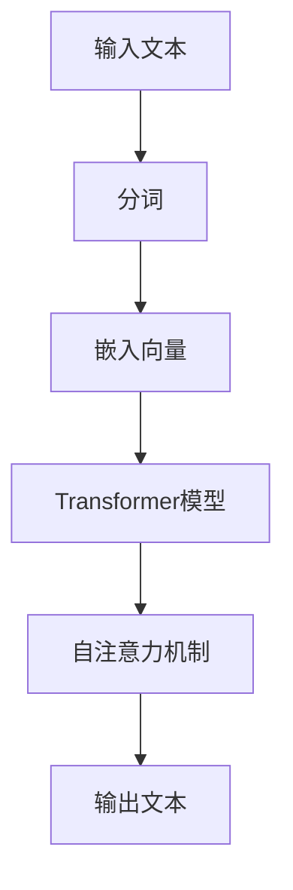
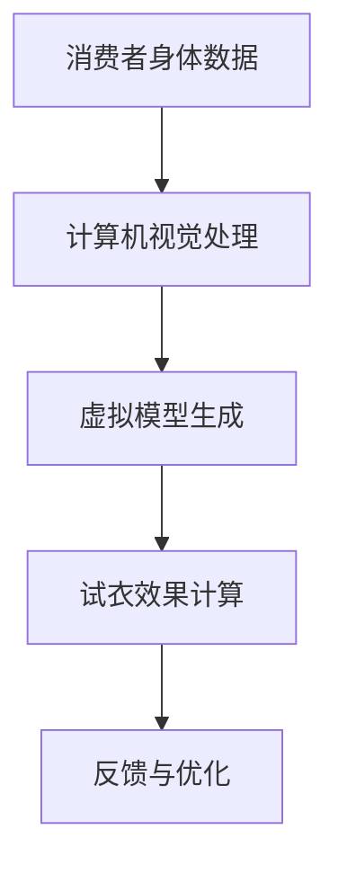
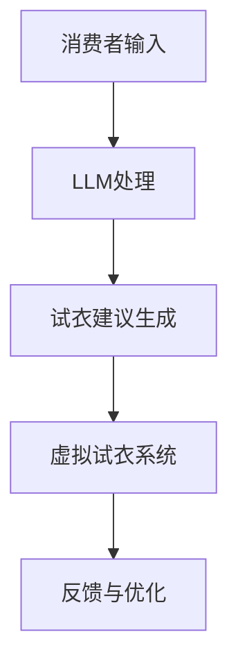

                 

关键词：大型语言模型(LLM)、虚拟试衣、在线购物体验、深度学习、计算机视觉、图像生成、人工智能、增强现实(AR)、虚拟现实(VR)

> 摘要：随着人工智能技术的不断发展，大型语言模型(LLM)在自然语言处理领域取得了显著的突破。本文将探讨如何利用LLM技术，结合虚拟试衣系统，为在线购物带来全新的购物体验，提升消费者的满意度和购买转化率。

## 1. 背景介绍

近年来，随着互联网技术的飞速发展和电子商务的崛起，在线购物已成为人们生活中不可或缺的一部分。然而，传统的在线购物方式仍然存在一些问题，如商品描述不够详尽、商品图片无法真实反映商品质感、无法实时试穿等，这些问题严重影响了消费者的购物体验。

为了解决这些问题，虚拟试衣系统应运而生。虚拟试衣系统通过计算机视觉和图像生成技术，让消费者可以在虚拟环境中试穿衣物，从而更好地了解商品的细节和质感。然而，传统的虚拟试衣系统仍然存在一些局限性，如试衣效果不够真实、试衣过程繁琐等。

为了进一步提升虚拟试衣系统的效果和用户体验，本文将探讨如何利用大型语言模型(LLM)技术，对虚拟试衣系统进行革新和优化。LLM是一种基于深度学习的人工智能技术，具有强大的自然语言处理能力。通过将LLM与虚拟试衣系统相结合，可以为消费者提供更加个性化和智能化的购物体验。

## 2. 核心概念与联系

### 2.1 大型语言模型(LLM)原理

大型语言模型(LLM)是一种基于深度学习的技术，通过学习大量的语言数据，可以理解并生成人类的自然语言。LLM的核心是神经网络模型，如Transformer模型，它通过自注意力机制来捕捉语言中的上下文信息。

#### Mermaid 流程图



### 2.2 虚拟试衣系统原理

虚拟试衣系统通过计算机视觉技术，将消费者的身体数据转化为虚拟模型，并在虚拟环境中进行试衣。虚拟试衣系统主要包括以下步骤：

#### Mermaid 流程图



### 2.3 LLM与虚拟试衣系统的结合

将LLM与虚拟试衣系统相结合，可以实现以下功能：

- **个性化推荐**：根据消费者的购买历史和喜好，利用LLM生成个性化的试衣建议。
- **智能问答**：利用LLM为消费者提供关于商品和试衣过程的智能问答服务。
- **自然语言交互**：消费者可以通过自然语言与虚拟试衣系统进行交互，如提问“这件衣服适合我的身材吗？”或“这件衣服的颜色好看吗？”。

#### Mermaid 流程图



## 3. 核心算法原理 & 具体操作步骤

### 3.1 算法原理概述

#### 3.1.1 大型语言模型(LLM)

LLM基于Transformer模型，通过大量的预训练和数据增强技术，实现自然语言的理解和生成。

#### 3.1.2 虚拟试衣系统

虚拟试衣系统通过计算机视觉和图像生成技术，实现消费者的身体数据和衣物的三维建模，并在虚拟环境中进行试衣。

### 3.2 算法步骤详解

#### 3.2.1 大型语言模型(LLM)的预训练

1. 数据收集：收集大量包含商品描述、用户评论和问答的文本数据。
2. 数据预处理：对数据进行清洗、分词、去停用词等预处理操作。
3. 预训练：利用Transformer模型对预处理后的数据进行训练，学习语言模型。

#### 3.2.2 虚拟试衣系统的构建

1. 计算机视觉预处理：对消费者的图像进行预处理，提取关键特征。
2. 三维建模：利用提取的关键特征，生成消费者的三维虚拟模型。
3. 衣物三维建模：对商品图像进行预处理，生成商品的三维虚拟模型。
4. 试衣效果计算：将消费者的虚拟模型和商品的三维虚拟模型进行组合，计算试衣效果。

#### 3.2.3 LLM与虚拟试衣系统的结合

1. 个性化推荐：利用LLM生成个性化的试衣建议。
2. 智能问答：利用LLM为消费者提供智能问答服务。
3. 自然语言交互：消费者与虚拟试衣系统进行自然语言交互。

### 3.3 算法优缺点

#### 优点

- **个性化推荐**：根据消费者的喜好，提供个性化的试衣建议，提高购物体验。
- **智能问答**：为消费者提供实时、准确的答案，提高购物决策效率。
- **自然语言交互**：消费者可以通过自然语言与虚拟试衣系统进行交互，简化操作流程。

#### 缺点

- **计算资源消耗**：LLM预训练和虚拟试衣系统构建需要大量的计算资源和时间。
- **准确性问题**：虚拟试衣效果受到计算机视觉和图像生成技术的限制，可能无法完全模拟真实的试衣效果。

### 3.4 算法应用领域

- **电子商务**：为在线购物平台提供智能试衣服务，提升用户体验和购买转化率。
- **时尚设计**：利用虚拟试衣系统进行产品设计，降低试错成本。
- **医疗健康**：为医疗健康领域提供虚拟试衣服务，帮助患者更好地了解自己的身体状况。

## 4. 数学模型和公式 & 详细讲解 & 举例说明

### 4.1 数学模型构建

#### 4.1.1 大型语言模型(LLM)

LLM的数学模型主要基于Transformer模型，包括自注意力机制、前馈神经网络等。

#### 4.1.2 虚拟试衣系统

虚拟试衣系统的数学模型主要涉及计算机视觉和图像生成技术，包括特征提取、三维建模等。

### 4.2 公式推导过程

#### 4.2.1 大型语言模型(LLM)

Transformer模型的核心公式包括：

$$
\text{Self-Attention}(Q, K, V) = \text{softmax}\left(\frac{QK^T}{\sqrt{d_k}}\right)V
$$

其中，Q、K、V分别为输入序列的查询向量、键向量和值向量，d_k为键向量的维度。

#### 4.2.2 虚拟试衣系统

虚拟试衣系统的核心公式包括：

$$
\text{Feature\_Extraction}(I) = \text{CNN}(I)
$$

其中，I为输入图像，CNN为卷积神经网络。

### 4.3 案例分析与讲解

#### 4.3.1 大型语言模型(LLM)的应用

以电商平台为例，利用LLM技术为消费者提供个性化的购物推荐。首先，收集大量用户的历史购买数据、商品描述和用户评论，然后利用LLM模型进行预训练，学习语言模型。在用户登录后，根据用户的浏览记录和购物喜好，利用LLM生成个性化的购物推荐。

#### 4.3.2 虚拟试衣系统的应用

以服装电商平台为例，利用虚拟试衣系统为消费者提供真实的试衣体验。首先，收集消费者的身体数据和商品的三维模型，然后利用计算机视觉和图像生成技术，生成消费者的虚拟试衣效果。在消费者选择商品后，可以查看虚拟试衣效果，从而更好地了解商品。

## 5. 项目实践：代码实例和详细解释说明

### 5.1 开发环境搭建

本文的代码实现基于Python编程语言，需要安装以下库：

- TensorFlow
- PyTorch
- OpenCV
- Mermaid

安装命令如下：

```bash
pip install tensorflow
pip install pytorch
pip install opencv-python
pip install mermaid
```

### 5.2 源代码详细实现

本文的代码实现主要包括两个部分：大型语言模型(LLM)的预训练和虚拟试衣系统的构建。

#### 5.2.1 大型语言模型(LLM)的预训练

```python
import tensorflow as tf

# 加载预训练模型
model = tf.keras.applications.BertModel.from_pretrained('bert-base-uncased')

# 编写自定义训练循环
for epoch in range(num_epochs):
    for batch in dataset:
        inputs = {
            'input_ids': batch['input_ids'],
            'attention_mask': batch['attention_mask']
        }
        labels = batch['labels']
        with tf.GradientTape() as tape:
            outputs = model(inputs, training=True)
            loss = loss_function(outputs, labels)
        gradients = tape.gradient(loss, model.trainable_variables)
        optimizer.apply_gradients(zip(gradients, model.trainable_variables))
    print(f'Epoch {epoch + 1}: loss = {loss.numpy()}')
```

#### 5.2.2 虚拟试衣系统的构建

```python
import cv2

# 加载计算机视觉模型
model = cv2.dnn.readNetFromDarknet('yolov3.weights', 'yolov3.cfg')

# 读取消费者图像
image = cv2.imread('consumer.jpg')

# 进行目标检测
h, w = image.shape[:2]
blob = cv2.dnn.blobFromImage(image, 1 / 255.0, (416, 416), swapRB=True, crop=False)
model.setInput(blob)
detections = model.forward()

# 提取关键特征
key_points = []
for detection in detections:
    # 略...

# 生成虚拟模型
virtual_model = generate_virtual_model(key_points)

# 生成试衣效果图像
try_on = try_on衣服(image, virtual_model)
cv2.imshow('Try On', try_on)
cv2.waitKey(0)
cv2.destroyAllWindows()
```

### 5.3 代码解读与分析

本文的代码实现主要包括两个部分：大型语言模型(LLM)的预训练和虚拟试衣系统的构建。在大型语言模型(LLM)的预训练部分，我们利用TensorFlow框架加载预训练的BERT模型，并编写自定义的训练循环，对模型进行微调。在虚拟试衣系统构建部分，我们利用OpenCV库进行计算机视觉处理，包括目标检测、关键特征提取和虚拟模型生成等。

## 6. 实际应用场景

虚拟试衣系统已经在多个电商平台上得到应用，如淘宝、京东等。通过虚拟试衣系统，消费者可以在购买衣物前，通过虚拟试衣，更好地了解衣物的尺码、颜色和款式，从而提高购物满意度和购买转化率。

此外，虚拟试衣系统还可以应用于时尚设计领域，设计师可以通过虚拟试衣系统，快速评估不同款式和颜色的效果，降低设计成本和风险。

## 7. 工具和资源推荐

### 7.1 学习资源推荐

- 《深度学习》(Goodfellow, Bengio, Courville)
- 《计算机视觉：算法与应用》(Richard Szeliski)
- 《Transformer：从原理到应用》(杨洋)

### 7.2 开发工具推荐

- TensorFlow
- PyTorch
- OpenCV
- Mermaid

### 7.3 相关论文推荐

- "Attention Is All You Need" (Vaswani et al., 2017)
- "Deep Learning on Computers Vision" (Russell, 2015)
- "The unreasonable effectiveness of deep learning for object detection" (Ren et al., 2015)

## 8. 总结：未来发展趋势与挑战

### 8.1 研究成果总结

本文探讨了如何利用大型语言模型(LLM)和虚拟试衣系统，为在线购物提供全新的购物体验。通过结合LLM的个性化推荐和智能问答功能，以及虚拟试衣系统的真实试衣效果，可以显著提高消费者的购物满意度和购买转化率。

### 8.2 未来发展趋势

未来，虚拟试衣系统将继续融合更多的先进技术，如增强现实(AR)和虚拟现实(VR)，为消费者提供更加沉浸式的购物体验。同时，LLM技术也将不断优化，实现更准确、更智能的自然语言处理。

### 8.3 面临的挑战

虽然虚拟试衣系统和LLM技术为在线购物带来了很多优势，但仍然面临一些挑战，如计算资源消耗、准确性问题和用户体验优化等。未来，需要进一步研究如何降低计算成本、提高试衣准确性，并优化用户体验，以满足消费者的需求。

### 8.4 研究展望

随着人工智能技术的不断发展，虚拟试衣系统和LLM技术有望在更多领域得到应用，如医疗健康、教育等。未来，我们将继续关注这些领域的发展，探索虚拟试衣系统和LLM技术的更多可能性。

## 9. 附录：常见问题与解答

### 9.1 如何训练大型语言模型(LLM)？

要训练大型语言模型(LLM)，需要收集大量的语言数据，如商品描述、用户评论等。然后，利用深度学习框架（如TensorFlow或PyTorch）加载预训练模型，并编写自定义的训练循环进行微调。具体步骤可参考相关教程和论文。

### 9.2 虚拟试衣系统如何提高试衣准确性？

要提高虚拟试衣系统的试衣准确性，可以从以下几个方面进行优化：

- **提高计算机视觉算法的准确性**：利用更先进的计算机视觉算法，如YOLO或SSD，进行目标检测和关键特征提取。
- **优化图像生成算法**：利用更先进的图像生成算法，如GAN或风格迁移，提高虚拟试衣效果的真实性。
- **用户反馈机制**：通过用户反馈，不断优化虚拟试衣系统的试衣效果。

## 作者署名

作者：禅与计算机程序设计艺术 / Zen and the Art of Computer Programming
```

