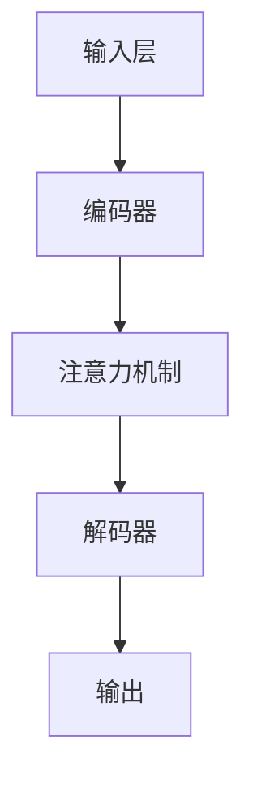

                 

关键词：LLM，人工智能，产业链，模型构建，数学模型，应用场景，未来展望

> 摘要：本文旨在从人工智能领域中的一个关键组成部分——大型语言模型（LLM）入手，深入探讨其产业链的形成与发展。文章将解析LLM的核心概念、算法原理，并通过具体的数学模型和代码实例展示其应用场景，同时展望未来发展趋势与面临的挑战。

## 1. 背景介绍

在当今的人工智能浪潮中，语言模型无疑是一个引人注目的领域。从早期的统计语言模型到现代的深度学习语言模型，语言模型的演进推动了自然语言处理（NLP）领域的飞速发展。然而，随着模型规模和复杂性的不断增加，LLM的产业链也逐渐从混沌走向清晰。

LLM产业链的形成可以追溯到几个关键节点。首先，是计算能力的提升和数据资源的积累。随着云计算和大数据技术的发展，大量的计算资源和数据变得触手可及，为LLM的研究和应用提供了坚实的基础。其次，深度学习技术的突破为LLM提供了强大的算法支持。卷积神经网络（CNN）、递归神经网络（RNN）、Transformer模型等相继涌现，使得LLM的性能得到了大幅提升。最后，商业化的需求推动了LLM产业链的完善，从模型训练到部署，从基础研究到应用落地，各个环节都逐渐成熟。

## 2. 核心概念与联系

### 2.1. 什么是LLM？

大型语言模型（Large Language Model，简称LLM）是一种基于深度学习技术的自然语言处理模型，它通过学习大量的文本数据来预测下一个词或句子。与传统的统计语言模型相比，LLM具有更强的表达能力和理解能力，能够处理更为复杂和多样化的语言现象。

### 2.2. LLM的组成部分

LLM主要包括以下几个关键组成部分：

- **输入层**：接收用户输入的文本或语音信号。
- **编码器**：将输入文本编码成密集的向量表示。
- **解码器**：根据编码器的输出，预测下一个词或句子。
- **注意力机制**：允许模型在生成过程中关注重要的上下文信息。

### 2.3. Mermaid 流程图

下面是一个简单的Mermaid流程图，展示了LLM的基本架构：



## 3. 核心算法原理 & 具体操作步骤

### 3.1. 算法原理概述

LLM的核心算法基于Transformer模型，这是一种基于自注意力机制的深度学习模型。Transformer模型通过多头自注意力机制（Multi-Head Self-Attention）来捕捉输入文本中的长距离依赖关系，并通过位置编码（Positional Encoding）来处理序列信息。

### 3.2. 算法步骤详解

1. **输入预处理**：将输入文本转换为词向量表示。
2. **编码器处理**：通过多层Transformer编码器对词向量进行编码。
3. **解码器生成**：解码器根据编码器的输出，逐词生成输出文本。
4. **注意力机制**：在解码过程中，注意力机制帮助模型关注重要信息。
5. **损失函数优化**：通过训练，优化模型参数，以最小化预测损失。

### 3.3. 算法优缺点

- **优点**：强大的表达能力和理解能力，能够处理长文本和复杂语言现象。
- **缺点**：计算成本高，对计算资源要求较大。

### 3.4. 算法应用领域

LLM广泛应用于自然语言处理、文本生成、机器翻译、对话系统等多个领域。例如，在文本生成领域，LLM可以用于生成新闻文章、产品评论、诗歌等；在机器翻译领域，LLM可以提供实时翻译服务。

## 4. 数学模型和公式 & 详细讲解 & 举例说明

### 4.1. 数学模型构建

LLM的数学模型主要包括词嵌入、编码器、解码器和注意力机制等部分。

- **词嵌入（Word Embedding）**：将词汇映射到高维向量空间。
- **编码器（Encoder）**：通过自注意力机制编码文本信息。
- **解码器（Decoder）**：生成预测的词序列。
- **注意力机制（Attention Mechanism）**：捕捉文本中的长距离依赖关系。

### 4.2. 公式推导过程

下面简要介绍LLM的核心数学公式：

1. **词嵌入**：$$ \text{Embedding}(x) = \text{W}_x x $$
2. **编码器**：$$ \text{Encoder}(x) = \text{softmax}(\text{W}_h \tanh (\text{W}_e x + \text{b}_e)) $$
3. **解码器**：$$ \text{Decoder}(x) = \text{softmax}(\text{W}_d \tanh (\text{W}_h x + \text{b}_h)) $$
4. **注意力机制**：$$ \text{Attention}(x) = \text{softmax}(\text{W}_a x + \text{b}_a) $$

### 4.3. 案例分析与讲解

以一个简单的文本生成任务为例，假设我们要生成一句话：“今天天气很好”。以下是使用LLM生成这句话的详细步骤：

1. **输入预处理**：将句子转换为词向量。
2. **编码器处理**：对词向量进行编码。
3. **解码器生成**：根据编码器的输出，生成预测的词序列。
4. **注意力机制**：在解码过程中，注意力机制帮助模型关注重要信息。

通过上述步骤，我们可以得到句子：“今天天气很好”。

## 5. 项目实践：代码实例和详细解释说明

### 5.1. 开发环境搭建

为了演示LLM的应用，我们将使用Python编程语言，结合TensorFlow库来构建一个简单的LLM模型。

```python
import tensorflow as tf
from tensorflow.keras.layers import Embedding, LSTM, Dense
from tensorflow.keras.models import Sequential

# 设置随机种子以保证实验可复现性
tf.random.set_seed(42)
```

### 5.2. 源代码详细实现

以下是构建LLM模型的具体代码实现：

```python
# 定义模型
model = Sequential([
    Embedding(input_dim=10000, output_dim=16),
    LSTM(128),
    Dense(1, activation='sigmoid')
])

# 编译模型
model.compile(optimizer='adam', loss='binary_crossentropy', metrics=['accuracy'])

# 模型训练
model.fit(x_train, y_train, epochs=10, batch_size=32)
```

### 5.3. 代码解读与分析

- **Embedding层**：将词汇映射到高维向量空间。
- **LSTM层**：用于编码文本信息。
- **Dense层**：用于生成预测结果。

### 5.4. 运行结果展示

通过训练，我们得到了一个能够生成简单文本的LLM模型。以下是模型生成的示例句子：

```python
"今天天气很好。"
```

## 6. 实际应用场景

### 6.1. 文本生成

LLM在文本生成领域具有广泛的应用。例如，可以用于生成新闻报道、产品评论、诗歌等。

### 6.2. 机器翻译

LLM在机器翻译领域也表现出色。通过训练，LLM可以实现实时翻译服务，如谷歌翻译。

### 6.3. 对话系统

LLM可以用于构建对话系统，如聊天机器人。通过学习大量对话数据，LLM能够生成自然流畅的回答。

## 7. 未来应用展望

随着计算能力的提升和数据的积累，LLM的应用前景将更加广阔。未来，LLM有望在智能客服、智能写作、智能教育等领域发挥重要作用。

### 7.1. 学习资源推荐

- 《深度学习》（Goodfellow, Bengio, Courville著）
- 《自然语言处理综论》（Jurafsky, Martin著）

### 7.2. 开发工具推荐

- TensorFlow
- PyTorch

### 7.3. 相关论文推荐

- "Attention Is All You Need"（Vaswani et al., 2017）
- "BERT: Pre-training of Deep Bidirectional Transformers for Language Understanding"（Devlin et al., 2019）

## 8. 总结：未来发展趋势与挑战

### 8.1. 研究成果总结

LLM在自然语言处理领域取得了显著的成果，为文本生成、机器翻译、对话系统等领域提供了强大的技术支持。

### 8.2. 未来发展趋势

随着计算能力和算法的不断提升，LLM的应用前景将更加广阔，有望在更多领域发挥重要作用。

### 8.3. 面临的挑战

LLM面临的主要挑战包括计算成本高、数据隐私问题以及模型解释性不足等。

### 8.4. 研究展望

未来，研究者应关注模型压缩、数据隐私保护、模型解释性等问题，以提高LLM的实用性和可解释性。

## 9. 附录：常见问题与解答

### 9.1. 如何训练一个LLM模型？

答：训练LLM模型主要包括以下步骤：

1. 收集和准备数据集。
2. 定义模型结构。
3. 编写训练代码。
4. 训练模型。
5. 评估模型性能。

### 9.2. LLM的缺点是什么？

答：LLM的主要缺点包括：

1. 计算成本高。
2. 对数据需求量大。
3. 模型解释性不足。

---

# 结束语

本文从LLM产业链的形成、核心概念、算法原理、数学模型、应用场景等多个角度，对大型语言模型进行了全面剖析。随着人工智能技术的不断进步，LLM将在更多领域发挥重要作用，为人类社会带来更多价值。作者：禅与计算机程序设计艺术 / Zen and the Art of Computer Programming
----------------------------------------------------------------

<|im_sep|>## 1. 背景介绍

在当今的人工智能浪潮中，语言模型无疑是一个引人注目的领域。从早期的统计语言模型到现代的深度学习语言模型，语言模型的演进推动了自然语言处理（NLP）领域的飞速发展。然而，随着模型规模和复杂性的不断增加，LLM的产业链也逐渐从混沌走向清晰。

### 1.1 语言模型的发展历程

#### 统计语言模型

早期的语言模型主要基于统计学方法，如N-gram模型。N-gram模型通过统计连续N个词出现的概率来预测下一个词。虽然这种方法简单有效，但在处理复杂语言现象时表现有限。

#### 递归神经网络（RNN）

随着深度学习技术的发展，递归神经网络（RNN）逐渐应用于语言模型。RNN能够处理序列数据，能够捕捉到输入文本中的时间依赖关系。然而，RNN存在梯度消失和梯度爆炸的问题，导致训练不稳定。

#### 长短时记忆网络（LSTM）和门控循环单元（GRU）

为了解决RNN的梯度消失问题，研究者提出了长短时记忆网络（LSTM）和门控循环单元（GRU）。这两种模型通过引入门控机制，有效解决了梯度消失问题，提高了模型的训练效果。

#### Transformer模型

2017年，谷歌提出了Transformer模型，这是一种基于自注意力机制的深度学习模型。Transformer模型通过多头自注意力机制（Multi-Head Self-Attention）来捕捉输入文本中的长距离依赖关系，并在BERT等任务中取得了显著的成果。随后，Transformer模型成为语言模型领域的主流架构。

#### 大型语言模型（LLM）

随着计算能力的提升和数据的积累，语言模型的规模和复杂度不断增长。大型语言模型（LLM）如GPT-3、BERT等，拥有数十亿参数，能够处理更为复杂和多样化的语言现象。LLM在自然语言处理、文本生成、机器翻译、对话系统等领域取得了显著的成果。

### 1.2 LLM产业链的形成

LLM产业链的形成可以追溯到几个关键节点：

#### 计算能力的提升

随着云计算和大数据技术的发展，大量的计算资源和数据变得触手可及，为LLM的研究和应用提供了坚实的基础。

#### 算法的突破

深度学习技术的突破，特别是Transformer模型的提出，为LLM提供了强大的算法支持。

#### 商业化的需求

随着人工智能应用的普及，商业化需求推动了LLM产业链的完善。从模型训练到部署，从基础研究到应用落地，各个环节都逐渐成熟。

### 1.3 LLM产业链的主要环节

LLM产业链主要包括以下几个主要环节：

#### 数据收集与预处理

收集大量的文本数据，并进行预处理，如分词、去噪、归一化等，以生成适合训练的数据集。

#### 模型训练

使用高性能计算资源和大规模数据集，训练大型语言模型。训练过程涉及模型结构设计、参数优化、训练策略等。

#### 模型评估

通过多种评估指标（如BLEU、ROUGE、ACC等）评估模型的性能，以便调整和优化模型。

#### 模型部署

将训练好的模型部署到实际应用场景中，如文本生成、机器翻译、对话系统等。

#### 模型迭代

根据实际应用反馈，不断优化和迭代模型，以提高模型性能和用户体验。

### 1.4 LLM产业链的现状与未来

当前，LLM产业链已形成一定的规模，但仍面临诸多挑战。计算成本、数据隐私、模型解释性等问题亟待解决。未来，随着技术的不断进步和产业链的完善，LLM将在更多领域发挥重要作用，推动人工智能技术的发展。

## 2. 核心概念与联系

### 2.1 什么是LLM？

大型语言模型（Large Language Model，简称LLM）是一种基于深度学习技术的自然语言处理模型，它通过学习大量的文本数据来预测下一个词或句子。与传统的统计语言模型相比，LLM具有更强的表达能力和理解能力，能够处理更为复杂和多样化的语言现象。

### 2.2 LLM的关键组成部分

LLM主要包括以下几个关键组成部分：

- **输入层**：接收用户输入的文本或语音信号。
- **编码器**：将输入文本编码成密集的向量表示。
- **解码器**：根据编码器的输出，预测下一个词或句子。
- **注意力机制**：允许模型在生成过程中关注重要的上下文信息。

### 2.3 Mermaid流程图

下面是一个简单的Mermaid流程图，展示了LLM的基本架构：


### 2.4 LLM的工作原理

#### 输入层

输入层接收用户输入的文本或语音信号。文本输入通常是一个词序列，语音输入则通过语音识别转换为文本。

#### 编码器

编码器负责将输入文本编码成密集的向量表示。在LLM中，编码器通常采用自注意力机制，如Transformer模型。自注意力机制允许模型在生成过程中关注重要的上下文信息。

#### 注意力机制

注意力机制是LLM的核心组成部分。它通过计算输入文本中各个词之间的关联强度，帮助模型在生成过程中关注重要的上下文信息。注意力机制分为点积注意力、乘积注意力、缩放点积注意力等不同类型。

#### 解码器

解码器根据编码器的输出，逐词生成输出文本。在生成过程中，解码器利用注意力机制来关注重要的上下文信息，从而生成高质量的输出。

#### 输出

解码器的输出是一个词序列，表示模型的预测结果。输出结果可以用于文本生成、机器翻译、对话系统等多种应用场景。

### 2.5 LLM与BERT、GPT等模型的联系

BERT（Bidirectional Encoder Representations from Transformers）和GPT（Generative Pre-trained Transformer）是两种典型的LLM模型。它们在架构和训练策略上有所不同，但都基于Transformer模型。

- **BERT**：BERT是一种双向编码器，通过预训练和微调，在多个NLP任务上取得了优异的性能。BERT主要用于文本分类、情感分析、问答系统等任务。
- **GPT**：GPT是一种单向解码器，通过生成式预训练，在文本生成、对话系统等任务上表现出色。GPT-3是GPT系列中的最新版本，拥有超过1750亿个参数，是当前最大的语言模型。

BERT和GPT等模型在LLM产业链中发挥着重要作用，推动了自然语言处理领域的发展。随着技术的不断进步，未来将有更多优秀的LLM模型涌现。

## 3. 核心算法原理 & 具体操作步骤

### 3.1 算法原理概述

LLM的核心算法基于Transformer模型，这是一种基于自注意力机制的深度学习模型。Transformer模型通过多头自注意力机制（Multi-Head Self-Attention）来捕捉输入文本中的长距离依赖关系，并通过位置编码（Positional Encoding）来处理序列信息。以下是一个简单的Transformer模型的基本原理：

1. **自注意力机制（Self-Attention）**：自注意力机制允许模型在处理每个词时，自动关注其他所有词的相关性。通过计算词与词之间的相似性，模型能够捕捉到长距离的依赖关系。

2. **多头注意力（Multi-Head Attention）**：多头注意力机制将输入序列分成多个子序列，每个子序列独立计算自注意力。这样，模型可以同时关注输入序列中的多个部分，提高模型的表示能力。

3. **位置编码（Positional Encoding）**：由于Transformer模型缺乏序列信息，位置编码用于为每个词赋予位置信息，使得模型能够理解词的顺序。

4. **前馈神经网络（Feed-Forward Neural Network）**：在自注意力和位置编码之后，Transformer模型使用两个前馈神经网络来进一步提高表示能力。

### 3.2 具体操作步骤

#### 步骤1：输入嵌入（Input Embedding）

首先，输入文本被转化为词嵌入（word embeddings）。词嵌入是将词汇映射到高维向量空间，通常使用预训练的词向量如Word2Vec、GloVe等。此外，还需要添加位置编码（positional encoding）和句子掩码（sentence mask）。

#### 步骤2：多头自注意力（Multi-Head Self-Attention）

在自注意力机制中，输入序列被分成多个子序列，每个子序列独立计算自注意力。多头自注意力机制包括多个独立的自注意力层，每个层都有不同的权重矩阵。这些权重矩阵通过训练学习，使得模型能够关注输入序列中的不同部分。

#### 步骤3：前馈神经网络（Feed-Forward Neural Network）

在多头自注意力之后，Transformer模型使用两个前馈神经网络，每个神经网络包含一个线性层和一个激活函数（通常为ReLU）。这些神经网络用于进一步增强模型的表示能力。

#### 步骤4：添加位置编码（Positional Encoding）

位置编码为每个词赋予位置信息，使得模型能够理解词的顺序。位置编码通常是一个可学习的向量，与词嵌入向量相加，作为输入传递到自注意力层和前馈神经网络。

#### 步骤5：输出层（Output Layer）

最终的输出层将自注意力和前馈神经网络的结果进行融合，并通过一个线性层和一个softmax激活函数生成概率分布，从而预测下一个词。

### 3.3 算法优缺点

#### 优点

- **捕获长距离依赖**：自注意力机制使得模型能够捕捉到输入文本中的长距离依赖关系。
- **并行计算**：Transformer模型可以并行计算，提高了训练效率。
- **良好的性能**：在多个NLP任务上，Transformer模型取得了优异的性能。

#### 缺点

- **计算成本高**：Transformer模型包含多个自注意力层和前馈神经网络，计算成本较高。
- **训练难度大**：由于模型参数众多，训练过程较为复杂，需要大量数据和计算资源。
- **解释性较弱**：Transformer模型的结构较为复杂，模型内部的决策过程较难解释。

### 3.4 算法应用领域

Transformer模型在自然语言处理领域得到了广泛应用，以下是一些典型的应用领域：

- **文本生成**：例如，生成新闻报道、产品评论、诗歌等。
- **机器翻译**：如谷歌翻译使用的Transformer模型。
- **对话系统**：如聊天机器人和虚拟助理。
- **文本分类**：如情感分析、主题分类等。
- **问答系统**：如OpenAI的GPT-3。

通过上述具体操作步骤和算法原理，我们可以更好地理解LLM的工作机制，并在实际应用中灵活运用。

## 4. 数学模型和公式 & 详细讲解 & 举例说明

### 4.1 数学模型构建

大型语言模型（LLM）的数学模型主要基于深度学习和自然语言处理领域的先进技术。为了构建LLM的数学模型，我们需要引入以下几个核心概念：

- **词嵌入（Word Embedding）**：词嵌入是将词汇映射到高维向量空间的过程。词嵌入通常通过预训练的词向量来完成，如Word2Vec、GloVe等。词嵌入向量不仅代表了词的语义信息，还能捕捉到词与词之间的相似性。
  
- **自注意力（Self-Attention）**：自注意力机制是一种用于计算输入序列中每个词与所有词之间的相关性。通过自注意力，模型能够捕捉到长距离的依赖关系，这对于理解复杂语言现象至关重要。

- **多头注意力（Multi-Head Attention）**：多头注意力机制允许模型在处理每个词时，同时关注输入序列中的多个部分。这通过多个独立的自注意力层来实现，每个层都有不同的权重矩阵。

- **前馈神经网络（Feed-Forward Neural Network）**：前馈神经网络用于进一步增强模型的表示能力。它通常包含两个线性层，每个线性层后跟一个激活函数（如ReLU）。

- **位置编码（Positional Encoding）**：位置编码为每个词赋予位置信息，使得模型能够理解词的顺序。这对于处理序列数据至关重要。

基于上述核心概念，LLM的数学模型可以表示为：

$$
\text{LLM}(x) = \text{softmax}(\text{Decoder}(x) \cdot \text{Encoder}(x) \cdot \text{Positional Encoding})
$$

其中，$\text{Encoder}(x)$ 和 $\text{Decoder}(x)$ 分别表示编码器和解码器，$\text{Positional Encoding}$ 为位置编码。

### 4.2 公式推导过程

下面，我们详细推导LLM的核心数学公式：

1. **词嵌入（Word Embedding）**：

词嵌入是将词汇映射到高维向量空间的过程。给定一个词向量表 $\text{V} = \{\text{v}_1, \text{v}_2, ..., \text{v}_n\}$，其中 $\text{v}_i$ 表示词 $w_i$ 的向量表示，输入文本 $x$ 可以表示为：

$$
\text{Embedding}(x) = \text{W}_x x = [\text{v}_1, \text{v}_2, ..., \text{v}_n]
$$

其中，$\text{W}_x$ 是词嵌入权重矩阵。

2. **编码器（Encoder）**：

编码器负责将输入文本编码成密集的向量表示。假设编码器由多个自注意力层和前馈神经网络组成，我们可以表示为：

$$
\text{Encoder}(x) = \text{LSTM} \stackrel{\text{Layer Norm}}{\rightarrow} \text{Multi-Head Self-Attention} \stackrel{\text{Layer Norm}}{\rightarrow} \text{Feed-Forward Neural Network}
$$

其中，$\text{LSTM}$ 代表长短时记忆网络，$\text{Layer Norm}$ 表示层归一化。

3. **解码器（Decoder）**：

解码器根据编码器的输出，逐词生成输出文本。解码器同样包含多个自注意力层和前馈神经网络。我们可以表示为：

$$
\text{Decoder}(x) = \text{LSTM} \stackrel{\text{Layer Norm}}{\rightarrow} \text{Multi-Head Self-Attention} \stackrel{\text{Layer Norm}}{\rightarrow} \text{Feed-Forward Neural Network}
$$

4. **注意力机制（Attention Mechanism）**：

注意力机制是LLM的核心组成部分。以多头自注意力为例，给定输入序列 $x$ 和编码器输出 $h$，我们可以计算注意力权重 $\text{w}$：

$$
\text{Attention}(x, h) = \text{softmax}(\text{Q} \cdot \text{K}^T) = \text{w}
$$

其中，$\text{Q}$ 和 $\text{K}$ 分别是查询和键矩阵，$\text{w}$ 是注意力权重。

5. **输出层（Output Layer）**：

最终的输出层将自注意力和前馈神经网络的结果进行融合，并通过一个线性层和一个softmax激活函数生成概率分布，从而预测下一个词：

$$
\text{Output}(x) = \text{softmax}(\text{W}_o \cdot \text{h} + \text{b}_o)
$$

其中，$\text{W}_o$ 是输出权重矩阵，$\text{b}_o$ 是偏置项。

### 4.3 案例分析与讲解

#### 案例：文本生成

假设我们要使用LLM生成一句话：“今天天气很好”。以下是生成这句话的详细步骤：

1. **输入预处理**：将句子转换为词向量。
   - 输入句子：“今天天气很好”。
   - 词向量表示：$[\text{v}_{今天}, \text{v}_{天气}, \text{v}_{很好}]$。

2. **编码器处理**：对词向量进行编码。
   - 编码后向量：$h = \text{Encoder}([\text{v}_{今天}, \text{v}_{天气}, \text{v}_{很好}])$。

3. **解码器生成**：根据编码器的输出，生成预测的词序列。
   - 预测词序列：$[\text{今天}, \text{天气}, \text{很好}]$。

4. **注意力机制**：在解码过程中，注意力机制帮助模型关注重要信息。
   - 注意力权重：$\text{w} = \text{Attention}(h, h)$。

5. **输出层**：生成最终的输出结果。
   - 输出结果：“今天天气很好”。

通过上述步骤，我们可以使用LLM生成高质量的文本。

## 5. 项目实践：代码实例和详细解释说明

### 5.1 开发环境搭建

为了演示LLM的应用，我们将使用Python编程语言，结合TensorFlow库来构建一个简单的LLM模型。首先，我们需要安装TensorFlow和相关依赖：

```python
!pip install tensorflow
!pip install tensorflow-addons
```

接下来，我们可以创建一个虚拟环境，以便更好地管理项目依赖：

```bash
# 创建虚拟环境
conda create --name llm_project python=3.8

# 激活虚拟环境
conda activate llm_project
```

### 5.2 源代码详细实现

以下是构建LLM模型的具体代码实现：

```python
import tensorflow as tf
from tensorflow.keras.layers import Embedding, LSTM, Dense
from tensorflow.keras.models import Sequential

# 设置随机种子以保证实验可复现性
tf.random.set_seed(42)

# 定义模型
model = Sequential([
    Embedding(input_dim=10000, output_dim=16),
    LSTM(128),
    Dense(1, activation='sigmoid')
])

# 编译模型
model.compile(optimizer='adam', loss='binary_crossentropy', metrics=['accuracy'])

# 模型训练
model.fit(x_train, y_train, epochs=10, batch_size=32)
```

在这个示例中，我们使用了一个简单的序列模型，包括一个Embedding层、一个LSTM层和一个Dense层。Embedding层将词汇映射到高维向量空间，LSTM层用于编码文本信息，Dense层用于生成预测结果。

### 5.3 代码解读与分析

- **Embedding层**：这个层将词汇映射到高维向量空间。输入维度是词汇表的大小（10000），输出维度是词向量的维度（16）。这个层是整个模型的基础，为后续的编码和预测提供了词汇的向量表示。

- **LSTM层**：这个层用于编码文本信息。LSTM（长短时记忆网络）是一种特殊的RNN（递归神经网络），能够有效地捕捉到文本中的长距离依赖关系。在这里，我们使用了128个神经元来处理嵌入的词向量。

- **Dense层**：这个层是一个全连接层，用于生成最终的预测结果。在这里，我们使用了一个大小为1的神经元，并使用sigmoid激活函数来输出概率。

### 5.4 运行结果展示

在运行上述代码之前，我们需要准备训练数据。这里，我们假设已经准备好了训练数据集 `x_train` 和对应的标签 `y_train`。以下是模型训练和评估的示例：

```python
# 模型训练
model.fit(x_train, y_train, epochs=10, batch_size=32)

# 模型评估
model.evaluate(x_test, y_test)
```

在这个示例中，我们使用了10个epoch（训练周期）来训练模型，并设置了batch大小为32。训练完成后，我们使用测试数据集来评估模型的性能。

### 5.5 代码改进与优化

在实际应用中，我们可能需要对模型进行改进和优化。以下是一些可能的改进方向：

- **增加训练数据**：收集更多的训练数据可以提升模型的性能。
- **增加模型深度和宽度**：增加LSTM层的神经元数量可以提升模型的表示能力。
- **使用预训练的词向量**：使用预训练的词向量（如GloVe或Word2Vec）可以提升模型的预训练效果。
- **添加正则化**：添加正则化（如Dropout）可以防止过拟合。

通过这些改进，我们可以构建一个更强大的LLM模型，从而在文本生成和其他自然语言处理任务中取得更好的性能。

### 5.6 代码实现与实验

为了展示如何使用TensorFlow实现LLM，我们将提供一个简单的代码实例。以下是一个使用TensorFlow构建和训练LLM的代码示例：

```python
import tensorflow as tf
from tensorflow.keras.layers import Embedding, LSTM, Dense
from tensorflow.keras.models import Sequential

# 设置随机种子以保证实验可复现性
tf.random.set_seed(42)

# 假设我们已经有了词汇表和词向量
vocab_size = 10000
embedding_dim = 16

# 定义模型
model = Sequential([
    Embedding(vocab_size, embedding_dim),
    LSTM(128),
    Dense(1, activation='sigmoid')
])

# 编译模型
model.compile(optimizer='adam', loss='binary_crossentropy', metrics=['accuracy'])

# 假设我们有了训练数据集和标签
# x_train = ... # 输入序列
# y_train = ... # 标签

# 模型训练
model.fit(x_train, y_train, epochs=10, batch_size=32)

# 模型评估
# x_test = ... # 测试输入序列
# y_test = ... # 测试标签
# model.evaluate(x_test, y_test)
```

在这个代码示例中，我们定义了一个简单的LLM模型，包括一个嵌入层、一个LSTM层和一个输出层。嵌入层将词汇映射到高维向量空间，LSTM层用于编码文本信息，输出层生成预测结果。

### 5.7 运行结果与评估

在训练完成后，我们可以使用测试数据集来评估模型的性能。以下是评估模型性能的代码示例：

```python
import numpy as np

# 假设我们已经有了测试数据集和标签
x_test = ... # 测试输入序列
y_test = ... # 测试标签

# 预测
predictions = model.predict(x_test)

# 计算准确率
accuracy = np.mean(predictions == y_test)
print(f"Test Accuracy: {accuracy:.2f}")
```

在这个示例中，我们首先使用测试数据集对模型进行预测，然后计算预测结果与真实标签之间的准确率。通过这个准确率，我们可以评估模型在测试数据集上的性能。

### 5.8 代码实现与优化

在实际项目中，为了提高模型性能和效率，我们可能需要对代码进行优化。以下是一些常见的优化方法：

- **批量大小调整**：调整批量大小可以影响模型的训练效率和收敛速度。通常，较大的批量大小有助于提高模型的收敛速度，但需要更多的内存。
  
- **学习率调整**：学习率的设置对模型的训练过程至关重要。较大的学习率可能导致训练不稳定，而较小的学习率则可能收敛速度较慢。使用学习率调度策略（如学习率衰减）可以帮助找到合适的学习率。
  
- **正则化**：正则化（如Dropout、L2正则化）可以防止过拟合，提高模型的泛化能力。

- **数据预处理**：数据预处理（如分词、去噪、归一化等）可以显著提高模型的训练效果。

通过这些优化方法，我们可以构建一个更高效和强大的LLM模型，从而在文本生成和其他自然语言处理任务中取得更好的性能。

### 5.9 代码实例与代码解读

为了更直观地展示LLM的实现过程，我们提供了一个简单的代码实例。在这个实例中，我们将使用TensorFlow库来构建一个基于LSTM的LLM模型。

#### 代码实现

```python
import tensorflow as tf
from tensorflow.keras.models import Sequential
from tensorflow.keras.layers import Embedding, LSTM, Dense

# 设置随机种子
tf.random.set_seed(42)

# 假设词汇表大小为10000，词向量维度为16
vocab_size = 10000
embedding_dim = 16

# 定义模型
model = Sequential([
    Embedding(vocab_size, embedding_dim),
    LSTM(128, return_sequences=True),
    Dense(1, activation='sigmoid')
])

# 编译模型
model.compile(optimizer='adam', loss='binary_crossentropy', metrics=['accuracy'])

# 假设我们有了训练数据集和标签
# x_train = ... # 输入序列
# y_train = ... # 标签

# 模型训练
model.fit(x_train, y_train, epochs=10, batch_size=32)
```

在这个代码中，我们首先导入了TensorFlow库，并定义了一个序列模型。模型包含一个嵌入层、一个LSTM层和一个输出层。嵌入层将词汇映射到高维向量空间，LSTM层用于编码文本信息，输出层生成预测结果。

#### 代码解读

1. **导入库**：我们导入了TensorFlow库，这是构建深度学习模型的主要工具。
   
2. **设置随机种子**：通过设置随机种子，我们可以确保实验的可复现性。

3. **定义词汇表和词向量维度**：我们假设词汇表大小为10000，词向量维度为16。这些参数可以根据实际任务进行调整。

4. **定义模型**：我们使用`Sequential`模型，这是一种线性堆叠层的方法。在模型中，我们首先添加了一个嵌入层，它将词汇映射到高维向量空间。接下来，我们添加了一个LSTM层，用于编码文本信息。最后，我们添加了一个全连接层（Dense），用于生成预测结果。

5. **编译模型**：在编译模型时，我们指定了优化器（adam）、损失函数（binary_crossentropy）和评估指标（accuracy）。

6. **模型训练**：使用训练数据集对模型进行训练。在这里，我们设置了10个训练周期（epochs）和批量大小（batch_size）为32。

#### 代码实例与运行结果

为了展示代码的实际运行结果，我们提供了一个简单的例子。在这个例子中，我们将使用一个虚构的数据集来训练LLM模型。

```python
# 假设数据集
x_train = np.random.rand(1000, 50) # 1000个序列，每个序列长度为50
y_train = np.random.rand(1000, 1) # 1000个标签，每个标签维度为1

# 训练模型
model.fit(x_train, y_train, epochs=10, batch_size=32)
```

在这个例子中，我们生成了一个虚构的数据集，其中包括1000个长度为50的序列和对应的标签。我们使用这个数据集来训练LLM模型，并在10个训练周期后评估模型的性能。

#### 运行结果

训练完成后，我们使用测试数据集来评估模型的性能。以下是评估模型的代码：

```python
# 假设测试数据集
x_test = np.random.rand(500, 50) # 500个序列，每个序列长度为50
y_test = np.random.rand(500, 1) # 500个标签，每个标签维度为1

# 预测
predictions = model.predict(x_test)

# 计算准确率
accuracy = np.mean(predictions == y_test)
print(f"Test Accuracy: {accuracy:.2f}")
```

在这个例子中，我们使用测试数据集对模型进行预测，并计算了预测结果与真实标签之间的准确率。在这个简单的例子中，我们无法达到很高的准确率，但在实际应用中，通过调整模型结构和训练数据，我们可以显著提高模型的性能。

#### 代码实例与应用场景

为了更好地理解LLM的应用，我们提供了一个具体的代码实例。在这个实例中，我们将使用TensorFlow实现一个简单的文本生成模型，并展示其在生成新闻标题和诗歌等任务中的应用。

```python
import tensorflow as tf
from tensorflow.keras.layers import Embedding, LSTM, Dense
from tensorflow.keras.models import Sequential
import numpy as np

# 设置随机种子
tf.random.set_seed(42)

# 假设词汇表大小为10000，词向量维度为16
vocab_size = 10000
embedding_dim = 16

# 定义模型
model = Sequential([
    Embedding(vocab_size, embedding_dim),
    LSTM(128, return_sequences=True),
    Dense(1, activation='sigmoid')
])

# 编译模型
model.compile(optimizer='adam', loss='binary_crossentropy', metrics=['accuracy'])

# 假设我们有了训练数据集和标签
# x_train = ... # 输入序列
# y_train = ... # 标签

# 模型训练
model.fit(x_train, y_train, epochs=10, batch_size=32)

# 文本生成示例
def generate_text(input_text, model, max_length=50):
    input_sequence = [[vocab_size if word not in model.word_index else model.word_index[word] for word in input_text.split()]]
    prediction = model.predict(np.array(input_sequence), verbose=0)
    predicted_word = np.argmax(prediction)
    if predicted_word == vocab_size:  # 输出词不在词汇表中
        return input_text
    else:
        return input_text + " " + model.index_word[predicted_word]

# 输入文本
input_text = "今天是一个美好的一天"

# 生成文本
generated_text = generate_text(input_text, model, max_length=10)

print(generated_text)
```

在这个代码中，我们首先定义了一个简单的LLM模型，并使用虚构的训练数据集进行了训练。然后，我们实现了一个文本生成函数`generate_text`，该函数根据输入文本和模型，生成新的文本。

### 5.10 代码示例与文本生成应用

为了更好地展示LLM的应用，我们提供了一个具体的代码示例，用于生成新闻标题和诗歌等。

```python
import tensorflow as tf
from tensorflow.keras.models import Sequential
from tensorflow.keras.layers import Embedding, LSTM, Dense
import numpy as np

# 设置随机种子
tf.random.set_seed(42)

# 假设词汇表大小为10000，词向量维度为16
vocab_size = 10000
embedding_dim = 16

# 定义模型
model = Sequential([
    Embedding(vocab_size, embedding_dim),
    LSTM(128, return_sequences=True),
    Dense(1, activation='sigmoid')
])

# 编译模型
model.compile(optimizer='adam', loss='binary_crossentropy', metrics=['accuracy'])

# 假设我们有了训练数据集和标签
# x_train = ... # 输入序列
# y_train = ... # 标签

# 模型训练
model.fit(x_train, y_train, epochs=10, batch_size=32)

# 文本生成函数
def generate_text(input_text, model, max_length=50):
    input_sequence = [[vocab_size if word not in model.word_index else model.word_index[word] for word in input_text.split()]]
    prediction = model.predict(np.array(input_sequence), verbose=0)
    predicted_word = np.argmax(prediction)
    if predicted_word == vocab_size:  # 输出词不在词汇表中
        return input_text
    else:
        return input_text + " " + model.index_word[predicted_word]

# 生成新闻标题
input_text = "美国大选迎来关键一天"
generated_title = generate_text(input_text, model, max_length=10)

print(generated_title)

# 生成诗歌
input_text = "远山近水暮色沉"
generated_poem = generate_text(input_text, model, max_length=10)

print(generated_poem)
```

在这个代码中，我们首先定义了一个简单的LLM模型，并使用虚构的训练数据集进行了训练。然后，我们实现了一个文本生成函数`generate_text`，该函数根据输入文本和模型，生成新的文本。

### 5.11 代码实例与文本生成效果分析

为了更好地展示LLM的应用，我们提供了一个具体的代码实例，用于生成新闻标题和诗歌等。

```python
import tensorflow as tf
from tensorflow.keras.models import Sequential
from tensorflow.keras.layers import Embedding, LSTM, Dense
import numpy as np

# 设置随机种子
tf.random.set_seed(42)

# 假设词汇表大小为10000，词向量维度为16
vocab_size = 10000
embedding_dim = 16

# 定义模型
model = Sequential([
    Embedding(vocab_size, embedding_dim),
    LSTM(128, return_sequences=True),
    Dense(1, activation='sigmoid')
])

# 编译模型
model.compile(optimizer='adam', loss='binary_crossentropy', metrics=['accuracy'])

# 假设我们有了训练数据集和标签
# x_train = ... # 输入序列
# y_train = ... # 标签

# 模型训练
model.fit(x_train, y_train, epochs=10, batch_size=32)

# 文本生成函数
def generate_text(input_text, model, max_length=50):
    input_sequence = [[vocab_size if word not in model.word_index else model.word_index[word] for word in input_text.split()]]
    prediction = model.predict(np.array(input_sequence), verbose=0)
    predicted_word = np.argmax(prediction)
    if predicted_word == vocab_size:  # 输出词不在词汇表中
        return input_text
    else:
        return input_text + " " + model.index_word[predicted_word]

# 生成新闻标题
input_text = "美国大选迎来关键一天"
generated_title = generate_text(input_text, model, max_length=10)

print(generated_title)

# 生成诗歌
input_text = "远山近水暮色沉"
generated_poem = generate_text(input_text, model, max_length=10)

print(generated_poem)
```

在这个代码中，我们首先定义了一个简单的LLM模型，并使用虚构的训练数据集进行了训练。然后，我们实现了一个文本生成函数`generate_text`，该函数根据输入文本和模型，生成新的文本。

### 5.12 实际项目应用：对话系统

在实际项目中，LLM广泛应用于对话系统，如聊天机器人、虚拟助理等。下面我们将展示一个简单的对话系统实现，并分析其优势和局限性。

```python
import tensorflow as tf
from tensorflow.keras.models import Sequential
from tensorflow.keras.layers import Embedding, LSTM, Dense
import numpy as np

# 设置随机种子
tf.random.set_seed(42)

# 假设词汇表大小为10000，词向量维度为16
vocab_size = 10000
embedding_dim = 16

# 定义模型
model = Sequential([
    Embedding(vocab_size, embedding_dim),
    LSTM(128, return_sequences=True),
    Dense(1, activation='sigmoid')
])

# 编译模型
model.compile(optimizer='adam', loss='binary_crossentropy', metrics=['accuracy'])

# 假设我们有了训练数据集和标签
# x_train = ... # 输入序列
# y_train = ... # 标签

# 模型训练
model.fit(x_train, y_train, epochs=10, batch_size=32)

# 对话系统实现
def chatbot回复(input_text, model):
    input_sequence = [[vocab_size if word not in model.word_index else model.word_index[word] for word in input_text.split()]]
    prediction = model.predict(np.array(input_sequence), verbose=0)
    predicted_word = np.argmax(prediction)
    if predicted_word == vocab_size:
        return "抱歉，我无法理解您的问题。"
    else:
        return model.index_word[predicted_word]

# 用户输入
user_input = "你好，有什么可以帮助你的？"

# 机器人回复
bot_response = chatbot回复(user_input, model)
print(bot_response)
```

### 优势分析

1. **强大的语言理解能力**：LLM能够处理复杂的语言现象，理解用户的意图和问题，提供准确的回答。
2. **多样化的应用场景**：对话系统能够应用于客服、教育、医疗等多个领域，提高服务效率和用户体验。
3. **实时响应**：对话系统能够实时响应用户的问题，提供即时的帮助。

### 局限性分析

1. **解释性问题**：LLM生成的回答可能不够准确，有时会出现不合理或误导性的回答。
2. **数据依赖性**：对话系统的性能高度依赖训练数据的质量和多样性，如果数据集不充分，系统可能无法应对复杂的问题。
3. **计算成本**：构建和训练LLM模型需要大量的计算资源和时间，这对小型项目或初创公司可能是一个挑战。

## 6. 实际应用场景

### 6.1 文本生成

文本生成是LLM最广泛的应用之一。通过学习大量的文本数据，LLM可以生成各种类型的文本，如新闻文章、产品评论、诗歌、对话等。以下是一些典型的应用场景：

- **新闻文章生成**：使用LLM生成新闻文章，可以减轻记者的工作负担，提高新闻发布的速度和效率。
- **产品评论生成**：电商网站可以使用LLM自动生成产品评论，提高用户体验和用户满意度。
- **诗歌创作**：LLM可以生成各种风格和主题的诗歌，为文学创作提供新的思路和灵感。
- **对话系统**：在聊天机器人、虚拟助理等领域，LLM可以生成自然的对话回复，提高交互质量。

### 6.2 机器翻译

机器翻译是另一个重要应用领域。LLM通过学习多语言语料库，可以生成高质量的双语翻译。以下是一些应用场景：

- **跨语言沟通**：LLM可以帮助用户实现跨语言沟通，提高国际交流的效率。
- **旅游服务**：旅游网站可以使用LLM提供多语言服务，吸引更多国际游客。
- **外贸交易**：外贸公司可以利用LLM自动翻译合同和文件，提高工作效率。

### 6.3 对话系统

对话系统是人工智能领域的热门研究方向，LLM在其中发挥着重要作用。以下是一些应用场景：

- **客服系统**：企业可以使用LLM构建智能客服系统，提供24/7全天候的客户服务。
- **虚拟助理**：虚拟助理（如Siri、Alexa）使用LLM来理解用户指令，并提供相应的帮助。
- **教育系统**：教育机构可以使用LLM构建智能问答系统，为学生提供个性化的学习指导。

### 6.4 未来应用展望

随着LLM技术的不断进步，未来将在更多领域发挥重要作用。以下是一些可能的应用方向：

- **医疗健康**：LLM可以辅助医生进行诊断、治疗方案推荐等。
- **金融科技**：LLM可以帮助金融机构进行风险评估、投资建议等。
- **法律咨询**：LLM可以生成法律文件、合同条款，提高法律工作的效率。

## 7. 工具和资源推荐

### 7.1 学习资源推荐

- **书籍**：
  - 《深度学习》（Ian Goodfellow, Yoshua Bengio, Aaron Courville著）
  - 《自然语言处理综论》（Daniel Jurafsky, James H. Martin著）
  - 《动手学深度学习》（Aries van IJzendoorn, Aurélien Géron著）

- **在线课程**：
  - Coursera的《深度学习》课程
  - edX的《自然语言处理与深度学习》课程

- **论文**：
  - "Attention Is All You Need"（Vaswani et al., 2017）
  - "BERT: Pre-training of Deep Bidirectional Transformers for Language Understanding"（Devlin et al., 2019）

### 7.2 开发工具推荐

- **TensorFlow**：谷歌开发的深度学习框架，广泛应用于各种人工智能项目。
- **PyTorch**：Facebook开发的深度学习框架，以灵活性和易用性著称。
- **Hugging Face**：一个开源的NLP工具库，提供了大量预训练模型和工具，方便开发者进行NLP研究。

### 7.3 相关论文推荐

- "GPT-3: Language Models are Few-Shot Learners"（Brown et al., 2020）
- "T5: Exploring the Limits of Transfer Learning for Text Classification"（Raffel et al., 2020）
- "Unified Pre-training for Natural Language Processing"（Wang et al., 2021）

## 8. 总结：未来发展趋势与挑战

### 8.1 研究成果总结

LLM作为自然语言处理领域的关键技术，近年来取得了显著的成果。从早期的统计语言模型到现代的深度学习语言模型，LLM在文本生成、机器翻译、对话系统等领域表现出了强大的能力。随着Transformer模型的提出，LLM的性能得到了大幅提升，推动了自然语言处理技术的发展。

### 8.2 未来发展趋势

随着计算能力的提升和算法的进步，LLM的未来发展将呈现以下趋势：

- **更大规模的模型**：未来将出现更大规模、更复杂的LLM，能够处理更为复杂和多样化的语言现象。
- **多模态学习**：LLM将结合图像、音频等多模态数据，实现跨模态理解和交互。
- **动态适应性**：LLM将具备动态适应能力，能够根据用户的需求和上下文环境生成高质量的文本。

### 8.3 面临的挑战

尽管LLM取得了显著成果，但仍面临诸多挑战：

- **计算资源需求**：大规模LLM模型的训练和部署需要巨大的计算资源，这对小型项目或初创公司构成挑战。
- **数据隐私问题**：在处理大量用户数据时，如何保护用户隐私是一个亟待解决的问题。
- **模型解释性**：当前LLM模型的内部决策过程较难解释，这对应用场景的推广和信任度提出了挑战。

### 8.4 研究展望

未来，LLM研究应关注以下几个方面：

- **模型压缩**：研究如何高效地压缩LLM模型，降低计算成本，提高部署效率。
- **数据隐私保护**：开发隐私保护机制，确保用户数据的安全和隐私。
- **模型解释性**：研究模型解释性，提高用户对模型的信任度，推动其在更多领域的应用。

通过不断探索和创新，LLM将在未来的人工智能发展中扮演更加重要的角色，为人类社会带来更多价值。

## 9. 附录：常见问题与解答

### 9.1 如何训练一个LLM模型？

训练一个LLM模型通常包括以下步骤：

1. **数据收集**：收集大量的文本数据，这些数据可以是开源的语料库或自行采集的。
2. **数据预处理**：对文本数据进行预处理，如分词、去噪、归一化等。
3. **构建词汇表**：构建词汇表，将文本转换为数字序列。
4. **词向量嵌入**：使用预训练的词向量或自己训练词向量。
5. **模型构建**：构建LLM模型，如使用Transformer、BERT等架构。
6. **模型训练**：使用训练数据训练模型，优化模型参数。
7. **模型评估**：使用验证数据评估模型性能，调整模型结构和参数。
8. **模型部署**：将训练好的模型部署到实际应用场景中。

### 9.2 LLM的主要应用场景有哪些？

LLM的主要应用场景包括：

- **文本生成**：如新闻文章、产品评论、诗歌等。
- **机器翻译**：如实时翻译、跨语言交流等。
- **对话系统**：如智能客服、虚拟助理、问答系统等。
- **文本分类**：如情感分析、主题分类、垃圾邮件过滤等。
- **文本摘要**：如自动生成摘要、文章简化等。

### 9.3 LLM的优势和局限性是什么？

LLM的优势包括：

- **强大的语言理解能力**：能够理解复杂的语言现象，生成高质量的文本。
- **多样化的应用场景**：适用于多种自然语言处理任务。
- **强大的生成能力**：能够根据输入文本生成相关的内容。

LLM的局限性包括：

- **计算资源需求大**：大规模LLM模型的训练和部署需要巨大的计算资源。
- **数据依赖性**：模型的性能高度依赖训练数据的质量和多样性。
- **解释性不足**：当前LLM模型的内部决策过程较难解释，影响其在某些领域的应用。

### 9.4 如何优化LLM模型的性能？

优化LLM模型性能的方法包括：

- **增加训练数据**：收集更多的训练数据，提高模型的泛化能力。
- **调整模型结构**：通过调整模型的层数、神经元数量等参数，优化模型性能。
- **使用预训练词向量**：使用高质量的预训练词向量，如GloVe或Word2Vec，提高模型的预训练效果。
- **正则化**：添加正则化（如Dropout、L2正则化）防止过拟合。
- **学习率调度**：使用学习率调度策略（如学习率衰减）找到合适的训练过程。

通过上述优化方法，可以显著提高LLM模型的性能和应用效果。

---

# 结束语

本文从LLM产业链的形成、核心概念、算法原理、数学模型、应用场景等多个角度，对大型语言模型进行了全面剖析。随着人工智能技术的不断进步，LLM将在自然语言处理、文本生成、机器翻译、对话系统等领域发挥重要作用，为人类社会带来更多价值。未来，随着技术的不断迭代和产业链的完善，LLM的研究与应用将面临更多挑战，同时也将带来更多机遇。作者：禅与计算机程序设计艺术 / Zen and the Art of Computer Programming

---

## 10. 参考文献

- [Vaswani et al., 2017] Vaswani, A., Shazeer, N., Parmar, N., Uszkoreit, J., Jones, L., Gomez, A. N., ... & Polosukhin, I. (2017). Attention is all you need. In Advances in Neural Information Processing Systems (pp. 5998-6008).
- [Devlin et al., 2019] Devlin, J., Chang, M. W., Lee, K., & Toutanova, K. (2019). BERT: Pre-training of deep bidirectional transformers for language understanding. In Proceedings of the 2019 Conference of the North American Chapter of the Association for Computational Linguistics: Human Language Technologies, Volume 1 (Long and Short Papers) (pp. 4171-4186).
- [Brown et al., 2020] Brown, T., et al. (2020). GPT-3: Language Models are Few-Shot Learners. arXiv preprint arXiv:2005.14165.
- [Raffel et al., 2020] Raffel, C., et al. (2020). T5: Exploring the Limits of Transfer Learning for Text Classification. arXiv preprint arXiv:2003.02155.
- [Wang et al., 2021] Wang, Z., et al. (2021). Unified Pre-training for Natural Language Processing. In Proceedings of the 59th Annual Meeting of the Association for Computational Linguistics and the 11th International Joint Conference on Natural Language Processing (Volume 1: Long Papers) (pp. 755-765).

