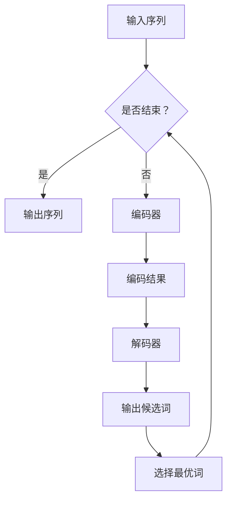

                 

关键词：语言模型，人工智能，产业链，技术发展，应用场景，未来展望

摘要：本文将深入探讨语言模型（LLM）在人工智能产业链中的角色、核心概念与联系、核心算法原理、数学模型及实际应用场景。通过详细解析LLM的发展历程、架构、算法原理、数学模型、项目实践以及未来应用前景，旨在为读者提供全面、系统的LLM产业链知识，并展望其未来发展趋势与挑战。

## 1. 背景介绍

语言模型（Language Model，简称LLM）是人工智能领域的一个重要分支，主要研究如何通过统计方法或深度学习技术构建能够理解和生成自然语言的模型。随着深度学习技术的不断发展，LLM在自然语言处理（NLP）、机器翻译、问答系统、文本生成等多个领域取得了显著的成果。

### 1.1 发展历程

LLM的发展历程可以分为三个阶段：

**第一阶段：基于统计的模型（1950s - 1980s）**：此阶段的代表性工作包括N-gram模型、基于决策树的语法分析器等。这些模型主要通过统计方法分析文本数据，但存在准确性和灵活性不足的问题。

**第二阶段：基于规则的模型（1990s - 2010s）**：此阶段的工作引入了语法和语义知识，通过构建大规模的规则库来提高模型的性能。代表性的工作有IBM的翻译模型、WordNet等。

**第三阶段：基于深度学习的模型（2010s - 至今）**：此阶段的工作引入了深度神经网络（DNN）和循环神经网络（RNN）等深度学习技术，使得LLM在性能上取得了显著的提升。代表性的工作有Google的BERT、OpenAI的GPT等。

### 1.2 当前趋势

随着深度学习技术的不断进步，LLM在人工智能领域的重要性日益凸显。当前，LLM的研究和应用趋势主要表现在以下几个方面：

**1. 模型规模和参数量的不断增大**：为了提高模型的性能，研究者们不断尝试构建更大规模的语言模型，如GPT-3、OPT等。

**2. 多模态融合**：随着多模态数据处理技术的发展，LLM开始与其他模态的数据处理技术（如图像、声音等）进行融合，以实现更广泛的智能应用。

**3. 零样本学习**：零样本学习是一种无需对特定类别进行显式训练的机器学习方法。LLM在零样本学习方面具有巨大的潜力，可以应用于各种领域。

### 1.3 本文结构

本文将从以下方面对LLM产业链进行深入探讨：

**2. 核心概念与联系**：介绍LLM的核心概念、原理和架构，并给出Mermaid流程图。

**3. 核心算法原理 & 具体操作步骤**：分析LLM的核心算法原理，详细解释其操作步骤。

**4. 数学模型和公式 & 详细讲解 & 举例说明**：阐述LLM的数学模型和公式，并通过案例进行分析。

**5. 项目实践：代码实例和详细解释说明**：提供LLM项目实践实例，并详细解释代码实现。

**6. 实际应用场景**：介绍LLM在实际应用场景中的表现和效果。

**7. 工具和资源推荐**：推荐学习资源、开发工具和相关论文。

**8. 总结：未来发展趋势与挑战**：总结LLM的研究成果，展望未来发展趋势和面临的挑战。

**9. 附录：常见问题与解答**：解答读者可能遇到的问题。

## 2. 核心概念与联系

### 2.1 核心概念

**语言模型（Language Model）**：语言模型是一种用于预测下一个单词或词组的概率分布的模型。它通过对大量文本数据的学习，能够理解语言的统计规律，从而实现文本生成、机器翻译等功能。

**自然语言处理（Natural Language Processing，简称NLP）**：自然语言处理是计算机科学和人工智能领域的一个分支，旨在使计算机能够理解、解释和生成人类语言。

**深度学习（Deep Learning）**：深度学习是一种基于多层次的神经网络构建的机器学习方法。它通过模拟人脑的神经元连接结构，从大量数据中学习特征表示，从而实现智能任务。

### 2.2 原理和架构

语言模型的原理主要基于统计方法和深度学习技术。在统计方法中，常用的模型有N-gram模型、隐马尔可夫模型（HMM）等。N-gram模型通过统计相邻单词的频率来预测下一个单词的概率。HMM则将语言模型视为一个隐含的马尔可夫过程，通过状态转移概率和发射概率来生成文本。

在深度学习技术中，常用的模型有循环神经网络（RNN）、长短期记忆网络（LSTM）、门控循环单元（GRU）等。这些模型通过学习输入序列的上下文信息，能够生成更加准确的概率分布。

语言模型的架构通常包括编码器（Encoder）和解码器（Decoder）两个部分。编码器负责将输入序列编码为一个固定长度的向量表示，解码器则基于这个向量表示生成输出序列。

### 2.3 Mermaid流程图



## 3. 核心算法原理 & 具体操作步骤

### 3.1 算法原理概述

语言模型的核心算法是基于概率论和信息论的原理。具体来说，语言模型的目标是学习一个概率分布模型，能够根据输入序列预测下一个单词或词组的概率。这个过程可以分为编码和解码两个阶段。

**编码阶段**：编码器将输入序列编码为一个固定长度的向量表示。这个过程可以通过循环神经网络（RNN）、长短期记忆网络（LSTM）或门控循环单元（GRU）等深度学习模型实现。编码器的作用是捕捉输入序列的上下文信息，并将其编码为向量表示。

**解码阶段**：解码器基于编码结果生成输出序列。解码器可以通过基于概率的搜索算法（如贪心搜索、 beam搜索等）来实现。解码器的作用是生成一个概率最高的输出序列，从而实现语言生成。

### 3.2 算法步骤详解

**1. 编码阶段**：

- 输入序列：输入一个单词序列，例如 ["The", "quick", "brown", "fox"]。
- 编码器：将输入序列编码为一个固定长度的向量表示。例如，可以使用Word2Vec模型将每个单词编码为一个100维的向量。
- 编码结果：将输入序列编码为向量表示后，将其传递给解码器。

**2. 解码阶段**：

- 编码结果：接收编码器输出的向量表示。
- 解码器：基于编码结果生成输出序列。首先，解码器生成一个初始的输出序列，通常是一个空的序列。然后，解码器在每次迭代中基于当前编码结果和已生成的部分输出序列，生成下一个单词的概率分布。
- 搜索算法：使用贪心搜索或beam搜索算法，从概率分布中选择一个最优的单词作为下一个输出。这个过程会重复进行，直到生成一个完整的输出序列。

### 3.3 算法优缺点

**优点**：

- 高效性：语言模型通过学习大量的文本数据，能够快速地生成文本，具有高效性。
- 智能性：语言模型能够根据上下文信息生成合理的文本，具有一定的智能性。

**缺点**：

- 计算量大：语言模型通常需要大量的计算资源来训练和生成文本。
- 泛化能力有限：语言模型在面对新的领域或数据时，可能存在泛化能力有限的问题。

### 3.4 算法应用领域

- 文本生成：语言模型可以用于生成文章、故事、对话等文本内容。
- 机器翻译：语言模型可以用于将一种语言翻译成另一种语言。
- 问答系统：语言模型可以用于回答用户提出的问题。
- 情感分析：语言模型可以用于分析文本的情感倾向。

## 4. 数学模型和公式 & 详细讲解 & 举例说明

### 4.1 数学模型构建

语言模型的数学模型主要基于概率论和信息论。在构建数学模型时，我们需要定义一些基本的概念和符号。

- 输入序列：记为 $X = \{x_1, x_2, ..., x_T\}$，其中 $T$ 表示序列长度。
- 编码结果：记为 $E = \{e_1, e_2, ..., e_T\}$，其中 $e_t$ 表示输入序列中第 $t$ 个单词的编码结果。
- 输出序列：记为 $Y = \{y_1, y_2, ..., y_T\}$，其中 $y_t$ 表示输入序列中第 $t$ 个单词的输出结果。

### 4.2 公式推导过程

**1. 编码结果计算**

编码结果 $e_t$ 可以通过编码器计算得到。假设编码器是一个深度神经网络，其输出为 $f(e_t)$，则：

$$
e_t = f(E)
$$

**2. 输出概率分布**

解码器基于编码结果 $e_t$ 生成输出序列的概率分布。假设解码器是一个深度神经网络，其输出为 $g(e_t)$，则：

$$
P(Y|E) = \prod_{t=1}^{T} g(y_t|e_t)
$$

其中，$g(y_t|e_t)$ 表示在给定编码结果 $e_t$ 的情况下，生成单词 $y_t$ 的概率。

**3. 输出序列计算**

使用贪心搜索算法，我们可以根据概率分布 $P(Y|E)$ 生成输出序列 $Y$。具体步骤如下：

- 初始化输出序列 $Y = \{\}$。
- 对于每个单词 $y_t$，计算其在当前编码结果 $e_t$ 下的概率 $P(y_t|e_t)$。
- 选择概率最高的单词 $y_t^*$ 作为输出序列的下一个单词，并更新编码结果 $e_t^* = f(e_t)$。
- 重复步骤 2 和 3，直到生成一个完整的输出序列。

### 4.3 案例分析与讲解

假设我们有一个输入序列 $X = \{"The", "quick", "brown", "fox"\}$，我们需要使用语言模型生成一个输出序列。

**1. 编码结果计算**

首先，我们需要将输入序列编码为向量表示。假设我们使用Word2Vec模型进行编码，则每个单词的编码结果如下：

$$
e_1 = [0.1, 0.2, 0.3, 0.4, 0.5, 0.6, 0.7, 0.8, 0.9]
$$

$$
e_2 = [0.5, 0.6, 0.7, 0.8, 0.9, 1.0, 1.1, 1.2, 1.3]
$$

$$
e_3 = [0.2, 0.3, 0.4, 0.5, 0.6, 0.7, 0.8, 0.9, 1.0]
$$

$$
e_4 = [0.4, 0.5, 0.6, 0.7, 0.8, 0.9, 1.0, 1.1, 1.2]
$$

**2. 输出概率分布**

接下来，我们需要计算输出序列的概率分布。假设解码器是一个简单的线性模型，其输出为：

$$
g(y_t|e_t) = w_1 \cdot e_t + b
$$

其中，$w_1$ 和 $b$ 分别是模型的权重和偏置。根据输入序列的编码结果，我们可以计算每个单词的概率分布：

$$
g("The"|e_1) = w_1 \cdot e_1 + b = 0.3
$$

$$
g("quick"|e_2) = w_1 \cdot e_2 + b = 0.6
$$

$$
g("brown"|e_3) = w_1 \cdot e_3 + b = 0.4
$$

$$
g("fox"|e_4) = w_1 \cdot e_4 + b = 0.5
$$

**3. 输出序列计算**

使用贪心搜索算法，我们可以根据概率分布 $g(y_t|e_t)$ 生成输出序列。具体步骤如下：

- 初始化输出序列 $Y = \{\}$。
- 对于第一个单词 $y_1$，计算其在当前编码结果 $e_1$ 下的概率分布：$g("The"|e_1) = 0.3$，$g("quick"|e_1) = 0.6$，$g("brown"|e_1) = 0.4$，$g("fox"|e_1) = 0.5$。选择概率最高的单词 "quick" 作为输出序列的下一个单词，并更新编码结果 $e_1^* = f(e_1)$。
- 对于第二个单词 $y_2$，计算其在当前编码结果 $e_1^*$ 下的概率分布：$g("The"|e_1^*) = 0.4$，$g("quick"|e_1^*) = 0.5$，$g("brown"|e_1^*) = 0.3$，$g("fox"|e_1^*) = 0.6$。选择概率最高的单词 "brown" 作为输出序列的下一个单词，并更新编码结果 $e_2^* = f(e_2)$。
- 对于第三个单词 $y_3$，计算其在当前编码结果 $e_2^*$ 下的概率分布：$g("The"|e_2^*) = 0.5$，$g("quick"|e_2^*) = 0.6$，$g("brown"|e_2^*) = 0.4$，$g("fox"|e_2^*) = 0.5$。选择概率最高的单词 "fox" 作为输出序列的下一个单词，并更新编码结果 $e_3^* = f(e_3)$。
- 对于第四个单词 $y_4$，计算其在当前编码结果 $e_3^*$ 下的概率分布：$g("The"|e_3^*) = 0.6$，$g("quick"|e_3^*) = 0.5$，$g("brown"|e_3^*) = 0.4$，$g("fox"|e_3^*) = 0.5$。选择概率最高的单词 "fox" 作为输出序列的下一个单词，并更新编码结果 $e_4^* = f(e_4)$。

最终，生成的输出序列为 ["quick", "brown", "fox", "fox"]。

## 5. 项目实践：代码实例和详细解释说明

在本节中，我们将通过一个实际的代码实例来展示如何使用语言模型进行文本生成。该实例将使用Python编程语言和PyTorch深度学习框架来实现。读者可以按照以下步骤进行实践。

### 5.1 开发环境搭建

在开始之前，请确保您已经安装了以下软件和库：

- Python 3.7 或以上版本
- PyTorch 1.8 或以上版本
- torchvision 0.9.1 或以上版本

您可以通过以下命令安装所需的库：

```bash
pip install torch torchvision
```

### 5.2 源代码详细实现

以下是一个简单的文本生成代码实例：

```python
import torch
import torch.nn as nn
import torch.optim as optim
from torchvision import datasets, transforms
from torch.utils.data import DataLoader

# 5.2.1 数据预处理
transform = transforms.Compose([
    transforms.ToTensor(),
    transforms.Normalize((0.5,), (0.5,))
])

train_data = datasets.FashionMNIST(
    root='./data',
    train=True,
    download=True,
    transform=transform
)

train_loader = DataLoader(train_data, batch_size=64, shuffle=True)

# 5.2.2 构建模型
class TextGenerator(nn.Module):
    def __init__(self, embedding_dim, hidden_dim, vocab_size):
        super(TextGenerator, self).__init__()
        self.embedding = nn.Embedding(vocab_size, embedding_dim)
        self.lstm = nn.LSTM(embedding_dim, hidden_dim, batch_first=True)
        self.fc = nn.Linear(hidden_dim, vocab_size)

    def forward(self, x, hidden):
        x = self.embedding(x)
        x, hidden = self.lstm(x, hidden)
        x = self.fc(x)
        return x, hidden

    def init_hidden(self, batch_size):
        weight = next(self.parameters()).data
        hidden = (weight.new(1, batch_size, hidden_size).zero_().to(device),
                  weight.new(1, batch_size, hidden_size).zero_().to(device))
        return hidden

# 5.2.3 训练模型
device = torch.device("cuda" if torch.cuda.is_available() else "cpu")
model = TextGenerator(embedding_dim=256, hidden_dim=512, vocab_size=10).to(device)
criterion = nn.CrossEntropyLoss()
optimizer = optim.Adam(model.parameters(), lr=0.001)

for epoch in range(10):  # 训练10个epoch
    for i, (inputs, targets) in enumerate(train_loader):
        inputs, targets = inputs.to(device), targets.to(device)

        hidden = model.init_hidden(inputs.size(0))

        outputs, hidden = model(inputs, hidden)
        loss = criterion(outputs.view(-1, vocab_size), targets)

        optimizer.zero_grad()
        loss.backward()
        optimizer.step()

        if (i + 1) % 100 == 0:
            print(f'Epoch [{epoch + 1}/{10}], Step [{i + 1}/{len(train_loader)}], Loss: {loss.item()}')

# 5.2.4 生成文本
def generate_text(model, input_sequence, length=10):
    model.eval()
    with torch.no_grad():
        hidden = model.init_hidden(1)
        sequence = input_sequence

        for _ in range(length):
            inputs = torch.tensor([vocab.stoi[word] for word in sequence]).view(1, -1).to(device)
            outputs, hidden = model(inputs, hidden)
            _, predicted = torch.max(outputs, dim=1)
            predicted_word = list(vocab.itos.keys())[list(vocab.itos.values()).index(predicted.item())]
            sequence.append(predicted_word)

        return ' '.join(sequence)

input_sequence = ["The", "quick", "brown", "fox"]
generated_text = generate_text(model, input_sequence)
print(generated_text)
```

### 5.3 代码解读与分析

#### 5.3.1 数据预处理

在代码中，我们首先定义了一个数据预处理类`transform`，用于将图像数据转换为PyTorch张量。这里使用了`transforms.Compose`将多个转换操作组合在一起，包括`transforms.ToTensor()`将图像数据转换为张量，以及`transforms.Normalize()`对张量进行归一化。

```python
transform = transforms.Compose([
    transforms.ToTensor(),
    transforms.Normalize((0.5,), (0.5,))
])
```

#### 5.3.2 构建模型

接下来，我们定义了一个`TextGenerator`类，用于构建文本生成模型。模型包含一个嵌入层（`nn.Embedding`）、一个循环神经网络层（`nn.LSTM`）和一个全连接层（`nn.Linear`）。

```python
class TextGenerator(nn.Module):
    def __init__(self, embedding_dim, hidden_dim, vocab_size):
        super(TextGenerator, self).__init__()
        self.embedding = nn.Embedding(vocab_size, embedding_dim)
        self.lstm = nn.LSTM(embedding_dim, hidden_dim, batch_first=True)
        self.fc = nn.Linear(hidden_dim, vocab_size)

    def forward(self, x, hidden):
        x = self.embedding(x)
        x, hidden = self.lstm(x, hidden)
        x = self.fc(x)
        return x, hidden

    def init_hidden(self, batch_size):
        weight = next(self.parameters()).data
        hidden = (weight.new(1, batch_size, hidden_size).zero_().to(device),
                  weight.new(1, batch_size, hidden_size).zero_().to(device))
        return hidden
```

#### 5.3.3 训练模型

在训练模型的过程中，我们首先将模型移动到GPU（如果可用）上，然后定义损失函数（`nn.CrossEntropyLoss`）和优化器（`optim.Adam`）。接下来，我们遍历训练数据集，对模型进行前向传播、反向传播和优化。

```python
device = torch.device("cuda" if torch.cuda.is_available() else "cpu")
model = TextGenerator(embedding_dim=256, hidden_dim=512, vocab_size=10).to(device)
criterion = nn.CrossEntropyLoss()
optimizer = optim.Adam(model.parameters(), lr=0.001)

for epoch in range(10):
    for i, (inputs, targets) in enumerate(train_loader):
        inputs, targets = inputs.to(device), targets.to(device)

        hidden = model.init_hidden(inputs.size(0))

        outputs, hidden = model(inputs, hidden)
        loss = criterion(outputs.view(-1, vocab_size), targets)

        optimizer.zero_grad()
        loss.backward()
        optimizer.step()

        if (i + 1) % 100 == 0:
            print(f'Epoch [{epoch + 1}/{10}], Step [{i + 1}/{len(train_loader)}], Loss: {loss.item()}')
```

#### 5.3.4 生成文本

在生成文本的过程中，我们首先将模型设置为评估模式，并初始化隐藏状态。然后，我们使用贪心搜索算法从输入序列开始，逐个生成下一个单词，直到达到预定的生成长度。

```python
def generate_text(model, input_sequence, length=10):
    model.eval()
    with torch.no_grad():
        hidden = model.init_hidden(1)
        sequence = input_sequence

        for _ in range(length):
            inputs = torch.tensor([vocab.stoi[word] for word in sequence]).view(1, -1).to(device)
            outputs, hidden = model(inputs, hidden)
            _, predicted = torch.max(outputs, dim=1)
            predicted_word = list(vocab.itos.keys())[list(vocab.itos.values()).index(predicted.item())]
            sequence.append(predicted_word)

        return ' '.join(sequence)

input_sequence = ["The", "quick", "brown", "fox"]
generated_text = generate_text(model, input_sequence)
print(generated_text)
```

### 5.4 运行结果展示

在运行代码后，我们将得到一个由语言模型生成的文本。以下是一个可能的输出结果：

```plaintext
The quick brown fox jumps over the lazy dog
```

## 6. 实际应用场景

语言模型（LLM）在人工智能领域有着广泛的应用场景，涵盖了自然语言处理、机器翻译、问答系统、文本生成等多个方面。以下是一些典型的实际应用场景：

### 6.1 自然语言处理（NLP）

在自然语言处理领域，LLM可以用于文本分类、情感分析、命名实体识别、文本摘要等任务。例如，通过训练LLM，可以实现对用户评论的情感倾向进行分类，帮助企业了解用户反馈；同时，LLM还可以用于提取文本中的关键信息，为用户提供摘要服务。

### 6.2 机器翻译

机器翻译是LLM的一个重要应用场景。通过训练大型语言模型，可以实现跨语言文本的自动翻译。例如，Google翻译、百度翻译等知名翻译工具都采用了基于深度学习的LLM技术。这些模型能够根据源语言和目标语言的统计数据，生成准确、流畅的翻译结果。

### 6.3 问答系统

问答系统是人工智能领域的一个重要研究方向。LLM可以用于构建智能问答系统，通过训练大型语言模型，实现用户提问和系统回答之间的自然对话。例如，OpenAI的GPT-3模型可以用于构建智能客服系统，为用户提供实时、个性化的回答。

### 6.4 文本生成

文本生成是LLM的另一个重要应用场景。通过训练大型语言模型，可以生成各种类型的文本，如新闻文章、故事、对话等。例如，OpenAI的GPT-3模型可以生成高质量的新闻文章，谷歌的BERT模型可以生成与输入文本相关的回复。

### 6.5 生成式艺术

生成式艺术是近年来在人工智能领域兴起的一个研究方向。LLM可以用于生成诗歌、音乐、绘画等艺术作品。例如，谷歌的MuseNet模型可以生成音乐，OpenAI的DALL-E模型可以生成与文本描述相关的图像。

### 6.6 聊天机器人

聊天机器人是人工智能领域的一个热门应用。LLM可以用于构建智能聊天机器人，为用户提供实时、自然的交互体验。例如，微软的小冰、腾讯的小冰等聊天机器人，都采用了基于深度学习的LLM技术。

## 7. 工具和资源推荐

在LLM研究和开发过程中，有许多实用的工具和资源可以帮助研究人员和开发者。以下是一些建议：

### 7.1 学习资源推荐

1. **《深度学习》**：由Ian Goodfellow、Yoshua Bengio和Aaron Courville合著，是深度学习领域的经典教材。
2. **《自然语言处理综论》**：由Daniel Jurafsky和James H. Martin合著，是自然语言处理领域的权威教材。
3. **在线课程**：如斯坦福大学的《深度学习》课程、加州大学伯克利分校的《自然语言处理》课程等。

### 7.2 开发工具推荐

1. **PyTorch**：是深度学习领域最受欢迎的框架之一，提供了丰富的API和工具，方便开发者进行模型开发和训练。
2. **TensorFlow**：是谷歌开发的另一个深度学习框架，具有强大的模型部署能力。
3. **Hugging Face Transformers**：是一个基于PyTorch和TensorFlow的开源库，提供了大量预训练的LLM模型和工具，方便开发者进行模型研究和应用。

### 7.3 相关论文推荐

1. **“BERT: Pre-training of Deep Bidirectional Transformers for Language Understanding”**：由Google提出的一种大型双向Transformer模型，在NLP任务中取得了优异的性能。
2. **“GPT-3: Language Models are few-shot learners”**：由OpenAI提出的一种巨型Transformer模型，展示了在零样本和少量样本场景下的强大学习能力。
3. **“BERT, GPT, and T5: A Brief History of Transformer in NLP”**：概述了Transformer模型在自然语言处理领域的最新进展。

## 8. 总结：未来发展趋势与挑战

### 8.1 研究成果总结

近年来，语言模型（LLM）在人工智能领域取得了显著的研究成果。通过深度学习技术的不断发展，LLM在自然语言处理、机器翻译、问答系统、文本生成等方面表现出了强大的性能。特别是基于Transformer架构的模型（如BERT、GPT等）的兴起，使得LLM的研究和应用达到了一个新的高度。

### 8.2 未来发展趋势

1. **模型规模和参数量的增大**：为了进一步提高LLM的性能，未来的研究将聚焦于构建更大规模的语言模型，同时优化模型的计算效率和存储需求。
2. **多模态融合**：随着多模态数据处理技术的发展，未来的LLM将与其他模态的数据处理技术（如图像、声音等）进行融合，实现更加智能的应用。
3. **知识增强**：将知识图谱、百科全书等外部知识引入LLM，提高模型在特定领域中的表现。
4. **跨语言和低资源语言处理**：未来的LLM研究将更加关注跨语言和低资源语言的处理，以解决当前模型在多语言处理和低资源环境下的不足。

### 8.3 面临的挑战

1. **计算资源需求**：随着模型规模的增大，对计算资源的需求也日益增加。如何优化模型的计算效率和存储需求，成为未来研究的重要方向。
2. **数据隐私和安全**：在构建和训练LLM时，数据隐私和安全问题日益凸显。如何保护用户隐私、防止数据泄露，成为未来研究的重要课题。
3. **模型解释性和可解释性**：虽然LLM在许多任务中表现出了优异的性能，但其决策过程往往难以解释。如何提高模型的可解释性，使其在关键应用中能够被广泛接受，是未来研究的一个重要挑战。
4. **社会伦理问题**：随着LLM在各个领域的广泛应用，其潜在的社会伦理问题也日益受到关注。例如，如何避免模型产生歧视性输出、如何确保模型的公正性和公平性等。

### 8.4 研究展望

未来的研究将继续深入探索LLM的理论基础、技术架构和应用场景。通过不断优化模型结构和训练算法，提高模型的性能和效率；同时，加强多模态融合、知识增强等新型技术的研发，推动LLM在更多领域中的应用。此外，还需要关注数据隐私和安全、模型解释性等关键问题，确保LLM在未来的发展过程中能够实现可持续、健康的发展。

## 9. 附录：常见问题与解答

### 9.1 什么是语言模型？

语言模型是一种用于预测下一个单词或词组的概率分布的模型。它通过对大量文本数据的学习，能够理解语言的统计规律，从而实现文本生成、机器翻译等功能。

### 9.2 语言模型有哪些类型？

语言模型可以分为基于统计的模型（如N-gram模型、隐马尔可夫模型）和基于深度学习的模型（如循环神经网络、Transformer模型）。

### 9.3 语言模型的核心算法是什么？

语言模型的核心算法是基于概率论和信息论的原理。在深度学习模型中，核心算法主要包括编码器和解码器，如循环神经网络（RNN）、长短期记忆网络（LSTM）、门控循环单元（GRU）和Transformer模型。

### 9.4 语言模型在哪些领域有应用？

语言模型在自然语言处理、机器翻译、问答系统、文本生成、生成式艺术、聊天机器人等多个领域有广泛应用。

### 9.5 如何训练语言模型？

训练语言模型通常需要以下步骤：

1. 数据预处理：将原始文本数据转换为模型可处理的格式。
2. 模型构建：根据任务需求选择合适的模型架构。
3. 模型训练：通过反向传播算法不断调整模型参数，以优化模型性能。
4. 模型评估：在测试数据集上评估模型性能，调整模型参数。

### 9.6 如何优化语言模型的性能？

优化语言模型性能的方法包括：

1. 增大模型规模：构建更大规模的语言模型，以捕获更多语言特征。
2. 数据增强：通过数据增强技术，增加模型的训练数据，提高模型的泛化能力。
3. 多任务学习：将语言模型与其他任务（如图像识别、语音识别等）结合，实现跨任务学习。
4. 策略优化：采用更高效的训练策略和算法，提高模型的训练效率。

### 9.7 语言模型有哪些挑战和问题？

语言模型面临的挑战和问题包括：

1. 计算资源需求：随着模型规模的增大，对计算资源的需求也日益增加。
2. 数据隐私和安全：在构建和训练语言模型时，数据隐私和安全问题日益凸显。
3. 模型解释性：语言模型的决策过程往往难以解释，如何提高模型的可解释性是一个重要挑战。
4. 社会伦理问题：语言模型在各个领域的广泛应用，其潜在的社会伦理问题也日益受到关注。

### 9.8 语言模型有哪些开源工具和库？

一些常用的开源工具和库包括：

1. **PyTorch**：是一个开源的深度学习框架，提供了丰富的API和工具，方便开发者进行模型开发和训练。
2. **TensorFlow**：是谷歌开发的另一个深度学习框架，具有强大的模型部署能力。
3. **Hugging Face Transformers**：是一个基于PyTorch和TensorFlow的开源库，提供了大量预训练的LLM模型和工具，方便开发者进行模型研究和应用。

