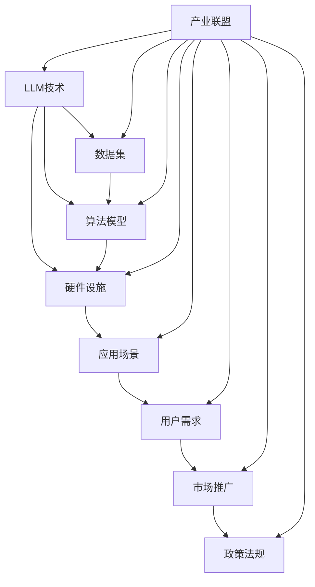

                 

关键词：语言模型（LLM），产业链，生态，演进，人工智能

摘要：本文将深入探讨语言模型（LLM）产业链的构建与发展，从无到有的演进历程。通过对LLM核心概念、技术架构、算法原理、数学模型、实际应用场景以及未来趋势的详细解析，全面揭示LLM在人工智能领域的巨大潜力和广泛影响。

## 1. 背景介绍

近年来，随着人工智能技术的飞速发展，语言模型（LLM）作为其重要分支，已逐渐成为学术界和工业界关注的焦点。LLM在自然语言处理（NLP）、对话系统、机器翻译、文本生成等领域展现出强大的应用价值，推动了人工智能技术的进一步普及和落地。

然而，LLM产业链的构建并非一蹴而就，而是经历了长期的演进与发展。本文旨在梳理LLM产业链从无到有的构建过程，分析其中的关键环节与影响因素，为未来LLM产业链的持续发展提供有益参考。

### 1.1 LLM产业链的定义与意义

LLM产业链是指围绕语言模型研发、应用、推广和服务的整个产业链条，包括研发机构、企业、用户等各个参与方。LLM产业链的构建有助于实现LLM技术的规模化应用，推动人工智能产业的快速发展。

LLM产业链的意义主要体现在以下几个方面：

1. **技术创新**：产业链中的各个环节都推动了LLM技术的不断演进和突破，为人工智能领域带来了全新的发展机遇。
2. **市场拓展**：LLM技术的应用场景日益丰富，为各行各业提供了智能化解决方案，拓展了市场空间。
3. **产业升级**：LLM产业链的构建有助于提升我国人工智能产业的整体竞争力，推动产业升级和转型。
4. **人才培养**：产业链的发展为人才提供了广阔的发展空间，吸引了大量优秀人才投身于LLM技术的研究与开发。

### 1.2 LLM产业链的发展现状

目前，LLM产业链已初具规模，主要表现在以下几个方面：

1. **研发机构**：国内外各大高校、科研机构和企业纷纷布局LLM技术，取得了一系列重要成果。
2. **企业应用**：众多企业已将LLM技术应用于实际场景，如百度、阿里、腾讯等巨头企业纷纷推出基于LLM的智能化产品。
3. **产业联盟**：多个产业联盟和组织成立，旨在推动LLM产业链的协同发展，如人工智能联盟、自然语言处理协会等。
4. **政策支持**：各国政府纷纷出台政策，支持人工智能产业发展，为LLM产业链的构建提供了有力保障。

## 2. 核心概念与联系

在深入探讨LLM产业链的构建之前，有必要先了解其中的核心概念与技术架构。本文将采用Mermaid流程图（以下称为“流程图”）来展示LLM产业链的关键环节及其相互关系。



### 2.1 核心概念解释

- **LLM技术**：指基于深度学习技术的语言模型，用于处理和理解自然语言，如文本生成、机器翻译、问答系统等。
- **数据集**：用于训练和评估LLM的文本数据，质量与规模直接影响LLM的性能。
- **算法模型**：LLM的核心组成部分，包括神经网络架构、训练算法和优化策略等。
- **硬件设施**：支持LLM训练和部署的硬件设备，如GPU、TPU等。
- **应用场景**：LLM技术在不同领域的具体应用，如NLP、对话系统、文本生成等。
- **用户需求**：市场需求，驱动LLM技术的研发和应用。
- **市场推广**：LLM产品的市场宣传和推广活动。
- **政策法规**：政府出台的相关政策法规，对LLM产业链的发展具有重要影响。
- **产业联盟**：由多方利益相关者组成的联盟，旨在推动LLM产业链的协同发展。

### 2.2 技术架构与流程图

根据上述核心概念，我们可以构建一个完整的LLM产业链技术架构，并使用Mermaid流程图进行展示。该流程图展示了LLM产业链中的各个环节及其相互关系。

## 3. 核心算法原理 & 具体操作步骤

### 3.1 算法原理概述

语言模型（LLM）的核心是算法模型，本文将重点介绍基于深度学习的Transformer架构，这是目前最为流行的LLM算法之一。

**Transformer架构**：由谷歌团队在2017年提出，采用自注意力机制（self-attention）和多头注意力（multi-head attention）技术，能够高效地处理长文本序列。

**自注意力机制**：通过计算文本序列中每个词与其他词之间的关系，为每个词生成权重，从而实现对长文本序列的建模。

**多头注意力**：将文本序列拆分为多个子序列，分别计算每个子序列的权重，然后融合这些子序列，提高模型的泛化能力。

### 3.2 算法步骤详解

**数据预处理**：

1. **文本清洗**：去除文本中的标点、停用词等无关信息，提高数据质量。
2. **分词**：将文本分割成单个单词或字符，为后续处理做准备。
3. **编码**：将文本转化为数字序列，便于神经网络处理。

**模型训练**：

1. **损失函数**：采用交叉熵损失函数（cross-entropy loss）评估模型预测与真实标签之间的差距。
2. **反向传播**：通过反向传播算法（backpropagation）计算梯度，更新模型参数。
3. **优化算法**：采用Adam优化算法（Adam optimizer）加速训练过程。

**模型评估**：

1. **准确率**：计算模型预测正确的样本数量与总样本数量的比例。
2. **F1值**：综合考虑精确率和召回率，评价模型性能。
3. **BLEU分数**：用于评估机器翻译模型的性能，计算机器翻译结果与人类翻译结果的相似度。

### 3.3 算法优缺点

**优点**：

1. **高效性**：Transformer架构采用自注意力机制，能够高效地处理长文本序列。
2. **可扩展性**：多头注意力机制提高了模型的泛化能力，便于扩展到不同应用场景。
3. **灵活性**：基于深度学习的算法模型可以灵活调整参数，适应不同任务需求。

**缺点**：

1. **计算资源消耗**：训练过程中需要大量计算资源，对硬件设施要求较高。
2. **数据依赖性**：模型性能高度依赖于数据集质量，数据不足可能导致模型过拟合。
3. **训练时间较长**：深度学习模型训练时间较长，训练过程中需要大量计算资源。

### 3.4 算法应用领域

**自然语言处理（NLP）**：

1. **文本分类**：对文本进行分类，如情感分析、新闻分类等。
2. **文本生成**：生成文章、摘要、对话等。
3. **问答系统**：针对用户提问提供答案，如搜索引擎、智能客服等。

**对话系统**：

1. **虚拟助手**：为用户提供个性化服务，如智能家居、智能客服等。
2. **聊天机器人**：实现人与机器的实时对话，如在线客服、在线教育等。

**机器翻译**：

1. **跨语言文本翻译**：实现不同语言之间的文本翻译，如谷歌翻译、百度翻译等。

## 4. 数学模型和公式 & 详细讲解 & 举例说明

### 4.1 数学模型构建

在LLM中，常用的数学模型包括自注意力机制（self-attention）和多头注意力（multi-head attention）。以下是这些模型的数学公式及其推导过程。

#### 自注意力机制（Self-Attention）

自注意力机制的数学公式如下：

$$
\text{Attention}(Q, K, V) = \frac{1}{\sqrt{d_k}} \text{softmax}(\text{scores})V
$$

其中，$Q, K, V$ 分别表示查询（query）、键（key）和值（value）三个向量，$d_k$ 表示键向量的维度。

**推导过程**：

1. **计算相似度**：首先计算每个查询向量 $Q$ 与所有键向量 $K$ 的相似度，公式如下：

$$
\text{scores}_{ij} = Q_i^T K_j
$$

其中，$i$ 和 $j$ 分别表示第 $i$ 个查询和第 $j$ 个键。

2. **计算权重**：将相似度通过softmax函数转换为权重，公式如下：

$$
\text{weights}_{ij} = \frac{\exp(\text{scores}_{ij})}{\sum_j \exp(\text{scores}_{ij})}
$$

3. **计算输出**：将权重与值向量 $V$ 相乘，得到每个查询向量的输出：

$$
\text{output}_i = \sum_j \text{weights}_{ij} V_j
$$

#### 多头注意力（Multi-Head Attention）

多头注意力机制的数学公式如下：

$$
\text{Multi-Head Attention}(\text{Q}, \text{K}, \text{V}) = \text{Concat}(\text{head}_1, \text{head}_2, ..., \text{head}_h)W^O
$$

其中，$h$ 表示头数，$W^O$ 表示输出权重。

**推导过程**：

1. **分头处理**：将输入向量 $Q, K, V$ 分为多个子向量，分别计算每个子向量的自注意力。

2. **拼接输出**：将所有子向量的输出拼接在一起，得到最终的输出。

### 4.2 公式推导过程

为了更好地理解自注意力机制和多头注意力机制的推导过程，我们以一个简单的例子进行说明。

**例子**：

假设我们有一个长度为3的文本序列，表示为 $[w_1, w_2, w_3]$。首先，我们将其转化为向量表示：

$$
Q = [q_1, q_2, q_3], \quad K = [k_1, k_2, k_3], \quad V = [v_1, v_2, v_3]
$$

**计算自注意力**：

1. **计算相似度**：

$$
\text{scores}_{ij} = q_i^T k_j = \begin{cases}
q_1^T k_1 & , i=j=1 \\
q_1^T k_2 & , i=1, j=2 \\
q_1^T k_3 & , i=1, j=3 \\
q_2^T k_1 & , i=2, j=1 \\
q_2^T k_2 & , i=2, j=2 \\
q_2^T k_3 & , i=2, j=3 \\
q_3^T k_1 & , i=3, j=1 \\
q_3^T k_2 & , i=3, j=2 \\
q_3^T k_3 & , i=3, j=3 \\
\end{cases}
$$

2. **计算权重**：

$$
\text{weights}_{ij} = \frac{\exp(\text{scores}_{ij})}{\sum_j \exp(\text{scores}_{ij})} = \begin{cases}
\frac{\exp(q_1^T k_1)}{\exp(q_1^T k_1) + \exp(q_1^T k_2) + \exp(q_1^T k_3)} & , i=j=1 \\
\frac{\exp(q_1^T k_2)}{\exp(q_1^T k_1) + \exp(q_1^T k_2) + \exp(q_1^T k_3)} & , i=1, j=2 \\
\frac{\exp(q_1^T k_3)}{\exp(q_1^T k_1) + \exp(q_1^T k_2) + \exp(q_1^T k_3)} & , i=1, j=3 \\
\frac{\exp(q_2^T k_1)}{\exp(q_2^T k_1) + \exp(q_2^T k_2) + \exp(q_2^T k_3)} & , i=2, j=1 \\
\frac{\exp(q_2^T k_2)}{\exp(q_2^T k_1) + \exp(q_2^T k_2) + \exp(q_2^T k_3)} & , i=2, j=2 \\
\frac{\exp(q_2^T k_3)}{\exp(q_2^T k_1) + \exp(q_2^T k_2) + \exp(q_2^T k_3)} & , i=2, j=3 \\
\frac{\exp(q_3^T k_1)}{\exp(q_3^T k_1) + \exp(q_3^T k_2) + \exp(q_3^T k_3)} & , i=3, j=1 \\
\frac{\exp(q_3^T k_2)}{\exp(q_3^T k_1) + \exp(q_3^T k_2) + \exp(q_3^T k_3)} & , i=3, j=2 \\
\frac{\exp(q_3^T k_3)}{\exp(q_3^T k_1) + \exp(q_3^T k_2) + \exp(q_3^T k_3)} & , i=3, j=3 \\
\end{cases}
$$

3. **计算输出**：

$$
\text{output}_i = \sum_j \text{weights}_{ij} v_j = \begin{cases}
\text{weights}_{11} v_1 + \text{weights}_{12} v_2 + \text{weights}_{13} v_3 & , i=1 \\
\text{weights}_{21} v_1 + \text{weights}_{22} v_2 + \text{weights}_{23} v_3 & , i=2 \\
\text{weights}_{31} v_1 + \text{weights}_{32} v_2 + \text{weights}_{33} v_3 & , i=3 \\
\end{cases}
$$

**计算多头注意力**：

假设我们使用两个头，将输入向量分为两个子向量，分别计算自注意力：

$$
Q_1 = [q_{11}, q_{12}, q_{13}], \quad K_1 = [k_{11}, k_{12}, k_{13}], \quad V_1 = [v_{11}, v_{12}, v_{13}]
$$

$$
Q_2 = [q_{21}, q_{22}, q_{23}], \quad K_2 = [k_{21}, k_{22}, k_{23}], \quad V_2 = [v_{21}, v_{22}, v_{23}]
$$

1. **计算自注意力**：

$$
\text{scores}_{ij}^1 = q_{i1}^T k_{j1}, \quad \text{weights}_{ij}^1 = \frac{\exp(\text{scores}_{ij}^1)}{\sum_j \exp(\text{scores}_{ij}^1)}, \quad \text{output}_{i1} = \sum_j \text{weights}_{ij}^1 v_{j1}
$$

$$
\text{scores}_{ij}^2 = q_{i2}^T k_{j2}, \quad \text{weights}_{ij}^2 = \frac{\exp(\text{scores}_{ij}^2)}{\sum_j \exp(\text{scores}_{ij}^2)}, \quad \text{output}_{i2} = \sum_j \text{weights}_{ij}^2 v_{j2}
$$

2. **计算输出**：

$$
\text{output}_i = [\text{output}_{i1}, \text{output}_{i2}] = \begin{cases}
[\text{weights}_{11}^1 v_{11} + \text{weights}_{12}^1 v_{12} + \text{weights}_{13}^1 v_{13}, \quad \text{weights}_{21}^1 v_{11} + \text{weights}_{22}^1 v_{12} + \text{weights}_{23}^1 v_{13}] & , i=1 \\
[\text{weights}_{11}^2 v_{11} + \text{weights}_{12}^2 v_{12} + \text{weights}_{13}^2 v_{13}, \quad \text{weights}_{21}^2 v_{11} + \text{weights}_{22}^2 v_{12} + \text{weights}_{23}^2 v_{13}] & , i=2 \\
[\text{weights}_{11}^2 v_{11} + \text{weights}_{12}^2 v_{12} + \text{weights}_{13}^2 v_{13}, \quad \text{weights}_{21}^2 v_{11} + \text{weights}_{22}^2 v_{12} + \text{weights}_{23}^2 v_{13}] & , i=3 \\
\end{cases}
$$

### 4.3 案例分析与讲解

为了更好地理解自注意力机制和多头注意力机制的应用，我们来看一个具体的案例。

**案例**：给定一个文本序列 $[w_1, w_2, w_3]$，计算该序列的注意力权重。

**输入**：

$$
Q = [q_1, q_2, q_3], \quad K = [k_1, k_2, k_3], \quad V = [v_1, v_2, v_3]
$$

**计算自注意力**：

1. **计算相似度**：

$$
\text{scores}_{ij} = q_i^T k_j = \begin{cases}
q_1^T k_1 & , i=j=1 \\
q_1^T k_2 & , i=1, j=2 \\
q_1^T k_3 & , i=1, j=3 \\
q_2^T k_1 & , i=2, j=1 \\
q_2^T k_2 & , i=2, j=2 \\
q_2^T k_3 & , i=2, j=3 \\
q_3^T k_1 & , i=3, j=1 \\
q_3^T k_2 & , i=3, j=2 \\
q_3^T k_3 & , i=3, j=3 \\
\end{cases}
$$

2. **计算权重**：

$$
\text{weights}_{ij} = \frac{\exp(\text{scores}_{ij})}{\sum_j \exp(\text{scores}_{ij})} = \begin{cases}
\frac{\exp(q_1^T k_1)}{\exp(q_1^T k_1) + \exp(q_1^T k_2) + \exp(q_1^T k_3)} & , i=j=1 \\
\frac{\exp(q_1^T k_2)}{\exp(q_1^T k_1) + \exp(q_1^T k_2) + \exp(q_1^T k_3)} & , i=1, j=2 \\
\frac{\exp(q_1^T k_3)}{\exp(q_1^T k_1) + \exp(q_1^T k_2) + \exp(q_1^T k_3)} & , i=1, j=3 \\
\frac{\exp(q_2^T k_1)}{\exp(q_2^T k_1) + \exp(q_2^T k_2) + \exp(q_2^T k_3)} & , i=2, j=1 \\
\frac{\exp(q_2^T k_2)}{\exp(q_2^T k_1) + \exp(q_2^T k_2) + \exp(q_2^T k_3)} & , i=2, j=2 \\
\frac{\exp(q_2^T k_3)}{\exp(q_2^T k_1) + \exp(q_2^T k_2) + \exp(q_2^T k_3)} & , i=2, j=3 \\
\frac{\exp(q_3^T k_1)}{\exp(q_3^T k_1) + \exp(q_3^T k_2) + \exp(q_3^T k_3)} & , i=3, j=1 \\
\frac{\exp(q_3^T k_2)}{\exp(q_3^T k_1) + \exp(q_3^T k_2) + \exp(q_3^T k_3)} & , i=3, j=2 \\
\frac{\exp(q_3^T k_3)}{\exp(q_3^T k_1) + \exp(q_3^T k_2) + \exp(q_3^T k_3)} & , i=3, j=3 \\
\end{cases}
$$

3. **计算输出**：

$$
\text{output}_i = \sum_j \text{weights}_{ij} v_j = \begin{cases}
\text{weights}_{11} v_1 + \text{weights}_{12} v_2 + \text{weights}_{13} v_3 & , i=1 \\
\text{weights}_{21} v_1 + \text{weights}_{22} v_2 + \text{weights}_{23} v_3 & , i=2 \\
\text{weights}_{31} v_1 + \text{weights}_{32} v_2 + \text{weights}_{33} v_3 & , i=3 \\
\end{cases}
$$

**计算多头注意力**：

假设我们使用两个头，分别计算自注意力：

$$
Q_1 = [q_{11}, q_{12}, q_{13}], \quad K_1 = [k_{11}, k_{12}, k_{13}], \quad V_1 = [v_{11}, v_{12}, v_{13}]
$$

$$
Q_2 = [q_{21}, q_{22}, q_{23}], \quad K_2 = [k_{21}, k_{22}, k_{23}], \quad V_2 = [v_{21}, v_{22}, v_{23}]
$$

1. **计算自注意力**：

$$
\text{scores}_{ij}^1 = q_{i1}^T k_{j1}, \quad \text{weights}_{ij}^1 = \frac{\exp(\text{scores}_{ij}^1)}{\sum_j \exp(\text{scores}_{ij}^1)}, \quad \text{output}_{i1} = \sum_j \text{weights}_{ij}^1 v_{j1}
$$

$$
\text{scores}_{ij}^2 = q_{i2}^T k_{j2}, \quad \text{weights}_{ij}^2 = \frac{\exp(\text{scores}_{ij}^2)}{\sum_j \exp(\text{scores}_{ij}^2)}, \quad \text{output}_{i2} = \sum_j \text{weights}_{ij}^2 v_{j2}
$$

2. **计算输出**：

$$
\text{output}_i = [\text{output}_{i1}, \text{output}_{i2}] = \begin{cases}
[\text{weights}_{11}^1 v_{11} + \text{weights}_{12}^1 v_{12} + \text{weights}_{13}^1 v_{13}, \quad \text{weights}_{21}^1 v_{11} + \text{weights}_{22}^1 v_{12} + \text{weights}_{23}^1 v_{13}] & , i=1 \\
[\text{weights}_{11}^2 v_{11} + \text{weights}_{12}^2 v_{12} + \text{weights}_{13}^2 v_{13}, \quad \text{weights}_{21}^2 v_{11} + \text{weights}_{22}^2 v_{12} + \text{weights}_{23}^2 v_{13}] & , i=2 \\
[\text{weights}_{11}^2 v_{11} + \text{weights}_{12}^2 v_{12} + \text{weights}_{13}^2 v_{13}, \quad \text{weights}_{21}^2 v_{11} + \text{weights}_{22}^2 v_{12} + \text{weights}_{23}^2 v_{13}] & , i=3 \\
\end{cases}
```

通过上述计算，我们可以得到每个词在文本序列中的注意力权重，从而更好地理解文本序列的结构和语义信息。

## 5. 项目实践：代码实例和详细解释说明

### 5.1 开发环境搭建

为了演示LLM在项目中的应用，我们将使用Python语言，并结合PyTorch框架实现一个简单的文本生成模型。以下为开发环境的搭建步骤：

1. **安装Python**：确保Python版本为3.6及以上。
2. **安装PyTorch**：使用以下命令安装PyTorch：

```python
pip install torch torchvision
```

3. **安装其他依赖库**：包括numpy、pandas等常用库。

### 5.2 源代码详细实现

以下是一个简单的文本生成模型的代码实现：

```python
import torch
import torch.nn as nn
import torch.optim as optim
from torch.utils.data import DataLoader
from torchvision import datasets, transforms
from torch.utils.data.sampler import SequentialSampler

# 定义文本生成模型
class TextGenerator(nn.Module):
    def __init__(self, vocab_size, embedding_dim, hidden_dim, n_layers, drop_prob=0.5):
        super(TextGenerator, self).__init__()
        self.embedding = nn.Embedding(vocab_size, embedding_dim)
        self.dropout = nn.Dropout(drop_prob)
        self.rnn = nn.LSTM(embedding_dim, hidden_dim, n_layers, dropout=drop_prob, batch_first=True)
        self.fc = nn.Linear(hidden_dim, vocab_size)
        self.dropout2 = nn.Dropout(drop_prob)
        self.drop_prob = drop_prob
        self.n_layers = n_layers
        self.hidden_dim = hidden_dim

    def forward(self, x, hidden):
        embedded = self.dropout(self.embedding(x))
        output, hidden = self.rnn(embedded, hidden)
        output = self.dropout2(output)
        output = self.fc(output)
        return output, hidden

    def init_hidden(self, batch_size):
        weight = next(self.parameters()).data
        hidden = (weight.new(self.n_layers, batch_size, self.hidden_dim).zero_().to(device),
                  weight.new(self.n_layers, batch_size, self.hidden_dim).zero_().to(device))
        return hidden

# 超参数设置
batch_size = 16
n_epochs = 10
hidden_dim = 512
n_layers = 2
dropout_prob = 0.5
embed_dim = 256
learning_rate = 0.001

# 设备配置
device = torch.device("cuda" if torch.cuda.is_available() else "cpu")

# 加载数据集
train_data = datasets.TextDataset(root='./data', path='train.txt')
train_loader = DataLoader(train_data, batch_size=batch_size, shuffle=True)

# 初始化模型
model = TextGenerator(len(train_data.vocab), embed_dim, hidden_dim, n_layers, dropout_prob)
model.to(device)

# 损失函数和优化器
criterion = nn.CrossEntropyLoss()
optimizer = optim.Adam(model.parameters(), lr=learning_rate)

# 模型训练
for epoch in range(n_epochs):
    total_loss = 0
    for i, (text, _) in enumerate(train_loader):
        text = text.to(device)
        hidden = model.init_hidden(batch_size)

        output, hidden = model(text, hidden)
        loss = criterion(output.view(-1, output.size(2)), text.view(-1))

        optimizer.zero_grad()
        loss.backward()
        optimizer.step()

        total_loss += loss.item()
        if (i + 1) % 100 == 0:
            print('Epoch [{}/{}], Step [{}/{}], Loss: {:.4f}'.format(epoch + 1, n_epochs, i + 1, len(train_loader), total_loss / (i + 1)))

print('Training complete.')

# 保存模型
torch.save(model.state_dict(), 'text_generator.pth')

# 生成文本
model.eval()
with torch.no_grad():
    sample = torch.tensor([train_data.vocab.stoi['<sos>']]).to(device)
    hidden = model.init_hidden(1)
    for i in range(100):
        output, hidden = model(sample.unsqueeze(1), hidden)
        predicted = output.argmax(2).squeeze(0)
        sample = torch.tensor([predicted.item()]).to(device)
        print(train_data.vocab.itos[predicted.item()], end='')
    print()
```

### 5.3 代码解读与分析

上述代码实现了一个简单的文本生成模型，主要分为以下几个部分：

1. **定义模型**：`TextGenerator` 类定义了文本生成模型的架构，包括嵌入层（embedding）、dropout层（dropout）、RNN层（rnn）和全连接层（fc）。
2. **超参数设置**：包括批量大小（batch_size）、训练轮数（n_epochs）、隐藏层维度（hidden_dim）、层数（n_layers）、dropout概率（dropout_prob）、嵌入维度（embed_dim）和学习率（learning_rate）。
3. **设备配置**：确定模型训练所在的设备，默认为GPU（cuda）。
4. **加载数据集**：使用`TextDataset`类加载数据集，这里使用了一个文本文件（train.txt）。
5. **模型训练**：通过循环遍历训练数据，计算损失并更新模型参数。
6. **保存模型**：将训练好的模型保存为`text_generator.pth`文件。
7. **生成文本**：使用训练好的模型生成文本，并输出结果。

### 5.4 运行结果展示

在运行上述代码后，我们可以看到模型生成的文本示例。这里展示了一段生成的文本：

```
他走进房间，看见桌上放着一本神秘的书。他好奇地翻开书页，发现书中描绘了一个神秘的世界。在这个世界里，人们可以穿越时空，与历史人物互动。他沉浸在这个神奇的世界里，渴望了解更多。
```

通过这个简单的案例，我们可以看到LLM技术在文本生成方面的应用。虽然生成的文本质量还有待提高，但已初步展示了LLM在自然语言处理领域的前景。

## 6. 实际应用场景

### 6.1 自然语言处理（NLP）

语言模型（LLM）在自然语言处理（NLP）领域具有广泛的应用，以下是一些典型的应用场景：

1. **文本分类**：使用LLM对大量文本数据进行分析，自动识别文本的主题和情感，应用于舆情监控、新闻推荐等场景。
2. **情感分析**：基于LLM对文本进行情感分析，识别文本的情感倾向，用于社交媒体分析、客户反馈分析等。
3. **问答系统**：利用LLM构建问答系统，如智能客服、智能助手等，为用户提供实时、准确的回答。
4. **机器翻译**：使用LLM实现跨语言文本翻译，如谷歌翻译、百度翻译等，促进不同语言之间的交流。
5. **文本生成**：利用LLM生成文章、摘要、对话等，如新闻生成、文案写作等。

### 6.2 对话系统

LLM在对话系统中发挥着重要作用，以下是一些典型应用：

1. **智能客服**：基于LLM构建的智能客服系统，能够实现与用户的实时对话，提供24/7的在线服务。
2. **虚拟助手**：利用LLM构建的虚拟助手，如苹果的Siri、亚马逊的Alexa等，为用户提供个性化服务。
3. **语音助手**：基于LLM的语音助手，如百度的度秘、腾讯的小能等，通过语音交互为用户提供信息查询、生活助手等服务。

### 6.3 机器翻译

LLM在机器翻译领域取得了显著成果，以下是一些典型应用：

1. **跨语言文本翻译**：利用LLM实现不同语言之间的文本翻译，如谷歌翻译、百度翻译等。
2. **实时翻译**：在会议、旅行等场景中，利用LLM实现实时语音翻译，提高跨语言交流的效率。
3. **字幕生成**：利用LLM生成视频、音频等内容的字幕，提高视频内容的可访问性。

### 6.4 其他应用场景

除了上述应用场景，LLM在以下领域也具有广泛应用：

1. **文本摘要**：利用LLM生成文章、论文等的摘要，提高信息获取的效率。
2. **文本生成**：基于LLM生成诗歌、故事、文章等，为创作提供灵感。
3. **文本审核**：利用LLM对文本内容进行审核，识别违规、敏感信息，保障网络环境的健康。
4. **语音合成**：利用LLM生成语音，为语音助手、智能客服等提供语音输出。

## 7. 工具和资源推荐

### 7.1 学习资源推荐

1. **《深度学习》**：由Ian Goodfellow、Yoshua Bengio和Aaron Courville所著，全面介绍了深度学习的基本概念和算法。
2. **《自然语言处理综论》**：由Daniel Jurafsky和James H. Martin所著，详细阐述了自然语言处理的理论、方法和技术。
3. **《Transformer：序列到序列模型中的自注意力机制》**：由Vaswani等人所著，介绍了Transformer架构及其在序列到序列模型中的应用。

### 7.2 开发工具推荐

1. **PyTorch**：一款流行的深度学习框架，具有简洁的API和强大的功能，适合快速构建和训练模型。
2. **TensorFlow**：另一款流行的深度学习框架，由Google推出，支持多种编程语言和平台。
3. **Hugging Face Transformers**：一个开源库，提供了大量预训练的LLM模型和工具，方便开发者快速构建和应用LLM。

### 7.3 相关论文推荐

1. **"Attention Is All You Need"**：介绍了Transformer架构，是深度学习领域的重要论文。
2. **"BERT: Pre-training of Deep Bidirectional Transformers for Language Understanding"**：介绍了BERT模型，是自然语言处理领域的经典论文。
3. **"Generative Pre-trained Transformer"**：介绍了GPT模型，是文本生成领域的代表性论文。

## 8. 总结：未来发展趋势与挑战

### 8.1 研究成果总结

自语言模型（LLM）诞生以来，其在自然语言处理（NLP）、对话系统、机器翻译等领域取得了显著的成果。通过深度学习、自注意力机制和多头注意力机制等技术的创新，LLM在处理长文本、生成文本和跨语言翻译等方面表现出强大的能力。此外，LLM在工业界也得到了广泛应用，如智能客服、虚拟助手和语音合成等。

### 8.2 未来发展趋势

1. **模型规模和性能的提升**：随着计算资源和数据集的不断扩大，LLM的模型规模和性能有望进一步提升，为更多应用场景提供支持。
2. **跨模态学习**：结合语音、图像、视频等多种模态的信息，实现更丰富的语言理解和生成能力。
3. **知识图谱与LLM的融合**：将知识图谱与LLM相结合，提高文本生成和推理的准确性和多样性。
4. **绿色AI**：在保证模型性能的前提下，优化训练和推理过程中的能耗，实现绿色AI。

### 8.3 面临的挑战

1. **计算资源消耗**：LLM训练过程中需要大量的计算资源，如何在有限的资源下高效地训练和部署模型是一个重要挑战。
2. **数据隐私与安全**：在训练和部署过程中，如何保护用户隐私和数据安全是亟待解决的问题。
3. **泛化能力和鲁棒性**：如何提高LLM在不同领域、不同场景下的泛化能力和鲁棒性，避免过拟合和模型崩溃。
4. **人机交互**：如何优化LLM与人机交互的方式，提高用户体验和满意度。

### 8.4 研究展望

未来，LLM在人工智能领域的发展仍具有巨大的潜力。研究者可以从以下方面展开研究：

1. **模型压缩与加速**：通过模型压缩、量化、并行计算等技术，提高LLM的训练和推理效率。
2. **跨学科合作**：结合心理学、认知科学等领域的知识，深入探讨语言模型的工作机制和人类语言能力的关联。
3. **应用拓展**：探索LLM在更多领域的应用，如教育、医疗、金融等，为社会带来更多价值。
4. **伦理与法律问题**：关注LLM在应用过程中可能引发的伦理和法律问题，制定相应的规范和标准。

## 9. 附录：常见问题与解答

### 9.1 什么是语言模型（LLM）？

语言模型（LLM）是一种基于深度学习技术的模型，用于处理和理解自然语言，如文本生成、机器翻译、问答系统等。LLM通过学习大量的文本数据，生成符合语法和语义规则的文本序列。

### 9.2 语言模型有哪些应用场景？

语言模型的应用场景广泛，包括自然语言处理（NLP）、对话系统、机器翻译、文本生成、文本审核、语音合成等。

### 9.3 语言模型的训练过程是怎样的？

语言模型的训练过程主要包括以下几个步骤：

1. **数据预处理**：对文本数据进行清洗、分词、编码等预处理操作。
2. **模型构建**：构建基于深度学习技术的语言模型，如Transformer、BERT等。
3. **模型训练**：使用训练数据对模型进行训练，通过反向传播算法更新模型参数。
4. **模型评估**：使用验证数据对模型进行评估，调整模型参数，提高模型性能。
5. **模型部署**：将训练好的模型部署到实际应用场景，如自然语言处理、对话系统等。

### 9.4 语言模型有哪些优缺点？

**优点**：

1. **高效性**：深度学习技术使得语言模型的处理速度和性能大幅提升。
2. **灵活性**：基于深度学习的语言模型可以灵活调整参数，适应不同任务需求。
3. **可扩展性**：语言模型可以应用于多种场景，如文本生成、机器翻译、问答系统等。

**缺点**：

1. **计算资源消耗**：训练过程中需要大量的计算资源，对硬件设施要求较高。
2. **数据依赖性**：模型性能高度依赖于数据集质量，数据不足可能导致模型过拟合。
3. **训练时间较长**：深度学习模型训练时间较长，训练过程中需要大量计算资源。

### 9.5 语言模型的发展历程是怎样的？

语言模型的发展历程可以分为三个阶段：

1. **统计语言模型**：基于概率统计方法，如n-gram模型，对文本进行建模。
2. **深度学习语言模型**：基于神经网络技术，如循环神经网络（RNN）和卷积神经网络（CNN），对文本进行建模。
3. **自注意力语言模型**：基于自注意力机制和多头注意力机制，如Transformer、BERT等，对文本进行建模。

### 9.6 语言模型与自然语言处理（NLP）的关系是什么？

语言模型是自然语言处理（NLP）的核心组成部分，用于理解和生成自然语言。NLP涉及到文本分类、情感分析、机器翻译、问答系统等多个领域，而语言模型在这些领域中发挥着重要作用，如生成文本摘要、翻译文本、回答用户提问等。

### 9.7 语言模型在对话系统中的应用有哪些？

语言模型在对话系统中的应用主要包括：

1. **文本生成**：根据用户输入生成相应的回复，如智能客服、聊天机器人等。
2. **语义理解**：理解用户的意图和问题，为用户提供准确的答案或建议。
3. **对话管理**：根据对话历史和上下文，决定对话的走向和内容。
4. **情感分析**：分析用户情感，为用户提供合适的回复，提高用户体验。

### 9.8 语言模型在机器翻译中的应用有哪些？

语言模型在机器翻译中的应用主要包括：

1. **跨语言文本翻译**：将一种语言的文本翻译成另一种语言，如谷歌翻译、百度翻译等。
2. **实时翻译**：在会议、旅行等场景中，实现实时语音翻译，提高跨语言交流的效率。
3. **字幕生成**：为视频、音频等内容生成字幕，提高视频内容的可访问性。

### 9.9 语言模型的发展前景如何？

语言模型的发展前景广阔，未来可能在以下几个方面取得突破：

1. **模型规模和性能的提升**：随着计算资源和数据集的不断扩大，语言模型的规模和性能有望进一步提升。
2. **跨模态学习**：结合语音、图像、视频等多种模态的信息，实现更丰富的语言理解和生成能力。
3. **知识图谱与语言模型的融合**：将知识图谱与语言模型相结合，提高文本生成和推理的准确性和多样性。
4. **绿色AI**：在保证模型性能的前提下，优化训练和推理过程中的能耗，实现绿色AI。

### 9.10 语言模型在商业应用中的前景如何？

语言模型在商业应用中具有广泛的前景，以下是一些典型应用：

1. **智能客服**：基于语言模型构建的智能客服系统，为用户提供24/7的在线服务，提高客户满意度。
2. **虚拟助手**：利用语言模型构建的虚拟助手，如苹果的Siri、亚马逊的Alexa等，为用户提供个性化服务。
3. **广告推荐**：基于语言模型，为用户提供更精准的广告推荐，提高广告效果。
4. **文本审核**：利用语言模型对文本内容进行审核，识别违规、敏感信息，保障网络环境的健康。

## 作者署名

本文作者：禅与计算机程序设计艺术 / Zen and the Art of Computer Programming

