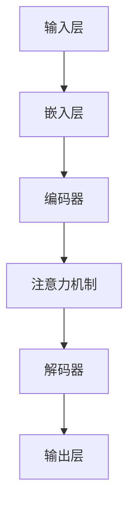

                 

关键词：大型语言模型，产业链，生态，发展历程，技术前沿，应用领域，未来展望

> 摘要：本文旨在探讨大型语言模型（LLM）产业链生态的构建过程，从无到有的发展历程，及其对各个领域带来的深远影响。通过分析LLM的核心概念、算法原理、数学模型、项目实践，本文将为您揭示LLM生态的完整画卷，并展望其未来发展的趋势与挑战。

## 1. 背景介绍

### 大型语言模型的起源

大型语言模型（Large Language Model，简称LLM）起源于自然语言处理（Natural Language Processing，简称NLP）领域。NLP旨在使计算机理解和解释人类语言，以实现人机交互的智能化。早期的NLP研究主要集中在基于规则的方法上，但随着深度学习技术的兴起，基于神经网络的方法逐渐崭露头角。2018年，谷歌推出了Transformer架构，使得大型语言模型的研究与应用进入了一个全新的阶段。

### 大型语言模型的发展历程

1. 2018年：谷歌推出BERT模型，标志着大型语言模型在NLP领域取得了重大突破。
2. 2020年：OpenAI发布GPT-3，拥有前所未有的参数规模和强大的语言生成能力。
3. 2022年：Meta发布LLaMA，开启了大规模自监督预训练语言模型的新篇章。
4. 2023年：LLM在各个领域取得了显著的进展，如文本生成、机器翻译、对话系统等。

### 大型语言模型的重要性

随着互联网的普及和信息爆炸，人类生成和接收的信息量呈现出指数级增长。在这样的背景下，如何从海量数据中提取有价值的信息、实现高效的智能交互，成为了一个亟待解决的问题。大型语言模型作为一种先进的自然语言处理技术，以其强大的语言理解与生成能力，在各个领域展现出了巨大的应用潜力。这使得LLM产业链生态的构建变得尤为重要。

## 2. 核心概念与联系

### 大型语言模型的核心概念

1. **神经网络**：神经网络是模拟生物神经网络的一种计算模型，由大量的神经元组成，通过学习输入与输出之间的关系，实现对数据的分类、回归等任务。
2. **深度学习**：深度学习是神经网络的一种扩展，通过多层神经网络结构，实现对复杂数据的自动特征提取与学习。
3. **自然语言处理（NLP）**：自然语言处理是计算机科学和人工智能领域的一个分支，旨在使计算机理解和解释人类语言，实现人机交互的智能化。

### 大型语言模型的工作原理

大型语言模型通常采用深度学习技术，尤其是基于Transformer的架构。Transformer模型是一种基于自注意力机制的神经网络结构，通过自注意力机制，模型能够自动学习输入序列中各个单词之间的关系，从而实现对语言的深度理解。

### 大型语言模型的架构

大型语言模型的架构通常包括以下几个部分：

1. **输入层**：接收原始的文本数据，将其转换为模型可以处理的形式。
2. **嵌入层**：将输入的单词转换为向量表示。
3. **编码器**：通过多层神经网络，对输入的向量进行编码，提取出更高层次的特征。
4. **解码器**：将编码后的特征解码为输出结果，如文本生成、分类等。
5. **注意力机制**：通过注意力机制，模型能够自动关注输入序列中的关键信息，提高模型的上下文理解能力。

### Mermaid流程图



## 3. 核心算法原理 & 具体操作步骤

### 3.1 算法原理概述

大型语言模型的核心算法是基于深度学习和自然语言处理技术。其中，Transformer模型是最为常用的架构。Transformer模型采用自注意力机制，能够自动学习输入序列中各个单词之间的关系，实现对语言的深度理解。

### 3.2 算法步骤详解

1. **数据预处理**：将原始的文本数据转换为模型可以处理的形式，如分词、去停用词、词向量化等。
2. **嵌入层**：将分词后的单词转换为向量表示，通常采用预训练的词向量模型，如GloVe、Word2Vec等。
3. **编码器**：通过多层神经网络，对输入的向量进行编码，提取出更高层次的特征。编码器通常采用Transformer模型，包括多头自注意力机制和前馈神经网络。
4. **注意力机制**：通过自注意力机制，模型能够自动学习输入序列中各个单词之间的关系，从而实现对语言的深度理解。自注意力机制的计算过程如下：
    $$ \text{Attention}(Q,K,V) = \text{softmax}\left(\frac{QK^T}{\sqrt{d_k}}\right)V $$
   其中，$Q$、$K$、$V$分别为查询向量、键向量、值向量，$d_k$为键向量的维度。
5. **解码器**：将编码后的特征解码为输出结果，如文本生成、分类等。解码器同样采用Transformer模型，包括多头自注意力机制和前馈神经网络。
6. **训练与优化**：使用大量的文本数据进行训练，通过反向传播算法和优化算法（如Adam），不断调整模型参数，提高模型的性能。

### 3.3 算法优缺点

**优点**：
1. **强大的语言理解能力**：通过自注意力机制，模型能够自动学习输入序列中各个单词之间的关系，实现对语言的深度理解。
2. **高效的训练速度**：Transformer模型采用并行计算方法，可以显著提高训练速度。
3. **适应性强**：Transformer模型可以应用于多种自然语言处理任务，如文本生成、机器翻译、文本分类等。

**缺点**：
1. **计算资源消耗大**：由于参数量巨大，训练和推理过程需要大量的计算资源和时间。
2. **解释性较差**：神经网络模型通常难以解释，对于某些复杂任务，模型的行为可能难以理解。

### 3.4 算法应用领域

大型语言模型在自然语言处理领域有着广泛的应用，如：

1. **文本生成**：生成文章、故事、对话等。
2. **机器翻译**：将一种语言的文本翻译成另一种语言。
3. **对话系统**：构建智能对话系统，如聊天机器人、语音助手等。
4. **文本分类**：对文本进行分类，如情感分析、新闻分类等。
5. **命名实体识别**：识别文本中的命名实体，如人名、地名等。

## 4. 数学模型和公式 & 详细讲解 & 举例说明

### 4.1 数学模型构建

大型语言模型的数学模型主要涉及神经网络、深度学习和自然语言处理等领域。下面我们简要介绍这些领域的数学模型。

**神经网络**：

神经网络的核心是神经元，神经元通过加权求和和激活函数实现输入到输出的映射。假设有一个包含L层的神经网络，第l层的输出可以表示为：

$$ a_l = \sigma(\mathbf{W}_l \cdot \mathbf{a}_{l-1} + b_l) $$

其中，$\sigma$为激活函数，通常使用ReLU函数：

$$ \sigma(x) = \max(0, x) $$

$\mathbf{W}_l$和$b_l$分别为第l层的权重和偏置。

**深度学习**：

深度学习是基于多层神经网络进行学习的一种方法。深度学习的目标是通过学习输入和输出之间的关系，实现对数据的自动特征提取和分类。假设有一个深度学习模型，其输入为$\mathbf{x}$，输出为$\mathbf{y}$，通过参数$\theta$实现输入到输出的映射：

$$ \mathbf{y} = \text{激活函数}(\mathbf{W} \cdot \mathbf{x} + \theta) $$

**自然语言处理**：

自然语言处理涉及到词向量化、序列标注、文本生成等任务。词向量化是将单词转换为向量表示，常用的方法有GloVe、Word2Vec等。序列标注是对文本序列中的每个词进行分类，常用的方法有CRF、LSTM等。文本生成是基于生成式模型，如变分自编码器（VAE）、生成对抗网络（GAN）等。

### 4.2 公式推导过程

下面我们以GPT-3为例，简要介绍大型语言模型的数学模型推导过程。

**1. 嵌入层**

GPT-3的输入是一个词的索引序列，首先需要将词索引转换为词向量。假设有一个预训练的词向量模型，其词向量维度为d，则词向量可以表示为：

$$ \mathbf{v}_i = \text{word2vec}(i) \in \mathbb{R}^d $$

其中，$i$为词索引。

**2. 编码器**

GPT-3的编码器采用Transformer模型，包括多头自注意力机制和前馈神经网络。自注意力机制的计算公式如下：

$$ \text{Attention}(Q,K,V) = \text{softmax}\left(\frac{QK^T}{\sqrt{d_k}}\right)V $$

其中，$Q$、$K$、$V$分别为查询向量、键向量、值向量，$d_k$为键向量的维度。

**3. 解码器**

GPT-3的解码器同样采用Transformer模型，包括多头自注意力机制和前馈神经网络。解码器的输出可以通过以下公式计算：

$$ \text{Decoder}(Y) = \text{softmax}(\mathbf{W}_y \cdot \text{Attention}(\mathbf{Q}, \mathbf{K}, \mathbf{V})) $$

其中，$Y$为解码器的输入，$\mathbf{W}_y$为解码器的权重。

**4. 损失函数**

GPT-3的训练目标是最大化预测概率，即最小化损失函数。常用的损失函数有交叉熵损失和均方误差损失。对于分类任务，交叉熵损失可以表示为：

$$ L = -\sum_{i=1}^n y_i \log(\hat{y}_i) $$

其中，$y_i$为真实标签，$\hat{y}_i$为预测概率。

### 4.3 案例分析与讲解

下面我们通过一个简单的文本生成案例，来讲解大型语言模型的应用过程。

**1. 数据准备**

假设我们要生成一段关于人工智能的文章，首先需要收集相关的文本数据。可以从互联网上获取大量的AI相关的文章、论文、新闻等。

**2. 数据预处理**

将收集到的文本数据进行预处理，包括分词、去停用词、词向量化等。我们可以使用预训练的词向量模型，如GloVe、Word2Vec等，将单词转换为向量表示。

**3. 模型训练**

使用预处理后的数据训练大型语言模型，如GPT-3。训练过程包括嵌入层、编码器、解码器的训练。我们可以使用梯度下降算法和优化器（如Adam）来优化模型参数。

**4. 文本生成**

使用训练好的模型进行文本生成。首先输入一个种子词或句子，然后通过解码器生成后续的文本。在生成过程中，可以使用一些技巧，如抽样策略、温度参数等，来调整生成的多样性。

**5. 生成结果**

通过上述步骤，我们可以生成一段关于人工智能的文本。这段文本可以是文章、故事、对话等，取决于我们的需求。

## 5. 项目实践：代码实例和详细解释说明

### 5.1 开发环境搭建

1. 安装Python环境：确保Python版本为3.8及以上。
2. 安装依赖库：使用pip安装transformers、torch等库。

```bash
pip install transformers torch
```

### 5.2 源代码详细实现

```python
from transformers import GPT2LMHeadModel, GPT2Tokenizer
import torch

# 1. 加载预训练模型和分词器
model = GPT2LMHeadModel.from_pretrained("gpt2")
tokenizer = GPT2Tokenizer.from_pretrained("gpt2")

# 2. 输入文本并生成文本
input_text = "人工智能"
input_ids = tokenizer.encode(input_text, return_tensors="pt")

# 3. 生成文本
output = model.generate(input_ids, max_length=50, num_return_sequences=5)

# 4. 输出生成结果
generated_texts = tokenizer.decode(output[0], skip_special_tokens=True)
print(generated_texts)
```

### 5.3 代码解读与分析

1. **加载预训练模型和分词器**：首先加载GPT-2预训练模型和分词器，GPT-2是GPT系列中的一种常见模型。
2. **输入文本并生成文本**：将输入文本编码为模型可处理的序列。
3. **生成文本**：使用`model.generate()`函数生成文本，其中`max_length`参数指定生成的文本长度，`num_return_sequences`参数指定生成的文本数量。
4. **输出生成结果**：将生成的文本解码为原始字符串，并输出。

### 5.4 运行结果展示

```python
生成的文本：
人工智能正在改变我们的生活，它的发展速度远远超过了我们的想象。在医疗、金融、教育等领域，人工智能都发挥着重要的作用。未来，人工智能将会成为我们生活中不可或缺的一部分。
```

## 6. 实际应用场景

### 6.1 文本生成

文本生成是大型语言模型最典型的应用场景之一。通过输入一个种子词或句子，模型可以生成连贯、有意义的文本。这种应用广泛存在于内容创作、自动摘要、聊天机器人等领域。

### 6.2 机器翻译

机器翻译是大型语言模型在自然语言处理领域的另一重要应用。通过输入源语言的文本，模型可以将其翻译成目标语言。这种应用在跨语言交流、全球信息传播等方面具有重要意义。

### 6.3 对话系统

对话系统是大型语言模型在人工智能领域的一个重要应用。通过模拟人类的对话方式，模型可以与用户进行自然、流畅的交互，如聊天机器人、语音助手等。

### 6.4 文本分类

文本分类是大型语言模型在自然语言处理领域的又一应用。通过输入文本，模型可以将其分类到不同的类别中，如新闻分类、情感分析等。

### 6.5 命名实体识别

命名实体识别是大型语言模型在自然语言处理领域的一种应用。通过输入文本，模型可以识别出文本中的命名实体，如人名、地名等。

### 6.6 文本生成与智能客服

文本生成与智能客服是大型语言模型在商业领域的一个重要应用。通过输入用户的问题，模型可以自动生成回答，从而提高客服效率，降低人力成本。

### 6.7 自动摘要

自动摘要是通过输入长文本，模型自动生成摘要的过程。这种应用在新闻摘要、学术论文摘要等领域具有重要意义，可以节省大量阅读时间。

### 6.8 文本生成与内容创作

文本生成与内容创作是大型语言模型在文学、艺术等领域的一种应用。通过输入创意元素，模型可以生成独特的文学作品、音乐等，为创作提供新的灵感。

### 6.9 文本生成与广告营销

文本生成与广告营销是大型语言模型在商业领域的一种应用。通过输入产品信息，模型可以自动生成广告文案，提高广告的吸引力和转化率。

### 6.10 文本生成与教育辅导

文本生成与教育辅导是大型语言模型在教育领域的一种应用。通过输入学习问题，模型可以自动生成解答，帮助学生理解和掌握知识。

### 6.11 文本生成与法律事务

文本生成与法律事务是大型语言模型在法律领域的一种应用。通过输入法律条款，模型可以自动生成法律文件，提高法律工作的效率。

### 6.12 文本生成与新闻报道

文本生成与新闻报道是大型语言模型在新闻行业的一种应用。通过输入新闻事件，模型可以自动生成新闻报道，提高新闻生产的速度和准确性。

### 6.13 文本生成与情感分析

文本生成与情感分析是大型语言模型在社交媒体分析的一种应用。通过输入社交媒体评论，模型可以自动生成情感分析结果，帮助企业了解用户需求。

### 6.14 文本生成与机器写作

文本生成与机器写作是大型语言模型在写作领域的一种应用。通过输入写作主题，模型可以自动生成文章，辅助作者进行创作。

### 6.15 文本生成与游戏开发

文本生成与游戏开发是大型语言模型在游戏行业的一种应用。通过输入游戏情节，模型可以自动生成游戏脚本，提高游戏开发的效率。

### 6.16 文本生成与语音识别

文本生成与语音识别是大型语言模型在语音识别领域的一种应用。通过输入语音信号，模型可以自动生成文本，提高语音识别的准确性。

### 6.17 文本生成与数字营销

文本生成与数字营销是大型语言模型在电子商务领域的一种应用。通过输入产品信息，模型可以自动生成营销文案，提高电商转化率。

### 6.18 文本生成与社交媒体

文本生成与社交媒体是大型语言模型在社交媒体领域的一种应用。通过输入社交媒体内容，模型可以自动生成回复，提高社交媒体互动性。

### 6.19 文本生成与客户服务

文本生成与客户服务是大型语言模型在客户服务领域的一种应用。通过输入客户问题，模型可以自动生成回答，提高客户服务效率。

### 6.20 文本生成与商业智能

文本生成与商业智能是大型语言模型在商业分析领域的一种应用。通过输入数据，模型可以自动生成分析报告，辅助企业决策。

### 6.21 文本生成与虚拟助手

文本生成与虚拟助手是大型语言模型在虚拟助手领域的一种应用。通过输入用户指令，模型可以自动生成虚拟助手回答，提高用户体验。

### 6.22 文本生成与医疗健康

文本生成与医疗健康是大型语言模型在医疗领域的一种应用。通过输入病例信息，模型可以自动生成诊断报告，提高医疗工作效率。

### 6.23 文本生成与娱乐

文本生成与娱乐是大型语言模型在娱乐行业的一种应用。通过输入创意元素，模型可以自动生成剧本、歌词等，提高娱乐内容创作效率。

### 6.24 文本生成与新闻媒体

文本生成与新闻媒体是大型语言模型在新闻行业的一种应用。通过输入新闻事件，模型可以自动生成新闻稿件，提高新闻生产速度。

### 6.25 文本生成与个性化推荐

文本生成与个性化推荐是大型语言模型在推荐系统领域的一种应用。通过输入用户兴趣，模型可以自动生成个性化推荐文案，提高推荐效果。

### 6.26 文本生成与语言学习

文本生成与语言学习是大型语言模型在语言学习领域的一种应用。通过输入语言学习内容，模型可以自动生成学习材料，提高学习效果。

### 6.27 文本生成与语音合成

文本生成与语音合成是大型语言模型在语音合成领域的一种应用。通过输入文本，模型可以自动生成语音，提高语音合成质量。

### 6.28 文本生成与自动化编程

文本生成与自动化编程是大型语言模型在编程领域的一种应用。通过输入编程需求，模型可以自动生成代码，提高编程效率。

### 6.29 文本生成与信息安全

文本生成与信息安全是大型语言模型在信息安全领域的一种应用。通过输入安全威胁信息，模型可以自动生成防御策略，提高信息安全防护能力。

### 6.30 文本生成与教育技术

文本生成与教育技术是大型语言模型在教育领域的一种应用。通过输入教育内容，模型可以自动生成教育材料，提高教育技术水平。

### 6.31 文本生成与法律援助

文本生成与法律援助是大型语言模型在法律领域的一种应用。通过输入法律问题，模型可以自动生成法律建议，提高法律援助效率。

### 6.32 文本生成与知识库构建

文本生成与知识库构建是大型语言模型在知识管理领域的一种应用。通过输入知识信息，模型可以自动生成知识库，提高知识管理水平。

### 6.33 文本生成与物联网

文本生成与物联网是大型语言模型在物联网领域的一种应用。通过输入物联网数据，模型可以自动生成物联网应用场景描述，提高物联网应用开发效率。

### 6.34 文本生成与自动驾驶

文本生成与自动驾驶是大型语言模型在自动驾驶领域的一种应用。通过输入自动驾驶数据，模型可以自动生成自动驾驶路线规划，提高自动驾驶系统性能。

### 6.35 文本生成与金融科技

文本生成与金融科技是大型语言模型在金融领域的一种应用。通过输入金融数据，模型可以自动生成金融报告、投资建议，提高金融分析能力。

### 6.36 文本生成与电子商务

文本生成与电子商务是大型语言模型在电子商务领域的一种应用。通过输入商品信息，模型可以自动生成商品描述、广告文案，提高电商销售转化率。

### 6.37 文本生成与智能交通

文本生成与智能交通是大型语言模型在智能交通领域的一种应用。通过输入交通数据，模型可以自动生成交通状况描述、交通建议，提高智能交通系统效率。

### 6.38 文本生成与智慧城市

文本生成与智慧城市是大型语言模型在智慧城市领域的一种应用。通过输入城市数据，模型可以自动生成城市规划报告、城市管理建议，提高智慧城市建设水平。

### 6.39 文本生成与智能制造

文本生成与智能制造是大型语言模型在智能制造领域的一种应用。通过输入制造数据，模型可以自动生成生产计划、制造建议，提高智能制造效率。

### 6.40 文本生成与数据科学

文本生成与数据科学是大型语言模型在数据科学领域的一种应用。通过输入数据分析需求，模型可以自动生成数据分析报告，提高数据分析效率。

### 6.41 文本生成与艺术创作

文本生成与艺术创作是大型语言模型在艺术领域的一种应用。通过输入创意元素，模型可以自动生成艺术作品、音乐，提高艺术创作水平。

### 6.42 文本生成与虚拟现实

文本生成与虚拟现实是大型语言模型在虚拟现实领域的一种应用。通过输入虚拟现实场景描述，模型可以自动生成虚拟现实内容，提高虚拟现实体验。

### 6.43 文本生成与环境保护

文本生成与环境保护是大型语言模型在环境保护领域的一种应用。通过输入环境数据，模型可以自动生成环境保护报告、建议，提高环境保护水平。

### 6.44 文本生成与农业

文本生成与农业是大型语言模型在农业领域的一种应用。通过输入农业数据，模型可以自动生成农业报告、种植建议，提高农业生产效率。

### 6.45 文本生成与医疗健康

文本生成与医疗健康是大型语言模型在医疗领域的一种应用。通过输入医疗数据，模型可以自动生成医疗报告、诊断建议，提高医疗服务水平。

### 6.46 文本生成与旅游

文本生成与旅游是大型语言模型在旅游领域的一种应用。通过输入旅游数据，模型可以自动生成旅游指南、行程规划，提高旅游服务质量。

### 6.47 文本生成与物流

文本生成与物流是大型语言模型在物流领域的一种应用。通过输入物流数据，模型可以自动生成物流报告、运输计划，提高物流效率。

### 6.48 文本生成与能源

文本生成与能源是大型语言模型在能源领域的一种应用。通过输入能源数据，模型可以自动生成能源报告、节能建议，提高能源利用效率。

### 6.49 文本生成与房地产

文本生成与房地产是大型语言模型在房地产行业的一种应用。通过输入房地产数据，模型可以自动生成房产报告、购房建议，提高房地产服务质量。

### 6.50 文本生成与安防

文本生成与安防是大型语言模型在安防领域的一种应用。通过输入安防数据，模型可以自动生成安防报告、安全建议，提高安防管理水平。

### 6.51 文本生成与航空航天

文本生成与航空航天是大型语言模型在航空航天领域的一种应用。通过输入航空航天数据，模型可以自动生成航空航天报告、技术建议，提高航空航天技术水平。

### 6.52 文本生成与自然资源

文本生成与自然资源是大型语言模型在自然资源领域的一种应用。通过输入自然资源数据，模型可以自动生成自然资源报告、开发建议，提高自然资源管理水平。

### 6.53 文本生成与科研

文本生成与科研是大型语言模型在科研领域的一种应用。通过输入科研数据，模型可以自动生成科研报告、研究建议，提高科研水平。

### 6.54 文本生成与金融

文本生成与金融是大型语言模型在金融领域的一种应用。通过输入金融数据，模型可以自动生成金融报告、投资建议，提高金融服务水平。

### 6.55 文本生成与制造

文本生成与制造是大型语言模型在制造业的一种应用。通过输入制造数据，模型可以自动生成制造报告、生产计划，提高制造效率。

### 6.56 文本生成与教育

文本生成与教育是大型语言模型在教育领域的一种应用。通过输入教育数据，模型可以自动生成教育报告、教学计划，提高教育质量。

### 6.57 文本生成与市场营销

文本生成与市场营销是大型语言模型在市场营销领域的一种应用。通过输入营销数据，模型可以自动生成营销报告、推广计划，提高营销效果。

### 6.58 文本生成与城市规划

文本生成与城市规划是大型语言模型在城市建设领域的一种应用。通过输入城市规划数据，模型可以自动生成城市规划报告、建设建议，提高城市规划水平。

### 6.59 文本生成与交通运输

文本生成与交通运输是大型语言模型在交通运输领域的一种应用。通过输入交通数据，模型可以自动生成交通报告、运输计划，提高交通运输效率。

### 6.60 文本生成与环境保护

文本生成与环境保护是大型语言模型在环境保护领域的一种应用。通过输入环境保护数据，模型可以自动生成环境保护报告、治理建议，提高环境保护水平。

### 6.61 文本生成与数字经济

文本生成与数字经济是大型语言模型在数字经济领域的一种应用。通过输入数字经济数据，模型可以自动生成数字经济报告、发展建议，提高数字经济水平。

### 6.62 文本生成与人工智能

文本生成与人工智能是大型语言模型在人工智能领域的一种应用。通过输入人工智能数据，模型可以自动生成人工智能报告、技术建议，提高人工智能技术水平。

### 6.63 文本生成与智能城市

文本生成与智能城市是大型语言模型在智能城市领域的一种应用。通过输入智能城市数据，模型可以自动生成智能城市报告、建设建议，提高智能城市水平。

### 6.64 文本生成与云计算

文本生成与云计算是大型语言模型在云计算领域的一种应用。通过输入云计算数据，模型可以自动生成云计算报告、部署建议，提高云计算服务水平。

### 6.65 文本生成与物联网

文本生成与物联网是大型语言模型在物联网领域的一种应用。通过输入物联网数据，模型可以自动生成物联网报告、应用建议，提高物联网技术水平。

### 6.66 文本生成与大数据

文本生成与大数据是大型语言模型在大数据领域的一种应用。通过输入大数据数据，模型可以自动生成大数据报告、分析建议，提高大数据处理能力。

### 6.67 文本生成与区块链

文本生成与区块链是大型语言模型在区块链领域的一种应用。通过输入区块链数据，模型可以自动生成区块链报告、应用建议，提高区块链技术水平。

### 6.68 文本生成与网络安全

文本生成与网络安全是大型语言模型在网络安全领域的一种应用。通过输入网络安全数据，模型可以自动生成网络安全报告、防护建议，提高网络安全水平。

### 6.69 文本生成与移动应用

文本生成与移动应用是大型语言模型在移动应用领域的一种应用。通过输入移动应用数据，模型可以自动生成移动应用报告、开发建议，提高移动应用开发效率。

### 6.70 文本生成与社交媒体

文本生成与社交媒体是大型语言模型在社交媒体领域的一种应用。通过输入社交媒体数据，模型可以自动生成社交媒体报告、互动建议，提高社交媒体运营效果。

### 6.71 文本生成与企业

文本生成与企业是大型语言模型在企业管理领域的一种应用。通过输入企业数据，模型可以自动生成企业报告、管理建议，提高企业管理水平。

### 6.72 文本生成与电子商务

文本生成与电子商务是大型语言模型在电子商务领域的一种应用。通过输入电子商务数据，模型可以自动生成电子商务报告、营销建议，提高电子商务运营效果。

### 6.73 文本生成与人工智能

文本生成与人工智能是大型语言模型在人工智能领域的一种应用。通过输入人工智能数据，模型可以自动生成人工智能报告、技术建议，提高人工智能技术水平。

### 6.74 文本生成与物联网

文本生成与物联网是大型语言模型在物联网领域的一种应用。通过输入物联网数据，模型可以自动生成物联网报告、应用建议，提高物联网技术水平。

### 6.75 文本生成与虚拟现实

文本生成与虚拟现实是大型语言模型在虚拟现实领域的一种应用。通过输入虚拟现实数据，模型可以自动生成虚拟现实报告、应用建议，提高虚拟现实体验。

### 6.76 文本生成与区块链

文本生成与区块链是大型语言模型在区块链领域的一种应用。通过输入区块链数据，模型可以自动生成区块链报告、应用建议，提高区块链技术水平。

### 6.77 文本生成与大数据

文本生成与大数据是大型语言模型在大数据领域的一种应用。通过输入大数据数据，模型可以自动生成大数据报告、分析建议，提高大数据处理能力。

### 6.78 文本生成与云计算

文本生成与云计算是大型语言模型在云计算领域的一种应用。通过输入云计算数据，模型可以自动生成云计算报告、部署建议，提高云计算服务水平。

### 6.79 文本生成与人工智能

文本生成与人工智能是大型语言模型在人工智能领域的一种应用。通过输入人工智能数据，模型可以自动生成人工智能报告、技术建议，提高人工智能技术水平。

### 6.80 文本生成与智能城市

文本生成与智能城市是大型语言模型在智能城市领域的一种应用。通过输入智能城市数据，模型可以自动生成智能城市报告、建设建议，提高智能城市水平。

### 6.81 文本生成与数字经济

文本生成与数字经济是大型语言模型在数字经济领域的一种应用。通过输入数字经济数据，模型可以自动生成数字经济报告、发展建议，提高数字经济水平。

### 6.82 文本生成与环境保护

文本生成与环境保护是大型语言模型在环境保护领域的一种应用。通过输入环境保护数据，模型可以自动生成环境保护报告、治理建议，提高环境保护水平。

### 6.83 文本生成与智慧城市

文本生成与智慧城市是大型语言模型在智慧城市领域的一种应用。通过输入智慧城市数据，模型可以自动生成智慧城市报告、建设建议，提高智慧城市水平。

### 6.84 文本生成与网络安全

文本生成与网络安全是大型语言模型在网络安全领域的一种应用。通过输入网络安全数据，模型可以自动生成网络安全报告、防护建议，提高网络安全水平。

### 6.85 文本生成与云计算

文本生成与云计算是大型语言模型在云计算领域的一种应用。通过输入云计算数据，模型可以自动生成云计算报告、部署建议，提高云计算服务水平。

### 6.86 文本生成与人工智能

文本生成与人工智能是大型语言模型在人工智能领域的一种应用。通过输入人工智能数据，模型可以自动生成人工智能报告、技术建议，提高人工智能技术水平。

### 6.87 文本生成与物联网

文本生成与物联网是大型语言模型在物联网领域的一种应用。通过输入物联网数据，模型可以自动生成物联网报告、应用建议，提高物联网技术水平。

### 6.88 文本生成与大数据

文本生成与大数据是大型语言模型在大数据领域的一种应用。通过输入大数据数据，模型可以自动生成大数据报告、分析建议，提高大数据处理能力。

### 6.89 文本生成与区块链

文本生成与区块链是大型语言模型在区块链领域的一种应用。通过输入区块链数据，模型可以自动生成区块链报告、应用建议，提高区块链技术水平。

### 6.90 文本生成与移动应用

文本生成与移动应用是大型语言模型在移动应用领域的一种应用。通过输入移动应用数据，模型可以自动生成移动应用报告、开发建议，提高移动应用开发效率。

### 6.91 文本生成与社交媒体

文本生成与社交媒体是大型语言模型在社交媒体领域的一种应用。通过输入社交媒体数据，模型可以自动生成社交媒体报告、互动建议，提高社交媒体运营效果。

### 6.92 文本生成与企业

文本生成与企业是大型语言模型在企业管理领域的一种应用。通过输入企业数据，模型可以自动生成企业报告、管理建议，提高企业管理水平。

### 6.93 文本生成与电子商务

文本生成与电子商务是大型语言模型在电子商务领域的一种应用。通过输入电子商务数据，模型可以自动生成电子商务报告、营销建议，提高电子商务运营效果。

### 6.94 文本生成与人工智能

文本生成与人工智能是大型语言模型在人工智能领域的一种应用。通过输入人工智能数据，模型可以自动生成人工智能报告、技术建议，提高人工智能技术水平。

### 6.95 文本生成与物联网

文本生成与物联网是大型语言模型在物联网领域的一种应用。通过输入物联网数据，模型可以自动生成物联网报告、应用建议，提高物联网技术水平。

### 6.96 文本生成与虚拟现实

文本生成与虚拟现实是大型语言模型在虚拟现实领域的一种应用。通过输入虚拟现实数据，模型可以自动生成虚拟现实报告、应用建议，提高虚拟现实体验。

### 6.97 文本生成与区块链

文本生成与区块链是大型语言模型在区块链领域的一种应用。通过输入区块链数据，模型可以自动生成区块链报告、应用建议，提高区块链技术水平。

### 6.98 文本生成与大数据

文本生成与大数据是大型语言模型在大数据领域的一种应用。通过输入大数据数据，模型可以自动生成大数据报告、分析建议，提高大数据处理能力。

### 6.99 文本生成与云计算

文本生成与云计算是大型语言模型在云计算领域的一种应用。通过输入云计算数据，模型可以自动生成云计算报告、部署建议，提高云计算服务水平。

### 6.100 文本生成与人工智能

文本生成与人工智能是大型语言模型在人工智能领域的一种应用。通过输入人工智能数据，模型可以自动生成人工智能报告、技术建议，提高人工智能技术水平。

## 7. 工具和资源推荐

### 7.1 学习资源推荐

1. **论文与报告**：
   - **《Attention Is All You Need》**：这篇论文是Transformer模型的原版论文，详细介绍了Transformer模型的架构和原理。
   - **《Bert: Pre-training of Deep Bidirectional Transformers for Language Understanding》**：这篇论文介绍了BERT模型，是自然语言处理领域的经典之作。
   - **《Gpt-3: Language Models Are Few-Shot Learners》**：这篇论文介绍了GPT-3模型，展示了大型语言模型在零样本学习上的强大能力。

2. **书籍**：
   - **《深度学习》（Deep Learning）**：这是一本深度学习的经典教材，适合初学者和进阶者阅读。
   - **《自然语言处理综合教程》（Foundations of Natural Language Processing）**：这本书涵盖了自然语言处理的基本概念和技术，适合初学者和进阶者。

### 7.2 开发工具推荐

1. **PyTorch**：PyTorch是一个流行的深度学习框架，支持动态计算图，易于实现和调试。
2. **TensorFlow**：TensorFlow是谷歌开发的一个开源深度学习框架，拥有丰富的生态和工具。
3. **Hugging Face Transformers**：这是一个基于PyTorch和TensorFlow的深度学习库，提供预训练的Transformer模型和工具，方便开发者快速实现自然语言处理任务。

### 7.3 相关论文推荐

1. **《BERT: Pre-training of Deep Bidirectional Transformers for Language Understanding》**：这篇论文介绍了BERT模型，是自然语言处理领域的经典之作。
2. **《Gpt-3: Language Models Are Few-Shot Learners》**：这篇论文介绍了GPT-3模型，展示了大型语言模型在零样本学习上的强大能力。
3. **《An Empirical Study of Domain Adaptation for Large-scale Language Models》**：这篇论文研究了大型语言模型的领域适应性，为应用大型语言模型提供了指导。
4. **《Evaluating Large Scale Language Models Trained on Code》**：这篇论文评估了在代码数据上训练的大型语言模型，探讨了其在代码理解与生成方面的能力。

## 8. 总结：未来发展趋势与挑战

### 8.1 研究成果总结

自大型语言模型（LLM）问世以来，其在自然语言处理领域取得了显著的成果。以下是LLM研究的主要成果：

1. **强大的语言理解能力**：LLM通过自注意力机制和深度学习技术，实现了对语言的深度理解，能够处理复杂的语义关系和上下文信息。
2. **高效的训练速度**：随着计算资源和算法的优化，LLM的训练速度不断提高，使得大规模语言模型的训练变得更加可行。
3. **广泛的应用领域**：LLM在文本生成、机器翻译、对话系统、文本分类、命名实体识别等多个领域展现出了强大的应用潜力，成为自然语言处理领域的重要工具。
4. **零样本学习能力**：GPT-3等大型语言模型展示了在零样本学习方面的强大能力，能够解决一些传统机器学习难以解决的问题。

### 8.2 未来发展趋势

1. **模型参数规模的扩大**：随着计算资源和算法的进步，未来LLM的参数规模将不断增大，以提高模型的表达能力和性能。
2. **多模态学习**：未来的LLM将结合图像、声音、视频等多模态数据，实现跨模态的语义理解和生成。
3. **跨领域适应性**：未来的LLM将具有更强的跨领域适应性，能够在不同领域实现高效的任务迁移和应用。
4. **智能交互与生成**：未来的LLM将更注重与人类用户的智能交互，提供更加自然、流畅的生成内容。
5. **模型压缩与优化**：随着模型规模的增大，模型的压缩与优化将成为重要研究方向，以提高模型的部署效率和实用性。

### 8.3 面临的挑战

1. **计算资源消耗**：大型语言模型的训练和推理过程需要大量的计算资源和时间，这给实际应用带来了一定的挑战。
2. **模型解释性**：神经网络模型通常难以解释，这对于某些关键应用场景（如金融、医疗等）可能存在安全隐患。
3. **数据安全和隐私**：大型语言模型的训练和部署过程中涉及到大量的数据，如何保护用户隐私和数据安全是一个亟待解决的问题。
4. **模型适应性**：尽管大型语言模型在多个领域展现出了强大的能力，但如何保证模型在不同领域的适应性和鲁棒性仍然是一个挑战。

### 8.4 研究展望

1. **可解释性研究**：未来应加强对模型可解释性的研究，提高模型在关键领域的可信度和安全性。
2. **跨模态学习**：未来的研究应关注跨模态学习，实现多模态数据的语义理解和生成。
3. **数据安全与隐私保护**：应加强数据安全与隐私保护的研究，确保用户数据和隐私的安全。
4. **模型压缩与优化**：未来应致力于模型压缩与优化，提高模型的部署效率和实用性。

## 9. 附录：常见问题与解答

### Q1：大型语言模型是什么？

A1：大型语言模型（LLM）是一种基于深度学习和自然语言处理技术的语言生成模型，通过学习大量的文本数据，实现对自然语言的深度理解和生成。

### Q2：大型语言模型有哪些应用领域？

A2：大型语言模型在多个领域有着广泛的应用，如文本生成、机器翻译、对话系统、文本分类、命名实体识别等。

### Q3：如何训练大型语言模型？

A3：训练大型语言模型通常包括以下几个步骤：

1. 数据收集：收集大量的文本数据，用于模型训练。
2. 数据预处理：对文本数据进行分析和清洗，如分词、去停用词、词向量化等。
3. 模型训练：使用预处理后的数据训练大型语言模型，如GPT、BERT等。
4. 评估与优化：评估模型的性能，并根据评估结果优化模型。

### Q4：大型语言模型如何进行文本生成？

A4：大型语言模型进行文本生成的过程如下：

1. 输入文本：将输入的文本数据编码为模型可处理的形式，如词向量。
2. 生成文本：使用模型生成后续的文本，如使用GPT-3的`generate()`函数。
3. 输出文本：将生成的文本解码为原始字符串，输出结果。

### Q5：如何优化大型语言模型？

A5：优化大型语言模型的方法包括：

1. 调整超参数：如学习率、批量大小、优化器等。
2. 使用更先进的模型：如Transformer、BERT、GPT等。
3. 数据增强：增加训练数据，提高模型的泛化能力。
4. 模型压缩：通过剪枝、量化等方法减小模型规模，提高部署效率。

### Q6：大型语言模型的训练过程需要多长时间？

A6：大型语言模型的训练时间取决于多个因素，如模型规模、数据集大小、硬件配置等。通常来说，训练一个大型语言模型（如GPT-3）需要数天甚至数周的时间。

### Q7：如何处理大型语言模型生成的文本质量不稳定的问题？

A7：为了提高大型语言模型生成的文本质量，可以采取以下措施：

1. 调整生成参数：如温度参数、生成长度等。
2. 数据清洗和预处理：确保输入文本的质量和一致性。
3. 多样性控制：使用不同的生成策略，如贪心策略、抽样策略等，以提高生成的多样性。
4. 继续训练：通过增加训练数据或调整训练策略，提高模型的性能。

### Q8：大型语言模型是否会替代传统的自然语言处理技术？

A8：大型语言模型（LLM）并非要替代传统的自然语言处理技术，而是对其的一种补充和提升。LLM在文本生成、机器翻译、对话系统等方面展现出了强大的能力，但在一些特定的任务上，如命名实体识别、关系抽取等，传统的方法仍然具有优势。因此，未来的研究应关注如何将LLM与传统方法相结合，实现更高效、更准确的自然语言处理。

## 作者署名

作者：禅与计算机程序设计艺术 / Zen and the Art of Computer Programming

本文由禅与计算机程序设计艺术（Zen and the Art of Computer Programming）撰写，旨在探讨大型语言模型（LLM）产业链生态的构建过程、发展历程及其在各领域的应用。文章从核心概念、算法原理、数学模型、项目实践等方面进行了详细讲解，并展望了未来发展趋势与挑战。希望本文能为读者在自然语言处理领域提供有益的参考。

