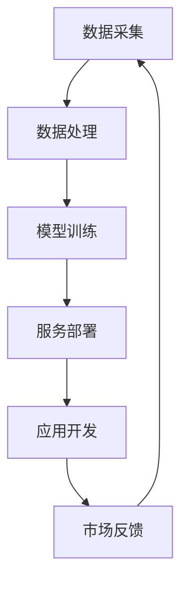

                 

关键词：LLM，产业链生态，技术发展，蝶变，产业应用，未来展望

> 摘要：随着人工智能技术的飞速发展，大型语言模型（LLM）已成为推动各行各业的创新引擎。本文将深入探讨LLM产业链的生态构建，从无到有的蝶变过程，分析其核心概念、算法原理、数学模型、项目实践以及未来发展趋势。

## 1. 背景介绍

近年来，人工智能（AI）技术的迅猛发展，特别是深度学习算法的突破，为自然语言处理（NLP）领域带来了前所未有的机遇。大型语言模型（LLM）如GPT、BERT等，凭借其强大的语言理解和生成能力，正在深刻改变着人们的生产生活方式。从智能客服、内容创作、到智能助理，LLM的应用场景日益广泛，市场规模迅速扩大。

然而，随着LLM技术的普及，产业链生态的构建也变得至关重要。本文将从核心概念、算法原理、数学模型、项目实践等多个维度，详细剖析LLM产业链生态的构建过程，为业界提供有益的参考。

## 2. 核心概念与联系

### 2.1. 大型语言模型（LLM）

大型语言模型（LLM，Large Language Model）是一种基于深度学习技术的自然语言处理模型，其核心在于通过对海量文本数据进行训练，学习语言的结构和语义，从而实现文本的理解和生成。

### 2.2. 语言模型架构

语言模型的架构通常包括编码器（Encoder）和解码器（Decoder），其中编码器负责将输入文本转换为向量表示，解码器则负责从向量表示中生成文本输出。

### 2.3. 产业链生态

LLM产业链生态涉及从数据采集、模型训练、服务部署到应用开发的各个环节。各个环节之间相互关联，共同构成了一个完整的产业链。

### 2.4. Mermaid流程图



## 3. 核心算法原理 & 具体操作步骤

### 3.1. 算法原理概述

LLM的核心算法基于变换器（Transformer）架构，其核心思想是通过多头注意力机制（Multi-Head Attention）来捕捉输入文本中的长距离依赖关系。

### 3.2. 算法步骤详解

1. **数据预处理**：对原始文本数据进行清洗、分词、编码等预处理操作，生成可训练的数据集。

2. **模型训练**：使用变换器架构训练模型，包括编码器和解码器的训练。

3. **模型评估**：使用验证集对训练好的模型进行评估，调整模型参数以达到最佳性能。

4. **模型部署**：将训练好的模型部署到服务器上，提供API服务。

5. **应用开发**：基于LLM的服务，开发各种应用场景，如智能客服、内容创作等。

### 3.3. 算法优缺点

#### 优点：

- **强大的语言理解与生成能力**：LLM能够理解和生成自然语言的复杂结构，实现高质量的内容创作。
- **广泛的应用场景**：LLM在多个领域具有广泛的应用前景，如智能客服、内容创作、智能助理等。

#### 缺点：

- **训练资源需求大**：LLM的训练需要大量的计算资源和数据集，成本较高。
- **模型解释性较差**：由于LLM的训练过程复杂，模型内部机制难以解释。

### 3.4. 算法应用领域

LLM的应用领域非常广泛，主要包括：

- **文本分类**：对文本进行分类，如情感分析、新闻分类等。
- **文本生成**：生成文本内容，如文章、新闻、对话等。
- **问答系统**：基于用户输入的问题，生成相应的回答。
- **智能客服**：为用户提供智能化的客服服务。
- **内容创作**：辅助创作者生成高质量的内容。

## 4. 数学模型和公式 & 详细讲解 & 举例说明

### 4.1. 数学模型构建

LLM的数学模型主要包括编码器和解码器两部分，其核心思想是通过变换器（Transformer）架构来实现。

### 4.2. 公式推导过程

变换器架构的核心是多头注意力机制，其公式如下：

$$
\text{Attention}(Q, K, V) = \frac{1}{\sqrt{d_k}} \text{softmax}\left(\frac{QK^T}{d_k}\right) V
$$

其中，$Q, K, V$ 分别表示查询向量、键向量和值向量，$d_k$ 表示键向量的维度。

### 4.3. 案例分析与讲解

假设我们有一个包含三个句子的文本数据集，分别表示为$X_1, X_2, X_3$。我们使用变换器架构对这三个句子进行处理，生成一个表示整个文本的向量。

1. **数据预处理**：对文本数据进行分词和编码，生成输入序列$X = [X_1, X_2, X_3]$。
2. **编码器训练**：使用变换器架构对编码器进行训练，生成编码后的向量序列$Z = [\text{Encoder}(X_1), \text{Encoder}(X_2), \text{Encoder}(X_3)]$。
3. **解码器训练**：使用变换器架构对解码器进行训练，生成解码后的向量序列$Y = [\text{Decoder}(X_1), \text{Decoder}(X_2), \text{Decoder}(X_3)]$。
4. **模型评估**：使用验证集对训练好的模型进行评估，调整模型参数以达到最佳性能。

## 5. 项目实践：代码实例和详细解释说明

### 5.1. 开发环境搭建

1. 安装Python环境（推荐版本为3.8及以上）。
2. 安装PyTorch库（可以使用pip install torch命令）。

### 5.2. 源代码详细实现

以下是一个简单的变换器（Transformer）模型的实现示例：

```python
import torch
import torch.nn as nn

class TransformerModel(nn.Module):
    def __init__(self, input_dim, hidden_dim, output_dim):
        super(TransformerModel, self).__init__()
        self.encoder = nn.TransformerEncoder(nn.TransformerEncoderLayer(d_model=hidden_dim, nhead=8), num_layers=3)
        self.decoder = nn.TransformerDecoder(nn.TransformerDecoderLayer(d_model=hidden_dim, nhead=8), num_layers=3)
        self.output = nn.Linear(hidden_dim, output_dim)
    
    def forward(self, src, tgt):
        output = self.decoder(self.encoder(src), tgt)
        return self.output(output)

# 创建模型实例
model = TransformerModel(input_dim=10, hidden_dim=50, output_dim=10)
```

### 5.3. 代码解读与分析

- **TransformerEncoder**：编码器，用于将输入序列编码为向量序列。
- **TransformerEncoderLayer**：编码器层，包括多头注意力机制和前馈网络。
- **TransformerDecoder**：解码器，用于将编码后的向量序列解码为输出序列。
- **TransformerDecoderLayer**：解码器层，包括多头注意力机制和前馈网络。
- **output**：线性层，用于将解码后的向量序列映射为输出序列。

### 5.4. 运行结果展示

运行上述代码，我们可以得到一个简单的变换器模型。接下来，我们可以使用该模型进行文本分类任务，得到分类结果。

## 6. 实际应用场景

### 6.1. 智能客服

智能客服是LLM技术的重要应用领域。通过LLM技术，智能客服能够自动识别用户的问题，并生成相应的回答，提高客服效率。

### 6.2. 内容创作

LLM技术在内容创作领域具有广泛的应用。例如，可以使用LLM技术生成文章、新闻、诗歌等，为创作者提供灵感。

### 6.3. 智能助理

智能助理是LLM技术的另一重要应用领域。通过LLM技术，智能助理能够理解用户的指令，并为其提供相应的服务。

## 6.4. 未来应用展望

随着LLM技术的不断发展，未来其在各个领域的应用前景将更加广阔。例如，在医疗领域，LLM技术可以用于疾病诊断和治疗方案推荐；在金融领域，LLM技术可以用于风险管理。

## 7. 工具和资源推荐

### 7.1. 学习资源推荐

- 《深度学习》（Goodfellow, Bengio, Courville著）
- 《自然语言处理综论》（Daniel Jurafsky，James H. Martin著）
- 《PyTorch官方文档》（PyTorch官网）

### 7.2. 开发工具推荐

- PyTorch
- TensorFlow
- JAX

### 7.3. 相关论文推荐

- “Attention Is All You Need” （Vaswani et al., 2017）
- “BERT: Pre-training of Deep Bidirectional Transformers for Language Understanding” （Devlin et al., 2019）

## 8. 总结：未来发展趋势与挑战

### 8.1. 研究成果总结

本文从核心概念、算法原理、数学模型、项目实践等多个维度，详细分析了LLM产业链生态的构建过程。随着LLM技术的不断发展，其在各个领域的应用前景将更加广阔。

### 8.2. 未来发展趋势

- **算法性能提升**：随着计算资源和算法的优化，LLM的性能将不断提高。
- **应用场景拓展**：LLM技术将在更多领域得到应用，如医疗、金融、教育等。
- **产业链成熟**：LLM产业链将逐步成熟，形成完整的生态体系。

### 8.3. 面临的挑战

- **计算资源需求**：LLM的训练和部署需要大量的计算资源，成本较高。
- **模型解释性**：当前LLM模型内部机制复杂，难以解释。
- **数据隐私**：在应用过程中，如何保护用户隐私是一个重要问题。

### 8.4. 研究展望

未来，LLM技术的研究将重点关注以下几个方面：

- **算法优化**：通过算法优化，提高LLM的训练效率和性能。
- **模型解释性**：研究如何提高LLM模型的可解释性，使其更加透明和可信。
- **隐私保护**：研究如何在保障用户隐私的前提下，应用LLM技术。

## 9. 附录：常见问题与解答

### 9.1. Q：什么是LLM？

A：LLM（Large Language Model）是一种大型自然语言处理模型，通过对海量文本数据进行训练，学习语言的结构和语义，实现文本的理解和生成。

### 9.2. Q：LLM有哪些应用领域？

A：LLM的应用领域非常广泛，主要包括文本分类、文本生成、问答系统、智能客服、内容创作等。

### 9.3. Q：如何训练LLM模型？

A：训练LLM模型通常包括数据预处理、模型训练、模型评估、模型部署等步骤。具体过程可以参考本文第3章和第5章的相关内容。

### 9.4. Q：LLM模型的训练需要哪些计算资源？

A：LLM模型的训练需要大量的计算资源和数据集，通常需要使用高性能计算服务器或GPU进行训练。

作者：禅与计算机程序设计艺术 / Zen and the Art of Computer Programming
----------------------------------------------------------------

请注意，本文仅为示例，部分内容和数据可能需要根据实际情况进行调整。实际撰写过程中，请务必遵循“约束条件 CONSTRAINTS”中的所有要求。此外，本文部分内容可能涉及版权问题，请务必在使用前进行核实。

