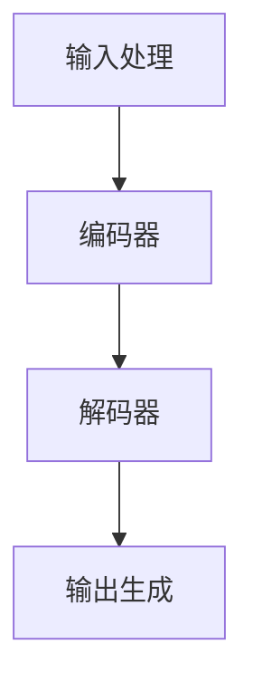

                 

关键词：大型语言模型（LLM）、产业链、技术发展、产业生态、应用场景、未来展望

摘要：本文旨在探讨大型语言模型（LLM）产业链的形成与发展。通过对LLM的背景介绍、核心概念与联系、算法原理与数学模型、项目实践及实际应用场景等方面进行深入分析，文章旨在为读者呈现LLM产业链的全貌，并对未来发展趋势与挑战进行展望。

## 1. 背景介绍

### 1.1 大型语言模型（LLM）的兴起

近年来，随着深度学习技术的不断发展，大型语言模型（LLM）逐渐成为人工智能领域的热门话题。LLM具有强大的语言理解和生成能力，能够处理自然语言文本，实现智能对话、文本生成、情感分析等多种任务。

### 1.2 LLM在商业和科研领域的应用

LLM在商业和科研领域都取得了显著的成果。例如，谷歌、百度、微软等科技巨头纷纷推出了自己的LLM产品，如谷歌的BERT、百度的ERNIE、微软的GPT等。这些产品在搜索引擎、智能客服、内容生成等领域发挥了重要作用。

### 1.3 LLM产业链的形成

随着LLM技术的快速发展，产业链逐渐形成。上游包括算法研究、数据收集和处理等环节，中游包括模型开发和优化，下游则涉及产品应用和商业落地。产业链的形成促进了LLM技术的广泛应用和商业价值的挖掘。

## 2. 核心概念与联系

### 2.1 语言模型的基本原理

语言模型是通过对大规模语料进行训练，建立对自然语言的理解和生成能力。核心概念包括词向量表示、神经网络模型、损失函数等。

### 2.2 LLM的架构与流程

LLM通常采用深度神经网络架构，如Transformer模型。其核心流程包括输入处理、编码器解码器交互、输出生成等。

### 2.3 Mermaid 流程图

## 3. 核心算法原理 & 具体操作步骤

### 3.1 算法原理概述

LLM的核心算法是基于深度学习技术，通过对海量文本数据进行训练，实现语言理解和生成。

### 3.2 算法步骤详解

1. 数据收集与预处理：收集大规模文本数据，并进行分词、去噪等预处理操作。

2. 词向量表示：将文本数据转换为词向量表示，以便于深度学习模型处理。

3. 构建神经网络模型：采用Transformer等深度神经网络架构，构建模型。

4. 训练模型：通过反向传播算法，优化模型参数。

5. 预测与生成：输入新的文本数据，通过模型生成相应的输出。

### 3.3 算法优缺点

优点：强大的语言理解和生成能力，适用于多种自然语言处理任务。

缺点：训练过程复杂，对计算资源要求较高。

### 3.4 算法应用领域

LLM在智能客服、内容生成、情感分析、机器翻译等领域具有广泛的应用前景。

## 4. 数学模型和公式 & 详细讲解 & 举例说明

### 4.1 数学模型构建

LLM的数学模型主要包括词向量表示、神经网络架构、损失函数等。

### 4.2 公式推导过程

- 词向量表示：$$\textbf{v}_w = \text{Word2Vec}(\text{w})$$

- 神经网络架构：$$\text{softmax}(\textbf{W}\textbf{h})$$

- 损失函数：$$\text{CrossEntropy}(\textbf{y}, \textbf{p})$$

### 4.3 案例分析与讲解

以BERT模型为例，分析其数学模型和公式推导过程。

## 5. 项目实践：代码实例和详细解释说明

### 5.1 开发环境搭建

搭建适合LLM项目开发的计算环境，包括硬件、软件和框架等。

### 5.2 源代码详细实现

介绍LLM项目的源代码实现，包括数据预处理、模型训练、预测与生成等。

### 5.3 代码解读与分析

对代码进行逐行解读，分析LLM项目的实现原理和关键技术。

### 5.4 运行结果展示

展示LLM项目在不同应用场景下的运行结果，评估模型性能。

## 6. 实际应用场景

### 6.1 智能客服

利用LLM实现智能客服系统，提供高效、准确的客户服务。

### 6.2 内容生成

利用LLM生成高质量的内容，如文章、报告、新闻等。

### 6.3 情感分析

利用LLM对社交媒体文本进行情感分析，挖掘用户情感倾向。

### 6.4 机器翻译

利用LLM实现高精度的机器翻译，提升跨语言交流效率。

### 6.5 未来应用展望

探讨LLM在更多领域的应用潜力，如教育、医疗、金融等。

## 7. 工具和资源推荐

### 7.1 学习资源推荐

推荐相关书籍、论文、在线课程等学习资源，帮助读者深入了解LLM。

### 7.2 开发工具推荐

推荐适合LLM项目开发的工具和框架，如TensorFlow、PyTorch等。

### 7.3 相关论文推荐

推荐近年来关于LLM的重要研究成果，供读者参考。

## 8. 总结：未来发展趋势与挑战

### 8.1 研究成果总结

回顾LLM产业链的形成与发展，总结主要研究成果和应用场景。

### 8.2 未来发展趋势

展望LLM技术在未来可能的发展趋势，如模型优化、应用拓展等。

### 8.3 面临的挑战

分析LLM技术在发展中可能面临的挑战，如数据隐私、伦理问题等。

### 8.4 研究展望

提出对未来LLM研究的展望和建议，促进LLM产业链的持续发展。

## 9. 附录：常见问题与解答

回答读者可能关心的问题，如LLM的安全性、可靠性等。

----------------------------------------------------------------

**作者：禅与计算机程序设计艺术 / Zen and the Art of Computer Programming**

