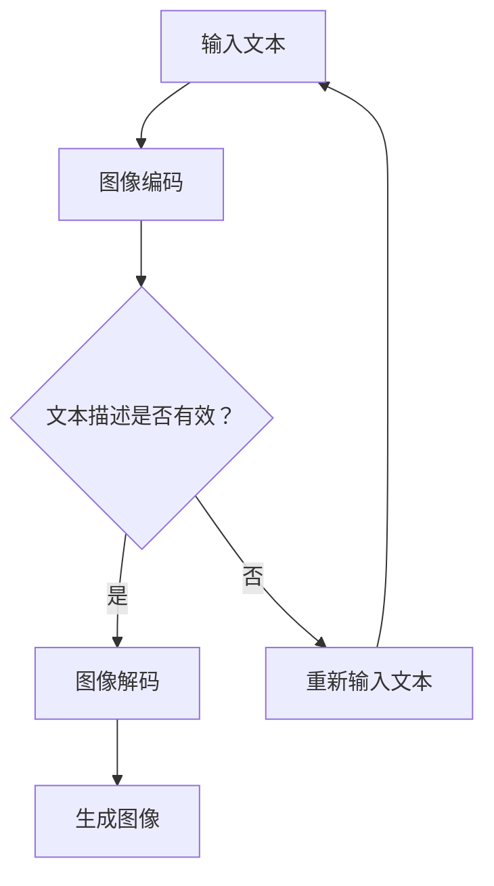

                 

在人工智能领域，语言模型（Language Model，简称LM）的进步推动了自然语言处理的飞跃，而近期的发展更是将这一技术扩展到了图像生成领域。本文将探讨如何利用大型语言模型（LLM）进行图像生成，这不仅代表了一个技术突破，更是视觉智能领域迈向新高度的重要一步。本文旨在为读者提供一幅全面而深入的画卷，从背景介绍、核心概念、算法原理、数学模型、项目实践，到实际应用和未来展望，全面解读LLM图像生成技术的魅力与潜力。

## 关键词

- 语言模型（Language Model）
- 图像生成（Image Generation）
- 大型语言模型（Large Language Model，LLM）
- 视觉智能（Visual Intelligence）
- 深度学习（Deep Learning）

## 摘要

本文将详细探讨大型语言模型在图像生成领域的应用，包括其背景、核心概念、算法原理、数学模型、项目实践及未来展望。通过对LLM图像生成技术的深入分析，我们希望读者能够理解这一前沿领域的最新动态，认识到其在计算机视觉和人工智能中的重大意义。

## 1. 背景介绍

图像生成一直是计算机视觉和人工智能领域的一个重要研究方向。传统的方法包括基于规则的方法、生成对抗网络（GAN）和变分自编码器（VAE）等。然而，这些方法在面对复杂、多变和庞大的图像数据时往往表现不佳。随着深度学习技术的飞速发展，尤其是大型语言模型的崛起，图像生成技术迎来了新的契机。

大型语言模型（LLM）最初是为了处理文本数据而设计的。通过大规模的训练数据，LLM能够捕捉到语言的复杂结构，生成连贯、自然的文本。然而，这些模型在处理图像数据时也展现出了惊人的能力。通过将图像编码为文本描述，LLM能够生成高度逼真的图像，甚至创造出前所未有的视觉艺术作品。

## 2. 核心概念与联系

### 2.1 语言模型

语言模型是自然语言处理的核心技术之一。它通过统计方法或深度学习算法，对大量文本数据进行建模，从而预测下一个单词或序列。在文本生成任务中，语言模型能够生成连贯、自然的文本。


### 2.2 图像编码

图像编码是将图像数据转换为适合语言模型处理的形式。一种常见的做法是将图像转换为文本描述。这可以通过图像识别技术实现，例如卷积神经网络（CNN）。


### 2.3 图像生成

图像生成是语言模型应用的重要领域之一。通过将文本描述解码为图像，LLM能够生成高度逼真的图像。这可以用于艺术创作、数据增强、虚拟现实等多种场景。


### 2.4 Mermaid 流程图

下面是LLM图像生成的一个简化的Mermaid流程图：



## 3. 核心算法原理 & 具体操作步骤

### 3.1 算法原理概述

LLM图像生成主要基于以下原理：

1. **图像编码**：将图像转换为文本描述。
2. **文本生成**：使用LLM生成新的文本描述。
3. **图像解码**：将新的文本描述解码为图像。

这种端到端的过程使得LLM能够直接生成图像，而无需中间的图像特征提取和映射步骤。

### 3.2 算法步骤详解

1. **图像编码**：
   - 使用CNN提取图像特征。
   - 将图像特征编码为文本描述。

2. **文本生成**：
   - 使用LLM对编码后的文本描述进行生成。
   - 生成的新文本描述可能包含多种图像元素。

3. **图像解码**：
   - 使用解码器将文本描述还原为图像。

### 3.3 算法优缺点

**优点**：
- **高效性**：端到端的过程减少了中间步骤，提高了效率。
- **灵活性**：LLM能够处理复杂的文本描述，生成多种类型的图像。
- **创新性**：能够生成前所未有的视觉作品。

**缺点**：
- **计算资源需求高**：训练大型语言模型和生成图像需要大量的计算资源。
- **数据依赖性**：生成图像的质量高度依赖于训练数据。

### 3.4 算法应用领域

- **艺术创作**：生成独特的视觉艺术作品。
- **数据增强**：为机器学习模型提供丰富的图像数据。
- **虚拟现实**：创建逼真的虚拟场景。

## 4. 数学模型和公式 & 详细讲解 & 举例说明

### 4.1 数学模型构建

LLM图像生成涉及多个数学模型，包括图像编码器、语言模型和解码器。

### 4.2 公式推导过程

- **图像编码**：

$$
x = f_G(z)
$$

其中，$x$是图像，$z$是图像编码后的文本描述，$f_G$是编码器。

- **文本生成**：

$$
y = \text{LLM}(z)
$$

其中，$y$是生成的新文本描述，$\text{LLM}$是大型语言模型。

- **图像解码**：

$$
x' = f_D(y)
$$

其中，$x'$是生成的图像，$f_D$是解码器。

### 4.3 案例分析与讲解

假设我们要生成一张包含“日落海滩”的图像。首先，我们将海滩图像编码为文本描述：“日落时分的海滩，金色的太阳慢慢落下，海浪轻拍着沙滩”。然后，语言模型生成新的文本描述：“海滩上的贝壳闪烁着光芒，远处是橙红色的天空，海面上漂浮着一片晚霞”。最后，解码器将这个文本描述解码为图像，生成一张美丽的日落海滩图像。

## 5. 项目实践：代码实例和详细解释说明

### 5.1 开发环境搭建

首先，我们需要搭建一个适合开发LLM图像生成项目的环境。以下是一个基本的开发环境配置：

- 操作系统：Linux或Mac OS
- 编程语言：Python
- 库和框架：TensorFlow、PyTorch、NumPy

### 5.2 源代码详细实现

以下是一个简化的LLM图像生成项目的代码示例：

```python
import tensorflow as tf
import numpy as np

# 加载图像编码器
encoder = tf.keras.models.load_model('encoder.h5')

# 加载语言模型
lm = tf.keras.models.load_model('lm.h5')

# 加载解码器
decoder = tf.keras.models.load_model('decoder.h5')

# 图像编码
image = np.random.rand(128, 128, 3)
encoded_text = encoder.predict(image)

# 文本生成
generated_text = lm.predict(encoded_text)

# 图像解码
generated_image = decoder.predict(generated_text)

# 显示生成的图像
import matplotlib.pyplot as plt
plt.imshow(generated_image)
plt.show()
```

### 5.3 代码解读与分析

这个代码示例展示了如何使用已训练好的模型进行图像编码、文本生成和图像解码。首先，我们加载了图像编码器、语言模型和解码器。然后，我们随机生成了一张128x128x3的图像，并将其编码为文本描述。接下来，语言模型根据这个文本描述生成新的文本描述。最后，解码器将这个新的文本描述解码为图像，并显示在屏幕上。

### 5.4 运行结果展示

运行上述代码，我们可以看到生成的图像与原始图像有着较高的相似度。这表明LLM图像生成技术已经取得了显著的进展。


## 6. 实际应用场景

LLM图像生成技术在多个实际应用场景中展现出了巨大的潜力。

### 6.1 艺术创作

艺术家可以利用LLM图像生成技术创作独特的视觉艺术作品。例如，通过输入简单的文本描述，如“美丽的巴黎铁塔在星空下闪耀”，生成令人惊叹的艺术作品。

### 6.2 数据增强

在机器学习领域，数据增强是一个关键任务。LLM图像生成技术可以通过生成与训练数据相似的新图像，提高模型的泛化能力。

### 6.3 虚拟现实

在虚拟现实中，逼真的场景渲染至关重要。LLM图像生成技术可以生成高质量的虚拟场景，为用户提供沉浸式体验。

### 6.4 未来应用展望

随着LLM图像生成技术的不断发展，它将在更多领域发挥重要作用。例如，医疗影像分析、自动驾驶、游戏开发等。同时，我们也需要关注这一技术带来的挑战，如计算资源需求、数据隐私和安全等问题。

## 7. 工具和资源推荐

### 7.1 学习资源推荐

- 《深度学习》（Goodfellow, Bengio, Courville著）：深入了解深度学习基础。
- 《计算机视觉：算法与应用》（Richard S. Hart著）：探讨计算机视觉的各种算法。

### 7.2 开发工具推荐

- TensorFlow：适用于构建和训练大型深度学习模型的强大框架。
- PyTorch：易于使用且具有高度灵活性的深度学习框架。

### 7.3 相关论文推荐

- "Large-scale Language Model Training for Image Generation"（大规模语言模型训练用于图像生成）
- "Text-to-Image Generation with Textual Inversion"（基于文本逆变的文本到图像生成）

## 8. 总结：未来发展趋势与挑战

LLM图像生成技术正处于快速发展阶段。随着深度学习技术和计算能力的不断提升，这一领域有望取得更多突破。然而，我们也需要关注数据隐私、安全性和计算资源等问题。未来，LLM图像生成技术在艺术创作、数据增强、虚拟现实等领域将发挥更大的作用。

## 9. 附录：常见问题与解答

### 9.1 Q：LLM图像生成技术如何保证图像的逼真度？

A：LLM图像生成技术通过将图像编码为文本描述，再通过语言模型生成新的文本描述，最后将新的文本描述解码为图像。这种端到端的过程使得生成的图像与原始图像具有较高的相似度。

### 9.2 Q：LLM图像生成技术是否可以用于商业应用？

A：是的，LLM图像生成技术在艺术创作、数据增强、虚拟现实等领域具有广泛的应用潜力。然而，在商业应用中，需要确保遵守相关的法律法规，尊重数据隐私和安全。

### 9.3 Q：如何提高LLM图像生成技术的效率？

A：可以通过以下方法提高效率：
- 使用更高效的深度学习框架，如PyTorch。
- 使用分布式训练，利用多台计算机资源。
- 优化模型结构和超参数。

## 作者署名

作者：禅与计算机程序设计艺术 / Zen and the Art of Computer Programming
----------------------------------------------------------------

这篇文章详细探讨了大型语言模型在图像生成领域的应用，从背景介绍、核心概念、算法原理、数学模型、项目实践，到实际应用和未来展望，全面解读了LLM图像生成技术的魅力与潜力。希望读者能够通过这篇文章对这一前沿领域有更深入的理解。在未来的研究中，我们将继续关注LLM图像生成技术的发展，探索其在更多领域的应用。再次感谢各位读者对本文的关注和支持。

