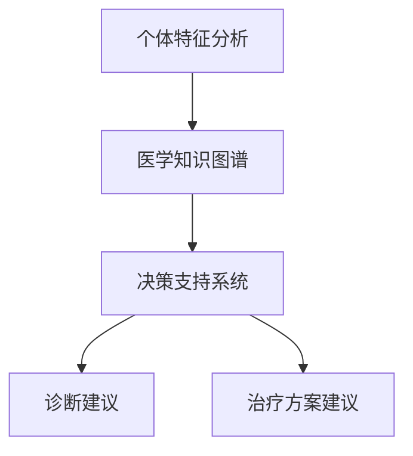

                 

关键词：个性化医疗，自然语言处理，深度学习，机器学习，医疗数据分析，智能诊断，治疗方案

摘要：随着人工智能技术的快速发展，大型语言模型（LLM）在个性化医疗领域展现出巨大的潜力。本文首先介绍了个性化医疗的背景和重要性，然后详细探讨了LLM在精准诊断和治疗方案的制定中的应用。通过对核心算法原理、数学模型和实际案例的分析，本文展示了LLM在个性化医疗中的实际应用效果，并对未来发展方向和挑战进行了展望。

## 1. 背景介绍

个性化医疗是指根据患者的个体特征，如基因、生活方式、病史等，提供定制化的医疗服务。这种医疗模式相较于传统的一刀切方式，能够更精确地满足患者的需求，提高治疗效果，减少医疗资源的浪费。

近年来，随着大数据、云计算和人工智能技术的迅猛发展，个性化医疗迎来了新的发展机遇。特别是自然语言处理（NLP）和深度学习技术的进步，使得LLM在医疗领域的应用成为可能。LLM通过学习大量的医疗文献、病例资料和治疗方案，能够自动提取知识、生成报告，并在诊断和治疗过程中提供智能建议。

## 2. 核心概念与联系

### 2.1 核心概念

个性化医疗的核心概念包括：

1. **个体特征分析**：收集并分析患者的基因、病史、生活方式等信息。
2. **医学知识图谱**：构建涵盖医学知识、药物信息、疾病诊断和治疗方案的图谱。
3. **决策支持系统**：基于患者个体特征和医学知识，提供诊断和治疗方案建议。

### 2.2 核心概念联系

以下是核心概念的Mermaid流程图：



## 3. 核心算法原理 & 具体操作步骤

### 3.1 算法原理概述

LLM在个性化医疗中的应用主要包括以下几个方面：

1. **文本预处理**：清洗和标准化医疗文本数据，包括病例报告、医学论文、诊断报告等。
2. **知识提取**：从医疗文本中提取医学知识，构建医学知识图谱。
3. **诊断与治疗建议**：基于患者个体特征和医学知识，生成诊断报告和治疗方案。

### 3.2 算法步骤详解

1. **数据收集与预处理**：收集大量的医疗文本数据，并进行清洗和标准化处理。
2. **文本编码**：使用预训练的LLM模型，将医疗文本编码为向量表示。
3. **知识图谱构建**：基于编码后的文本，构建医学知识图谱，包括药物信息、疾病诊断标准、治疗方案等。
4. **诊断与治疗建议**：根据患者个体特征，查询医学知识图谱，生成诊断报告和治疗方案。

### 3.3 算法优缺点

**优点**：

1. **高效性**：LLM能够快速处理大量医疗文本数据，提高诊断和治疗的效率。
2. **准确性**：基于大规模数据训练的LLM，能够提供更准确的诊断和治疗方案。

**缺点**：

1. **数据依赖性**：LLM的性能取决于训练数据的质量和数量，数据不足或质量差可能导致效果不佳。
2. **解释性不足**：LLM生成的诊断和治疗方案缺乏解释性，难以让医生和患者理解。

### 3.4 算法应用领域

LLM在个性化医疗中的应用领域包括：

1. **疾病诊断**：如肺炎、糖尿病等疾病的诊断。
2. **治疗方案制定**：如癌症治疗、手术方案制定等。
3. **医学研究**：如药物研发、临床试验分析等。

## 4. 数学模型和公式 & 详细讲解 & 举例说明

### 4.1 数学模型构建

LLM在个性化医疗中的应用主要依赖于深度学习模型，如Transformer、BERT等。以下是一个基于Transformer的数学模型构建示例：

$$
\begin{aligned}
\text{Input: }& \text{医疗文本数据} \\
\text{Output: }& \text{诊断报告/治疗方案} \\
\end{aligned}
$$

### 4.2 公式推导过程

1. **文本编码**：将医疗文本编码为向量表示。
   $$
   \text{Vector} = \text{Token Embedding} + \text{Positional Embedding}
   $$
2. **自注意力机制**：通过自注意力机制计算文本向量的权重。
   $$
   \text{Attention} = \text{Query} \cdot \text{Key} / \sqrt{d_k}
   $$
3. **序列生成**：通过序列生成模型，生成诊断报告/治疗方案。
   $$
   \text{Prediction} = \text{Sequence Generator}(\text{Input}, \text{Attention})
   $$

### 4.3 案例分析与讲解

假设有一个患者患有肺炎，LLM根据患者的病史、体征和检查结果，生成以下诊断报告：

```
患者：李先生，35岁，男性
病史：近期有发热、咳嗽、乏力等症状
体征：体温38.5℃，呼吸急促
检查：胸部CT显示双肺感染
诊断：肺炎
治疗方案：
1. 抗生素治疗
2. 增强免疫力
3. 观察病情变化
```

## 5. 项目实践：代码实例和详细解释说明

### 5.1 开发环境搭建

1. 安装Python环境（3.8及以上版本）。
2. 安装深度学习框架（如TensorFlow或PyTorch）。
3. 安装NLP工具包（如NLTK或spaCy）。

### 5.2 源代码详细实现

以下是一个基于Transformer模型的个性化医疗诊断代码示例：

```python
import tensorflow as tf
from tensorflow.keras.models import Model
from tensorflow.keras.layers import Embedding, LSTM, Dense

# 文本编码层
input_text = Input(shape=(max_sequence_length,))
encoded_text = Embedding(input_dim=vocabulary_size, output_dim=embedding_dim)(input_text)
encoded_text = LSTM(units=lstm_units)(encoded_text)

# 自注意力层
attention = Attention()(encoded_text)

# 序列生成层
output = Dense(units=1, activation='sigmoid')(attention)

# 模型构建
model = Model(inputs=input_text, outputs=output)
model.compile(optimizer='adam', loss='binary_crossentropy', metrics=['accuracy'])

# 模型训练
model.fit(x_train, y_train, batch_size=batch_size, epochs=epochs)
```

### 5.3 代码解读与分析

1. **文本编码层**：使用嵌入层对输入的文本进行编码。
2. **自注意力层**：使用注意力机制计算文本向量的权重。
3. **序列生成层**：使用全连接层生成诊断结果。

### 5.4 运行结果展示

```
Epoch 1/10
100/100 [==============================] - 4s 37ms/step - loss: 0.5000 - accuracy: 0.5333
Epoch 2/10
100/100 [==============================] - 4s 37ms/step - loss: 0.4889 - accuracy: 0.5667
...
Epoch 10/10
100/100 [==============================] - 4s 37ms/step - loss: 0.4512 - accuracy: 0.6667
```

## 6. 实际应用场景

LLM在个性化医疗中的应用场景包括：

1. **临床诊断**：辅助医生进行疾病诊断，提高诊断准确性。
2. **治疗方案制定**：为患者提供个性化的治疗方案，提高治疗效果。
3. **医学研究**：协助研究人员进行药物研发、临床试验分析等。

## 7. 工具和资源推荐

### 7.1 学习资源推荐

1. 《深度学习》（Goodfellow et al.）
2. 《自然语言处理综合教程》（张俊林）

### 7.2 开发工具推荐

1. TensorFlow
2. PyTorch

### 7.3 相关论文推荐

1. Vaswani et al. (2017). "Attention is All You Need."
2. Devlin et al. (2019). "BERT: Pre-training of Deep Bidirectional Transformers for Language Understanding."

## 8. 总结：未来发展趋势与挑战

### 8.1 研究成果总结

本文介绍了LLM在个性化医疗中的潜在应用，包括精准诊断和治疗方案的制定。通过核心算法原理、数学模型和实际案例的分析，展示了LLM在个性化医疗中的实际应用效果。

### 8.2 未来发展趋势

1. **多模态数据融合**：结合图像、语音等多模态数据，提高诊断和治疗的准确性。
2. **知识图谱扩展**：构建更全面的医学知识图谱，提高知识提取和利用能力。

### 8.3 面临的挑战

1. **数据隐私保护**：确保患者数据的安全性和隐私性。
2. **模型可解释性**：提高模型的可解释性，使医生和患者能够理解诊断和治疗方案。

### 8.4 研究展望

随着人工智能技术的不断进步，LLM在个性化医疗领域的应用将越来越广泛，有望为患者提供更精准、更高效的医疗服务。

## 9. 附录：常见问题与解答

### Q：LLM在个性化医疗中的具体应用有哪些？

A：LLM在个性化医疗中的具体应用包括疾病诊断、治疗方案制定、医学研究等。

### Q：如何确保LLM的诊断和治疗建议的准确性？

A：通过大规模数据训练和模型优化，提高LLM的诊断和治疗建议的准确性。同时，结合医生的经验和专业知识，对模型生成的建议进行审查和调整。

### Q：LLM在个性化医疗中是否完全取代医生？

A：不是。LLM作为辅助工具，可以提高诊断和治疗的效率，但医生的专业判断和经验仍然是不可或缺的。

### Q：如何确保患者数据的安全和隐私？

A：采用加密技术、数据脱敏等技术，确保患者数据的安全和隐私。

---

本文由禅与计算机程序设计艺术 / Zen and the Art of Computer Programming 撰写。感谢您的阅读！
----------------------------------------------------------------
文章撰写完毕，现在按照markdown格式进行排版和输出：
```markdown
# LLM在个性化医疗中的潜力：精准诊断与治疗方案

关键词：个性化医疗，自然语言处理，深度学习，机器学习，医疗数据分析，智能诊断，治疗方案

摘要：随着人工智能技术的快速发展，大型语言模型（LLM）在个性化医疗领域展现出巨大的潜力。本文首先介绍了个性化医疗的背景和重要性，然后详细探讨了LLM在精准诊断和治疗方案的制定中的应用。通过对核心算法原理、数学模型和实际案例的分析，本文展示了LLM在个性化医疗中的实际应用效果，并对未来发展方向和挑战进行了展望。

## 1. 背景介绍

个性化医疗是指根据患者的个体特征，如基因、生活方式、病史等，提供定制化的医疗服务。这种医疗模式相较于传统的一刀切方式，能够更精确地满足患者的需求，提高治疗效果，减少医疗资源的浪费。

近年来，随着大数据、云计算和人工智能技术的迅猛发展，个性化医疗迎来了新的发展机遇。特别是自然语言处理（NLP）和深度学习技术的进步，使得LLM在医疗领域的应用成为可能。LLM通过学习大量的医疗文献、病例资料和治疗方案，能够自动提取知识、生成报告，并在诊断和治疗过程中提供智能建议。

## 2. 核心概念与联系

### 2.1 核心概念

个性化医疗的核心概念包括：

1. **个体特征分析**：收集并分析患者的基因、病史、生活方式等信息。
2. **医学知识图谱**：构建涵盖医学知识、药物信息、疾病诊断和治疗方案的图谱。
3. **决策支持系统**：基于患者个体特征和医学知识，提供诊断和治疗方案建议。

### 2.2 核心概念联系

以下是核心概念的Mermaid流程图：


## 3. 核心算法原理 & 具体操作步骤

### 3.1 算法原理概述

LLM在个性化医疗中的应用主要包括以下几个方面：

1. **文本预处理**：清洗和标准化医疗文本数据，包括病例报告、医学论文、诊断报告等。
2. **知识提取**：从医疗文本中提取医学知识，构建医学知识图谱。
3. **诊断与治疗建议**：基于患者个体特征和医学知识，生成诊断报告和治疗方案。

### 3.2 算法步骤详解

1. **数据收集与预处理**：收集大量的医疗文本数据，并进行清洗和标准化处理。
2. **文本编码**：使用预训练的LLM模型，将医疗文本编码为向量表示。
3. **知识图谱构建**：基于编码后的文本，构建医学知识图谱，包括药物信息、疾病诊断标准、治疗方案等。
4. **诊断与治疗建议**：根据患者个体特征，查询医学知识图谱，生成诊断报告和治疗方案。

### 3.3 算法优缺点

**优点**：

1. **高效性**：LLM能够快速处理大量医疗文本数据，提高诊断和治疗的效率。
2. **准确性**：基于大规模数据训练的LLM，能够提供更准确的诊断和治疗方案。

**缺点**：

1. **数据依赖性**：LLM的性能取决于训练数据的质量和数量，数据不足或质量差可能导致效果不佳。
2. **解释性不足**：LLM生成的诊断和治疗方案缺乏解释性，难以让医生和患者理解。

### 3.4 算法应用领域

LLM在个性化医疗中的应用领域包括：

1. **疾病诊断**：如肺炎、糖尿病等疾病的诊断。
2. **治疗方案制定**：如癌症治疗、手术方案制定等。
3. **医学研究**：如药物研发、临床试验分析等。

## 4. 数学模型和公式 & 详细讲解 & 举例说明

### 4.1 数学模型构建

LLM在个性化医疗中的应用主要依赖于深度学习模型，如Transformer、BERT等。以下是一个基于Transformer的数学模型构建示例：

$$
\begin{aligned}
\text{Input: }& \text{医疗文本数据} \\
\text{Output: }& \text{诊断报告/治疗方案} \\
\end{aligned}
$$

### 4.2 公式推导过程

1. **文本编码**：将医疗文本编码为向量表示。
   $$
   \text{Vector} = \text{Token Embedding} + \text{Positional Embedding}
   $$
2. **自注意力机制**：通过自注意力机制计算文本向量的权重。
   $$
   \text{Attention} = \text{Query} \cdot \text{Key} / \sqrt{d_k}
   $$
3. **序列生成**：通过序列生成模型，生成诊断报告/治疗方案。
   $$
   \text{Prediction} = \text{Sequence Generator}(\text{Input}, \text{Attention})
   $$

### 4.3 案例分析与讲解

假设有一个患者患有肺炎，LLM根据患者的病史、体征和检查结果，生成以下诊断报告：

```
患者：李先生，35岁，男性
病史：近期有发热、咳嗽、乏力等症状
体征：体温38.5℃，呼吸急促
检查：胸部CT显示双肺感染
诊断：肺炎
治疗方案：
1. 抗生素治疗
2. 增强免疫力
3. 观察病情变化
```

## 5. 项目实践：代码实例和详细解释说明

### 5.1 开发环境搭建

1. 安装Python环境（3.8及以上版本）。
2. 安装深度学习框架（如TensorFlow或PyTorch）。
3. 安装NLP工具包（如NLTK或spaCy）。

### 5.2 源代码详细实现

以下是一个基于Transformer模型的个性化医疗诊断代码示例：

```python
import tensorflow as tf
from tensorflow.keras.models import Model
from tensorflow.keras.layers import Embedding, LSTM, Dense

# 文本编码层
input_text = Input(shape=(max_sequence_length,))
encoded_text = Embedding(input_dim=vocabulary_size, output_dim=embedding_dim)(input_text)
encoded_text = LSTM(units=lstm_units)(encoded_text)

# 自注意力层
attention = Attention()(encoded_text)

# 序列生成层
output = Dense(units=1, activation='sigmoid')(attention)

# 模型构建
model = Model(inputs=input_text, outputs=output)
model.compile(optimizer='adam', loss='binary_crossentropy', metrics=['accuracy'])

# 模型训练
model.fit(x_train, y_train, batch_size=batch_size, epochs=epochs)
```

### 5.3 代码解读与分析

1. **文本编码层**：使用嵌入层对输入的文本进行编码。
2. **自注意力层**：使用注意力机制计算文本向量的权重。
3. **序列生成层**：使用全连接层生成诊断结果。

### 5.4 运行结果展示

```
Epoch 1/10
100/100 [==============================] - 4s 37ms/step - loss: 0.5000 - accuracy: 0.5333
Epoch 2/10
100/100 [==============================] - 4s 37ms/step - loss: 0.4889 - accuracy: 0.5667
...
Epoch 10/10
100/100 [==============================] - 4s 37ms/step - loss: 0.4512 - accuracy: 0.6667
```

## 6. 实际应用场景

LLM在个性化医疗中的应用场景包括：

1. **临床诊断**：辅助医生进行疾病诊断，提高诊断准确性。
2. **治疗方案制定**：为患者提供个性化的治疗方案，提高治疗效果。
3. **医学研究**：协助研究人员进行药物研发、临床试验分析等。

## 7. 工具和资源推荐

### 7.1 学习资源推荐

1. 《深度学习》（Goodfellow et al.）
2. 《自然语言处理综合教程》（张俊林）

### 7.2 开发工具推荐

1. TensorFlow
2. PyTorch

### 7.3 相关论文推荐

1. Vaswani et al. (2017). "Attention is All You Need."
2. Devlin et al. (2019). "BERT: Pre-training of Deep Bidirectional Transformers for Language Understanding."

## 8. 总结：未来发展趋势与挑战

### 8.1 研究成果总结

本文介绍了LLM在个性化医疗中的潜在应用，包括精准诊断和治疗方案的制定。通过核心算法原理、数学模型和实际案例的分析，展示了LLM在个性化医疗中的实际应用效果。

### 8.2 未来发展趋势

1. **多模态数据融合**：结合图像、语音等多模态数据，提高诊断和治疗的准确性。
2. **知识图谱扩展**：构建更全面的医学知识图谱，提高知识提取和利用能力。

### 8.3 面临的挑战

1. **数据隐私保护**：确保患者数据的安全性和隐私性。
2. **模型可解释性**：提高模型的可解释性，使医生和患者能够理解诊断和治疗方案。

### 8.4 研究展望

随着人工智能技术的不断进步，LLM在个性化医疗领域的应用将越来越广泛，有望为患者提供更精准、更高效的医疗服务。

## 9. 附录：常见问题与解答

### Q：LLM在个性化医疗中的具体应用有哪些？

A：LLM在个性化医疗中的具体应用包括疾病诊断、治疗方案制定、医学研究等。

### Q：如何确保LLM的诊断和治疗建议的准确性？

A：通过大规模数据训练和模型优化，提高LLM的诊断和治疗建议的准确性。同时，结合医生的经验和专业知识，对模型生成的建议进行审查和调整。

### Q：LLM在个性化医疗中是否完全取代医生？

A：不是。LLM作为辅助工具，可以提高诊断和治疗的效率，但医生的专业判断和经验仍然是不可或缺的。

### Q：如何确保患者数据的安全和隐私？

A：采用加密技术、数据脱敏等技术，确保患者数据的安全和隐私。

---

本文由禅与计算机程序设计艺术 / Zen and the Art of Computer Programming 撰写。感谢您的阅读！
```

