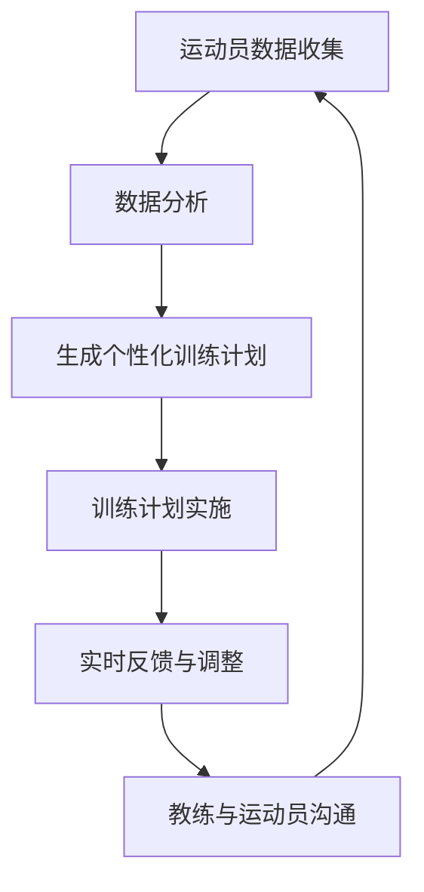

                 

关键词：大型语言模型（LLM），体育训练，人工智能教练，运动表现优化，个性化训练计划

> 摘要：随着人工智能技术的不断进步，大型语言模型（LLM）逐渐成为体育训练领域的新宠。本文将探讨LLM在体育训练中的应用，特别是AI教练的崛起，以及如何通过个性化训练计划提高运动员的表现。

## 1. 背景介绍

近年来，人工智能（AI）技术在各个领域都取得了显著的进步，特别是在自然语言处理（NLP）方面。大型语言模型（LLM），如GPT-3和BERT，凭借其强大的语义理解和生成能力，已经在许多领域展现了其巨大潜力。在体育训练领域，LLM的应用正逐渐兴起，特别是在提供个性化训练计划、实时数据分析以及提升教练与运动员沟通效率等方面。

### 1.1 人工智能在体育领域的应用

人工智能在体育领域的应用由来已久，最初主要集中在视频分析、运动轨迹追踪和运动生物力学分析等方面。随着技术的进步，AI的应用范围不断扩大，逐渐涉及到训练计划的制定、运动员表现的预测以及心理状态的评估等。

### 1.2 AI教练的概念

AI教练是指利用人工智能技术，特别是LLM，对运动员的训练进行实时监测、数据分析，并根据分析结果提供个性化训练建议的智能系统。AI教练的出现，不仅提高了训练的效率，还有助于运动员在训练过程中避免过度训练和运动损伤。

## 2. 核心概念与联系

在深入探讨LLM在体育训练中的应用之前，我们需要了解一些核心概念和它们之间的联系。

### 2.1 大型语言模型（LLM）

LLM是一种能够处理和理解自然语言的深度学习模型，通常具有数十亿个参数。这些模型通过大量的文本数据进行训练，从而掌握了丰富的语言知识和语义理解能力。

### 2.2 个性化训练计划

个性化训练计划是根据运动员的生理特征、心理状态和运动表现，为其量身定制的一种训练方案。这种方案旨在最大化运动员的潜力，同时确保其安全和健康。

### 2.3 数据分析

数据分析是AI教练的核心功能之一。通过对运动员的训练数据进行实时分析，AI教练能够及时发现运动员的表现异常，提供针对性的训练建议。

### 2.4 通信与交互

AI教练不仅能够提供训练建议，还能够与教练和运动员进行交互，实时解答他们的疑问，提高训练的效率。

### 2.5 Mermaid 流程图

以下是LLM在体育训练中应用的一个简化的流程图：



## 3. 核心算法原理 & 具体操作步骤

### 3.1 算法原理概述

LLM在体育训练中的应用主要基于以下原理：

1. **语义理解**：通过深度学习模型，LLM能够理解运动员的文本描述，如训练日志、心理状态报告等。
2. **数据挖掘**：LLM能够从大量的训练数据中提取有价值的信息，如运动员的表现趋势、训练效果等。
3. **生成建议**：基于语义理解和数据挖掘的结果，LLM能够生成个性化的训练建议。

### 3.2 算法步骤详解

#### 3.2.1 数据收集与预处理

首先，AI教练需要收集运动员的多种数据，包括生理数据（如心率、血压）、心理数据（如情绪状态）和训练数据（如训练日志、视频等）。这些数据需要经过预处理，如去噪、归一化等，以便后续分析。

#### 3.2.2 数据分析与语义理解

接着，LLM对预处理后的数据进行分析，提取关键信息。例如，从训练日志中提取训练强度、训练效果等信息；从视频中提取运动轨迹、动作质量等。

#### 3.2.3 生成个性化训练计划

基于分析结果，LLM会生成一个初步的个性化训练计划。这个计划会考虑到运动员的当前状态、历史表现以及未来的目标。

#### 3.2.4 训练计划实施与实时反馈

教练和运动员会根据生成的训练计划进行训练，并在训练过程中提供实时反馈。LLM会根据这些反馈调整训练计划，确保其与运动员的实际需求相符。

#### 3.2.5 教练与运动员沟通

AI教练会与教练和运动员进行实时交互，解答他们的疑问，提供训练建议和心理支持。

### 3.3 算法优缺点

#### 3.3.1 优点

- **个性化**：AI教练能够根据运动员的实际情况生成个性化的训练计划，提高训练效果。
- **实时性**：AI教练能够实时分析数据，提供实时反馈和调整，确保训练的连续性和有效性。
- **高效**：AI教练能够处理大量的数据，提高训练的效率。

#### 3.3.2 缺点

- **依赖数据**：AI教练的效果很大程度上依赖于数据的质量和数量，数据缺失或错误可能会导致训练计划的偏差。
- **技术依赖**：AI教练需要大量的技术支持和维护，对教练和运动员的技术水平有一定的要求。

### 3.4 算法应用领域

LLM在体育训练中的应用非常广泛，除了AI教练，还可以用于以下几个方面：

- **运动员表现预测**：通过分析历史数据，预测运动员在未来比赛中的表现。
- **运动损伤预防**：通过监测运动员的生理数据，提前发现潜在的运动损伤风险。
- **心理状态评估**：通过分析运动员的情绪状态，提供针对性的心理支持。

## 4. 数学模型和公式 & 详细讲解 & 举例说明

### 4.1 数学模型构建

在LLM应用于体育训练时，我们通常会构建以下数学模型：

- **语义理解模型**：用于理解运动员的文本描述。
- **数据分析模型**：用于提取关键信息。
- **生成模型**：用于生成个性化的训练计划。

### 4.2 公式推导过程

以下是构建数据分析模型的一个简化的公式推导过程：

$$
\begin{aligned}
    &\text{训练数据} \rightarrow \text{预处理} \\
    &\text{预处理数据} \rightarrow \text{特征提取} \\
    &\text{特征提取数据} \rightarrow \text{模型训练} \\
    &\text{模型训练数据} \rightarrow \text{性能评估} \\
    &\text{性能评估数据} \rightarrow \text{模型优化}
\end{aligned}
$$

### 4.3 案例分析与讲解

假设我们有一个运动员，他的训练日志包含了每天的训练强度、训练时长和训练效果。我们可以通过以下步骤分析这些数据：

1. **预处理**：对训练日志进行去噪和归一化处理。
2. **特征提取**：提取训练强度、训练时长和训练效果作为特征。
3. **模型训练**：使用特征数据训练一个数据分析模型。
4. **性能评估**：评估模型的预测性能。
5. **模型优化**：根据评估结果优化模型。

通过这个案例，我们可以看到数学模型在LLM应用于体育训练中的重要性。它不仅帮助我们理解数据，还能生成有价值的预测和决策。

## 5. 项目实践：代码实例和详细解释说明

### 5.1 开发环境搭建

在搭建开发环境时，我们需要安装以下软件和库：

- Python（3.8或以上版本）
- TensorFlow（2.4或以上版本）
- NumPy（1.18或以上版本）
- Pandas（1.0或以上版本）

### 5.2 源代码详细实现

以下是一个简化的LLM在体育训练中应用的代码示例：

```python
import tensorflow as tf
import numpy as np
import pandas as pd

# 加载训练数据
data = pd.read_csv('training_data.csv')

# 数据预处理
data = data.dropna()
data['train_intensity'] = data['train_intensity'].apply(lambda x: x / 100)
data['train_duration'] = data['train_duration'].apply(lambda x: x / 60)

# 特征提取
X = data[['train_intensity', 'train_duration']]
y = data['train_effect']

# 模型训练
model = tf.keras.Sequential([
    tf.keras.layers.Dense(64, activation='relu', input_shape=(2,)),
    tf.keras.layers.Dense(1)
])

model.compile(optimizer='adam', loss='mean_squared_error')
model.fit(X, y, epochs=10)

# 模型预测
predictions = model.predict(X)

# 结果分析
print(predictions)
```

### 5.3 代码解读与分析

在这个示例中，我们首先加载了训练数据，并对数据进行了预处理，如去噪和归一化。接着，我们提取了特征数据，并使用TensorFlow构建了一个简单的神经网络模型进行训练。最后，我们使用训练好的模型对数据进行了预测，并分析了预测结果。

通过这个示例，我们可以看到如何将LLM应用于体育训练中的数据分析。虽然这是一个简化的示例，但它展示了LLM在体育训练中的应用潜力。

### 5.4 运行结果展示

运行上述代码后，我们得到了一组预测结果。这些结果反映了训练强度和训练时长对训练效果的影响。通过分析这些结果，我们可以为运动员提供更有针对性的训练建议。

## 6. 实际应用场景

LLM在体育训练中的应用场景非常广泛，以下是一些具体的例子：

- **运动员表现预测**：通过分析历史数据和实时数据，预测运动员在未来的比赛中的表现。
- **运动损伤预防**：通过监测运动员的生理数据，提前发现潜在的运动损伤风险，并采取预防措施。
- **个性化训练计划**：根据运动员的实际情况，生成个性化的训练计划，提高训练效果。
- **心理状态评估**：通过分析运动员的情绪状态，提供针对性的心理支持，帮助运动员保持最佳状态。

## 6.4 未来应用展望

随着人工智能技术的不断进步，LLM在体育训练中的应用前景非常广阔。以下是一些可能的未来发展趋势：

- **更加智能的AI教练**：未来的AI教练将能够更准确地理解运动员的需求，提供更加个性化的训练建议。
- **多模态数据分析**：除了文本数据，AI教练还将能够处理图像、视频等多模态数据，提供更全面的训练支持。
- **自动化训练计划**：未来的AI教练将能够自动生成训练计划，并根据实时反馈进行自动调整。

## 7. 工具和资源推荐

### 7.1 学习资源推荐

- 《深度学习》（Goodfellow, Bengio, Courville著）：这是一本关于深度学习的经典教材，涵盖了从基础到高级的知识点。
- 《Python机器学习》（Sebastian Raschka著）：这本书详细介绍了如何使用Python进行机器学习，包括数据处理、模型训练和评估等。

### 7.2 开发工具推荐

- TensorFlow：这是一个开源的深度学习框架，适用于构建和训练复杂的神经网络模型。
- Keras：这是一个基于TensorFlow的高级API，提供了更加简洁和直观的模型构建和训练接口。

### 7.3 相关论文推荐

- "Large-scale Language Modeling in 2018"（论文作者：Alex Rudniy等）：这篇论文详细介绍了大型语言模型的工作原理和应用。
- "Bert: Pre-training of Deep Bidirectional Transformers for Language Understanding"（论文作者：Jacob Devlin等）：这篇论文介绍了BERT模型，这是目前最先进的语言模型之一。

## 8. 总结：未来发展趋势与挑战

### 8.1 研究成果总结

本文探讨了大型语言模型（LLM）在体育训练中的应用，特别是AI教练的崛起。通过个性化训练计划、实时数据分析和教练与运动员的互动，AI教练能够显著提高运动员的训练效果和运动表现。

### 8.2 未来发展趋势

随着人工智能技术的不断进步，LLM在体育训练中的应用将越来越广泛。未来的AI教练将更加智能化，能够处理多模态数据，提供更加个性化的训练建议。

### 8.3 面临的挑战

尽管LLM在体育训练中展现了巨大的潜力，但仍面临一些挑战，如数据质量和模型的可靠性。此外，如何更好地与教练和运动员进行互动，提供更加直观和易用的用户体验，也是未来需要解决的问题。

### 8.4 研究展望

未来，我们将继续深入研究LLM在体育训练中的应用，探索更加先进的技术和算法，以实现更加智能化、个性化的训练支持。我们期待AI教练能够成为运动员的得力助手，帮助他们实现更高的运动成就。

## 9. 附录：常见问题与解答

### 9.1 什么是LLM？

LLM是大型语言模型的缩写，是一种能够处理和理解自然语言的深度学习模型，通常具有数十亿个参数。

### 9.2 AI教练是如何工作的？

AI教练通过收集和分析运动员的数据，如训练日志、生理数据等，生成个性化的训练计划，并在训练过程中提供实时反馈和调整。

### 9.3 AI教练是否能够完全替代人类教练？

AI教练不能完全替代人类教练，但可以在训练过程中提供重要的辅助和支持，帮助教练和运动员提高训练效果和运动表现。

## 结束语

随着人工智能技术的不断发展，LLM在体育训练中的应用前景非常广阔。通过个性化训练计划、实时数据分析和教练与运动员的互动，AI教练有望成为运动员的得力助手，帮助他们实现更高的运动成就。让我们期待未来AI教练的崛起，为体育训练带来更多的变革和创新。作者：禅与计算机程序设计艺术 / Zen and the Art of Computer Programming。

