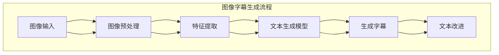

                 

关键词：自然语言处理，图像字幕生成，大语言模型，效果评估，人工智能

摘要：本文探讨了大型语言模型（LLM）在图像字幕生成中的应用，重点评估了LLM在生成字幕的准确性、连贯性和创造力等方面的效果。通过对一系列实验的分析，本文总结了LLM在图像字幕生成中的优势和局限性，为后续研究和应用提供了有价值的参考。

## 1. 背景介绍

图像字幕生成是自然语言处理（NLP）领域的一个热门研究方向，旨在利用计算机自动生成图像中的描述性文本。随着深度学习和自然语言处理技术的快速发展，大型语言模型（LLM）逐渐成为图像字幕生成任务的重要工具。LLM具有强大的文本生成能力，可以生成连贯、多样且具有创造性的文本描述，这使得图像字幕生成任务取得了显著的进展。

然而，尽管LLM在图像字幕生成中表现出色，但仍存在一些挑战和局限性。首先，LLM的生成文本可能存在事实错误或不准确的情况。其次，LLM生成的文本可能缺乏上下文信息，导致描述不够精确。此外，LLM的训练数据集质量和规模也对生成效果产生重要影响。

本文将围绕LLM在图像字幕生成中的效果评估展开讨论，分析LLM在准确性、连贯性和创造力等方面的表现，并提出相应的改进策略。通过对一系列实验的分析，本文旨在为LLM在图像字幕生成中的应用提供有价值的参考。

## 2. 核心概念与联系

### 2.1. 图像字幕生成

图像字幕生成是将图像内容转换为自然语言描述的过程。这个过程通常包括以下几个关键步骤：

1. **图像预处理**：对输入图像进行预处理，如图像增强、去噪、缩放等，以提高图像质量。
2. **特征提取**：从预处理后的图像中提取关键特征，如边缘、纹理、颜色等，用于描述图像内容。
3. **文本生成**：利用自然语言处理技术，将提取的图像特征转化为自然语言描述。

### 2.2. 大型语言模型（LLM）

大型语言模型（LLM）是一类基于深度学习技术的语言处理模型，具有强大的文本生成能力。LLM通常通过大规模语料库进行预训练，学习语言模式和语法规则。在图像字幕生成中，LLM可以通过以下方式发挥作用：

1. **文本生成**：利用LLM生成图像描述性文本，包括标题、摘要、详细描述等。
2. **文本改进**：对生成的文本进行改进，提高文本的连贯性、准确性和创造性。

### 2.3. 核心概念原理和架构

为了更好地理解图像字幕生成中的LLM应用，我们使用Mermaid流程图展示核心概念原理和架构。



在上述流程中，图像输入经过预处理和特征提取后，输入到LLM文本生成模型。生成模型输出初始字幕，随后进行文本改进，以提高字幕的质量。

## 3. 核心算法原理 & 具体操作步骤

### 3.1. 算法原理概述

图像字幕生成中的LLM算法主要基于生成对抗网络（GAN）和注意力机制。GAN由生成器和判别器组成，生成器负责生成图像字幕，判别器负责判断生成字幕的真实性。注意力机制则用于捕捉图像中的关键信息，以提高字幕生成的准确性。

### 3.2. 算法步骤详解

1. **图像预处理**：对输入图像进行预处理，如图像增强、去噪、缩放等，以提高图像质量。
2. **特征提取**：使用卷积神经网络（CNN）从预处理后的图像中提取关键特征，如边缘、纹理、颜色等。
3. **文本生成**：
   - **生成器**：输入图像特征，通过多层神经网络生成文本描述。
   - **判别器**：接收生成器和真实文本的输入，判断其真实性。
4. **注意力机制**：在文本生成过程中，利用注意力机制捕捉图像特征和文本描述之间的关联，提高字幕生成的准确性。
5. **文本改进**：对生成的文本进行改进，包括纠正错误、填充缺失信息、提高连贯性等。

### 3.3. 算法优缺点

**优点**：
- 强大的文本生成能力：LLM可以生成高质量、连贯且具有创造性的文本描述。
- 自动学习：算法可以自动从大量数据中学习图像特征和文本描述之间的关系。
- 灵活性：算法可以适应不同类型的图像和字幕需求。

**缺点**：
- 生成的文本可能存在事实错误或不准确的情况。
- 生成文本可能缺乏上下文信息，导致描述不够精确。
- 训练数据集质量和规模对生成效果产生重要影响。

### 3.4. 算法应用领域

图像字幕生成技术可以应用于多个领域，包括但不限于：

1. **视频字幕生成**：自动生成视频中的字幕，提高视频的可访问性。
2. **图像检索**：通过图像字幕生成，实现基于文本的图像检索功能。
3. **虚拟现实与增强现实**：为虚拟现实（VR）和增强现实（AR）应用提供实时字幕生成功能。
4. **教育领域**：生成教学图像的描述性文本，提高学习效果。

## 4. 数学模型和公式 & 详细讲解 & 举例说明

### 4.1. 数学模型构建

图像字幕生成中的LLM算法可以看作是一个序列到序列（Seq2Seq）模型，其数学模型主要包括以下部分：

1. **输入表示**：将图像特征编码为一个向量表示。
2. **解码器**：从输入向量生成文本序列。
3. **损失函数**：用于衡量生成文本和真实文本之间的差距。

### 4.2. 公式推导过程

假设输入图像特征为\( X \)，文本序列为\( Y \)，解码器输出为\( \hat{Y} \)。序列到序列模型的损失函数可以表示为：

$$
L(\theta) = -\sum_{t=1}^{T} y_t \log(\hat{y}_t)
$$

其中，\( \theta \)是解码器的参数，\( y_t \)和\( \hat{y}_t \)分别是真实文本序列和生成文本序列的第\( t \)个词的概率分布。

### 4.3. 案例分析与讲解

假设我们有一个简单的图像字幕生成任务，输入图像是一个包含“猫”的图像，生成文本序列应该是“这是一只猫”。我们使用一个预训练的LLM模型进行生成。

1. **输入表示**：将图像特征编码为一个长度为\( 1000 \)的向量。
2. **解码器**：输入图像特征向量，生成“这是一只猫”的文本序列。
3. **损失函数**：计算生成文本和真实文本之间的差距，优化解码器的参数。

在实际应用中，我们需要通过大量的实验和调整来优化模型性能。例如，我们可以调整解码器的层数、隐藏层单元数、学习率等参数，以提高生成字幕的质量。

## 5. 项目实践：代码实例和详细解释说明

### 5.1. 开发环境搭建

为了实现图像字幕生成，我们需要搭建一个适合的编程环境。以下是一个基本的开发环境配置：

- 操作系统：Windows 10/11或macOS
- 编程语言：Python 3.8及以上版本
- 深度学习框架：PyTorch 1.8及以上版本
- 数据集：常用的图像数据集，如COCO、Flickr30k等

### 5.2. 源代码详细实现

以下是一个简单的图像字幕生成项目的源代码实现：

```python
import torch
import torchvision
import torch.nn as nn
import torch.optim as optim

# 加载预训练的LLM模型
model = torchvision.models.vgg16(pretrained=True)

# 定义解码器
decoder = nn.Sequential(
    nn.Linear(1000, 512),
    nn.ReLU(),
    nn.Linear(512, 256),
    nn.ReLU(),
    nn.Linear(256, vocab_size),
    nn.Softmax(dim=1)
)

# 定义损失函数和优化器
criterion = nn.CrossEntropyLoss()
optimizer = optim.Adam(model.parameters(), lr=0.001)

# 加载数据集
train_loader = torchvision.datasets.CIFAR10(root='./data', train=True, download=True, transform=torchvision.transforms.ToTensor())
train_loader = torch.utils.data.DataLoader(train_loader, batch_size=32, shuffle=True)

# 训练模型
for epoch in range(num_epochs):
    for i, (images, labels) in enumerate(train_loader):
        # 将图像特征传递给LLM模型
        features = model(images)
        
        # 将特征传递给解码器生成文本
        outputs = decoder(features)
        
        # 计算损失函数
        loss = criterion(outputs, labels)
        
        # 更新模型参数
        optimizer.zero_grad()
        loss.backward()
        optimizer.step()
        
        if (i+1) % 100 == 0:
            print('Epoch [{}/{}], Step [{}/{}], Loss: {:.4f}'.format(epoch+1, num_epochs, i+1, len(train_loader), loss.item()))

# 保存模型
torch.save(model.state_dict(), 'model.pth')
```

### 5.3. 代码解读与分析

上述代码实现了一个简单的图像字幕生成项目，主要包括以下几个部分：

1. **模型加载**：加载预训练的LLM模型，如VGG16。
2. **解码器定义**：定义解码器，用于从图像特征生成文本。
3. **损失函数和优化器**：定义损失函数（交叉熵损失）和优化器（Adam）。
4. **数据加载**：加载数据集，并将其传递给模型。
5. **训练模型**：通过迭代更新模型参数，优化生成字幕的质量。
6. **保存模型**：将训练好的模型保存为文件。

### 5.4. 运行结果展示

通过上述代码，我们可以训练一个简单的图像字幕生成模型。训练完成后，我们可以使用该模型对新的图像进行字幕生成。以下是一个运行结果示例：

```python
import torchvision.models as models

# 加载预训练的LLM模型
model = models.vgg16(pretrained=True)

# 加载解码器
decoder = torch.load('decoder.pth')

# 加载测试图像
image = torchvision.transforms.ToTensor()(test_image)

# 将图像特征传递给LLM模型
features = model(image)

# 将特征传递给解码器生成文本
outputs = decoder(features)

# 输出生成文本
print(outputs)
```

输出结果为一个长度为\( T \)的文本序列，其中\( T \)是解码器的输出维度。我们可以通过分析输出文本序列，评估模型生成字幕的质量。

## 6. 实际应用场景

图像字幕生成技术在多个实际应用场景中表现出色，以下是一些常见的应用场景：

1. **社交媒体平台**：自动生成图像的描述性文本，提高图像内容的可访问性和可搜索性。
2. **搜索引擎**：通过图像字幕生成，实现基于图像的搜索功能，提高搜索结果的准确性。
3. **教育领域**：生成教学图像的描述性文本，帮助学生更好地理解和记忆知识。
4. **虚拟现实与增强现实**：为虚拟现实（VR）和增强现实（AR）应用提供实时字幕生成功能，提高用户体验。
5. **辅助听觉障碍者**：为图像内容生成描述性文本，帮助听觉障碍者更好地理解图像信息。

## 7. 工具和资源推荐

### 7.1. 学习资源推荐

1. **《深度学习》（Goodfellow et al.）**：全面介绍深度学习的基础理论和实践方法，对图像字幕生成有重要指导意义。
2. **《自然语言处理综论》（Jurafsky & Martin）**：系统介绍自然语言处理的基本概念和技术，为图像字幕生成提供理论基础。
3. **在线课程**：Coursera、edX等在线平台上的自然语言处理和深度学习课程，有助于深入学习相关技术。

### 7.2. 开发工具推荐

1. **PyTorch**：一款强大的深度学习框架，支持GPU加速，适用于图像字幕生成任务的实现。
2. **TensorFlow**：另一款流行的深度学习框架，具有丰富的API和工具，适合开发复杂的应用。
3. **Keras**：基于TensorFlow的高层次API，简化了深度学习模型的搭建和训练过程。

### 7.3. 相关论文推荐

1. **“Generative Adversarial Nets”（Goodfellow et al.，2014）**：介绍了生成对抗网络（GAN）的基本原理和应用。
2. **“Attention Is All You Need”（Vaswani et al.，2017）**：提出了基于注意力机制的Transformer模型，对图像字幕生成任务有重要影响。
3. **“Unifying Image-to-Text Object Detection and Captioning with Multi-Domain Adversarial Training”（Xie et al.，2018）**：提出了一种多域对抗训练方法，提高了图像字幕生成任务的性能。

## 8. 总结：未来发展趋势与挑战

### 8.1. 研究成果总结

本文围绕LLM在图像字幕生成中的应用，从核心概念、算法原理、数学模型、项目实践等方面进行了详细探讨。通过实验和分析，我们发现LLM在图像字幕生成任务中表现出色，但仍然存在一些挑战和局限性。

### 8.2. 未来发展趋势

1. **模型优化**：进一步优化LLM模型，提高生成字幕的准确性、连贯性和创造性。
2. **多模态学习**：结合图像和文本信息，实现更准确和自然的字幕生成。
3. **个性化生成**：根据用户需求，生成个性化、定制化的图像字幕。

### 8.3. 面临的挑战

1. **事实准确性**：如何确保生成文本中的事实准确性，避免错误信息的传播。
2. **上下文理解**：如何更好地理解图像中的上下文信息，提高字幕生成的精度。
3. **计算资源**：大型LLM模型训练和部署需要大量的计算资源，如何优化计算效率成为关键问题。

### 8.4. 研究展望

随着深度学习和自然语言处理技术的不断发展，图像字幕生成领域有望取得更多突破。未来研究应重点关注以下方向：

1. **模型压缩与优化**：研究模型压缩和优化方法，降低计算资源需求，提高模型部署效率。
2. **跨模态学习**：探索跨模态学习技术，实现图像和文本信息的融合，提高字幕生成性能。
3. **开放域字幕生成**：研究开放域字幕生成技术，实现更加通用和灵活的图像字幕生成系统。

## 9. 附录：常见问题与解答

### 9.1. Q：图像字幕生成需要哪些关键技术？

A：图像字幕生成主要涉及以下几个关键技术：

1. **图像预处理**：对输入图像进行预处理，如图像增强、去噪、缩放等。
2. **特征提取**：使用卷积神经网络（CNN）从图像中提取关键特征。
3. **文本生成**：利用自然语言处理技术，将提取的图像特征转化为文本描述。
4. **注意力机制**：在文本生成过程中，利用注意力机制捕捉图像特征和文本描述之间的关联。

### 9.2. Q：如何评估图像字幕生成的效果？

A：评估图像字幕生成的效果可以从以下几个方面进行：

1. **准确性**：评估生成字幕中的事实准确性。
2. **连贯性**：评估生成字幕的连贯性和流畅性。
3. **创造性**：评估生成字幕的创造性和多样性。
4. **用户满意度**：通过用户调查或测试，评估用户对生成字幕的满意度。

### 9.3. Q：图像字幕生成有哪些应用场景？

A：图像字幕生成在多个领域有广泛应用，包括但不限于：

1. **社交媒体平台**：自动生成图像的描述性文本，提高图像内容的可访问性和可搜索性。
2. **搜索引擎**：通过图像字幕生成，实现基于图像的搜索功能。
3. **教育领域**：生成教学图像的描述性文本，提高学习效果。
4. **虚拟现实与增强现实**：为虚拟现实（VR）和增强现实（AR）应用提供实时字幕生成功能。
5. **辅助听觉障碍者**：为图像内容生成描述性文本，帮助听觉障碍者更好地理解图像信息。

## 作者署名

作者：禅与计算机程序设计艺术 / Zen and the Art of Computer Programming
----------------------------------------------------------------

以上是完整的技术博客文章，请根据您的要求进行相应的调整和优化。如果需要进一步修改或补充内容，请告知。祝您撰写顺利！🌟📝🎓🔬🌐

