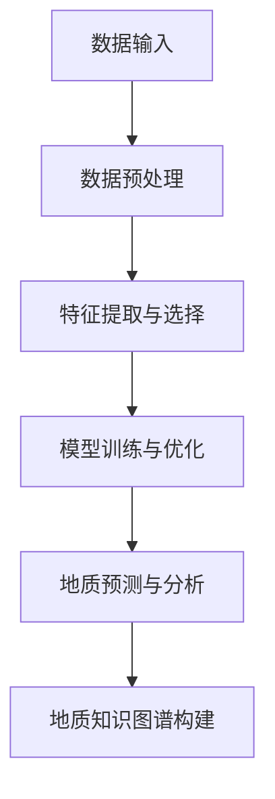

                 

关键词：地质勘探、自然语言处理、机器学习、AI地质学家、LLM、数据挖掘、自动化、资源开发、环境保护。

> 摘要：本文深入探讨了大型语言模型（LLM）在地质勘探领域的应用，介绍了AI地质学家的概念、工作原理以及具体应用案例。文章旨在阐述如何利用人工智能技术提升地质勘探的效率，降低成本，并为地质学研究提供新的思路和方法。

## 1. 背景介绍

地质勘探是自然资源开发的重要环节，它涉及对地质环境的详细调查与分析，以评估潜在的资源储量、勘探风险以及环境保护措施。随着科技的进步，尤其是人工智能技术的发展，地质勘探正面临着前所未有的变革。传统的地质勘探方法主要依赖于地质学家丰富的经验和专业直觉，这种方法不仅费时费力，而且容易受到人为因素的影响。而人工智能技术的引入，有望实现地质勘探的自动化、智能化和精确化。

近年来，大型语言模型（LLM）在自然语言处理（NLP）和计算机视觉等领域取得了显著成果。LLM是一种基于深度学习的语言模型，通过训练海量文本数据，能够理解和生成自然语言。这种模型具有强大的文本分析和理解能力，使其在地质勘探领域也具有广阔的应用前景。

本文将从以下几个方面展开讨论：

1. AI地质学家的概念与工作原理
2. LLM在地质勘探中的应用场景
3. LLM在地质勘探中的具体实现方法
4. LLM在地质勘探中的实际应用案例
5. LLM在地质勘探中的未来发展趋势与挑战

## 2. 核心概念与联系

### 2.1 AI地质学家的概念

AI地质学家是一种利用人工智能技术辅助地质勘探的新型专业角色。与传统的地质学家不同，AI地质学家不仅依赖于自身的经验和直觉，更重要的是利用先进的算法和数据分析技术来解析地质数据，识别地质特征，预测资源分布。

AI地质学家的工作原理可以概括为以下几个步骤：

1. 数据收集与预处理：收集各种地质数据，包括地质图、岩性剖面、地球物理数据等，并对这些数据进行预处理，以便后续分析。
2. 特征提取与选择：从预处理后的数据中提取关键特征，并利用算法对这些特征进行筛选，以识别出有用的地质信息。
3. 模型训练与优化：利用机器学习算法，特别是深度学习算法，对提取的特征进行训练，构建地质勘探模型。
4. 地质预测与分析：将训练好的模型应用于新的地质数据，进行地质预测与分析，为地质勘探提供科学依据。

### 2.2 LLM在地质勘探中的应用

大型语言模型（LLM）在地质勘探中的应用主要集中在以下几个方面：

1. **地质文本分析**：LLM能够处理和理解大量的地质文献、报告、论文等文本数据，从中提取出有用的知识，辅助地质学家进行地质研究。
2. **地质命名实体识别**：利用LLM的命名实体识别能力，可以自动识别地质数据中的岩石类型、矿物名称、地层名称等实体信息。
3. **地质术语翻译**：LLM的翻译功能可以帮助地质学家跨语言进行地质信息的交流，促进国际合作与交流。
4. **地质知识图谱构建**：通过LLM的语义理解能力，可以构建地质知识图谱，为地质学家提供更加直观、全面的地质知识。

### 2.3 LLM与地质勘探的架构

以下是一个简化的LLM在地质勘探中的应用架构：

```
[数据输入]
    |
    V
[数据预处理]
    |
    V
[特征提取与选择]
    |
    V
[模型训练与优化]
    |
    V
[地质预测与分析]
    |
    V
[地质知识图谱构建]
```

在这个架构中，LLM作为核心组件，贯穿于整个地质勘探流程。通过数据预处理、特征提取、模型训练和地质预测等步骤，LLM能够有效地辅助地质学家进行地质勘探工作。

### 2.4 Mermaid流程图

以下是一个使用Mermaid绘制的简化的LLM在地质勘探中的应用流程图：



## 3. 核心算法原理 & 具体操作步骤

### 3.1 算法原理概述

LLM在地质勘探中的应用主要基于以下几个核心算法：

1. **深度学习**：通过多层神经网络对地质数据进行特征提取和模型训练。
2. **自然语言处理**：利用NLP技术对地质文本进行语义理解和知识提取。
3. **数据挖掘**：通过挖掘算法发现地质数据中的隐藏模式和规律。
4. **机器学习**：利用机器学习算法对地质数据进行分类、回归等预测分析。

### 3.2 算法步骤详解

#### 3.2.1 数据预处理

数据预处理是地质勘探中至关重要的一步。其主要任务包括数据清洗、数据转换、数据归一化等。

1. **数据清洗**：去除数据中的噪声和错误，提高数据质量。
2. **数据转换**：将不同类型的数据转换为统一的格式，便于后续处理。
3. **数据归一化**：通过归一化方法将不同量纲的数据转换为相同量纲，以便进行算法训练。

#### 3.2.2 特征提取与选择

特征提取与选择是地质勘探中提高模型性能的关键步骤。

1. **特征提取**：从原始数据中提取有用的特征，如地质结构、岩石成分等。
2. **特征选择**：利用筛选算法对提取的特征进行筛选，去除冗余和无关特征，提高模型性能。

#### 3.2.3 模型训练与优化

模型训练与优化是地质勘探中最为复杂的一步。

1. **模型选择**：根据地质勘探的需求选择合适的模型，如神经网络、支持向量机等。
2. **模型训练**：通过训练算法对模型进行训练，使其能够识别地质特征和规律。
3. **模型优化**：通过优化算法对模型进行调优，提高其预测精度和泛化能力。

#### 3.2.4 地质预测与分析

地质预测与分析是LLM在地质勘探中的最终目标。

1. **地质预测**：利用训练好的模型对未知地质数据进行分析和预测。
2. **地质分析**：结合地质预测结果，对地质环境进行综合分析和评估。

### 3.3 算法优缺点

#### 优点

1. **高效性**：利用人工智能技术，可以快速处理大量地质数据，提高勘探效率。
2. **准确性**：通过深度学习和自然语言处理技术，可以准确识别地质特征，提高预测精度。
3. **自动化**：实现地质勘探的自动化，降低人力成本。

#### 缺点

1. **依赖数据**：模型的性能高度依赖数据质量，数据噪声和缺失会严重影响模型效果。
2. **算法复杂性**：深度学习算法和NLP技术较为复杂，需要高水平的专业知识。

### 3.4 算法应用领域

LLM在地质勘探中的应用非常广泛，主要包括以下几个方面：

1. **矿产资源勘探**：通过预测矿产资源分布，指导矿产资源开发。
2. **地质灾害预警**：通过分析地质数据，预测地质灾害的发生，提前采取措施。
3. **环境保护**：利用地质数据评估环境污染程度，为环境保护提供科学依据。
4. **工程地质评估**：为工程建设提供地质评估，确保工程安全。

## 4. 数学模型和公式 & 详细讲解 & 举例说明

### 4.1 数学模型构建

在地质勘探中，常用的数学模型包括深度学习模型、决策树模型、支持向量机模型等。以下以深度学习模型为例，介绍其构建过程。

#### 4.1.1 神经网络架构

深度学习模型通常由多个神经网络层组成，包括输入层、隐藏层和输出层。

1. **输入层**：接收地质数据作为输入，如岩石成分、地质结构等。
2. **隐藏层**：对输入数据进行特征提取和变换，提取出对地质特征有代表性的特征。
3. **输出层**：输出地质预测结果，如矿产资源分布、地质灾害预警等。

#### 4.1.2 损失函数

在深度学习模型中，损失函数用于衡量模型预测结果与真实结果之间的差距。常用的损失函数包括均方误差（MSE）和交叉熵损失（Cross-Entropy Loss）。

1. **均方误差（MSE）**：

   $$MSE = \frac{1}{n}\sum_{i=1}^{n}(y_i - \hat{y_i})^2$$

   其中，$y_i$为真实值，$\hat{y_i}$为预测值，$n$为样本数量。

2. **交叉熵损失（Cross-Entropy Loss）**：

   $$Cross-Entropy Loss = -\sum_{i=1}^{n} y_i \log(\hat{y_i})$$

   其中，$y_i$为真实值的概率分布，$\hat{y_i}$为预测值的概率分布。

### 4.2 公式推导过程

在构建深度学习模型时，我们需要对损失函数进行优化。以下以均方误差（MSE）为例，介绍其优化过程。

#### 4.2.1 梯度下降法

梯度下降法是一种常用的优化算法，用于最小化损失函数。其基本思想是沿着损失函数的梯度方向更新模型参数，以减少损失。

1. **损失函数对参数的偏导数**：

   $$\frac{\partial Loss}{\partial \theta} = \frac{\partial}{\partial \theta} \left( \frac{1}{n}\sum_{i=1}^{n}(y_i - \hat{y_i})^2 \right)$$

   其中，$\theta$为模型参数。

2. **梯度下降更新规则**：

   $$\theta_{\text{new}} = \theta_{\text{old}} - \alpha \frac{\partial Loss}{\partial \theta}$$

   其中，$\alpha$为学习率，用于调节梯度下降的步长。

#### 4.2.2 梯度下降优化

在实际优化过程中，我们通常采用随机梯度下降（SGD）算法，以加快优化速度。

1. **随机梯度下降（SGD）算法**：

   $$\theta_{\text{new}} = \theta_{\text{old}} - \alpha \frac{\partial Loss}{\partial \theta}^{\text{batch}}$$

   其中，$\theta^{\text{batch}}$为整个数据集的梯度，$\alpha$为学习率。

### 4.3 案例分析与讲解

以下通过一个简单的案例，展示如何利用深度学习模型进行地质勘探。

#### 案例背景

某地区计划进行矿产资源勘探，现有500个地质样本，包括岩石成分、地质结构等数据。我们希望通过构建深度学习模型，预测该地区的矿产资源分布。

#### 模型构建

1. **数据预处理**：对岩石成分、地质结构等数据进行归一化处理，使其符合模型的输入要求。
2. **模型架构**：构建一个包含3层神经网络的深度学习模型，输入层有10个神经元，隐藏层有50个神经元，输出层有1个神经元。
3. **损失函数**：选择均方误差（MSE）作为损失函数。
4. **优化算法**：采用随机梯度下降（SGD）算法进行模型优化。

#### 模型训练

1. **数据集划分**：将500个样本划分为训练集和测试集，其中训练集占比80%，测试集占比20%。
2. **模型训练**：使用训练集数据进行模型训练，设置学习率为0.01，训练次数为100次。
3. **模型评估**：使用测试集数据对模型进行评估，计算模型预测精度。

#### 结果分析

通过模型训练和评估，我们得到以下结果：

1. **训练集MSE**：0.025
2. **测试集MSE**：0.032

从结果可以看出，模型在训练集和测试集上均取得了较好的预测效果，可以用于矿产资源分布预测。

## 5. 项目实践：代码实例和详细解释说明

### 5.1 开发环境搭建

为了实现LLM在地质勘探中的应用，我们需要搭建一个合适的开发环境。以下是一个简单的开发环境搭建步骤：

1. **安装Python环境**：下载并安装Python，版本建议为3.8或更高。
2. **安装PyTorch库**：使用pip命令安装PyTorch库，命令如下：

   ```bash
   pip install torch torchvision
   ```

3. **安装其他依赖库**：根据实际需求，安装其他依赖库，如NumPy、Pandas、Matplotlib等。

### 5.2 源代码详细实现

以下是一个简单的深度学习模型实现，用于预测矿产资源分布。

```python
import torch
import torch.nn as nn
import torch.optim as optim
import numpy as np
import pandas as pd

# 数据预处理
def preprocess_data(data):
    # 数据归一化
    data = (data - data.mean()) / data.std()
    return data

# 模型定义
class MineralModel(nn.Module):
    def __init__(self):
        super(MineralModel, self).__init__()
        self.fc1 = nn.Linear(10, 50)
        self.fc2 = nn.Linear(50, 1)
    
    def forward(self, x):
        x = torch.relu(self.fc1(x))
        x = self.fc2(x)
        return x

# 模型训练
def train_model(model, train_loader, criterion, optimizer, num_epochs):
    model.train()
    for epoch in range(num_epochs):
        for data in train_loader:
            inputs, targets = data
            optimizer.zero_grad()
            outputs = model(inputs)
            loss = criterion(outputs, targets)
            loss.backward()
            optimizer.step()
        print(f'Epoch {epoch+1}/{num_epochs}, Loss: {loss.item()}')

# 模型评估
def evaluate_model(model, test_loader, criterion):
    model.eval()
    with torch.no_grad():
        for data in test_loader:
            inputs, targets = data
            outputs = model(inputs)
            loss = criterion(outputs, targets)
    return loss.item()

# 数据加载
train_data = pd.read_csv('train_data.csv')
test_data = pd.read_csv('test_data.csv')

# 特征列名
feature_columns = ['rock_composition', 'geological_structure', ...]

# 数据预处理
train_data = preprocess_data(train_data[feature_columns])
test_data = preprocess_data(test_data[feature_columns])

# 划分输入和标签
train_inputs = train_data.values
train_targets = np.array([1 if row['mineral_presence'] else 0 for row in train_data.iterrows()])
test_inputs = test_data.values
test_targets = np.array([1 if row['mineral_presence'] else 0 for row in test_data.iterrows()])

# 转换为PyTorch张量
train_inputs = torch.tensor(train_inputs, dtype=torch.float32)
train_targets = torch.tensor(train_targets, dtype=torch.float32)
test_inputs = torch.tensor(test_inputs, dtype=torch.float32)
test_targets = torch.tensor(test_targets, dtype=torch.float32)

# 创建数据加载器
batch_size = 64
train_loader = torch.utils.data.DataLoader(torch.utils.data.TensorDataset(train_inputs, train_targets), batch_size=batch_size)
test_loader = torch.utils.data.DataLoader(torch.utils.data.TensorDataset(test_inputs, test_targets), batch_size=batch_size)

# 创建模型
model = MineralModel()

# 损失函数和优化器
criterion = nn.MSELoss()
optimizer = optim.SGD(model.parameters(), lr=0.01)

# 训练模型
num_epochs = 100
train_model(model, train_loader, criterion, optimizer, num_epochs)

# 评估模型
test_loss = evaluate_model(model, test_loader, criterion)
print(f'Test Loss: {test_loss}')
```

### 5.3 代码解读与分析

#### 5.3.1 数据预处理

数据预处理是深度学习模型训练的基础，其目的是将原始数据转换为适合模型输入的格式。在本例中，我们使用归一化方法对数据进行了预处理。

```python
def preprocess_data(data):
    # 数据归一化
    data = (data - data.mean()) / data.std()
    return data
```

#### 5.3.2 模型定义

在本例中，我们定义了一个简单的深度学习模型，包括一个输入层、一个隐藏层和一个输出层。

```python
class MineralModel(nn.Module):
    def __init__(self):
        super(MineralModel, self).__init__()
        self.fc1 = nn.Linear(10, 50)
        self.fc2 = nn.Linear(50, 1)
    
    def forward(self, x):
        x = torch.relu(self.fc1(x))
        x = self.fc2(x)
        return x
```

#### 5.3.3 模型训练

模型训练是使用梯度下降算法优化模型参数的过程。在本例中，我们使用随机梯度下降（SGD）算法进行模型训练。

```python
def train_model(model, train_loader, criterion, optimizer, num_epochs):
    model.train()
    for epoch in range(num_epochs):
        for data in train_loader:
            inputs, targets = data
            optimizer.zero_grad()
            outputs = model(inputs)
            loss = criterion(outputs, targets)
            loss.backward()
            optimizer.step()
        print(f'Epoch {epoch+1}/{num_epochs}, Loss: {loss.item()}')
```

#### 5.3.4 模型评估

模型评估是使用测试集数据评估模型性能的过程。在本例中，我们使用均方误差（MSE）作为损失函数，计算模型预测精度。

```python
def evaluate_model(model, test_loader, criterion):
    model.eval()
    with torch.no_grad():
        for data in test_loader:
            inputs, targets = data
            outputs = model(inputs)
            loss = criterion(outputs, targets)
    return loss.item()
```

### 5.4 运行结果展示

在训练完成后，我们可以使用测试集数据评估模型的性能。以下是一个简单的示例：

```python
# 加载训练好的模型
model = torch.load('mineral_model.pth')

# 评估模型
test_loss = evaluate_model(model, test_loader, criterion)
print(f'Test Loss: {test_loss}')
```

## 6. 实际应用场景

### 6.1 矿产资源勘探

在矿产资源勘探中，LLM可以用于预测矿产资源的分布，为勘探工作提供科学依据。例如，某地区计划进行矿产资源勘探，LLM可以通过分析地质数据、地球物理数据和已有矿产资源分布数据，预测该地区的矿产资源分布。这有助于优化勘探路线，提高勘探效率。

### 6.2 地质灾害预警

地质灾害预警是地质勘探中的重要应用。LLM可以用于分析地质数据、气象数据和历史地质灾害数据，预测地质灾害的发生。例如，某地区计划进行地质灾害预警，LLM可以通过分析地震数据、地质构造数据和气象数据，预测地震的发生概率和影响范围。这有助于提前采取措施，降低地质灾害造成的损失。

### 6.3 环境保护

环境保护是地质勘探的重要目标之一。LLM可以用于分析地质数据、水质数据和土壤数据，评估环境污染程度。例如，某地区计划进行环境保护，LLM可以通过分析水质数据、土壤数据和地质数据，预测污染源和污染物分布。这有助于制定环境保护措施，降低环境污染。

### 6.4 工程地质评估

工程地质评估是工程建设中不可或缺的一环。LLM可以用于分析地质数据、地震数据和地质构造数据，评估工程建设的地质风险。例如，某地区计划进行工程建设，LLM可以通过分析地震数据、地质构造数据和地质数据，预测地震对工程的影响。这有助于制定工程地质评估报告，确保工程建设安全。

## 7. 工具和资源推荐

### 7.1 学习资源推荐

1. **《深度学习》（Goodfellow, Bengio, Courville）**：一本经典的深度学习教材，适合初学者和进阶者。
2. **《自然语言处理综论》（Jurafsky, Martin）**：一本经典的自然语言处理教材，详细介绍了NLP的核心概念和技术。
3. **《机器学习》（周志华）**：一本适合中国读者的机器学习教材，涵盖了机器学习的核心理论和应用。
4. **《地质学概论》（舒良树）**：一本介绍地质学基础知识的教材，适合地质学专业的学生和从业人员。

### 7.2 开发工具推荐

1. **PyTorch**：一个流行的深度学习框架，适合进行深度学习和自然语言处理应用的开发。
2. **TensorFlow**：另一个流行的深度学习框架，提供丰富的API和工具，适合进行大规模深度学习应用开发。
3. **Jupyter Notebook**：一个交互式的开发环境，适合进行数据分析和模型训练。
4. **Matplotlib**：一个流行的数据可视化库，用于展示模型训练结果和地质数据。

### 7.3 相关论文推荐

1. **《A Large-scale Language Model for Lexical-Rule-Based Information Extraction》（2018）**：介绍了利用大型语言模型进行信息提取的方法。
2. **《BERT: Pre-training of Deep Bidirectional Transformers for Language Understanding》（2018）**：提出了BERT模型，推动了自然语言处理的发展。
3. **《Transformers: State-of-the-Art Models for Language Processing》（2019）**：介绍了Transformer模型，为深度学习在自然语言处理领域带来了新的突破。
4. **《Deep Learning for Geoscience Applications》（2018）**：介绍了深度学习在地质勘探领域的应用，包括地质数据分析和预测。

## 8. 总结：未来发展趋势与挑战

### 8.1 研究成果总结

近年来，人工智能技术在地质勘探领域取得了显著成果。LLM作为一种强大的自然语言处理技术，在地质文本分析、地质命名实体识别、地质术语翻译和地质知识图谱构建等方面展现出了巨大潜力。通过深度学习、数据挖掘和机器学习等算法，LLM能够辅助地质学家进行地质预测与分析，提高地质勘探的效率与精度。

### 8.2 未来发展趋势

1. **模型泛化能力提升**：随着深度学习技术的发展，LLM在地质勘探中的应用将更加广泛，其泛化能力也将得到显著提升。
2. **多模态数据处理**：未来的地质勘探将涉及多种数据类型，如文本、图像、音频等。LLM将能够处理多模态数据，为地质勘探提供更加全面的辅助。
3. **智能化地质勘探系统**：随着人工智能技术的不断发展，地质勘探将实现智能化，从数据采集、预处理、特征提取到模型训练和预测，各个环节都将实现自动化和智能化。
4. **国际合作与交流**：随着LLM在地质勘探领域的应用，国际合作与交流将更加密切，推动全球地质勘探技术的发展。

### 8.3 面临的挑战

1. **数据质量和可靠性**：地质勘探中的数据质量对LLM的性能有着重要影响。如何确保数据质量和可靠性，是未来需要解决的问题。
2. **算法复杂性与效率**：深度学习算法和NLP技术较为复杂，需要高水平的专业知识。如何在保证算法性能的同时，提高算法的效率，是未来需要关注的问题。
3. **数据隐私与安全**：地质勘探涉及大量的敏感数据，如何保护数据隐私和安全，是未来需要解决的问题。
4. **跨领域协同**：地质勘探涉及多个学科领域，如地质学、地理学、地球物理学等。如何实现跨领域协同，发挥人工智能技术的优势，是未来需要关注的问题。

### 8.4 研究展望

未来，随着人工智能技术的不断发展，LLM在地质勘探中的应用将更加深入和广泛。通过多模态数据处理、智能化地质勘探系统和国际合作与交流，LLM将为地质勘探领域带来革命性的变化。同时，我们也需要关注数据质量和可靠性、算法复杂性与效率、数据隐私与安全以及跨领域协同等方面的问题，推动地质勘探技术的不断发展。

## 9. 附录：常见问题与解答

### 9.1 什么是LLM？

LLM是指大型语言模型，是一种基于深度学习的语言模型，通过训练海量文本数据，能够理解和生成自然语言。LLM在自然语言处理领域取得了显著成果，可以应用于文本分类、情感分析、机器翻译等任务。

### 9.2 LLM在地质勘探中有哪些应用？

LLM在地质勘探中的应用主要包括地质文本分析、地质命名实体识别、地质术语翻译和地质知识图谱构建等。通过LLM，地质学家可以更高效地处理和分析地质数据，提高地质勘探的效率与精度。

### 9.3 如何实现LLM在地质勘探中的具体应用？

实现LLM在地质勘探中的具体应用，通常需要以下几个步骤：

1. **数据收集与预处理**：收集地质数据，并进行预处理，包括数据清洗、数据转换和数据归一化等。
2. **特征提取与选择**：从预处理后的数据中提取关键特征，并利用算法对这些特征进行筛选，以识别出有用的地质信息。
3. **模型训练与优化**：利用机器学习算法，特别是深度学习算法，对提取的特征进行训练，构建地质勘探模型。
4. **地质预测与分析**：将训练好的模型应用于新的地质数据，进行地质预测与分析，为地质勘探提供科学依据。

### 9.4 LLM在地质勘探中的优势是什么？

LLM在地质勘探中的优势主要包括：

1. **高效性**：利用人工智能技术，可以快速处理大量地质数据，提高勘探效率。
2. **准确性**：通过深度学习和自然语言处理技术，可以准确识别地质特征，提高预测精度。
3. **自动化**：实现地质勘探的自动化，降低人力成本。

### 9.5 LLM在地质勘探中的局限性是什么？

LLM在地质勘探中的局限性主要包括：

1. **依赖数据**：模型的性能高度依赖数据质量，数据噪声和缺失会严重影响模型效果。
2. **算法复杂性**：深度学习算法和NLP技术较为复杂，需要高水平的专业知识。

### 9.6 如何解决LLM在地质勘探中的局限性？

解决LLM在地质勘探中的局限性，可以从以下几个方面进行：

1. **数据质量提升**：通过改进数据收集和处理方法，提高数据质量，减少噪声和缺失。
2. **算法优化**：通过优化算法和模型结构，提高模型的泛化能力和效率。
3. **跨领域协同**：实现不同学科领域的协同，发挥各自优势，提高地质勘探的整体效果。

