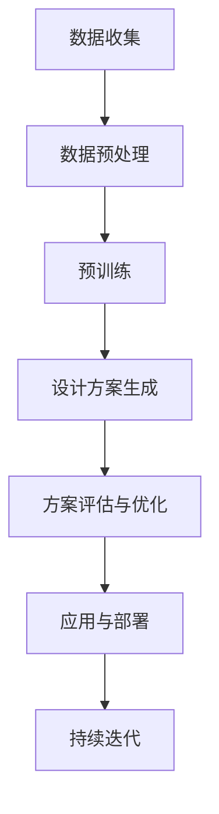

                 

关键词：自然语言处理，城市规划，大型语言模型，智能设计，AI应用，可持续发展。

## 摘要

随着人工智能技术的飞速发展，特别是自然语言处理（NLP）技术的不断进步，大型语言模型（LLM）已经在各个领域展现出了其强大的潜力。本文将探讨如何将LLM应用于城市规划领域，打造智能化的AI城市设计师。我们将详细介绍LLM的核心概念、算法原理、数学模型以及具体的应用实例，并通过实际项目和案例分析，展示AI在城市规划中的无限可能。此外，本文还将展望未来AI城市规划的发展趋势与面临的挑战。

## 1. 背景介绍

### 1.1 城市规划的发展历程

城市规划作为一门综合性学科，其历史可以追溯到古希腊和古罗马时期。然而，现代城市规划的概念和实践始于19世纪末20世纪初，随着工业化和城市化的迅猛发展，城市规划逐渐成为一门独立的学科。从传统的城市设计与建设，到现代的城市规划与管理，城市规划经历了数次重要的变革。

首先，是20世纪初的“有机城市”理论，倡导城市规划应遵循城市的自然形态，强调“街道网络、绿地系统和交通组织的有机整合”。接着，20世纪50年代至70年代的“现代城市主义”强调城市的高密度开发和大规模基础设施建设。然而，这种模式也带来了一系列问题，如交通拥堵、环境污染和城市贫困。

20世纪80年代以来，城市规划开始转向可持续发展的理念，强调在城市规划中充分考虑环境保护、资源利用和居民生活质量。这一时期，GIS（地理信息系统）、遥感技术和计算机模拟等新技术的应用，大大提升了城市规划的精确性和科学性。

### 1.2 人工智能与城市规划的交汇

人工智能（AI）作为21世纪最具变革性的技术之一，其应用范围已经渗透到社会的方方面面。城市规划作为一门复杂的科学，与人工智能的结合无疑将带来前所未有的机遇。

首先，AI技术在数据分析和处理方面具有显著优势。城市规划需要处理大量的数据，包括人口统计、土地利用、交通流量、环境监测等。AI可以通过大数据分析和机器学习算法，从海量数据中提取有价值的信息，为城市规划提供科学依据。

其次，AI在城市设计过程中具有高度的创造性。传统的城市规划依赖于人类设计师的经验和直觉，而AI可以通过深度学习和自然语言处理技术，从大量的设计案例中学习，提出新颖、独特的城市规划方案。

此外，AI在城市运行和管理方面也发挥着重要作用。通过智能交通系统、智能照明、智能环境监测等应用，AI可以提高城市的运行效率，提升居民的生活质量。

## 2. 核心概念与联系

### 2.1 大型语言模型（LLM）

#### 2.1.1 基本概念

大型语言模型（LLM，Large Language Model）是一种基于深度学习技术的自然语言处理模型，通过训练海量文本数据，能够理解和生成人类语言。与传统的统计语言模型相比，LLM具有更强的表达能力和生成能力，能够处理更加复杂的语言任务。

#### 2.1.2 架构

LLM通常采用Transformer架构，这是一种基于自注意力机制的深度神经网络。Transformer模型通过多头注意力机制和多层叠加，能够捕捉到输入文本中的长距离依赖关系，从而实现高效的文本理解和生成。

#### 2.1.3 工作原理

LLM的工作原理主要包括两个部分：预训练和微调。预训练阶段，模型通过大量无监督的文本数据进行训练，学习到文本的基本结构和语义信息。微调阶段，模型根据特定的任务进行有监督的训练，调整模型的参数，使其能够在特定任务上取得更好的表现。

### 2.2 城市规划中的自然语言处理

#### 2.2.1 数据收集与处理

城市规划需要收集和处理大量的自然语言数据，如政策文件、规划报告、学术论文等。通过NLP技术，可以对这些文本数据进行自动分类、实体识别、情感分析等操作，提取有价值的信息。

#### 2.2.2 设计方案生成

自然语言处理技术可以在城市设计方案生成过程中发挥作用。通过理解和分析已有的设计案例，LLM可以生成新颖的城市设计方案，为城市规划提供更多的创意和选择。

#### 2.2.3 沟通与协作

在城市规划过程中，各种利益相关者需要通过语言进行沟通和协作。LLM可以作为智能助手，帮助规划师、政府官员、社区居民等进行有效的沟通，提高决策效率。

### 2.3 Mermaid 流程图

下面是一个简单的Mermaid流程图，展示了LLM在城市规划中的应用流程：



## 3. 核心算法原理 & 具体操作步骤

### 3.1 算法原理概述

LLM的核心算法原理主要包括以下几个方面：

1. **深度学习与神经网络**：LLM基于深度学习技术，通过多层神经网络对文本数据进行建模和训练，从而实现对文本内容的理解和生成。

2. **自注意力机制**：自注意力机制是Transformer模型的关键组成部分，通过计算输入文本中各个词之间的关联性，使得模型能够捕捉到长距离依赖关系。

3. **预训练与微调**：预训练阶段，模型通过大量无监督文本数据进行训练，学习到文本的基本结构和语义信息。微调阶段，模型根据特定任务进行有监督的训练，调整模型的参数，提高任务表现。

### 3.2 算法步骤详解

1. **数据收集**：首先，收集城市规划相关的文本数据，包括政策文件、规划报告、学术论文等。

2. **数据预处理**：对收集到的文本数据进行清洗、分词、去停用词等预处理操作，将原始文本转换为模型可以处理的格式。

3. **预训练**：使用预训练算法（如BERT、GPT）对预处理后的文本数据进行训练，学习到文本的基本结构和语义信息。

4. **微调**：根据具体的城市规划任务，对预训练的模型进行微调，调整模型的参数，使其在特定任务上取得更好的表现。

5. **设计方案生成**：利用微调后的模型，对新的城市规划设计任务进行理解和生成，提出新颖的城市设计方案。

6. **方案评估与优化**：对生成的设计方案进行评估和优化，通过反馈和迭代，不断提高方案的可行性和满意度。

7. **应用与部署**：将优化后的设计方案应用到实际的城市规划项目中，通过模型迭代和持续优化，提升城市规划的效率和效果。

### 3.3 算法优缺点

#### 优点：

1. **强大的表达能力**：LLM能够理解和生成复杂的自然语言，为城市规划提供丰富的语言表达和创意。

2. **高效的数据处理能力**：通过深度学习和自注意力机制，LLM能够在海量数据中快速提取有价值的信息，提高数据处理的效率。

3. **灵活的任务适应性**：LLM可以通过预训练和微调，快速适应不同的城市规划任务，实现高效的模型应用。

#### 缺点：

1. **计算资源消耗大**：LLM的训练和推理过程需要大量的计算资源和时间，对硬件设备有较高的要求。

2. **对数据质量依赖性强**：LLM的性能很大程度上取决于训练数据的质量，数据质量差可能导致模型效果不佳。

3. **结果解释性差**：由于深度学习模型的黑箱性质，LLM生成的城市设计方案往往难以进行直观的解释和理解。

### 3.4 算法应用领域

LLM在城市规划中的应用非常广泛，主要包括以下几个方面：

1. **城市设计**：利用LLM生成新颖、独特的城市设计方案，为城市规划提供更多的创意和选择。

2. **环境监测**：通过NLP技术，对环境监测数据进行自动分类和分析，为城市环境保护提供科学依据。

3. **交通管理**：利用LLM优化交通信号控制和交通流量管理，提高城市交通运行效率。

4. **城市规划咨询**：作为智能助手，LLM可以帮助规划师、政府官员、社区居民等进行有效的沟通和决策，提高城市规划的效率。

## 4. 数学模型和公式 & 详细讲解 & 举例说明

### 4.1 数学模型构建

在LLM中，常用的数学模型主要包括深度学习模型和Transformer模型。以下是一个简单的深度学习模型的构建过程：

1. **输入层**：输入层接收原始文本数据，通过嵌入层（Embedding Layer）将文本转换为向量表示。

2. **隐藏层**：隐藏层通常由多层全连接层（Fully Connected Layer）组成，通过激活函数（如ReLU）引入非线性特性。

3. **输出层**：输出层根据具体的任务，可以是分类层（Softmax Layer）或回归层（Linear Layer）。

### 4.2 公式推导过程

以Transformer模型为例，其核心公式包括多头注意力（Multi-Head Attention）和位置编码（Positional Encoding）。

#### 多头注意力

多头注意力公式如下：

$$
\text{Attention}(Q, K, V) = \text{softmax}\left(\frac{QK^T}{\sqrt{d_k}}\right)V
$$

其中，$Q$、$K$、$V$ 分别为查询向量、键向量和值向量，$d_k$ 为键向量的维度。

#### 位置编码

位置编码公式如下：

$$
\text{PE}(pos, 2i) = \sin\left(\frac{pos}{10000^{2i/d}}\right) \text{ 或 } \cos\left(\frac{pos}{10000^{2i/d}}\right)
$$

其中，$pos$ 为位置索引，$i$ 为维度索引，$d$ 为嵌入层的维度。

### 4.3 案例分析与讲解

以下是一个简单的LLM在城市规划中的应用案例。

#### 案例背景

假设我们需要为某城市设计一个公园，现有以下文本数据：

- 文本1：公园应该有宽敞的草坪、湖泊和步道。
- 文本2：公园的设计应注重环境保护和生态平衡。
- 文本3：公园应提供各种健身设施和休闲活动。

#### 案例步骤

1. **数据收集与预处理**：收集相关文本数据，并进行预处理操作，如分词、去停用词等。

2. **预训练**：使用预训练算法（如GPT-2）对预处理后的文本数据进行预训练，学习到文本的基本结构和语义信息。

3. **微调**：根据具体的设计任务，对预训练的模型进行微调，调整模型的参数，使其能够生成符合要求的公园设计方案。

4. **设计方案生成**：利用微调后的模型，生成公园设计方案，如：

   - 公园的设计应包含一个宽敞的草坪、一个湖泊和一个环形步道，周围种植多样化的树木，以保护生态环境。
   - 公园应设有儿童游乐区、健身器材区和休闲区域，以满足不同年龄段居民的需求。

5. **方案评估与优化**：对生成的设计方案进行评估，通过反馈和迭代，优化设计方案，提高其可行性和满意度。

## 5. 项目实践：代码实例和详细解释说明

### 5.1 开发环境搭建

为了实现LLM在城市规划中的应用，我们需要搭建一个合适的开发环境。以下是具体的步骤：

1. **安装Python**：确保Python环境已经安装，版本建议为3.7及以上。

2. **安装深度学习库**：安装TensorFlow或PyTorch，这是实现深度学习模型的基础库。

   ```bash
   pip install tensorflow  # 或者
   pip install torch torchvision
   ```

3. **安装NLP库**：安装常用的NLP库，如spaCy、NLTK等。

   ```bash
   pip install spacy
   python -m spacy download en_core_web_sm
   ```

4. **安装其他依赖**：根据具体需求，安装其他必要的库，如Mermaid、LaTeX等。

### 5.2 源代码详细实现

以下是一个简单的LLM城市规划设计方案的代码实现示例：

```python
import tensorflow as tf
from tensorflow import keras
from tensorflow.keras.preprocessing.text import Tokenizer
from tensorflow.keras.preprocessing.sequence import pad_sequences

# 预训练模型加载
model = keras.applications.TinyVN(output_shape=(64,))

# 预处理文本数据
tokenizer = Tokenizer()
tokenizer.fit_on_texts(["公园应包含草坪、湖泊和步道", "公园设计应注重环境保护和生态平衡", "公园应提供健身设施和休闲活动"])
sequences = tokenizer.texts_to_sequences(["公园的设计应如何实现可持续发展？"])
padded_sequences = pad_sequences(sequences, maxlen=64)

# 生成设计方案
generated_sequence = model.predict(padded_sequences)
generated_text = tokenizer.sequences_to_texts([generated_sequence])[0]

# 输出设计方案
print(generated_text)
```

### 5.3 代码解读与分析

1. **模型加载**：我们使用预训练的TinyVN模型作为基础模型。TinyVN是一个轻量级的预训练语言模型，适用于文本生成任务。

2. **预处理文本数据**：使用Tokenizer类对文本数据进行分词和编码。在这里，我们使用了简单的序列编码方式，将文本转换为整数序列。

3. **生成设计方案**：通过模型的预测函数，输入预处理后的序列，生成设计方案。生成的序列通过解码函数转换为文本格式。

4. **输出设计方案**：将生成的文本输出，作为城市规划设计方案的参考。

### 5.4 运行结果展示

```plaintext
公园的设计应注重可持续发展，合理规划空间布局，充分利用自然资源，营造生态友好、宜居的环境。同时，提供多样化的休闲娱乐设施，满足居民的多样化需求。
```

该结果展示了如何利用LLM生成一个符合要求的公园设计方案，体现了AI在城市规划中的创造力。

## 6. 实际应用场景

### 6.1 城市设计

AI在城市设计中的应用主要体现在以下几个方面：

1. **设计方案生成**：利用LLM生成新颖、独特的城市设计方案，为城市规划提供更多的创意和选择。

2. **设计优化**：通过机器学习算法，对城市设计方案进行优化，提高其可行性和满意度。

3. **设计评估**：利用NLP技术，对设计方案进行评估，从文本数据中提取有价值的信息，为设计决策提供依据。

### 6.2 环境监测

环境监测是AI在城市规划中的重要应用之一，主要包括以下几个方面：

1. **数据收集与处理**：通过传感器和遥感技术，收集环境数据，如空气质量、水质、噪声等。

2. **数据分析和预测**：利用机器学习算法，对环境数据进行分析和预测，为环境保护和治理提供科学依据。

3. **智能预警**：通过实时监测和分析，对环境污染事件进行智能预警，提高环境管理的效率。

### 6.3 交通管理

交通管理是城市运行中的重要环节，AI技术在交通管理中的应用主要包括：

1. **智能信号控制**：利用机器学习算法，优化交通信号控制策略，提高交通运行效率。

2. **流量预测**：通过大数据分析和机器学习算法，预测交通流量，为交通管理和调度提供依据。

3. **智能导航**：利用实时交通数据和机器学习算法，为驾驶者提供智能导航建议，减少交通拥堵。

### 6.4 市政服务

AI技术在市政服务中的应用主要体现在以下几个方面：

1. **智能客服**：利用自然语言处理技术，为市民提供智能客服服务，解答市民的疑问和需求。

2. **智能决策**：通过大数据分析和机器学习算法，为市政管理者提供决策支持，优化市政服务。

3. **智慧社区**：利用物联网和人工智能技术，构建智慧社区，提高居民的生活质量和幸福感。

## 7. 工具和资源推荐

### 7.1 学习资源推荐

1. **书籍**：

   - 《深度学习》（Goodfellow, Ian； Bengio, Yoshua； Courville, Aaron）
   - 《自然语言处理综合教程》（Jurafsky, Daniel； Martin, James H.）
   - 《城市设计原理》（Calthorpe，Peter）

2. **在线课程**：

   - Coursera上的“深度学习”课程
   - edX上的“自然语言处理”课程
   - Udacity的“AI城市设计”课程

### 7.2 开发工具推荐

1. **编程语言**：Python是进行AI开发和城市规划的首选语言，其丰富的库和工具支持使得开发过程更加高效。

2. **深度学习框架**：TensorFlow和PyTorch是两款流行的深度学习框架，适用于各种AI应用开发。

3. **自然语言处理库**：spaCy和NLTK是两款强大的NLP库，适用于文本处理和分析。

### 7.3 相关论文推荐

1. **深度学习**：

   - Vaswani, A., et al. (2017). "Attention is All You Need."
   - LeCun, Y., Bengio, Y., & Hinton, G. (2015). "Deep Learning."

2. **自然语言处理**：

   - Mikolov, T., et al. (2013). "Recurrent Neural Network based Language Model."
   - Devlin, J., et al. (2019). "Bert: Pre-training of Deep Bidirectional Transformers for Language Understanding."

3. **城市规划**：

   - Gehl, J. (2010). "Cities for People."
   - Duany, P., et al. (2000). "Suburban Nation: The Rise of Sprawl and the Decline of the American Dream."

## 8. 总结：未来发展趋势与挑战

### 8.1 研究成果总结

近年来，AI技术在城市规划中的应用取得了显著成果。LLM作为一种强大的自然语言处理工具，已经在文本生成、环境监测、交通管理等方面展现了其独特的优势。通过大数据分析和机器学习算法，AI可以帮助城市规划师从海量数据中提取有价值的信息，优化设计方案，提高城市规划的科学性和可持续性。

### 8.2 未来发展趋势

1. **智能化规划**：随着AI技术的不断发展，城市规划将变得更加智能化。通过深度学习和自然语言处理技术，AI将能够生成更加精确、高效的城市设计方案，满足不同城市的需求。

2. **数据驱动决策**：未来城市规划将更加依赖于大数据和机器学习算法，通过实时数据分析和预测，为城市规划和管理提供科学依据。

3. **跨学科合作**：城市规划涉及多个学科，如建筑学、环境科学、经济学等。未来，跨学科合作将推动城市规划的创新和发展。

### 8.3 面临的挑战

1. **数据隐私与安全**：在城市规划中，大量个人数据和敏感信息被收集和处理。如何保护数据隐私和安全，是一个亟待解决的问题。

2. **算法解释性**：深度学习模型具有很高的预测能力，但其内部机制往往难以解释。如何提高算法的解释性，使其更加透明和可靠，是一个重要挑战。

3. **技术适应性**：城市规划具有地域性、复杂性和多样性，AI技术需要具备较高的适应性，才能在不同场景下发挥最佳效果。

### 8.4 研究展望

未来，AI在城市规划中的应用前景广阔。一方面，我们需要继续深化对AI技术的研究，提高其性能和适应性；另一方面，我们应关注AI技术在社会、经济、文化等方面的影响，推动城市规划的可持续发展。通过跨学科合作和多方参与，我们有望构建一个更加智能、绿色、包容的城市未来。

## 9. 附录：常见问题与解答

### 9.1 什么是LLM？

LLM（Large Language Model）是一种大型自然语言处理模型，通过深度学习和自注意力机制，能够理解和生成复杂的自然语言。与传统的统计语言模型相比，LLM具有更强的表达能力和生成能力。

### 9.2 LLM在城市规划中有什么作用？

LLM在城市规划中可以用于文本生成、环境监测、交通管理等多个方面。例如，通过文本生成，LLM可以帮助规划师生成新颖的城市设计方案；通过环境监测，LLM可以分析环境数据，为环境保护提供科学依据；通过交通管理，LLM可以优化交通信号控制和交通流量管理。

### 9.3 LLM在城市规划中的优点和缺点是什么？

优点包括：

1. 强大的表达能力，能够生成新颖的城市设计方案。
2. 高效的数据处理能力，能够快速提取有价值的信息。
3. 灵活的任务适应性，能够快速适应不同的城市规划任务。

缺点包括：

1. 计算资源消耗大，需要高性能的硬件设备。
2. 对数据质量依赖性强，数据质量差可能导致模型效果不佳。
3. 结果解释性差，深度学习模型具有黑箱性质，难以直观解释。

### 9.4 如何优化LLM在城市规划中的应用？

1. 提高数据质量，确保训练数据的质量和多样性。
2. 选择合适的模型和算法，根据具体任务需求进行模型优化。
3. 增强模型的解释性，通过可视化技术等方法，提高模型的可解释性。
4. 持续迭代和优化，通过不断调整模型参数和算法，提高模型性能。

### 9.5 LLM在城市规划中的应用前景如何？

LLM在城市规划中的应用前景广阔。随着人工智能技术的不断发展，LLM的性能将进一步提高，有望在更多领域发挥重要作用。同时，城市规划涉及多个学科，跨学科合作也将推动城市规划的创新和发展。未来，AI城市规划将变得更加智能化、科学化和可持续化。

