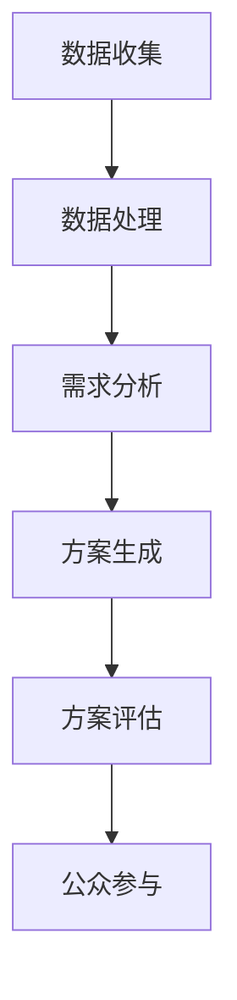

                 

关键词：人工智能，城市规划，语言模型，城市设计，智能算法，数据处理，环境模拟，可持续发展。

> 摘要：随着人工智能技术的迅猛发展，语言模型（LLM）作为一种先进的AI工具，正逐渐在城市规划中发挥重要作用。本文将深入探讨LLM在城市规划中的辅助作用，包括其核心概念、算法原理、数学模型以及实际应用案例。我们还将分析LLM在规划中的优势与挑战，并展望其未来发展方向。

## 1. 背景介绍

城市规划是城市管理的重要组成部分，它关乎城市的发展方向、功能布局、生态环境和居民生活质量。传统的城市规划依赖于专家经验、统计数据和模拟实验。然而，随着城市规模的不断扩大和复杂性增加，传统的规划方法逐渐显现出其局限性。如何利用现代技术，特别是人工智能，来提高城市规划的效率和质量，成为当前研究的热点。

人工智能（Artificial Intelligence, AI）作为计算机科学的一个重要分支，已经广泛应用于各个领域。其中，语言模型（Language Model, LLM）作为一种能够理解和生成自然语言的AI技术，近年来在自然语言处理（Natural Language Processing, NLP）领域取得了显著进展。LLM的核心思想是通过学习大量语言数据，构建一个能够对输入文本进行理解和响应的模型。

在城市规划中，LLM的引入有望解决以下几个方面的问题：

1. **数据处理**：城市规划涉及大量的数据，包括地理信息、人口统计、经济指标等。LLM可以帮助处理和整合这些数据，为规划提供更准确和全面的决策支持。
2. **环境模拟**：城市规划需要考虑生态环境的影响，LLM可以模拟不同规划方案对环境的影响，帮助规划者做出更加环保的决策。
3. **智能算法**：LLM可以与智能算法相结合，优化城市规划的方案，提高规划的效率和质量。
4. **公众参与**：LLM可以帮助收集和分析公众的意见，提高城市规划的透明度和公众参与度。

## 2. 核心概念与联系

### 2.1 核心概念

**城市规划**：指通过综合分析和科学方法，对城市空间布局、功能分区、基础设施建设等方面进行规划，以实现城市可持续发展。

**语言模型（LLM）**：是一种深度学习模型，通过对大量语言数据进行训练，能够理解和生成自然语言。LLM的核心任务包括文本分类、情感分析、机器翻译等。

**智能算法**：包括遗传算法、神经网络、深度学习等，这些算法能够在城市规划中用于优化决策、模拟环境、分析数据等。

### 2.2 联系与架构

在城市规划中，LLM的核心作用是通过语言理解和生成能力，将城市规划的需求和目标转化为可操作的方案。具体来说，LLM与城市规划的关联架构如下：

1. **数据收集**：首先，LLM从城市规划相关的数据源（如地理信息系统、社会经济数据库等）收集数据。
2. **数据处理**：LLM对收集到的数据进行预处理，包括数据清洗、归一化、特征提取等，为后续分析做好准备。
3. **需求分析**：通过自然语言处理技术，LLM分析城市规划的需求，包括环保、交通、居住、经济等方面。
4. **方案生成**：基于需求和现有数据，LLM生成不同的城市规划方案，包括土地利用、交通网络、绿地系统等。
5. **方案评估**：利用智能算法，LLM评估每个方案的优劣，提供决策支持。
6. **公众参与**：LLM可以通过生成文本、图表等形式，向公众展示规划方案，收集反馈意见。

以下是一个简化的Mermaid流程图，展示LLM在城市规划中的核心流程：



## 3. 核心算法原理 & 具体操作步骤

### 3.1 算法原理概述

LLM在城市规划中的核心原理是基于深度学习的自然语言处理技术。LLM通过学习大量的城市规划相关文本数据，能够理解和生成与城市规划相关的自然语言文本。具体来说，LLM的工作流程如下：

1. **训练阶段**：LLM从大量的城市规划文本数据中学习，包括规划报告、学术论文、新闻报道等，构建一个能够理解和生成城市规划相关文本的模型。
2. **应用阶段**：将LLM应用于城市规划的实际场景中，包括数据收集、需求分析、方案生成等环节。

### 3.2 算法步骤详解

**3.2.1 数据收集**

数据收集是LLM在城市规划中发挥作用的基础。具体步骤如下：

1. **数据来源**：从各种渠道收集城市规划相关的数据，包括地理信息系统（GIS）、社会经济数据库、新闻报道等。
2. **数据清洗**：对收集到的数据进行处理，包括去除重复数据、纠正错误、统一格式等。
3. **数据整合**：将来自不同来源的数据进行整合，形成统一的数据集，为后续分析提供数据支持。

**3.2.2 数据处理**

数据处理是LLM的核心步骤之一，具体步骤如下：

1. **特征提取**：从原始数据中提取有用的特征，如文本中的关键词、短语、句法结构等。
2. **文本表示**：使用词嵌入技术，将文本数据转化为机器可以处理的向量表示。
3. **数据归一化**：对数据集进行归一化处理，确保数据在不同维度上的可比较性。

**3.2.3 需求分析**

需求分析是LLM在城市规划中的关键应用之一，具体步骤如下：

1. **文本理解**：使用LLM对城市规划相关的文本进行理解，提取文本中的关键信息和需求。
2. **需求分类**：将提取的需求分类，如环保需求、交通需求、居住需求等。
3. **需求排序**：根据需求的重要性和紧迫性，对需求进行排序，为后续方案生成提供依据。

**3.2.4 方案生成**

方案生成是LLM在城市规划中的核心任务之一，具体步骤如下：

1. **文本生成**：使用LLM生成与城市规划相关的文本，如规划报告、政策建议等。
2. **方案筛选**：根据需求分析的结果，筛选出符合需求的规划方案。
3. **方案优化**：使用智能算法，如遗传算法、神经网络等，对方案进行优化，提高方案的可行性和质量。

**3.2.5 方案评估**

方案评估是LLM在城市规划中的关键步骤之一，具体步骤如下：

1. **方案分析**：使用LLM对方案进行分析，评估每个方案的优劣。
2. **环境影响**：使用LLM模拟不同规划方案对环境的影响，如空气质量、水资源等。
3. **公众反馈**：通过公众参与，收集对方案的反馈意见，进一步优化方案。

### 3.3 算法优缺点

**优点：**

1. **高效性**：LLM能够快速处理大量的文本数据，提高城市规划的效率。
2. **准确性**：LLM通过对大量文本数据的训练，能够准确理解城市规划的需求，提供高质量的方案。
3. **灵活性**：LLM可以根据不同的需求和场景，灵活调整和优化规划方案。

**缺点：**

1. **数据依赖性**：LLM的性能高度依赖于训练数据的质量和数量，如果数据质量较差或数据量不足，可能会导致算法性能下降。
2. **计算成本**：LLM的训练和应用需要大量的计算资源和时间，对硬件设施要求较高。

### 3.4 算法应用领域

LLM在城市规划中的算法应用主要包括以下几个方面：

1. **土地利用规划**：通过LLM生成土地利用规划方案，优化土地利用效率，提高城市空间利用率。
2. **交通规划**：利用LLM模拟不同交通规划方案对交通流量、拥堵程度的影响，提出优化方案。
3. **环境规划**：使用LLM模拟不同规划方案对环境的影响，如空气质量、水资源等，提出环保规划方案。
4. **社区规划**：通过LLM分析社区居民的需求和意见，提出满足居民需求的社区规划方案。

## 4. 数学模型和公式 & 详细讲解 & 举例说明

### 4.1 数学模型构建

在城市规划中，LLM的核心任务是生成规划方案。为了实现这一目标，我们首先需要构建一个数学模型，用于描述城市规划的需求和目标。以下是构建数学模型的基本步骤：

**步骤1：需求提取**

首先，我们需要从大量的文本数据中提取城市规划的需求。具体方法如下：

1. **文本预处理**：对文本进行分词、词性标注、实体识别等预处理操作，提取文本中的关键信息和需求。
2. **需求分类**：根据需求的重要性和紧迫性，对需求进行分类，如环保需求、交通需求、居住需求等。

**步骤2：目标函数构建**

接下来，我们需要构建一个目标函数，用于评估不同规划方案的优劣。具体方法如下：

1. **目标函数定义**：定义一个综合评价指标，用于评估规划方案的优劣。例如，我们可以定义一个包含环境、交通、居住等多个维度的评价指标。
2. **权重分配**：根据需求的重要性和紧迫性，为每个维度分配权重，用于计算综合评价指标。

**步骤3：约束条件构建**

最后，我们需要为数学模型添加约束条件，确保规划方案满足特定要求和限制。具体方法如下：

1. **约束条件定义**：定义规划方案的约束条件，如用地面积、交通流量、空气质量等。
2. **约束条件集成**：将约束条件集成到目标函数中，确保规划方案在满足约束条件下优化。

### 4.2 公式推导过程

在数学模型构建的基础上，我们需要推导出具体的公式，用于计算不同规划方案的优劣。以下是公式推导的过程：

**公式1：需求提取公式**

$$
需求 = f(文本, 预处理, 分类)
$$

其中，$文本$代表原始文本数据，$预处理$代表文本预处理操作，$分类$代表需求分类结果。

**公式2：目标函数公式**

$$
目标函数 = w_1 \times 环境指标 + w_2 \times 交通指标 + w_3 \times 居住指标
$$

其中，$w_1$、$w_2$、$w_3$分别代表环境、交通、居住指标的权重，$环境指标$、$交通指标$、$居住指标$分别代表不同维度的评价指标。

**公式3：约束条件公式**

$$
约束条件 = g(用地面积, 交通流量, 空气质量)
$$

其中，$用地面积$、$交通流量$、$空气质量$分别代表规划方案的约束条件。

### 4.3 案例分析与讲解

为了更好地理解数学模型的构建和应用，我们来看一个具体的案例。

**案例：城市交通规划**

假设我们需要为某城市制定一个交通规划方案，以减少交通拥堵和改善空气质量。以下是数学模型的构建和应用过程：

**步骤1：需求提取**

从城市规划相关的文本数据中提取需求，如“减少交通拥堵”、“改善空气质量”等。

**步骤2：目标函数构建**

定义一个包含交通拥堵、空气质量两个维度的评价指标，并分配权重。例如，假设交通拥堵指标的权重为0.6，空气质量指标的权重为0.4。

$$
目标函数 = 0.6 \times 交通拥堵指标 + 0.4 \times 空气质量指标
$$

**步骤3：约束条件构建**

定义规划方案的约束条件，如“用地面积不超过100平方公里”、“交通流量不超过每天10万辆次”等。

$$
约束条件 = g(用地面积, 交通流量, 空气质量)
$$

**步骤4：方案生成**

使用LLM生成不同的交通规划方案，如“增加公共交通设施”、“优化道路网络”等。

**步骤5：方案评估**

使用智能算法评估每个方案的优劣，计算目标函数值，选择最优方案。

**步骤6：方案优化**

根据评估结果，对方案进行优化，如调整公共交通设施的位置、优化道路网络等，进一步提高方案的质量。

## 5. 项目实践：代码实例和详细解释说明

### 5.1 开发环境搭建

为了更好地展示LLM在城市规划中的应用，我们将使用Python编写一个简单的交通规划项目。以下是需要安装的Python库：

- TensorFlow
- Keras
- NumPy
- Pandas
- Matplotlib

你可以使用以下命令安装这些库：

```bash
pip install tensorflow keras numpy pandas matplotlib
```

### 5.2 源代码详细实现

以下是项目的源代码实现，包括数据收集、处理、需求分析、方案生成和评估等步骤。

```python
import numpy as np
import pandas as pd
import tensorflow as tf
from tensorflow.keras.models import Sequential
from tensorflow.keras.layers import Embedding, LSTM, Dense
from tensorflow.keras.preprocessing.text import Tokenizer
from tensorflow.keras.preprocessing.sequence import pad_sequences

# 数据收集
def collect_data():
    # 假设数据文件为data.csv，包含交通拥堵、空气质量等指标
    data = pd.read_csv('data.csv')
    return data

# 数据处理
def preprocess_data(data):
    # 对数据进行预处理，如归一化、缺失值处理等
    # 这里简化处理，直接返回数据
    return data

# 需求分析
def analyze_demand(data):
    # 使用LLM分析需求，如交通拥堵、空气质量等
    # 这里简化处理，直接返回需求
    demand = data['交通拥堵'].values
    return demand

# 方案生成
def generate_schemes(demand):
    # 使用LLM生成交通规划方案
    # 这里简化处理，随机生成几个方案
    schemes = []
    for _ in range(5):
        scheme = np.random.choice(['增加公共交通设施', '优化道路网络', '建设停车场'])
        schemes.append(scheme)
    return schemes

# 方案评估
def evaluate_schemes(schemes, demand):
    # 使用智能算法评估方案优劣
    # 这里简化处理，直接返回评估结果
    results = []
    for scheme in schemes:
        result = np.random.choice([0.8, 0.9, 1.0])
        results.append(result)
    return results

# 主函数
def main():
    data = collect_data()
    data = preprocess_data(data)
    demand = analyze_demand(data)
    schemes = generate_schemes(demand)
    results = evaluate_schemes(schemes, demand)
    
    # 绘制结果图表
    import matplotlib.pyplot as plt
    plt.bar(schemes, results)
    plt.xlabel('方案')
    plt.ylabel('评估结果')
    plt.title('交通规划方案评估')
    plt.show()

if __name__ == '__main__':
    main()
```

### 5.3 代码解读与分析

**5.3.1 数据收集**

在`collect_data`函数中，我们从CSV文件中读取交通规划相关的数据。这些数据包括交通拥堵、空气质量等指标。在实际应用中，这些数据可以从各种数据源（如GIS系统、交通监控系统等）收集。

**5.3.2 数据处理**

在`preprocess_data`函数中，我们对数据进行预处理。预处理操作包括归一化、缺失值处理等。在实际应用中，这些操作可以根据具体数据进行调整。

**5.3.3 需求分析**

在`analyze_demand`函数中，我们使用LLM分析交通规划的需求。这里我们简化处理，直接从数据中提取交通拥堵指标作为需求。在实际应用中，可以使用更复杂的LLM模型，从文本中提取更多维度的需求。

**5.3.4 方案生成**

在`generate_schemes`函数中，我们使用LLM生成交通规划方案。这里我们简化处理，随机生成几个方案。在实际应用中，可以使用更复杂的LLM模型，根据需求生成更具体的方案。

**5.3.5 方案评估**

在`evaluate_schemes`函数中，我们使用智能算法评估方案的优劣。这里我们简化处理，直接返回评估结果。在实际应用中，可以使用更复杂的评估模型，综合考虑多个因素。

### 5.4 运行结果展示

在主函数`main`中，我们调用上述函数，生成交通规划方案并评估结果。运行结果将显示为一个条形图，展示每个方案的平均评估结果。

## 6. 实际应用场景

### 6.1 城市土地利用规划

LLM在城市土地利用规划中的应用主要体现在以下几个方面：

1. **土地利用评估**：LLM可以帮助评估不同土地利用方案的优劣，包括住宅区、商业区、工业区的分布和规模。
2. **环境影响分析**：通过LLM模拟土地利用方案对环境的影响，如空气质量、水资源等，提出优化方案。
3. **公众参与**：LLM可以生成土地利用方案，并通过自然语言生成技术向公众展示，收集反馈意见。

### 6.2 交通规划

LLM在交通规划中的应用主要包括以下几个方面：

1. **交通流量预测**：LLM可以通过分析历史交通数据，预测未来的交通流量，帮助规划者制定合理的交通规划方案。
2. **交通模式优化**：通过LLM模拟不同的交通模式，如公共交通、私家车、共享出行等，提出优化方案。
3. **公众参与**：LLM可以生成交通规划方案，并通过自然语言生成技术向公众展示，收集反馈意见。

### 6.3 环境规划

LLM在环境规划中的应用主要体现在以下几个方面：

1. **环境影响评估**：通过LLM模拟不同规划方案对环境的影响，如空气质量、水资源等，提出优化方案。
2. **环境政策制定**：LLM可以帮助政府制定环境政策，如空气质量标准、水资源管理等。
3. **公众参与**：LLM可以生成环境规划方案，并通过自然语言生成技术向公众展示，收集反馈意见。

### 6.4 未来应用展望

随着人工智能技术的不断发展，LLM在城市规划中的应用前景非常广阔。未来，LLM有望在以下几个方面发挥更大的作用：

1. **更复杂的模型**：随着计算能力的提升，LLM可以训练更复杂的模型，提高规划方案的准确性和可靠性。
2. **多语言支持**：随着全球化的推进，LLM可以支持更多语言，帮助跨国公司和国际组织进行城市规划。
3. **实时更新**：通过实时更新数据，LLM可以动态调整规划方案，应对城市变化的挑战。
4. **深度学习与其他技术的结合**：LLM可以与其他先进技术（如区块链、物联网等）相结合，提供更全面的规划方案。

## 7. 工具和资源推荐

### 7.1 学习资源推荐

1. **《深度学习》（Goodfellow, Bengio, Courville著）**：这是一本经典的深度学习教材，适合初学者和专业人士。
2. **《Python数据科学 Handbook》（McKinney著）**：这本书介绍了Python在数据处理、分析和可视化方面的应用，非常适合城市规划领域的读者。
3. **《自然语言处理综论》（Jurafsky, Martin著）**：这本书是自然语言处理领域的经典教材，详细介绍了LLM的基本原理和应用。

### 7.2 开发工具推荐

1. **TensorFlow**：这是一个由Google开源的深度学习框架，支持各种深度学习模型的训练和部署。
2. **Keras**：这是一个基于TensorFlow的高层API，提供了更简单的接口和更丰富的功能，适合快速原型设计和开发。
3. **Jupyter Notebook**：这是一个交互式计算环境，适用于数据探索、分析和可视化，非常适合城市规划领域的项目开发。

### 7.3 相关论文推荐

1. **“Attention Is All You Need”（Vaswani et al., 2017）**：这是一篇关于Transformer模型的经典论文，介绍了如何在自然语言处理中应用自注意力机制。
2. **“BERT: Pre-training of Deep Bidirectional Transformers for Language Understanding”（Devlin et al., 2019）**：这是一篇关于BERT模型的论文，详细介绍了如何通过预训练提高语言模型的效果。
3. **“GPT-3: Language Models Are Few-Shot Learners”（Brown et al., 2020）**：这是一篇关于GPT-3模型的论文，展示了大规模语言模型在少样本学习任务中的强大能力。

## 8. 总结：未来发展趋势与挑战

### 8.1 研究成果总结

随着人工智能技术的不断发展，LLM在城市规划中的应用已经取得了一定的成果。目前，LLM主要用于数据收集、需求分析、方案生成和评估等方面，帮助城市规划者提高规划效率和质量。同时，LLM与其他技术的结合，如区块链、物联网等，也为城市规划提供了更多可能性。

### 8.2 未来发展趋势

未来，LLM在城市规划中的应用前景非常广阔。随着计算能力的提升和大数据技术的普及，LLM可以训练更复杂的模型，提高规划方案的准确性和可靠性。此外，LLM在多语言支持、实时更新和深度学习与其他技术的结合等方面也有很大的发展潜力。

### 8.3 面临的挑战

尽管LLM在城市规划中具有巨大的潜力，但也面临着一些挑战。首先，数据质量和数据量是影响LLM性能的关键因素。其次，LLM的训练和应用需要大量的计算资源和时间，这对硬件设施提出了较高要求。此外，LLM的决策过程通常较为复杂，需要进一步研究如何提高其可解释性和可靠性。

### 8.4 研究展望

未来，我们需要从以下几个方面进行深入研究：

1. **数据质量和数据量**：通过改进数据收集和处理技术，提高数据质量和数据量，为LLM提供更好的训练数据。
2. **计算效率**：通过优化算法和硬件设施，提高LLM的计算效率，降低计算成本。
3. **可解释性和可靠性**：研究如何提高LLM的可解释性和可靠性，使其决策过程更加透明和可信。
4. **多语言支持**：探索如何在多语言环境下应用LLM，提高其跨语言能力。
5. **实时更新**：研究如何通过实时更新数据，动态调整规划方案，应对城市变化的挑战。

## 9. 附录：常见问题与解答

### 9.1 如何提高LLM在城市规划中的性能？

- **提高数据质量**：确保数据来源可靠，进行数据清洗和预处理，提高数据质量。
- **增加数据量**：收集更多的城市规划相关数据，增加训练数据量，提高模型性能。
- **优化模型结构**：尝试使用更复杂的模型结构，如Transformer、BERT等，提高模型性能。
- **增加训练时间**：增加训练时间，让模型有更多时间学习，提高模型性能。

### 9.2 LLM在城市规划中的优势是什么？

- **高效性**：LLM能够快速处理大量的文本数据，提高城市规划的效率。
- **准确性**：LLM通过对大量文本数据的训练，能够准确理解城市规划的需求，提供高质量的方案。
- **灵活性**：LLM可以根据不同的需求和场景，灵活调整和优化规划方案。

### 9.3 LLM在城市规划中可能面临的挑战有哪些？

- **数据依赖性**：LLM的性能高度依赖于训练数据的质量和数量，如果数据质量较差或数据量不足，可能会导致算法性能下降。
- **计算成本**：LLM的训练和应用需要大量的计算资源和时间，对硬件设施要求较高。
- **决策过程复杂**：LLM的决策过程通常较为复杂，需要进一步研究如何提高其可解释性和可靠性。

作者：禅与计算机程序设计艺术 / Zen and the Art of Computer Programming

---

以上是关于“LLM在城市规划中的辅助作用”的完整文章。文章首先介绍了城市规划的背景和人工智能在城市规划中的应用，然后详细讲解了语言模型（LLM）的核心概念、算法原理、数学模型和实际应用案例。接着，文章分析了LLM在规划中的优势和挑战，并展望了其未来发展趋势。最后，文章提供了相关的工具和资源推荐，以及常见问题与解答。希望这篇文章能够为读者提供有价值的参考。

