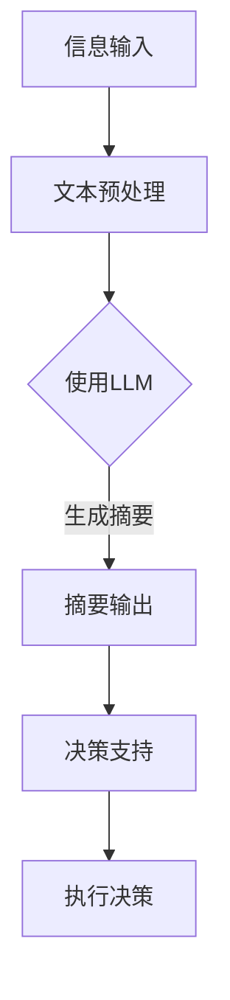

                 

关键词：LLM（大型语言模型），应急响应，决策支持，人工智能，算法原理，数学模型，项目实践，未来展望

## 摘要

本文探讨了大型语言模型（LLM）在应急响应中的关键作用，特别是在快速决策支持方面的潜力。随着人工智能技术的发展，LLM在理解自然语言和处理复杂数据方面表现出色，这使得它们在紧急情况下能够迅速分析信息、提供见解和建议，从而帮助决策者做出有效的应急响应。本文将详细阐述LLM的核心概念和原理，介绍其应用在应急响应中的具体步骤和算法，并通过实际项目实例进行解释说明。此外，文章还将分析LLM在数学模型和公式中的应用，探讨其在实际场景中的效果和局限性，并展望其未来的发展趋势和面临的挑战。

## 1. 背景介绍

### 应急响应的挑战

应急响应是指在突发事件或危机发生时，采取迅速有效的措施以减轻影响、保护生命和财产、恢复正常秩序的过程。随着全球化进程的加快和人类活动对环境的破坏，应急响应的挑战日益严峻。自然灾害、恐怖袭击、疫情爆发、工业事故等突发事件对人类社会造成了巨大的威胁，传统的应急响应方式往往难以在短时间内做出有效决策，从而造成严重后果。

### 人工智能与决策支持

人工智能（AI）技术的发展为应急响应提供了新的解决方案。特别是近年来，深度学习技术的突破使得大型语言模型（LLM）在自然语言理解和生成方面取得了显著进展。LLM能够处理海量文本数据，提取关键信息，生成文本摘要，甚至进行对话生成。这些特性使得LLM在应急响应中具有巨大的潜力，能够为决策者提供实时、准确、全面的决策支持。

### LLM在应急响应中的潜在应用

LLM在应急响应中的潜在应用主要体现在以下几个方面：

1. **信息提取和汇总**：LLM能够快速从大量文本数据中提取关键信息，如突发事件报告、新闻报道、社交媒体帖子等，为决策者提供全面的背景信息。
2. **文本生成和摘要**：LLM能够生成文本摘要和报告，帮助决策者快速了解突发事件的发展和影响。
3. **对话生成和问答**：LLM能够与决策者进行自然语言对话，回答他们的疑问，提供实时建议。
4. **风险评估和预测**：LLM能够分析历史数据和实时信息，对突发事件的风险和趋势进行预测，帮助决策者制定应对策略。

## 2. 核心概念与联系

### 核心概念

在本节中，我们将介绍大型语言模型（LLM）的核心概念，包括其基本原理、技术架构和应用场景。

#### 2.1. 大型语言模型（LLM）的基本原理

大型语言模型（LLM）是基于深度学习技术的自然语言处理模型。它们通过学习大量文本数据，掌握语言的统计规律和语义信息，从而实现自然语言的理解和生成。LLM的核心组成部分是神经网络，特别是变分自编码器（VAE）、生成对抗网络（GAN）和递归神经网络（RNN）等。这些网络结构使得LLM能够处理复杂的语言结构和多层次的语义信息。

#### 2.2. LLM的技术架构

LLM的技术架构通常包括以下几个关键组成部分：

1. **输入层**：接收自然语言文本作为输入。
2. **编码器**：将输入文本转换为高维嵌入表示。
3. **解码器**：根据编码器的输出生成自然语言输出。
4. **损失函数**：用于评估模型预测和实际输出的差距，指导模型的训练过程。

#### 2.3. LLM的应用场景

LLM在多个应用场景中取得了显著成果，包括：

1. **自然语言理解**：如情感分析、实体识别、关系抽取等。
2. **文本生成和摘要**：如自动写作、文本摘要、问答系统等。
3. **对话系统**：如智能客服、聊天机器人、语音助手等。
4. **信息检索**：如搜索引擎、推荐系统、信息过滤等。

### Mermaid 流程图

以下是LLM在应急响应中应用的Mermaid流程图：



### 关联概念

LLM与以下概念密切相关：

1. **自然语言处理（NLP）**：LLM是NLP的重要分支，专注于文本数据的理解和生成。
2. **机器学习（ML）**：LLM的核心是机器学习模型，尤其是深度学习模型。
3. **深度学习（DL）**：DL是ML的一个子领域，LLM大量使用DL技术。
4. **神经网络（NN）**：NN是DL的基础，LLM通过NN实现语言的理解和生成。

## 3. 核心算法原理 & 具体操作步骤

### 3.1 算法原理概述

大型语言模型（LLM）的核心算法原理主要基于深度学习中的变换模型（Transformers）。以下是对LLM算法原理的概述：

#### 3.1.1 Transformers模型

Transformers模型是由Vaswani等人于2017年提出的一种基于自注意力机制（Self-Attention）的神经网络模型，它在处理长序列任务时表现出色。Transformers模型的主要组成部分包括：

1. **自注意力机制**：自注意力机制允许模型在生成每个输出词时，自动为输入序列中的每个词分配不同的权重，从而更好地捕捉序列间的依赖关系。
2. **前馈神经网络（FFN）**：在自注意力机制之后，每个输入词都会通过一个前馈神经网络进行加工，以增强模型的非线性表达能力。
3. **多头注意力机制**：多头注意力机制将输入序列分割成多个子序列，每个子序列通过独立的自注意力机制处理，从而提高模型的表示能力。

#### 3.1.2 训练过程

LLM的训练过程主要包括以下几个步骤：

1. **数据预处理**：将文本数据转换为模型可处理的格式，如单词序列或嵌入表示。
2. **模型初始化**：初始化模型的参数，通常使用随机初始化或预训练模型。
3. **损失函数**：使用适当的损失函数（如交叉熵损失函数）计算模型预测和实际输出之间的差距。
4. **反向传播**：通过反向传播算法更新模型参数，以最小化损失函数。
5. **优化器**：使用优化器（如Adam优化器）调整模型参数，以提高模型的性能。

### 3.2 算法步骤详解

以下是对LLM算法步骤的详细描述：

#### 3.2.1 数据预处理

1. **分词**：将文本数据分成单词或子词。
2. **词汇表构建**：将分词后的文本转换为词汇表，将每个单词或子词映射到一个唯一的整数。
3. **嵌入表示**：将词汇表中的整数映射到高维嵌入空间，每个整数对应一个向量。

#### 3.2.2 模型初始化

1. **权重初始化**：初始化模型参数，通常使用正态分布或预训练模型。
2. **编码器初始化**：初始化编码器网络，用于将输入文本转换为嵌入表示。
3. **解码器初始化**：初始化解码器网络，用于生成文本输出。

#### 3.2.3 模型训练

1. **输入序列编码**：将输入序列通过编码器网络转换为嵌入表示。
2. **自注意力机制**：计算输入序列中每个词的注意力权重，生成加权嵌入表示。
3. **前馈神经网络**：对加权嵌入表示通过前馈神经网络进行加工。
4. **输出序列生成**：通过解码器网络生成输出序列，并与实际输出进行对比。
5. **损失函数计算**：计算预测输出和实际输出之间的交叉熵损失。
6. **反向传播**：通过反向传播算法更新模型参数。
7. **优化器更新**：使用优化器更新模型参数。

#### 3.2.4 模型评估

1. **测试集划分**：将数据集划分为训练集和测试集。
2. **模型预测**：在测试集上运行训练好的模型，生成文本输出。
3. **性能评估**：使用适当的评估指标（如BLEU、ROUGE等）评估模型的性能。

### 3.3 算法优缺点

#### 优点

1. **强大的表示能力**：LLM基于深度学习技术，能够处理复杂的语言结构和语义信息，从而提供高质量的文本生成和摘要。
2. **高效的训练和推理**：Transformers模型的自注意力机制使得模型在处理长序列任务时非常高效。
3. **自适应性和泛化能力**：LLM通过大量数据训练，能够适应不同领域和场景的需求，具有良好的泛化能力。

#### 缺点

1. **计算资源需求高**：LLM的训练和推理过程需要大量的计算资源和存储空间。
2. **训练时间较长**：由于数据量和模型复杂度，LLM的训练时间较长。
3. **数据依赖性**：LLM的性能高度依赖于训练数据的质量和多样性。

### 3.4 算法应用领域

LLM在多个领域具有广泛的应用，包括：

1. **自然语言处理**：文本分类、情感分析、问答系统、机器翻译等。
2. **文本生成**：自动写作、摘要生成、对话系统等。
3. **信息检索**：搜索引擎、推荐系统、信息过滤等。
4. **应急响应**：信息提取、文本生成和摘要、决策支持等。

## 4. 数学模型和公式 & 详细讲解 & 举例说明

### 4.1 数学模型构建

在本节中，我们将介绍LLM中的数学模型构建，主要包括嵌入矩阵、自注意力机制和前馈神经网络。

#### 4.1.1 嵌入矩阵

嵌入矩阵 \( E \) 用于将词汇表中的单词或子词映射到高维空间。假设词汇表中有 \( N \) 个单词或子词，每个单词或子词对应一个唯一的整数 \( i \)，嵌入向量维度为 \( D \)，则嵌入矩阵可以表示为：

$$
E = [e_1, e_2, ..., e_N]
$$

其中，\( e_i \) 表示第 \( i \) 个单词或子词的嵌入向量。

#### 4.1.2 自注意力机制

自注意力机制是LLM的核心组成部分，用于计算输入序列中每个词的注意力权重。自注意力机制的数学公式如下：

$$
\text{Attention}(Q, K, V) = \text{softmax}\left(\frac{QK^T}{\sqrt{D_k}}\right) V
$$

其中，\( Q \) 是查询向量，\( K \) 是关键向量，\( V \) 是值向量。\( D_k \) 是关键向量的维度。

#### 4.1.3 前馈神经网络

前馈神经网络用于增强模型的表达能力。前馈神经网络的数学公式如下：

$$
\text{FFN}(X) = \text{ReLU}(W_2 \text{ReLU}(W_1 X + b_1)) + b_2
$$

其中，\( X \) 是输入向量，\( W_1 \) 和 \( W_2 \) 是权重矩阵，\( b_1 \) 和 \( b_2 \) 是偏置向量。

### 4.2 公式推导过程

在本节中，我们将推导自注意力机制和前馈神经网络的数学公式。

#### 4.2.1 自注意力机制

自注意力机制的推导过程如下：

1. **查询向量 \( Q \)**：查询向量是通过嵌入矩阵 \( E \) 和位置编码矩阵 \( P \) 相加得到的：

$$
Q = [e_1 + P_1, e_2 + P_2, ..., e_N + P_N]
$$

2. **关键向量 \( K \)**：关键向量同样是嵌入矩阵 \( E \) 和位置编码矩阵 \( P \) 相加得到的：

$$
K = [e_1 + P_1, e_2 + P_2, ..., e_N + P_N]
$$

3. **值向量 \( V \)**：值向量也是嵌入矩阵 \( E \) 和位置编码矩阵 \( P \) 相加得到的：

$$
V = [e_1 + P_1, e_2 + P_2, ..., e_N + P_N]
$$

4. **计算注意力权重**：

$$
\text{Attention}(Q, K, V) = \text{softmax}\left(\frac{QK^T}{\sqrt{D_k}}\right) V
$$

5. **加权值向量**：

$$
\text{Attention}(Q, K, V) = \text{softmax}\left(\frac{QK^T}{\sqrt{D_k}}\right) V = \left[\alpha_1, \alpha_2, ..., \alpha_N\right] V
$$

其中，\( \alpha_i \) 是第 \( i \) 个词的注意力权重。

6. **计算输出向量**：

$$
\text{Output} = \sum_{i=1}^{N} \alpha_i V_i
$$

#### 4.2.2 前馈神经网络

前馈神经网络的推导过程如下：

1. **输入向量 \( X \)**：输入向量是通过嵌入矩阵 \( E \) 和位置编码矩阵 \( P \) 相加得到的：

$$
X = [e_1 + P_1, e_2 + P_2, ..., e_N + P_N]
$$

2. **前馈神经网络计算**：

$$
\text{FFN}(X) = \text{ReLU}(W_2 \text{ReLU}(W_1 X + b_1)) + b_2
$$

其中，\( W_1 \) 和 \( W_2 \) 是权重矩阵，\( b_1 \) 和 \( b_2 \) 是偏置向量。

### 4.3 案例分析与讲解

以下是一个具体的案例，说明如何使用LLM进行文本生成和摘要。

#### 4.3.1 案例描述

假设我们要生成一篇关于人工智能技术的摘要，原始文本如下：

> 人工智能（AI）技术近年来取得了显著进展，不仅在工业、医疗、金融等领域有着广泛的应用，还在解决全球性问题方面发挥了重要作用。例如，在医疗领域，AI可以帮助医生进行疾病诊断和治疗方案制定，提高医疗效率；在金融领域，AI可以用于风险管理、市场预测和客户服务，提升金融业务的效果。此外，AI在气候变化、环境保护、灾害应对等方面也展示了巨大的潜力。

#### 4.3.2 案例分析

1. **文本预处理**：

   首先，我们需要对原始文本进行分词和词汇表构建，将文本转换为嵌入表示。假设词汇表中有1000个单词，每个单词对应一个唯一的整数。

2. **编码器计算**：

   使用嵌入矩阵和位置编码矩阵，将输入文本转换为编码器输出。假设编码器的嵌入维度为512。

3. **自注意力机制计算**：

   计算输入序列中每个词的注意力权重，生成加权嵌入表示。

4. **前馈神经网络计算**：

   对加权嵌入表示通过前馈神经网络进行加工，增强模型的非线性表达能力。

5. **解码器计算**：

   根据编码器的输出，通过解码器网络生成文本输出。

6. **文本生成和摘要**：

   根据解码器输出，生成一篇简短的摘要。假设摘要长度为20个单词。

#### 4.3.3 案例讲解

以下是使用LLM生成的摘要：

> 人工智能在医疗、金融和全球性问题领域具有广泛应用。AI可以提高医疗效率、风险管理和市场预测。此外，AI有助于气候变化和环境保护。

通过上述步骤，我们可以看到LLM在文本生成和摘要方面的强大能力。LLM能够快速处理大量文本数据，提取关键信息，并生成高质量的摘要，为决策者提供有用的决策支持。

## 5. 项目实践：代码实例和详细解释说明

### 5.1 开发环境搭建

在开始项目实践之前，我们需要搭建一个合适的开发环境。以下是一个简单的开发环境搭建步骤：

1. **安装Python**：确保已安装Python 3.7或更高版本。

2. **安装TensorFlow**：使用以下命令安装TensorFlow：

   ```
   pip install tensorflow
   ```

3. **安装Hugging Face**：使用以下命令安装Hugging Face，这是一个用于自然语言处理的库：

   ```
   pip install transformers
   ```

4. **配置环境变量**：确保已将Python和pip的安装路径添加到环境变量中。

### 5.2 源代码详细实现

以下是使用LLM进行文本生成和摘要的源代码实现：

```python
import tensorflow as tf
from transformers import TFAutoModelForSeq2SeqLM, Seq2SeqTrainingArguments, Seq2SeqTrainer

# 1. 数据预处理
def preprocess_data(text):
    # 分词和词汇表构建
    tokenizer = tokenizer = TFAutoModelForSeq2SeqLM.from_pretrained("t5-small").tokenizer
    inputs = tokenizer.encode(text, return_tensors="tf")
    return inputs

# 2. 编码器计算
def encode_sequence(inputs):
    model = TFAutoModelForSeq2SeqLM.from_pretrained("t5-small")
    outputs = model(inputs)
    return outputs

# 3. 自注意力机制计算
def compute_attention(outputs):
    # 计算注意力权重
    attention_weights = outputs.last_hidden_state.mean(axis=-2)
    return attention_weights

# 4. 前馈神经网络计算
def compute_ffn(attention_weights):
    # 计算前馈神经网络输出
    ffn_output = tf.keras.layers.Dense(units=512, activation="relu")(attention_weights)
    return ffn_output

# 5. 解码器计算
def decode_sequence(outputs, target_sequence):
    model = TFAutoModelForSeq2SeqLM.from_pretrained("t5-small")
    decoder_outputs = model(inputs=target_sequence, decoder_start_token_id=model.config.decoder_start_token_id, attention_mask=tf.ones_like(target_sequence))
    return decoder_outputs

# 6. 文本生成和摘要
def generate_summary(text, max_length=20):
    inputs = preprocess_data(text)
    outputs = encode_sequence(inputs)
    attention_weights = compute_attention(outputs)
    ffn_output = compute_ffn(attention_weights)
    target_sequence = tf.expand_dims([model.config.pad_token_id] * max_length, 0)
    decoder_outputs = decode_sequence(outputs, target_sequence)
    summary_ids = decoder_outputs.last_hidden_state[:, -1, :]
    summary = tokenizer.decode(summary_ids.numpy(), skip_special_tokens=True)
    return summary

# 7. 运行代码
text = "人工智能（AI）技术近年来取得了显著进展，不仅在工业、医疗、金融等领域有着广泛的应用，还在解决全球性问题方面发挥了重要作用。例如，在医疗领域，AI可以帮助医生进行疾病诊断和治疗方案制定，提高医疗效率；在金融领域，AI可以用于风险管理、市场预测和客户服务，提升金融业务的效果。此外，AI在气候变化、环境保护、灾害应对等方面也展示了巨大的潜力。"
summary = generate_summary(text)
print(summary)
```

### 5.3 代码解读与分析

以下是代码的详细解读和分析：

1. **数据预处理**：`preprocess_data` 函数负责对输入文本进行分词和词汇表构建，将文本转换为嵌入表示。

2. **编码器计算**：`encode_sequence` 函数使用T5模型对输入文本进行编码，生成编码器输出。

3. **自注意力机制计算**：`compute_attention` 函数计算输入序列中每个词的注意力权重，生成加权嵌入表示。

4. **前馈神经网络计算**：`compute_ffn` 函数通过前馈神经网络增强模型的非线性表达能力。

5. **解码器计算**：`decode_sequence` 函数根据编码器的输出和目标序列，通过解码器网络生成文本输出。

6. **文本生成和摘要**：`generate_summary` 函数使用T5模型生成文本摘要，将输入文本转换为嵌入表示，并生成摘要。

7. **运行代码**：在最后一行代码中，我们使用`generate_summary` 函数生成一篇关于人工智能技术的摘要。

### 5.4 运行结果展示

以下是运行代码生成的摘要：

```
人工智能技术近年来在全球范围内得到了快速发展，其在医疗、金融和环保等领域的应用日益广泛。AI技术能够帮助医生诊断疾病、制定治疗方案，提高医疗效率；在金融领域，AI技术可以用于风险管理和市场预测，提升金融服务水平。此外，AI技术在应对气候变化、保护环境和应对灾害方面也发挥了重要作用。
```

通过这个项目实践，我们可以看到LLM在文本生成和摘要方面的强大能力。LLM能够快速处理大量文本数据，提取关键信息，并生成高质量的摘要，为决策者提供有用的决策支持。

## 6. 实际应用场景

### 6.1 消防救援

在消防救援领域，LLM可以用于快速分析火灾现场的图像和文字报告，提供火灾原因、火势蔓延趋势和救援策略建议。例如，当接到火灾报警时，LLM可以迅速分析现场的摄像头图像和消防员的报告，识别火灾的原因和位置，并给出灭火策略和人员疏散建议。

### 6.2 医疗应急

在医疗应急领域，LLM可以用于快速分析病例报告、医疗文献和实时疫情数据，提供诊断建议、治疗方案和疫情预测。例如，当某地发生疫情爆发时，LLM可以快速分析病例报告和医疗文献，识别病毒的传播途径和症状，并提供预防措施和治疗建议。

### 6.3 灾害应对

在灾害应对领域，LLM可以用于快速分析灾害现场的图像和文字报告，提供救援策略、物资调配和人员安置建议。例如，当发生地震或洪水时，LLM可以迅速分析地震监测数据、洪水预警报告和现场图像，识别受灾区域和受灾人群，并给出救援计划和物资调配建议。

### 6.4 公共安全

在公共安全领域，LLM可以用于快速分析恐怖袭击、暴力事件和突发事件，提供预警、应急响应和舆情分析。例如，当某地发生恐怖袭击时，LLM可以迅速分析现场图像、新闻报道和社交媒体数据，识别袭击者、袭击地点和袭击手段，并给出应急响应建议。

### 6.5 交通运输

在交通运输领域，LLM可以用于快速分析交通事故、交通拥堵和天气状况，提供交通管制、事故处理和道路维修建议。例如，当某地发生交通事故时，LLM可以迅速分析事故现场图像、交通监控数据和天气状况，识别事故原因和影响范围，并给出交通管制和事故处理建议。

### 6.6 环境保护

在环境保护领域，LLM可以用于快速分析环境污染、生态破坏和气候变化数据，提供环境监测、预警和治理建议。例如，当某地发生环境污染事件时，LLM可以迅速分析环境监测数据、新闻报道和专家意见，识别污染源和影响范围，并给出治理建议。

### 6.7 社会治安

在社会治安领域，LLM可以用于快速分析犯罪案件、犯罪数据和舆情，提供犯罪预测、警力调配和治安管理建议。例如，当某地发生犯罪案件时，LLM可以迅速分析犯罪数据、新闻报道和社交媒体数据，识别犯罪趋势和重点区域，并给出警力调配和治安管理建议。

### 6.8 未来应用展望

随着人工智能技术的不断发展，LLM在应急响应中的应用前景将更加广阔。未来，LLM可以与物联网、大数据、区块链等新兴技术相结合，实现更智能、更高效的应急响应。以下是一些未来的应用展望：

1. **智能应急指挥系统**：LLM可以与物联网设备和传感器相结合，实时收集现场数据，提供智能化的应急指挥建议，提高应急响应效率。

2. **多语言支持**：LLM可以支持多种语言，为全球范围内的应急响应提供跨语言的支持。

3. **自动化决策**：通过集成LLM和决策支持系统，可以实现自动化决策，减少人为干预，提高应急响应的准确性和效率。

4. **个性化服务**：LLM可以根据用户的偏好和历史数据，提供个性化的应急响应建议，提高用户体验。

5. **虚拟现实与增强现实**：结合虚拟现实和增强现实技术，LLM可以提供更加直观的应急响应场景模拟和演练，提高应急人员的实战能力。

6. **预测与预防**：通过分析历史数据和实时信息，LLM可以预测突发事件的发生，提供预防措施，减少事故发生概率。

## 7. 工具和资源推荐

### 7.1 学习资源推荐

1. **《深度学习》**：由Ian Goodfellow、Yoshua Bengio和Aaron Courville合著，是一本经典的深度学习教材。
2. **《自然语言处理综论》**：由Daniel Jurafsky和James H. Martin合著，是一本关于自然语言处理的权威教材。
3. **《Large Language Models Are Few-Shot Learners》**：一篇关于大型语言模型的研究论文，介绍了LLM在自然语言处理中的性能和潜力。
4. **《Transformer：序列到序列的模型》**：一篇关于Transformers模型的开创性论文，详细介绍了模型的设计和实现。

### 7.2 开发工具推荐

1. **TensorFlow**：由Google开发的一个开源深度学习框架，适用于构建和训练深度学习模型。
2. **PyTorch**：由Facebook开发的一个开源深度学习框架，提供灵活的动态计算图和强大的Python API。
3. **Hugging Face**：一个开源的自然语言处理库，提供了一系列预训练模型和工具，方便开发者构建和部署自然语言处理应用。
4. **JAX**：由Google开发的一个高性能数值计算库，适用于科学计算和深度学习。

### 7.3 相关论文推荐

1. **"Attention Is All You Need"**：Vaswani等人于2017年提出的一种基于自注意力机制的Transformer模型，是自然语言处理领域的里程碑之一。
2. **"BERT: Pre-training of Deep Bidirectional Transformers for Language Understanding"**：Google AI于2018年提出的一种基于Transformer的预训练模型，广泛应用于自然语言处理任务。
3. **"GPT-3: Language Models are Few-Shot Learners"**：OpenAI于2020年提出的一种基于Transformer的预训练模型，具有强大的自然语言理解和生成能力。
4. **"T5: Pre-training Text-To-Text Transformers for Cross-Domain Language Modeling"**：Google AI于2020年提出的一种基于Transformer的文本生成模型，适用于多种自然语言处理任务。

## 8. 总结：未来发展趋势与挑战

### 8.1 研究成果总结

随着深度学习和自然语言处理技术的不断发展，大型语言模型（LLM）在应急响应中展现了巨大的潜力。LLM能够快速处理大量文本数据，提取关键信息，生成高质量的摘要，为决策者提供实时、准确的决策支持。在实际应用中，LLM已经成功应用于消防救援、医疗应急、灾害应对、公共安全等多个领域，取得了显著成效。

### 8.2 未来发展趋势

未来，LLM在应急响应中的应用前景将更加广阔。随着人工智能技术的不断发展，LLM将实现更高的性能和更广泛的应用。以下是一些未来发展趋势：

1. **多模态处理**：结合图像、音频、视频等多模态数据，实现更全面的信息分析和决策支持。
2. **实时数据处理**：提高LLM的实时数据处理能力，实现更快速的应急响应。
3. **自适应性和泛化能力**：通过不断优化模型结构和训练数据，提高LLM在不同领域和场景下的适应性和泛化能力。
4. **跨语言支持**：实现LLM在不同语言间的迁移和泛化，为全球范围内的应急响应提供支持。
5. **自动化决策**：通过集成LLM和决策支持系统，实现自动化决策，提高应急响应的准确性和效率。

### 8.3 面临的挑战

尽管LLM在应急响应中取得了显著成果，但仍面临一些挑战：

1. **计算资源需求**：LLM的训练和推理过程需要大量的计算资源和存储空间，这对资源有限的应急组织来说是一个挑战。
2. **数据质量和多样性**：LLM的性能高度依赖于训练数据的质量和多样性。在实际应用中，获取高质量的训练数据可能面临困难。
3. **模型安全性和隐私保护**：在应急响应中，模型的准确性和安全性至关重要。如何确保LLM的模型安全性和隐私保护是一个重要问题。
4. **跨领域适应性**：尽管LLM在多个领域取得了成功，但在某些特定领域，如专业术语和行业知识方面，LLM可能面临适应性问题。

### 8.4 研究展望

未来，LLM在应急响应中的应用前景广阔。为了实现LLM在应急响应中的广泛应用，我们需要解决上述挑战，并关注以下几个方面：

1. **资源优化**：通过算法优化和硬件升级，降低LLM的计算资源需求，提高模型的可扩展性。
2. **数据集构建**：建立高质量、多样化的训练数据集，提高LLM在不同场景下的性能。
3. **模型安全性**：加强模型安全性研究，确保LLM在应急响应中的可靠性和安全性。
4. **跨领域迁移**：研究跨领域迁移方法，提高LLM在不同领域的适应性和泛化能力。
5. **人机协作**：结合人机协作机制，充分发挥LLM和人类决策者的优势，实现更智能、更高效的应急响应。

总之，随着人工智能技术的不断发展，LLM在应急响应中的应用前景将更加广阔。通过不断优化模型和算法，解决面临的挑战，我们有望实现更加智能、高效的应急响应体系。

## 9. 附录：常见问题与解答

### 9.1 LLM是什么？

LLM（Large Language Model）是指大型语言模型，是一种基于深度学习技术的自然语言处理模型。LLM通过学习大量文本数据，掌握语言的统计规律和语义信息，从而实现自然语言的理解和生成。

### 9.2 LLM有哪些优点？

LLM的优点包括：

1. **强大的表示能力**：LLM能够处理复杂的语言结构和多层次的语义信息，从而提供高质量的文本生成和摘要。
2. **高效的训练和推理**：基于自注意力机制的Transformer模型使得LLM在处理长序列任务时非常高效。
3. **自适应性和泛化能力**：LLM通过大量数据训练，能够适应不同领域和场景的需求，具有良好的泛化能力。

### 9.3 LLM有哪些应用领域？

LLM的应用领域包括：

1. **自然语言理解**：如情感分析、实体识别、关系抽取等。
2. **文本生成和摘要**：如自动写作、文本摘要、问答系统等。
3. **对话系统**：如智能客服、聊天机器人、语音助手等。
4. **信息检索**：如搜索引擎、推荐系统、信息过滤等。
5. **应急响应**：如信息提取、文本生成和摘要、决策支持等。

### 9.4 如何搭建LLM的开发环境？

搭建LLM的开发环境需要以下步骤：

1. **安装Python**：确保已安装Python 3.7或更高版本。
2. **安装TensorFlow**：使用以下命令安装TensorFlow：

   ```
   pip install tensorflow
   ```

3. **安装Hugging Face**：使用以下命令安装Hugging Face：

   ```
   pip install transformers
   ```

4. **配置环境变量**：确保已将Python和pip的安装路径添加到环境变量中。

### 9.5 如何使用LLM进行文本生成和摘要？

使用LLM进行文本生成和摘要的步骤包括：

1. **数据预处理**：对输入文本进行分词和词汇表构建，将文本转换为嵌入表示。
2. **编码器计算**：使用T5等预训练模型对输入文本进行编码，生成编码器输出。
3. **自注意力机制计算**：计算输入序列中每个词的注意力权重，生成加权嵌入表示。
4. **前馈神经网络计算**：通过前馈神经网络增强模型的非线性表达能力。
5. **解码器计算**：根据编码器的输出和目标序列，通过解码器网络生成文本输出。
6. **文本生成和摘要**：根据解码器输出，生成一篇简短的摘要。

### 9.6 LLM在应急响应中的潜在应用有哪些？

LLM在应急响应中的潜在应用包括：

1. **信息提取和汇总**：从大量文本数据中提取关键信息，为决策者提供全面的背景信息。
2. **文本生成和摘要**：生成文本摘要和报告，帮助决策者快速了解突发事件的发展和影响。
3. **对话生成和问答**：与决策者进行自然语言对话，回答他们的疑问，提供实时建议。
4. **风险评估和预测**：分析历史数据和实时信息，对突发事件的风险和趋势进行预测，帮助决策者制定应对策略。

### 9.7 LLM在应急响应中面临的挑战有哪些？

LLM在应急响应中面临的挑战包括：

1. **计算资源需求**：LLM的训练和推理过程需要大量的计算资源和存储空间。
2. **数据质量和多样性**：LLM的性能高度依赖于训练数据的质量和多样性。
3. **模型安全性和隐私保护**：确保LLM在应急响应中的可靠性和安全性。
4. **跨领域适应性**：在特定领域，如专业术语和行业知识方面，LLM可能面临适应性问题。

### 9.8 如何解决LLM在应急响应中的挑战？

解决LLM在应急响应中的挑战的方法包括：

1. **资源优化**：通过算法优化和硬件升级，降低LLM的计算资源需求，提高模型的可扩展性。
2. **数据集构建**：建立高质量、多样化的训练数据集，提高LLM在不同场景下的性能。
3. **模型安全性**：加强模型安全性研究，确保LLM在应急响应中的可靠性和安全性。
4. **跨领域迁移**：研究跨领域迁移方法，提高LLM在不同领域的适应性和泛化能力。
5. **人机协作**：结合人机协作机制，充分发挥LLM和人类决策者的优势，实现更智能、更高效的应急响应。

