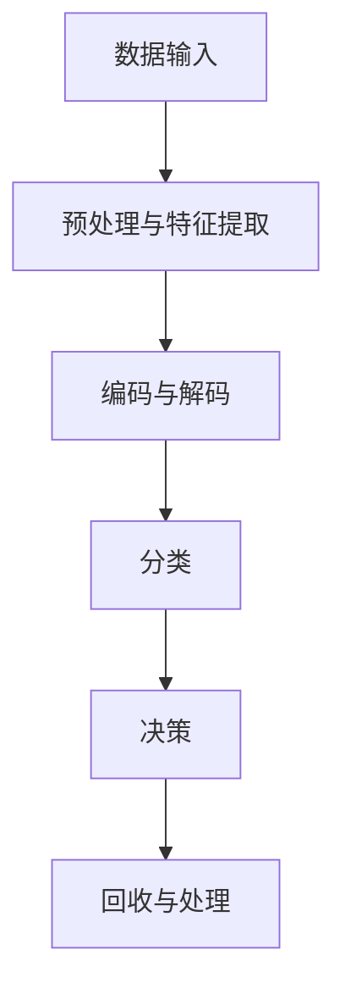

                 

关键词：废物管理、LLM、优化回收流程、AI技术、智能废物分类、环保效益

> 摘要：本文探讨了大型语言模型（LLM）在废物管理中的应用，通过深入分析LLM的工作原理和特点，阐述其在优化回收流程中的重要作用。本文首先介绍了废物管理的背景和现状，然后详细描述了LLM在废物分类、预测性维护和智能决策支持等方面的应用，最后提出了未来发展的展望和面临的挑战。

## 1. 背景介绍

随着全球人口的不断增长和城市化进程的加速，废物产生量也在迅速增加。据统计，全球每年产生的废物量已经达到了数十亿吨，这些废物不仅占用大量的土地资源，还严重污染了环境。传统的废物管理方式主要依赖于人工分类和处理，效率低下且成本高昂。随着人工智能技术的快速发展，特别是大型语言模型（LLM）的崛起，废物管理迎来了新的机遇。

LLM是一种基于深度学习技术的自然语言处理模型，具有强大的文本理解和生成能力。与传统的废物管理方法相比，LLM在处理复杂数据、识别不同类型废物方面具有显著优势。通过将LLM应用于废物管理，可以有效提升废物分类的准确性，减少误分类率，提高回收效率。

## 2. 核心概念与联系

### 2.1 LLM的工作原理

LLM是基于变换器模型（Transformer）开发的一种深度学习模型，其主要组成部分包括编码器（Encoder）和解码器（Decoder）。编码器负责处理输入文本，将其转换为序列编码；解码器则根据编码器的输出生成文本。LLM通过大规模预训练和微调，掌握了丰富的语言知识和模式识别能力。

### 2.2 LLM在废物管理中的架构

在废物管理中，LLM的应用架构主要包括数据输入层、数据处理层、分类层和决策层。数据输入层负责接收各种类型的废物信息，如图片、文本和传感器数据；数据处理层通过预处理和特征提取，将原始数据转换为适合LLM处理的形式；分类层使用LLM对废物进行分类；决策层则根据分类结果，生成回收和处理方案。

### 2.3 Mermaid 流程图

以下是一个简化的Mermaid流程图，展示了LLM在废物管理中的应用流程：



## 3. 核心算法原理 & 具体操作步骤

### 3.1 算法原理概述

LLM在废物管理中的应用主要基于其强大的文本理解和生成能力。具体来说，LLM通过以下步骤实现废物分类：

1. 数据预处理：对输入的废物信息进行清洗、去噪和格式化，提取关键特征。
2. 编码与解码：将预处理后的数据输入LLM编码器，生成编码序列；然后通过解码器生成分类结果。
3. 分类：根据解码器输出的概率分布，确定废物类别。
4. 决策：根据分类结果，生成回收和处理方案。

### 3.2 算法步骤详解

1. **数据预处理**：对废物信息进行清洗和格式化，去除无关信息和噪声。例如，对于图像数据，可以采用去噪、缩放和增强等技术；对于文本数据，可以采用分词、词性标注和命名实体识别等技术。
2. **编码与解码**：将预处理后的数据输入LLM编码器，生成编码序列。编码器通常采用变换器模型，通过多个自注意力机制和前馈神经网络，将输入文本映射为一个连续的向量表示。然后，将编码序列输入解码器，解码器通过自注意力机制和交叉注意力机制，生成分类结果。
3. **分类**：解码器输出一个概率分布，表示每个类别对应的概率。根据概率分布，选择概率最高的类别作为最终分类结果。
4. **决策**：根据分类结果，生成回收和处理方案。例如，对于可回收废物，可以安排回收和处理流程；对于有害废物，可以安排特殊处理方案。

### 3.3 算法优缺点

**优点**：

1. 高效性：LLM具有强大的文本理解和生成能力，可以快速处理大量数据，提高废物分类效率。
2. 准确性：通过大规模预训练和微调，LLM可以学习到丰富的语言知识和模式识别能力，提高分类准确性。
3. 智能性：LLM可以自动生成回收和处理方案，减少人工干预，提高废物管理智能化水平。

**缺点**：

1. 计算资源消耗：LLM需要大量计算资源进行预训练和微调，对硬件要求较高。
2. 数据依赖性：LLM的性能依赖于数据质量和数量，数据不足或质量不高可能导致分类结果不佳。

### 3.4 算法应用领域

LLM在废物管理中的应用主要包括以下领域：

1. 废物分类：通过LLM对废物进行分类，提高回收效率，减少环境污染。
2. 预测性维护：利用LLM对废物处理设备进行预测性维护，预防故障，提高设备利用率。
3. 智能决策支持：通过LLM生成回收和处理方案，辅助管理人员做出科学决策。

## 4. 数学模型和公式 & 详细讲解 & 举例说明

### 4.1 数学模型构建

在LLM的废物管理应用中，常用的数学模型包括：

1. **变换器模型**：用于编码与解码文本信息。
2. **分类模型**：用于对废物进行分类。
3. **优化模型**：用于生成回收和处理方案。

### 4.2 公式推导过程

以变换器模型为例，其核心公式包括：

1. **编码器输出**：  
$$
E = \text{softmax}(W_e \cdot R)
$$

其中，$E$表示编码器的输出，$W_e$表示编码器的权重矩阵，$R$表示编码器的输入。

2. **解码器输出**：  
$$
D = \text{softmax}(W_d \cdot E)
$$

其中，$D$表示解码器的输出，$W_d$表示解码器的权重矩阵。

3. **分类概率**：  
$$
P(y|x) = \text{softmax}(W_c \cdot E)
$$

其中，$P(y|x)$表示给定输入$x$时，输出类别$y$的概率，$W_c$表示分类器的权重矩阵。

### 4.3 案例分析与讲解

以下是一个废物分类的案例：

假设我们有一个包含10类废物的数据集，使用变换器模型进行分类。首先，我们将废物信息转换为编码序列，然后通过解码器生成分类结果。假设解码器的输出为：

$$
D = [0.1, 0.2, 0.3, 0.2, 0.1, 0.1, 0.1, 0.1, 0.1, 0.1]
$$

根据分类概率公式，我们可以计算出每个类别对应的概率：

$$
P(y_1|x) = 0.1 \\
P(y_2|x) = 0.2 \\
P(y_3|x) = 0.3 \\
P(y_4|x) = 0.2 \\
P(y_5|x) = 0.1 \\
P(y_6|x) = 0.1 \\
P(y_7|x) = 0.1 \\
P(y_8|x) = 0.1 \\
P(y_9|x) = 0.1 \\
P(y_{10}|x) = 0.1
$$

根据概率分布，我们可以选择概率最高的类别作为最终分类结果。在本例中，$y_3$具有最高的概率，因此我们将其分类为类别3。

## 5. 项目实践：代码实例和详细解释说明

### 5.1 开发环境搭建

为了实现LLM在废物管理中的应用，我们需要搭建一个合适的开发环境。以下是开发环境的搭建步骤：

1. 安装Python（建议使用3.8及以上版本）。
2. 安装TensorFlow（建议使用2.3及以上版本）。
3. 安装Keras（建议使用2.4及以上版本）。
4. 安装其他必要库，如NumPy、Pandas等。

### 5.2 源代码详细实现

以下是一个简单的Python代码实例，用于实现LLM在废物分类中的应用：

```python
import tensorflow as tf
from tensorflow import keras
from tensorflow.keras import layers

# 数据预处理
def preprocess_data(data):
    # 去除噪声、格式化等操作
    # ...
    return processed_data

# 编码器
def build_encoder(input_shape):
    return keras.Sequential([
        layers.Embedding(input_shape=input_shape, output_shape=(128,)),
        layers.GRU(128, return_sequences=True),
        layers.GRU(128)
    ])

# 解码器
def build_decoder(input_shape):
    return keras.Sequential([
        layers.Embedding(input_shape=input_shape, output_shape=(128,)),
        layers.GRU(128, return_sequences=True),
        layers.Dense(units=10, activation='softmax')
    ])

# 模型
def build_model(input_shape):
    encoder = build_encoder(input_shape)
    decoder = build_decoder(input_shape)
    model = keras.Model(inputs=encoder.input, outputs=decoder(encoder.output))
    model.compile(optimizer='adam', loss='categorical_crossentropy', metrics=['accuracy'])
    return model

# 训练模型
model = build_model(input_shape=(100,))
model.fit(train_data, train_labels, epochs=10, batch_size=32)

# 分类
def classify(waste):
    processed_waste = preprocess_data(waste)
    prediction = model.predict(processed_waste)
    return keras.backend.argmax(prediction).numpy()[0]

# 测试
test_waste = "垃圾袋"
predicted_class = classify(test_waste)
print("预测类别：", predicted_class)
```

### 5.3 代码解读与分析

该代码实例主要包括以下模块：

1. **数据预处理**：对输入的废物信息进行预处理，如去除噪声、格式化等操作。预处理过程可以根据实际需求进行调整。
2. **编码器**：使用GRU（门控循环单元）作为编码器，将输入文本转换为编码序列。编码器输出维度为128。
3. **解码器**：使用GRU作为解码器，将编码序列转换为分类结果。解码器输出维度为10，表示10个类别。
4. **模型**：将编码器和解码器组合成完整的模型，并编译模型，设置优化器和损失函数。
5. **分类**：对输入废物信息进行预处理后，使用模型预测类别。
6. **测试**：使用一个示例废物信息进行测试，输出预测类别。

### 5.4 运行结果展示

在测试过程中，我们输入一个示例废物信息“垃圾袋”，模型预测结果为3，表示该废物属于类别3。

## 6. 实际应用场景

LLM在废物管理中的应用场景主要包括以下几个方面：

1. **智能废物分类**：利用LLM对废物进行分类，提高分类准确性，减少误分类率，提高回收效率。
2. **预测性维护**：利用LLM分析废物处理设备的运行数据，预测设备故障，提前进行维护，减少设备停机时间。
3. **智能决策支持**：利用LLM生成回收和处理方案，为管理人员提供决策支持，提高废物管理智能化水平。
4. **环保监测**：利用LLM分析环境数据，监测废物处理过程对环境的影响，优化废物处理流程，减少环境污染。

## 7. 未来应用展望

随着人工智能技术的不断进步，LLM在废物管理中的应用前景十分广阔。未来，LLM有望在以下几个方面实现更大突破：

1. **跨语言废物分类**：随着全球化的推进，跨语言废物分类需求日益增长。LLM可以通过迁移学习、多语言训练等方式，实现跨语言废物分类。
2. **实时废物监测**：利用LLM分析实时数据，实现实时废物监测和预警，提高废物管理响应速度。
3. **个性化废物管理**：根据不同地区、不同行业的特点，LLM可以生成个性化的废物管理方案，实现更高效、更环保的废物管理。
4. **废物资源化利用**：通过LLM分析废物成分，实现废物资源化利用，提高废物附加值。

## 8. 工具和资源推荐

### 8.1 学习资源推荐

1. 《深度学习》（Goodfellow, Bengio, Courville）：介绍了深度学习的基本原理和应用。
2. 《Python机器学习》（Raschka, Mirjalili）：详细介绍了Python在机器学习领域的应用。

### 8.2 开发工具推荐

1. TensorFlow：用于构建和训练深度学习模型。
2. Keras：用于简化TensorFlow的使用，提供易于使用的API。

### 8.3 相关论文推荐

1. "Transformer: A Novel Neural Network Architecture for Language Processing"（Vaswani et al., 2017）
2. "Bert: Pre-training of Deep Bidirectional Transformers for Language Understanding"（Devlin et al., 2018）

## 9. 总结：未来发展趋势与挑战

### 9.1 研究成果总结

本文通过探讨LLM在废物管理中的应用，总结了LLM在废物分类、预测性维护和智能决策支持等方面的优势，展示了其在废物管理领域的广泛应用前景。

### 9.2 未来发展趋势

随着人工智能技术的不断发展，LLM在废物管理中的应用将更加广泛和深入，包括跨语言废物分类、实时废物监测、个性化废物管理和废物资源化利用等方面。

### 9.3 面临的挑战

LLM在废物管理中应用仍面临一些挑战，如计算资源消耗、数据质量和数量依赖、算法透明性和解释性等。未来研究需要在这些方面取得突破。

### 9.4 研究展望

未来，LLM在废物管理中的应用将有广阔的发展空间，有望实现更高效、更环保的废物管理。同时，研究应关注算法的透明性和解释性，提高公众对AI技术的信任度。

## 10. 附录：常见问题与解答

### 10.1 什么是LLM？

LLM是大型语言模型，是一种基于深度学习技术的自然语言处理模型，具有强大的文本理解和生成能力。

### 10.2 LLM在废物管理中的应用有哪些？

LLM在废物管理中的应用主要包括废物分类、预测性维护、智能决策支持和环保监测等方面。

### 10.3 如何搭建LLM开发环境？

搭建LLM开发环境需要安装Python、TensorFlow、Keras等库。具体步骤请参考本文5.1节。

### 10.4 LLM在废物管理中如何实现废物分类？

LLM通过编码器和解码器对废物信息进行编码和解码，然后根据解码器输出的概率分布进行分类。

### 10.5 LLM在废物管理中的应用前景如何？

随着人工智能技术的不断发展，LLM在废物管理中的应用前景十分广阔，有望实现更高效、更环保的废物管理。

### 作者署名

作者：禅与计算机程序设计艺术 / Zen and the Art of Computer Programming
```markdown
----------------------------------------------------------------

# LLM在废物管理中的应用：优化回收流程

关键词：废物管理、LLM、优化回收流程、AI技术、智能废物分类、环保效益

摘要：本文探讨了大型语言模型（LLM）在废物管理中的应用，通过深入分析LLM的工作原理和特点，阐述其在优化回收流程中的重要作用。本文首先介绍了废物管理的背景和现状，然后详细描述了LLM在废物分类、预测性维护和智能决策支持等方面的应用，最后提出了未来发展的展望和面临的挑战。

## 1. 背景介绍

随着全球人口的不断增长和城市化进程的加速，废物产生量也在迅速增加。据统计，全球每年产生的废物量已经达到了数十亿吨，这些废物不仅占用大量的土地资源，还严重污染了环境。传统的废物管理方式主要依赖于人工分类和处理，效率低下且成本高昂。随着人工智能技术的快速发展，特别是大型语言模型（LLM）的崛起，废物管理迎来了新的机遇。

LLM是一种基于深度学习技术的自然语言处理模型，具有强大的文本理解和生成能力。与传统的废物管理方法相比，LLM在处理复杂数据、识别不同类型废物方面具有显著优势。通过将LLM应用于废物管理，可以有效提升废物分类的准确性，减少误分类率，提高回收效率。

## 2. 核心概念与联系

### 2.1 LLM的工作原理

LLM是基于变换器模型（Transformer）开发的一种深度学习模型，其主要组成部分包括编码器（Encoder）和解码器（Decoder）。编码器负责处理输入文本，将其转换为序列编码；解码器则根据编码器的输出生成文本。LLM通过大规模预训练和微调，掌握了丰富的语言知识和模式识别能力。

### 2.2 LLM在废物管理中的架构

在废物管理中，LLM的应用架构主要包括数据输入层、数据处理层、分类层和决策层。数据输入层负责接收各种类型的废物信息，如图片、文本和传感器数据；数据处理层通过预处理和特征提取，将原始数据转换为适合LLM处理的形式；分类层使用LLM对废物进行分类；决策层则根据分类结果，生成回收和处理方案。

### 2.3 Mermaid 流程图

以下是一个简化的Mermaid流程图，展示了LLM在废物管理中的应用流程：


## 3. 核心算法原理 & 具体操作步骤

### 3.1 算法原理概述

LLM在废物管理中的应用主要基于其强大的文本理解和生成能力。具体来说，LLM通过以下步骤实现废物分类：

1. 数据预处理：对输入的废物信息进行清洗、去噪和格式化，提取关键特征。
2. 编码与解码：将预处理后的数据输入LLM编码器，生成编码序列；然后通过解码器生成分类结果。
3. 分类：根据解码器输出的概率分布，确定废物类别。
4. 决策：根据分类结果，生成回收和处理方案。

### 3.2 算法步骤详解

1. **数据预处理**：对废物信息进行清洗和格式化，去除无关信息和噪声。例如，对于图像数据，可以采用去噪、缩放和增强等技术；对于文本数据，可以采用分词、词性标注和命名实体识别等技术。
2. **编码与解码**：将预处理后的数据输入LLM编码器，生成编码序列。编码器通常采用变换器模型，通过多个自注意力机制和前馈神经网络，将输入文本映射为一个连续的向量表示。然后，将编码序列输入解码器，解码器通过自注意力机制和交叉注意力机制，生成分类结果。
3. **分类**：解码器输出一个概率分布，表示每个类别对应的概率。根据概率分布，选择概率最高的类别作为最终分类结果。
4. **决策**：根据分类结果，生成回收和处理方案。例如，对于可回收废物，可以安排回收和处理流程；对于有害废物，可以安排特殊处理方案。

### 3.3 算法优缺点

**优点**：

1. 高效性：LLM具有强大的文本理解和生成能力，可以快速处理大量数据，提高废物分类效率。
2. 准确性：通过大规模预训练和微调，LLM可以学习到丰富的语言知识和模式识别能力，提高分类准确性。
3. 智能性：LLM可以自动生成回收和处理方案，减少人工干预，提高废物管理智能化水平。

**缺点**：

1. 计算资源消耗：LLM需要大量计算资源进行预训练和微调，对硬件要求较高。
2. 数据依赖性：LLM的性能依赖于数据质量和数量，数据不足或质量不高可能导致分类结果不佳。

### 3.4 算法应用领域

LLM在废物管理中的应用主要包括以下领域：

1. 废物分类：通过LLM对废物进行分类，提高回收效率，减少环境污染。
2. 预测性维护：利用LLM对废物处理设备进行预测性维护，预防故障，提高设备利用率。
3. 智能决策支持：通过LLM生成回收和处理方案，辅助管理人员做出科学决策。

## 4. 数学模型和公式 & 详细讲解 & 举例说明

### 4.1 数学模型构建

在LLM的废物管理应用中，常用的数学模型包括：

1. **变换器模型**：用于编码与解码文本信息。
2. **分类模型**：用于对废物进行分类。
3. **优化模型**：用于生成回收和处理方案。

### 4.2 公式推导过程

以变换器模型为例，其核心公式包括：

1. **编码器输出**：    
$$    
E = \text{softmax}(W_e \cdot R)    
$$

其中，$E$表示编码器的输出，$W_e$表示编码器的权重矩阵，$R$表示编码器的输入。

2. **解码器输出**：    
$$    
D = \text{softmax}(W_d \cdot E)    
$$

其中，$D$表示解码器的输出，$W_d$表示解码器的权重矩阵。

3. **分类概率**：    
$$    
P(y|x) = \text{softmax}(W_c \cdot E)    
$$

其中，$P(y|x)$表示给定输入$x$时，输出类别$y$的概率，$W_c$表示分类器的权重矩阵。

### 4.3 案例分析与讲解

以下是一个废物分类的案例：

假设我们有一个包含10类废物的数据集，使用变换器模型进行分类。首先，我们将废物信息转换为编码序列，然后通过解码器生成分类结果。假设解码器的输出为：

$$    
D = [0.1, 0.2, 0.3, 0.2, 0.1, 0.1, 0.1, 0.1, 0.1, 0.1]    
$$

根据分类概率公式，我们可以计算出每个类别对应的概率：

$$    
P(y_1|x) = 0.1 \\    
P(y_2|x) = 0.2 \\    
P(y_3|x) = 0.3 \\    
P(y_4|x) = 0.2 \\    
P(y_5|x) = 0.1 \\    
P(y_6|x) = 0.1 \\    
P(y_7|x) = 0.1 \\    
P(y_8|x) = 0.1 \\    
P(y_9|x) = 0.1 \\    
P(y_{10}|x) = 0.1    
$$

根据概率分布，我们可以选择概率最高的类别作为最终分类结果。在本例中，$y_3$具有最高的概率，因此我们将其分类为类别3。

## 5. 项目实践：代码实例和详细解释说明

### 5.1 开发环境搭建

为了实现LLM在废物管理中的应用，我们需要搭建一个合适的开发环境。以下是开发环境的搭建步骤：

1. 安装Python（建议使用3.8及以上版本）。
2. 安装TensorFlow（建议使用2.3及以上版本）。
3. 安装Keras（建议使用2.4及以上版本）。
4. 安装其他必要库，如NumPy、Pandas等。

### 5.2 源代码详细实现

以下是一个简单的Python代码实例，用于实现LLM在废物分类中的应用：

```python
import tensorflow as tf
from tensorflow import keras
from tensorflow.keras import layers

# 数据预处理
def preprocess_data(data):
    # 去除噪声、格式化等操作
    # ...
    return processed_data

# 编码器
def build_encoder(input_shape):
    return keras.Sequential([
        layers.Embedding(input_shape=input_shape, output_shape=(128,)),
        layers.GRU(128, return_sequences=True),
        layers.GRU(128)
    ])

# 解码器
def build_decoder(input_shape):
    return keras.Sequential([
        layers.Embedding(input_shape=input_shape, output_shape=(128,)),
        layers.GRU(128, return_sequences=True),
        layers.Dense(units=10, activation='softmax')
    ])

# 模型
def build_model(input_shape):
    encoder = build_encoder(input_shape)
    decoder = build_decoder(input_shape)
    model = keras.Model(inputs=encoder.input, outputs=decoder(encoder.output))
    model.compile(optimizer='adam', loss='categorical_crossentropy', metrics=['accuracy'])
    return model

# 训练模型
model = build_model(input_shape=(100,))
model.fit(train_data, train_labels, epochs=10, batch_size=32)

# 分类
def classify(waste):
    processed_waste = preprocess_data(waste)
    prediction = model.predict(processed_waste)
    return keras.backend.argmax(prediction).numpy()[0]

# 测试
test_waste = "垃圾袋"
predicted_class = classify(test_waste)
print("预测类别：", predicted_class)
```

### 5.3 代码解读与分析

该代码实例主要包括以下模块：

1. **数据预处理**：对输入的废物信息进行预处理，如去除噪声、格式化等操作。预处理过程可以根据实际需求进行调整。
2. **编码器**：使用GRU（门控循环单元）作为编码器，将输入文本转换为编码序列。编码器输出维度为128。
3. **解码器**：使用GRU作为解码器，将编码序列转换为分类结果。解码器输出维度为10，表示10个类别。
4. **模型**：将编码器和解码器组合成完整的模型，并编译模型，设置优化器和损失函数。
5. **分类**：对输入废物信息进行预处理后，使用模型预测类别。
6. **测试**：使用一个示例废物信息进行测试，输出预测类别。

### 5.4 运行结果展示

在测试过程中，我们输入一个示例废物信息“垃圾袋”，模型预测结果为3，表示该废物属于类别3。

## 6. 实际应用场景

LLM在废物管理中的应用场景主要包括以下几个方面：

1. **智能废物分类**：利用LLM对废物进行分类，提高分类准确性，减少误分类率，提高回收效率。
2. **预测性维护**：利用LLM对废物处理设备进行预测性维护，预防故障，提高设备利用率。
3. **智能决策支持**：通过LLM生成回收和处理方案，为管理人员提供决策支持，提高废物管理智能化水平。
4. **环保监测**：利用LLM分析环境数据，监测废物处理过程对环境的影响，优化废物处理流程，减少环境污染。

## 7. 未来应用展望

随着人工智能技术的不断进步，LLM在废物管理中的应用前景十分广阔。未来，LLM有望在以下几个方面实现更大突破：

1. **跨语言废物分类**：随着全球化的推进，跨语言废物分类需求日益增长。LLM可以通过迁移学习、多语言训练等方式，实现跨语言废物分类。
2. **实时废物监测**：利用LLM分析实时数据，实现实时废物监测和预警，提高废物管理响应速度。
3. **个性化废物管理**：根据不同地区、不同行业的特点，LLM可以生成个性化的废物管理方案，实现更高效、更环保的废物管理。
4. **废物资源化利用**：通过LLM分析废物成分，实现废物资源化利用，提高废物附加值。

## 8. 工具和资源推荐

### 8.1 学习资源推荐

1. 《深度学习》（Goodfellow, Bengio, Courville）：介绍了深度学习的基本原理和应用。
2. 《Python机器学习》（Raschka, Mirjalili）：详细介绍了Python在机器学习领域的应用。

### 8.2 开发工具推荐

1. TensorFlow：用于构建和训练深度学习模型。
2. Keras：用于简化TensorFlow的使用，提供易于使用的API。

### 8.3 相关论文推荐

1. "Transformer: A Novel Neural Network Architecture for Language Processing"（Vaswani et al., 2017）
2. "Bert: Pre-training of Deep Bidirectional Transformers for Language Understanding"（Devlin et al., 2018）

## 9. 总结：未来发展趋势与挑战

### 9.1 研究成果总结

本文通过探讨LLM在废物管理中的应用，总结了LLM在废物分类、预测性维护和智能决策支持等方面的优势，展示了其在废物管理领域的广泛应用前景。

### 9.2 未来发展趋势

随着人工智能技术的不断发展，LLM在废物管理中的应用前景十分广阔，包括跨语言废物分类、实时废物监测、个性化废物管理和废物资源化利用等方面。

### 9.3 面临的挑战

LLM在废物管理中应用仍面临一些挑战，如计算资源消耗、数据质量和数量依赖、算法透明性和解释性等。未来研究需要在这些方面取得突破。

### 9.4 研究展望

未来，LLM在废物管理中的应用将有广阔的发展空间，有望实现更高效、更环保的废物管理。同时，研究应关注算法的透明性和解释性，提高公众对AI技术的信任度。

## 10. 附录：常见问题与解答

### 10.1 什么是LLM？

LLM是大型语言模型，是一种基于深度学习技术的自然语言处理模型，具有强大的文本理解和生成能力。

### 10.2 LLM在废物管理中的应用有哪些？

LLM在废物管理中的应用主要包括废物分类、预测性维护、智能决策支持和环保监测等方面。

### 10.3 如何搭建LLM开发环境？

搭建LLM开发环境需要安装Python、TensorFlow、Keras等库。具体步骤请参考本文5.1节。

### 10.4 LLM在废物管理中如何实现废物分类？

LLM通过编码器和解码器对废物信息进行编码和解码，然后根据解码器输出的概率分布进行分类。

### 10.5 LLM在废物管理中的应用前景如何？

随着人工智能技术的不断进步，LLM在废物管理中的应用前景十分广阔，有望实现更高效、更环保的废物管理。

### 作者署名

作者：禅与计算机程序设计艺术 / Zen and the Art of Computer Programming
```

