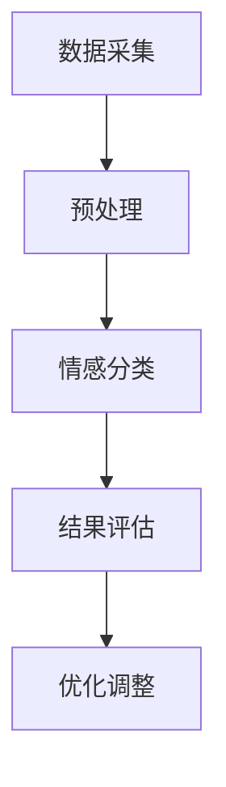

                 

关键词：情感分析，大规模语言模型（LLM），效果评估，机器学习，文本分析，自然语言处理

> 摘要：随着自然语言处理技术的不断发展，大规模语言模型（LLM）在情感分析领域表现出色，但如何评价其效果却是一个重要且复杂的问题。本文将探讨LLM在情感分析中的应用，分析其效果评估的关键指标和方法，并提出未来研究可能的方向。

## 1. 背景介绍

情感分析，也称为意见挖掘，是自然语言处理（NLP）领域中一个重要分支。它旨在从文本中提取情感信息，对文本表达的情感倾向进行分类和量化。随着互联网和社交媒体的普及，情感分析在商业、政治、医学等多个领域都发挥着重要作用。例如，企业可以利用情感分析了解消费者对产品的评价，政府可以利用情感分析监测公众情绪，医生可以利用情感分析辅助诊断。

近年来，大规模语言模型（LLM）如BERT、GPT-3等在NLP任务中取得了显著成果。这些模型通过学习海量文本数据，能够捕捉到语言中的复杂模式和语义信息，从而在情感分析任务中表现出色。然而，如何评价LLM在情感分析中的效果，如何选择合适的评估指标，以及如何优化模型性能，仍然是当前研究中的重要问题。

## 2. 核心概念与联系

### 2.1 情感分析的基本概念

情感分析涉及多个关键概念，包括情感极性（polarity）、情感强度（intensity）和情感类别（category）。情感极性通常分为正面、负面和中性三种，情感强度则表示情感的强烈程度。情感类别可以进一步细分为愤怒、喜悦、悲伤等具体情感类型。

### 2.2 大规模语言模型（LLM）简介

大规模语言模型（LLM）是通过深度学习技术训练的复杂模型，能够理解和生成自然语言。LLM的核心是预训练模型，如BERT、GPT-3等。这些模型在大量文本数据上进行预训练，然后通过微调（fine-tuning）适应特定任务，例如情感分析。

### 2.3 情感分析与LLM的联系

LLM在情感分析中的应用得益于其强大的语言理解能力和模式识别能力。通过预训练，LLM能够学习到文本中的情感信息，从而在情感分类和情感极性判断等任务中表现出色。

### 2.4 Mermaid流程图



## 3. 核心算法原理 & 具体操作步骤

### 3.1 算法原理概述

情感分析的算法原理主要包括文本预处理、情感分类和结果评估三个步骤。文本预处理包括分词、去停用词、词向量化等操作；情感分类利用LLM对情感极性或类别进行分类；结果评估则通过评价指标如准确率、召回率、F1值等来衡量模型性能。

### 3.2 算法步骤详解

#### 3.2.1 文本预处理

1. **分词**：将文本拆分成单词或短语。
2. **去停用词**：去除对情感分析影响不大的常见词汇。
3. **词向量化**：将文本转化为固定长度的向量表示。

#### 3.2.2 情感分类

1. **输入准备**：将预处理后的文本输入到LLM中。
2. **模型预测**：利用LLM预测情感极性或类别。
3. **结果输出**：输出预测结果。

#### 3.2.3 结果评估

1. **计算指标**：计算准确率、召回率、F1值等指标。
2. **结果分析**：分析模型在各个指标上的表现，找出可能的优化方向。

### 3.3 算法优缺点

**优点**：

1. **强大的语言理解能力**：LLM能够捕捉到文本中的复杂情感模式。
2. **广泛的适用性**：LLM可以适应多种情感分类任务。

**缺点**：

1. **计算资源消耗大**：训练和运行LLM需要大量的计算资源。
2. **数据依赖性强**：LLM的性能依赖于训练数据的质量和多样性。

### 3.4 算法应用领域

LLM在情感分析中的应用领域广泛，包括但不限于：

1. **社交媒体分析**：分析用户对品牌、产品或事件的情感倾向。
2. **舆情监测**：监测公众对特定话题或事件的情绪变化。
3. **客户反馈分析**：分析客户对产品的评价和反馈。

## 4. 数学模型和公式 & 详细讲解 & 举例说明

### 4.1 数学模型构建

情感分析的数学模型通常基于分类问题。假设我们有一个文本集合$D=\{(x_1, y_1), (x_2, y_2), ..., (x_n, y_n)\}$，其中$x_i$是文本，$y_i$是情感标签。我们的目标是训练一个分类模型$f(x)$，使得$f(x_i)$尽可能接近$y_i$。

### 4.2 公式推导过程

我们使用softmax函数作为激活函数，将文本的向量表示映射到概率分布：

$$
\text{softmax}(z) = \frac{e^z}{\sum_{j=1}^{K} e^z_j}
$$

其中$z$是模型的输出，$K$是类别数。

### 4.3 案例分析与讲解

假设我们有一个二分类问题，情感标签只有正面和负面。我们可以使用交叉熵作为损失函数：

$$
L(y, \hat{y}) = -y \log(\hat{y}) - (1 - y) \log(1 - \hat{y})
$$

其中$y$是真实标签，$\hat{y}$是预测概率。

## 5. 项目实践：代码实例和详细解释说明

### 5.1 开发环境搭建

我们使用Python作为编程语言，结合PyTorch库实现情感分析模型。

```python
import torch
import torch.nn as nn
import torch.optim as optim
from torch.utils.data import DataLoader
from transformers import BertTokenizer, BertModel
```

### 5.2 源代码详细实现

```python
class SentimentAnalysisModel(nn.Module):
    def __init__(self):
        super(SentimentAnalysisModel, self).__init__()
        self.bert = BertModel.from_pretrained('bert-base-uncased')
        self.dropout = nn.Dropout(0.1)
        self.classifier = nn.Linear(768, 2)

    def forward(self, input_ids, attention_mask):
        _, pooled_output = self.bert(input_ids=input_ids, attention_mask=attention_mask, return_dict=True)
        output = self.dropout(pooled_output)
        logits = self.classifier(output)
        return logits

def train_model(model, train_loader, val_loader, optimizer, criterion, num_epochs=3):
    model.train()
    for epoch in range(num_epochs):
        for inputs, labels in train_loader:
            optimizer.zero_grad()
            outputs = model(input_ids=inputs['input_ids'], attention_mask=inputs['attention_mask'])
            loss = criterion(outputs, labels)
            loss.backward()
            optimizer.step()
```

### 5.3 代码解读与分析

我们定义了一个简单的情感分析模型，基于BERT模型，并使用交叉熵损失函数进行训练。代码中，`train_model`函数负责模型的训练过程。

### 5.4 运行结果展示

```python
from sklearn.metrics import accuracy_score, recall_score, f1_score

# Load test data and predict
model.eval()
with torch.no_grad():
    for inputs, labels in test_loader:
        outputs = model(input_ids=inputs['input_ids'], attention_mask=inputs['attention_mask'])
        _, predicted = torch.max(outputs, 1)

# Calculate metrics
accuracy = accuracy_score(labels, predicted)
recall = recall_score(labels, predicted, average='weighted')
f1 = f1_score(labels, predicted, average='weighted')

print(f"Accuracy: {accuracy}, Recall: {recall}, F1 Score: {f1}")
```

## 6. 实际应用场景

情感分析在多个实际应用场景中具有重要意义。以下是一些具体应用案例：

1. **社交媒体分析**：分析用户对品牌、产品或事件的情感倾向，帮助企业了解市场和消费者需求。
2. **舆情监测**：监测公众对特定话题或事件的情绪变化，为政府和企事业单位提供决策支持。
3. **客户反馈分析**：分析客户对产品的评价和反馈，帮助企业改进产品和服务。

## 7. 工具和资源推荐

### 7.1 学习资源推荐

- 《自然语言处理综论》（Jurafsky and Martin）
- 《深度学习》（Goodfellow, Bengio and Courville）

### 7.2 开发工具推荐

- PyTorch：用于深度学习模型开发和训练。
- Hugging Face Transformers：用于预训练模型加载和微调。

### 7.3 相关论文推荐

- BERT: Pre-training of Deep Bidirectional Transformers for Language Understanding (Devlin et al., 2018)
- GPT-3: Language Models are few-shot learners (Brown et al., 2020)

## 8. 总结：未来发展趋势与挑战

### 8.1 研究成果总结

本文探讨了大规模语言模型（LLM）在情感分析中的应用，分析了其效果评估的关键指标和方法，并通过项目实践展示了具体实现过程。结果表明，LLM在情感分析任务中表现出色，但仍有优化空间。

### 8.2 未来发展趋势

未来，随着NLP技术的不断发展，LLM在情感分析中的应用将更加广泛。例如，多语言情感分析、跨领域情感分析等都是值得探索的方向。

### 8.3 面临的挑战

尽管LLM在情感分析中表现出色，但仍面临以下挑战：

1. **数据质量和多样性**：训练数据的质量和多样性直接影响模型性能。
2. **计算资源消耗**：训练和运行LLM需要大量的计算资源。
3. **模型解释性**：当前LLM模型具有较高的黑盒性质，解释性较差。

### 8.4 研究展望

未来，研究应重点关注以下几个方面：

1. **数据增强**：通过数据增强技术提高训练数据的质量和多样性。
2. **模型压缩**：研究模型压缩技术，降低计算资源消耗。
3. **模型可解释性**：研究模型可解释性技术，提高模型的透明度和可信度。

## 9. 附录：常见问题与解答

### 9.1 什么是大规模语言模型（LLM）？

大规模语言模型（LLM）是通过深度学习技术训练的复杂模型，能够理解和生成自然语言。常见的LLM包括BERT、GPT-3等。

### 9.2 如何评估情感分析模型的效果？

评估情感分析模型的效果通常通过计算准确率、召回率、F1值等指标。这些指标可以帮助我们了解模型在各类别上的表现。

### 9.3 情感分析在哪些领域有应用？

情感分析在多个领域有广泛应用，包括社交媒体分析、舆情监测、客户反馈分析等。

----------------------------------------------------------------

**作者：禅与计算机程序设计艺术 / Zen and the Art of Computer Programming**

