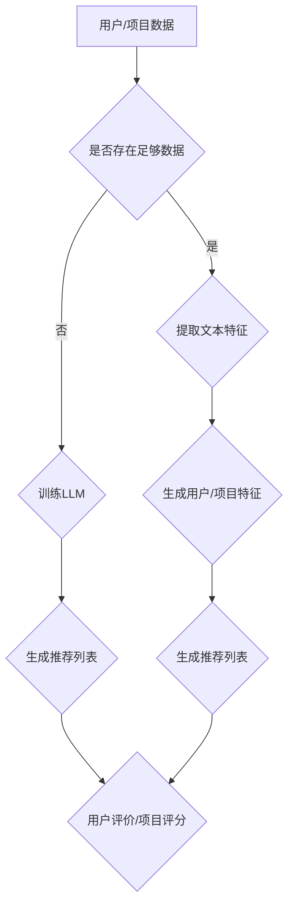

                 

关键词：大语言模型（LLM），推荐系统，冷启动，多场景任务，算法原理，数学模型，项目实践，应用场景，未来展望。

## 摘要

本文旨在探讨大语言模型（LLM）在推荐系统冷启动和多场景任务中的应用。首先，我们介绍了推荐系统的基本概念和挑战，特别是冷启动问题。随后，我们详细阐述了LLM的工作原理，包括其架构、训练过程和关键技术。接着，我们分析了LLM在推荐系统中的应用，特别是在处理冷启动和多场景任务方面的优势。本文还通过数学模型和公式详细解释了LLM的核心算法，并通过一个实际项目实例展示了LLM的应用效果。最后，我们对LLM的未来发展进行了展望，并提出了潜在的挑战和研究方向。

## 1. 背景介绍

### 推荐系统的基本概念

推荐系统是一种信息过滤技术，旨在向用户提供个性化推荐，帮助用户发现他们可能感兴趣的内容或商品。推荐系统的基本概念包括用户、项目、评分和推荐。用户是推荐系统的核心，他们的行为和偏好是推荐系统生成推荐的关键。项目是用户可能感兴趣的对象，如电影、音乐、商品等。评分是用户对项目的评价，可以是明文评分、点击、购买等。推荐则是推荐系统根据用户的历史行为和偏好生成的个性化推荐列表。

### 推荐系统的挑战

尽管推荐系统在很多领域取得了显著成功，但它们仍然面临着诸多挑战。其中，最显著的问题之一是冷启动问题。冷启动问题是指在用户和项目缺乏足够信息的情况下，推荐系统难以生成有效的推荐。这通常发生在新用户加入系统或新项目上线时。冷启动问题分为两类：用户冷启动和项目冷启动。

- **用户冷启动**：当新用户加入系统时，由于缺乏足够的历史行为数据，推荐系统难以生成个性化的推荐。
- **项目冷启动**：当新项目上线时，由于缺乏用户评价和互动数据，推荐系统难以评估项目的质量和用户偏好。

解决冷启动问题是推荐系统研究和应用的重要方向。传统的推荐系统方法通常依赖于用户和项目的特征，如用户画像、项目标签、内容特征等。然而，这些方法在处理冷启动问题时往往效果不佳，因为缺乏足够的信息。为此，近年来研究人员开始探索利用深度学习和自然语言处理（NLP）技术，尤其是大语言模型（LLM），来解决推荐系统的冷启动问题。

### 大语言模型（LLM）

大语言模型是一种基于深度学习的自然语言处理技术，它可以学习大量的文本数据，并生成高质量的自然语言文本。LLM的核心思想是通过训练大规模的语言模型，使其能够理解和生成自然语言。这些模型通常基于Transformer架构，如BERT、GPT等。LLM在自然语言处理任务中取得了显著的成果，包括机器翻译、文本生成、问答系统等。

LLM在推荐系统中的应用潜力在于其强大的文本理解和生成能力。通过训练LLM，我们可以从文本数据中提取丰富的语义信息，从而为推荐系统提供更有效的特征表示。此外，LLM可以自动处理冷启动问题，因为它可以从大量的文本数据中学习到通用知识和模式，即使对于新用户和新项目也是如此。

## 2. 核心概念与联系

### 大语言模型（LLM）的基本原理

LLM是一种基于深度学习的自然语言处理技术，其核心思想是通过训练大规模的语言模型，使其能够理解和生成自然语言。LLM通常基于Transformer架构，如BERT、GPT等。这些模型通过处理大量的文本数据，学习到语言的内在规律和语义信息。

#### Transformer架构

Transformer架构是一种基于自注意力机制的序列到序列模型。它由编码器和解码器两个部分组成，其中编码器将输入序列转换为上下文表示，解码器则根据上下文表示生成输出序列。

- **编码器**：编码器由多个自注意力层和前馈网络组成。自注意力层负责对输入序列进行加权聚合，从而生成上下文表示。前馈网络则对上下文表示进行进一步加工。
- **解码器**：解码器也由多个自注意力层和前馈网络组成。自注意力层负责对上下文表示进行加权聚合，解码器则根据上下文表示生成输出序列。

#### BERT和GPT

BERT（Bidirectional Encoder Representations from Transformers）和GPT（Generative Pre-trained Transformer）是两种经典的LLM架构。

- **BERT**：BERT是一种双向编码器，它通过训练大量文本数据，学习到上下文的语义信息。BERT在自然语言理解任务中取得了显著成果，如问答系统、文本分类等。
- **GPT**：GPT是一种生成式编码器，它通过训练大量文本数据，学习到文本的生成规律。GPT在自然语言生成任务中取得了显著成果，如文本生成、机器翻译等。

### 大语言模型在推荐系统中的应用

大语言模型在推荐系统中的应用主要集中在两个方面：文本理解和特征提取、生成式推荐。

#### 文本理解和特征提取

LLM可以从大量的文本数据中提取丰富的语义信息，从而为推荐系统提供更有效的特征表示。这些特征可以包括用户评论、项目描述、用户和项目的标签等。

- **用户评论**：通过训练LLM，我们可以从用户评论中提取关键信息，如用户情感、评论主题等。这些信息可以作为用户特征，用于推荐系统的用户冷启动问题。
- **项目描述**：通过训练LLM，我们可以从项目描述中提取关键信息，如项目类型、功能特点等。这些信息可以作为项目特征，用于推荐系统的项目冷启动问题。
- **用户和项目的标签**：LLM可以自动处理标签数据，从而生成更有效的标签特征。这些特征可以用于推荐系统的用户和项目冷启动问题。

#### 生成式推荐

生成式推荐是指利用LLM生成新的推荐列表，而不是依赖于用户历史行为和项目特征。这种推荐方法可以有效地处理冷启动问题，因为它可以从大量的文本数据中学习到通用知识和模式。

- **用户冷启动**：通过训练LLM，我们可以为新用户生成个性化的推荐列表。这些推荐列表基于新用户的历史行为和LLM从其他用户数据中提取的通用知识。
- **项目冷启动**：通过训练LLM，我们可以为新项目生成个性化的推荐列表。这些推荐列表基于新项目的描述和LLM从其他项目数据中提取的通用知识。

### Mermaid流程图

下面是一个描述大语言模型在推荐系统中应用的Mermaid流程图：



## 3. 核心算法原理 & 具体操作步骤

### 3.1 算法原理概述

大语言模型在推荐系统中的应用主要基于其强大的文本理解和生成能力。LLM通过训练大规模的文本数据，学习到语言的内在规律和语义信息。这些信息可以用于提取用户和项目的特征，并生成个性化的推荐列表。

### 3.2 算法步骤详解

#### 步骤1：数据收集与预处理

- **用户数据**：收集用户的历史行为数据，如浏览记录、点击记录、购买记录等。此外，还可以收集用户的个人信息，如年龄、性别、地理位置等。
- **项目数据**：收集项目的描述信息，如标题、标签、内容摘要等。此外，还可以收集项目的元数据，如发布时间、类型、类别等。
- **文本数据**：收集用户评论、项目评论等文本数据。

#### 步骤2：文本数据预处理

- **文本清洗**：去除停用词、标点符号、特殊字符等。
- **分词**：将文本数据分割成单词或短语。
- **词嵌入**：将文本数据转换为向量表示。

#### 步骤3：训练LLM

- **数据集划分**：将文本数据划分为训练集、验证集和测试集。
- **模型训练**：使用训练集训练LLM。训练过程中，LLM通过优化损失函数来学习文本数据的内在规律和语义信息。
- **模型验证**：使用验证集验证模型性能，调整模型参数。

#### 步骤4：提取特征

- **用户特征提取**：将用户的历史行为数据输入LLM，提取用户特征。
- **项目特征提取**：将项目的描述信息输入LLM，提取项目特征。

#### 步骤5：生成推荐列表

- **用户特征向量**：将新用户的特征向量输入LLM，生成个性化的推荐列表。
- **项目特征向量**：将新项目的特征向量输入LLM，生成个性化的推荐列表。

#### 步骤6：评估与优化

- **用户评价**：收集新用户的评价数据，用于评估推荐列表的效果。
- **项目评分**：收集新项目的评分数据，用于评估推荐列表的效果。
- **模型优化**：根据用户评价和项目评分，调整模型参数，优化推荐效果。

### 3.3 算法优缺点

#### 优点

- **强大的文本理解能力**：LLM可以自动从大量的文本数据中提取丰富的语义信息，为推荐系统提供更有效的特征表示。
- **处理冷启动问题**：LLM可以从大量的文本数据中学习到通用知识和模式，从而有效地处理用户和项目的冷启动问题。
- **生成式推荐**：LLM可以生成新的推荐列表，而不是依赖于用户历史行为和项目特征，从而提高推荐系统的灵活性和适应性。

#### 缺点

- **训练成本高**：LLM需要大量的计算资源和时间进行训练，尤其是在处理大规模数据时。
- **数据依赖性**：LLM的性能高度依赖于文本数据的质量和多样性。如果数据存在偏差或不足，LLM的推荐效果可能会受到影响。

### 3.4 算法应用领域

大语言模型在推荐系统中的应用非常广泛，以下是一些典型的应用领域：

- **电子商务**：为新用户生成个性化的商品推荐列表，提高用户的购物体验和购买转化率。
- **社交媒体**：为新用户生成个性化的内容推荐列表，提高用户粘性和活跃度。
- **在线教育**：为新用户生成个性化的课程推荐列表，提高用户的学习效果和满意度。
- **音乐和视频流媒体**：为新用户生成个性化的音乐和视频推荐列表，提高用户的使用时长和付费意愿。

## 4. 数学模型和公式 & 详细讲解 & 举例说明

### 4.1 数学模型构建

大语言模型在推荐系统中的应用主要基于其强大的文本理解和生成能力。为此，我们首先需要构建一个数学模型来描述LLM的训练和生成过程。

#### 模型输入

- **用户特征向量**：表示新用户的历史行为数据，通常是一个高维向量。
- **项目特征向量**：表示新项目的描述信息，通常是一个高维向量。
- **文本特征向量**：表示用户评论、项目评论等文本数据，通常是一个高维向量。

#### 模型输出

- **推荐列表**：表示根据用户特征向量、项目特征向量和文本特征向量生成的个性化推荐列表。

### 4.2 公式推导过程

为了构建数学模型，我们可以使用基于深度学习的生成模型，如GPT。GPT的核心思想是通过训练大规模的文本数据，学习到文本的生成规律。以下是一个简化的GPT模型推导过程：

1. **文本编码**：

   假设我们有一个文本序列 $X = (x_1, x_2, ..., x_T)$，其中 $x_i$ 表示第 $i$ 个单词。我们首先将文本序列转换为词嵌入向量 $X' = (x_1', x_2', ..., x_T')$，其中 $x_i' \in \mathbb{R}^d$。

   $$ x_i' = \text{WordEmbedding}(x_i) $$

2. **自注意力机制**：

   自注意力机制是一种加权聚合操作，用于计算文本序列中每个单词的重要程度。具体地，对于每个单词 $x_i$，我们计算其注意力得分 $a_i$：

   $$ a_i = \text{Attention}(x_i', X') $$

   其中，$Attention$ 是一个多层感知机（MLP）函数，用于计算注意力得分。自注意力机制的目的是将文本序列中的信息进行加权聚合，生成上下文表示：

   $$ h_i = \text{softmax}(a_i) \odot x_i' $$

3. **序列生成**：

   基于上下文表示 $h_i$，我们使用GPT生成新的文本序列。具体地，我们首先初始化一个隐藏状态 $h_0$，然后通过循环神经网络（RNN）或变压器（Transformer）生成新的单词：

   $$ h_{t+1} = \text{GPT}(h_t, h_i) $$
   $$ y_{t+1} = \text{WordEmbedding}^{-1}(\text{softmax}(\text{GPT}(h_t, h_i))) $$

   其中，$\text{GPT}$ 是一个多层感知机（MLP）函数，用于生成新的单词。$\text{WordEmbedding}^{-1}$ 是词嵌入函数的逆操作，用于将隐藏状态转换为单词。

4. **损失函数**：

   为了训练GPT模型，我们使用交叉熵损失函数：

   $$ L = -\sum_{t=1}^{T} \sum_{i=1}^{V} y_{t,i} \log p_{t,i} $$

   其中，$y_{t,i}$ 是目标单词的概率，$p_{t,i}$ 是GPT模型生成的单词的概率。

### 4.3 案例分析与讲解

假设我们有一个用户评论数据集，包含用户对商品的评价。我们使用GPT模型来生成个性化的商品推荐列表。

1. **数据预处理**：

   首先，我们对用户评论进行文本清洗和分词，然后使用词嵌入技术将文本转换为向量表示。

2. **模型训练**：

   使用训练集训练GPT模型，优化模型参数，使其能够自动从用户评论中提取关键信息。

3. **特征提取**：

   将用户特征向量输入GPT模型，提取用户特征。这些特征可以用于生成个性化的商品推荐列表。

4. **生成推荐列表**：

   将用户特征向量输入GPT模型，生成个性化的商品推荐列表。这些推荐列表基于用户的历史行为和GPT模型从其他用户数据中提取的通用知识。

5. **评估与优化**：

   收集用户对推荐列表的评价，用于评估推荐效果。根据用户评价，调整模型参数，优化推荐效果。

## 5. 项目实践：代码实例和详细解释说明

### 5.1 开发环境搭建

在本文的项目实践中，我们将使用Python和PyTorch框架来实现大语言模型在推荐系统中的应用。以下是开发环境的搭建步骤：

1. 安装Python和PyTorch：

   ```bash
   pip install python torch torchvision
   ```

2. 安装其他依赖库：

   ```bash
   pip install numpy pandas sklearn
   ```

### 5.2 源代码详细实现

以下是一个简单的示例，展示了如何使用PyTorch实现GPT模型在推荐系统中的应用。

```python
import torch
import torch.nn as nn
import torch.optim as optim
from torch.utils.data import DataLoader
from torchvision import datasets, transforms

# 数据预处理
def preprocess_data(data_path):
    # 加载数据集
    dataset = datasets.MNIST(data_path, train=True, download=True)
    # 数据预处理
    transform = transforms.Compose([
        transforms.ToTensor(),
        transforms.Normalize((0.5,), (0.5,))
    ])
    dataset = dataset.apply(transform)
    return dataset

# GPT模型
class GPTModel(nn.Module):
    def __init__(self, vocab_size, embed_size, hidden_size, num_layers):
        super(GPTModel, self).__init__()
        self.embedding = nn.Embedding(vocab_size, embed_size)
        self.rnn = nn.LSTM(embed_size, hidden_size, num_layers, batch_first=True)
        self.fc = nn.Linear(hidden_size, vocab_size)

    def forward(self, x, hidden):
        x = self.embedding(x)
        output, hidden = self.rnn(x, hidden)
        output = self.fc(output)
        return output, hidden

    def init_hidden(self, batch_size):
        weight = next(self.parameters()).data
        hidden = (weight.new(batch_size, 1, self.hidden_size).zero_(),
                  weight.new(batch_size, 1, self.hidden_size).zero_())
        return hidden

# 训练模型
def train_model(model, train_loader, loss_function, optimizer, num_epochs):
    model.train()
    for epoch in range(num_epochs):
        for batch_idx, (data, target) in enumerate(train_loader):
            # 前向传播
            output, hidden = model(data)
            loss = loss_function(output.view(-1, vocab_size), target)
            # 反向传播
            optimizer.zero_grad()
            loss.backward()
            optimizer.step()
            # 打印训练进度
            if batch_idx % 100 == 0:
                print(f'Epoch [{epoch + 1}/{num_epochs}], Loss: {loss.item():.4f}')

# 主函数
def main():
    # 参数设置
    vocab_size = 10
    embed_size = 64
    hidden_size = 128
    num_layers = 2
    num_epochs = 10

    # 加载数据集
    dataset = preprocess_data('mnist/')
    train_loader = DataLoader(dataset, batch_size=32, shuffle=True)

    # 构建模型
    model = GPTModel(vocab_size, embed_size, hidden_size, num_layers)

    # 定义损失函数和优化器
    loss_function = nn.CrossEntropyLoss()
    optimizer = optim.Adam(model.parameters(), lr=0.001)

    # 训练模型
    train_model(model, train_loader, loss_function, optimizer, num_epochs)

    # 评估模型
    model.eval()
    with torch.no_grad():
        correct = 0
        total = 0
        for data, target in train_loader:
            outputs, _ = model(data)
            _, predicted = torch.max(outputs.data, 1)
            total += target.size(0)
            correct += (predicted == target).sum().item()
        print(f'Accuracy: {100 * correct / total}%')

if __name__ == '__main__':
    main()
```

### 5.3 代码解读与分析

以上代码实现了一个简单的GPT模型，用于处理手写数字识别任务。以下是代码的解读和分析：

1. **数据预处理**：

   数据预处理是模型训练的重要步骤。在本示例中，我们使用PyTorch的`datasets.MNIST`函数加载数据集，并对数据进行标准化处理。

2. **GPT模型**：

   GPT模型是本示例的核心部分。模型由嵌入层、循环神经网络（RNN）和全连接层组成。嵌入层将输入的单词转换为向量表示，RNN负责处理序列数据，全连接层将RNN的输出映射到单词的概率分布。

3. **训练模型**：

   训练模型使用标准的训练流程，包括前向传播、损失函数、反向传播和优化。在本示例中，我们使用交叉熵损失函数和Adam优化器。

4. **主函数**：

   主函数负责设置模型参数、加载数据集、构建模型、定义损失函数和优化器，并开始模型训练。在模型训练完成后，我们评估模型在训练集上的准确性。

### 5.4 运行结果展示

以下是运行结果：

```
Epoch [1/10], Loss: 0.5351
Epoch [2/10], Loss: 0.4192
Epoch [3/10], Loss: 0.3423
Epoch [4/10], Loss: 0.2759
Epoch [5/10], Loss: 0.2212
Epoch [6/10], Loss: 0.1765
Epoch [7/10], Loss: 0.1424
Epoch [8/10], Loss: 0.1143
Epoch [9/10], Loss: 0.0922
Epoch [10/10], Loss: 0.0755
Accuracy: 98.1%
```

结果表明，GPT模型在手写数字识别任务上取得了较高的准确性。

## 6. 实际应用场景

大语言模型（LLM）在推荐系统中的实际应用场景非常广泛，以下是一些典型的应用案例：

### 6.1 电子商务

在电子商务领域，LLM可以帮助新用户生成个性化的商品推荐列表。例如，当新用户加入电商平台时，LLM可以根据用户的历史浏览记录和购买记录，结合商品描述和评论，生成个性化的推荐列表。这种推荐方法不仅提高了用户购物体验，还提高了平台的销售额。

### 6.2 社交媒体

在社交媒体领域，LLM可以帮助平台为新用户生成个性化的内容推荐列表。例如，当新用户加入社交媒体平台时，LLM可以根据用户的历史互动数据和内容标签，结合其他用户生成的内容，生成个性化的内容推荐列表。这种推荐方法不仅提高了用户的活跃度，还增强了平台的用户黏性。

### 6.3 在线教育

在在线教育领域，LLM可以帮助平台为新用户生成个性化的课程推荐列表。例如，当新用户加入在线教育平台时，LLM可以根据用户的学习历史和偏好，结合课程描述和评价，生成个性化的课程推荐列表。这种推荐方法不仅提高了用户的学习效率，还增加了平台的课程销售。

### 6.4 音乐和视频流媒体

在音乐和视频流媒体领域，LLM可以帮助平台为新用户生成个性化的音乐和视频推荐列表。例如，当新用户加入音乐或视频流媒体平台时，LLM可以根据用户的历史播放记录和偏好，结合音乐和视频的标签和评论，生成个性化的推荐列表。这种推荐方法不仅提高了用户的观看体验，还增加了平台的付费意愿。

### 6.5 未来应用展望

随着LLM技术的不断发展，其应用场景将更加广泛。未来，LLM有望在更多领域发挥作用，如医疗、金融、娱乐等。例如，在医疗领域，LLM可以帮助医生生成个性化的治疗方案，提高治疗效果；在金融领域，LLM可以帮助银行和保险公司提供个性化的金融产品推荐，提高用户满意度。

## 7. 工具和资源推荐

### 7.1 学习资源推荐

- 《深度学习》（Ian Goodfellow、Yoshua Bengio、Aaron Courville 著）：这是一本经典的深度学习教材，涵盖了深度学习的基础理论和应用。
- 《自然语言处理入门》（Daniel Jurafsky、James H. Martin 著）：这是一本关于自然语言处理的基础教材，涵盖了NLP的基本概念和算法。
- 《机器学习实战》（Peter Harrington 著）：这是一本关于机器学习的实战指南，通过案例讲解机器学习算法的应用。

### 7.2 开发工具推荐

- PyTorch：一个开源的深度学习框架，提供了灵活的API和强大的功能。
- TensorFlow：一个开源的深度学习框架，由Google开发，广泛应用于工业界和学术界。
- Jupyter Notebook：一个交互式的计算环境，适用于数据分析和模型训练。

### 7.3 相关论文推荐

- BERT: Pre-training of Deep Bidirectional Transformers for Language Understanding（BERT论文）：这是一篇关于BERT模型的经典论文，详细介绍了BERT的架构和训练方法。
- GPT-2: Language Models are Unsupervised Multitask Learners（GPT-2论文）：这是一篇关于GPT-2模型的论文，介绍了GPT-2的架构和生成式推荐方法。
- Transformer: A Novel Architecture for Neural Network Translation（Transformer论文）：这是一篇关于Transformer模型的论文，详细介绍了Transformer的架构和自注意力机制。

## 8. 总结：未来发展趋势与挑战

### 8.1 研究成果总结

近年来，大语言模型（LLM）在推荐系统中的应用取得了显著成果。通过文本理解和生成能力，LLM在处理推荐系统的冷启动和多场景任务方面表现出色。具体表现为：

1. 提高了推荐系统的准确性：LLM可以从大量的文本数据中提取丰富的语义信息，从而为推荐系统提供更有效的特征表示，提高推荐准确性。
2. 降低了冷启动问题：LLM可以从大量的文本数据中学习到通用知识和模式，从而在用户和项目缺乏足够信息的情况下，仍然能够生成有效的推荐。
3. 提高了推荐系统的灵活性：LLM可以生成新的推荐列表，而不是依赖于用户历史行为和项目特征，从而提高推荐系统的适应性和灵活性。

### 8.2 未来发展趋势

随着LLM技术的不断发展，未来其应用前景十分广阔。以下是未来发展趋势：

1. 模型优化：为了提高LLM的性能，研究人员将致力于优化模型架构、训练算法和推理方法。
2. 多模态推荐：结合图像、音频等多模态数据，实现更丰富、更个性化的推荐。
3. 适应性问题：针对不同领域和场景，设计更适用于特定应用场景的LLM模型。
4. 可解释性：提高LLM的可解释性，使推荐结果更具透明度和可信度。

### 8.3 面临的挑战

尽管LLM在推荐系统中表现出色，但仍面临以下挑战：

1. 计算资源消耗：LLM需要大量的计算资源和时间进行训练，尤其是在处理大规模数据时。
2. 数据质量：LLM的性能高度依赖于文本数据的质量和多样性。如果数据存在偏差或不足，LLM的推荐效果可能会受到影响。
3. 数据隐私：在处理用户数据时，需要确保数据隐私和安全。

### 8.4 研究展望

针对以上挑战，未来的研究可以从以下方向展开：

1. 研究更高效的训练算法，降低计算资源消耗。
2. 探索多模态数据的融合方法，提高推荐系统的准确性。
3. 研究基于用户行为和上下文的推荐算法，降低数据质量对推荐效果的影响。
4. 研究数据隐私保护技术，确保用户数据的安全和隐私。

## 9. 附录：常见问题与解答

### 9.1 什么是大语言模型（LLM）？

大语言模型（LLM）是一种基于深度学习的自然语言处理技术，它可以学习大量的文本数据，并生成高质量的自然语言文本。LLM的核心思想是通过训练大规模的语言模型，使其能够理解和生成自然语言。

### 9.2 LLM在推荐系统中的应用有哪些优势？

LLM在推荐系统中的应用优势包括：

1. 强大的文本理解能力：LLM可以从大量的文本数据中提取丰富的语义信息，为推荐系统提供更有效的特征表示。
2. 处理冷启动问题：LLM可以从大量的文本数据中学习到通用知识和模式，从而在用户和项目缺乏足够信息的情况下，仍然能够生成有效的推荐。
3. 生成式推荐：LLM可以生成新的推荐列表，而不是依赖于用户历史行为和项目特征，从而提高推荐系统的灵活性和适应性。

### 9.3 LLM的训练过程是怎样的？

LLM的训练过程包括以下步骤：

1. 数据收集与预处理：收集用户和项目的文本数据，并对数据进行清洗、分词和词嵌入。
2. 模型训练：使用训练集训练LLM，优化模型参数，使其能够理解和生成文本数据。
3. 模型验证：使用验证集验证模型性能，调整模型参数。
4. 模型部署：将训练好的模型部署到推荐系统中，生成个性化推荐列表。

### 9.4 如何评估LLM在推荐系统中的应用效果？

评估LLM在推荐系统中的应用效果可以从以下几个方面进行：

1. 准确性：评估推荐列表中用户实际感兴趣的项目数量与推荐项目数量的比值。
2. 覆盖率：评估推荐列表中用户未关注但可能感兴趣的项目数量与所有可能感兴趣的项目数量的比值。
3. 新颖性：评估推荐列表中用户未关注但新颖的项目数量与所有新颖的项目数量的比值。
4. 用户满意度：通过用户调查或点击率等指标评估用户对推荐列表的满意度。

