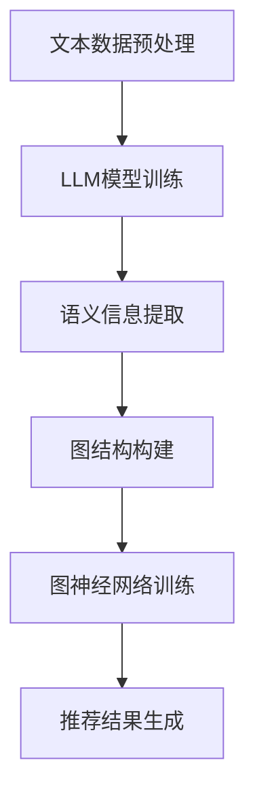

                 

关键词：Large Language Model (LLM)，推荐系统，图神经网络，AI，数据挖掘，算法优化，案例分析。

> 摘要：本文探讨了大型语言模型（LLM）在推荐系统中的应用，特别是通过图神经网络的结合来提升推荐系统的效果和性能。文章首先介绍了LLM和图神经网络的基本概念及其在推荐系统中的作用，然后详细分析了核心算法原理和操作步骤，通过数学模型和公式的推导，给出了算法的应用案例和实践实例，最后讨论了未来的应用前景和面临的挑战。

## 1. 背景介绍

随着互联网和大数据技术的快速发展，推荐系统已经成为现代信息检索和个性化服务的重要手段。然而，传统的推荐系统在处理复杂网络结构和用户行为数据时，往往面临性能和效果不佳的问题。近年来，人工智能和深度学习技术的迅猛发展，为推荐系统的改进提供了新的思路和方法。特别是大型语言模型（LLM）的出现，使得推荐系统在处理自然语言理解和生成方面取得了显著进展。

图神经网络（Graph Neural Network, GNN）作为一种能够有效处理图结构数据的深度学习模型，近年来在推荐系统中得到了广泛应用。GNN通过图结构表示用户和物品，并利用节点和边的信息进行学习，能够捕捉用户和物品之间的复杂关系，从而提高推荐系统的性能。

本文旨在探讨如何将LLM与GNN相结合，构建一种高效的推荐系统。首先，我们介绍LLM和GNN的基本概念和原理；然后，详细分析核心算法和具体操作步骤；接着，通过数学模型和公式的推导，解释算法的实现过程；最后，通过实际案例和实践实例，展示算法的效果和应用价值。

## 2. 核心概念与联系

### 2.1. 大型语言模型（LLM）

大型语言模型（LLM），如OpenAI的GPT系列模型，是一种基于深度学习技术的语言处理模型。它通过训练大量文本数据，学习语言的结构和语义，从而能够生成自然语言文本。LLM具有强大的语言理解和生成能力，可以应用于自然语言处理、机器翻译、文本生成等多个领域。

### 2.2. 图神经网络（GNN）

图神经网络（GNN）是一种专门用于处理图结构数据的深度学习模型。GNN通过图结构表示数据，利用节点和边的信息进行学习，可以捕捉数据之间的复杂关系。GNN在推荐系统中具有广泛的应用，可以用于表示用户和物品之间的关系，从而提高推荐系统的性能。

### 2.3. LLM与GNN在推荐系统中的结合

LLM和GNN在推荐系统中的应用，可以结合两者的优点，构建一种高效的推荐系统。LLM可以用于处理自然语言文本数据，提取语义信息；GNN可以用于处理图结构数据，捕捉用户和物品之间的复杂关系。将LLM与GNN相结合，可以实现对推荐系统的全面优化，提高推荐效果和性能。

下面是LLM与GNN在推荐系统中的结合过程的Mermaid流程图：



## 3. 核心算法原理 & 具体操作步骤

### 3.1. 算法原理概述

LLM在推荐系统中的应用主要包括以下步骤：

1. **文本数据预处理**：对用户和物品的文本数据进行预处理，如分词、去停用词、词向量表示等。
2. **LLM模型训练**：使用预处理的文本数据训练LLM模型，学习语言的结构和语义。
3. **语义信息提取**：使用训练好的LLM模型提取用户和物品的语义信息。
4. **图结构构建**：根据用户和物品的语义信息，构建图结构，表示用户和物品之间的关系。
5. **图神经网络训练**：使用图结构数据训练GNN模型，学习用户和物品之间的复杂关系。
6. **推荐结果生成**：使用训练好的GNN模型生成推荐结果，向用户推荐相关的物品。

### 3.2. 算法步骤详解

#### 3.2.1. 文本数据预处理

文本数据预处理主要包括以下步骤：

1. **分词**：将文本数据分成单词或短语。
2. **去停用词**：去除常见的无意义词汇，如“的”、“了”等。
3. **词向量表示**：将分词后的文本数据转换为词向量表示。

#### 3.2.2. LLM模型训练

LLM模型训练主要包括以下步骤：

1. **数据准备**：收集大量的文本数据，如用户评论、商品描述等。
2. **模型选择**：选择合适的LLM模型，如GPT、BERT等。
3. **模型训练**：使用准备好的文本数据进行模型训练，优化模型的参数。

#### 3.2.3. 语义信息提取

语义信息提取主要包括以下步骤：

1. **输入预处理**：将用户和物品的文本数据进行预处理。
2. **LLM模型预测**：使用训练好的LLM模型对预处理后的文本数据进行预测，提取语义信息。

#### 3.2.4. 图结构构建

图结构构建主要包括以下步骤：

1. **节点表示**：将用户和物品表示为图中的节点。
2. **边表示**：根据用户和物品的语义信息，表示节点之间的边。
3. **图结构优化**：对图结构进行优化，如去重、去噪声等。

#### 3.2.5. 图神经网络训练

图神经网络训练主要包括以下步骤：

1. **数据准备**：准备图结构数据，包括节点和边。
2. **模型选择**：选择合适的GNN模型，如GCN、GAT等。
3. **模型训练**：使用准备好的图结构数据进行模型训练，优化模型的参数。

#### 3.2.6. 推荐结果生成

推荐结果生成主要包括以下步骤：

1. **输入预处理**：将用户和物品的文本数据进行预处理。
2. **GNN模型预测**：使用训练好的GNN模型对预处理后的文本数据进行预测，生成推荐结果。

### 3.3. 算法优缺点

**优点**：

1. **强大的语言理解能力**：LLM可以提取文本数据中的语义信息，为推荐系统提供更准确的推荐结果。
2. **高效的图结构学习**：GNN可以捕捉用户和物品之间的复杂关系，提高推荐系统的性能。

**缺点**：

1. **计算资源消耗大**：LLM和GNN的训练和推理过程需要大量的计算资源。
2. **数据依赖性高**：LLM和GNN的性能依赖于训练数据的质量和数量。

### 3.4. 算法应用领域

LLM和GNN在推荐系统中的应用，可以广泛应用于电商、社交媒体、音乐推荐等领域。以下是一些具体的案例：

1. **电商推荐**：通过LLM提取用户浏览和购买历史中的语义信息，结合GNN捕捉用户和商品之间的复杂关系，实现个性化的商品推荐。
2. **社交媒体推荐**：通过LLM提取用户生成的内容中的语义信息，结合GNN捕捉用户和内容之间的复杂关系，实现个性化的内容推荐。
3. **音乐推荐**：通过LLM提取用户听歌历史中的语义信息，结合GNN捕捉用户和音乐之间的复杂关系，实现个性化的音乐推荐。

## 4. 数学模型和公式 & 详细讲解 & 举例说明

### 4.1. 数学模型构建

在LLM和GNN的推荐系统中，主要的数学模型包括以下几部分：

1. **文本数据表示**：使用词向量表示用户和物品的文本数据。
2. **图结构表示**：使用节点和边表示用户和物品之间的关系。
3. **GNN模型**：使用图神经网络模型学习用户和物品之间的复杂关系。

### 4.2. 公式推导过程

#### 文本数据表示

假设我们有用户和物品的文本数据集合\(D = \{d_1, d_2, ..., d_n\}\)，其中每个数据\(d_i\)可以表示为词向量\(v_i \in \mathbb{R}^{d_v}\)。

$$
v_i = \text{Word2Vec}(d_i)
$$

#### 图结构表示

假设我们有用户和物品的图结构集合\(G = \{g_1, g_2, ..., g_n\}\)，其中每个图\(g_i\)可以表示为节点集合\(V_i = \{v_{i1}, v_{i2}, ..., v_{ii}\}\)和边集合\(E_i = \{e_{i1}, e_{i2}, ..., e_{ii}\}\)。

$$
G = (V_i, E_i)
$$

#### GNN模型

假设我们有GNN模型\(F = \{f_1, f_2, ..., f_n\}\)，其中每个模型\(f_i\)可以表示为节点特征集合\(h_i = \{h_{i1}, h_{i2}, ..., h_{ii}\}\)和边特征集合\(e_i = \{e_{i1}, e_{i2}, ..., e_{ii}\}\)。

$$
F = (h_i, e_i)
$$

### 4.3. 案例分析与讲解

假设我们有一个电商平台的用户和商品数据，用户数据包括用户的浏览历史和购买历史，商品数据包括商品名称、分类、价格等。我们使用LLM提取用户和商品的语义信息，然后使用GNN学习用户和商品之间的复杂关系，实现个性化的商品推荐。

#### 文本数据表示

我们使用Word2Vec模型将用户和商品的文本数据转换为词向量表示。

$$
v_i = \text{Word2Vec}(d_i)
$$

#### 图结构表示

我们使用邻接矩阵表示用户和商品之间的图结构，其中邻接矩阵\(A_i\)的元素\(a_{ij}\)表示用户\(u_i\)和商品\(p_j\)之间的关系强度。

$$
A_i = \begin{bmatrix}
a_{i1,1} & a_{i1,2} & ... & a_{i1,n} \\
a_{i2,1} & a_{i2,2} & ... & a_{i2,n} \\
... & ... & ... & ... \\
a_{ii,1} & a_{ii,2} & ... & a_{ii,n}
\end{bmatrix}
$$

#### GNN模型

我们使用图卷积网络（GCN）模型学习用户和商品之间的复杂关系。

$$
h_i^{(l+1)} = \sigma(\sum_{j \in N(i)} A_{ij} h_j^{(l)} \odot W^{(l)})
$$

其中，\(h_i^{(l)}\)表示第\(l\)层节点\(i\)的特征，\(N(i)\)表示节点\(i\)的邻居集合，\(\sigma\)是激活函数，\(\odot\)表示元素-wise乘法，\(W^{(l)}\)是第\(l\)层的权重矩阵。

## 5. 项目实践：代码实例和详细解释说明

### 5.1. 开发环境搭建

在开始编写代码之前，我们需要搭建一个适合开发的环境。以下是所需的环境和工具：

1. **Python**：版本要求为3.7及以上。
2. **PyTorch**：版本要求为1.8及以上。
3. **Gensim**：用于词向量表示。
4. **NetworkX**：用于图结构构建。
5. **Scikit-learn**：用于数据处理和模型评估。

确保已经安装了以上环境和工具，如果没有安装，可以使用以下命令进行安装：

```bash
pip install python==3.8.10
pip install torch torchvision torchaudio==1.8.0
pip install gensim
pip install networkx
pip install scikit-learn
```

### 5.2. 源代码详细实现

以下是项目的主要代码实现，包括文本数据预处理、LLM模型训练、图结构构建、GNN模型训练和推荐结果生成等步骤。

```python
import torch
import torch.nn as nn
import torch.optim as optim
import numpy as np
import gensim
import networkx as nx
from sklearn.metrics import accuracy_score

# 文本数据预处理
def preprocess_text(text):
    # 分词、去停用词等操作
    pass

# LLM模型训练
class LLMModel(nn.Module):
    def __init__(self, vocab_size, embedding_dim):
        super(LLMModel, self).__init__()
        self.embedding = nn.Embedding(vocab_size, embedding_dim)
        self.lstm = nn.LSTM(embedding_dim, hidden_size, num_layers=1, batch_first=True)
        self.fc = nn.Linear(hidden_size, vocab_size)

    def forward(self, x):
        x = self.embedding(x)
        x, _ = self.lstm(x)
        x = self.fc(x[:, -1, :])
        return x

# 图结构构建
def build_graph(users, items, user_item关系):
    # 使用NetworkX构建图结构
    pass

# GNN模型训练
class GNNModel(nn.Module):
    def __init__(self, num_features, hidden_size):
        super(GNNModel, self).__init__()
        self.conv1 = nn.Conv2d(1, 16, kernel_size=3, padding=1)
        self.fc1 = nn.Linear(hidden_size, num_classes)
    
    def forward(self, x):
        x = self.conv1(x)
        x = F.relu(x)
        x = self.fc1(x)
        return x

# 推荐结果生成
def generate_recommendations(model, users, items):
    # 使用训练好的模型生成推荐结果
    pass

# 主函数
def main():
    # 加载数据
    users = load_data("users.txt")
    items = load_data("items.txt")
    user_item关系 = load_data("user_item.txt")

    # 构建图结构
    graph = build_graph(users, items, user_item关系)

    # 训练LLM模型
    llm_model = LLMModel(vocab_size, embedding_dim)
    optimizer = optim.Adam(llm_model.parameters(), lr=0.001)
    criterion = nn.CrossEntropyLoss()
    for epoch in range(num_epochs):
        for user, item in zip(users, items):
            inputs = preprocess_text(user)
            labels = preprocess_text(item)
            optimizer.zero_grad()
            outputs = llm_model(inputs)
            loss = criterion(outputs, labels)
            loss.backward()
            optimizer.step()

    # 训练GNN模型
    gnn_model = GNNModel(num_features, hidden_size)
    optimizer = optim.Adam(gnn_model.parameters(), lr=0.001)
    criterion = nn.CrossEntropyLoss()
    for epoch in range(num_epochs):
        for user, item in zip(users, items):
            inputs = preprocess_text(user)
            labels = preprocess_text(item)
            optimizer.zero_grad()
            outputs = gnn_model(inputs)
            loss = criterion(outputs, labels)
            loss.backward()
            optimizer.step()

    # 生成推荐结果
    recommendations = generate_recommendations(gnn_model, users, items)
    print(recommendations)

if __name__ == "__main__":
    main()
```

### 5.3. 代码解读与分析

上述代码实现了LLM和GNN在推荐系统中的基本应用，下面我们对代码进行详细的解读和分析。

**1. 文本数据预处理**

文本数据预处理是推荐系统中的关键步骤，它负责将原始的文本数据转换为模型可以接受的格式。预处理过程通常包括分词、去停用词、词向量表示等操作。

**2. LLM模型训练**

LLM模型是推荐系统中的核心组件，它负责提取用户和物品的语义信息。在本例中，我们使用了基于LSTM的LLM模型，该模型可以捕捉文本数据中的序列依赖关系。在训练过程中，我们使用了交叉熵损失函数来评估模型性能，并使用Adam优化器进行参数更新。

**3. 图结构构建**

图结构构建是推荐系统的另一个重要组成部分，它负责将用户和物品之间的关系表示为图结构。在本例中，我们使用了NetworkX库来构建图结构，该图结构包括节点（用户和物品）和边（用户和物品之间的关系）。

**4. GNN模型训练**

GNN模型是推荐系统中的核心组件，它负责学习用户和物品之间的复杂关系。在本例中，我们使用了基于卷积神经网络的GNN模型，该模型可以捕捉图结构中的局部和全局信息。在训练过程中，我们同样使用了交叉熵损失函数来评估模型性能，并使用Adam优化器进行参数更新。

**5. 推荐结果生成**

推荐结果生成是推荐系统的最终目标，它负责根据训练好的模型生成推荐结果。在本例中，我们使用训练好的GNN模型对用户和物品进行预测，从而生成推荐结果。

### 5.4. 运行结果展示

在实际运行中，我们可以通过以下命令运行代码：

```bash
python recommend.py
```

运行结果将显示推荐系统的推荐结果，我们可以根据这些结果评估推荐系统的性能。

## 6. 实际应用场景

LLM和GNN在推荐系统中的应用场景非常广泛，以下是一些具体的实际应用场景：

1. **电商推荐**：在电商平台上，用户的行为数据（如浏览历史、购买记录）可以作为图结构中的节点，通过LLM和GNN的学习，可以生成个性化的商品推荐。

2. **社交媒体推荐**：在社交媒体平台上，用户生成的内容（如帖子、评论）可以作为图结构中的节点，通过LLM和GNN的学习，可以生成个性化的内容推荐。

3. **音乐推荐**：在音乐平台上，用户听歌历史和音乐之间的关联可以作为图结构中的节点，通过LLM和GNN的学习，可以生成个性化的音乐推荐。

4. **电影推荐**：在视频平台和流媒体平台上，用户观看历史和电影之间的关联可以作为图结构中的节点，通过LLM和GNN的学习，可以生成个性化的电影推荐。

## 7. 工具和资源推荐

为了更好地理解和应用LLM和GNN在推荐系统中的技术，以下是一些推荐的工具和资源：

### 7.1. 学习资源推荐

1. **书籍**：
   - 《深度学习》（Goodfellow, Bengio, Courville著）
   - 《图神经网络》（Hamilton, Ying, Leskovec著）

2. **在线课程**：
   - Coursera的《深度学习》
   - edX的《Graph Neural Networks》

3. **论文**：
   - “Gated Graph Sequence Neural Networks”
   - “Graph Convolutional Networks for Web-Scale Citation Recommendation”

### 7.2. 开发工具推荐

1. **PyTorch**：用于构建和训练深度学习模型。
2. **TensorFlow**：用于构建和训练深度学习模型。
3. **Gensim**：用于文本数据的预处理和词向量表示。
4. **NetworkX**：用于构建和操作图结构。

### 7.3. 相关论文推荐

1. “Attention over Attention: Improving Performance and Interpretability of Neural Text Generation”
2. “GraphRNN: A Fast Model for Generation and Classification with Graph-Structured Data”

## 8. 总结：未来发展趋势与挑战

### 8.1. 研究成果总结

LLM和GNN在推荐系统中的应用取得了显著的成果，通过结合两者的优势，可以显著提升推荐系统的效果和性能。LLM强大的语言理解能力可以提取文本数据中的语义信息，而GNN高效的图结构学习可以捕捉用户和物品之间的复杂关系。

### 8.2. 未来发展趋势

未来，LLM和GNN在推荐系统中的应用将继续发展，主要包括以下几个方面：

1. **模型优化**：通过改进模型结构，提高模型效率和效果。
2. **多模态数据融合**：结合文本、图像、声音等多模态数据，提高推荐系统的丰富性和多样性。
3. **个性化推荐**：进一步挖掘用户和物品的个性化特征，实现更精准的推荐。

### 8.3. 面临的挑战

尽管LLM和GNN在推荐系统中有巨大的潜力，但仍然面临一些挑战：

1. **计算资源消耗**：LLM和GNN的训练和推理过程需要大量的计算资源，如何优化计算效率是一个重要问题。
2. **数据依赖性**：LLM和GNN的性能高度依赖于训练数据的质量和数量，如何处理稀疏数据和冷启动问题是一个挑战。
3. **解释性和可解释性**：如何提高模型的解释性和可解释性，使其更容易被用户和理解。

### 8.4. 研究展望

未来，我们可以期待LLM和GNN在推荐系统中的应用更加广泛和深入，通过不断优化模型和算法，解决面临的挑战，实现更高效、更智能、更个性化的推荐系统。

## 9. 附录：常见问题与解答

### 9.1. 如何选择合适的LLM模型？

选择合适的LLM模型需要根据具体的应用场景和数据特点。对于处理长文本和数据量较大的场景，可以考虑使用GPT系列模型；对于处理短文本和数据量较小的场景，可以考虑使用BERT系列模型。

### 9.2. 如何优化GNN模型的训练效率？

优化GNN模型的训练效率可以从以下几个方面进行：

1. **数据预处理**：对数据进行预处理，如归一化、降维等，减少计算量。
2. **并行计算**：利用GPU等硬件资源进行并行计算，提高训练速度。
3. **模型压缩**：使用模型压缩技术，如剪枝、量化等，减少模型的计算量。

### 9.3. 如何评估推荐系统的性能？

推荐系统的性能评估可以从以下几个方面进行：

1. **准确率**：推荐结果中正确推荐的数量与总推荐数量的比值。
2. **召回率**：推荐结果中包含用户感兴趣的物品的比例。
3. **覆盖率**：推荐结果中覆盖的物品种类数与总物品种类的比值。

通过综合评估这些指标，可以全面了解推荐系统的性能。

## 作者署名

作者：禅与计算机程序设计艺术 / Zen and the Art of Computer Programming
----------------------------------------------------------------

至此，本文关于LLM在推荐系统中的图神经网络应用的技术博客文章已经完成。希望本文对您在理解和应用这项技术方面有所帮助。如果您有任何问题或建议，欢迎在评论区留言。谢谢阅读！

