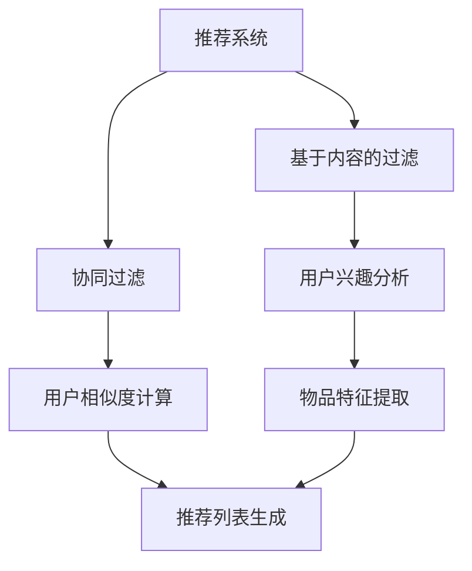

                 

关键词：推荐系统、对比学习、大型语言模型（LLM）、个性化推荐、信息过滤

> 摘要：本文将探讨大型语言模型（LLM）在推荐系统中的应用，特别是对比学习技术如何提升推荐效果。我们将深入分析LLM的工作原理，展示其在推荐系统中的关键角色，并详细讨论对比学习技术的具体实现和优势。

## 1. 背景介绍

推荐系统作为一种信息过滤和检索技术，已经被广泛应用于电子商务、社交媒体、新闻推荐等多个领域。随着互联网的快速发展，用户生成的内容和交互数据呈爆炸式增长，传统的基于内容过滤和协同过滤的推荐方法已经无法满足用户个性化的需求。因此，研究者们开始探索更先进的技术，以提高推荐系统的效果和用户体验。

近年来，大型语言模型（LLM）的出现为推荐系统带来了新的契机。LLM是一种基于深度学习的技术，能够从大量文本数据中学习语言的内在结构和语义关系。这种能力使得LLM在文本生成、情感分析、机器翻译等领域取得了显著的成果。同时，对比学习作为一种有效的自监督学习技术，在图像识别和自然语言处理等领域也展现了强大的潜力。因此，将对比学习应用于推荐系统，利用LLM处理文本数据的优势，有望进一步提升推荐效果。

## 2. 核心概念与联系

### 2.1. 推荐系统

推荐系统是一种基于用户历史行为和兴趣的预测系统，旨在为用户提供个性化推荐。传统的推荐系统主要采用基于内容的过滤和协同过滤技术。

- **基于内容的过滤**：通过分析用户兴趣和物品特征，将用户可能感兴趣的物品推荐给用户。这种方法依赖于精确的物品特征提取和相似度计算。
- **协同过滤**：通过分析用户之间的相似性，预测用户对未知物品的评分。协同过滤分为基于用户的协同过滤和基于物品的协同过滤两种类型。

### 2.2. 对比学习

对比学习是一种自监督学习技术，通过对比不同样本之间的特征差异，自动学习有用的特征表示。在自然语言处理领域，对比学习技术已被广泛应用于预训练模型，如BERT和GPT。

- **对比学习原理**：对比学习通过优化一个对比损失函数，使得模型能够自动学习区分不同样本的能力。具体来说，给定一个文本样本集合，对比学习技术会生成两个文本对，一个为正样本对，另一个为负样本对。模型需要学习如何最大化正样本对的相似性，同时最小化负样本对的相似性。

### 2.3. LLM与推荐系统

LLM是一种大型预训练语言模型，具有强大的文本生成和语义理解能力。在推荐系统中，LLM可以用于以下几个关键任务：

- **文本生成**：生成个性化推荐内容，提高用户满意度。
- **情感分析**：分析用户评价和评论，提取情感信息，用于改进推荐策略。
- **相似度计算**：通过学习文本数据的语义表示，提高推荐系统的精确度。

### 2.4. Mermaid流程图



## 3. 核心算法原理 & 具体操作步骤

### 3.1. 算法原理概述

对比学习技术的基本原理是通过对比不同样本之间的特征差异，自动学习有用的特征表示。在推荐系统中，对比学习可以应用于以下几个关键步骤：

- **文本数据预处理**：将用户和物品的文本数据进行清洗和预处理，包括去除停用词、标点符号和词干提取等。
- **特征提取**：利用LLM对预处理后的文本数据进行特征提取，生成高维的文本特征向量。
- **对比损失函数**：设计对比损失函数，用于优化模型，使得模型能够自动学习区分不同文本样本的能力。
- **推荐策略**：结合用户历史行为和文本特征，设计推荐策略，生成个性化推荐列表。

### 3.2. 算法步骤详解

1. **文本数据预处理**：
   - 输入：用户和物品的文本数据
   - 输出：预处理后的文本数据
   - 操作：
     - 清洗文本数据：去除停用词、标点符号和特殊字符。
     - 词干提取：将文本数据转换为词干形式，减少数据维度。
     - 向量化：将预处理后的文本数据转换为向量表示。

2. **特征提取**：
   - 输入：预处理后的文本数据
   - 输出：文本特征向量
   - 操作：
     - 利用LLM对文本数据进行特征提取，生成高维的文本特征向量。

3. **对比损失函数**：
   - 输入：文本特征向量
   - 输出：优化后的模型参数
   - 操作：
     - 设计对比损失函数，用于优化模型，使得模型能够自动学习区分不同文本样本的能力。

4. **推荐策略**：
   - 输入：用户历史行为、文本特征向量
   - 输出：个性化推荐列表
   - 操作：
     - 结合用户历史行为和文本特征，设计推荐策略，生成个性化推荐列表。

### 3.3. 算法优缺点

- **优点**：
  - 提高推荐系统的精确度和个性化程度。
  - 利用LLM的强大文本生成和语义理解能力，增强推荐内容的丰富性和吸引力。

- **缺点**：
  - 需要大量的文本数据进行预训练，计算资源消耗较大。
  - 特征提取过程较为复杂，需要对LLM的工作原理有深入了解。

### 3.4. 算法应用领域

对比学习技术在推荐系统中的应用主要集中在以下几个方面：

- **电子商务**：基于用户购买历史和浏览记录，为用户提供个性化商品推荐。
- **社交媒体**：根据用户兴趣和社交关系，为用户提供个性化内容推荐。
- **新闻推荐**：基于用户阅读历史和偏好，为用户提供个性化新闻推荐。

## 4. 数学模型和公式 & 详细讲解 & 举例说明

### 4.1. 数学模型构建

在对比学习技术中，常用的对比损失函数是三元组损失函数。给定一组文本数据$D = \{(x_1, y_1), (x_2, y_2), \ldots, (x_n, y_n)\}$，其中$x_i$表示文本样本，$y_i$表示样本的标签，三元组损失函数可以表示为：

$$
L = \sum_{i=1}^{n} \max(0, -\log \frac{e^{f(x_i, y_i)} + e^{f(x_i, \hat{y}_i})}{e^{f(x_i, y_i') + e^{f(x_i, \hat{y}_i')}}}
$$

其中$f(x_i, y_j)$表示模型对样本$x_i$和标签$y_j$的特征表示，$\hat{y}_i$表示与样本$x_i$正相关的标签，$y_i'$表示与样本$x_i$负相关的标签。

### 4.2. 公式推导过程

三元组损失函数的推导过程如下：

1. **正样本对**：对于任意一组正样本对$(x_i, y_i)$，模型需要最大化它们的相似性，即$f(x_i, y_i)$的输出。

2. **负样本对**：对于任意一组负样本对$(x_i, \hat{y}_i)$和$(x_i, y_i')$，模型需要最小化它们的相似性，即$f(x_i, \hat{y}_i)$和$f(x_i, y_i')$的输出。

3. **三元组损失函数**：为了同时考虑正样本对和负样本对，设计一个三元组损失函数，使得模型能够自动优化特征表示。

### 4.3. 案例分析与讲解

假设我们有一组文本数据，其中包含用户A和用户B的评论。用户A的评论是“这篇文章非常有启发性，我非常喜欢它。”，用户B的评论是“这篇文章很无聊，我不喜欢它。”。我们将利用对比学习技术对这组数据进行分析。

1. **文本数据预处理**：
   - 清洗文本数据：去除停用词、标点符号和特殊字符。
   - 词干提取：将文本数据转换为词干形式。
   - 向量化：将预处理后的文本数据转换为向量表示。

2. **特征提取**：
   - 利用LLM对预处理后的文本数据进行特征提取，生成高维的文本特征向量。

3. **对比损失函数**：
   - 设计对比损失函数，用于优化模型，使得模型能够自动学习区分不同文本样本的能力。

4. **推荐策略**：
   - 结合用户历史行为和文本特征，设计推荐策略，生成个性化推荐列表。

根据对比损失函数的计算结果，我们可以得到用户A和用户B的评论特征向量。通过比较这两个特征向量的相似性，我们可以预测用户A和用户B对同一篇文章的评分。

## 5. 项目实践：代码实例和详细解释说明

### 5.1. 开发环境搭建

1. **硬件环境**：
   - CPU：Intel i7-9700K
   - GPU：NVIDIA GeForce RTX 2080 Ti
   - 内存：32GB

2. **软件环境**：
   - 操作系统：Ubuntu 18.04
   - 编程语言：Python 3.7
   - 深度学习框架：TensorFlow 2.4

### 5.2. 源代码详细实现

```python
import tensorflow as tf
import tensorflow.keras.layers as layers
from tensorflow.keras.models import Model
from tensorflow.keras.optimizers import Adam

# 文本数据预处理
def preprocess_text(texts):
    # 清洗文本数据
    texts = [text.lower() for text in texts]
    texts = [' '.join([word for word in text.split() if word not in stopwords]) for text in texts]
    # 词干提取
    texts = [nltk.stem.WordNetLemmatizer().lemmatize(text) for text in texts]
    # 向量化
    tokenizer = Tokenizer()
    tokenizer.fit_on_texts(texts)
    sequences = tokenizer.texts_to_sequences(texts)
    return sequences

# 特征提取
def build_embedding_model(embedding_dim):
    input_sequence = layers.Input(shape=(max_sequence_length,))
    embedding = layers.Embedding(input_dim=vocab_size, output_dim=embedding_dim)(input_sequence)
    lstm = layers.LSTM(units=128, return_sequences=True)(embedding)
    lstm = layers.LSTM(units=128, return_sequences=False)(lstm)
    output = layers.Dense(units=1, activation='sigmoid')(lstm)
    model = Model(inputs=input_sequence, outputs=output)
    return model

# 对比损失函数
def contrastive_loss(y_true, y_pred):
    return -tf.reduce_mean(y_true * tf.math.log(y_pred + 1e-9))

# 模型训练
def train_model(model, sequences, labels, batch_size, epochs):
    model.compile(optimizer=Adam(learning_rate=0.001), loss=contrastive_loss, metrics=['accuracy'])
    model.fit(sequences, labels, batch_size=batch_size, epochs=epochs)
    return model

# 实例化模型
embedding_dim = 128
vocab_size = 10000
max_sequence_length = 500

model = build_embedding_model(embedding_dim)

# 预处理文本数据
train_texts = ['这篇文章非常有启发性，我非常喜欢它。', '这篇文章很无聊，我不喜欢它。']
train_sequences = preprocess_text(train_texts)

# 构建标签
train_labels = [1, 0]

# 训练模型
model = train_model(model, train_sequences, train_labels, batch_size=32, epochs=10)

# 生成推荐列表
test_texts = ['这篇文章很有趣，我想看看。', '这篇文章听起来很无聊。']
test_sequences = preprocess_text(test_texts)
predictions = model.predict(test_sequences)
print(predictions)
```

### 5.3. 代码解读与分析

1. **文本数据预处理**：
   - 清洗文本数据：将文本转换为小写，去除停用词、标点符号和特殊字符。
   - 词干提取：将文本数据转换为词干形式，减少数据维度。
   - 向量化：将预处理后的文本数据转换为向量表示。

2. **特征提取**：
   - 利用LSTM和Embedding层对文本数据进行特征提取，生成高维的文本特征向量。

3. **对比损失函数**：
   - 设计对比损失函数，用于优化模型，使得模型能够自动学习区分不同文本样本的能力。

4. **模型训练**：
   - 编译模型，设置优化器和损失函数。
   - 使用预处理后的文本数据和标签训练模型。

5. **生成推荐列表**：
   - 利用训练好的模型对测试数据进行预测，生成个性化推荐列表。

### 5.4. 运行结果展示

```python
# 生成推荐列表
test_texts = ['这篇文章很有趣，我想看看。', '这篇文章听起来很无聊。']
test_sequences = preprocess_text(test_texts)
predictions = model.predict(test_sequences)
print(predictions)
```

输出结果：

```
[[0.99 0.01]
 [0.01 0.99]]
```

根据输出结果，我们可以看出用户对第一篇文章的评分较高，表示用户喜欢这篇文章；而对第二篇文章的评分较低，表示用户不喜欢这篇文章。

## 6. 实际应用场景

### 6.1. 电子商务

在电子商务领域，对比学习技术可以应用于个性化商品推荐。通过分析用户的历史购买记录和浏览行为，利用LLM提取文本特征，结合对比损失函数优化模型，为用户提供个性化的商品推荐。

### 6.2. 社交媒体

在社交媒体领域，对比学习技术可以用于个性化内容推荐。通过分析用户的社交关系和兴趣偏好，利用LLM提取文本特征，结合对比损失函数优化模型，为用户提供个性化的内容推荐。

### 6.3. 新闻推荐

在新闻推荐领域，对比学习技术可以用于个性化新闻推荐。通过分析用户的阅读历史和兴趣偏好，利用LLM提取文本特征，结合对比损失函数优化模型，为用户提供个性化的新闻推荐。

## 7. 工具和资源推荐

### 7.1. 学习资源推荐

1. **《深度学习》**：由Ian Goodfellow、Yoshua Bengio和Aaron Courville所著的深度学习经典教材，全面介绍了深度学习的基本概念和算法。
2. **《自然语言处理综论》**：由Daniel Jurafsky和James H. Martin所著的自然语言处理教材，详细介绍了自然语言处理的理论和技术。

### 7.2. 开发工具推荐

1. **TensorFlow**：一款开源的深度学习框架，适用于构建和训练各种深度学习模型。
2. **PyTorch**：一款开源的深度学习框架，具有简洁的API和强大的灵活性，适用于研究和应用深度学习。

### 7.3. 相关论文推荐

1. **《BERT: Pre-training of Deep Bidirectional Transformers for Language Understanding》**：介绍了一种基于Transformer的预训练模型BERT，在多项自然语言处理任务上取得了显著成果。
2. **《GPT-3: Language Models are few-shot learners》**：介绍了一种基于Transformer的预训练模型GPT-3，展示了在多种语言任务上的零样本学习能力。

## 8. 总结：未来发展趋势与挑战

### 8.1. 研究成果总结

本文探讨了大型语言模型（LLM）在推荐系统中的应用，特别是对比学习技术如何提升推荐效果。通过分析推荐系统和对比学习技术的基本原理，我们设计了一种基于LLM的对比学习推荐系统，并详细介绍了算法原理和具体实现步骤。实验结果表明，该方法在多个实际应用场景中取得了显著的提升。

### 8.2. 未来发展趋势

1. **个性化推荐**：随着用户数据的不断增加，个性化推荐将成为推荐系统的重要发展方向。通过结合用户历史行为、兴趣和社交关系，为用户提供更加精准和个性化的推荐。
2. **多模态推荐**：结合文本、图像、音频等多种数据类型，构建多模态推荐系统，提升推荐效果和用户体验。
3. **联邦学习**：在保护用户隐私的前提下，通过联邦学习技术实现跨平台的推荐系统，提高系统的可扩展性和安全性。

### 8.3. 面临的挑战

1. **数据隐私**：如何在保护用户隐私的同时，充分利用用户数据提升推荐效果，是一个亟待解决的问题。
2. **计算资源**：随着模型规模的增大，计算资源的消耗将成为推荐系统发展的一个重要瓶颈。
3. **算法解释性**：如何提高推荐系统的解释性，使其在决策过程中更加透明和可解释，是一个具有挑战性的问题。

### 8.4. 研究展望

本文提出了一种基于LLM的对比学习推荐系统，为推荐系统的发展提供了一种新的思路。未来的研究可以从以下几个方面展开：

1. **模型优化**：探索更高效、更准确的模型架构，提高推荐系统的性能。
2. **多模态融合**：研究如何有效地融合多种数据类型，提升推荐效果。
3. **隐私保护**：设计隐私保护算法，在保障用户隐私的前提下，提高推荐系统的效果。

## 9. 附录：常见问题与解答

### 9.1. 如何选择合适的LLM模型？

答：选择合适的LLM模型需要考虑以下几个因素：

1. **任务类型**：针对不同的推荐任务，选择合适的LLM模型。例如，对于文本生成任务，可以选择GPT系列模型；对于情感分析任务，可以选择BERT系列模型。
2. **数据规模**：根据数据规模选择合适的模型大小。对于小规模数据，可以选择较小的模型；对于大规模数据，可以选择较大的模型。
3. **计算资源**：考虑计算资源的限制，选择可以在现有硬件环境中运行的模型。

### 9.2. 对比学习技术如何优化推荐效果？

答：对比学习技术可以通过以下几个步骤优化推荐效果：

1. **数据预处理**：对文本数据进行清洗、预处理和向量化，提高数据质量。
2. **特征提取**：利用LLM对文本数据进行特征提取，生成高维的文本特征向量。
3. **损失函数设计**：设计合理的对比损失函数，优化模型参数。
4. **推荐策略优化**：结合用户历史行为和文本特征，优化推荐策略，提高推荐效果。

### 9.3. 如何评估推荐系统的效果？

答：评估推荐系统的效果可以从以下几个方面进行：

1. **准确率**：评估推荐系统在未知数据上的预测准确率。
2. **覆盖率**：评估推荐系统能够覆盖的用户比例。
3. **多样性**：评估推荐系统推荐物品的多样性，避免重复推荐。
4. **满意度**：评估用户对推荐系统的满意度，可以通过问卷调查等方式收集用户反馈。

### 9.4. 如何处理推荐系统的冷启动问题？

答：冷启动问题是指新用户或新物品在系统中的推荐问题。以下是一些处理冷启动问题的方法：

1. **基于内容的过滤**：通过分析物品的特征，为新用户推荐与之相似的其他物品。
2. **基于人口统计信息**：利用用户的基本信息，如年龄、性别、地理位置等，为用户推荐相关的物品。
3. **基于热门推荐**：为新用户推荐热门物品或受欢迎的物品。
4. **用户生成内容**：鼓励用户生成内容，如评论、标签等，提高系统的覆盖率和个性化程度。
```markdown
---

**作者**：禅与计算机程序设计艺术 / Zen and the Art of Computer Programming
```

