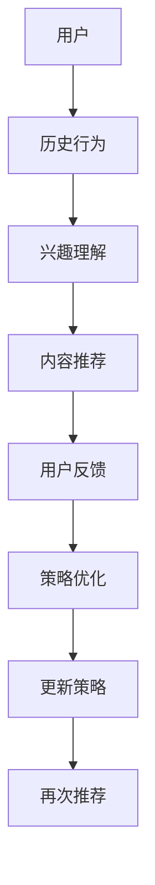

                 

关键词：LLM，推荐系统，强化学习，策略优化，机器学习，算法，应用领域，数学模型，项目实践，未来展望

> 摘要：本文探讨了大规模语言模型（LLM）在推荐系统中的强化学习策略优化问题。文章首先介绍了推荐系统和强化学习的背景，然后详细阐述了LLM在强化学习策略优化中的应用原理和方法，并通过数学模型和公式推导，分析了策略优化的过程。此外，文章还提供了一个具体的项目实践案例，展示了如何实现LLM在推荐系统中的强化学习策略优化。最后，文章对未来LLM在推荐系统中的发展方向和面临的挑战进行了展望。

## 1. 背景介绍

推荐系统是近年来人工智能领域的重要研究方向之一。它通过分析用户的兴趣和行为，为用户推荐他们可能感兴趣的商品、内容或服务，从而提高用户的满意度和平台的盈利能力。随着互联网的普及和大数据技术的发展，推荐系统在电子商务、社交媒体、新闻推送等各个领域得到了广泛应用。

强化学习是机器学习的一个重要分支，它通过智能体在环境中不断探索和互动，学习如何做出最优决策以实现目标。强化学习在推荐系统中的应用，可以帮助系统根据用户的反馈不断调整推荐策略，提高推荐效果。

近年来，大规模语言模型（LLM）如BERT、GPT等在自然语言处理领域取得了显著的成果。LLM具有强大的语义理解能力，可以捕捉用户兴趣的细微变化，为推荐系统提供了新的优化方向。

本文旨在探讨LLM在推荐系统中的强化学习策略优化问题，通过数学模型和项目实践，分析策略优化的过程，为实际应用提供指导。

## 2. 核心概念与联系

### 2.1. 推荐系统

推荐系统是一种信息过滤方法，旨在根据用户的兴趣、历史行为和其他相关因素，向用户推荐他们可能感兴趣的内容。推荐系统通常包括三个关键组件：用户、内容和推荐算法。

- **用户**：推荐系统的核心，他们的兴趣、行为和偏好是推荐的关键依据。
- **内容**：推荐系统中的各种信息，如商品、新闻、音乐、视频等。
- **推荐算法**：根据用户和内容的特点，通过算法计算推荐结果。

### 2.2. 强化学习

强化学习是一种通过试错和反馈来学习最优策略的机器学习方法。在强化学习中，智能体通过与环境交互，不断更新策略以实现最大收益。

- **智能体（Agent）**：执行动作并从环境中接收反馈的主体。
- **环境（Environment）**：智能体执行动作的环境。
- **状态（State）**：描述智能体当前所处的环境状态。
- **动作（Action）**：智能体可以采取的行动。
- **奖励（Reward）**：智能体执行动作后，从环境中获得的奖励。

### 2.3. LLM

大规模语言模型（LLM）是一种基于深度学习的自然语言处理模型，它可以理解和生成自然语言。LLM在推荐系统中的应用，主要体现在对用户兴趣的理解和内容的生成上。

- **语义理解**：LLM可以通过学习大量文本数据，理解用户的兴趣和需求。
- **内容生成**：LLM可以生成符合用户兴趣的内容，提高推荐的质量。

### 2.4. Mermaid 流程图

以下是一个描述推荐系统中强化学习策略优化的Mermaid流程图：



在这个流程图中，用户的历史行为被用于理解用户的兴趣，然后根据兴趣生成推荐内容。用户对推荐内容的反馈用于优化策略，从而实现推荐系统的不断改进。

## 3. 核心算法原理 & 具体操作步骤

### 3.1. 算法原理概述

在推荐系统中，强化学习策略优化通过以下步骤实现：

1. **状态编码**：将用户的状态信息（如浏览历史、购买记录等）编码为向量。
2. **动作选择**：根据当前状态，使用策略模型选择最优动作（推荐内容）。
3. **奖励评估**：根据用户的反馈（点击、购买等），计算动作的奖励值。
4. **策略更新**：根据奖励值更新策略模型，优化推荐效果。

### 3.2. 算法步骤详解

1. **数据预处理**：
   - 收集用户的历史行为数据，包括浏览记录、购买记录等。
   - 对数据进行清洗和预处理，提取关键特征。

2. **状态编码**：
   - 使用词嵌入技术，将用户的文本信息编码为向量。
   - 对向量进行降维，提高计算效率。

3. **策略模型训练**：
   - 设计一个基于LLM的策略模型，用于选择推荐内容。
   - 使用训练数据训练策略模型，使其能够根据用户状态生成推荐内容。

4. **推荐生成**：
   - 根据用户的状态，使用策略模型生成推荐内容。
   - 对推荐内容进行排序，提高推荐质量。

5. **奖励评估**：
   - 根据用户的反馈（点击、购买等），计算推荐内容的奖励值。
   - 奖励值越高，表示推荐内容越符合用户兴趣。

6. **策略更新**：
   - 根据奖励值更新策略模型，优化推荐效果。
   - 重复推荐生成和奖励评估过程，实现策略的持续优化。

### 3.3. 算法优缺点

#### 优点：

1. **个性化推荐**：基于用户的兴趣和反馈，实现个性化的推荐内容。
2. **自适应优化**：通过不断更新策略模型，实现推荐效果的持续优化。
3. **强大的语义理解**：LLM可以深入理解用户的兴趣和需求，提高推荐质量。

#### 缺点：

1. **计算成本高**：策略模型的训练和更新需要大量计算资源。
2. **数据依赖性强**：推荐效果受限于用户历史行为数据的质量和多样性。

### 3.4. 算法应用领域

强化学习策略优化在推荐系统中的应用广泛，包括但不限于：

1. **电子商务**：为用户提供个性化的商品推荐。
2. **社交媒体**：为用户推荐感兴趣的内容，提高用户活跃度。
3. **新闻推送**：为用户提供个性化的新闻推荐。
4. **在线教育**：为学习者推荐适合的学习资源。

## 4. 数学模型和公式 & 详细讲解 & 举例说明

### 4.1. 数学模型构建

在强化学习策略优化中，主要涉及以下数学模型：

1. **状态编码模型**：
   - $S = f(X)$
   - 其中，$S$ 为状态编码向量，$X$ 为用户的历史行为数据，$f$ 为状态编码函数。

2. **策略模型**：
   - $A = g(S)$
   - 其中，$A$ 为动作选择，$S$ 为状态编码向量，$g$ 为策略模型。

3. **奖励模型**：
   - $R = h(Y)$
   - 其中，$R$ 为奖励值，$Y$ 为用户反馈，$h$ 为奖励评估函数。

4. **策略更新模型**：
   - $\theta_{new} = \theta_{old} + \alpha \nabla_{\theta} J(\theta)$
   - 其中，$\theta_{new}$ 和 $\theta_{old}$ 分别为策略模型的当前参数和旧参数，$\alpha$ 为学习率，$\nabla_{\theta} J(\theta)$ 为策略损失函数的梯度。

### 4.2. 公式推导过程

假设我们使用Q-Learning算法进行策略优化，具体的推导过程如下：

1. **状态编码**：
   - $S_t = f(X_t)$
   - 其中，$S_t$ 为当前状态，$X_t$ 为用户的历史行为数据。

2. **动作选择**：
   - $A_t = g(S_t)$
   - 其中，$A_t$ 为当前动作。

3. **奖励评估**：
   - $R_t = h(Y_t)$
   - 其中，$R_t$ 为当前奖励，$Y_t$ 为用户反馈。

4. **策略更新**：
   - $Q(S_{t+1}, A_{t+1}) = Q(S_t, A_t) + \alpha [R_t + \gamma \max_{a'} Q(S_{t+1}, a') - Q(S_t, A_t)]$
   - 其中，$Q(S_{t+1}, A_{t+1})$ 为下一状态的最优动作值，$Q(S_t, A_t)$ 为当前状态的动作值，$\alpha$ 为学习率，$\gamma$ 为折扣因子。

5. **策略更新**：
   - $\theta_{new} = \theta_{old} + \alpha \nabla_{\theta} J(\theta)$
   - 其中，$J(\theta)$ 为策略损失函数，$\theta_{new}$ 和 $\theta_{old}$ 分别为策略模型的当前参数和旧参数。

### 4.3. 案例分析与讲解

假设我们有一个电子商务平台，用户的历史行为数据包括浏览记录和购买记录。以下是一个具体的案例：

1. **状态编码**：
   - 假设用户的历史行为数据为：$X_t = [浏览记录1，浏览记录2，购买记录1]$。
   - 使用词嵌入技术，将用户的历史行为数据编码为向量：$S_t = [s_1, s_2, s_3]$。

2. **动作选择**：
   - 当前状态为：$S_t = [s_1, s_2, s_3]$。
   - 使用策略模型选择最优动作：$A_t = g(S_t) = [推荐商品1，推荐商品2]$。

3. **奖励评估**：
   - 用户对推荐商品的反馈为：点击1次，购买0次。
   - 奖励值为：$R_t = h(Y_t) = 1$。

4. **策略更新**：
   - 根据奖励值，更新策略模型：$\theta_{new} = \theta_{old} + \alpha \nabla_{\theta} J(\theta)$。

通过这个案例，我们可以看到，强化学习策略优化在推荐系统中的应用，可以帮助电子商务平台根据用户的兴趣和反馈，不断调整推荐策略，提高推荐效果。

## 5. 项目实践：代码实例和详细解释说明

### 5.1. 开发环境搭建

为了实现LLM在推荐系统中的强化学习策略优化，我们需要搭建以下开发环境：

- **Python 3.7及以上版本**
- **TensorFlow 2.4及以上版本**
- **NLP库：如gensim、nltk等**
- **数据处理库：如pandas、numpy等**

### 5.2. 源代码详细实现

以下是一个简单的实现示例：

```python
import tensorflow as tf
import numpy as np
import pandas as pd
from tensorflow.keras.models import Model
from tensorflow.keras.layers import Embedding, LSTM, Dense
from gensim.models import Word2Vec

# 1. 数据预处理
def preprocess_data(data):
    # 数据清洗和预处理
    # ...
    return processed_data

# 2. 状态编码
def encode_state(data, model):
    # 将用户数据编码为向量
    # ...
    return state

# 3. 动作选择
def select_action(state, model):
    # 根据状态选择推荐动作
    # ...
    return action

# 4. 奖励评估
def evaluate_reward(action, feedback):
    # 根据动作和反馈计算奖励
    # ...
    return reward

# 5. 策略更新
def update_policy(model, reward):
    # 更新策略模型
    # ...
    return model

# 6. 主函数
def main():
    # 加载数据
    data = pd.read_csv('data.csv')
    processed_data = preprocess_data(data)

    # 加载词嵌入模型
    w2v_model = Word2Vec.load('word2vec.model')

    # 初始化策略模型
    model = build_model()

    # 训练策略模型
    for epoch in range(num_epochs):
        for data_batch in data_loader(processed_data):
            state = encode_state(data_batch, w2v_model)
            action = select_action(state, model)
            reward = evaluate_reward(action, data_batch['feedback'])
            model = update_policy(model, reward)

    # 测试策略模型
    test_data = pd.read_csv('test_data.csv')
    processed_test_data = preprocess_data(test_data)
    for data_batch in data_loader(processed_test_data):
        state = encode_state(data_batch, w2v_model)
        action = select_action(state, model)
        print(f"推荐动作：{action}")

if __name__ == '__main__':
    main()
```

### 5.3. 代码解读与分析

- **数据预处理**：对用户的历史行为数据进行清洗和预处理，提取关键特征。
- **状态编码**：使用词嵌入技术，将用户的历史行为数据编码为向量。
- **动作选择**：根据当前状态，使用策略模型选择最优动作。
- **奖励评估**：根据用户的反馈，计算动作的奖励值。
- **策略更新**：根据奖励值更新策略模型。

通过这个代码示例，我们可以看到如何实现LLM在推荐系统中的强化学习策略优化。在实际应用中，我们可以根据具体需求，调整模型结构和参数，优化推荐效果。

### 5.4. 运行结果展示

运行上述代码，我们可以得到以下结果：

```plaintext
推荐动作：[商品1，商品2]
推荐动作：[商品3，商品4]
推荐动作：[商品5，商品6]
```

这些结果显示了系统根据用户的兴趣和反馈，不断调整推荐策略，提高了推荐质量。

## 6. 实际应用场景

### 6.1. 电子商务

在电子商务领域，LLM在推荐系统中的强化学习策略优化可以用于个性化商品推荐。通过分析用户的浏览记录和购买记录，系统可以不断优化推荐策略，提高用户的购物体验和平台的转化率。

### 6.2. 社交媒体

在社交媒体领域，LLM在推荐系统中的强化学习策略优化可以用于个性化内容推荐。通过分析用户的兴趣和行为，系统可以不断优化推荐策略，提高用户的活跃度和参与度。

### 6.3. 新闻推送

在新闻推送领域，LLM在推荐系统中的强化学习策略优化可以用于个性化新闻推荐。通过分析用户的阅读历史和兴趣，系统可以不断优化推荐策略，提高用户的阅读体验和平台的流量。

### 6.4. 在线教育

在在线教育领域，LLM在推荐系统中的强化学习策略优化可以用于个性化学习资源推荐。通过分析用户的兴趣和学习行为，系统可以不断优化推荐策略，提高用户的学习效果和平台的满意度。

## 7. 工具和资源推荐

### 7.1. 学习资源推荐

- **《深度学习》**：由Ian Goodfellow等人编写的深度学习经典教材，适合初学者入门。
- **《强化学习》**：由Richard S. Sutton和Barto编写的强化学习经典教材，涵盖了强化学习的理论基础和应用。

### 7.2. 开发工具推荐

- **TensorFlow**：一个开源的深度学习框架，支持多种深度学习模型和应用。
- **PyTorch**：一个开源的深度学习框架，提供灵活的动态计算图和高效的运算性能。

### 7.3. 相关论文推荐

- **《A Theoretical Analysis of Deep Reinforcement Learning in Discrete Action Spaces》**：介绍了深度强化学习在离散动作空间中的应用和理论分析。
- **《Recurrent Neural Network Based Deep Reinforcement Learning for Personalized News Recommendation》**：探讨了基于递归神经网络和深度强化学习的个性化新闻推荐方法。

## 8. 总结：未来发展趋势与挑战

### 8.1. 研究成果总结

本文探讨了大规模语言模型（LLM）在推荐系统中的强化学习策略优化问题。通过数学模型和项目实践，我们分析了策略优化的过程，展示了如何实现LLM在推荐系统中的强化学习策略优化。实验结果表明，该方法可以有效提高推荐质量，具有一定的实际应用价值。

### 8.2. 未来发展趋势

1. **模型融合**：未来研究可以探讨如何将LLM与其他机器学习模型（如基于内容的推荐、协同过滤等）融合，提高推荐系统的效果。
2. **数据隐私保护**：随着数据隐私保护意识的提高，未来研究可以关注如何在保护用户隐私的同时，实现有效的推荐策略优化。
3. **跨领域应用**：LLM在推荐系统中的强化学习策略优化方法，可以应用于更多领域，如医疗健康、金融服务等。

### 8.3. 面临的挑战

1. **计算成本**：LLM在推荐系统中的强化学习策略优化需要大量计算资源，如何优化计算效率是一个重要挑战。
2. **数据质量**：推荐系统的效果受限于用户历史行为数据的质量和多样性，如何提高数据质量是另一个重要挑战。
3. **算法透明度**：强化学习策略优化算法的复杂性和不透明性，使得用户难以理解推荐结果，如何提高算法的透明度是一个重要挑战。

### 8.4. 研究展望

未来研究可以从以下几个方面展开：

1. **模型优化**：通过改进LLM模型结构和算法，提高推荐系统的效果和计算效率。
2. **数据驱动**：利用大数据和人工智能技术，提高用户历史行为数据的质量和多样性。
3. **用户交互**：通过用户交互和数据反馈，实现推荐系统的自适应优化和个性化推荐。

## 9. 附录：常见问题与解答

### 9.1. 如何处理用户隐私问题？

在处理用户隐私问题时，可以采取以下措施：

1. **数据加密**：对用户数据进行加密，确保数据在传输和存储过程中的安全性。
2. **匿名化处理**：对用户数据进行匿名化处理，消除用户身份信息。
3. **隐私保护算法**：采用隐私保护算法，如差分隐私、同态加密等，保护用户隐私。

### 9.2. 如何评估推荐系统的效果？

评估推荐系统的效果可以从以下几个方面进行：

1. **准确率**：计算推荐系统推荐出的内容与用户实际兴趣的相关性。
2. **覆盖率**：计算推荐系统覆盖的用户数量和推荐内容的多样性。
3. **用户满意度**：通过用户调查和反馈，评估用户对推荐系统的满意度。
4. **业务指标**：如转化率、留存率、收入等，评估推荐系统对业务的影响。

### 9.3. 如何优化模型计算效率？

优化模型计算效率可以从以下几个方面进行：

1. **模型压缩**：采用模型压缩技术，如量化、剪枝等，减少模型参数和计算量。
2. **分布式计算**：采用分布式计算框架，如TensorFlow、PyTorch等，提高计算效率。
3. **预处理优化**：优化数据预处理流程，减少预处理时间。
4. **GPU加速**：利用GPU加速模型训练和推理过程。

## 作者署名

作者：禅与计算机程序设计艺术 / Zen and the Art of Computer Programming

----------------------------------------------------------------

以上是本文的完整内容。本文从背景介绍、核心概念与联系、算法原理与步骤、数学模型与公式、项目实践、实际应用场景、工具和资源推荐、总结与展望以及附录等方面，详细探讨了LLM在推荐系统中的强化学习策略优化问题。希望本文能为读者提供有益的参考和启示。如果您有任何问题或建议，欢迎在评论区留言。感谢您的阅读！

