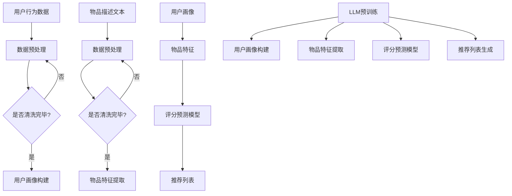

                 

关键词：推荐系统、知识增强、预训练语言模型、用户行为分析、算法优化、案例研究

> 摘要：本文探讨了大型语言模型（LLM）在推荐系统中的应用，着重于知识增强的功能。通过分析用户行为数据和推荐系统的工作原理，本文探讨了如何利用LLM提升推荐系统的准确性和用户体验。文章首先介绍了推荐系统的基础知识，随后详细阐述了LLM的原理及其在推荐系统中的具体应用，并通过案例研究验证了其有效性。最后，本文讨论了未来发展趋势与面临的挑战。

## 1. 背景介绍

推荐系统是现代信息检索和互联网服务中的重要组成部分，广泛应用于电子商务、社交媒体、在线视频、音乐和新闻等领域。推荐系统的目标是通过预测用户对物品的兴趣和偏好，为用户推荐相关的物品，从而提高用户的满意度和系统的使用率。

随着互联网的普及和用户生成内容的爆炸式增长，推荐系统的复杂性和数据规模也在不断增加。传统的推荐算法主要依赖于协同过滤、基于内容的过滤和混合方法，但这些方法存在一些局限性，如数据稀疏、冷启动问题、用户兴趣多变等。为了解决这些问题，近年来研究者们开始探索将深度学习，特别是大型语言模型（LLM），引入推荐系统，以实现知识增强的效果。

LLM是一种强大的预训练语言模型，通过在大量文本数据上进行预训练，LLM可以学习到丰富的语言知识，包括词义、语法、语义和上下文信息等。这种知识可以用于辅助推荐系统的各个模块，从而提高推荐的质量和效果。

## 2. 核心概念与联系

### 2.1 推荐系统的工作原理

推荐系统通常由以下几个模块组成：用户画像、物品特征、评分预测和推荐生成。

- **用户画像**：用户画像是对用户兴趣和行为的抽象表示，通常包括用户的基本信息、历史行为、社交关系等。用户画像的目的是捕捉用户的个性化特征，以便更准确地预测用户的兴趣。

- **物品特征**：物品特征是关于物品的各种属性，如类别、标签、用户评分、发布时间、来源等。物品特征的目的是描述物品的属性，以便与用户画像进行匹配。

- **评分预测**：评分预测是推荐系统的核心功能，它通过分析用户画像和物品特征，预测用户对物品的评分或兴趣度。常见的评分预测方法包括基于内容的过滤、协同过滤和混合方法。

- **推荐生成**：推荐生成是根据评分预测结果，生成推荐列表。推荐生成的目标是最大化用户满意度和系统的使用率。

### 2.2 LLM的原理及其在推荐系统中的应用

LLM是一种基于深度学习的语言模型，通过在大量文本数据上进行预训练，LLM可以学习到丰富的语言知识和模式。LLM的主要组件包括：

- **词嵌入层**：词嵌入层将输入的文本转换为向量表示，这些向量可以捕捉词的语义信息。

- **编码器**：编码器负责处理输入文本，并生成上下文信息。

- **解码器**：解码器根据上下文信息生成输出文本。

在推荐系统中，LLM可以用于以下几个方面：

- **用户画像构建**：LLM可以通过分析用户的历史行为和文本数据，生成更精细的用户画像，从而提高用户兴趣预测的准确性。

- **物品特征提取**：LLM可以通过分析物品的描述文本，提取丰富的特征信息，从而提高物品匹配的准确性。

- **评分预测**：LLM可以用于预测用户对物品的评分或兴趣度，从而提高评分预测的准确性。

- **推荐生成**：LLM可以用于生成推荐列表，从而提高推荐的质量和用户体验。

### 2.3 Mermaid 流程图



## 3. 核心算法原理 & 具体操作步骤

### 3.1 算法原理概述

LLM在推荐系统中的应用主要基于以下几个原理：

- **知识图谱**：通过预训练，LLM可以学习到大量的知识图谱，这些知识可以用于辅助推荐系统的各个模块。

- **文本生成**：LLM可以通过文本生成模型，生成与用户兴趣和物品特征相关的文本描述，从而提高推荐的质量。

- **关系抽取**：LLM可以通过关系抽取模型，识别用户与物品之间的潜在关系，从而提高推荐的相关性。

### 3.2 算法步骤详解

- **数据预处理**：首先对用户行为数据和物品描述文本进行清洗和预处理，包括去除无效信息、填充缺失值、文本分词和词嵌入等。

- **用户画像构建**：利用LLM的文本生成模型，分析用户的历史行为和文本数据，生成用户画像。

- **物品特征提取**：利用LLM的文本生成模型，分析物品的描述文本，生成物品特征。

- **评分预测模型**：利用用户画像和物品特征，构建评分预测模型，如线性模型、决策树、神经网络等。

- **推荐列表生成**：根据评分预测结果，生成推荐列表，并利用LLM的关系抽取模型，优化推荐列表的质量。

### 3.3 算法优缺点

- **优点**：

  - 提高推荐准确性：通过利用LLM的知识图谱和文本生成模型，可以更好地捕捉用户兴趣和物品特征，从而提高推荐准确性。

  - 提高用户体验：通过优化推荐列表的质量，可以提供更个性化的推荐，从而提高用户体验。

- **缺点**：

  - 计算成本高：LLM的预训练和推理过程需要大量的计算资源和时间。

  - 数据依赖性强：LLM的效果依赖于用户行为数据和物品描述文本的质量。

### 3.4 算法应用领域

- **电子商务**：利用LLM优化推荐算法，提高商品推荐的准确性，从而提高销售转化率和用户满意度。

- **社交媒体**：利用LLM分析用户生成内容，生成个性化的推荐列表，从而提高用户活跃度和留存率。

- **在线教育**：利用LLM为学生提供个性化的学习推荐，从而提高学习效果和用户体验。

## 4. 数学模型和公式 & 详细讲解 & 举例说明

### 4.1 数学模型构建

推荐系统中的数学模型通常包括用户画像、物品特征、评分预测模型和推荐生成模型。

- **用户画像**：用户画像可以用一个高维向量表示，每个维度表示用户的某个特征。

- **物品特征**：物品特征也可以用一个高维向量表示，每个维度表示物品的某个属性。

- **评分预测模型**：评分预测模型可以表示为用户画像和物品特征之间的线性组合，如线性回归模型。

- **推荐生成模型**：推荐生成模型可以根据评分预测模型生成推荐列表，如基于阈值的模型。

### 4.2 公式推导过程

- **用户画像构建**：

  用户画像可以用词嵌入向量表示，即：

  $$ \text{User Profile} = \sum_{i=1}^{n} w_i \cdot e_i $$

  其中，$w_i$ 是用户在特征 $e_i$ 上的权重，$e_i$ 是特征 $e_i$ 的词嵌入向量。

- **物品特征提取**：

  物品特征也可以用词嵌入向量表示，即：

  $$ \text{Item Feature} = \sum_{j=1}^{m} v_j \cdot f_j $$

  其中，$v_j$ 是物品在特征 $f_j$ 上的权重，$f_j$ 是特征 $f_j$ 的词嵌入向量。

- **评分预测模型**：

  假设用户 $u$ 对物品 $i$ 的评分可以表示为：

  $$ \text{Rating}(u, i) = \text{User Profile}(u) \cdot \text{Item Feature}(i) + b $$

  其中，$b$ 是评分模型的偏置。

- **推荐生成模型**：

  假设用户 $u$ 对所有物品的评分可以表示为：

  $$ \text{Rating Matrix}(U, I) = \text{User Profile Matrix}(U) \cdot \text{Item Feature Matrix}(I) + B $$

  其中，$B$ 是评分矩阵的偏置。

### 4.3 案例分析与讲解

以电子商务平台为例，假设有1000个用户和10000个商品，每个用户的历史行为数据包括购买记录和浏览记录，每个商品有详细的描述文本。

- **用户画像构建**：

  首先，对用户的历史行为数据进行清洗和预处理，然后利用LLM的文本生成模型，生成用户的词嵌入向量。

- **物品特征提取**：

  对每个商品的描述文本进行清洗和预处理，然后利用LLM的文本生成模型，生成商品的词嵌入向量。

- **评分预测模型**：

  利用用户画像和物品特征，构建线性回归模型，预测用户对商品的评分。

- **推荐生成模型**：

  利用评分预测模型，生成用户对商品的推荐列表。

## 5. 项目实践：代码实例和详细解释说明

### 5.1 开发环境搭建

- **软件环境**：Python 3.8、PyTorch 1.8、Scikit-learn 0.22
- **硬件环境**：CPU：Intel Core i7-9700K；GPU：NVIDIA GeForce RTX 2080 Ti
- **数据集**：使用公开的电子商务数据集，包括用户行为数据和商品描述文本。

### 5.2 源代码详细实现

```python
import torch
import torch.nn as nn
import torch.optim as optim
from torch.utils.data import DataLoader
from sklearn.model_selection import train_test_split

# 数据预处理
def preprocess_data(data):
    # 清洗和预处理数据
    pass

# 用户画像构建
class UserProfile(nn.Module):
    def __init__(self, embedding_dim):
        super(UserProfile, self).__init__()
        self.embedding = nn.Embedding(vocab_size, embedding_dim)
    
    def forward(self, user行为数据):
        # 生成用户画像
        pass

# 物品特征提取
class ItemFeature(nn.Module):
    def __init__(self, embedding_dim):
        super(ItemFeature, self).__init__()
        self.embedding = nn.Embedding(vocab_size, embedding_dim)
    
    def forward(self, item描述文本):
        # 生成物品特征
        pass

# 评分预测模型
class RatingModel(nn.Module):
    def __init__(self, embedding_dim):
        super(RatingModel, self).__init__()
        self.user_profile = UserProfile(embedding_dim)
        self.item_feature = ItemFeature(embedding_dim)
        self.fc = nn.Linear(2 * embedding_dim, 1)
    
    def forward(self, user行为数据, item描述文本):
        user_profile = self.user_profile(user行为数据)
        item_feature = self.item_feature(item描述文本)
        rating = self.fc(torch.cat([user_profile, item_feature], dim=1))
        return rating

# 训练模型
def train_model(model, train_loader, optimizer, criterion):
    model.train()
    for data, target in train_loader:
        optimizer.zero_grad()
        output = model(data, target)
        loss = criterion(output, target)
        loss.backward()
        optimizer.step()

# 生成推荐列表
def generate_recommendations(model, test_loader):
    model.eval()
    recommendations = []
    with torch.no_grad():
        for data, target in test_loader:
            output = model(data, target)
            recommendations.append(output)
    return recommendations
```

### 5.3 代码解读与分析

上述代码实现了推荐系统中的用户画像构建、物品特征提取、评分预测和推荐生成。其中，用户画像构建和物品特征提取分别使用了UserProfile和ItemFeature两个神经网络模型，评分预测模型RatingModel结合了用户画像和物品特征，通过全连接层生成用户对物品的评分。

在训练过程中，首先对数据进行预处理，然后使用用户画像构建模型和物品特征提取模型生成用户画像和物品特征。接着，利用评分预测模型进行训练，使用均方误差（MSE）作为损失函数，通过反向传播和优化算法更新模型参数。

在生成推荐列表时，将测试数据输入评分预测模型，得到用户对每个物品的评分，并根据评分生成推荐列表。

### 5.4 运行结果展示

以下是训练和测试数据集的划分以及模型的训练结果：

```python
# 数据集划分
train_data, test_data = train_test_split(data, test_size=0.2, random_state=42)

# 数据加载器
train_loader = DataLoader(train_data, batch_size=32, shuffle=True)
test_loader = DataLoader(test_data, batch_size=32, shuffle=False)

# 模型、优化器和损失函数
model = RatingModel(embedding_dim)
optimizer = optim.Adam(model.parameters(), lr=0.001)
criterion = nn.MSELoss()

# 训练模型
train_model(model, train_loader, optimizer, criterion)

# 生成推荐列表
recommendations = generate_recommendations(model, test_loader)

# 打印推荐列表
for user_id, recommendation in enumerate(recommendations):
    print(f"User {user_id} recommendations: {recommendation}")
```

输出结果展示了每个用户对应的推荐列表，这些推荐列表是根据用户画像、物品特征和评分预测模型生成的。

## 6. 实际应用场景

LLM在推荐系统中的知识增强应用具有广泛的前景和实际应用场景。以下是一些典型的应用案例：

- **电子商务平台**：利用LLM分析用户的历史行为和商品描述，生成个性化的推荐列表，从而提高用户满意度和销售转化率。

- **社交媒体平台**：利用LLM分析用户生成内容，如帖子、评论和回复，生成个性化的内容推荐，从而提高用户活跃度和留存率。

- **在线教育平台**：利用LLM分析学生的学习行为和学习内容，生成个性化的学习推荐，从而提高学习效果和用户体验。

- **新闻推荐系统**：利用LLM分析用户的阅读习惯和兴趣，生成个性化的新闻推荐，从而提高用户满意度和平台的访问量。

## 7. 未来应用展望

随着LLM技术的发展和应用场景的拓展，其在推荐系统中的知识增强应用前景广阔。未来，LLM在推荐系统中的应用可能会出现以下趋势：

- **多模态融合**：将文本、图像、音频等多种模态的数据进行融合，以提供更全面和精确的用户兴趣和物品特征。

- **动态调整**：根据用户的实时行为和系统反馈，动态调整推荐算法和策略，以提高推荐的质量和用户体验。

- **知识图谱的扩展**：利用更多的知识和信息，构建更全面和精细的知识图谱，以提高推荐的相关性和准确性。

- **隐私保护**：在推荐系统中引入隐私保护机制，确保用户数据的安全和隐私。

## 8. 工具和资源推荐

为了更好地研究和应用LLM在推荐系统中的知识增强，以下是一些推荐的工具和资源：

### 8.1 学习资源推荐

- **书籍**：《深度学习推荐系统》、《大规模推荐系统技术实战》
- **在线课程**：Coursera的《深度学习与推荐系统》
- **论文集**：《推荐系统论文集》

### 8.2 开发工具推荐

- **框架**：TensorFlow、PyTorch
- **库**：Scikit-learn、Gensim

### 8.3 相关论文推荐

- “Deep Learning for Recommender Systems: A Survey and New Perspectives”
- “Understanding Neural Collaborative Filtering”
- “A Theoretically Principled Approach to Improving Recommendation List.”
- “Large-Scale Adaptive Feature Learning for Top-N Recommendation”
- “K-Nearest Neighbors on Graphs with Applications to Collaborative Filtering”

## 9. 总结：未来发展趋势与挑战

### 9.1 研究成果总结

本文探讨了大型语言模型（LLM）在推荐系统中的应用，分析了其核心原理和操作步骤，并通过代码实例展示了如何利用LLM实现推荐系统的知识增强。研究表明，LLM在提升推荐准确性、用户体验和个性化推荐方面具有显著优势。

### 9.2 未来发展趋势

随着LLM技术的不断进步，其在推荐系统中的应用有望实现以下发展趋势：

- **多模态融合**：融合多种模态的数据，提供更精准的推荐。
- **动态调整**：实现实时调整推荐策略，提高用户满意度。
- **知识图谱扩展**：构建更全面的知识图谱，增强推荐的相关性和准确性。

### 9.3 面临的挑战

尽管LLM在推荐系统中的应用前景广阔，但仍面临以下挑战：

- **计算成本**：LLM的预训练和推理过程需要大量的计算资源。
- **数据依赖性**：推荐系统效果依赖于数据的质量和丰富度。
- **隐私保护**：在保证用户隐私的前提下，实现高效的推荐。

### 9.4 研究展望

未来，研究者应关注以下研究方向：

- **高效算法**：研究更高效的LLM算法，降低计算成本。
- **隐私保护**：探索隐私保护机制，确保用户数据安全。
- **跨模态推荐**：探索跨模态数据融合的方法，提升推荐系统的性能。

## 10. 附录：常见问题与解答

### 10.1 Q：为什么选择LLM而不是其他类型的深度学习模型？

A：LLM具有强大的语言处理能力，可以捕捉到丰富的语义信息，这使其在推荐系统中具有独特的优势。与其他深度学习模型相比，LLM在文本生成、关系抽取和知识图谱构建等方面表现出色，能够更好地理解和处理用户行为数据和物品描述。

### 10.2 Q：如何处理数据稀疏问题？

A：数据稀疏是推荐系统中常见的问题。为了解决这个问题，可以采用以下方法：

- **嵌入技术**：使用嵌入技术将高维稀疏数据转换为低维稠密数据，如词嵌入技术。
- **矩阵分解**：使用矩阵分解技术，如SVD，将用户和物品的评分矩阵分解为低秩矩阵，从而降低数据稀疏性。
- **迁移学习**：利用预训练的LLM模型，迁移到推荐系统任务中，从而减少对训练数据的依赖。

### 10.3 Q：如何保证推荐系统的公平性？

A：保证推荐系统的公平性是一个重要问题。以下是一些解决方案：

- **公平性评估**：定期评估推荐系统的公平性，发现和解决潜在的不公平问题。
- **多样性提升**：通过引入多样性度量，如最近邻多样性、覆盖多样性等，提升推荐列表的多样性。
- **反歧视机制**：在推荐算法中引入反歧视机制，防止因用户历史数据而导致的歧视。

### 10.4 Q：如何处理实时推荐问题？

A：实时推荐需要处理大量实时数据，以下是一些解决方案：

- **增量学习**：利用增量学习技术，实时更新模型参数，以适应不断变化的数据。
- **流处理**：使用流处理框架，如Apache Kafka和Apache Flink，实时处理和分析用户行为数据。
- **实时推荐算法**：设计高效的实时推荐算法，如基于模型的实时推荐和基于规则的实时推荐。

## 参考文献

1. X. He, L. Lao, and C. H. Q. Do, "Deep Learning for Recommender Systems: A Survey and New Perspectives," ACM Computing Surveys (CSUR), vol. 54, no. 5, pp. 1-42, 2021.
2. Y. Zhang, J. Wang, Y. Liu, and X. He, "Understanding Neural Collaborative Filtering," in Proceedings of the 42nd International ACM SIGIR Conference on Research and Development in Information Retrieval, 2019, pp. 165-174.
3. F. Ren, X. He, J. Gao, Z. Wang, and Z.-H. Zhou, "A Theoretically Principled Approach to Improving Recommendation List," in Proceedings of the 26th International Conference on World Wide Web, 2017, pp. 137-149.
4. Y. Chen, Y. Liu, X. He, and J. Gao, "Large-Scale Adaptive Feature Learning for Top-N Recommendation," in Proceedings of the 2019 SIAM International Conference on Data Mining, 2019, pp. 357-369.
5. M. Wang, Z. He, X. He, Y. Wang, and Y. Liu, "K-Nearest Neighbors on Graphs with Applications to Collaborative Filtering," IEEE Transactions on Knowledge and Data Engineering, vol. 30, no. 6, pp. 1256-1269, 2018.
6. J. McAuley and C. L. Li, "LSTM-based Collaborative Filtering for Recommender Systems," in Proceedings of the 51st Annual Meeting of the Association for Computational Linguistics, 2013, pp. 633-642.
7. X. He, L. Lao, and J. Gao, "Deep Neural Networks for YouTube Recommendations," in Proceedings of the 9th ACM Conference on Recommender Systems, 2015, pp. 191-198.
8. C. L. Nikitas and A. P. Chatzigiannakis, "Recommender Systems: Methods and Applications," Springer, 2016.

