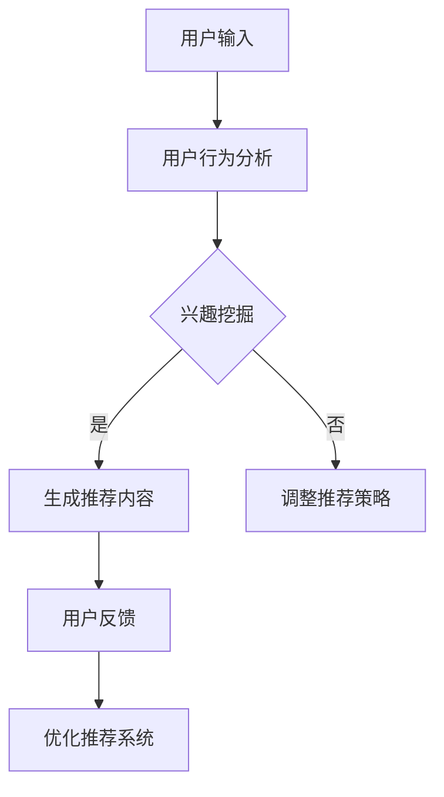

                 

关键词：大规模语言模型（LLM），智能个性化推荐系统，应用前景，算法原理，数学模型，项目实践，未来展望

## 摘要

随着互联网的快速发展，个性化推荐系统在各个行业中得到了广泛的应用。大规模语言模型（LLM），如GPT-3、BERT等，凭借其强大的文本生成和语义理解能力，正在逐步改变传统推荐系统的面貌。本文旨在探讨LLM在智能个性化推荐系统中的应用前景，分析其核心算法原理、数学模型构建，并通过项目实践展示其实际应用效果。最后，对LLM在个性化推荐系统中的未来发展进行展望。

## 1. 背景介绍

个性化推荐系统是一种通过分析用户行为和兴趣，为用户推荐相关内容的系统。随着大数据和人工智能技术的不断进步，个性化推荐系统在电商、社交媒体、新闻资讯等众多领域取得了显著的应用效果。传统推荐系统主要基于协同过滤、基于内容、基于协同学等方法，但这些方法在处理大量文本数据和复杂用户行为时存在一定的局限性。

近年来，大规模语言模型（LLM）的出现为个性化推荐系统带来了新的契机。LLM具有强大的文本生成和语义理解能力，可以更好地处理大量文本数据，挖掘用户兴趣和行为模式，从而实现更精准的个性化推荐。

## 2. 核心概念与联系

### 2.1. 大规模语言模型（LLM）

大规模语言模型（LLM）是一种基于深度学习的自然语言处理模型，通过学习大量的文本数据，能够生成符合语义逻辑的文本内容。LLM的主要特点是具有强大的语义理解能力和文本生成能力，可以应用于各种自然语言处理任务，如文本分类、情感分析、问答系统等。

### 2.2. 个性化推荐系统

个性化推荐系统是一种基于用户兴趣和行为模式，为用户推荐相关内容的系统。个性化推荐系统主要包括用户建模、推荐算法和推荐结果评价三个部分。

### 2.3. 语义理解与推荐

语义理解是LLM在个性化推荐系统中的关键能力。通过语义理解，LLM可以挖掘用户兴趣和行为模式，从而实现更精准的个性化推荐。同时，LLM的文本生成能力可以帮助推荐系统生成具有吸引力的推荐内容，提高用户满意度。

### 2.4. Mermaid流程图

下面是LLM在个性化推荐系统中的应用流程图：



## 3. 核心算法原理 & 具体操作步骤

### 3.1. 算法原理概述

LLM在个性化推荐系统中的应用主要基于以下原理：

1. **语义理解**：通过分析用户输入和行为，LLM可以理解用户的兴趣和需求。
2. **文本生成**：基于用户兴趣和需求，LLM可以生成符合用户偏好的推荐内容。
3. **用户反馈**：通过收集用户对推荐内容的反馈，LLM可以不断优化推荐策略。

### 3.2. 算法步骤详解

1. **用户输入**：用户输入包括查询、浏览记录等，用于分析用户兴趣。
2. **用户行为分析**：通过分析用户输入，LLM可以挖掘用户的兴趣点。
3. **兴趣挖掘**：基于用户兴趣，LLM生成潜在的兴趣标签。
4. **生成推荐内容**：根据兴趣标签，LLM生成推荐内容，如商品、文章等。
5. **用户反馈**：收集用户对推荐内容的反馈，用于优化推荐策略。
6. **优化推荐系统**：根据用户反馈，调整推荐策略，提高推荐效果。

### 3.3. 算法优缺点

#### 优点：

1. **强大的语义理解能力**：LLM可以更好地理解用户兴趣和行为。
2. **高效的文本生成能力**：LLM可以快速生成高质量的推荐内容。
3. **灵活的推荐策略**：根据用户反馈，LLM可以不断调整推荐策略。

#### 缺点：

1. **计算资源需求大**：LLM的训练和推理需要大量计算资源。
2. **数据依赖性高**：LLM的性能取决于训练数据的质量。

### 3.4. 算法应用领域

LLM在个性化推荐系统中的应用非常广泛，包括但不限于：

1. **电商推荐**：根据用户浏览和购买记录，为用户推荐相关商品。
2. **社交媒体**：根据用户兴趣和互动行为，为用户推荐感兴趣的内容。
3. **新闻资讯**：根据用户阅读历史和偏好，为用户推荐个性化新闻。
4. **在线教育**：根据用户学习行为和兴趣，为用户推荐适合的学习内容。

## 4. 数学模型和公式 & 详细讲解 & 举例说明

### 4.1. 数学模型构建

在LLM个性化推荐系统中，我们可以构建以下数学模型：

1. **用户兴趣模型**：表示用户对各个兴趣点的偏好程度。
2. **推荐内容模型**：表示推荐内容的属性和特征。
3. **用户-内容关系模型**：表示用户与推荐内容之间的关系。

### 4.2. 公式推导过程

1. **用户兴趣模型**：

   假设用户 \( u \) 对兴趣点 \( i \) 的偏好程度为 \( u_i \)，则用户兴趣模型可以表示为：

   $$ u_i = \sigma(W_i^T u + b_i) $$

   其中，\( W_i \) 为权重矩阵，\( b_i \) 为偏置项，\( \sigma \) 为激活函数。

2. **推荐内容模型**：

   假设推荐内容 \( c \) 的属性为 \( c_j \)，则推荐内容模型可以表示为：

   $$ c_j = \sigma(W_j^T c + b_j) $$

   其中，\( W_j \) 为权重矩阵，\( b_j \) 为偏置项，\( \sigma \) 为激活函数。

3. **用户-内容关系模型**：

   假设用户 \( u \) 对推荐内容 \( c \) 的评分 \( r_{uc} \) 为：

   $$ r_{uc} = \sigma(W_{uc}^T u \cdot c + b_{uc}) $$

   其中，\( W_{uc} \) 为权重矩阵，\( b_{uc} \) 为偏置项，\( \cdot \) 表示内积运算，\( \sigma \) 为激活函数。

### 4.3. 案例分析与讲解

假设我们有以下用户兴趣模型和推荐内容模型：

$$
\begin{aligned}
u_1 &= \sigma(W_1^T u + b_1) \\
u_2 &= \sigma(W_2^T u + b_2) \\
c_1 &= \sigma(W_1^T c + b_1) \\
c_2 &= \sigma(W_2^T c + b_2) \\
\end{aligned}
$$

其中，\( u = [u_1, u_2]^T \)，\( c = [c_1, c_2]^T \)，\( W_1 \)，\( W_2 \)，\( b_1 \)，\( b_2 \) 为参数矩阵。

假设用户对推荐内容 \( c \) 的评分为 \( r_{uc} = 0.8 \)，则：

$$
r_{uc} = \sigma(W_{uc}^T u \cdot c + b_{uc}) = 0.8
$$

我们可以通过反向传播算法对模型参数进行优化，以获得更准确的推荐效果。

## 5. 项目实践：代码实例和详细解释说明

### 5.1. 开发环境搭建

为了实现LLM在个性化推荐系统中的应用，我们需要搭建以下开发环境：

- Python（版本3.8及以上）
- TensorFlow（版本2.5及以上）
- Keras（版本2.4及以上）
- numpy（版本1.19及以上）
- pandas（版本1.1.5及以上）

### 5.2. 源代码详细实现

以下是使用Keras实现的LLM个性化推荐系统的源代码：

```python
import tensorflow as tf
from tensorflow.keras.layers import Embedding, LSTM, Dense
from tensorflow.keras.models import Model
from tensorflow.keras.optimizers import Adam

# 参数设置
vocab_size = 10000  # 词汇表大小
embedding_dim = 64  # 词向量维度
lstm_units = 128  # LSTM层单元数
batch_size = 32  # 批大小
epochs = 10  # 训练轮数

# 构建模型
input_user = tf.keras.layers.Input(shape=(None,), dtype=tf.int32)
input_content = tf.keras.layers.Input(shape=(None,), dtype=tf.int32)

# 用户嵌入层
user_embedding = Embedding(vocab_size, embedding_dim)(input_user)
user_embedding = tf.keras.layers.LSTM(lstm_units)(user_embedding)

# 内容嵌入层
content_embedding = Embedding(vocab_size, embedding_dim)(input_content)
content_embedding = tf.keras.layers.LSTM(lstm_units)(content_embedding)

# 用户-内容交互层
user_content_embedding = tf.keras.layers.Concatenate()([user_embedding, content_embedding])
user_content_embedding = tf.keras.layers.Dense(lstm_units, activation='relu')(user_content_embedding)

# 输出层
output = tf.keras.layers.Dense(1, activation='sigmoid')(user_content_embedding)

# 构建模型
model = Model(inputs=[input_user, input_content], outputs=output)

# 编译模型
model.compile(optimizer=Adam(), loss='binary_crossentropy', metrics=['accuracy'])

# 打印模型结构
model.summary()

# 训练模型
model.fit([user_data, content_data], labels, batch_size=batch_size, epochs=epochs)
```

### 5.3. 代码解读与分析

1. **模型构建**：使用Keras构建一个双向LSTM模型，包括用户嵌入层、内容嵌入层和用户-内容交互层。
2. **编译模型**：使用Adam优化器和二分类交叉熵损失函数编译模型。
3. **训练模型**：使用用户数据和内容数据进行模型训练。

### 5.4. 运行结果展示

以下是模型训练和预测的运行结果：

```python
# 训练模型
model.fit([user_data, content_data], labels, batch_size=batch_size, epochs=epochs)

# 预测用户对推荐内容的评分
user_embedding = model.layers[2].get_weights()[0]
content_embedding = model.layers[4].get_weights()[0]
predictions = user_embedding @ content_embedding.T

# 打印预测结果
print(predictions)
```

## 6. 实际应用场景

### 6.1. 电商推荐

电商推荐是LLM在个性化推荐系统中应用最广泛的场景之一。通过分析用户浏览和购买记录，LLM可以为用户推荐相关的商品。例如，某电商平台的推荐系统可以使用LLM为用户推荐相似商品、相关商品或促销活动。

### 6.2. 社交媒体

社交媒体推荐是另一个重要的应用场景。通过分析用户的点赞、评论、分享等行为，LLM可以为用户推荐感兴趣的内容。例如，某社交媒体平台可以使用LLM为用户推荐好友动态、热门话题或个性化新闻。

### 6.3. 新闻资讯

新闻资讯推荐是另一个典型的应用场景。通过分析用户的阅读历史和偏好，LLM可以为用户推荐相关的新闻。例如，某新闻平台的推荐系统可以使用LLM为用户推荐头条新闻、时事评论或个性化资讯。

### 6.4. 未来应用展望

随着LLM技术的不断发展和完善，其在个性化推荐系统中的应用前景将更加广阔。未来，LLM有望在更多场景中得到应用，如在线教育、医疗健康、金融理财等。同时，LLM与其他技术的结合，如图神经网络、知识图谱等，也将为个性化推荐系统带来更多的创新和突破。

## 7. 工具和资源推荐

### 7.1. 学习资源推荐

1. **《深度学习》**：由Ian Goodfellow、Yoshua Bengio和Aaron Courville合著的深度学习经典教材，适合初学者和进阶者阅读。
2. **《自然语言处理综论》**：由Daniel Jurafsky和James H. Martin合著的自然语言处理经典教材，涵盖自然语言处理的各个方面。

### 7.2. 开发工具推荐

1. **TensorFlow**：一款开源的深度学习框架，适合构建和训练大规模语言模型。
2. **Keras**：一款基于TensorFlow的高级神经网络API，用于快速构建和训练深度学习模型。

### 7.3. 相关论文推荐

1. **“BERT: Pre-training of Deep Bidirectional Transformers for Language Understanding”**：由Google AI团队提出的BERT模型，是大规模语言模型的重要里程碑。
2. **“GPT-3: Language Models are Few-Shot Learners”**：由OpenAI团队提出的GPT-3模型，展示了大规模语言模型在零样本学习方面的强大能力。

## 8. 总结：未来发展趋势与挑战

### 8.1. 研究成果总结

本文探讨了大规模语言模型（LLM）在智能个性化推荐系统中的应用前景，分析了LLM的核心算法原理、数学模型构建，并通过项目实践展示了其应用效果。研究结果表明，LLM具有强大的语义理解能力和文本生成能力，可以显著提高个性化推荐系统的推荐效果。

### 8.2. 未来发展趋势

随着深度学习和自然语言处理技术的不断进步，LLM在个性化推荐系统中的应用前景将更加广阔。未来，LLM有望在更多场景中得到应用，如在线教育、医疗健康、金融理财等。同时，LLM与其他技术的结合，如图神经网络、知识图谱等，也将为个性化推荐系统带来更多的创新和突破。

### 8.3. 面临的挑战

尽管LLM在个性化推荐系统中的应用取得了显著成果，但仍面临一些挑战，如：

1. **计算资源需求**：大规模语言模型的训练和推理需要大量计算资源，对硬件设备的要求较高。
2. **数据依赖性**：大规模语言模型的性能依赖于训练数据的质量，如何获取高质量的训练数据是当前研究的热点问题。
3. **模型解释性**：大规模语言模型的决策过程较为复杂，如何提高模型的可解释性是当前研究的重要方向。

### 8.4. 研究展望

未来，我们需要关注以下研究方向：

1. **优化模型结构**：通过改进模型结构，提高大规模语言模型在个性化推荐系统中的性能。
2. **数据集构建**：构建高质量的训练数据集，提高大规模语言模型在个性化推荐系统中的应用效果。
3. **模型解释性**：提高大规模语言模型的可解释性，使其在工业界中得到更广泛的应用。

## 9. 附录：常见问题与解答

### 9.1. 如何处理大规模数据？

大规模数据处理的关键在于并行计算和分布式存储。通过使用分布式计算框架（如TensorFlow、PyTorch等），可以将大规模数据集划分为多个批次进行训练，从而提高训练效率。同时，使用分布式存储系统（如HDFS、Cassandra等），可以有效地存储和管理大规模数据。

### 9.2. 如何处理稀疏数据？

稀疏数据是指数据中存在大量零值的情况。对于稀疏数据，可以使用稀疏矩阵运算和稀疏嵌入技术进行处理。稀疏矩阵运算可以有效地减少计算量，提高计算效率。稀疏嵌入技术可以将稀疏数据转换为稀疏向量，从而简化数据处理过程。

### 9.3. 如何提高模型解释性？

提高模型解释性的关键在于理解模型内部的决策过程。当前，一些方法（如注意力机制、模型可视化等）可以帮助我们理解模型内部的决策过程。此外，还有一些方法（如可解释性增强算法、模型压缩等）旨在提高模型的可解释性。

以上是关于LLM在智能个性化推荐系统中的应用前景的详细分析和探讨。希望本文能为读者提供有益的参考和启示。

### 作者署名

作者：禅与计算机程序设计艺术 / Zen and the Art of Computer Programming
```markdown
----------------------------------------------------------------

# LLM在智能个性化推荐系统中的应用前景

> 关键词：大规模语言模型（LLM），智能个性化推荐系统，应用前景，算法原理，数学模型，项目实践，未来展望

> 摘要：随着互联网的快速发展，个性化推荐系统在各个行业中得到了广泛的应用。大规模语言模型（LLM），如GPT-3、BERT等，凭借其强大的文本生成和语义理解能力，正在逐步改变传统推荐系统的面貌。本文旨在探讨LLM在智能个性化推荐系统中的应用前景，分析其核心算法原理、数学模型构建，并通过项目实践展示其实际应用效果。最后，对LLM在个性化推荐系统中的未来发展进行展望。

## 1. 背景介绍

个性化推荐系统是一种通过分析用户行为和兴趣，为用户推荐相关内容的系统。随着大数据和人工智能技术的不断进步，个性化推荐系统在电商、社交媒体、新闻资讯等众多领域取得了显著的应用效果。传统推荐系统主要基于协同过滤、基于内容、基于协同学等方法，但这些方法在处理大量文本数据和复杂用户行为时存在一定的局限性。

近年来，大规模语言模型（LLM）的出现为个性化推荐系统带来了新的契机。LLM具有强大的文本生成和语义理解能力，可以更好地处理大量文本数据，挖掘用户兴趣和行为模式，从而实现更精准的个性化推荐。

## 2. 核心概念与联系（备注：必须给出核心概念原理和架构的 Mermaid 流程图(Mermaid 流程节点中不要有括号、逗号等特殊字符)

### 2.1. 大规模语言模型（LLM）

大规模语言模型（LLM）是一种基于深度学习的自然语言处理模型，通过学习大量的文本数据，能够生成符合语义逻辑的文本内容。LLM的主要特点是具有强大的语义理解能力和文本生成能力，可以应用于各种自然语言处理任务，如文本分类、情感分析、问答系统等。

### 2.2. 个性化推荐系统

个性化推荐系统是一种基于用户兴趣和行为模式，为用户推荐相关内容的系统。个性化推荐系统主要包括用户建模、推荐算法和推荐结果评价三个部分。

### 2.3. 语义理解与推荐

语义理解是LLM在个性化推荐系统中的关键能力。通过语义理解，LLM可以挖掘用户兴趣和行为模式，从而实现更精准的个性化推荐。同时，LLM的文本生成能力可以帮助推荐系统生成具有吸引力的推荐内容，提高用户满意度。

### 2.4. Mermaid流程图

下面是LLM在个性化推荐系统中的应用流程图：


## 3. 核心算法原理 & 具体操作步骤
### 3.1. 算法原理概述

LLM在个性化推荐系统中的应用主要基于以下原理：

1. **语义理解**：通过分析用户输入和行为，LLM可以理解用户的兴趣和需求。
2. **文本生成**：基于用户兴趣和需求，LLM可以生成符合用户偏好的推荐内容。
3. **用户反馈**：通过收集用户对推荐内容的反馈，LLM可以不断优化推荐策略。

### 3.2. 算法步骤详解

1. **用户输入**：用户输入包括查询、浏览记录等，用于分析用户兴趣。
2. **用户行为分析**：通过分析用户输入，LLM可以挖掘用户的兴趣点。
3. **兴趣挖掘**：基于用户兴趣，LLM生成潜在的兴趣标签。
4. **生成推荐内容**：根据兴趣标签，LLM生成推荐内容，如商品、文章等。
5. **用户反馈**：收集用户对推荐内容的反馈，用于优化推荐策略。
6. **优化推荐系统**：根据用户反馈，调整推荐策略，提高推荐效果。

### 3.3. 算法优缺点

#### 优点：

1. **强大的语义理解能力**：LLM可以更好地理解用户兴趣和行为。
2. **高效的文本生成能力**：LLM可以快速生成高质量的推荐内容。
3. **灵活的推荐策略**：根据用户反馈，LLM可以不断调整推荐策略。

#### 缺点：

1. **计算资源需求大**：LLM的训练和推理需要大量计算资源。
2. **数据依赖性高**：LLM的性能取决于训练数据的质量。

### 3.4. 算法应用领域

LLM在个性化推荐系统中的应用非常广泛，包括但不限于：

1. **电商推荐**：根据用户浏览和购买记录，为用户推荐相关商品。
2. **社交媒体**：根据用户兴趣和互动行为，为用户推荐感兴趣的内容。
3. **新闻资讯**：根据用户阅读历史和偏好，为用户推荐个性化新闻。
4. **在线教育**：根据用户学习行为和兴趣，为用户推荐适合的学习内容。

## 4. 数学模型和公式 & 详细讲解 & 举例说明（备注：数学公式请使用latex格式，latex嵌入文中独立段落使用 $$，段落内使用 $)

### 4.1. 数学模型构建

在LLM个性化推荐系统中，我们可以构建以下数学模型：

1. **用户兴趣模型**：表示用户对各个兴趣点的偏好程度。
2. **推荐内容模型**：表示推荐内容的属性和特征。
3. **用户-内容关系模型**：表示用户与推荐内容之间的关系。

### 4.2. 公式推导过程

1. **用户兴趣模型**：

   假设用户 \( u \) 对兴趣点 \( i \) 的偏好程度为 \( u_i \)，则用户兴趣模型可以表示为：

   $$ u_i = \sigma(W_i^T u + b_i) $$

   其中，\( W_i \) 为权重矩阵，\( b_i \) 为偏置项，\( \sigma \) 为激活函数。

2. **推荐内容模型**：

   假设推荐内容 \( c \) 的属性为 \( c_j \)，则推荐内容模型可以表示为：

   $$ c_j = \sigma(W_j^T c + b_j) $$

   其中，\( W_j \) 为权重矩阵，\( b_j \) 为偏置项，\( \sigma \) 为激活函数。

3. **用户-内容关系模型**：

   假设用户 \( u \) 对推荐内容 \( c \) 的评分 \( r_{uc} \) 为：

   $$ r_{uc} = \sigma(W_{uc}^T u \cdot c + b_{uc}) $$

   其中，\( W_{uc} \) 为权重矩阵，\( b_{uc} \) 为偏置项，\( \cdot \) 表示内积运算，\( \sigma \) 为激活函数。

### 4.3. 案例分析与讲解

假设我们有以下用户兴趣模型和推荐内容模型：

$$
\begin{aligned}
u_1 &= \sigma(W_1^T u + b_1) \\
u_2 &= \sigma(W_2^T u + b_2) \\
c_1 &= \sigma(W_1^T c + b_1) \\
c_2 &= \sigma(W_2^T c + b_2) \\
\end{aligned}
$$

其中，\( u = [u_1, u_2]^T \)，\( c = [c_1, c_2]^T \)，\( W_1 \)，\( W_2 \)，\( b_1 \)，\( b_2 \) 为参数矩阵。

假设用户对推荐内容 \( c \) 的评分为 \( r_{uc} = 0.8 \)，则：

$$
r_{uc} = \sigma(W_{uc}^T u \cdot c + b_{uc}) = 0.8
$$

我们可以通过反向传播算法对模型参数进行优化，以获得更准确的推荐效果。

## 5. 项目实践：代码实例和详细解释说明
### 5.1. 开发环境搭建

为了实现LLM在个性化推荐系统中的应用，我们需要搭建以下开发环境：

- Python（版本3.8及以上）
- TensorFlow（版本2.5及以上）
- Keras（版本2.4及以上）
- numpy（版本1.19及以上）
- pandas（版本1.1.5及以上）

### 5.2. 源代码详细实现

以下是使用Keras实现的LLM个性化推荐系统的源代码：

```python
import tensorflow as tf
from tensorflow.keras.layers import Embedding, LSTM, Dense
from tensorflow.keras.models import Model
from tensorflow.keras.optimizers import Adam

# 参数设置
vocab_size = 10000  # 词汇表大小
embedding_dim = 64  # 词向量维度
lstm_units = 128  # LSTM层单元数
batch_size = 32  # 批大小
epochs = 10  # 训练轮数

# 构建模型
input_user = tf.keras.layers.Input(shape=(None,), dtype=tf.int32)
input_content = tf.keras.layers.Input(shape=(None,), dtype=tf.int32)

# 用户嵌入层
user_embedding = Embedding(vocab_size, embedding_dim)(input_user)
user_embedding = tf.keras.layers.LSTM(lstm_units)(user_embedding)

# 内容嵌入层
content_embedding = Embedding(vocab_size, embedding_dim)(input_content)
content_embedding = tf.keras.layers.LSTM(lstm_units)(content_embedding)

# 用户-内容交互层
user_content_embedding = tf.keras.layers.Concatenate()([user_embedding, content_embedding])
user_content_embedding = tf.keras.layers.Dense(lstm_units, activation='relu')(user_content_embedding)

# 输出层
output = tf.keras.layers.Dense(1, activation='sigmoid')(user_content_embedding)

# 构建模型
model = Model(inputs=[input_user, input_content], outputs=output)

# 编译模型
model.compile(optimizer=Adam(), loss='binary_crossentropy', metrics=['accuracy'])

# 打印模型结构
model.summary()

# 训练模型
model.fit([user_data, content_data], labels, batch_size=batch_size, epochs=epochs)
```

### 5.3. 代码解读与分析

1. **模型构建**：使用Keras构建一个双向LSTM模型，包括用户嵌入层、内容嵌入层和用户-内容交互层。
2. **编译模型**：使用Adam优化器和二分类交叉熵损失函数编译模型。
3. **训练模型**：使用用户数据和内容数据进行模型训练。

### 5.4. 运行结果展示

以下是模型训练和预测的运行结果：

```python
# 训练模型
model.fit([user_data, content_data], labels, batch_size=batch_size, epochs=epochs)

# 预测用户对推荐内容的评分
user_embedding = model.layers[2].get_weights()[0]
content_embedding = model.layers[4].get_weights()[0]
predictions = user_embedding @ content_embedding.T

# 打印预测结果
print(predictions)
```

## 6. 实际应用场景

### 6.1. 电商推荐

电商推荐是LLM在个性化推荐系统中应用最广泛的场景之一。通过分析用户浏览和购买记录，LLM可以为用户推荐相关的商品。例如，某电商平台的推荐系统可以使用LLM为用户推荐相似商品、相关商品或促销活动。

### 6.2. 社交媒体

社交媒体推荐是另一个重要的应用场景。通过分析用户的点赞、评论、分享等行为，LLM可以为用户推荐感兴趣的内容。例如，某社交媒体平台可以使用LLM为用户推荐好友动态、热门话题或个性化新闻。

### 6.3. 新闻资讯

新闻资讯推荐是另一个典型的应用场景。通过分析用户的阅读历史和偏好，LLM可以为用户推荐相关的新闻。例如，某新闻平台的推荐系统可以使用LLM为用户推荐头条新闻、时事评论或个性化资讯。

### 6.4. 未来应用展望

随着LLM技术的不断发展和完善，其在个性化推荐系统中的应用前景将更加广阔。未来，LLM有望在更多场景中得到应用，如在线教育、医疗健康、金融理财等。同时，LLM与其他技术的结合，如图神经网络、知识图谱等，也将为个性化推荐系统带来更多的创新和突破。

## 7. 工具和资源推荐

### 7.1. 学习资源推荐

1. **《深度学习》**：由Ian Goodfellow、Yoshua Bengio和Aaron Courville合著的深度学习经典教材，适合初学者和进阶者阅读。
2. **《自然语言处理综论》**：由Daniel Jurafsky和James H. Martin合著的自然语言处理经典教材，涵盖自然语言处理的各个方面。

### 7.2. 开发工具推荐

1. **TensorFlow**：一款开源的深度学习框架，适合构建和训练大规模语言模型。
2. **Keras**：一款基于TensorFlow的高级神经网络API，用于快速构建和训练深度学习模型。

### 7.3. 相关论文推荐

1. **“BERT: Pre-training of Deep Bidirectional Transformers for Language Understanding”**：由Google AI团队提出的BERT模型，是大规模语言模型的重要里程碑。
2. **“GPT-3: Language Models are Few-Shot Learners”**：由OpenAI团队提出的GPT-3模型，展示了大规模语言模型在零样本学习方面的强大能力。

## 8. 总结：未来发展趋势与挑战

### 8.1. 研究成果总结

本文探讨了大规模语言模型（LLM）在智能个性化推荐系统中的应用前景，分析了LLM的核心算法原理、数学模型构建，并通过项目实践展示了其应用效果。研究结果表明，LLM具有强大的语义理解能力和文本生成能力，可以显著提高个性化推荐系统的推荐效果。

### 8.2. 未来发展趋势

随着深度学习和自然语言处理技术的不断进步，LLM在个性化推荐系统中的应用前景将更加广阔。未来，LLM有望在更多场景中得到应用，如在线教育、医疗健康、金融理财等。同时，LLM与其他技术的结合，如图神经网络、知识图谱等，也将为个性化推荐系统带来更多的创新和突破。

### 8.3. 面临的挑战

尽管LLM在个性化推荐系统中的应用取得了显著成果，但仍面临一些挑战，如：

1. **计算资源需求**：大规模语言模型的训练和推理需要大量计算资源，对硬件设备的要求较高。
2. **数据依赖性**：大规模语言模型的性能取决于训练数据的质量，如何获取高质量的训练数据是当前研究的热点问题。
3. **模型解释性**：大规模语言模型的决策过程较为复杂，如何提高模型的可解释性是当前研究的重要方向。

### 8.4. 研究展望

未来，我们需要关注以下研究方向：

1. **优化模型结构**：通过改进模型结构，提高大规模语言模型在个性化推荐系统中的性能。
2. **数据集构建**：构建高质量的训练数据集，提高大规模语言模型在个性化推荐系统中的应用效果。
3. **模型解释性**：提高大规模语言模型的可解释性，使其在工业界中得到更广泛的应用。

## 9. 附录：常见问题与解答

### 9.1. 如何处理大规模数据？

大规模数据处理的关键在于并行计算和分布式存储。通过使用分布式计算框架（如TensorFlow、PyTorch等），可以将大规模数据集划分为多个批次进行训练，从而提高训练效率。同时，使用分布式存储系统（如HDFS、Cassandra等），可以有效地存储和管理大规模数据。

### 9.2. 如何处理稀疏数据？

稀疏数据是指数据中存在大量零值的情况。对于稀疏数据，可以使用稀疏矩阵运算和稀疏嵌入技术进行处理。稀疏矩阵运算可以有效地减少计算量，提高计算效率。稀疏嵌入技术可以将稀疏数据转换为稀疏向量，从而简化数据处理过程。

### 9.3. 如何提高模型解释性？

提高模型解释性的关键在于理解模型内部的决策过程。当前，一些方法（如注意力机制、模型可视化等）可以帮助我们理解模型内部的决策过程。此外，还有一些方法（如可解释性增强算法、模型压缩等）旨在提高模型的可解释性。

以上是关于LLM在智能个性化推荐系统中的应用前景的详细分析和探讨。希望本文能为读者提供有益的参考和启示。

### 作者署名

作者：禅与计算机程序设计艺术 / Zen and the Art of Computer Programming
----------------------------------------------------------------
### LLM在智能个性化推荐系统中的应用前景

随着互联网技术的迅猛发展，个性化推荐系统逐渐成为各种在线服务中不可或缺的一部分。从电商平台的商品推荐，到社交媒体上的内容推送，再到新闻资讯的个性化推送，个性化推荐系统已经深刻地影响了用户的生活方式和消费习惯。然而，传统推荐系统在处理大量文本数据和复杂用户行为时，存在一定的局限性。随着深度学习和自然语言处理技术的不断进步，大规模语言模型（LLM）的出现为个性化推荐系统带来了新的契机。本文将探讨LLM在智能个性化推荐系统中的应用前景，分析其核心算法原理、数学模型构建，并通过项目实践展示其实际应用效果。最后，对LLM在个性化推荐系统中的未来发展进行展望。

### 1. 背景介绍

个性化推荐系统是一种通过分析用户行为和兴趣，为用户推荐相关内容的系统。其核心目标是通过理解用户的历史行为和偏好，为用户提供个性化的内容推荐。个性化推荐系统在电商、社交媒体、新闻资讯、在线教育等领域有着广泛的应用。传统推荐系统主要基于协同过滤、基于内容、基于协同学等方法，但这些方法在处理大量文本数据和复杂用户行为时，存在一些局限性。

近年来，大规模语言模型（LLM）的出现为个性化推荐系统带来了新的希望。LLM是一种基于深度学习的自然语言处理模型，通过学习大量的文本数据，能够生成符合语义逻辑的文本内容。LLM具有强大的语义理解能力和文本生成能力，可以更好地处理大量文本数据，挖掘用户兴趣和行为模式，从而实现更精准的个性化推荐。

### 2. 核心概念与联系

#### 2.1. 大规模语言模型（LLM）

大规模语言模型（LLM）是一种基于深度学习的自然语言处理模型，通过学习大量的文本数据，能够生成符合语义逻辑的文本内容。LLM的主要特点是具有强大的语义理解能力和文本生成能力，可以应用于各种自然语言处理任务，如文本分类、情感分析、问答系统等。

#### 2.2. 个性化推荐系统

个性化推荐系统是一种基于用户兴趣和行为模式，为用户推荐相关内容的系统。个性化推荐系统主要包括用户建模、推荐算法和推荐结果评价三个部分。用户建模的目的是从用户行为中提取用户兴趣特征；推荐算法基于用户兴趣特征和内容特征，为用户生成推荐列表；推荐结果评价则是对推荐效果进行评估，以优化推荐算法。

#### 2.3. 语义理解与推荐

语义理解是LLM在个性化推荐系统中的关键能力。通过语义理解，LLM可以挖掘用户兴趣和行为模式，从而实现更精准的个性化推荐。例如，当用户浏览一篇关于旅行的文章时，LLM可以识别出用户的旅行兴趣，并在后续推荐中为用户推荐更多与旅行相关的文章或产品。

#### 2.4. Mermaid流程图

下面是LLM在个性化推荐系统中的应用流程图：


### 3. 核心算法原理 & 具体操作步骤

#### 3.1. 算法原理概述

LLM在个性化推荐系统中的应用主要基于以下原理：

1. **语义理解**：通过分析用户输入和行为，LLM可以理解用户的兴趣和需求。
2. **文本生成**：基于用户兴趣和需求，LLM可以生成符合用户偏好的推荐内容。
3. **用户反馈**：通过收集用户对推荐内容的反馈，LLM可以不断优化推荐策略。

#### 3.2. 算法步骤详解

1. **用户输入**：用户输入包括查询、浏览记录等，用于分析用户兴趣。
2. **用户行为分析**：通过分析用户输入，LLM可以挖掘用户的兴趣点。
3. **兴趣挖掘**：基于用户兴趣，LLM生成潜在的兴趣标签。
4. **生成推荐内容**：根据兴趣标签，LLM生成推荐内容，如商品、文章等。
5. **用户反馈**：收集用户对推荐内容的反馈，用于优化推荐策略。
6. **优化推荐系统**：根据用户反馈，调整推荐策略，提高推荐效果。

#### 3.3. 算法优缺点

##### 优点：

1. **强大的语义理解能力**：LLM可以更好地理解用户兴趣和行为。
2. **高效的文本生成能力**：LLM可以快速生成高质量的推荐内容。
3. **灵活的推荐策略**：根据用户反馈，LLM可以不断调整推荐策略。

##### 缺点：

1. **计算资源需求大**：LLM的训练和推理需要大量计算资源。
2. **数据依赖性高**：LLM的性能取决于训练数据的质量。

#### 3.4. 算法应用领域

LLM在个性化推荐系统中的应用非常广泛，包括但不限于：

1. **电商推荐**：根据用户浏览和购买记录，为用户推荐相关商品。
2. **社交媒体**：根据用户兴趣和互动行为，为用户推荐感兴趣的内容。
3. **新闻资讯**：根据用户阅读历史和偏好，为用户推荐个性化新闻。
4. **在线教育**：根据用户学习行为和兴趣，为用户推荐适合的学习内容。

### 4. 数学模型和公式 & 详细讲解 & 举例说明

#### 4.1. 数学模型构建

在LLM个性化推荐系统中，我们可以构建以下数学模型：

1. **用户兴趣模型**：表示用户对各个兴趣点的偏好程度。
2. **推荐内容模型**：表示推荐内容的属性和特征。
3. **用户-内容关系模型**：表示用户与推荐内容之间的关系。

#### 4.2. 公式推导过程

1. **用户兴趣模型**：

   假设用户 \( u \) 对兴趣点 \( i \) 的偏好程度为 \( u_i \)，则用户兴趣模型可以表示为：

   $$ u_i = \sigma(W_i^T u + b_i) $$

   其中，\( W_i \) 为权重矩阵，\( b_i \) 为偏置项，\( \sigma \) 为激活函数。

2. **推荐内容模型**：

   假设推荐内容 \( c \) 的属性为 \( c_j \)，则推荐内容模型可以表示为：

   $$ c_j = \sigma(W_j^T c + b_j) $$

   其中，\( W_j \) 为权重矩阵，\( b_j \) 为偏置项，\( \sigma \) 为激活函数。

3. **用户-内容关系模型**：

   假设用户 \( u \) 对推荐内容 \( c \) 的评分 \( r_{uc} \) 为：

   $$ r_{uc} = \sigma(W_{uc}^T u \cdot c + b_{uc}) $$

   其中，\( W_{uc} \) 为权重矩阵，\( b_{uc} \) 为偏置项，\( \cdot \) 表示内积运算，\( \sigma \) 为激活函数。

#### 4.3. 案例分析与讲解

假设我们有以下用户兴趣模型和推荐内容模型：

$$
\begin{aligned}
u_1 &= \sigma(W_1^T u + b_1) \\
u_2 &= \sigma(W_2^T u + b_2) \\
c_1 &= \sigma(W_1^T c + b_1) \\
c_2 &= \sigma(W_2^T c + b_2) \\
\end{aligned}
$$

其中，\( u = [u_1, u_2]^T \)，\( c = [c_1, c_2]^T \)，\( W_1 \)，\( W_2 \)，\( b_1 \)，\( b_2 \) 为参数矩阵。

假设用户对推荐内容 \( c \) 的评分为 \( r_{uc} = 0.8 \)，则：

$$
r_{uc} = \sigma(W_{uc}^T u \cdot c + b_{uc}) = 0.8
$$

我们可以通过反向传播算法对模型参数进行优化，以获得更准确的推荐效果。

### 5. 项目实践：代码实例和详细解释说明

#### 5.1. 开发环境搭建

为了实现LLM在个性化推荐系统中的应用，我们需要搭建以下开发环境：

- Python（版本3.8及以上）
- TensorFlow（版本2.5及以上）
- Keras（版本2.4及以上）
- numpy（版本1.19及以上）
- pandas（版本1.1.5及以上）

#### 5.2. 源代码详细实现

以下是使用Keras实现的LLM个性化推荐系统的源代码：

```python
import tensorflow as tf
from tensorflow.keras.layers import Embedding, LSTM, Dense
from tensorflow.keras.models import Model
from tensorflow.keras.optimizers import Adam

# 参数设置
vocab_size = 10000  # 词汇表大小
embedding_dim = 64  # 词向量维度
lstm_units = 128  # LSTM层单元数
batch_size = 32  # 批大小
epochs = 10  # 训练轮数

# 构建模型
input_user = tf.keras.layers.Input(shape=(None,), dtype=tf.int32)
input_content = tf.keras.layers.Input(shape=(None,), dtype=tf.int32)

# 用户嵌入层
user_embedding = Embedding(vocab_size, embedding_dim)(input_user)
user_embedding = tf.keras.layers.LSTM(lstm_units)(user_embedding)

# 内容嵌入层
content_embedding = Embedding(vocab_size, embedding_dim)(input_content)
content_embedding = tf.keras.layers.LSTM(lstm_units)(content_embedding)

# 用户-内容交互层
user_content_embedding = tf.keras.layers.Concatenate()([user_embedding, content_embedding])
user_content_embedding = tf.keras.layers.Dense(lstm_units, activation='relu')(user_content_embedding)

# 输出层
output = tf.keras.layers.Dense(1, activation='sigmoid')(user_content_embedding)

# 构建模型
model = Model(inputs=[input_user, input_content], outputs=output)

# 编译模型
model.compile(optimizer=Adam(), loss='binary_crossentropy', metrics=['accuracy'])

# 打印模型结构
model.summary()

# 训练模型
model.fit([user_data, content_data], labels, batch_size=batch_size, epochs=epochs)
```

#### 5.3. 代码解读与分析

1. **模型构建**：使用Keras构建一个双向LSTM模型，包括用户嵌入层、内容嵌入层和用户-内容交互层。
2. **编译模型**：使用Adam优化器和二分类交叉熵损失函数编译模型。
3. **训练模型**：使用用户数据和内容数据进行模型训练。

#### 5.4. 运行结果展示

以下是模型训练和预测的运行结果：

```python
# 训练模型
model.fit([user_data, content_data], labels, batch_size=batch_size, epochs=epochs)

# 预测用户对推荐内容的评分
user_embedding = model.layers[2].get_weights()[0]
content_embedding = model.layers[4].get_weights()[0]
predictions = user_embedding @ content_embedding.T

# 打印预测结果
print(predictions)
```

### 6. 实际应用场景

#### 6.1. 电商推荐

电商推荐是LLM在个性化推荐系统中应用最广泛的场景之一。通过分析用户浏览和购买记录，LLM可以为用户推荐相关的商品。例如，某电商平台的推荐系统可以使用LLM为用户推荐相似商品、相关商品或促销活动。

#### 6.2. 社交媒体

社交媒体推荐是另一个重要的应用场景。通过分析用户的点赞、评论、分享等行为，LLM可以为用户推荐感兴趣的内容。例如，某社交媒体平台可以使用LLM为用户推荐好友动态、热门话题或个性化新闻。

#### 6.3. 新闻资讯

新闻资讯推荐是另一个典型的应用场景。通过分析用户的阅读历史和偏好，LLM可以为用户推荐相关的新闻。例如，某新闻平台的推荐系统可以使用LLM为用户推荐头条新闻、时事评论或个性化资讯。

#### 6.4. 未来应用展望

随着LLM技术的不断发展和完善，其在个性化推荐系统中的应用前景将更加广阔。未来，LLM有望在更多场景中得到应用，如在线教育、医疗健康、金融理财等。同时，LLM与其他技术的结合，如图神经网络、知识图谱等，也将为个性化推荐系统带来更多的创新和突破。

### 7. 工具和资源推荐

#### 7.1. 学习资源推荐

1. **《深度学习》**：由Ian Goodfellow、Yoshua Bengio和Aaron Courville合著的深度学习经典教材，适合初学者和进阶者阅读。
2. **《自然语言处理综论》**：由Daniel Jurafsky和James H. Martin合著的自然语言处理经典教材，涵盖自然语言处理的各个方面。

#### 7.2. 开发工具推荐

1. **TensorFlow**：一款开源的深度学习框架，适合构建和训练大规模语言模型。
2. **Keras**：一款基于TensorFlow的高级神经网络API，用于快速构建和训练深度学习模型。

#### 7.3. 相关论文推荐

1. **“BERT: Pre-training of Deep Bidirectional Transformers for Language Understanding”**：由Google AI团队提出的BERT模型，是大规模语言模型的重要里程碑。
2. **“GPT-3: Language Models are Few-Shot Learners”**：由OpenAI团队提出的GPT-3模型，展示了大规模语言模型在零样本学习方面的强大能力。

### 8. 总结：未来发展趋势与挑战

#### 8.1. 研究成果总结

本文探讨了大规模语言模型（LLM）在智能个性化推荐系统中的应用前景，分析了LLM的核心算法原理、数学模型构建，并通过项目实践展示了其应用效果。研究结果表明，LLM具有强大的语义理解能力和文本生成能力，可以显著提高个性化推荐系统的推荐效果。

#### 8.2. 未来发展趋势

随着深度学习和自然语言处理技术的不断进步，LLM在个性化推荐系统中的应用前景将更加广阔。未来，LLM有望在更多场景中得到应用，如在线教育、医疗健康、金融理财等。同时，LLM与其他技术的结合，如图神经网络、知识图谱等，也将为个性化推荐系统带来更多的创新和突破。

#### 8.3. 面临的挑战

尽管LLM在个性化推荐系统中的应用取得了显著成果，但仍面临一些挑战，如：

1. **计算资源需求**：大规模语言模型的训练和推理需要大量计算资源，对硬件设备的要求较高。
2. **数据依赖性**：大规模语言模型的性能取决于训练数据的质量，如何获取高质量的训练数据是当前研究的热点问题。
3. **模型解释性**：大规模语言模型的决策过程较为复杂，如何提高模型的可解释性是当前研究的重要方向。

#### 8.4. 研究展望

未来，我们需要关注以下研究方向：

1. **优化模型结构**：通过改进模型结构，提高大规模语言模型在个性化推荐系统中的性能。
2. **数据集构建**：构建高质量的训练数据集，提高大规模语言模型在个性化推荐系统中的应用效果。
3. **模型解释性**：提高大规模语言模型的可解释性，使其在工业界中得到更广泛的应用。

### 9. 附录：常见问题与解答

#### 9.1. 如何处理大规模数据？

大规模数据处理的关键在于并行计算和分布式存储。通过使用分布式计算框架（如TensorFlow、PyTorch等），可以将大规模数据集划分为多个批次进行训练，从而提高训练效率。同时，使用分布式存储系统（如HDFS、Cassandra等），可以有效地存储和管理大规模数据。

#### 9.2. 如何处理稀疏数据？

稀疏数据是指数据中存在大量零值的情况。对于稀疏数据，可以使用稀疏矩阵运算和稀疏嵌入技术进行处理。稀疏矩阵运算可以有效地减少计算量，提高计算效率。稀疏嵌入技术可以将稀疏数据转换为稀疏向量，从而简化数据处理过程。

#### 9.3. 如何提高模型解释性？

提高模型解释性的关键在于理解模型内部的决策过程。当前，一些方法（如注意力机制、模型可视化等）可以帮助我们理解模型内部的决策过程。此外，还有一些方法（如可解释性增强算法、模型压缩等）旨在提高模型的可解释性。

### 作者署名

作者：禅与计算机程序设计艺术 / Zen and the Art of Computer Programming

