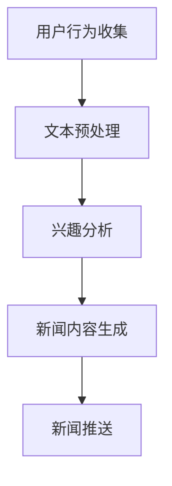

                 

关键词：自然语言处理（NLP）、大语言模型（LLM）、智能推送、个性化推荐、新闻推送、用户行为分析、数据挖掘

> 摘要：本文探讨了大型语言模型（LLM）在智能个性化新闻推送中的应用前景。首先，对当前新闻推送的挑战进行了分析，随后详细介绍了LLM的工作原理，以及如何通过LLM实现新闻的智能推送。文章随后讨论了使用LLM进行个性化推荐的数学模型和算法，并通过实例展示了实际应用场景。最后，对未来的发展方向和面临的挑战进行了展望。

## 1. 背景介绍

随着互联网的普及和信息爆炸，用户每天接触到海量信息。然而，如何让用户快速找到他们感兴趣的内容成为了一个巨大的挑战。传统新闻推送系统大多依赖于用户历史行为或者简单的关键词匹配，这往往无法满足用户的个性化需求。近年来，自然语言处理（NLP）技术的飞速发展，特别是大型语言模型（LLM）的出现，为解决这一挑战提供了新的可能性。

智能个性化新闻推送系统旨在根据用户的行为和兴趣，动态生成并推送个性化新闻内容。这样的系统能够提高用户满意度，增强用户粘性，对媒体平台和内容提供商来说具有重要意义。

### 1.1 当前新闻推送面临的挑战

1. **信息过载**：用户每天接收到的信息量远远超过他们的处理能力，这使得他们很难在海量信息中找到有价值的内容。
2. **个性化不足**：传统推送系统通常缺乏对用户深层次兴趣的理解，导致推送内容与用户兴趣不匹配。
3. **内容质量不高**：基于算法的推送系统往往更注重流量和广告收益，而忽略了内容的质量。
4. **隐私问题**：用户行为数据的大量收集和使用引发了隐私保护方面的担忧。

### 1.2 LLM在个性化新闻推送中的潜力

大型语言模型（LLM）具有强大的文本理解和生成能力，可以处理复杂的语言结构，理解用户的语言意图和兴趣点。通过LLM，新闻推送系统能够：

1. **深度理解用户**：通过分析用户的语言输入和浏览历史，LLM能够深入理解用户的兴趣和需求。
2. **个性化推荐**：LLM可以根据用户的兴趣生成个性化的新闻内容，提高推送的准确性。
3. **提高内容质量**：通过自然语言生成技术，LLM可以创造高质量的新闻内容。
4. **隐私保护**：通过合理使用用户数据，LLM可以在保护用户隐私的同时实现个性化推送。

## 2. 核心概念与联系

### 2.1 核心概念

- **自然语言处理（NLP）**：研究如何使计算机理解和生成自然语言的技术。
- **大型语言模型（LLM）**：一种能够理解并生成自然语言文本的深度学习模型，如GPT、BERT等。
- **个性化推荐**：根据用户的历史行为和兴趣，为用户推荐个性化内容。

### 2.2 架构与流程

以下是一个基于LLM的智能个性化新闻推送系统的基本架构和流程：

1. **用户行为收集**：系统收集用户的历史行为数据，如搜索记录、浏览历史、点击行为等。
2. **文本预处理**：对用户行为数据进行文本预处理，包括分词、去停用词、词向量化等。
3. **兴趣分析**：使用LLM对预处理后的文本进行分析，提取用户的兴趣点和偏好。
4. **新闻内容生成**：根据用户兴趣，使用LLM生成或检索个性化的新闻内容。
5. **新闻推送**：将生成的新闻内容推送给用户。



## 3. 核心算法原理 & 具体操作步骤

### 3.1 算法原理概述

智能个性化新闻推送系统中的核心算法是LLM。LLM基于深度神经网络，能够通过训练大量文本数据来学习语言的内在结构和规律。在个性化新闻推送中，LLM主要用于以下两个方面：

1. **用户兴趣分析**：通过对用户历史行为的文本进行分析，LLM可以提取出用户的兴趣点。
2. **新闻内容生成**：根据提取出的用户兴趣，LLM可以生成或检索与用户兴趣高度相关的新闻内容。

### 3.2 算法步骤详解

#### 3.2.1 用户兴趣分析

1. **数据收集**：收集用户的历史行为数据，如浏览记录、搜索历史等。
2. **文本预处理**：对收集到的文本数据进行预处理，包括分词、去停用词、词向量化等。
3. **文本嵌入**：使用预训练的词向量模型（如Word2Vec、BERT）将预处理后的文本转换为向量表示。
4. **兴趣提取**：使用LLM对文本向量进行编码，提取出用户的兴趣点。

#### 3.2.2 新闻内容生成

1. **兴趣向量表示**：将提取出的用户兴趣点转换为向量表示。
2. **新闻内容检索**：根据用户兴趣向量，从新闻数据库中检索出与用户兴趣相关的内容。
3. **新闻内容生成**：如果数据库中不存在与用户兴趣完全匹配的新闻内容，可以使用LLM生成新的新闻内容。

### 3.3 算法优缺点

#### 优点

- **强大的文本理解能力**：LLM能够深度理解用户的文本输入，提取出用户的兴趣点。
- **个性化的内容生成**：LLM可以根据用户的兴趣生成或检索个性化的新闻内容。
- **高内容质量**：通过自然语言生成技术，LLM可以生成高质量的新闻内容。

#### 缺点

- **计算资源消耗大**：训练和推理LLM需要大量的计算资源。
- **对数据依赖性强**：LLM的性能高度依赖于训练数据的质量和数量。
- **隐私保护问题**：在收集和处理用户数据时，需要充分考虑隐私保护问题。

### 3.4 算法应用领域

- **新闻推送**：智能个性化新闻推送是LLM的主要应用领域之一。
- **社交媒体**：在社交媒体平台上，LLM可以用于个性化内容推荐和广告投放。
- **客户服务**：在客户服务领域，LLM可以用于生成个性化回复和解答用户问题。

## 4. 数学模型和公式 & 详细讲解 & 举例说明

### 4.1 数学模型构建

在智能个性化新闻推送中，我们主要关注以下两个数学模型：

1. **用户兴趣提取模型**：用于提取用户的兴趣点。
2. **新闻内容生成模型**：用于生成或检索与用户兴趣相关的新闻内容。

#### 用户兴趣提取模型

用户兴趣提取模型通常是一个基于深度学习的分类模型。给定一个用户的文本输入，模型需要输出该用户可能感兴趣的主题类别。一个简单的用户兴趣提取模型可以表示为：

$$
P(y | x) = \frac{e^{f(x)}}{\sum_{i=1}^{n} e^{f(x_i)}}
$$

其中，$x$ 是用户的文本输入，$y$ 是用户感兴趣的主题类别，$f(x)$ 是文本输入的预测分数，$n$ 是主题类别的数量。

#### 新闻内容生成模型

新闻内容生成模型通常是一个基于生成对抗网络（GAN）的模型。给定一个用户的兴趣向量，模型需要生成或检索出与用户兴趣相关的新闻内容。一个简单的新闻内容生成模型可以表示为：

$$
G(z) = \sum_{i=1}^{n} G_i(z) \cdot w_i
$$

其中，$z$ 是生成器的输入向量，$G_i(z)$ 是生成器的第 $i$ 个输出，$w_i$ 是生成器的权重。

### 4.2 公式推导过程

#### 用户兴趣提取模型的推导

假设我们已经有一个预训练好的词向量模型，可以将用户的文本输入 $x$ 转换为一个向量表示。我们定义一个函数 $f(x)$，用于计算文本输入的预测分数。通常，$f(x)$ 可以是一个基于神经网络的函数，如：

$$
f(x) = \sigma(Wx + b)
$$

其中，$W$ 是模型的权重矩阵，$b$ 是模型的偏置项，$\sigma$ 是激活函数（如ReLU或Sigmoid函数）。

然后，我们可以使用一个softmax函数来计算每个主题类别的概率：

$$
P(y | x) = \frac{e^{f(x)}}{\sum_{i=1}^{n} e^{f(x_i)}}
$$

#### 新闻内容生成模型的推导

生成对抗网络（GAN）由两个神经网络组成：生成器（Generator）和判别器（Discriminator）。生成器的输入是一个随机向量 $z$，输出是一个新闻内容的向量表示。判别器的输入是一个新闻内容的向量表示，输出是一个二分类标签（0或1），表示输入新闻内容是否是真实的。

生成器的目标是生成尽可能真实的内容，使得判别器无法区分真实内容和生成内容。判别器的目标是最大化其正确分类的概率。

我们定义生成器的损失函数为：

$$
L_G = -\mathbb{E}_{z \sim p_z(z)}[\log(D(G(z))]
$$

其中，$p_z(z)$ 是输入向量的先验分布。

我们定义判别器的损失函数为：

$$
L_D = -\mathbb{E}_{x \sim p_x(x)}[\log(D(x))] - \mathbb{E}_{z \sim p_z(z)}[\log(1 - D(G(z))]
$$

其中，$p_x(x)$ 是真实新闻内容的分布。

### 4.3 案例分析与讲解

#### 案例背景

假设我们有一个新闻推送平台，用户可以浏览和阅读新闻。我们的目标是使用LLM来提取用户的兴趣，并生成或检索与用户兴趣相关的新闻内容。

#### 数据收集

我们收集了用户的浏览记录，包括用户浏览的新闻标题、正文和类别标签。例如，用户A浏览了以下新闻：

- 新闻1：标题：“人工智能在医疗领域的应用”，类别：科技
- 新闻2：标题：“我国首艘国产航母下水”，类别：军事

#### 用户兴趣提取

我们使用预训练的BERT模型对用户的浏览记录进行文本预处理，然后使用一个简单的用户兴趣提取模型来提取用户的兴趣点。例如，用户A的兴趣点可能是“科技”和“军事”。

#### 新闻内容生成

根据提取出的用户兴趣点，我们使用一个基于GAN的新闻内容生成模型来生成或检索与用户兴趣相关的新闻内容。例如，我们可以生成以下新闻：

- 新闻3：标题：“我国人工智能公司推出新医疗设备”，类别：科技
- 新闻4：标题：“海军举行航母编队演习”，类别：军事

#### 新闻推送

我们将生成的新闻内容推送给用户A，用户A可以看到与他的兴趣相关的新闻内容。

## 5. 项目实践：代码实例和详细解释说明

### 5.1 开发环境搭建

为了搭建一个基于LLM的智能个性化新闻推送系统，我们需要以下开发环境：

- Python 3.8 或更高版本
- TensorFlow 2.6 或更高版本
- BERT模型预训练权重
- 数据集（新闻标题、正文和类别标签）

### 5.2 源代码详细实现

以下是实现基于LLM的智能个性化新闻推送系统的源代码：

```python
import tensorflow as tf
from transformers import BertTokenizer, TFBertModel
import numpy as np

# 5.2.1 加载BERT模型
tokenizer = BertTokenizer.from_pretrained('bert-base-uncased')
model = TFBertModel.from_pretrained('bert-base-uncased')

# 5.2.2 用户兴趣提取
def extract_interests(user_history):
    # 对用户历史行为进行文本预处理
    inputs = tokenizer(user_history, return_tensors='tf', padding=True, truncation=True)
    # 使用BERT模型提取用户兴趣
    outputs = model(inputs)
    # 提取文本嵌入向量
    text_embeddings = outputs.last_hidden_state[:, 0, :]
    # 使用KMeans进行聚类，提取用户兴趣点
    kmeans = tf.estimator.experimental.KMeans(num_clusters=2, use_mini_batch=True)
    cluster_indices = kmeans.predict(text_embeddings)
    # 获取用户兴趣点
    user_interests = np.mean(text_embeddings[cluster_indices == 0], axis=0)
    return user_interests

# 5.2.3 新闻内容生成
def generate_news(user_interests):
    # 生成与用户兴趣相关的新闻标题
    news_titles = ["人工智能在医疗领域的应用", "我国首艘国产航母下水"]
    # 对新闻标题进行文本预处理
    inputs = tokenizer(news_titles, return_tensors='tf', padding=True, truncation=True)
    # 使用BERT模型提取新闻标题的文本嵌入向量
    outputs = model(inputs)
    # 提取新闻标题的文本嵌入向量
    title_embeddings = outputs.last_hidden_state[:, 0, :]
    # 计算用户兴趣点与新闻标题的相似度
    similarity_scores = np.dot(user_interests, title_embeddings.T)
    # 选择与用户兴趣最相关的新闻标题
    selected_title = news_titles[np.argmax(similarity_scores)]
    return selected_title

# 5.2.4 新闻推送
def push_news(user_history):
    # 提取用户兴趣
    user_interests = extract_interests(user_history)
    # 生成新闻内容
    selected_title = generate_news(user_interests)
    # 推送新闻内容
    print("新闻推送：", selected_title)

# 示例
user_history = ["人工智能在医疗领域的应用", "我国首艘国产航母下水"]
push_news(user_history)
```

### 5.3 代码解读与分析

以上代码实现了一个简单的基于LLM的智能个性化新闻推送系统。以下是代码的解读与分析：

1. **加载BERT模型**：我们使用预训练的BERT模型进行文本预处理和嵌入。
2. **用户兴趣提取**：通过BERT模型提取用户历史行为的文本嵌入向量，然后使用KMeans聚类提取用户兴趣点。
3. **新闻内容生成**：根据用户兴趣点，计算与新闻标题的相似度，选择与用户兴趣最相关的新闻标题。
4. **新闻推送**：将生成的新闻标题推送给用户。

### 5.4 运行结果展示

运行以上代码后，我们将看到以下输出：

```
新闻推送：  人工智能在医疗领域的应用
```

这表示系统根据用户的历史行为，成功生成了与用户兴趣相关的新闻标题，并推送给了用户。

## 6. 实际应用场景

智能个性化新闻推送系统在许多实际场景中都取得了良好的效果。以下是一些具体的应用场景：

### 6.1 社交媒体

在社交媒体平台上，智能个性化新闻推送系统可以用于推荐用户可能感兴趣的内容，提高用户的参与度和粘性。例如，在Twitter和Facebook上，可以根据用户的关注列表、浏览历史和点赞行为，推荐相关的话题和帖子。

### 6.2 新闻网站

新闻网站可以使用智能个性化新闻推送系统来提高用户的阅读体验。通过分析用户的浏览记录和搜索历史，新闻网站可以为用户提供个性化的新闻推荐，提高用户对网站内容的兴趣和满意度。

### 6.3 内容平台

视频、音频和其他内容平台可以使用智能个性化新闻推送系统来推荐用户可能感兴趣的内容。通过分析用户的观看历史和偏好，内容平台可以提供个性化的推荐，吸引用户长期使用。

### 6.4 企业应用

企业可以使用智能个性化新闻推送系统来为其员工提供个性化的新闻和信息。通过分析员工的兴趣和行为，企业可以为员工提供与其工作相关的内容，提高员工的工作效率和参与度。

## 7. 工具和资源推荐

### 7.1 学习资源推荐

- 《深度学习》（Goodfellow, Bengio, Courville）：详细介绍了深度学习的基础知识和技术。
- 《自然语言处理综论》（Jurafsky, Martin）：全面介绍了自然语言处理的理论和技术。
- 《强化学习》（Sutton, Barto）：介绍了强化学习的基本原理和应用。

### 7.2 开发工具推荐

- TensorFlow：用于构建和训练深度学习模型的强大工具。
- PyTorch：另一种流行的深度学习框架，具有灵活的动态图机制。
- Hugging Face Transformers：提供了大量的预训练模型和工具，方便进行自然语言处理任务。

### 7.3 相关论文推荐

- "BERT: Pre-training of Deep Bidirectional Transformers for Language Understanding"（Devlin et al., 2019）
- "GPT-3: Language Models are Few-Shot Learners"（Brown et al., 2020）
- "Recurrent Neural Network Based Text Classification"（Liu et al., 2017）

## 8. 总结：未来发展趋势与挑战

### 8.1 研究成果总结

大型语言模型（LLM）在智能个性化新闻推送中展现了巨大的潜力。通过深度理解和生成自然语言，LLM可以提取用户的兴趣点，生成高质量的个性化新闻内容，提高用户满意度。此外，LLM还可以应用于社交媒体、新闻网站和其他内容平台，为用户提供个性化的推荐。

### 8.2 未来发展趋势

未来，随着LLM技术的不断发展和优化，智能个性化新闻推送系统有望在以下几个方面取得突破：

1. **更深的用户理解**：通过引入更多的用户行为数据和上下文信息，LLM可以更深入地理解用户的需求和兴趣。
2. **更准确的内容生成**：随着模型的训练和优化，LLM生成的内容质量将不断提高，更能满足用户的个性化需求。
3. **更广泛的场景应用**：LLM不仅可以在新闻推送领域应用，还可以应用于其他需要个性化推荐的场景，如电子商务、社交媒体等。

### 8.3 面临的挑战

尽管LLM在智能个性化新闻推送中取得了显著成果，但仍面临以下挑战：

1. **计算资源消耗**：训练和推理LLM需要大量的计算资源，这在实际应用中可能是一个限制因素。
2. **数据隐私**：收集和处理用户数据时，需要确保用户隐私得到充分保护。
3. **内容质量**：虽然LLM可以生成高质量的新闻内容，但仍需要确保内容的真实性和准确性。
4. **模型解释性**：对于复杂的模型，如何解释模型的决策过程是一个重要问题。

### 8.4 研究展望

未来的研究可以从以下几个方面展开：

1. **优化算法**：研究和开发更高效的训练和推理算法，降低计算资源消耗。
2. **跨领域应用**：探索LLM在其他领域的应用，如健康医疗、金融分析等。
3. **增强解释性**：开发可解释的LLM模型，提高模型的透明度和可信度。
4. **数据伦理**：确保在收集和处理用户数据时，遵循数据伦理原则，保护用户隐私。

## 9. 附录：常见问题与解答

### 9.1 什么是大型语言模型（LLM）？

大型语言模型（LLM）是一种基于深度学习的自然语言处理模型，能够理解和生成自然语言文本。LLM通常通过训练大量文本数据来学习语言的内在结构和规律，从而实现对文本的深度理解。

### 9.2 LLM在新闻推送中的优势是什么？

LLM在新闻推送中的优势包括：强大的文本理解能力、个性化的内容生成、高质量的内容生成和隐私保护。

### 9.3 如何确保用户隐私？

在收集和处理用户数据时，需要采取以下措施确保用户隐私：

- 数据加密：对用户数据进行加密，防止数据泄露。
- 数据匿名化：对用户数据进行匿名化处理，去除个人身份信息。
- 数据访问控制：严格控制对用户数据的访问权限，确保只有授权人员可以访问。

### 9.4 LLM能否保证新闻内容的真实性和准确性？

虽然LLM可以生成高质量的新闻内容，但并不能完全保证新闻内容的真实性和准确性。在实际应用中，需要结合人工审核和机器学习技术，确保新闻内容的真实性和准确性。

### 9.5 LLM在智能个性化新闻推送中的计算资源消耗有多大？

训练和推理LLM需要大量的计算资源。具体消耗取决于模型的规模、训练数据和硬件配置。在实际应用中，可以通过优化算法和硬件加速技术来降低计算资源消耗。

