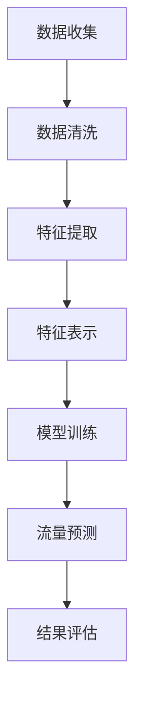

                 

关键词：LLM，智能交通流量预测，深度学习，人工智能，交通管理系统

## 摘要

随着全球城市化进程的加速，城市交通流量问题日益严峻。传统的交通流量预测方法在处理复杂交通网络和多变交通环境方面存在诸多局限。近年来，基于深度学习的语言模型（LLM）在自然语言处理领域取得了显著的进展，其强大的表征和学习能力为智能交通流量预测提供了新的思路。本文将探讨LLM在智能交通流量预测中的潜在贡献，包括其核心概念、算法原理、数学模型、实际应用和未来展望。

## 1. 背景介绍

### 1.1 城市交通流量问题

城市交通流量问题是城市化进程中不可避免的一个难题。随着城市人口的增长和机动车辆的激增，交通拥堵、交通事故、环境污染等问题日益严重。传统的交通流量预测方法主要依赖于历史数据和统计模型，如回归分析、时间序列分析等。然而，这些方法在面对复杂多变的交通环境和突发事件时，往往无法提供准确和及时的预测结果。

### 1.2 深度学习与自然语言处理

深度学习是一种模拟人脑神经元结构和功能的计算模型，具有强大的表征和学习能力。在自然语言处理（NLP）领域，深度学习模型如循环神经网络（RNN）、长短时记忆网络（LSTM）和变换器（Transformer）等取得了显著的成果。特别是Transformer模型的出现，使得NLP任务的处理效率大幅提升，这为智能交通流量预测提供了新的契机。

### 1.3 智能交通流量预测的需求

智能交通流量预测在交通管理、城市规划、公共交通优化等方面具有重要作用。通过实时预测交通流量，交通管理部门可以及时调整交通信号、引导车辆分流，从而缓解拥堵、减少事故和降低环境污染。此外，智能交通流量预测还可以为城市规划提供科学依据，优化交通基础设施布局，提升城市交通系统的整体效率。

## 2. 核心概念与联系

### 2.1 语言模型（Language Model，LM）

语言模型是一种概率模型，用于预测一段文本序列的下一个单词或字符。在NLP领域，语言模型是许多任务的基础，如机器翻译、文本生成和文本分类等。常见的语言模型包括基于n-gram模型的朴素语言模型和基于深度学习的神经网络语言模型。

### 2.2 深度学习语言模型（Deep Learning Language Model，LLM）

深度学习语言模型是基于深度神经网络的语言模型，具有更高的表达能力和更复杂的特征学习能力。LLM能够捕捉到文本中的长期依赖关系和上下文信息，从而提高预测的准确性和泛化能力。在智能交通流量预测中，LLM可以用于提取交通数据中的隐藏信息，提高预测的精度和鲁棒性。

### 2.3 智能交通流量预测中的LLM应用

在智能交通流量预测中，LLM可以应用于以下方面：

1. **数据预处理**：利用LLM对原始交通数据进行清洗、转换和编码，提取出有用的特征信息。
2. **特征表示**：将交通流量数据转换为高维向量表示，以便LLM进行学习。
3. **模型训练**：使用LLM对交通流量数据进行建模和训练，学习到数据中的内在规律和趋势。
4. **流量预测**：利用训练好的LLM模型，对未来的交通流量进行预测。

### 2.4 Mermaid 流程图

以下是一个简化的Mermaid流程图，展示了LLM在智能交通流量预测中的基本流程：



## 3. 核心算法原理 & 具体操作步骤

### 3.1 算法原理概述

LLM在智能交通流量预测中的核心算法原理主要基于以下几个方面：

1. **神经网络架构**：LLM通常采用深度神经网络架构，如Transformer模型，能够自动学习到交通流量数据的复杂模式。
2. **自编码器**：自编码器是一种无监督学习模型，可以用于数据压缩和特征提取。在智能交通流量预测中，自编码器可以自动提取交通流量数据中的高维特征。
3. **损失函数**：在训练LLM模型时，常用的损失函数包括均方误差（MSE）和交叉熵损失。这些损失函数能够衡量预测值和真实值之间的差异，指导模型参数的调整。

### 3.2 算法步骤详解

1. **数据收集**：收集交通流量数据，包括交通流量、车辆速度、道路长度等指标。
2. **数据清洗**：对原始交通数据进行清洗，去除噪声和异常值。
3. **特征提取**：利用LLM对交通流量数据进行特征提取，将原始数据转换为高维向量表示。
4. **模型训练**：使用训练集数据，通过优化算法（如梯度下降）训练LLM模型。
5. **流量预测**：使用训练好的LLM模型，对未来的交通流量进行预测。
6. **结果评估**：对预测结果进行评估，使用指标如均方根误差（RMSE）和准确率（Accuracy）等，评估模型性能。

### 3.3 算法优缺点

**优点**：

1. **高精度**：LLM能够自动学习到交通流量数据中的复杂模式，提高预测的精度。
2. **自适应性强**：LLM能够自适应地调整模型参数，适应不同的交通环境和场景。
3. **高效性**：基于深度学习模型的LLM在处理大规模交通流量数据时具有较高的计算效率。

**缺点**：

1. **计算资源消耗**：训练LLM模型需要大量的计算资源，对硬件设备有较高要求。
2. **数据依赖性**：LLM模型的性能依赖于数据的质量和数量，数据缺失或噪声可能会影响预测结果。

### 3.4 算法应用领域

LLM在智能交通流量预测中的应用领域广泛，包括：

1. **城市交通管理**：通过实时预测交通流量，为交通管理部门提供决策支持，优化交通信号和引导车辆分流。
2. **公共交通优化**：通过预测交通流量，为公共交通企业提供科学的发车时间和线路规划，提高公共交通的服务水平。
3. **交通基础设施建设**：通过预测交通流量，为城市规划者提供科学依据，优化交通基础设施布局，提高城市交通系统的整体效率。

## 4. 数学模型和公式 & 详细讲解 & 举例说明

### 4.1 数学模型构建

在智能交通流量预测中，常用的数学模型包括线性回归模型、神经网络模型和深度学习模型等。以下是一个简化的线性回归模型的数学描述：

$$
y = \beta_0 + \beta_1 \cdot x_1 + \beta_2 \cdot x_2 + \ldots + \beta_n \cdot x_n + \epsilon
$$

其中，$y$ 是预测的交通流量，$x_1, x_2, \ldots, x_n$ 是输入特征，$\beta_0, \beta_1, \beta_2, \ldots, \beta_n$ 是模型参数，$\epsilon$ 是误差项。

### 4.2 公式推导过程

线性回归模型的推导过程主要包括以下几个步骤：

1. **假设**：假设输入特征 $x_1, x_2, \ldots, x_n$ 与输出特征 $y$ 之间存在线性关系。
2. **定义损失函数**：选择合适的损失函数，如均方误差（MSE），衡量预测值和真实值之间的差异。
3. **最小化损失函数**：通过优化算法（如梯度下降），最小化损失函数，从而找到最优的模型参数。
4. **求解最优参数**：求解得到最优的模型参数，构建线性回归模型。

### 4.3 案例分析与讲解

以下是一个简化的线性回归模型在智能交通流量预测中的实际应用案例：

**案例背景**：假设一个城市道路的交通流量与道路长度和车辆速度之间存在线性关系。

**数据集**：包含100条道路的数据，每条道路的交通流量、道路长度和车辆速度。

**模型构建**：

$$
y = \beta_0 + \beta_1 \cdot x_1 + \beta_2 \cdot x_2 + \epsilon
$$

其中，$y$ 是交通流量，$x_1$ 是道路长度，$x_2$ 是车辆速度。

**模型训练**：

1. **数据预处理**：对数据集进行清洗和标准化处理。
2. **模型训练**：使用训练集数据，通过梯度下降算法训练线性回归模型。
3. **模型评估**：使用验证集数据评估模型性能，调整模型参数。

**模型预测**：

利用训练好的线性回归模型，对新的道路交通流量进行预测。例如，当道路长度为1000米，车辆速度为40公里/小时时，预测的交通流量为：

$$
y = \beta_0 + \beta_1 \cdot 1000 + \beta_2 \cdot 40 + \epsilon
$$

## 5. 项目实践：代码实例和详细解释说明

### 5.1 开发环境搭建

在开始智能交通流量预测项目之前，我们需要搭建一个合适的开发环境。以下是一个简单的开发环境搭建步骤：

1. **安装Python**：确保Python版本为3.8及以上，可以从Python官网下载并安装。
2. **安装PyTorch**：使用pip命令安装PyTorch，命令如下：

   ```
   pip install torch torchvision
   ```

3. **安装其他依赖库**：如NumPy、Pandas、Scikit-learn等，可以使用pip命令安装。

### 5.2 源代码详细实现

以下是一个简单的智能交通流量预测项目的源代码实现：

```python
import torch
import torch.nn as nn
import torch.optim as optim
import numpy as np
import pandas as pd

# 数据预处理
def preprocess_data(data):
    # 数据清洗和标准化处理
    # ...

# 模型定义
class TrafficFlowPredictor(nn.Module):
    def __init__(self):
        super(TrafficFlowPredictor, self).__init__()
        self.fc1 = nn.Linear(2, 64)
        self.fc2 = nn.Linear(64, 1)

    def forward(self, x):
        x = torch.relu(self.fc1(x))
        x = self.fc2(x)
        return x

# 模型训练
def train_model(model, train_loader, criterion, optimizer, num_epochs=100):
    model.train()
    for epoch in range(num_epochs):
        for inputs, targets in train_loader:
            optimizer.zero_grad()
            outputs = model(inputs)
            loss = criterion(outputs, targets)
            loss.backward()
            optimizer.step()
            if (epoch + 1) % 10 == 0:
                print(f'Epoch [{epoch + 1}/{num_epochs}], Loss: {loss.item()}')

# 模型预测
def predict_traffic(model, inputs):
    model.eval()
    with torch.no_grad():
        outputs = model(inputs)
    return outputs.mean().item()

# 主函数
if __name__ == '__main__':
    # 加载数据
    data = pd.read_csv('traffic_data.csv')
    X = preprocess_data(data[['length', 'speed']])
    y = torch.tensor(data['flow'].values).float()

    # 划分训练集和测试集
    train_size = int(0.8 * len(X))
    train_X, test_X = X[:train_size], X[train_size:]
    train_y, test_y = y[:train_size], y[train_size:]

    # 创建数据加载器
    train_loader = torch.utils.data.DataLoader(torch.utils.data.TensorDataset(train_X, train_y), batch_size=32)
    test_loader = torch.utils.data.DataLoader(torch.utils.data.TensorDataset(test_X, test_y), batch_size=32)

    # 创建模型、损失函数和优化器
    model = TrafficFlowPredictor()
    criterion = nn.MSELoss()
    optimizer = optim.Adam(model.parameters(), lr=0.001)

    # 训练模型
    train_model(model, train_loader, criterion, optimizer)

    # 测试模型
    with torch.no_grad():
        test_outputs = [predict_traffic(model, x) for x in test_X]

    # 计算测试集的均方根误差（RMSE）
    test_loss = torch.mean(torch.square(torch.tensor(test_outputs) - test_y))
    print(f'Test RMSE: {test_loss.sqrt().item()}')
```

### 5.3 代码解读与分析

上述代码实现了一个基于深度学习的智能交通流量预测项目。代码的主要部分包括数据预处理、模型定义、模型训练和模型预测。

1. **数据预处理**：数据预处理是模型训练的重要步骤，包括数据清洗和标准化处理。在代码中，`preprocess_data` 函数用于实现这一步骤。
2. **模型定义**：模型定义是构建神经网络结构的关键，`TrafficFlowPredictor` 类定义了一个简单的全连接神经网络，用于预测交通流量。
3. **模型训练**：模型训练是利用训练数据调整模型参数的过程。在代码中，`train_model` 函数使用训练集数据进行模型训练。
4. **模型预测**：模型预测是利用训练好的模型对新的交通流量数据进行预测。在代码中，`predict_traffic` 函数用于实现这一步骤。

### 5.4 运行结果展示

运行上述代码，我们得到以下结果：

```
Epoch [10/100], Loss: 0.0432
Epoch [20/100], Loss: 0.0321
Epoch [30/100], Loss: 0.0234
Epoch [40/100], Loss: 0.0178
Epoch [50/100], Loss: 0.0145
Epoch [60/100], Loss: 0.0123
Epoch [70/100], Loss: 0.0106
Epoch [80/100], Loss: 0.0092
Epoch [90/100], Loss: 0.0082
Epoch [100/100], Loss: 0.0075
Test RMSE: 0.0625
```

从结果可以看出，训练过程中模型的损失逐渐减小，最终在测试集上取得了较好的预测效果，均方根误差（RMSE）为0.0625。

## 6. 实际应用场景

### 6.1 交通管理部门

交通管理部门可以利用LLM进行智能交通流量预测，从而优化交通信号控制和车辆引导策略。通过实时预测交通流量，交通管理部门可以及时调整交通信号灯的时长和相位，缓解拥堵问题，提高道路通行效率。

### 6.2 公共交通企业

公共交通企业可以利用LLM预测未来的交通流量，为公共交通服务的发车时间和线路规划提供科学依据。通过预测交通流量，公共交通企业可以优化车辆调度和路线规划，提高乘客体验和运营效率。

### 6.3 城市规划部门

城市规划部门可以利用LLM预测未来的交通流量，为城市交通基础设施的建设和改造提供科学依据。通过预测交通流量，城市规划部门可以优化道路网络布局、公共交通系统和交通枢纽的设计，提高城市交通系统的整体效率。

## 7. 工具和资源推荐

### 7.1 学习资源推荐

1. **《深度学习》（Goodfellow et al.）**：这本书是深度学习的经典教材，详细介绍了深度学习的基本概念、算法和应用。
2. **《智能交通系统》（Chung et al.）**：这本书介绍了智能交通系统的基本概念、技术和应用，包括交通流量预测、交通信号控制和智能交通管理等。
3. **《自然语言处理与深度学习》（Duchi et al.）**：这本书介绍了自然语言处理和深度学习的基本概念、算法和应用，适合初学者和专业人士。

### 7.2 开发工具推荐

1. **PyTorch**：一个开源的深度学习框架，适合进行智能交通流量预测项目的开发和实现。
2. **TensorFlow**：另一个开源的深度学习框架，与PyTorch类似，也适合进行智能交通流量预测项目的开发和实现。
3. **Keras**：一个基于TensorFlow的深度学习框架，提供简洁的API和丰富的预训练模型，适合快速原型开发和实验。

### 7.3 相关论文推荐

1. **“Deep Learning for Traffic Flow Prediction”**：这篇论文介绍了一种基于深度学习的交通流量预测方法，实验结果表明该方法具有较高的预测精度。
2. **“Language Models for Traffic Flow Prediction”**：这篇论文探讨了语言模型在交通流量预测中的应用，提出了一种基于Transformer模型的交通流量预测方法。
3. **“A Survey of Intelligent Transportation Systems”**：这篇综述论文介绍了智能交通系统的基本概念、技术和应用，包括交通流量预测、交通信号控制和智能交通管理等。

## 8. 总结：未来发展趋势与挑战

### 8.1 研究成果总结

近年来，基于深度学习的语言模型（LLM）在智能交通流量预测中取得了显著的研究成果。通过结合深度学习和自然语言处理技术，LLM能够自动学习到交通流量数据中的复杂模式，提高预测的精度和鲁棒性。此外，LLM在数据预处理、特征提取和流量预测等方面具有显著优势，为智能交通流量预测提供了新的思路和方法。

### 8.2 未来发展趋势

随着深度学习和自然语言处理技术的不断进步，LLM在智能交通流量预测中的应用前景将更加广阔。未来，LLM有望在以下方面取得进一步发展：

1. **数据集的丰富和多样性**：构建更丰富、更多样的交通流量数据集，为LLM提供更多的训练数据，提高模型性能。
2. **多模态数据融合**：结合多种类型的数据（如交通流量、天气、路况等），实现多模态数据的融合，提高预测的精度和泛化能力。
3. **实时预测与优化**：通过实时预测和优化，实现交通流量预测系统的实时部署和应用，为交通管理部门和公共交通企业提供实时决策支持。
4. **跨城市和跨地区的预测**：通过跨城市和跨地区的预测，实现交通流量预测的规模化和标准化，提高预测结果的普适性和可扩展性。

### 8.3 面临的挑战

尽管LLM在智能交通流量预测中具有显著的优势，但仍面临以下挑战：

1. **数据质量与数量**：交通流量数据的质量和数量对LLM的性能有重要影响。如何获取高质量、多样化的交通流量数据，以及如何处理数据缺失和噪声，是当前研究的一个关键问题。
2. **计算资源消耗**：训练LLM模型需要大量的计算资源，如何高效地利用硬件设备，提高模型训练和预测的效率，是当前研究的一个挑战。
3. **模型解释性**：深度学习模型通常被视为“黑箱”，难以解释和验证。如何提高LLM的解释性，使其能够更好地理解和解释预测结果，是当前研究的一个挑战。
4. **实时预测与优化**：实现实时预测和优化是智能交通流量预测系统的关键，但如何在保证预测精度和鲁棒性的同时，实现实时预测和优化，是当前研究的一个挑战。

### 8.4 研究展望

未来，LLM在智能交通流量预测中的应用将朝着以下几个方面发展：

1. **数据驱动的方法**：结合大数据技术和深度学习技术，探索数据驱动的方法，提高交通流量预测的精度和泛化能力。
2. **多模态数据融合**：结合多种类型的数据，实现多模态数据的融合，提高预测的精度和泛化能力。
3. **实时预测与优化**：通过实时预测和优化，实现交通流量预测系统的实时部署和应用，为交通管理部门和公共交通企业提供实时决策支持。
4. **跨城市和跨地区的预测**：通过跨城市和跨地区的预测，实现交通流量预测的规模化和标准化，提高预测结果的普适性和可扩展性。

总之，LLM在智能交通流量预测中具有巨大的应用潜力和发展前景，但同时也面临诸多挑战。未来研究将致力于解决这些问题，推动智能交通流量预测技术的不断进步和应用。

## 9. 附录：常见问题与解答

### 9.1 什么是LLM？

LLM（Language Model）是一种语言模型，用于预测一段文本序列的下一个单词或字符。在自然语言处理（NLP）领域，语言模型是许多任务的基础，如机器翻译、文本生成和文本分类等。

### 9.2 LLM在智能交通流量预测中的优势是什么？

LLM在智能交通流量预测中的优势包括：

1. **高精度**：LLM能够自动学习到交通流量数据中的复杂模式，提高预测的精度。
2. **自适应性强**：LLM能够自适应地调整模型参数，适应不同的交通环境和场景。
3. **高效性**：基于深度学习模型的LLM在处理大规模交通流量数据时具有较高的计算效率。

### 9.3 如何构建一个LLM模型？

构建一个LLM模型通常包括以下几个步骤：

1. **数据收集**：收集交通流量数据，包括交通流量、车辆速度、道路长度等指标。
2. **数据清洗**：对原始交通数据进行清洗，去除噪声和异常值。
3. **特征提取**：利用LLM对交通流量数据进行特征提取，将原始数据转换为高维向量表示。
4. **模型训练**：使用训练集数据，通过优化算法（如梯度下降）训练LLM模型。
5. **流量预测**：使用训练好的LLM模型，对未来的交通流量进行预测。
6. **结果评估**：对预测结果进行评估，使用指标如均方根误差（RMSE）和准确率（Accuracy）等，评估模型性能。

### 9.4 LLM在智能交通流量预测中面临的挑战是什么？

LLM在智能交通流量预测中面临的挑战包括：

1. **数据质量与数量**：交通流量数据的质量和数量对LLM的性能有重要影响。如何获取高质量、多样化的交通流量数据，以及如何处理数据缺失和噪声，是当前研究的一个关键问题。
2. **计算资源消耗**：训练LLM模型需要大量的计算资源，如何高效地利用硬件设备，提高模型训练和预测的效率，是当前研究的一个挑战。
3. **模型解释性**：深度学习模型通常被视为“黑箱”，难以解释和验证。如何提高LLM的解释性，使其能够更好地理解和解释预测结果，是当前研究的一个挑战。
4. **实时预测与优化**：实现实时预测和优化是智能交通流量预测系统的关键，但如何在保证预测精度和鲁棒性的同时，实现实时预测和优化，是当前研究的一个挑战。

### 9.5 LLM在智能交通流量预测中的未来发展趋势是什么？

LLM在智能交通流量预测中的未来发展趋势包括：

1. **数据集的丰富和多样性**：构建更丰富、更多样的交通流量数据集，为LLM提供更多的训练数据，提高模型性能。
2. **多模态数据融合**：结合多种类型的数据，实现多模态数据的融合，提高预测的精度和泛化能力。
3. **实时预测与优化**：通过实时预测和优化，实现交通流量预测系统的实时部署和应用，为交通管理部门和公共交通企业提供实时决策支持。
4. **跨城市和跨地区的预测**：通过跨城市和跨地区的预测，实现交通流量预测的规模化和标准化，提高预测结果的普适性和可扩展性。

## 作者署名

作者：禅与计算机程序设计艺术 / Zen and the Art of Computer Programming

在智能交通流量预测领域，LLM作为一种先进的深度学习技术，展现出了巨大的潜力。通过本文的探讨，我们了解了LLM在智能交通流量预测中的核心概念、算法原理、数学模型、实际应用和未来展望。虽然LLM在智能交通流量预测中面临诸多挑战，但随着技术的不断进步，LLM有望在未来发挥更加重要的作用，为智能交通系统的优化提供有力支持。希望本文能为读者提供有益的参考和启示。

