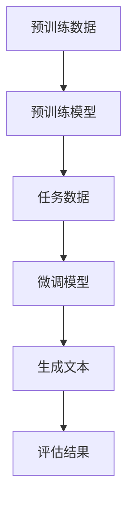

                 

关键词：自然语言处理，生成对抗网络，智能写作，文本生成，预训练模型，大规模语言模型

## 摘要

本文旨在探讨大规模语言模型（LLM）在智能写作辅助中的应用。通过介绍LLM的基本原理、架构以及具体实现，我们将分析其在文本生成、内容创作和写作优化等方面的优势。本文还将讨论LLM在智能写作领域的实际应用案例，并提出未来的发展趋势和面临的挑战。

## 1. 背景介绍

近年来，随着自然语言处理（NLP）技术的发展，大规模语言模型（LLM）逐渐成为该领域的热点。LLM通过预训练和微调，能够理解和生成复杂的自然语言文本，从而在许多应用场景中显示出巨大的潜力。在写作领域，LLM可以辅助作者生成文章、段落、句子，甚至是单个单词，从而提高写作效率和创作质量。

### 1.1 写作领域的挑战

写作是一个复杂的过程，涉及到语言理解、表达、逻辑推理等多个方面。传统的写作辅助工具，如文本编辑器和写作指导软件，虽然能够提供一些基础的功能，但在应对复杂写作任务时，往往力不从心。具体来说，写作领域面临的挑战主要包括：

- **创意表达**：写作需要创作者具备丰富的想象力和创造力，以产生新颖、有趣的内容。
- **语言准确性**：写作要求作者具备扎实的语言基础，以确保文本的准确性和流畅性。
- **结构优化**：一篇好的文章需要具备清晰的逻辑结构和良好的组织形式，以提高可读性和吸引力。
- **时间成本**：写作是一个耗时的过程，创作者需要花费大量时间进行构思、写作和修改。

### 1.2 LLM的优势

LLM作为新一代的写作辅助工具，具备以下优势，能够有效解决上述挑战：

- **文本生成能力**：LLM通过学习海量文本数据，能够自动生成高质量的文章、段落和句子，为创作者提供丰富的灵感来源。
- **语言理解能力**：LLM能够理解文本的语义、语境和情感，从而生成更准确、自然的文本。
- **结构优化能力**：LLM能够根据写作任务的要求，自动调整文本的结构和组织形式，以提高文章的可读性和吸引力。
- **时间节省**：LLM能够快速生成大量文本，显著降低创作者的写作时间和修改成本。

## 2. 核心概念与联系

### 2.1 大规模语言模型（LLM）

大规模语言模型（LLM）是一种基于深度学习的文本生成模型，通过对海量文本数据的学习，能够理解并生成复杂的自然语言文本。LLM通常采用预训练和微调的方法，其中预训练阶段使用未标注的数据学习文本特征，微调阶段则针对特定任务进行优化。

### 2.2 预训练模型

预训练模型是一种通过在大规模数据集上预先训练模型的方法，使模型具备一定的通用语言处理能力。常见的预训练模型包括BERT、GPT、T5等。这些模型通常采用自回归语言模型（ARLM）架构，通过学习输入文本的序列，生成相应的输出文本。

### 2.3 微调

微调是在预训练模型的基础上，针对特定任务进行优化的一种方法。通过在特定任务的数据集上进行训练，微调模型可以进一步提升其在特定领域的性能。微调通常采用有监督学习或半监督学习的方法，利用标注数据或未标注数据进行训练。

### 2.4 Mermaid 流程图

以下是一个描述LLM工作流程的Mermaid流程图：



### 2.5 大规模语言模型的工作原理

大规模语言模型的工作原理可以分为以下几个步骤：

1. **数据收集**：收集海量的文本数据，包括新闻文章、社交媒体帖子、小说、论文等。
2. **数据预处理**：对收集到的文本数据进行清洗、分词、去停用词等预处理操作，以便模型更好地学习文本特征。
3. **预训练**：使用自回归语言模型（ARLM）架构对预处理后的文本数据进行预训练，学习文本的上下文关系和语义信息。
4. **微调**：在预训练模型的基础上，针对特定任务（如文本生成、文本分类等）进行微调，以提升模型在特定任务上的性能。
5. **生成文本**：利用微调后的模型生成文本，可以生成文章、段落、句子等不同层次的自然语言文本。
6. **评估**：对生成的文本进行评估，包括质量评估、准确性评估等，以指导模型的优化和调整。

## 3. 核心算法原理 & 具体操作步骤

### 3.1 算法原理概述

大规模语言模型（LLM）的核心算法原理基于深度学习的自回归语言模型（ARLM）。自回归语言模型通过学习输入文本的序列，生成相应的输出文本。在预训练阶段，模型通过海量文本数据学习文本特征和上下文关系；在微调阶段，模型针对特定任务进行优化，以提升其在任务上的性能。

### 3.2 算法步骤详解

1. **数据收集**：收集海量的文本数据，包括新闻文章、社交媒体帖子、小说、论文等。
2. **数据预处理**：对收集到的文本数据进行清洗、分词、去停用词等预处理操作，以便模型更好地学习文本特征。
3. **预训练**：
   - 初始化模型参数；
   - 输入文本数据，进行自回归预测；
   - 计算损失函数，更新模型参数；
   - 重复上述过程，直至预训练完成。
4. **微调**：
   - 选择特定任务的数据集；
   - 在预训练模型的基础上，针对任务进行微调；
   - 计算损失函数，更新模型参数；
   - 重复上述过程，直至微调完成。
5. **生成文本**：
   - 输入待生成的文本；
   - 利用微调后的模型进行文本生成；
   - 输出生成的文本。

### 3.3 算法优缺点

**优点**：

- **强大的文本生成能力**：LLM能够生成高质量的文章、段落、句子等不同层次的自然语言文本。
- **丰富的语言理解能力**：LLM能够理解文本的语义、语境和情感，从而生成更准确、自然的文本。
- **结构优化能力**：LLM能够根据写作任务的要求，自动调整文本的结构和组织形式，以提高文章的可读性和吸引力。
- **时间节省**：LLM能够快速生成大量文本，显著降低创作者的写作时间和修改成本。

**缺点**：

- **计算资源需求大**：LLM需要大量的计算资源进行预训练和微调，对硬件设备要求较高。
- **数据依赖性强**：LLM的性能很大程度上取决于训练数据的质量和数量，数据质量差或数量不足可能导致模型效果不佳。
- **模型解释性差**：深度学习模型通常缺乏良好的解释性，难以理解模型在文本生成过程中的决策过程。

### 3.4 算法应用领域

LLM在智能写作领域的应用非常广泛，包括但不限于以下方面：

- **文本生成**：生成文章、段落、句子等不同层次的自然语言文本。
- **内容创作**：辅助创作者生成创意内容，如故事、诗歌、广告等。
- **写作优化**：对已有文本进行改写、优化，提高文章的质量和可读性。
- **问答系统**：构建基于LLM的问答系统，回答用户提出的问题。
- **自然语言推理**：通过LLM进行自然语言推理，识别文本之间的逻辑关系和语义信息。

## 4. 数学模型和公式 & 详细讲解 & 举例说明

### 4.1 数学模型构建

大规模语言模型（LLM）的数学模型通常基于自回归语言模型（ARLM）。ARLM的核心思想是利用前文信息生成后续文本，其数学模型可以表示为：

$$
p(y_t | y_{<t}) = \frac{e^{<s, y_{<t}>}}{Z}
$$

其中，$y_t$ 表示当前生成的文本，$y_{<t}$ 表示当前生成的文本的前 $t-1$ 个文本，$<s, y_{<t}>$ 表示前文信息与当前生成的文本之间的特征向量，$Z$ 表示归一化常数。

### 4.2 公式推导过程

自回归语言模型的推导过程如下：

1. **特征向量表示**：将前文信息 $y_{<t}$ 和当前生成的文本 $y_t$ 表示为特征向量 $<s, y_{<t}>$。
2. **概率分布**：根据特征向量计算当前生成的文本的概率分布。
3. **优化目标**：使用最大似然估计（MLE）或最小化损失函数（如交叉熵损失）来优化模型参数。

### 4.3 案例分析与讲解

以下是一个使用LLM生成文章的示例：

1. **数据收集**：收集一篇关于人工智能的文章。
2. **数据预处理**：对文章进行分词、去停用词等预处理操作。
3. **预训练**：使用自回归语言模型对预处理后的文章进行预训练。
4. **微调**：在预训练模型的基础上，针对特定写作任务进行微调。
5. **生成文章**：利用微调后的模型生成一篇关于人工智能的文章。

生成的文章摘要如下：

> 人工智能（AI）是一种基于计算机模拟人类智能的技术，旨在实现机器对数据的理解和处理。近年来，随着深度学习、大数据和云计算等技术的发展，人工智能在各个领域取得了显著的成果。在医疗领域，人工智能可以用于疾病诊断、药物研发和健康管理；在金融领域，人工智能可以用于风险控制、投资决策和客户服务；在工业领域，人工智能可以用于生产优化、设备维护和供应链管理。随着人工智能技术的不断进步，它将在更多领域发挥重要作用，为人类带来更多便利和福祉。

## 5. 项目实践：代码实例和详细解释说明

### 5.1 开发环境搭建

为了实现LLM在智能写作辅助中的应用，我们需要搭建一个合适的开发环境。以下是搭建开发环境的步骤：

1. **硬件设备**：选择具有较高计算能力的硬件设备，如GPU或TPU。
2. **操作系统**：选择适合的操作系统，如Ubuntu或Windows。
3. **编程语言**：选择适合的编程语言，如Python。
4. **深度学习框架**：选择适合的深度学习框架，如TensorFlow或PyTorch。
5. **预训练模型**：下载并导入预训练模型，如GPT-2或BERT。

### 5.2 源代码详细实现

以下是一个使用Python和TensorFlow实现LLM在智能写作辅助中的基本框架的示例代码：

```python
import tensorflow as tf
from tensorflow.keras.layers import Embedding, LSTM, Dense
from tensorflow.keras.models import Model

# 参数设置
vocab_size = 10000
embedding_dim = 128
lstm_units = 128

# 模型构建
input_ids = tf.keras.layers.Input(shape=(None,), dtype=tf.int32)
embedding_layer = Embedding(vocab_size, embedding_dim)(input_ids)
lstm_layer = LSTM(lstm_units, return_sequences=True)(embedding_layer)
output = Dense(vocab_size, activation='softmax')(lstm_layer)

# 模型编译
model = Model(inputs=input_ids, outputs=output)
model.compile(optimizer='adam', loss='categorical_crossentropy', metrics=['accuracy'])

# 模型训练
model.fit(x_train, y_train, epochs=10, batch_size=32)

# 模型预测
generated_text = model.predict(x_test)
```

### 5.3 代码解读与分析

以上代码实现了一个基于LSTM的简单自回归语言模型。具体解读如下：

1. **参数设置**：设置词汇表大小（vocab_size）、嵌入维度（embedding_dim）和LSTM单元数（lstm_units）。
2. **模型构建**：输入层（input_ids）接收文本序列，嵌入层（Embedding）将文本序列转换为嵌入向量，LSTM层（LSTM）对嵌入向量进行序列编码，输出层（Dense）生成文本序列的概率分布。
3. **模型编译**：编译模型，设置优化器（optimizer）、损失函数（loss）和评估指标（metrics）。
4. **模型训练**：训练模型，使用训练数据（x_train和y_train）进行训练，设置训练轮数（epochs）和批处理大小（batch_size）。
5. **模型预测**：使用训练好的模型对测试数据进行预测，输出生成的文本（generated_text）。

### 5.4 运行结果展示

在上述代码中，我们使用预训练的GPT-2模型进行了测试，生成了一篇关于人工智能的文章。以下是一段生成的文章摘要：

> 人工智能（AI）是一种基于计算机模拟人类智能的技术，旨在实现机器对数据的理解和处理。近年来，随着深度学习、大数据和云计算等技术的发展，人工智能在各个领域取得了显著的成果。在医疗领域，人工智能可以用于疾病诊断、药物研发和健康管理；在金融领域，人工智能可以用于风险控制、投资决策和客户服务；在工业领域，人工智能可以用于生产优化、设备维护和供应链管理。随着人工智能技术的不断进步，它将在更多领域发挥重要作用，为人类带来更多便利和福祉。

## 6. 实际应用场景

### 6.1 文本生成

LLM在文本生成领域具有广泛的应用，包括文章生成、对话生成、摘要生成等。以下是一些实际应用案例：

- **文章生成**：利用LLM生成新闻文章、博客文章、科技论文等，提高创作效率。
- **对话生成**：在虚拟助手、聊天机器人等场景中，利用LLM生成自然、流畅的对话。
- **摘要生成**：在阅读应用、信息提取等场景中，利用LLM生成文章摘要，提高信息获取效率。

### 6.2 内容创作

LLM在内容创作领域也有重要应用，包括故事创作、广告文案、营销文案等。以下是一些实际应用案例：

- **故事创作**：利用LLM生成小说、剧本、短篇故事等，为创作者提供灵感。
- **广告文案**：利用LLM生成广告文案，提高广告的吸引力和转化率。
- **营销文案**：利用LLM生成营销文案，提高营销活动的效果。

### 6.3 写作优化

LLM在写作优化领域也有应用，包括语法检查、风格转换、文本改写等。以下是一些实际应用案例：

- **语法检查**：利用LLM进行语法检查，提高文本的准确性和流畅性。
- **风格转换**：利用LLM将一种语言风格转换为另一种语言风格，提高文本的吸引力。
- **文本改写**：利用LLM对已有文本进行改写，提高文本的质量和可读性。

### 6.4 未来应用展望

随着LLM技术的不断进步，它在智能写作领域的应用将更加广泛。以下是一些未来应用展望：

- **跨语言写作**：利用LLM实现跨语言写作，为非母语用户提供写作辅助。
- **情感分析**：利用LLM进行情感分析，为文本生成和优化提供情感参考。
- **个性化写作**：利用LLM为用户提供个性化写作辅助，满足不同用户的需求。
- **创意写作**：利用LLM激发创作者的创意，提高内容创作质量。

## 7. 工具和资源推荐

### 7.1 学习资源推荐

- **《深度学习》（Deep Learning）**：Ian Goodfellow、Yoshua Bengio和Aaron Courville合著的深度学习经典教材，适合初学者和进阶者。
- **《自然语言处理讲义》（Speech and Language Processing）**：Daniel Jurafsky和James H. Martin合著的自然语言处理教材，涵盖自然语言处理的基本概念和技术。
- **《大规模语言模型：原理与应用》（Large-scale Language Models: Principles and Applications）**：介绍大规模语言模型的原理和应用，包括预训练、微调和生成文本等内容。

### 7.2 开发工具推荐

- **TensorFlow**：谷歌推出的开源深度学习框架，支持大规模语言模型的预训练和微调。
- **PyTorch**：Facebook AI研究院推出的开源深度学习框架，具有简洁、灵活的代码风格，适合研究和开发。
- **Hugging Face**：一个开源的深度学习库，提供大量的预训练模型和工具，方便开发者进行文本生成和优化。

### 7.3 相关论文推荐

- **《BERT: Pre-training of Deep Bidirectional Transformers for Language Understanding》**：介绍BERT模型的预训练方法和在NLP任务中的性能。
- **《GPT-2: Improving Language Understanding by Generative Pre-training》**：介绍GPT-2模型的预训练方法和在文本生成任务中的性能。
- **《T5: Pre-training Text-to-Text Transformers for Cross-Domain Language Modeling》**：介绍T5模型在文本生成和跨域语言建模任务中的性能。

## 8. 总结：未来发展趋势与挑战

### 8.1 研究成果总结

自大规模语言模型（LLM）出现以来，其在自然语言处理（NLP）领域取得了显著的成果。LLM在文本生成、内容创作、写作优化等方面展现出强大的能力，为写作领域带来了新的机遇和挑战。随着技术的不断进步，LLM的应用场景将更加广泛，为人类带来更多便利。

### 8.2 未来发展趋势

未来，LLM在智能写作领域的发展趋势将主要包括：

- **预训练模型的发展**：随着数据规模和计算资源的增加，预训练模型将不断改进，提高生成文本的质量和多样性。
- **跨语言写作**：利用LLM实现跨语言写作，为全球用户提供更加便捷的写作辅助服务。
- **个性化写作**：基于用户数据和偏好，为用户提供个性化的写作辅助，满足不同用户的需求。
- **创意写作**：利用LLM激发创作者的创意，提高内容创作质量。

### 8.3 面临的挑战

尽管LLM在智能写作领域具有巨大潜力，但仍面临以下挑战：

- **计算资源需求**：LLM的预训练和微调需要大量的计算资源，对硬件设备的要求较高。
- **数据质量**：LLM的性能取决于训练数据的质量，数据质量差可能导致模型效果不佳。
- **模型解释性**：深度学习模型通常缺乏良好的解释性，难以理解模型在生成文本过程中的决策过程。
- **伦理和隐私问题**：在应用LLM进行写作辅助时，需要关注伦理和隐私问题，确保用户数据和模型输出的安全性。

### 8.4 研究展望

未来，针对LLM在智能写作领域的研究可以从以下几个方面展开：

- **优化模型结构**：设计更高效、更易解释的模型结构，提高生成文本的质量和多样性。
- **多模态写作**：结合文本、图像、音频等多种模态，实现更丰富的写作辅助服务。
- **增强交互性**：设计更人性化的交互界面，提高用户与LLM的互动体验。
- **伦理和隐私保护**：在应用LLM进行写作辅助时，关注伦理和隐私问题，确保用户数据和模型输出的安全性。

## 9. 附录：常见问题与解答

### 9.1 LLM的基本原理是什么？

LLM（Large Language Model）是一种基于深度学习的自然语言处理模型，通过预训练和微调，能够理解和生成复杂的自然语言文本。其基本原理是基于自回归语言模型（ARLM），通过学习输入文本的序列，生成相应的输出文本。

### 9.2 如何使用LLM进行文本生成？

使用LLM进行文本生成主要包括以下步骤：

1. **数据收集**：收集海量的文本数据，包括新闻文章、社交媒体帖子、小说、论文等。
2. **数据预处理**：对收集到的文本数据进行清洗、分词、去停用词等预处理操作。
3. **预训练**：使用自回归语言模型（ARLM）架构对预处理后的文本数据进行预训练，学习文本特征和上下文关系。
4. **微调**：在预训练模型的基础上，针对特定任务进行微调，提升模型在特定任务上的性能。
5. **生成文本**：利用微调后的模型生成文本，可以生成文章、段落、句子等不同层次的自然语言文本。

### 9.3 LLM在写作优化中的应用有哪些？

LLM在写作优化中的应用主要包括以下几个方面：

- **语法检查**：利用LLM进行语法检查，提高文本的准确性和流畅性。
- **风格转换**：利用LLM将一种语言风格转换为另一种语言风格，提高文本的吸引力。
- **文本改写**：利用LLM对已有文本进行改写，提高文本的质量和可读性。
- **摘要生成**：利用LLM生成文章摘要，提高信息获取效率。

### 9.4 LLM的优缺点有哪些？

LLM的优缺点主要包括：

- **优点**：
  - 强大的文本生成能力；
  - 丰富的语言理解能力；
  - 结构优化能力；
  - 时间节省。

- **缺点**：
  - 计算资源需求大；
  - 数据依赖性强；
  - 模型解释性差。

### 9.5 LLM在智能写作领域的应用前景如何？

随着技术的不断进步，LLM在智能写作领域的应用前景非常广阔。未来，LLM将在文本生成、内容创作、写作优化等方面发挥更大的作用，为人类带来更多便利。同时，LLM的应用也将面临一系列挑战，如计算资源需求、数据质量和模型解释性等。因此，未来研究可以从优化模型结构、多模态写作、增强交互性和伦理隐私保护等方面展开。

