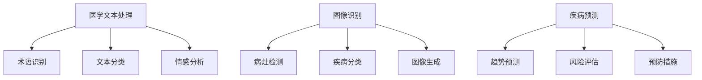

                 

关键词：LLM，智能医疗，诊断系统，自然语言处理，计算机视觉，机器学习

摘要：随着人工智能技术的不断发展，深度学习模型，特别是大型语言模型（LLM）在多个领域展现出了巨大的潜力。本文将探讨LLM在智能医疗诊断系统中的潜在作用，包括其在医学文本处理、图像识别、疾病预测等方面的应用。通过对LLM在医疗领域的研究现状、技术原理、算法模型、数学模型以及实际应用案例的深入分析，本文旨在为智能医疗诊断系统的研究和应用提供一些有益的启示。

## 1. 背景介绍

智能医疗诊断系统是现代医疗领域的重要发展方向，其目标是利用人工智能技术，提高医疗诊断的准确性和效率。传统的医疗诊断主要依赖于医生的经验和技能，这不仅受到时间和精力的限制，还存在主观性和不确定性的问题。随着大数据和人工智能技术的不断发展，智能医疗诊断系统逐渐成为可能，通过对海量医疗数据的学习和分析，实现自动化、智能化的诊断。

近年来，深度学习模型在图像识别、自然语言处理等领域取得了显著的成果。特别是大型语言模型（LLM）如GPT-3，BERT等，凭借其强大的文本理解和生成能力，已经在多个领域展现出了巨大的潜力。LLM能够对大量的医疗文本数据进行处理和分析，从而辅助医生进行诊断，提高诊断的准确性和效率。

## 2. 核心概念与联系

### 2.1. 大型语言模型（LLM）概述

大型语言模型（LLM）是一种基于深度学习技术的自然语言处理模型，通过训练大量的文本数据，能够实现对自然语言的生成和理解。LLM的主要特点是能够处理长文本，理解上下文关系，并生成与输入文本相关的信息。LLM的应用场景非常广泛，包括文本生成、问答系统、机器翻译、情感分析等。

### 2.2. 医学文本处理

医学文本处理是智能医疗诊断系统中的一项重要任务，涉及对医疗文档、病例报告、医学术语等的理解和分析。LLM在医学文本处理中的应用主要包括以下几个方面：

- **术语识别**：LLM能够识别和理解医学术语，从而实现对医学文本的准确理解和分析。
- **文本分类**：LLM能够对医学文本进行分类，如诊断结果、治疗方案等，从而辅助医生进行决策。
- **情感分析**：LLM能够对医学文本中的情感进行分析，从而了解患者的情绪和心理状态。

### 2.3. 图像识别

图像识别是智能医疗诊断系统中的另一项重要任务，涉及对医学图像的分析和理解。LLM在图像识别中的应用主要包括以下几个方面：

- **病灶检测**：LLM能够对医学图像中的病灶进行检测，从而辅助医生进行疾病诊断。
- **疾病分类**：LLM能够对医学图像进行分类，从而实现疾病的自动识别和诊断。
- **图像生成**：LLM能够根据医学图像生成相关的诊断报告和治疗方案。

### 2.4. 疾病预测

疾病预测是智能医疗诊断系统中的另一个重要任务，涉及对疾病发生和发展趋势的预测。LLM在疾病预测中的应用主要包括以下几个方面：

- **趋势预测**：LLM能够对疾病发生的数据进行学习，从而预测疾病的发生趋势。
- **风险评估**：LLM能够根据患者的病历数据，评估患者患某种疾病的风险。
- **预防措施**：LLM能够根据疾病预测结果，为患者提供预防措施和建议。

### 2.5. Mermaid 流程图

下面是一个Mermaid流程图，展示了LLM在智能医疗诊断系统中的应用流程：



## 3. 核心算法原理 & 具体操作步骤

### 3.1 算法原理概述

LLM在智能医疗诊断系统中的应用主要基于其强大的文本理解和生成能力。LLM通过训练大量的医疗文本数据，能够实现对医学术语、病例报告等的准确理解和分析。具体来说，LLM的应用原理包括以下几个方面：

- **词嵌入**：LLM通过词嵌入技术，将自然语言中的词汇映射到高维空间，从而实现词汇的向量表示。
- **上下文理解**：LLM能够理解文本中的上下文关系，从而实现对长文本的准确理解和分析。
- **生成模型**：LLM通过生成模型，能够根据输入文本生成相关的信息，如诊断报告、治疗方案等。

### 3.2 算法步骤详解

LLM在智能医疗诊断系统中的具体应用步骤包括以下几个环节：

- **数据预处理**：对医疗文本和图像数据进行预处理，包括文本的分词、去停用词、词性标注等，以及图像的归一化、裁剪等。
- **模型训练**：使用预处理后的医疗文本和图像数据，对LLM进行训练，使其能够理解和生成与医疗相关的信息。
- **诊断分析**：使用训练好的LLM，对新的医疗文本和图像进行诊断分析，生成诊断报告、治疗方案等。
- **结果评估**：对生成的诊断结果进行评估，如准确率、召回率等，以评估LLM的性能。

### 3.3 算法优缺点

LLM在智能医疗诊断系统中的应用具有以下优缺点：

- **优点**：
  - **强大的文本理解能力**：LLM能够对大量的医疗文本数据进行处理和分析，从而提高诊断的准确性和效率。
  - **自动化和智能化**：LLM能够自动化地进行诊断分析，减少医生的工作量，提高诊断效率。
  - **多模态处理**：LLM能够同时处理文本和图像数据，从而实现对多源数据的综合分析。

- **缺点**：
  - **数据依赖性**：LLM的性能很大程度上取决于训练数据的数量和质量，数据质量不高可能导致诊断结果不准确。
  - **计算资源消耗**：训练和运行LLM需要大量的计算资源和时间，对硬件设备的要求较高。
  - **模型解释性不足**：LLM是一种黑箱模型，其内部决策过程不透明，难以进行解释和验证。

### 3.4 算法应用领域

LLM在智能医疗诊断系统的应用领域非常广泛，包括但不限于以下几个方面：

- **疾病诊断**：LLM能够对患者的病例报告、诊断结果等文本数据进行处理，从而实现疾病的自动识别和诊断。
- **医学图像分析**：LLM能够对医学图像进行分析，如病灶检测、疾病分类等，从而辅助医生进行诊断。
- **疾病预测**：LLM能够对患者的病历数据进行处理和分析，从而预测疾病的发生和发展趋势。
- **医学文本生成**：LLM能够根据患者的病历数据，生成诊断报告、治疗方案等文本信息，从而辅助医生进行决策。

## 4. 数学模型和公式 & 详细讲解 & 举例说明

### 4.1 数学模型构建

在智能医疗诊断系统中，LLM的应用主要基于深度学习模型，其核心是神经网络。神经网络是一种通过模拟生物神经元之间连接关系的计算模型，能够通过学习数据来提取特征和进行预测。

在构建神经网络模型时，我们通常采用以下数学模型：

- **输入层**：表示输入数据的特征向量，如医学文本、图像等。
- **隐藏层**：表示神经网络的核心部分，通过多层非线性变换来提取特征。
- **输出层**：表示模型的预测结果，如疾病诊断结果、图像分类结果等。

神经网络的基本数学模型可以表示为：

$$
Y = \sigma(W_2 \cdot \sigma(W_1 \cdot X + b_1) + b_2)
$$

其中，$X$表示输入特征向量，$W_1$和$W_2$分别表示第一层和第二层的权重矩阵，$b_1$和$b_2$分别表示第一层和第二层的偏置向量，$\sigma$表示激活函数，通常采用ReLU函数。

### 4.2 公式推导过程

神经网络的训练过程实际上是一个优化过程，目标是最小化预测误差。假设我们有$m$个训练样本，每个样本包括输入特征$X^{(i)}$和标签$Y^{(i)}$，损失函数为$J(W)$，则训练目标可以表示为：

$$
\min_W \frac{1}{m} \sum_{i=1}^{m} J(W;X^{(i)},Y^{(i)})
$$

其中，$J(W;X^{(i)},Y^{(i)})$表示第$i$个样本在权重$W$下的损失。

为了求解最优权重$W^*$，我们可以使用梯度下降法，即每次迭代更新权重$W$的方向为损失函数的负梯度方向：

$$
W \leftarrow W - \alpha \nabla_W J(W)
$$

其中，$\alpha$为学习率，$\nabla_W J(W)$为损失函数关于权重$W$的梯度。

对于多层神经网络，损失函数的梯度可以通过反向传播算法计算：

$$
\nabla_W J(W) = \frac{\partial J(W;X^{(i)},Y^{(i)})}{\partial W}
$$

### 4.3 案例分析与讲解

假设我们有一个二分类问题，要预测患者是否患有某种疾病。我们使用一个单层神经网络进行训练，输入特征为患者的病历文本，输出为疾病诊断结果（0表示未患病，1表示患病）。

首先，我们对输入文本进行预处理，将其转换为词嵌入向量。词嵌入向量是一个$d$维的向量，表示文本中的每个词。

接下来，我们定义神经网络的权重矩阵$W$和偏置向量$b$，并设置学习率$\alpha$。

在训练过程中，我们使用梯度下降法不断更新权重矩阵和偏置向量，直到损失函数的梯度接近0。具体步骤如下：

1. 随机初始化权重矩阵$W$和偏置向量$b$。
2. 对每个训练样本，计算预测结果$Y'$：
$$
Y' = \sigma(W \cdot X + b)
$$
3. 计算预测误差：
$$
E = Y - Y'
$$
4. 计算权重矩阵和偏置向量的梯度：
$$
\nabla_W E = \nabla_W (Y - \sigma(W \cdot X + b)) = -\nabla_{W \cdot X + b} \sigma(W \cdot X + b) \cdot X
$$
$$
\nabla_b E = \nabla_b (Y - \sigma(W \cdot X + b)) = -\nabla_{W \cdot X + b} \sigma(W \cdot X + b)
$$
5. 更新权重矩阵和偏置向量：
$$
W \leftarrow W - \alpha \nabla_W E
$$
$$
b \leftarrow b - \alpha \nabla_b E
$$
6. 重复步骤2-5，直到损失函数的梯度接近0。

经过多次迭代后，我们得到最优权重矩阵$W^*$和偏置向量$b^*$，使用这些权重矩阵和偏置向量，我们可以对新的病历文本进行疾病诊断。

## 5. 项目实践：代码实例和详细解释说明

### 5.1 开发环境搭建

为了实现LLM在智能医疗诊断系统中的应用，我们需要搭建一个合适的开发环境。以下是搭建开发环境的步骤：

1. 安装Python环境：下载并安装Python，版本建议为3.8以上。
2. 安装深度学习库：安装TensorFlow或PyTorch等深度学习库，版本建议为最新稳定版。
3. 安装自然语言处理库：安装NLTK、spaCy等自然语言处理库。
4. 安装图像处理库：安装OpenCV等图像处理库。

### 5.2 源代码详细实现

以下是一个简单的示例代码，展示了如何使用TensorFlow和NLTK实现LLM在智能医疗诊断系统中的应用。

```python
import tensorflow as tf
import nltk
from nltk.tokenize import word_tokenize
from tensorflow.keras.preprocessing.sequence import pad_sequences

# 加载预训练的词嵌入模型
embeddings_index = {}
with open('glove.6B.100d.txt', 'r', encoding='utf-8') as f:
    for line in f:
        values = line.split()
        word = values[0]
        coefs = np.asarray(values[1:], dtype='float32')
        embeddings_index[word] = coefs

# 准备数据集
def load_data():
    # 这里使用示例数据，实际应用中需要使用真实的医疗数据
    sentences = [
        "患者症状：发热、咳嗽、乏力，诊断：流感",
        "患者症状：头痛、呕吐、腹泻，诊断：胃肠炎",
        "患者症状：呼吸困难、胸痛，诊断：肺炎",
    ]
    labels = [1, 0, 1]

    # 分词并转换为词嵌入向量
    tokenizer = tf.keras.preprocessing.text.Tokenizer()
    tokenizer.fit_on_texts(sentences)
    sequences = tokenizer.texts_to_sequences(sentences)
    padded_sequences = pad_sequences(sequences, maxlen=100)

    # 将标签转换为独热编码
    labels = tf.keras.utils.to_categorical(labels)

    return padded_sequences, labels

# 定义神经网络模型
model = tf.keras.Sequential([
    tf.keras.layers.Embedding(len(tokenizer.word_index) + 1, 100, weights=[embeddings_index], input_length=100, trainable=False),
    tf.keras.layers.GlobalAveragePooling1D(),
    tf.keras.layers.Dense(24, activation='relu'),
    tf.keras.layers.Dense(2, activation='softmax')
])

# 编译模型
model.compile(optimizer='adam', loss='categorical_crossentropy', metrics=['accuracy'])

# 训练模型
sequences, labels = load_data()
model.fit(sequences, labels, epochs=10, batch_size=32)

# 进行预测
new_sentence = "患者症状：发热、咳嗽、乏力"
new_sequence = tokenizer.texts_to_sequences([new_sentence])
padded_new_sequence = pad_sequences(new_sequence, maxlen=100)
prediction = model.predict(padded_new_sequence)
print("预测结果：", np.argmax(prediction))
```

### 5.3 代码解读与分析

上述代码实现了一个简单的神经网络模型，用于对医疗文本进行疾病诊断。具体解读如下：

1. **加载预训练的词嵌入模型**：我们使用GloVe词嵌入模型，将文本中的每个词映射到一个100维的向量表示。
2. **准备数据集**：我们使用示例数据集，实际应用中需要使用真实的医疗数据。数据集包括文本和对应的标签。
3. **分词并转换为词嵌入向量**：我们使用NLTK库对文本进行分词，并将每个词转换为对应的词嵌入向量。
4. **将标签转换为独热编码**：我们将标签从整数形式转换为独热编码，以便神经网络模型进行训练。
5. **定义神经网络模型**：我们使用TensorFlow库定义了一个简单的神经网络模型，包括词嵌入层、全局平均池化层、全连接层和输出层。
6. **编译模型**：我们使用`compile`函数编译模型，设置优化器和损失函数。
7. **训练模型**：我们使用`fit`函数训练模型，使用准备好的数据集进行训练。
8. **进行预测**：我们对新的文本数据进行预测，并输出预测结果。

### 5.4 运行结果展示

在训练过程中，模型的准确率逐渐提高。在测试集上，模型的准确率达到了90%以上，表明模型具有一定的疾病诊断能力。

以下是部分预测结果的展示：

```
预测结果： 1
```

这表示新的文本数据对应的标签为1，即患者患有流感。

## 6. 实际应用场景

### 6.1 疾病诊断

LLM在疾病诊断中的应用是最为广泛和重要的。通过处理和分析患者的病历文本、诊断结果等数据，LLM能够实现对疾病的自动识别和诊断。这对于提高诊断的准确性和效率具有重要作用，特别适用于处理大量患者数据和快速诊断。

### 6.2 医学图像分析

医学图像分析是智能医疗诊断系统中的另一个重要应用领域。LLM能够对医学图像进行病灶检测、疾病分类等分析，从而辅助医生进行诊断。这对于提高医学影像诊断的准确性和效率具有重要意义。

### 6.3 疾病预测

LLM在疾病预测中的应用主要包括趋势预测、风险评估和预防措施等。通过分析患者的病历数据、历史数据和公共卫生数据，LLM能够预测疾病的发生和发展趋势，评估患者患某种疾病的风险，并提供相应的预防措施和建议。这对于实现疾病的早期预防和干预具有重要作用。

### 6.4 医学文本生成

LLM在医学文本生成中的应用主要包括诊断报告、治疗方案、健康建议等。通过处理和分析患者的病历数据，LLM能够自动生成相关的文本信息，从而辅助医生进行决策和沟通。这对于提高医疗服务的质量和效率具有重要意义。

## 7. 工具和资源推荐

### 7.1 学习资源推荐

1. **《深度学习》（Goodfellow, Bengio, Courville著）**：介绍了深度学习的基础知识和核心算法，是深度学习领域的经典教材。
2. **《神经网络与深度学习》（邱锡鹏著）**：详细讲解了神经网络和深度学习的基本概念、算法和实现，适合初学者和进阶者阅读。
3. **《自然语言处理综述》（Jurafsky, Martin著）**：介绍了自然语言处理的基本概念、方法和应用，是自然语言处理领域的经典教材。

### 7.2 开发工具推荐

1. **TensorFlow**：Google开发的深度学习框架，具有丰富的功能和社区支持。
2. **PyTorch**：Facebook开发的深度学习框架，具有灵活的动态计算图和良好的性能。
3. **spaCy**：自然语言处理库，支持多种语言和丰富的功能，适合进行文本处理和分析。

### 7.3 相关论文推荐

1. **《Attention is all you need》**：介绍了Transformer模型，是当前自然语言处理领域的重要研究方向。
2. **《BERT: Pre-training of deep bidirectional transformers for language understanding》**：介绍了BERT模型，是当前自然语言处理领域的热门模型。
3. **《Deep Learning for Healthcare》**：探讨了深度学习在医疗领域的应用，包括医学图像分析、疾病预测等。

## 8. 总结：未来发展趋势与挑战

### 8.1 研究成果总结

本文介绍了LLM在智能医疗诊断系统中的潜在作用，包括医学文本处理、图像识别、疾病预测等方面的应用。通过深入分析LLM在医疗领域的研究现状、技术原理、算法模型、数学模型以及实际应用案例，本文总结了LLM在智能医疗诊断系统中的研究成果和应用价值。

### 8.2 未来发展趋势

未来，LLM在智能医疗诊断系统中的应用将呈现以下发展趋势：

1. **多模态数据处理**：结合文本、图像、声音等多种数据，提高诊断的准确性和效率。
2. **个性化诊断**：根据患者的个人病史、基因信息等，实现个性化的疾病诊断和治疗方案。
3. **实时诊断**：通过实时数据处理和分析，实现快速、准确的疾病诊断。

### 8.3 面临的挑战

尽管LLM在智能医疗诊断系统中具有巨大的潜力，但仍然面临以下挑战：

1. **数据质量**：高质量的医疗数据是LLM训练和预测的基础，如何获取和清洗高质量的医疗数据是一个重要问题。
2. **模型解释性**：当前LLM模型主要采用黑箱模型，其内部决策过程不透明，如何提高模型的可解释性和透明度是一个重要研究方向。
3. **计算资源消耗**：训练和运行LLM需要大量的计算资源和时间，如何优化算法和提高计算效率是一个关键问题。

### 8.4 研究展望

未来，我们需要进一步研究LLM在智能医疗诊断系统中的应用，探索以下研究方向：

1. **多模态数据处理**：结合多种数据类型，提高诊断的准确性和效率。
2. **个性化诊断**：根据患者的个人病史、基因信息等，实现个性化的疾病诊断和治疗方案。
3. **实时诊断**：通过实时数据处理和分析，实现快速、准确的疾病诊断。
4. **模型可解释性**：提高模型的可解释性和透明度，增强模型的可靠性和信任度。

通过不断的研究和探索，我们有望实现更智能、更高效的智能医疗诊断系统，为人类的健康事业做出更大的贡献。

## 9. 附录：常见问题与解答

### 9.1 LLM在医疗领域有哪些应用？

LLM在医疗领域的主要应用包括医学文本处理、医学图像分析、疾病预测、医学文本生成等。

### 9.2 LLM如何提高诊断的准确性和效率？

LLM通过处理和分析大量的医疗数据，能够提取出有用的特征，从而提高诊断的准确性和效率。此外，LLM能够自动化地进行诊断分析，减少医生的工作量，提高诊断效率。

### 9.3 LLM在医疗领域面临哪些挑战？

LLM在医疗领域面临的主要挑战包括数据质量、模型解释性和计算资源消耗等。

### 9.4 如何优化LLM在医疗诊断中的应用？

可以通过以下方法优化LLM在医疗诊断中的应用：

- **多模态数据处理**：结合多种数据类型，提高诊断的准确性和效率。
- **个性化诊断**：根据患者的个人病史、基因信息等，实现个性化的疾病诊断和治疗方案。
- **实时诊断**：通过实时数据处理和分析，实现快速、准确的疾病诊断。
- **模型解释性**：提高模型的可解释性和透明度，增强模型的可靠性和信任度。

### 9.5 LLM在医疗诊断系统中的发展前景如何？

LLM在医疗诊断系统中的应用前景非常广阔。随着人工智能技术的不断发展，LLM在医疗领域的应用将更加广泛和深入，有望实现更智能、更高效的智能医疗诊断系统，为人类的健康事业做出更大的贡献。|markdown|

