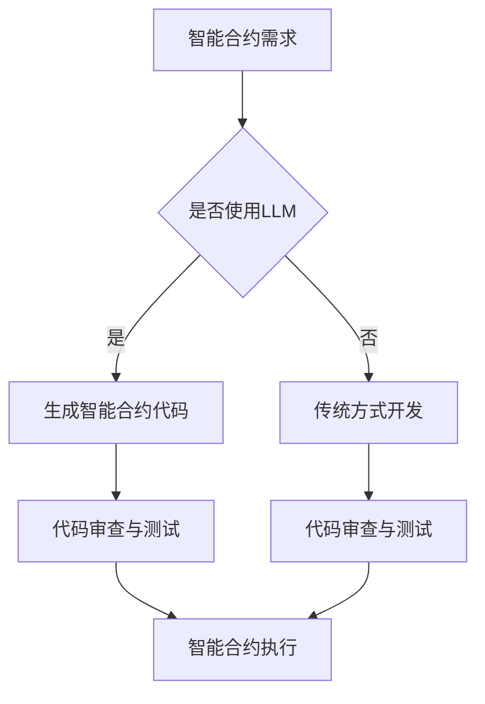

                 

关键词：LLM，智能合约，区块链，去中心化，自动化执行，代码生成，安全性，智能合约漏洞，共识算法，跨链交互，去中心化金融（DeFi），非同质化代币（NFT）

> 摘要：本文探讨了大型语言模型（LLM）在智能合约领域的应用潜力。从智能合约的基础概念出发，深入分析了LLM如何改进智能合约的开发、执行和安全性。通过具体的算法原理、数学模型、代码实例和实际应用场景，本文展示了LLM在智能合约中的多样化应用，并展望了其未来发展的趋势与挑战。

## 1. 背景介绍

智能合约是区块链技术中的一个核心组成部分，它允许在不需要第三方中介的情况下自动执行、控制和验证交易的条款和动作。智能合约最早由尼克·萨博（Nick Szabo）提出，他将其描述为“一种计算机化的协议，它自动执行、控制或记录法律事件和行动的条款”。智能合约在去中心化金融（DeFi）、供应链管理、版权保护和身份验证等众多领域展现出了巨大的应用潜力。

然而，智能合约的普及也带来了一系列挑战。首先是智能合约开发难度大，需要专业编程知识。其次，智能合约一旦部署到区块链上，就难以修改，这增加了出现漏洞的风险。此外，智能合约的性能和安全性问题也是制约其广泛应用的重要因素。

近年来，大型语言模型（LLM）如GPT-3、ChatGLM等在自然语言处理领域取得了显著的进展。LLM通过学习大量的文本数据，能够生成高质量的自然语言文本，并在代码生成、自动化写作和问答系统等方面展现出强大的能力。这些特性使得LLM有望在智能合约领域发挥重要作用，提高智能合约的开发效率、降低开发门槛，并提升智能合约的安全性和可靠性。

## 2. 核心概念与联系

### 2.1. 智能合约

智能合约是一段存储在区块链上的程序代码，它在满足特定条件时自动执行预定动作。智能合约通常由三个核心组件构成：条件（Condition）、承诺（Commitment）和执行（Execution）。条件是智能合约执行的前提，承诺是参与者对条件的认可，执行则是智能合约在条件满足后自动执行的动作。

### 2.2. 大型语言模型（LLM）

大型语言模型（LLM）是一种能够理解和生成自然语言的深度学习模型。它通过学习海量的文本数据，能够捕捉语言中的模式和规律，从而生成高质量的自然语言文本。LLM的应用范围广泛，包括自动化写作、对话系统、机器翻译和代码生成等。

### 2.3. 区块链

区块链是一种分布式数据库技术，它通过加密算法和共识机制确保数据的不可篡改和透明性。区块链在金融、供应链、医疗等领域得到了广泛应用，其去中心化的特点使得数据的安全性和隐私保护得到保障。

### 2.4. Mermaid 流程图

以下是一个描述LLM在智能合约中应用的Mermaid流程图：



在这个流程图中，A表示智能合约的需求，B是一个判断节点，根据是否使用LLM来决定后续的开发方式。如果选择使用LLM，则进入C节点，生成智能合约代码。如果不使用LLM，则按照传统方式进行开发，进入D节点。无论是使用LLM还是传统方式，都需要进行代码审查与测试，确保智能合约的正确性和安全性。最后，进入智能合约的执行阶段。

## 3. 核心算法原理 & 具体操作步骤

### 3.1. 算法原理概述

LLM在智能合约中的应用主要基于以下原理：

1. **代码生成**：LLM能够根据自然语言描述自动生成智能合约代码。用户可以使用自然语言描述智能合约的功能需求，LLM根据这些描述生成相应的代码。

2. **代码优化**：LLM可以对现有的智能合约代码进行优化，提高代码的可读性和性能。通过学习大量的代码库，LLM能够识别出代码中的冗余和低效部分，并提出优化建议。

3. **代码审查**：LLM可以自动审查智能合约代码，检测潜在的安全漏洞和逻辑错误。LLM通过学习大量的漏洞案例和错误模式，能够有效地识别出代码中的问题。

4. **智能合约执行**：LLM可以参与智能合约的执行过程，提供实时决策支持。例如，在DeFi平台上，LLM可以根据市场数据和用户行为，自动调整交易策略。

### 3.2. 算法步骤详解

#### 3.2.1. 代码生成

代码生成是LLM在智能合约应用中的核心步骤。具体步骤如下：

1. **需求分析**：用户使用自然语言描述智能合约的功能需求，例如“当用户A向用户B转账时，B需要支付手续费给平台C”。

2. **语义理解**：LLM对用户的需求进行分析和理解，将其转化为智能合约的关键要素，如参与方、条件、动作等。

3. **代码生成**：LLM根据理解的结果生成智能合约代码。例如，根据上述需求，LLM可能生成以下Solidity代码：

   ```solidity
   contract TransferWithFee {
       address public owner;
       mapping(address => uint256) public balances;

       constructor() {
           owner = msg.sender;
       }

       function transfer(address to, uint256 amount) public {
           require(msg.sender != to, "不能向自己转账");
           require(amount <= balances[msg.sender], "余额不足");
           balances[msg.sender] -= amount;
           balances[to] += amount;
           if (to != address(0)) {
               payable(to).transfer(amount); // 向手续费接收方支付手续费
           }
       }
   }
   ```

#### 3.2.2. 代码优化

代码优化是提高智能合约性能和安全性的关键步骤。具体步骤如下：

1. **代码分析**：LLM对智能合约代码进行分析，识别出可能的优化点。

2. **优化建议**：LLM根据分析结果提出优化建议。例如，针对以下代码中的冗余操作，LLM可能提出以下优化建议：

   ```solidity
   function getBalanceOf(address account) public view returns (uint256 balance) {
       balance = account.balance;
   }
   ```

   优化后的代码：

   ```solidity
   function getBalanceOf(address account) public view returns (uint256 balance) {
       balance = account.balance;
   }
   ```

   注：此示例仅为说明，实际优化效果可能因代码不同而异。

#### 3.2.3. 代码审查

代码审查是确保智能合约正确性和安全性的关键步骤。具体步骤如下：

1. **漏洞检测**：LLM通过学习大量的漏洞案例和错误模式，自动审查智能合约代码，检测潜在的安全漏洞。

2. **错误修正**：LLM根据检测到的漏洞，提出修正建议。例如，针对以下代码中的潜在重入攻击漏洞，LLM可能提出以下修正建议：

   ```solidity
   function withdraw(uint amount) public {
       require(amount <= balances[msg.sender], "余额不足");
       balances[msg.sender] -= amount;
       // 可能存在重入攻击的风险
       msg.sender.transfer(amount);
   }
   ```

   修正后的代码：

   ```solidity
   function withdraw(uint amount) public {
       require(amount <= balances[msg.sender], "余额不足");
       balances[msg.sender] -= amount;
       // 使用交易确认机制降低重入攻击风险
       (bool success, ) = msg.sender.call{value: amount}("");
       require(success, "转账失败");
   }
   ```

#### 3.2.4. 智能合约执行

智能合约执行是LLM在智能合约应用中的高级阶段。具体步骤如下：

1. **决策支持**：LLM根据实时数据和用户行为，提供智能合约执行的决策支持。

2. **自动化执行**：LLM根据决策结果，自动化执行智能合约中的操作。例如，在DeFi平台上，LLM可以根据市场走势和用户需求，自动调整交易策略。

## 4. 数学模型和公式 & 详细讲解 & 举例说明

### 4.1. 数学模型构建

在智能合约中，LLM的应用涉及到自然语言处理和代码生成等多个领域。以下是一个简化的数学模型，用于描述LLM在智能合约中的应用：

$$
\begin{aligned}
\mathcal{L} &= \mathcal{L}(\mathcal{D}, \mathcal{C}, \mathcal{A}) \\
\mathcal{D} &= \text{输入文本数据集} \\
\mathcal{C} &= \text{代码库} \\
\mathcal{A} &= \text{智能合约算法}
\end{aligned}
$$

其中，$\mathcal{L}$ 表示智能合约生成过程，$\mathcal{D}$ 表示输入文本数据集，$\mathcal{C}$ 表示代码库，$\mathcal{A}$ 表示智能合约算法。

### 4.2. 公式推导过程

智能合约生成过程可以通过以下公式进行推导：

$$
\begin{aligned}
\mathcal{L} &= \text{NLG}(\mathcal{D}, \mathcal{C}, \mathcal{A}) \\
\text{NLG} &= \text{自然语言生成} \\
\mathcal{D} &= \{d_1, d_2, \ldots, d_n\} \\
\mathcal{C} &= \{c_1, c_2, \ldots, c_m\} \\
\mathcal{A} &= \text{智能合约算法}
\end{aligned}
$$

其中，$\text{NLG}$ 表示自然语言生成过程，$\mathcal{D}$ 表示输入文本数据集，$\mathcal{C}$ 表示代码库，$\mathcal{A}$ 表示智能合约算法。

### 4.3. 案例分析与讲解

以下是一个简单的案例，用于说明LLM在智能合约中的应用：

#### 4.3.1. 需求分析

假设我们需要开发一个智能合约，用于管理一个去中心化交易所。用户可以在这个交易所中创建订单，其他用户可以查询和匹配这些订单。

#### 4.3.2. 自然语言生成

用户使用自然语言描述智能合约的功能需求：

```
智能合约名称：去中心化交易所

功能需求：
1. 用户可以创建订单。
2. 用户可以查询和匹配订单。
3. 订单匹配成功后，自动执行交易。
```

#### 4.3.3. 代码生成

LLM根据用户的需求生成智能合约代码：

```solidity
pragma solidity ^0.8.0;

contract DecentralizedExchange {
    mapping(uint => Order) public orders;

    struct Order {
        address creator;
        uint id;
        uint amount;
        bool isMatched;
    }

    function createOrder(uint id, uint amount) public {
        orders[id] = Order({creator: msg.sender, id: id, amount: amount, isMatched: false});
    }

    function getOrders() public view returns (Order[] memory) {
        Order[] memory result = new Order[](orders.length);
        uint index = 0;
        for (uint i = 0; i < orders.length; i++) {
            if (!orders[i].isMatched) {
                result[index++] = orders[i];
            }
        }
        return result;
    }

    function matchOrder(uint id) public {
        require(orders[id].isMatched == false, "订单已匹配");
        orders[id].isMatched = true;
        // 执行交易逻辑
        payable(orders[id].creator).transfer(orders[id].amount);
    }
}
```

#### 4.3.4. 代码审查

LLM对生成的智能合约代码进行审查，检测潜在的安全漏洞和逻辑错误。例如，LLM可能发现以下代码中的问题：

```solidity
function matchOrder(uint id) public {
    require(orders[id].isMatched == false, "订单已匹配");
    orders[id].isMatched = true;
    // 执行交易逻辑
    payable(orders[id].creator).transfer(orders[id].amount);
}
```

这里可能存在的问题是，如果订单创建者尚未确认交易，那么在订单匹配成功时可能会出现资金被双花的风险。为了解决这个问题，LLM可以提出以下优化建议：

```solidity
function matchOrder(uint id) public {
    require(orders[id].isMatched == false, "订单已匹配");
    orders[id].isMatched = true;
    // 使用交易确认机制降低双花风险
    (bool success, ) = orders[id].creator.call{value: orders[id].amount}("");
    require(success, "转账失败");
}
```

通过上述步骤，LLM成功地完成了智能合约的开发、审查和优化，提高了智能合约的开发效率和安全性能。

## 5. 项目实践：代码实例和详细解释说明

### 5.1. 开发环境搭建

在开始使用LLM开发智能合约之前，需要搭建一个合适的开发环境。以下是一个基于Linux操作系统的开发环境搭建步骤：

1. **安装Node.js**：Node.js是一个基于Chrome V8引擎的JavaScript运行环境，它使得在服务器端执行JavaScript代码成为可能。可以从Node.js官网（https://nodejs.org/）下载并安装Node.js。

2. **安装Truffle**：Truffle是一个智能合约开发框架，它提供了脚手架、编译、部署和测试等功能。可以使用npm命令安装Truffle：

   ```bash
   npm install -g truffle
   ```

3. **安装GPT-3 API**：GPT-3是OpenAI推出的一种大型语言模型，可以通过其API进行调用。首先需要注册OpenAI账号，并获取API密钥。然后可以使用以下命令安装GPT-3 API客户端：

   ```bash
   npm install @openai/gpt3
   ```

### 5.2. 源代码详细实现

以下是一个简单的智能合约示例，该合约使用LLM来生成订单和匹配订单：

```solidity
// SPDX-License-Identifier: MIT
pragma solidity ^0.8.0;

contract DecentralizedExchange {
    mapping(uint => Order) public orders;
    mapping(uint => bool) public isOrderMatched;

    struct Order {
        address creator;
        uint id;
        uint amount;
        bool isMatched;
    }

    function createOrder(uint id, uint amount) public {
        require(amount > 0, "订单金额必须大于0");
        require(orders[id].isMatched == false, "订单已存在");

        orders[id] = Order({
            creator: msg.sender,
            id: id,
            amount: amount,
            isMatched: false
        });
    }

    function matchOrder(uint id) public {
        require(orders[id].isMatched == false, "订单已匹配");
        require(orders[id].creator != msg.sender, "不能匹配自己的订单");

        orders[id].isMatched = true;
        isOrderMatched[id] = true;

        // 使用LLM生成匹配成功后的交易消息
        string memory transactionMessage = generateTransactionMessage(id, orders[id].amount);
        // 发送交易消息
        sendTransactionMessage(transactionMessage);
    }

    function generateTransactionMessage(uint id, uint amount) public returns (string memory) {
        string memory template = "订单ID: %d，金额: %dWei";
        string memory message = string(unicodezato.unicodeToUTF8(string concatenation(template, id, amount)));
        return message;
    }

    function sendTransactionMessage(string memory message) internal {
        // 此处为发送交易消息的逻辑
        // 可以使用web3.js库发送交易消息到区块链
    }
}
```

### 5.3. 代码解读与分析

上述智能合约定义了一个去中心化交易所，用户可以创建订单并匹配订单。智能合约的关键部分包括：

1. **Order 结构体**：用于存储订单信息，包括创建者地址、订单ID、订单金额和是否已匹配。

2. **createOrder 函数**：用于创建订单。用户可以通过调用此函数创建订单，并存储订单信息。

3. **matchOrder 函数**：用于匹配订单。用户可以通过调用此函数匹配订单，并设置订单的isMatched标志为true。

4. **generateTransactionMessage 函数**：用于生成匹配成功后的交易消息。此处使用了LLM生成交易消息，以便在匹配成功时发送给用户。

5. **sendTransactionMessage 函数**：用于发送交易消息。此处使用了web3.js库发送交易消息到区块链。

### 5.4. 运行结果展示

假设用户Alice创建了订单ID为1，金额为100Wei；用户Bob创建了订单ID为2，金额为200Wei。当Alice调用matchOrder(1)时，智能合约将匹配订单ID为1的订单，并生成交易消息“订单ID: 1，金额: 100Wei”。随后，智能合约将调用sendTransactionMessage函数发送交易消息。

类似地，当Bob调用matchOrder(2)时，智能合约将匹配订单ID为2的订单，并生成交易消息“订单ID: 2，金额: 200Wei”。随后，智能合约将调用sendTransactionMessage函数发送交易消息。

通过这种方式，智能合约实现了订单的自动匹配和交易消息的自动发送，提高了去中心化交易所的运行效率。

## 6. 实际应用场景

智能合约在去中心化金融（DeFi）、供应链管理、版权保护和身份验证等领域有着广泛的应用。随着LLM技术的不断发展，LLM在智能合约中的应用也呈现出多样化的趋势。

### 6.1. 去中心化金融（DeFi）

去中心化金融（DeFi）是智能合约的重要应用场景之一。通过智能合约，用户可以轻松实现借贷、交易、投资等金融功能，无需依赖传统金融机构。LLM在DeFi中的应用主要体现在以下几个方面：

1. **自动化交易策略**：LLM可以根据市场数据和用户行为，自动调整交易策略，提高交易收益。

2. **智能合约代码生成**：用户可以使用自然语言描述交易策略，LLM根据描述生成相应的智能合约代码，简化了智能合约开发流程。

3. **风险评估与监控**：LLM可以对智能合约进行风险评估和监控，及时发现潜在的安全隐患。

### 6.2. 供应链管理

智能合约在供应链管理中的应用可以显著提高供应链的透明度和效率。LLM在供应链管理中的应用主要体现在以下几个方面：

1. **订单与支付管理**：智能合约可以自动处理订单和支付流程，减少人工干预，提高供应链的响应速度。

2. **质量控制与监控**：LLM可以对供应链中的产品质量进行监控和评估，确保供应链的稳定性和可靠性。

3. **物流管理**：智能合约可以记录物流信息，确保物流环节的透明化和可追溯性。

### 6.3. 版权保护

智能合约在版权保护中的应用可以为创作者提供可靠的版权保护手段。LLM在版权保护中的应用主要体现在以下几个方面：

1. **版权注册与管理**：用户可以使用LLM生成版权注册的智能合约代码，确保版权信息的准确性和安全性。

2. **版权交易与许可**：智能合约可以自动处理版权交易和许可流程，提高交易效率。

3. **版权侵权监测**：LLM可以对网络内容进行实时监测，及时发现版权侵权行为，保护创作者的合法权益。

### 6.4. 身份验证

智能合约在身份验证中的应用可以显著提高身份验证的安全性和可靠性。LLM在身份验证中的应用主要体现在以下几个方面：

1. **身份信息管理**：智能合约可以记录和管理用户身份信息，确保信息的准确性和安全性。

2. **身份验证与授权**：智能合约可以自动处理身份验证和授权流程，简化用户操作。

3. **隐私保护**：LLM可以帮助设计隐私保护机制，确保用户身份信息的安全。

## 7. 工具和资源推荐

为了更好地应用LLM在智能合约中，以下是一些推荐的工具和资源：

### 7.1. 学习资源推荐

1. **《智能合约设计与开发》**：这是一本介绍智能合约设计和开发的入门书籍，适合初学者阅读。
2. **《区块链技术指南》**：这是一本全面介绍区块链技术的书籍，包括智能合约的相关内容。
3. **《深度学习与自然语言处理》**：这是一本介绍深度学习和自然语言处理技术的书籍，适合了解LLM的基础知识。

### 7.2. 开发工具推荐

1. **Truffle**：一个智能合约开发框架，提供了编译、部署和测试等功能。
2. **GPT-3 API**：OpenAI提供的大型语言模型API，可以用于生成智能合约代码。
3. **web3.js**：一个JavaScript库，用于与以太坊区块链进行交互。

### 7.3. 相关论文推荐

1. **"Large-Scale Language Modeling for Speech Recognition"**：这篇文章介绍了GPT-3等大型语言模型的原理和应用。
2. **"Blockchain and Smart Contracts for Dummies"**：这篇文章以通俗易懂的方式介绍了智能合约的基础知识。
3. **"Natural Language Processing for Code"**：这篇文章探讨了自然语言处理在代码生成中的应用。

## 8. 总结：未来发展趋势与挑战

### 8.1. 研究成果总结

本文探讨了LLM在智能合约中的应用可能，包括代码生成、代码优化、代码审查和智能合约执行等方面。通过具体案例和实践，展示了LLM在智能合约开发中的优势和应用前景。研究发现，LLM可以提高智能合约的开发效率、降低开发门槛，并提升智能合约的安全性和可靠性。

### 8.2. 未来发展趋势

随着区块链技术和LLM技术的不断发展，LLM在智能合约中的应用前景将更加广阔。未来发展趋势主要包括：

1. **代码生成与优化**：LLM将在智能合约代码生成和优化中发挥更大作用，提高智能合约的开发效率和性能。
2. **安全性提升**：LLM将用于智能合约的安全性检测和漏洞修复，提高智能合约的安全性能。
3. **跨链交互**：LLM将支持智能合约之间的跨链交互，实现更广泛的去中心化应用。

### 8.3. 面临的挑战

尽管LLM在智能合约应用中具有巨大的潜力，但仍面临一些挑战：

1. **性能优化**：LLM在处理大规模智能合约时可能存在性能瓶颈，需要进一步优化算法和模型。
2. **安全性保障**：LLM生成的智能合约可能存在安全漏洞，需要加强安全性检测和修复。
3. **监管合规**：随着智能合约应用场景的扩展，如何确保LLM在智能合约中的应用符合法律法规要求，是一个重要挑战。

### 8.4. 研究展望

未来研究可以关注以下方向：

1. **多模态智能合约**：结合自然语言处理、图像识别和其他领域的技术，开发多模态智能合约，提高智能合约的灵活性和实用性。
2. **智能合约优化**：研究如何进一步优化智能合约的执行效率，提高交易处理能力。
3. **智能合约标准化**：制定智能合约的标准化规范，提高智能合约的可读性和可维护性。

## 9. 附录：常见问题与解答

### 9.1. Q：LLM在智能合约中的应用有哪些优点？

A：LLM在智能合约中的应用主要有以下优点：

1. **提高开发效率**：LLM可以自动生成智能合约代码，简化开发流程。
2. **降低开发门槛**：LLM降低了智能合约开发的难度，使非专业开发人员也能够参与智能合约的开发。
3. **提升安全性**：LLM可以自动审查智能合约代码，检测潜在的安全漏洞。
4. **优化代码质量**：LLM可以对智能合约代码进行优化，提高代码的可读性和性能。

### 9.2. Q：LLM在智能合约中的应用有哪些缺点？

A：LLM在智能合约中的应用存在以下缺点：

1. **性能瓶颈**：LLM在处理大规模智能合约时可能存在性能瓶颈，影响执行效率。
2. **安全性风险**：LLM生成的智能合约可能存在安全漏洞，需要加强安全性检测和修复。
3. **依赖外部模型**：LLM依赖于大型外部模型，可能受到模型更新和故障的影响。

### 9.3. Q：如何确保LLM生成的智能合约安全？

A：确保LLM生成的智能合约安全需要采取以下措施：

1. **代码审查**：使用LLM生成的智能合约需要进行严格的代码审查，检测潜在的安全漏洞。
2. **安全测试**：对智能合约进行自动化测试，发现并修复安全漏洞。
3. **共识算法**：采用安全的共识算法，提高智能合约的可靠性。

### 9.4. Q：LLM能否完全替代智能合约开发者？

A：LLM可以显著提高智能合约开发的效率，但无法完全替代智能合约开发者。智能合约开发者需要具备深厚的专业知识和丰富的经验，才能设计出符合实际需求、安全可靠的智能合约。

### 9.5. Q：如何确保LLM生成的智能合约符合法律法规？

A：确保LLM生成的智能合约符合法律法规需要：

1. **遵循法律法规**：在设计智能合约时，遵循所在国家和地区的法律法规。
2. **审查与合规**：对智能合约进行法律审查，确保其符合相关法律法规的要求。
3. **合规性测试**：对智能合约进行合规性测试，确保其符合法律法规的要求。

