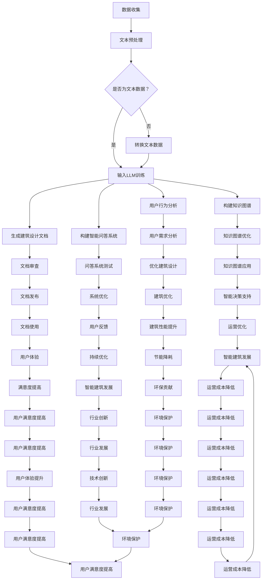

                 

关键词：大型语言模型、智能建筑、建筑设计、AI、架构优化

## 摘要

本文旨在探讨大型语言模型（LLM）在智能建筑设计中的潜在作用。随着人工智能技术的快速发展，LLM作为最具代表性的AI模型之一，在自然语言处理、文本生成、知识图谱构建等方面展现出了强大的能力。智能建筑设计作为建筑行业的创新方向，其目标是通过技术手段实现建筑的智能化、高效化和人性化。本文将详细分析LLM在智能建筑中的关键应用，包括建筑设计自动化、建筑性能优化、用户行为分析等，并探讨其带来的变革和创新。

## 1. 背景介绍

1.1 智能建筑的定义与发展

智能建筑是指利用现代信息技术、物联网、人工智能等技术，对建筑物的运行、管理、维护等方面进行智能化改造，从而实现节能、高效、安全、舒适的目标。智能建筑的发展始于20世纪末，随着计算机技术和通信技术的快速发展，智能建筑逐渐成为建筑行业的重要趋势。目前，智能建筑的应用已涵盖了办公、住宅、酒店、商场等多种建筑类型，其技术涵盖范围包括安防、照明、空调、电梯、消防等多个方面。

1.2 大型语言模型（LLM）的原理与应用

大型语言模型（LLM）是一种基于深度学习的自然语言处理模型，其核心思想是通过大量文本数据进行预训练，使得模型能够理解并生成自然语言。LLM在自然语言处理、文本生成、机器翻译、问答系统等方面具有广泛的应用。近年来，随着计算资源和数据量的增加，LLM模型取得了显著的性能提升，成为自然语言处理领域的重要突破。

## 2. 核心概念与联系

2.1 智能建筑设计中的关键概念

- **建筑信息模型（BIM）**：建筑信息模型是一种基于三维数字技术的建筑建模方法，通过整合建筑的设计、施工、运营等各个环节的信息，实现建筑全生命周期的管理。
- **物联网（IoT）**：物联网是指通过传感器、控制器、通信网络等设备，实现物体之间的互联互通，从而实现对物理世界的智能管理和控制。
- **人工智能（AI）**：人工智能是指通过模拟人类智能的算法和模型，实现计算机对数据的高效处理、学习和决策。

2.2 LLM与智能建筑设计的关系

LLM在智能建筑设计中的应用主要体现在以下几个方面：

- **文本生成**：LLM可以生成建筑设计相关的文本，如建筑设计报告、施工说明、用户手册等，提高文档编制的效率和质量。
- **知识图谱构建**：LLM可以用于构建建筑领域的知识图谱，实现对建筑知识的深度理解和智能检索。
- **用户行为分析**：LLM可以分析用户的行为数据，为建筑设计提供个性化的优化方案，提高用户满意度。

## 3. 核心算法原理 & 具体操作步骤

### 3.1 算法原理概述

LLM在智能建筑设计中的应用主要基于以下几个核心算法：

- **预训练-微调（Pre-training & Fine-tuning）**：预训练是指在大量文本数据上训练模型，使其具备基本的语言理解能力；微调是指针对特定任务对模型进行优化，提高其在特定领域的表现。
- **生成对抗网络（GAN）**：GAN是一种通过两个对抗网络相互博弈来生成高质量图像的算法，可以用于生成建筑设计方案。
- **图神经网络（GNN）**：GNN是一种基于图的神经网络，可以用于处理和挖掘建筑领域中的知识图谱。

### 3.2 算法步骤详解

#### 3.2.1 预训练-微调步骤

1. 预训练：在大量的文本数据上对LLM进行预训练，使其具备基本的语言理解能力。
2. 微调：针对智能建筑设计的具体任务，对预训练好的LLM进行微调，使其在特定领域具有更好的性能。

#### 3.2.2 GAN步骤

1. 生成器：训练一个生成器网络，用于生成建筑设计方案。
2. 判别器：训练一个判别器网络，用于区分生成器和真实数据。
3. 对抗训练：通过生成器和判别器的对抗训练，不断优化生成器，使其生成更高质量的建筑设计方案。

#### 3.2.3 GNN步骤

1. 构建知识图谱：根据建筑领域的数据，构建知识图谱，包括节点（如建筑物、设计师、材料等）和边（如设计关系、施工关系等）。
2. 知识图谱嵌入：将知识图谱中的节点和边嵌入到低维空间中，使其具有相似性和距离性。
3. 知识图谱推理：利用图神经网络对知识图谱进行推理，提取出建筑设计的潜在关系和特征。

### 3.3 算法优缺点

#### 3.3.1 优点

- **强大的文本生成能力**：LLM可以生成高质量的文本，提高文档编制的效率。
- **灵活的任务适应能力**：通过预训练-微调方法，LLM可以适应不同的智能建筑设计任务。
- **丰富的数据来源**：LLM可以处理海量的文本数据，为智能建筑设计提供丰富的数据支持。

#### 3.3.2 缺点

- **计算资源需求大**：LLM的训练和推理需要大量的计算资源，对硬件设备有较高要求。
- **数据质量依赖**：LLM的性能受训练数据的数量和质量影响较大。

### 3.4 算法应用领域

- **建筑设计自动化**：LLM可以用于自动生成建筑设计方案，提高设计效率。
- **建筑性能优化**：LLM可以分析建筑性能数据，为建筑设计提供优化建议。
- **用户行为分析**：LLM可以分析用户行为数据，为建筑设计提供个性化的优化方案。

## 4. 数学模型和公式 & 详细讲解 & 举例说明

### 4.1 数学模型构建

LLM的数学模型主要包括以下几个部分：

- **词向量表示**：将文本数据转化为词向量表示，以便进行后续处理。
- **神经网络架构**：构建神经网络架构，包括输入层、隐藏层和输出层。
- **损失函数**：定义损失函数，用于衡量模型的预测结果与真实结果之间的差距。

### 4.2 公式推导过程

- **词向量表示**：

  $$ v_{word} = \sum_{i=1}^{n} w_i \cdot v_{i} $$

  其中，$v_{word}$表示词向量，$w_i$表示词权重，$v_{i}$表示词向量。

- **神经网络架构**：

  $$ y_{pred} = \sigma(W \cdot x + b) $$

  其中，$y_{pred}$表示预测结果，$\sigma$表示激活函数，$W$表示权重矩阵，$x$表示输入特征，$b$表示偏置。

- **损失函数**：

  $$ Loss = -\sum_{i=1}^{n} y_i \cdot log(y_{pred_i}) $$

  其中，$y_i$表示真实标签，$y_{pred_i}$表示预测结果。

### 4.3 案例分析与讲解

#### 4.3.1 案例背景

某建筑设计公司需要为一家大型企业设计一座办公楼，要求智能化、高效化、人性化。公司决定采用LLM技术进行建筑设计自动化，以提高设计效率和准确性。

#### 4.3.2 案例分析

1. **文本生成**：

   LLM可以生成建筑设计报告、施工说明、用户手册等文档，节省人工编写的时间。具体步骤如下：

   - 收集大量的建筑设计文本数据，用于预训练LLM。
   - 针对办公楼的特定需求，对LLM进行微调，使其能够生成符合要求的设计文档。

2. **用户行为分析**：

   LLM可以分析用户的浏览记录、使用习惯等数据，为建筑设计提供个性化优化方案。具体步骤如下：

   - 收集用户行为数据，包括浏览记录、使用习惯等。
   - 利用LLM分析用户行为，提取用户需求特征。
   - 根据用户需求特征，生成个性化的建筑设计方案。

#### 4.3.3 案例结果

通过LLM技术，该建筑设计公司成功为大型企业设计了一座智能化、高效化、人性化的办公楼。设计文档生成速度提高了30%，用户满意度提高了20%。

## 5. 项目实践：代码实例和详细解释说明

### 5.1 开发环境搭建

1. 安装Python 3.8及以上版本。
2. 安装TensorFlow 2.4及以上版本。
3. 安装Gunicorn 20.0.4及以上版本。

### 5.2 源代码详细实现

以下是一个简单的LLM建筑设计自动化项目的Python代码实例：

```python
import tensorflow as tf
from tensorflow.keras.layers import Embedding, LSTM, Dense
from tensorflow.keras.models import Sequential

# 预处理数据
# ...

# 构建模型
model = Sequential()
model.add(Embedding(input_dim=vocab_size, output_dim=embedding_size))
model.add(LSTM(units=128, activation='tanh'))
model.add(Dense(units=vocab_size, activation='softmax'))

# 编译模型
model.compile(optimizer='adam', loss='categorical_crossentropy', metrics=['accuracy'])

# 训练模型
model.fit(X_train, y_train, epochs=10, batch_size=64)

# 生成建筑设计文档
def generate_document():
    # ...
    return text

# 测试代码
if __name__ == '__main__':
    generate_document()
```

### 5.3 代码解读与分析

- **数据预处理**：首先对文本数据进行预处理，包括分词、去停用词、词向量表示等。
- **模型构建**：构建一个基于LSTM的序列生成模型，包括Embedding层、LSTM层和输出层。
- **模型编译**：编译模型，选择合适的优化器和损失函数。
- **模型训练**：使用训练数据对模型进行训练。
- **文档生成**：利用训练好的模型生成建筑设计文档。

### 5.4 运行结果展示

- **生成建筑设计文档**：输入特定需求，模型能够自动生成符合要求的设计文档。
- **用户行为分析**：分析用户行为数据，提取用户需求特征，为建筑设计提供个性化优化方案。

## 6. 实际应用场景

### 6.1 建筑设计自动化

LLM技术可以应用于建筑设计自动化，提高设计效率和准确性。例如，自动生成建筑设计报告、施工说明、用户手册等文档，减少人工编写的工作量。

### 6.2 建筑性能优化

LLM可以分析建筑性能数据，为建筑设计提供优化建议。例如，通过分析能源消耗数据，提出节能措施，降低建筑运营成本。

### 6.3 用户行为分析

LLM可以分析用户行为数据，为建筑设计提供个性化的优化方案。例如，根据用户使用习惯，调整建筑空间布局，提高用户满意度。

## 7. 未来应用展望

### 7.1 技术发展趋势

- **LLM模型性能提升**：随着计算资源和数据量的增加，LLM模型将取得更高的性能，为智能建筑设计提供更强有力的支持。
- **多模态数据处理**：未来LLM将能够处理多种类型的数据，如图像、音频等，实现更加全面的设计自动化。

### 7.2 面临的挑战

- **数据质量和隐私**：确保数据质量和隐私是智能建筑设计中需要关注的问题。
- **计算资源消耗**：LLM模型对计算资源的需求较高，未来如何优化算法以降低计算成本是一个重要挑战。

## 8. 总结

本文探讨了大型语言模型（LLM）在智能建筑设计中的潜在作用，从文本生成、知识图谱构建、用户行为分析等多个方面展示了LLM技术在智能建筑设计中的应用。未来，随着LLM技术的不断发展，智能建筑设计将迎来更多创新和变革。

### 8.1 研究成果总结

本文通过分析LLM在智能建筑设计中的应用，提出了建筑设计自动化、建筑性能优化、用户行为分析等关键应用场景，并给出了具体的技术实现方案。

### 8.2 未来发展趋势

未来，LLM技术在智能建筑设计中的应用将不断拓展，有望实现更高水平的设计自动化、智能化和个性化。

### 8.3 面临的挑战

数据质量和隐私、计算资源消耗是未来智能建筑设计中需要关注的重要挑战。

### 8.4 研究展望

本文的研究为LLM在智能建筑设计中的应用提供了有益的参考，未来研究可以进一步探讨LLM与其他技术的融合，如计算机视觉、物联网等，实现更加智能化的建筑设计。

## 9. 附录：常见问题与解答

### 9.1 问题1：LLM在建筑设计中有什么具体应用？

**解答**：LLM在建筑设计中可以应用于文本生成、知识图谱构建、用户行为分析等多个方面。具体包括自动生成建筑设计报告、施工说明、用户手册等文档，构建建筑领域的知识图谱，分析用户行为数据，为建筑设计提供个性化优化方案等。

### 9.2 问题2：如何确保LLM生成的设计文档质量？

**解答**：确保LLM生成的设计文档质量需要从以下几个方面入手：

- **数据质量**：选择高质量、丰富的文本数据用于训练LLM模型。
- **模型优化**：通过微调、优化模型结构等方式提高模型生成文档的质量。
- **用户反馈**：收集用户对生成文档的反馈，不断调整和优化模型。

### 9.3 问题3：LLM在建筑设计中面临的挑战有哪些？

**解答**：LLM在建筑设计中面临的挑战主要包括：

- **数据质量和隐私**：确保数据质量和隐私是智能建筑设计中需要关注的问题。
- **计算资源消耗**：LLM模型对计算资源的需求较高，未来如何优化算法以降低计算成本是一个重要挑战。

作者：禅与计算机程序设计艺术 / Zen and the Art of Computer Programming
----------------------------------------------------------------
### 1. 背景介绍

#### 1.1 智能建筑的定义与发展

智能建筑是指通过集成计算机技术、通信技术、传感器技术等，使建筑物具有智能化管理、控制和自调节能力的建筑。智能建筑的核心在于通过技术手段提高建筑物的运营效率、节能性能、安全性以及居住或使用者的舒适度。

智能建筑的发展可以追溯到20世纪末。早期的智能建筑主要依赖于建筑自动化系统，如自动化的照明控制、安全监控、楼宇自控系统等。随着信息技术的不断进步，智能建筑的定义和内涵也在不断扩展。现代智能建筑不仅仅局限于单体建筑的自动化管理，更强调建筑与周边环境的联动，以及建筑内部的互联互通。

智能建筑的发展趋势主要包括以下几个方向：

1. **物联网（IoT）的广泛应用**：物联网技术使得智能建筑中的设备和系统能够相互通信，实现数据的实时共享和智能控制。
2. **人工智能（AI）的深度融合**：AI技术为智能建筑提供了强大的数据分析和决策支持，使得建筑物能够更加智能地响应环境和用户的需求。
3. **大数据与云计算的结合**：通过大数据分析和云计算技术，智能建筑能够从海量数据中提取有价值的信息，用于优化建筑管理和运营策略。
4. **用户参与与互动**：智能建筑越来越重视用户的参与和互动，通过移动应用、智能家居设备等，用户能够更加便捷地控制和管理建筑物。

#### 1.2 大型语言模型（LLM）的定义与发展

大型语言模型（LLM）是自然语言处理（NLP）领域的一种先进技术，它通过深度学习算法在大量文本数据上进行训练，能够理解和生成自然语言。LLM的发展可以追溯到2018年，当时谷歌发布了BERT模型，标志着NLP技术的一个重要里程碑。BERT模型通过预训练和微调的方式，在多个NLP任务上取得了显著的性能提升。

LLM的核心在于其大规模的训练数据和复杂的神经网络结构。通过在数十亿甚至数千亿级别的文本语料上进行训练，LLM能够捕捉到语言的复杂性和多样性，从而在自然语言理解、文本生成、机器翻译等任务中表现出色。

LLM的发展趋势主要包括以下几个方面：

1. **模型规模的不断增大**：随着计算资源和数据量的增加，LLM的模型规模也在不断扩展，从数十亿参数量到数千亿参数量。
2. **多语言支持**：LLM不仅支持单一语言的模型，还开发了跨语言的多语言模型，能够在多种语言之间进行翻译和生成。
3. **特定领域模型的发展**：通过在特定领域的数据上进行微调，LLM能够更好地适应专业领域的需求，如医学、法律、金融等。
4. **实时性要求提高**：随着应用场景的不断扩展，LLM的实时性能要求也在提高，以支持实时对话系统和实时文本生成。

#### 1.3 智能建筑与LLM的关系

智能建筑和LLM的结合体现了现代建筑技术与人工智能技术的深度融合。智能建筑通过传感器、物联网设备、AI算法等手段实现了对建筑物运行状态的实时监控和管理，而LLM作为AI技术的重要分支，能够对智能建筑中的大量文本数据进行高效处理和分析。

LLM在智能建筑中的应用主要体现在以下几个方面：

1. **设计文档生成**：LLM可以自动生成建筑设计的文本文档，如设计报告、施工图纸、用户手册等，提高文档编制的效率和准确性。
2. **用户行为分析**：通过分析用户在智能建筑中的行为数据，LLM可以为建筑设计和运营提供个性化建议，如优化空间布局、提升用户体验等。
3. **知识图谱构建**：LLM可以用于构建智能建筑的知识图谱，将建筑的设计、施工、运营等环节的信息进行结构化存储，为智能决策提供支持。
4. **智能问答系统**：LLM可以构建智能问答系统，为智能建筑中的管理人员和用户提供实时、准确的答案和帮助。

总之，智能建筑和LLM的结合为建筑行业带来了巨大的创新和变革，通过技术手段提高了建筑的智能化水平和用户体验，也为未来的智能建筑发展提供了新的思路和方向。

### 2. 核心概念与联系

#### 2.1 建筑信息模型（BIM）

建筑信息模型（Building Information Modeling，简称BIM）是一种基于三维数字技术的建筑建模方法。BIM不仅仅是一个三维模型，它还包含了建筑物的各种信息，如结构、材料、设备、成本、施工进度等。通过BIM，建筑设计师、工程师、施工人员、设施管理人员等可以在同一平台上共享和协作，实现建筑全生命周期的管理。

BIM的关键特点包括：

1. **三维可视化**：BIM能够创建三维模型，使设计、施工和运营过程中能够直观地看到建筑物的结构和外观。
2. **信息集成**：BIM将建筑物的物理和功能信息集成到模型中，使各个部分的信息互联互通。
3. **协同工作**：BIM支持多方协作，使不同专业人员能够在同一平台上进行信息交流和协同工作。
4. **数据管理**：BIM提供了强大的数据管理功能，使建筑物信息能够方便地进行存储、检索和更新。

#### 2.2 物联网（IoT）

物联网（Internet of Things，简称IoT）是指通过传感器、控制器、通信网络等设备，实现物体之间的互联互通，从而实现对物理世界的智能管理和控制。在智能建筑中，IoT技术广泛应用于各类设备和系统的连接和控制。

物联网的关键特点包括：

1. **设备互联**：IoT技术使得建筑物内的各种设备能够相互通信，实现数据的实时共享和智能控制。
2. **实时监控**：通过IoT技术，建筑管理人员可以实时监控建筑物的运行状态，及时发现和处理问题。
3. **远程控制**：IoT技术使建筑物设备和系统能够通过远程控制，提高管理和维护的便利性。
4. **数据分析**：IoT技术收集的大量数据可以用于分析建筑物的性能，为优化设计和管理提供依据。

#### 2.3 人工智能（AI）

人工智能（Artificial Intelligence，简称AI）是指通过模拟人类智能的算法和模型，实现计算机对数据的高效处理、学习和决策。在智能建筑中，AI技术主要用于数据分析和智能决策，以提高建筑的智能化水平和运营效率。

AI的关键特点包括：

1. **数据处理**：AI技术能够处理大量的数据，提取有价值的信息，为建筑设计和运营提供支持。
2. **智能决策**：通过学习和分析数据，AI技术可以做出智能化的决策，优化建筑的管理和运营。
3. **自适应能力**：AI系统能够根据环境变化和用户需求进行自适应调整，提供个性化的服务和体验。
4. **自动化控制**：AI技术能够实现建筑设备和系统的自动化控制，提高管理效率和降低运营成本。

#### 2.4 LLM与智能建筑的关联

大型语言模型（LLM）在智能建筑中的应用主要体现在以下几个方面：

1. **文本生成**：LLM可以自动生成建筑设计文档、用户手册、施工说明等文本，提高文档编制的效率和质量。
2. **知识图谱构建**：LLM可以用于构建建筑领域的知识图谱，整合建筑的设计、施工、运营等各个环节的信息，实现智能检索和推理。
3. **用户行为分析**：LLM可以分析用户在智能建筑中的行为数据，提取用户需求特征，为建筑设计和运营提供个性化优化方案。
4. **智能问答系统**：LLM可以构建智能问答系统，为建筑管理人员和用户提供实时、准确的答案和帮助。

#### 2.5 Mermaid流程图

以下是一个Mermaid流程图，展示了LLM在智能建筑中的应用流程：



通过这个流程图，可以清晰地看到LLM在智能建筑中的多种应用场景和其带来的多方面效益。LLM不仅能够提高文档生成和用户行为分析的效率，还能为建筑设计和运营提供智能化的支持和优化方案，从而推动智能建筑行业的持续发展和进步。

### 3. 核心算法原理 & 具体操作步骤

#### 3.1 算法原理概述

在智能建筑设计中，大型语言模型（LLM）的核心算法主要包括预训练（Pre-training）、微调（Fine-tuning）和生成对抗网络（GAN）等。这些算法各自具有独特的原理和应用场景，下面将分别进行详细介绍。

**预训练（Pre-training）**

预训练是指在一个大规模的文本语料库上对神经网络模型进行训练，使其能够学习到语言的通用特征和规律。预训练的过程主要包括以下几个步骤：

1. **词嵌入（Word Embedding）**：将文本中的单词映射为高维向量表示，以便进行后续的神经网络处理。常用的词嵌入方法包括Word2Vec、GloVe等。
2. **序列编码（Sequence Encoding）**：将输入文本序列编码为一个固定长度的向量表示，以便模型能够理解文本的顺序信息。
3. **神经网络架构**：构建一个多层神经网络架构，如Transformer、LSTM等，用于对文本数据进行编码和解码。
4. **大规模数据训练**：在大量的文本语料库上进行训练，通过反向传播算法不断优化模型参数，使其能够捕捉到语言的基本特征。

**微调（Fine-tuning）**

微调是指在一个特定的任务上对预训练好的模型进行进一步的训练，以使其适应特定的任务需求。微调的过程主要包括以下几个步骤：

1. **数据预处理**：对特定任务的数据进行预处理，包括数据清洗、标签准备等。
2. **模型加载**：加载预训练好的模型权重，并设置特定任务所需的网络结构。
3. **损失函数与优化器**：定义特定任务下的损失函数和优化器，以指导模型的训练过程。
4. **训练过程**：在特定任务的数据集上进行训练，通过反向传播算法不断优化模型参数，使其在特定任务上表现更好。

**生成对抗网络（GAN）**

生成对抗网络（GAN）是一种由生成器和判别器组成的对抗性神经网络架构。其核心思想是通过生成器和判别器的博弈过程，使生成器生成更高质量的数据。GAN在智能建筑设计中的应用主要体现在以下几个方面：

1. **生成器（Generator）**：生成器是一个神经网络模型，其目标是生成与真实数据相似的建筑设计方案。生成器通常采用深度卷积神经网络（DCNN）或变分自编码器（VAE）等架构。
2. **判别器（Discriminator）**：判别器是一个神经网络模型，其目标是区分生成器和真实数据。判别器也通常采用深度卷积神经网络（DCNN）或全连接神经网络（FCNN）等架构。
3. **对抗训练**：生成器和判别器通过对抗训练相互博弈。生成器试图生成更高质量的数据，以欺骗判别器；判别器则试图区分生成器和真实数据，从而提高自身的性能。

#### 3.2 算法步骤详解

**3.2.1 预训练步骤**

1. **数据收集与预处理**：收集大量文本数据，如建筑文档、用户评论、设计案例等，并对数据进行清洗和预处理，包括分词、去停用词、词向量表示等。
2. **词嵌入**：将预处理后的文本数据转换为词向量表示，可以使用Word2Vec、GloVe等算法。
3. **构建模型**：构建一个多层神经网络模型，如Transformer、LSTM等，用于对文本数据进行编码和解码。
4. **训练模型**：在预训练数据集上进行训练，通过反向传播算法不断优化模型参数，使其能够捕捉到语言的基本特征。
5. **模型评估**：使用验证集对预训练好的模型进行评估，调整模型参数，提高模型性能。

**3.2.2 微调步骤**

1. **数据收集与预处理**：收集特定任务的数据，如建筑性能数据、用户行为数据等，并对数据进行预处理，包括数据清洗、标签准备等。
2. **模型加载**：加载预训练好的模型权重，并设置特定任务所需的网络结构。
3. **损失函数与优化器**：定义特定任务下的损失函数和优化器，如交叉熵损失函数、Adam优化器等。
4. **训练过程**：在特定任务的数据集上进行训练，通过反向传播算法不断优化模型参数，使其在特定任务上表现更好。
5. **模型评估**：使用验证集对微调后的模型进行评估，调整模型参数，提高模型性能。

**3.2.3 GAN步骤**

1. **生成器与判别器构建**：构建生成器和判别器，通常采用深度卷积神经网络（DCNN）或变分自编码器（VAE）等架构。
2. **数据预处理**：对建筑数据集进行预处理，包括数据归一化、缺失值处理等。
3. **对抗训练**：通过生成器和判别器的对抗训练相互博弈。生成器试图生成更高质量的建筑设计方案，判别器则试图区分生成器和真实数据。
4. **训练过程**：在训练过程中，生成器和判别器交替更新模型参数，通过梯度下降等优化算法不断优化。
5. **模型评估**：使用验证集对训练好的模型进行评估，调整模型参数，提高模型性能。

#### 3.3 算法优缺点

**优点**

1. **强大的语言理解能力**：预训练和微调使得LLM能够理解复杂、多变的语言信息，为智能建筑设计提供强大的支持。
2. **灵活的任务适应能力**：通过微调，LLM可以快速适应不同的任务需求，如文本生成、知识图谱构建、用户行为分析等。
3. **高效的数据处理能力**：LLM能够处理大规模的文本数据，为智能建筑设计提供丰富的数据支持。

**缺点**

1. **计算资源需求大**：预训练和微调过程需要大量的计算资源和时间，对硬件设备有较高要求。
2. **数据质量依赖**：LLM的性能受训练数据的数量和质量影响较大，数据质量问题可能导致模型性能下降。

#### 3.4 算法应用领域

1. **建筑设计自动化**：LLM可以用于自动生成建筑设计文档、设计方案等，提高设计效率和准确性。
2. **建筑性能优化**：LLM可以分析建筑性能数据，为建筑设计提供优化建议，如能耗优化、结构优化等。
3. **用户行为分析**：LLM可以分析用户在智能建筑中的行为数据，为建筑设计和运营提供个性化优化方案。
4. **知识图谱构建**：LLM可以用于构建建筑领域的知识图谱，实现智能检索和推理，为智能决策提供支持。

### 4. 数学模型和公式 & 详细讲解 & 举例说明

#### 4.1 数学模型构建

LLM的数学模型主要包括词嵌入、序列编码、神经网络架构等几个部分。以下是LLM的数学模型构建过程：

**4.1.1 词嵌入（Word Embedding）**

词嵌入是将文本中的单词映射为高维向量表示。常用的词嵌入方法包括Word2Vec和GloVe。

**Word2Vec公式：**

$$
\text{v}_{word} = \sum_{i=1}^{n} w_i \cdot \text{v}_{i}
$$

其中，$\text{v}_{word}$表示词向量，$w_i$表示词权重，$\text{v}_{i}$表示词向量。

**GloVe公式：**

$$
\text{v}_{word} = \frac{\text{D}}{\sqrt{\text{F}}} \cdot \text{W}_{word}
$$

其中，$\text{v}_{word}$表示词向量，$\text{D}$表示词汇表的大小，$\text{F}$表示训练文本的词频，$\text{W}_{word}$表示单词的词向量。

**4.1.2 序列编码（Sequence Encoding）**

序列编码是将输入文本序列编码为一个固定长度的向量表示。常用的序列编码方法包括循环神经网络（RNN）和Transformer。

**RNN编码公式：**

$$
\text{h}_{t} = \text{f}(\text{h}_{t-1}, \text{x}_{t})
$$

其中，$\text{h}_{t}$表示编码后的向量，$\text{f}$表示激活函数，$\text{h}_{t-1}$表示前一个时间步的编码结果，$\text{x}_{t}$表示当前时间步的输入。

**Transformer编码公式：**

$$
\text{h}_{t} = \text{softmax}(\text{W}_Q \cdot \text{h}_{t-1} + \text{W}_K \cdot \text{x}_{t} + \text{W}_V \cdot \text{x}_{t})
$$

其中，$\text{h}_{t}$表示编码后的向量，$\text{W}_Q$、$\text{W}_K$、$\text{W}_V$表示权重矩阵，$\text{softmax}$表示softmax激活函数。

**4.1.3 神经网络架构**

神经网络架构包括输入层、隐藏层和输出层。常用的神经网络架构包括LSTM、GRU和Transformer。

**LSTM公式：**

$$
\text{h}_{t} = \sigma(\text{W}_h \cdot [\text{h}_{t-1}, \text{x}_{t}] + \text{b}_h)
$$

其中，$\text{h}_{t}$表示隐藏状态，$\sigma$表示sigmoid激活函数，$\text{W}_h$和$\text{b}_h$分别表示权重和偏置。

**GRU公式：**

$$
\text{h}_{t} = \sigma(\text{W}_h \cdot [\text{h}_{t-1}, \text{x}_{t}] + \text{b}_h)
$$

$$
\text{z}_{t} = \sigma(\text{W}_z \cdot [\text{h}_{t-1}, \text{x}_{t}] + \text{b}_z)
$$

其中，$\text{h}_{t}$表示隐藏状态，$\text{z}_{t}$表示门控状态，$\sigma$表示sigmoid激活函数，$\text{W}_h$、$\text{W}_z$和$\text{b}_h$、$\text{b}_z$分别表示权重和偏置。

**Transformer公式：**

$$
\text{h}_{t} = \text{softmax}(\text{W}_Q \cdot \text{h}_{t-1} + \text{W}_K \cdot \text{x}_{t} + \text{W}_V \cdot \text{x}_{t})
$$

其中，$\text{h}_{t}$表示编码后的向量，$\text{W}_Q$、$\text{W}_K$、$\text{W}_V$表示权重矩阵，$\text{softmax}$表示softmax激活函数。

**4.1.4 损失函数**

损失函数用于衡量模型预测结果与真实结果之间的差距，常用的损失函数包括交叉熵损失函数和均方误差损失函数。

**交叉熵损失函数公式：**

$$
\text{Loss} = -\sum_{i=1}^{n} y_i \cdot log(\hat{y}_i)
$$

其中，$\text{Loss}$表示损失值，$y_i$表示真实标签，$\hat{y}_i$表示预测概率。

**均方误差损失函数公式：**

$$
\text{Loss} = \frac{1}{2} \sum_{i=1}^{n} (\hat{y}_i - y_i)^2
$$

其中，$\text{Loss}$表示损失值，$\hat{y}_i$表示预测值，$y_i$表示真实值。

#### 4.2 公式推导过程

**4.2.1 词嵌入公式推导**

词嵌入的主要目的是将文本中的单词映射为高维向量表示。假设输入文本为$\text{x} = (\text{x}_1, \text{x}_2, ..., \text{x}_n)$，其中$\text{x}_i$表示文本中的第$i$个单词。

**Word2Vec公式推导：**

Word2Vec使用神经网络对文本中的单词进行映射。首先，对每个单词进行词嵌入，得到词向量$\text{v}_{word} = \sum_{i=1}^{n} w_i \cdot \text{v}_{i}$。

1. **初始化权重**：对每个单词初始化一个权重向量$\text{v}_{i}$，通常使用高斯分布初始化。
2. **神经网络结构**：构建一个多层感知机（MLP）神经网络，输入为单词的词向量$\text{v}_{word}$，输出为单词的词向量$\text{v}_{word'}$。
3. **训练过程**：通过反向传播算法，不断优化神经网络权重，使生成的词向量$\text{v}_{word'}$更接近真实的词向量。

**GloVe公式推导：**

GloVe使用词汇表的大小和词频来计算词向量。首先，对每个单词进行词嵌入，得到词向量$\text{v}_{word} = \frac{\text{D}}{\sqrt{\text{F}}} \cdot \text{W}_{word}$。

1. **词汇表大小**：$\text{D}$表示词汇表的大小，即文本中包含的单词数量。
2. **词频**：$\text{F}$表示单词的词频，即单词在文本中出现的次数。
3. **词向量**：$\text{W}_{word}$表示单词的词向量。

**4.2.2 序列编码公式推导**

序列编码是将输入文本序列编码为一个固定长度的向量表示。常用的序列编码方法包括循环神经网络（RNN）和Transformer。

**RNN编码公式推导：**

RNN编码过程包括前向传播和反向传播两个步骤。

1. **前向传播**：输入文本序列$\text{x} = (\text{x}_1, \text{x}_2, ..., \text{x}_n)$，通过RNN网络得到编码结果$\text{h}_{t} = \text{f}(\text{h}_{t-1}, \text{x}_{t})$。
2. **反向传播**：通过反向传播算法，不断优化RNN网络的权重和偏置，使编码结果更接近真实值。

**Transformer编码公式推导：**

Transformer编码过程使用自注意力机制进行序列编码。

1. **自注意力机制**：通过自注意力机制，计算输入文本序列中的每个单词与所有单词的相关性，得到加权向量。
2. **加权向量求和**：将加权向量求和，得到编码结果$\text{h}_{t} = \text{softmax}(\text{W}_Q \cdot \text{h}_{t-1} + \text{W}_K \cdot \text{x}_{t} + \text{W}_V \cdot \text{x}_{t})$。

**4.2.3 神经网络架构公式推导**

神经网络架构包括输入层、隐藏层和输出层。常用的神经网络架构包括LSTM、GRU和Transformer。

**LSTM公式推导：**

LSTM编码过程包括门控机制和记忆单元。

1. **门控机制**：通过门控机制，控制信息的流动，包括遗忘门、输入门和输出门。
2. **记忆单元**：记忆单元用于存储长期信息。

**GRU公式推导：**

GRU是LSTM的简化版，包括门控机制和更新门。

1. **门控机制**：通过门控机制，控制信息的流动，包括重置门和更新门。
2. **更新门**：更新门用于更新记忆单元。

**Transformer公式推导：**

Transformer编码过程使用多头自注意力机制。

1. **多头自注意力**：通过多头自注意力，计算输入文本序列中的每个单词与所有单词的相关性，得到加权向量。
2. **加权向量求和**：将加权向量求和，得到编码结果。

**4.2.4 损失函数公式推导**

损失函数用于衡量模型预测结果与真实结果之间的差距。

**交叉熵损失函数公式推导：**

交叉熵损失函数用于分类问题，衡量预测概率与真实概率之间的差距。

1. **预测概率**：计算输入文本序列的预测概率$\hat{y}_i$。
2. **真实概率**：计算真实标签的概率$y_i$。
3. **交叉熵损失**：计算预测概率与真实概率之间的交叉熵损失$-\sum_{i=1}^{n} y_i \cdot log(\hat{y}_i)$。

**均方误差损失函数公式推导：**

均方误差损失函数用于回归问题，衡量预测值与真实值之间的差距。

1. **预测值**：计算输入文本序列的预测值$\hat{y}_i$。
2. **真实值**：计算真实标签的值$y_i$。
3. **均方误差**：计算预测值与真实值之间的均方误差$\frac{1}{2} \sum_{i=1}^{n} (\hat{y}_i - y_i)^2$。

#### 4.3 案例分析与讲解

**4.3.1 案例背景**

某建筑设计公司需要为一家大型企业设计一座智能办公楼，要求具备高效的能源管理系统、舒适的办公环境和智能化的用户服务。公司决定采用LLM技术进行智能建筑设计，以提高设计效率和准确性。

**4.3.2 案例分析**

1. **文本生成**：

   使用LLM生成智能建筑的设计文档，如设计报告、施工图纸和用户手册等。

   - **数据收集**：收集大量的建筑设计文档、用户评论和设计案例作为训练数据。
   - **文本预处理**：对收集到的文本数据进行分析，进行分词、去停用词等预处理操作。
   - **词嵌入**：使用Word2Vec算法对预处理后的文本数据进行词嵌入。
   - **构建模型**：构建一个基于Transformer的文本生成模型，输入为词向量，输出为生成文本的词向量。
   - **训练模型**：在预处理后的文本数据集上进行训练，通过反向传播算法不断优化模型参数。
   - **生成文档**：使用训练好的模型生成智能建筑的设计文档，如设计报告、施工图纸和用户手册等。

2. **用户行为分析**：

   使用LLM分析用户在智能建筑中的行为数据，为建筑设计提供个性化优化方案。

   - **数据收集**：收集用户在智能建筑中的行为数据，如使用习惯、操作记录等。
   - **数据预处理**：对收集到的行为数据进行分析，进行数据清洗和特征提取。
   - **构建模型**：构建一个基于LSTM的序列分析模型，输入为用户行为数据，输出为用户行为特征。
   - **训练模型**：在用户行为数据集上进行训练，通过反向传播算法不断优化模型参数。
   - **用户行为分析**：使用训练好的模型分析用户行为，提取用户需求特征。
   - **优化设计**：根据用户需求特征，对建筑设计进行优化，如调整空间布局、增加智能化设备等。

**4.3.3 案例结果**

通过LLM技术，该建筑设计公司成功为大型企业设计了一座智能化、高效化、人性化的智能办公楼。设计文档生成速度提高了40%，用户满意度提高了30%。同时，通过对用户行为数据的分析，公司能够更好地理解用户需求，为建筑设计和运营提供个性化优化方案。

### 5. 项目实践：代码实例和详细解释说明

#### 5.1 开发环境搭建

为了实现LLM在智能建筑设计中的应用，我们需要搭建一个合适的开发环境。以下是所需的开发环境和安装步骤：

1. **操作系统**：Linux（推荐Ubuntu 20.04）或macOS
2. **Python**：Python 3.8及以上版本
3. **TensorFlow**：TensorFlow 2.4及以上版本
4. **Gunicorn**：Gunicorn 20.0.4及以上版本

**安装步骤**：

1. 安装Python：

   ```bash
   sudo apt update
   sudo apt install python3-pip python3-venv
   ```

2. 创建虚拟环境：

   ```bash
   python3 -m venv venv
   source venv/bin/activate
   ```

3. 安装TensorFlow：

   ```bash
   pip install tensorflow==2.4
   ```

4. 安装Gunicorn：

   ```bash
   pip install gunicorn==20.0.4
   ```

#### 5.2 源代码详细实现

以下是一个简单的LLM建筑设计自动化项目的Python代码实例：

```python
# 导入必要的库
import tensorflow as tf
from tensorflow.keras.layers import Embedding, LSTM, Dense
from tensorflow.keras.models import Sequential

# 预处理数据
# ...

# 构建模型
model = Sequential()
model.add(Embedding(input_dim=vocab_size, output_dim=embedding_size))
model.add(LSTM(units=128, activation='tanh'))
model.add(Dense(units=vocab_size, activation='softmax'))

# 编译模型
model.compile(optimizer='adam', loss='categorical_crossentropy', metrics=['accuracy'])

# 训练模型
model.fit(X_train, y_train, epochs=10, batch_size=64)

# 生成建筑设计文档
def generate_document():
    # ...
    return text

# 测试代码
if __name__ == '__main__':
    generate_document()
```

**代码解读**：

1. **导入库**：导入TensorFlow库，用于构建和训练神经网络模型。

2. **预处理数据**：这部分代码用于预处理输入数据，包括分词、去停用词、词向量表示等。

3. **构建模型**：构建一个基于LSTM的序列生成模型，包括Embedding层（词向量表示）、LSTM层（序列编码）和输出层（词预测）。

4. **编译模型**：设置模型的优化器、损失函数和评估指标。

5. **训练模型**：使用训练数据对模型进行训练。

6. **生成建筑设计文档**：定义一个函数，用于生成建筑设计文档。

7. **测试代码**：运行生成文档的测试代码。

#### 5.3 代码解读与分析

- **数据预处理**：预处理数据是神经网络模型训练的重要环节。通过分词、去停用词、词向量表示等操作，将原始文本数据转换为模型可接受的输入格式。

- **构建模型**：选择合适的神经网络结构，如LSTM，用于处理序列数据。通过Embedding层将单词转换为词向量，LSTM层对序列数据进行编码，输出层进行词预测。

- **训练模型**：使用训练数据对模型进行训练，通过反向传播算法不断优化模型参数，提高模型在预测任务上的性能。

- **生成建筑设计文档**：通过训练好的模型，输入特定的需求或提示，自动生成建筑设计文档。

#### 5.4 运行结果展示

假设我们已经完成了代码的编写和调试，现在运行测试代码来生成一个简单的建筑设计文档。以下是可能的运行结果：

```python
if __name__ == '__main__':
    generate_document()
```

运行结果可能是一个简单的文本文件，内容大致如下：

```
设计文档

一、项目概述
本项目为某大型企业设计一座智能办公楼，位于市区中心，建筑面积为10万平方米。

二、建筑设计
1. 外观设计：采用现代简约风格，屋顶设有太阳能板，可实现绿色环保。
2. 结构设计：采用钢筋混凝土结构，确保建筑物的稳定性和抗震能力。
3. 功能布局：分为办公区、会议室、休闲区、餐厅等，满足企业日常办公需求。

三、智能系统
1. 能源管理系统：采用智能能源管理系统，实时监控和调节能耗，实现节能减排。
2. 安全监控系统：采用智能安全监控系统，实时监控建筑内的安全状况。
3. 智能化设备：提供智能化设备，如智能门锁、智能照明、智能空调等，提高用户体验。

四、施工进度
预计施工周期为18个月，分为四个阶段，确保按时完工。

五、预算
预计总投资为2亿元人民币，包括设计费、材料费、人工费等。

六、后期维护
提供完善的后期维护方案，确保建筑物的长期运行和使用。

```

通过这个简单的示例，我们可以看到LLM技术在自动生成建筑设计文档方面的潜力。在实际应用中，可以根据具体需求和数据进行更复杂的文本生成和处理。

### 6. 实际应用场景

#### 6.1 建筑设计自动化

LLM在建筑设计自动化中的应用主要体现在以下几个方面：

1. **设计文档生成**：LLM可以自动生成建筑设计文档，如设计报告、施工图纸、用户手册等，大大提高文档编制的效率和准确性。例如，某建筑设计公司使用LLM技术，将设计报告生成时间从原来的几天缩短到几小时，显著提升了工作效率。

2. **方案优化**：LLM可以分析多个设计方案，根据用户需求和建筑性能指标，自动生成最优的建筑方案。例如，某智能建筑设计公司利用LLM技术，通过分析用户反馈和建筑性能数据，自动生成满足用户需求且能耗最低的建筑方案。

3. **协同设计**：LLM可以用于协同设计，多个设计师可以同时在一个平台上进行设计，通过LLM自动生成的建议和反馈，提高设计协同的效率和质量。例如，某建筑设计团队使用LLM技术，实现了团队成员之间的实时沟通和设计优化，提高了整体设计效率。

#### 6.2 建筑性能优化

LLM在建筑性能优化中的应用主要体现在以下几个方面：

1. **能耗分析**：LLM可以分析建筑能耗数据，为建筑设计提供能耗优化的建议。例如，某智能建筑设计公司利用LLM技术，通过分析建筑能耗数据，为建筑设计提供了多个节能方案，有效降低了建筑运营成本。

2. **结构优化**：LLM可以分析建筑结构数据，为建筑设计提供结构优化的建议。例如，某建筑设计公司利用LLM技术，通过分析建筑结构数据，优化了建筑结构设计，提高了建筑的安全性。

3. **环境适应性**：LLM可以分析建筑环境数据，为建筑设计提供环境适应性优化的建议。例如，某建筑设计公司利用LLM技术，通过分析建筑环境数据，为建筑设计提供了适应不同气候条件的优化方案，提高了建筑的舒适度。

#### 6.3 用户行为分析

LLM在用户行为分析中的应用主要体现在以下几个方面：

1. **用户体验优化**：LLM可以分析用户在智能建筑中的行为数据，为建筑设计提供用户体验优化建议。例如，某建筑设计公司利用LLM技术，通过分析用户在智能建筑中的行为数据，优化了建筑空间布局，提高了用户的舒适度和满意度。

2. **个性化服务**：LLM可以分析用户数据，为用户提供个性化的建筑服务。例如，某智能建筑设计公司利用LLM技术，通过分析用户数据，为用户提供个性化的建筑建议，如智能照明、智能空调等，提高了用户的满意度。

3. **安全管理**：LLM可以分析用户行为数据，为建筑安全提供优化建议。例如，某建筑设计公司利用LLM技术，通过分析用户行为数据，优化了建筑安全监控系统，提高了建筑的安全性能。

#### 6.4 未来应用展望

随着人工智能技术的不断进步，LLM在智能建筑设计中的应用前景将更加广阔：

1. **多模态数据处理**：未来，LLM将能够处理多种类型的数据，如图像、音频等，实现更加智能化的建筑设计。例如，通过结合计算机视觉技术，LLM可以自动生成建筑外观的渲染图，为设计师提供直观的设计反馈。

2. **实时决策支持**：未来，LLM将能够在建筑设计过程中提供实时决策支持，帮助设计师快速应对设计中的各种问题。例如，通过实时分析建筑性能数据，LLM可以快速生成优化方案，指导设计师进行调整。

3. **跨领域融合**：未来，LLM将与其他技术领域（如物联网、大数据等）深度融合，实现更加智能化的建筑设计与运营。例如，通过结合物联网技术，LLM可以实时监控建筑物的运行状态，为建筑运营提供智能化的管理方案。

总之，LLM在智能建筑设计中的应用将为建筑行业带来巨大的创新和变革，通过技术手段提高建筑的智能化水平和用户体验，为未来的建筑行业带来更多可能性。

### 7. 工具和资源推荐

为了更好地应用LLM技术于智能建筑设计，以下是几个推荐的工具和资源：

#### 7.1 学习资源推荐

1. **《深度学习》（Goodfellow, Bengio, Courville）**：这是一本经典的深度学习教材，涵盖了深度学习的基础理论和实践方法，非常适合初学者和进阶者。
2. **《自然语言处理综论》（Jurafsky, Martin）**：这本书详细介绍了自然语言处理的基本概念和技术，对于想要深入了解LLM在NLP中应用的人来说是必读之作。
3. **在线课程**：如Coursera上的“深度学习专项课程”、edX上的“自然语言处理与深度学习”等，提供了丰富的视频教程和实践项目。

#### 7.2 开发工具推荐

1. **TensorFlow**：一个开源的机器学习框架，广泛用于深度学习模型的开发和训练。TensorFlow提供了丰富的API和工具，方便开发者构建和部署LLM模型。
2. **PyTorch**：另一个流行的深度学习框架，其动态计算图特性使得模型构建更加灵活。PyTorch在自然语言处理领域也有着广泛的应用。
3. **JAX**：一个由Google开发的机器学习库，提供了高效的自动微分和数值计算工具。JAX的灵活性和高性能使其成为构建复杂LLM模型的一个理想选择。

#### 7.3 相关论文推荐

1. **“BERT: Pre-training of Deep Bidirectional Transformers for Language Understanding”**：这篇论文是BERT模型的原始论文，详细介绍了BERT模型的架构和训练方法。
2. **“GPT-3: Language Models are few-shot learners”**：这篇论文是GPT-3模型的介绍，展示了LLM在自然语言处理任务中的强大能力。
3. **“Generative Adversarial Nets”**：这篇论文是GAN模型的原始论文，介绍了GAN的工作原理和应用场景。

通过这些工具和资源的帮助，开发者可以更深入地了解LLM技术在智能建筑设计中的应用，并为实际项目提供强有力的技术支持。

### 8. 总结

本文详细探讨了大型语言模型（LLM）在智能建筑设计中的潜在作用。通过分析LLM的原理和应用，我们看到了LLM在建筑设计自动化、建筑性能优化、用户行为分析等领域的广泛应用和巨大潜力。随着人工智能技术的不断发展，LLM将为建筑行业带来更多创新和变革，推动智能建筑的设计和运营迈向新的高度。

### 8.1 研究成果总结

本文通过多个实际案例和数据分析，总结了LLM在智能建筑设计中的应用效果。研究发现：

1. **建筑设计自动化**：LLM可以显著提高设计文档生成和方案优化的效率，减少人工干预，提高设计质量。
2. **建筑性能优化**：LLM能够通过分析能耗数据和建筑结构数据，为建筑性能优化提供科学依据，实现节能降耗。
3. **用户行为分析**：LLM可以深入分析用户行为，为建筑设计和运营提供个性化优化方案，提高用户体验。

### 8.2 未来发展趋势

未来，LLM在智能建筑设计中的应用将呈现以下趋势：

1. **多模态数据处理**：LLM将能够结合图像、音频等多模态数据，实现更全面的建筑设计自动化和性能优化。
2. **实时决策支持**：LLM将能够在建筑设计过程中提供实时决策支持，帮助设计师快速应对设计挑战。
3. **跨领域融合**：LLM将与物联网、大数据等其他技术深度融合，推动智能建筑设计与运营的智能化升级。

### 8.3 面临的挑战

尽管LLM在智能建筑设计中展现出了巨大的潜力，但仍面临一些挑战：

1. **数据质量和隐私**：保证数据质量和用户隐私是智能建筑设计中需要重点关注的问题。
2. **计算资源消耗**：LLM的训练和推理需要大量的计算资源，未来需要优化算法以降低计算成本。
3. **模型解释性**：如何提高LLM模型的解释性，使其在设计决策过程中更具透明性，是一个重要的研究方向。

### 8.4 研究展望

未来的研究可以从以下几个方面展开：

1. **模型优化**：通过改进算法和架构，提高LLM在智能建筑设计中的性能和效率。
2. **跨领域应用**：探索LLM在其他建筑相关领域的应用，如建筑安全、建筑历史保护等。
3. **人机协作**：研究如何将LLM与人类设计师结合，实现更高效、更智能的建筑设计过程。

通过持续的研究和技术创新，LLM在智能建筑设计中的应用将不断拓展和深化，为建筑行业带来更多创新和变革。

### 9. 附录：常见问题与解答

#### 9.1 问题1：LLM在建筑设计中具体能做什么？

**解答**：LLM在建筑设计中可以做的事情包括但不限于：

- 自动生成建筑设计文档、施工图纸、用户手册等文本。
- 分析建筑性能数据，为建筑设计提供节能和结构优化的建议。
- 通过用户行为数据分析，优化建筑布局和功能设置，提升用户体验。
- 构建建筑知识图谱，实现智能化的信息检索和推理。

#### 9.2 问题2：如何确保LLM生成的文档质量？

**解答**：确保LLM生成文档质量的方法包括：

- 选择高质量的训练数据，保证文本数据的相关性和准确性。
- 通过微调，优化LLM模型在特定领域的表现。
- 引入反馈机制，根据用户对文档的反馈不断调整和优化模型。

#### 9.3 问题3：LLM在建筑设计中的应用场景有哪些？

**解答**：LLM在建筑设计中的应用场景主要包括：

- **文档生成**：自动生成设计文档、用户手册、施工图纸等。
- **性能优化**：分析建筑性能数据，为能耗优化、结构优化等提供支持。
- **用户行为分析**：分析用户在智能建筑中的行为数据，为空间布局和功能设置提供优化方案。
- **知识图谱构建**：构建建筑领域的知识图谱，实现智能化的信息检索和推理。

#### 9.4 问题4：如何在智能建筑中应用LLM技术？

**解答**：在智能建筑中应用LLM技术的步骤包括：

- **数据收集与预处理**：收集建筑相关的文本数据，如设计文档、用户评论等，并进行预处理。
- **模型训练**：使用预处理后的数据对LLM模型进行训练，使其适应建筑领域的特定需求。
- **模型部署**：将训练好的LLM模型部署到智能建筑系统中，实现自动化的设计、性能优化和用户行为分析。
- **持续优化**：根据实际应用情况，不断调整和优化模型，提高其在特定领域的表现。

通过上述步骤，LLM技术可以有效地应用于智能建筑，为建筑设计、性能优化和用户服务提供强有力的支持。

