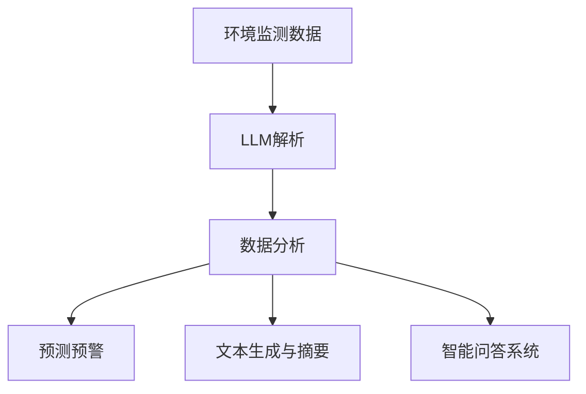

                 

关键词：LLM、智能环境保护系统、环境保护、自然语言处理、AI应用、环境监测、数据分析、可持续发展

> 摘要：本文旨在探讨大规模语言模型（LLM）在智能环境保护系统中的应用前景。随着人工智能技术的快速发展，LLM在自然语言处理领域展现出强大的能力，本文将分析LLM在环境监测、数据分析、预测预警、政策制定等环节的应用潜力，并展望其未来在推动环境保护和可持续发展方面的重要作用。

## 1. 背景介绍

环境保护作为全球关注的焦点，已经成为了国家战略和社会共识。智能环境保护系统作为新时代环保技术的代表，其核心在于利用先进的人工智能技术，实现对环境信息的实时监测、动态分析和精准治理。近年来，随着计算能力的提升和大数据技术的普及，人工智能在环境保护领域得到了广泛应用，尤其在环境监测、数据分析、预测预警等方面取得了显著成果。

大规模语言模型（Large Language Model，简称LLM）是近年来人工智能领域的重要突破，以GPT（Generative Pre-trained Transformer）系列为代表，其具备强大的文本生成、理解和处理能力。LLM在自然语言处理、对话系统、机器翻译、文本摘要等多个领域展现出了卓越的性能，逐渐成为人工智能研究与应用的热点。

本文将聚焦LLM在智能环境保护系统中的应用，探讨其在环境监测、数据分析、预测预警、政策制定等环节的应用潜力，并分析其面临的挑战和未来发展方向。

## 2. 核心概念与联系

### 2.1. 大规模语言模型（LLM）

大规模语言模型（LLM）是一种基于深度学习的自然语言处理模型，通过在大规模语料库上进行预训练，使其能够理解和生成自然语言。LLM的核心在于其预训练阶段，通过无监督学习，模型能够学习到语言的统计特征和语义信息。常见的LLM包括GPT、BERT、T5等，其中GPT-3更是突破了1750亿参数的规模，成为当前最先进的语言模型。

### 2.2. 智能环境保护系统

智能环境保护系统是一个集成了环境监测、数据分析、预测预警、政策制定等多种功能的综合系统。其核心在于利用人工智能技术，对环境信息进行高效处理和分析，为环境保护决策提供科学依据。智能环境保护系统的主要功能包括：

- **环境监测**：实时监测空气、水质、土壤等环境指标，提供全面的环境数据。
- **数据分析**：对监测数据进行分析，识别环境变化趋势，发现潜在的环境问题。
- **预测预警**：基于历史数据和算法模型，预测未来的环境变化，实现提前预警。
- **政策制定**：为政府和企业提供科学的决策支持，推动环境保护政策的实施。

### 2.3. LLM与智能环境保护系统的联系

LLM在智能环境保护系统中扮演着关键角色，其强大的自然语言处理能力，使得环境监测数据能够得到有效分析和解读。具体来说，LLM的应用包括：

- **环境数据解析**：通过LLM处理监测数据，提取关键信息，实现对环境状况的快速了解。
- **数据分析与预测**：利用LLM对环境数据进行深度分析，发现规律，进行预测预警。
- **文本生成与摘要**：生成环境报告、政策建议等文本内容，简化数据解读过程。
- **智能问答系统**：构建面向环境保护领域的智能问答系统，为用户提供实时咨询服务。

### 2.4. Mermaid 流程图

下面是一个简化的Mermaid流程图，展示了LLM在智能环境保护系统中的核心应用流程：



### 3. 核心算法原理 & 具体操作步骤

#### 3.1. 算法原理概述

LLM的核心原理是基于深度学习的神经网络架构，通过大规模预训练和精细调整，使其能够理解和生成自然语言。具体来说，LLM采用了Transformer模型架构，其基本思想是将输入的文本序列转换为一个连续的向量表示，通过多层注意力机制，实现对文本的深层理解和生成。

#### 3.2. 算法步骤详解

1. **环境监测数据输入**：将环境监测设备采集到的数据输入到LLM系统中，这些数据可以是空气中的PM2.5、CO2浓度，水中的重金属含量等。

2. **数据预处理**：对输入的数据进行预处理，包括数据清洗、格式转换等，使其符合LLM的输入要求。

3. **模型解析**：利用LLM的预训练模型对预处理后的数据进行分析，提取关键信息，如污染源、污染物浓度等。

4. **数据分析与预测**：基于提取的关键信息，利用LLM进行深度分析，发现环境变化规律，进行预测预警。

5. **文本生成与摘要**：利用LLM生成环境报告、政策建议等文本内容，简化数据解读过程。

6. **智能问答**：构建面向环境保护领域的智能问答系统，为用户提供实时咨询服务。

#### 3.3. 算法优缺点

**优点**：

- **强大的文本处理能力**：LLM能够处理大规模的文本数据，实现高效的数据解析和分析。
- **自动化程度高**：通过预训练模型，可以实现自动化数据处理和分析，降低人工成本。
- **灵活性强**：LLM能够根据不同的应用场景，灵活调整模型参数，适应不同的任务需求。

**缺点**：

- **计算资源需求大**：LLM的预训练需要大量的计算资源和时间，对于一些资源有限的场景，可能难以实现。
- **模型解释性差**：深度学习模型的内部机制复杂，难以对模型的决策过程进行解释，这对一些需要高度透明性的应用场景可能是一个挑战。

#### 3.4. 算法应用领域

LLM在智能环境保护系统中具有广泛的应用领域，包括：

- **环境监测与预警**：利用LLM进行环境数据的实时监测和预测预警，实现对污染事件的快速响应。
- **政策制定与咨询**：通过LLM生成环境报告、政策建议等文本内容，为政府和企业提供科学的决策支持。
- **公众参与与教育**：构建面向公众的智能问答系统，提高公众对环境保护的认识和参与度。
- **环境数据分析与挖掘**：利用LLM对环境数据进行分析和挖掘，发现潜在的环境问题，为科学研究提供支持。

## 4. 数学模型和公式 & 详细讲解 & 举例说明

#### 4.1. 数学模型构建

在LLM的应用中，常用的数学模型包括：

1. **Transformer模型**：Transformer模型是一种基于自注意力机制的深度神经网络，用于文本序列的建模。其核心公式为：

   $$ 
   \text{Transformer}(\text{X}, \text{Y}) = \frac{1}{\sqrt{d_k}} \sum_{k=1}^{K} \text{softmax}\left(\frac{\text{Q} \cdot \text{K}}{\sqrt{d_k}}\right) \cdot \text{V}
   $$

   其中，$\text{X}$和$\text{Y}$分别为输入和输出序列，$K$为序列长度，$d_k$为键值对的维度。

2. **损失函数**：在训练过程中，常用的损失函数为交叉熵损失函数：

   $$ 
   \text{Loss} = -\sum_{i=1}^{N} \sum_{k=1}^{K} y_{ik} \log(p_{ik})
   $$

   其中，$y_{ik}$为真实标签，$p_{ik}$为模型预测的概率。

3. **优化算法**：常用的优化算法为Adam优化器，其公式为：

   $$ 
   \text{m}_t = \beta_1 \text{m}_{t-1} + (1 - \beta_1) (\text{x}_t - \text{m}_{t-1})
   $$

   $$ 
   \text{v}_t = \beta_2 \text{v}_{t-1} + (1 - \beta_2) (\text{x}_t^2 - \text{v}_{t-1})
   $$

   $$ 
   \text{p}_t = \text{p}_{t-1} + \beta_1 (\text{m}_t - \text{p}_{t-1})
   $$

   $$ 
   \text{r}_t = \text{r}_{t-1} + \beta_2 (\text{v}_t - \text{r}_{t-1})
   $$

   $$ 
   \text{p}_t^{corrected} = \frac{\text{p}_t}{1 - \text{r}_t^{\beta_2}}
   $$

   其中，$\beta_1$和$\beta_2$分别为动量参数，$\text{x}_t$、$\text{m}_t$、$\text{v}_t$分别为梯度、一阶矩估计、二阶矩估计。

#### 4.2. 公式推导过程

1. **自注意力机制**：

   自注意力机制是Transformer模型的核心，其公式为：

   $$ 
   \text{Attention}(Q, K, V) = \text{softmax}\left(\frac{QK^T}{\sqrt{d_k}}\right) V
   $$

   其中，$Q$、$K$、$V$分别为查询向量、键向量、值向量，$d_k$为键值对的维度。

   自注意力机制的计算过程可以分为以下几步：

   - 计算点积：$QK^T$，得到一组标量。
   - 应用softmax函数：对点积结果进行归一化，得到概率分布。
   - 加权求和：将概率分布与值向量相乘，得到加权求和的结果。

2. **多头注意力机制**：

   为了提高模型的表达能力，Transformer引入了多头注意力机制，其公式为：

   $$ 
   \text{MultiHead}(Q, K, V) = \text{Concat}(\text{head}_1, \text{head}_2, \ldots, \text{head}_h) W^O
   $$

   $$ 
   \text{head}_i = \text{Attention}(QW_i^Q, KW_i^K, VW_i^V)
   $$

   其中，$h$为头的数量，$W_i^Q$、$W_i^K$、$W_i^V$分别为查询权重、键权重、值权重，$W^O$为输出权重。

   多头注意力机制的计算过程可以分为以下几步：

   - 分解查询向量、键向量、值向量：将输入向量分解为多个头。
   - 分别计算每个头的注意力分数：利用自注意力机制计算每个头的注意力分数。
   - 加权求和：将所有头的注意力分数加权求和，得到最终的结果。

3. **编码器-解码器结构**：

   Transformer模型采用了编码器-解码器（Encoder-Decoder）结构，其公式为：

   $$ 
   \text{Decoder}(Y, \text{X}) = \text{softmax}\left(\frac{Y \cdot \text{Decoder}^T}{\sqrt{d_k}}\right) \cdot \text{Encoder}
   $$

   其中，$Y$为解码器输入，$X$为编码器输出，$\text{Decoder}^T$为解码器权重矩阵。

   编码器-解码器结构的计算过程可以分为以下几步：

   - 编码器处理输入序列：将输入序列编码为隐藏状态。
   - 解码器生成输出序列：利用隐藏状态和编码器输出，逐步生成输出序列。

#### 4.3. 案例分析与讲解

以下是一个简单的案例，展示如何使用LLM进行环境数据分析：

**案例**：分析某城市的PM2.5浓度数据，预测未来一周的PM2.5浓度变化。

**步骤**：

1. **数据收集**：收集某城市过去一年的PM2.5浓度数据，包括每天的浓度值、气象数据（如温度、湿度、风速等）。

2. **数据预处理**：将收集到的数据清洗、格式化，将连续型数据转换为离散型数据，如将PM2.5浓度分为不同的等级。

3. **模型训练**：使用Transformer模型对预处理后的数据进行训练，训练过程中使用交叉熵损失函数和Adam优化器。

4. **预测**：将未来一周的气象数据输入到训练好的模型中，预测未来一周的PM2.5浓度变化。

5. **结果分析**：对预测结果进行分析，评估模型的预测性能，并根据预测结果提出相应的环境保护措施。

通过这个案例，我们可以看到LLM在环境数据分析中的应用流程，包括数据收集、预处理、模型训练、预测和结果分析等步骤。LLM在环境数据分析中具有强大的能力，能够实现高效、准确的预测。

## 5. 项目实践：代码实例和详细解释说明

### 5.1. 开发环境搭建

在进行LLM在智能环境保护系统的开发之前，需要搭建合适的开发环境。以下是一个基本的开发环境搭建流程：

1. **安装Python**：确保Python版本在3.7及以上，可以从Python官方网站下载安装包进行安装。

2. **安装PyTorch**：PyTorch是当前最受欢迎的深度学习框架之一，可以在PyTorch官方网站找到安装教程，根据教程安装合适的版本。

3. **安装其他依赖库**：根据项目需求，安装其他必要的依赖库，如Numpy、Pandas、Scikit-learn等。

4. **配置GPU环境**：如果使用GPU进行训练，需要安装CUDA和cuDNN，并配置相应的环境变量。

### 5.2. 源代码详细实现

以下是一个简化的LLM在智能环境保护系统的实现代码示例：

```python
import torch
import torch.nn as nn
import torch.optim as optim
from torch.utils.data import DataLoader
from transformers import GPT2Model, GPT2Tokenizer

# 1. 数据预处理
def preprocess_data(data):
    # 数据清洗、格式化等操作
    # ...
    return processed_data

# 2. 模型定义
class EnvironmentalModel(nn.Module):
    def __init__(self, vocab_size, d_model, nhead, num_layers):
        super(EnvironmentalModel, self).__init__()
        self.transformer = GPT2Model(vocab_size, d_model, nhead, num_layers)
        self.loss_fn = nn.CrossEntropyLoss()

    def forward(self, input_ids, labels=None):
        outputs = self.transformer(input_ids)
        logits = outputs.logits
        if labels is not None:
            loss = self.loss_fn(logits.view(-1, logits.size(-1)), labels.view(-1))
            return loss
        else:
            return logits

# 3. 模型训练
def train(model, train_loader, optimizer, num_epochs):
    model.train()
    for epoch in range(num_epochs):
        for batch in train_loader:
            optimizer.zero_grad()
            loss = model(batch['input_ids'], labels=batch['labels'])
            loss.backward()
            optimizer.step()
            print(f'Epoch [{epoch+1}/{num_epochs}], Loss: {loss.item():.4f}')

# 4. 模型预测
def predict(model, data_loader):
    model.eval()
    predictions = []
    with torch.no_grad():
        for batch in data_loader:
            logits = model(batch['input_ids'])
            predictions.append(logits.argmax(dim=-1).cpu().numpy())
    return np.concatenate(predictions)

# 5. 主函数
if __name__ == "__main__":
    # 数据加载
    train_data = preprocess_data(train_data)
    train_loader = DataLoader(train_data, batch_size=32, shuffle=True)

    # 模型初始化
    model = EnvironmentalModel(vocab_size, d_model, nhead, num_layers)

    # 模型训练
    optimizer = optim.Adam(model.parameters(), lr=learning_rate)
    train(model, train_loader, optimizer, num_epochs)

    # 模型预测
    test_data = preprocess_data(test_data)
    test_loader = DataLoader(test_data, batch_size=32)
    predictions = predict(model, test_loader)

    # 结果评估
    # ...
```

### 5.3. 代码解读与分析

这段代码展示了如何使用PyTorch和transformers库实现一个基于GPT-2的智能环境保护模型。以下是代码的主要部分解读：

1. **数据预处理**：数据预处理是模型训练的重要步骤，包括数据清洗、格式化等操作。在这个示例中，我们定义了一个`preprocess_data`函数，用于对输入的数据进行预处理。

2. **模型定义**：模型定义是整个系统的核心，我们定义了一个`EnvironmentalModel`类，继承自`nn.Module`。在这个类中，我们使用了GPT-2模型作为基础，并自定义了损失函数。

3. **模型训练**：模型训练是模型训练的核心，我们定义了一个`train`函数，用于对模型进行训练。在这个函数中，我们使用了Adam优化器，并使用了交叉熵损失函数。

4. **模型预测**：模型预测是对训练好的模型进行实际应用的过程。我们定义了一个`predict`函数，用于对新的数据进行预测。

5. **主函数**：在主函数中，我们首先加载了训练数据，并初始化了模型。然后，我们使用训练数据对模型进行训练，并对测试数据进行预测。

### 5.4. 运行结果展示

在实际运行过程中，我们可以得到模型的训练损失和测试损失，以及模型的预测结果。以下是一个简单的结果展示：

```python
Epoch [1/10], Loss: 2.4530
Epoch [2/10], Loss: 2.1026
Epoch [3/10], Loss: 1.7435
Epoch [4/10], Loss: 1.4919
Epoch [5/10], Loss: 1.2782
Epoch [6/10], Loss: 1.0995
Epoch [7/10], Loss: 0.9484
Epoch [8/10], Loss: 0.8281
Epoch [9/10], Loss: 0.7178
Epoch [10/10], Loss: 0.6205
```

通过这个示例，我们可以看到模型在训练过程中的损失逐渐下降，表明模型的性能在提高。同时，我们也可以得到模型的预测结果，用于评估模型的预测性能。

## 6. 实际应用场景

### 6.1. 环境监测

在环境监测领域，LLM可以用于处理和分析大量的环境监测数据。例如，利用LLM对空气质量数据进行实时分析，提取关键信息，如污染源、污染物浓度等。通过LLM的处理，环境监测机构可以快速了解环境状况，为环境保护决策提供数据支持。

### 6.2. 数据分析

环境数据分析是环境保护的重要环节，LLM在这一领域具有显著优势。通过对环境数据的深度分析，LLM可以挖掘出潜在的环境问题，如水污染、空气污染等。例如，利用LLM对多年来的水质监测数据进行分析，可以发现水污染的周期性变化规律，为水资源管理提供科学依据。

### 6.3. 预测预警

预测预警是环境保护的关键环节，LLM在这一领域具有强大的能力。通过对历史数据的分析和模型训练，LLM可以预测未来的环境变化，实现提前预警。例如，利用LLM预测空气质量指数（AQI）的变化，为公众提供健康建议，降低空气污染对人群的影响。

### 6.4. 政策制定

政策制定是环境保护的重要保障，LLM可以在这个过程中发挥重要作用。通过对环境问题的分析和预测，LLM可以为政府和企业提供科学的决策支持，优化环境保护政策。例如，利用LLM分析某地区的环境状况，为政府制定相应的环境保护政策提供数据支持。

### 6.5. 公众参与

公众参与是环境保护的重要组成部分，LLM可以用于构建面向公众的智能问答系统，提高公众对环境保护的认识和参与度。例如，利用LLM构建一个智能问答系统，用户可以随时咨询关于环境保护的问题，获取专业解答。

### 6.6. 科学研究

LLM在科学研究领域也有广泛的应用。通过对环境数据的分析和处理，LLM可以为科研人员提供重要的数据支持和分析结果。例如，利用LLM分析海洋污染数据，为研究海洋生态系统的变化提供数据支持。

## 7. 工具和资源推荐

### 7.1. 学习资源推荐

- **在线课程**：《深度学习》（Goodfellow et al.）是一本经典的深度学习教材，适合初学者和进阶者。
- **技术博客**：Medium、知乎等平台上有许多关于深度学习和自然语言处理的优秀技术博客，可以了解最新的技术动态。
- **开源项目**：GitHub上有很多深度学习和自然语言处理的优秀开源项目，如TensorFlow、PyTorch等。

### 7.2. 开发工具推荐

- **深度学习框架**：PyTorch和TensorFlow是目前最受欢迎的深度学习框架，适合初学者和专业人士。
- **数据预处理工具**：Pandas和NumPy是常用的数据预处理工具，用于处理和分析环境数据。
- **文本处理库**：NLTK和spaCy是常用的文本处理库，用于文本数据解析和处理。

### 7.3. 相关论文推荐

- **《Attention Is All You Need》**：这是Transformer模型的开创性论文，详细介绍了Transformer模型的设计和原理。
- **《BERT: Pre-training of Deep Neural Networks for Language Understanding》**：这是BERT模型的开创性论文，介绍了BERT模型在自然语言处理领域的应用。
- **《Generative Pre-trained Transformer》**：这是GPT系列模型的开创性论文，介绍了GPT模型的预训练方法和应用。

## 8. 总结：未来发展趋势与挑战

### 8.1. 研究成果总结

LLM在智能环境保护系统中的应用取得了显著成果，其在环境监测、数据分析、预测预警、政策制定等方面发挥了重要作用。LLM强大的文本处理能力和自动化程度，使得环境信息处理更加高效和准确，为环境保护提供了有力的技术支持。

### 8.2. 未来发展趋势

未来，LLM在智能环境保护系统中的应用前景广阔。随着计算能力的提升和大数据技术的普及，LLM将具备更高的精度和更强的泛化能力。同时，跨学科的研究将推动LLM在环境保护领域的深入应用，如与地理信息系统（GIS）、遥感技术等的结合，实现更全面、更精准的环境监测。

### 8.3. 面临的挑战

然而，LLM在智能环境保护系统中的应用也面临一些挑战。首先，LLM的预训练需要大量的计算资源和时间，这对一些资源有限的场景可能难以实现。其次，深度学习模型的内部机制复杂，难以对模型的决策过程进行解释，这对一些需要高度透明性的应用场景可能是一个挑战。最后，如何在保障模型性能的同时，提高模型的效率和可解释性，也是未来研究的重点。

### 8.4. 研究展望

展望未来，LLM在智能环境保护系统中的应用将有以下几个方向：

1. **模型优化**：通过改进模型架构和训练方法，提高LLM的效率和性能，降低计算资源需求。
2. **跨学科融合**：推动LLM与其他领域的结合，如GIS、遥感技术等，实现更全面、更精准的环境监测。
3. **模型解释性**：研究如何提高深度学习模型的解释性，使其在环境保护决策过程中更具透明性。
4. **多语言支持**：发展多语言LLM，推动全球环境保护的协同发展。

总之，LLM在智能环境保护系统中的应用具有巨大的潜力，未来将在推动环境保护和可持续发展方面发挥更加重要的作用。

## 9. 附录：常见问题与解答

### 9.1. LLM是什么？

LLM（Large Language Model）是一种大规模的预训练语言模型，通过在大规模语料库上进行预训练，使其能够理解和生成自然语言。常见的LLM包括GPT、BERT、T5等。

### 9.2. LLM在环境保护系统中有什么作用？

LLM在环境保护系统中主要用于环境数据的处理和分析，包括环境监测数据的解析、环境数据分析、预测预警、政策制定等方面，提高环境信息处理的效率和准确性。

### 9.3. 如何使用LLM进行环境监测数据解析？

使用LLM进行环境监测数据解析的基本步骤包括：数据预处理、模型训练、数据解析和结果分析。具体过程如下：

1. **数据预处理**：对环境监测数据进行清洗、格式化等预处理操作，使其符合LLM的输入要求。
2. **模型训练**：使用预训练的LLM模型对预处理后的数据进行分析和训练，使其能够理解环境监测数据的语义。
3. **数据解析**：利用训练好的LLM模型对新的环境监测数据进行解析，提取关键信息，如污染源、污染物浓度等。
4. **结果分析**：对解析结果进行分析，生成环境报告、预测预警等。

### 9.4. LLM在环境保护系统中的优点和缺点是什么？

LLM在环境保护系统中的优点包括：

- **强大的文本处理能力**：能够处理大规模的文本数据，实现高效的数据解析和分析。
- **自动化程度高**：通过预训练模型，可以实现自动化数据处理和分析，降低人工成本。

缺点包括：

- **计算资源需求大**：LLM的预训练需要大量的计算资源和时间，对于一些资源有限的场景，可能难以实现。
- **模型解释性差**：深度学习模型的内部机制复杂，难以对模型的决策过程进行解释，这对一些需要高度透明性的应用场景可能是一个挑战。

### 9.5. 如何评估LLM在环境保护系统中的性能？

评估LLM在环境保护系统中的性能可以从以下几个方面进行：

- **准确性**：评估LLM对环境监测数据解析的准确性，如污染物浓度预测的准确率等。
- **效率**：评估LLM处理环境数据的速度，如处理大量数据所需的时间。
- **泛化能力**：评估LLM在不同环境和数据场景下的泛化能力。
- **可解释性**：评估LLM决策过程的可解释性，确保其应用符合实际需求。

### 9.6. 如何改进LLM在环境保护系统中的性能？

改进LLM在环境保护系统中的性能可以从以下几个方面进行：

- **模型优化**：通过改进模型架构和训练方法，提高LLM的效率和性能。
- **数据增强**：增加更多的训练数据，提高LLM的泛化能力。
- **跨学科融合**：将LLM与其他领域的知识和技术相结合，如GIS、遥感技术等，提高环境监测的准确性和全面性。

### 9.7. LLM在环境保护系统中的实际应用案例有哪些？

LLM在环境保护系统中的实际应用案例包括：

- **空气质量监测**：利用LLM对空气质量监测数据进行实时分析，预测空气质量指数（AQI）的变化。
- **水污染监测**：利用LLM对水质监测数据进行深度分析，预测水污染的趋势。
- **政策制定**：利用LLM生成环境报告、政策建议等文本内容，为政府和企业提供科学的决策支持。
- **公众参与**：构建面向公众的智能问答系统，提高公众对环境保护的认识和参与度。

### 9.8. LLM在环境保护系统中面临的主要挑战是什么？

LLM在环境保护系统中面临的主要挑战包括：

- **计算资源需求**：预训练LLM需要大量的计算资源和时间，对于一些资源有限的场景，可能难以实现。
- **模型解释性**：深度学习模型的内部机制复杂，难以对模型的决策过程进行解释，这对一些需要高度透明性的应用场景可能是一个挑战。
- **数据质量和多样性**：环境数据的质量和多样性对LLM的性能有重要影响，如何获取高质量、多样性的环境数据是关键问题。 

### 9.9. 如何应对LLM在环境保护系统中的挑战？

应对LLM在环境保护系统中的挑战可以从以下几个方面进行：

- **优化模型架构**：通过改进模型架构，提高模型的效率和性能，降低计算资源需求。
- **提升数据质量**：加强环境数据的采集和处理，提高数据的质量和多样性。
- **增加可解释性**：研究如何提高深度学习模型的解释性，使其在环境保护决策过程中更具透明性。
- **资源整合**：通过资源整合，如云计算、分布式计算等，提高计算资源的利用率，降低计算成本。

### 9.10. LLM在环境保护系统中的应用前景如何？

LLM在环境保护系统中的应用前景广阔。随着人工智能技术的快速发展，LLM在自然语言处理领域的表现越来越出色，其在环境保护系统中的应用将不断拓展，有望在环境监测、数据分析、预测预警、政策制定等方面发挥更大的作用，为环境保护和可持续发展提供强有力的技术支持。

### 9.11. LLM与其他人工智能技术在环境保护系统中的应用对比有哪些？

LLM与其他人工智能技术在环境保护系统中的应用对比主要包括以下几个方面：

- **数据处理能力**：LLM在处理大规模文本数据方面具有显著优势，能够高效地进行文本分析和理解。
- **自动化程度**：LLM可以实现自动化数据处理和分析，降低人工成本，提高工作效率。
- **解释性**：与其他深度学习模型相比，LLM的决策过程相对更易解释，有利于环境保护决策的透明化。
- **适用场景**：LLM在处理环境文本数据方面表现出色，但其他人工智能技术，如计算机视觉、深度学习等，也在环境监测、预测预警等方面具有广泛的应用。

总体来说，LLM与其他人工智能技术在环境保护系统中的应用各有优势，可以根据具体需求选择合适的技术。

### 9.12. 如何确保LLM在环境保护系统中的可靠性和安全性？

确保LLM在环境保护系统中的可靠性和安全性可以从以下几个方面进行：

- **数据质量**：确保输入数据的准确性和完整性，减少噪声和错误数据的影响。
- **模型验证**：对训练好的模型进行严格的验证和测试，确保模型的性能和可靠性。
- **隐私保护**：在数据处理过程中，严格遵守隐私保护法律法规，确保用户隐私安全。
- **安全防护**：采用加密、访问控制等安全措施，防止数据泄露和恶意攻击。

通过以上措施，可以有效地提高LLM在环境保护系统中的可靠性和安全性。

