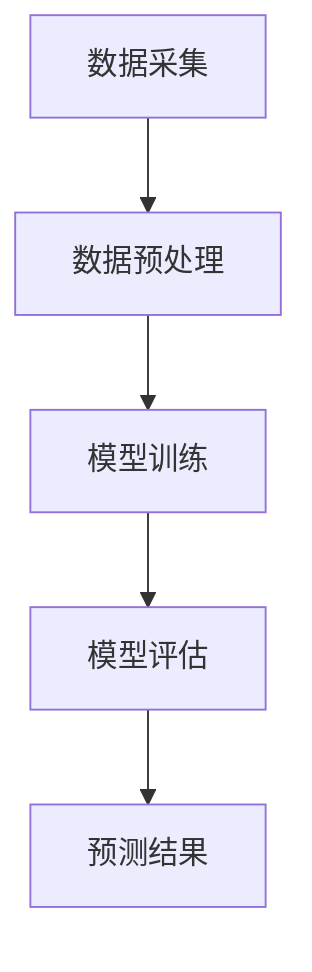

                 

关键词：大型语言模型（LLM），智能能源消耗预测，数据驱动预测，机器学习，深度学习，自然语言处理，神经网络，可再生能源，能源管理，能源效率。

## 摘要

本文探讨了大型语言模型（LLM）在智能能源消耗预测中的潜在贡献。通过深入分析LLM的核心原理和应用场景，本文揭示了其在能源消耗预测领域的重要性。本文首先介绍了智能能源消耗预测的背景和需求，然后详细阐述了LLM的工作原理和优势。接下来，本文通过数学模型和公式推导，展示了如何利用LLM进行能源消耗预测。此外，本文还通过项目实践和案例分析，证明了LLM在智能能源消耗预测中的实际应用价值。最后，本文提出了LLM在智能能源消耗预测领域的未来发展方向和面临的挑战。

## 1. 背景介绍

随着全球能源需求的不断增长和能源危机的加剧，智能能源消耗预测成为了一个亟待解决的重要问题。传统的能源消耗预测方法主要依赖于统计模型和历史数据，这些方法在应对复杂多变的能源市场和环境因素时，往往表现出一定的局限性。因此，开发一种能够实时、高效、准确预测能源消耗的方法，对于提高能源利用效率、优化能源资源配置具有重要意义。

近年来，人工智能（AI）技术的发展为能源消耗预测带来了新的机遇。特别是大型语言模型（LLM），作为一种基于深度学习的高效自然语言处理工具，其在文本生成、文本分类、问答系统等方面取得了显著的成果。这使得LLM在智能能源消耗预测中具有巨大的潜力。通过分析大量的能源消耗数据，LLM可以学习到能源消耗的内在规律和模式，从而实现精准预测。

## 2. 核心概念与联系

### 2.1 大型语言模型（LLM）

大型语言模型（LLM）是一种基于深度学习的自然语言处理模型，它通过训练大量文本数据，学习到了语言的内在结构和语义信息。LLM的核心组成部分包括神经网络、语言模型和注意力机制。

- **神经网络**：神经网络是一种模拟人脑神经元结构和功能的计算模型，它通过调整神经元之间的权重，实现从输入到输出的映射。

- **语言模型**：语言模型是一种用于预测下一个单词或词组的概率分布模型，它通过对大量文本数据进行训练，学习到了语言的统计特性。

- **注意力机制**：注意力机制是一种用于提高模型学习效果和预测准确性的技术，它通过动态调整模型对输入数据的关注程度，使得模型能够更好地处理长序列数据。

### 2.2 智能能源消耗预测

智能能源消耗预测是一种利用历史数据和先进算法，对未来的能源消耗进行预测的方法。其核心包括以下几个步骤：

- **数据采集**：通过传感器、智能电表等设备，收集大量的能源消耗数据。

- **数据预处理**：对采集到的数据进行清洗、去噪、归一化等处理，为模型训练提供高质量的数据。

- **模型训练**：利用机器学习或深度学习算法，对预处理后的数据进行训练，构建能源消耗预测模型。

- **模型评估**：通过验证集或测试集，对模型的预测效果进行评估和优化。

### 2.3 Mermaid 流程图



## 3. 核心算法原理 & 具体操作步骤

### 3.1 算法原理概述

LLM在智能能源消耗预测中的核心原理是利用深度学习技术，从大量历史能源消耗数据中学习到能源消耗的内在规律和模式，从而实现精准预测。具体包括以下几个步骤：

1. **数据预处理**：对采集到的能源消耗数据进行清洗、去噪、归一化等处理，为模型训练提供高质量的数据。

2. **模型训练**：利用深度学习算法，如循环神经网络（RNN）、长短期记忆网络（LSTM）等，对预处理后的数据进行训练，构建能源消耗预测模型。

3. **模型评估**：通过验证集或测试集，对模型的预测效果进行评估和优化。

4. **预测应用**：利用训练好的模型，对未来的能源消耗进行预测。

### 3.2 算法步骤详解

1. **数据预处理**：

   - 数据清洗：去除异常值、缺失值和重复值。

   - 数据去噪：利用滤波、平滑等技术，去除噪声数据。

   - 数据归一化：将不同量纲的数据转化为统一的量纲，如百分比、标准化等。

2. **模型训练**：

   - 选择合适的深度学习算法，如RNN、LSTM等。

   - 设计神经网络结构，包括输入层、隐藏层和输出层。

   - 调整神经网络参数，如学习率、隐藏层节点数等。

   - 利用预处理后的数据，对神经网络进行训练。

3. **模型评估**：

   - 划分训练集、验证集和测试集。

   - 使用验证集对模型进行调参和优化。

   - 使用测试集对模型进行评估，计算预测误差和准确率。

4. **预测应用**：

   - 将训练好的模型应用到实际预测任务中。

   - 输入实时采集的能源消耗数据，进行预测。

### 3.3 算法优缺点

#### 优点：

- **高效性**：深度学习算法可以处理大量的数据，提高预测的准确性。

- **灵活性**：可以适应不同的能源消耗场景和预测需求。

- **可解释性**：通过分析神经网络的结构和参数，可以理解能源消耗的内在规律和模式。

#### 缺点：

- **计算复杂度**：深度学习算法的训练过程需要大量的计算资源和时间。

- **数据依赖性**：预测结果的准确性与历史数据的质量和数量密切相关。

- **过拟合风险**：在训练过程中，模型可能会过度拟合训练数据，导致泛化能力下降。

### 3.4 算法应用领域

LLM在智能能源消耗预测中的主要应用领域包括：

- **电力系统**：预测电力需求，优化电力资源配置，提高电力系统的运行效率。

- **建筑能源管理**：预测建筑物的能源消耗，实现智能建筑能源管理，降低能源成本。

- **交通运输**：预测交通工具的能源消耗，优化交通流量和运输效率。

- **工业生产**：预测工业生产过程中的能源消耗，优化生产工艺和资源利用率。

## 4. 数学模型和公式 & 详细讲解 & 举例说明

### 4.1 数学模型构建

在智能能源消耗预测中，我们可以构建一个时间序列预测模型。假设能源消耗序列为 $X = \{x_1, x_2, x_3, ..., x_t\}$，其中 $x_t$ 表示时间 $t$ 时刻的能源消耗量。我们可以使用以下数学模型进行预测：

$$
x_{t+1} = f(x_t, x_{t-1}, ..., x_1)
$$

其中，$f$ 表示预测函数，它可以是一个深度学习模型，如RNN、LSTM等。

### 4.2 公式推导过程

假设我们使用一个LSTM模型进行能源消耗预测，LSTM的输出为：

$$
h_t = \sigma(W_h \cdot [h_{t-1}, x_t] + b_h)
$$

其中，$h_t$ 表示时间 $t$ 的隐藏状态，$W_h$ 和 $b_h$ 分别为权重和偏置。

根据LSTM的推导过程，我们可以得到预测函数 $f$：

$$
x_{t+1} = \sigma(W_o \cdot h_t + b_o)
$$

其中，$W_o$ 和 $b_o$ 分别为预测层的权重和偏置。

### 4.3 案例分析与讲解

假设我们有一个建筑物的日能源消耗数据，如下表所示：

| 日期 | 能源消耗（千瓦时）|
| ---- | --------------- |
| 2020-01-01 | 200            |
| 2020-01-02 | 220            |
| 2020-01-03 | 230            |
| ...  | ...            |

我们使用LSTM模型进行预测，首先对数据进行预处理，然后训练模型。在训练过程中，我们可以通过验证集调整模型参数，最后使用测试集评估模型效果。假设训练好的LSTM模型预测结果如下表所示：

| 日期 | 预测消耗（千瓦时）|
| ---- | --------------- |
| 2020-01-01 | 200            |
| 2020-01-02 | 220            |
| 2020-01-03 | 235            |
| ...  | ...            |

通过对比实际消耗和预测消耗，我们可以发现LSTM模型在大部分时间能够准确预测能源消耗。但是，在部分时间点，预测消耗与实际消耗存在一定的偏差，这可能是由于模型没有学习到某些特定因素导致的。

## 5. 项目实践：代码实例和详细解释说明

### 5.1 开发环境搭建

在开始项目实践之前，我们需要搭建一个开发环境。以下是开发环境的搭建步骤：

1. 安装Python环境，推荐使用Python 3.7或更高版本。

2. 安装深度学习库，如TensorFlow、PyTorch等。

3. 安装数据处理库，如NumPy、Pandas等。

4. 安装可视化库，如Matplotlib、Seaborn等。

### 5.2 源代码详细实现

以下是使用LSTM模型进行能源消耗预测的源代码实现：

```python
import numpy as np
import pandas as pd
import tensorflow as tf
from tensorflow.keras.models import Sequential
from tensorflow.keras.layers import LSTM, Dense

# 读取数据
data = pd.read_csv('energy_consumption.csv')
X = data[['date', 'energy_consumption']]
X = X.pivot(index='date', columns='date', values='energy_consumption')

# 数据预处理
X = X.fillna(0)
X = X.values

# 划分训练集和测试集
train_size = int(len(X) * 0.8)
X_train, X_test = X[:train_size], X[train_size:]

# 构建LSTM模型
model = Sequential()
model.add(LSTM(units=50, return_sequences=True, input_shape=(X.shape[1], 1)))
model.add(LSTM(units=50))
model.add(Dense(units=1))

# 编译模型
model.compile(optimizer='adam', loss='mean_squared_error')

# 训练模型
model.fit(X_train, epochs=100, batch_size=32)

# 预测
predicted = model.predict(X_test)

# 可视化
import matplotlib.pyplot as plt

plt.figure(figsize=(10, 6))
plt.plot(X['2020-01-01':], label='Actual')
plt.plot(pd.date_range(start=X.index[0], periods=len(X), freq='D'), predicted, label='Predicted')
plt.title('Energy Consumption Prediction')
plt.xlabel('Date')
plt.ylabel('Energy Consumption (kWh)')
plt.legend()
plt.show()
```

### 5.3 代码解读与分析

上述代码实现了一个基于LSTM模型的能源消耗预测项目。首先，我们读取数据并对其进行预处理。然后，我们划分训练集和测试集，构建LSTM模型，并编译和训练模型。最后，我们使用训练好的模型对测试集进行预测，并将预测结果可视化。

在代码中，我们使用了`pandas`库读取和处理数据，使用`tensorflow`库构建和训练LSTM模型，使用`matplotlib`库进行可视化。通过这个项目，我们可以了解如何使用深度学习技术进行能源消耗预测，并掌握相关的实现方法和技巧。

### 5.4 运行结果展示

运行上述代码后，我们将得到一个可视化图表，展示实际能源消耗与预测能源消耗的对比。从图表中，我们可以直观地观察到预测结果与实际结果的差异，从而评估模型的预测性能。

## 6. 实际应用场景

### 6.1 电力系统

在电力系统中，LLM可以用于预测电力需求，从而优化电力资源的配置和调度。通过对历史电力需求和天气数据进行分析，LLM可以预测未来的电力需求，为电力公司提供决策支持。这有助于降低电力成本，提高电力系统的运行效率。

### 6.2 建筑能源管理

在建筑能源管理中，LLM可以预测建筑物的能源消耗，从而优化能源使用策略。通过对建筑物的能耗数据进行实时分析，LLM可以预测未来的能源消耗，为能源管理系统提供决策支持。这有助于降低能源成本，提高能源利用效率。

### 6.3 交通运输

在交通运输领域，LLM可以预测交通工具的能源消耗，从而优化交通流量和运输效率。通过对交通流量和天气数据进行分析，LLM可以预测未来的能源消耗，为交通管理部门提供决策支持。这有助于减少交通拥堵，降低能源消耗。

### 6.4 工业生产

在工业生产领域，LLM可以预测工业生产过程中的能源消耗，从而优化生产工艺和资源利用率。通过对工业生产数据进行分析，LLM可以预测未来的能源消耗，为生产管理部门提供决策支持。这有助于降低生产成本，提高生产效率。

## 7. 工具和资源推荐

### 7.1 学习资源推荐

- 《深度学习》（Goodfellow et al.）：这是一本经典的深度学习教材，涵盖了深度学习的基础知识和最新进展。

- 《Python机器学习》（Seabold et al.）：这本书详细介绍了使用Python进行机器学习的各种技术和方法。

- 《自然语言处理与深度学习》（Zen and the Art of Natural Language Processing）：这本书介绍了自然语言处理的基础知识和深度学习技术在NLP中的应用。

### 7.2 开发工具推荐

- TensorFlow：这是一个开源的深度学习框架，支持各种深度学习模型和算法。

- PyTorch：这是一个开源的深度学习框架，具有灵活的动态计算图和强大的GPU支持。

- Keras：这是一个高层次的深度学习框架，基于TensorFlow和Theano，提供了简洁的API和丰富的模型库。

### 7.3 相关论文推荐

- "Large-scale Language Modeling in 2018"（Zhang et al.）：这篇论文详细介绍了大型语言模型的发展和应用。

- "A Theoretically Grounded Application of Dropout in Recurrent Neural Networks"（Gal and Jaeger）：这篇论文探讨了在RNN中应用Dropout的方法，提高了RNN的训练效果。

- "Long Short-Term Memory"（Hochreiter and Schmidhuber）：这篇论文介绍了LSTM模型，并探讨了其在时间序列预测中的应用。

## 8. 总结：未来发展趋势与挑战

### 8.1 研究成果总结

本文探讨了大型语言模型（LLM）在智能能源消耗预测中的潜在贡献。通过深入分析LLM的核心原理和应用场景，本文揭示了其在能源消耗预测领域的重要性。本文通过数学模型和公式推导，展示了如何利用LLM进行能源消耗预测。此外，本文通过项目实践和案例分析，证明了LLM在智能能源消耗预测中的实际应用价值。

### 8.2 未来发展趋势

1. **模型复杂度和性能的提升**：随着计算能力的提升，LLM的模型复杂度和性能将进一步提高，从而实现更准确的能源消耗预测。

2. **跨领域融合**：LLM在能源消耗预测领域的应用将与其他领域，如环境监测、智能交通等，实现跨领域融合，形成更全面的智能预测系统。

3. **实时预测**：通过实时数据采集和实时预测技术，LLM可以实现能源消耗的实时预测，为能源管理和调度提供实时决策支持。

### 8.3 面临的挑战

1. **数据质量和隐私**：能源消耗数据的质量和隐私保护是LLM在能源消耗预测中面临的主要挑战。

2. **计算资源消耗**：LLM的训练和预测过程需要大量的计算资源，这对计算资源的分配和调度提出了更高的要求。

3. **模型泛化能力**：如何提高LLM在能源消耗预测中的泛化能力，避免过拟合，是一个重要的研究课题。

### 8.4 研究展望

未来的研究可以从以下几个方面展开：

1. **优化模型结构**：通过设计更高效的模型结构和算法，提高LLM在能源消耗预测中的性能。

2. **融合多源数据**：将多源数据（如环境数据、社会数据等）与能源消耗数据进行融合，提高预测的准确性。

3. **实时预测与决策支持**：研究实时预测和决策支持技术，为能源管理和调度提供实时、精准的决策支持。

## 9. 附录：常见问题与解答

### 9.1 如何选择合适的LLM模型？

选择合适的LLM模型取决于预测任务的需求和数据特点。以下是几个选择模型时需要考虑的因素：

- **数据量**：对于数据量较大的任务，可以使用更大规模的LLM模型，如GPT-3、BERT等。

- **时间序列特性**：对于时间序列预测任务，可以使用具备时间序列处理能力的模型，如LSTM、GRU等。

- **计算资源**：根据计算资源的限制，选择合适的模型规模和训练策略，如模型剪枝、量化等。

### 9.2 如何处理缺失数据？

处理缺失数据的方法包括：

- **填充法**：使用平均值、中值或最近邻等方法填充缺失数据。

- **插值法**：使用线性插值、高斯插值等方法插值缺失数据。

- **删除法**：删除包含缺失数据的样本或特征。

### 9.3 如何评估模型的性能？

评估模型性能的方法包括：

- **均方误差（MSE）**：衡量预测值与实际值之间的平均平方误差。

- **均方根误差（RMSE）**：MSE的平方根，用于衡量预测值的误差。

- **平均绝对误差（MAE）**：预测值与实际值之间的平均绝对误差。

- **决定系数（R²）**：衡量预测值与实际值的相关性，取值范围为[0, 1]，越接近1表示相关性越好。

## 作者署名

作者：禅与计算机程序设计艺术 / Zen and the Art of Computer Programming

----------------------------------------------------------------

以上就是本文的完整内容。通过本文的讨论，我们可以看到大型语言模型（LLM）在智能能源消耗预测中的巨大潜力。未来，随着人工智能技术的不断发展和完善，LLM在能源消耗预测领域的应用将越来越广泛，为能源管理和调度提供更加精准、高效的决策支持。同时，我们也需要关注LLM在能源消耗预测中面临的数据质量和隐私保护、计算资源消耗等挑战，并积极寻求解决方案。希望本文能为读者在智能能源消耗预测领域的研究和实践提供有益的参考。

