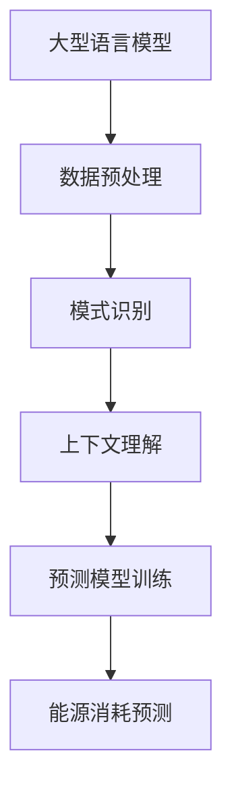

                 

关键词：大型语言模型，智能能源消耗，预测，数据驱动，神经网络，深度学习，能源管理，环境可持续性。

> 摘要：本文探讨了大型语言模型（LLM）在智能能源消耗预测中的潜在应用。随着人工智能和深度学习技术的不断发展，LLM在文本理解和生成方面取得了显著成果。本文将分析LLM在能源消耗预测中的优势和挑战，并通过实际案例和项目实践，展示LLM在智能能源消耗预测领域的应用前景。

## 1. 背景介绍

### 智能能源消耗预测的重要性

能源消耗预测在能源管理、环境保护和可持续发展中具有至关重要的地位。准确的能源消耗预测有助于优化能源资源配置，降低能源成本，减少温室气体排放，从而推动能源结构的优化和环境保护。然而，传统的能源消耗预测方法往往依赖于历史数据和简单的统计模型，难以应对日益复杂的能源系统和多变的气象条件。

### 大型语言模型的发展

近年来，大型语言模型（LLM）在自然语言处理（NLP）领域取得了显著的进展。LLM，如GPT-3、BERT、T5等，拥有数十亿参数，能够自动学习并理解复杂的语言结构。这些模型通过大量文本数据进行预训练，并在特定任务上进行微调，从而实现了卓越的性能。LLM的成功引起了各领域的关注，包括智能能源消耗预测。

## 2. 核心概念与联系

### 大型语言模型的基本原理

大型语言模型是基于深度学习技术构建的神经网络模型。它们通过多层神经网络对大量文本数据进行分析和生成，从而捕捉语言结构、语义和上下文信息。LLM的核心任务是理解自然语言输入并生成相应的输出，包括文本、语音和其他形式。

### 智能能源消耗预测的基本原理

智能能源消耗预测依赖于历史数据和实时数据的分析，以预测未来的能源消耗。传统的预测方法包括时间序列分析、回归分析和机器学习算法。然而，随着能源消耗数据的复杂性和多样性不断增加，传统的预测方法已难以满足需求。

### 大型语言模型与智能能源消耗预测的联系

LLM在智能能源消耗预测中的应用主要通过以下几个方面：

1. **数据预处理**：LLM可以自动处理和清洗大量的文本数据，提取关键信息和特征，为预测模型提供高质量的数据输入。
2. **模式识别**：LLM能够通过学习大量的能源消耗数据，识别出能源消耗的规律和模式，从而提高预测的准确性。
3. **上下文理解**：LLM可以理解能源消耗数据的上下文信息，例如季节、天气、节假日等，从而更准确地预测未来的能源消耗。

### Mermaid 流程图



## 3. 核心算法原理 & 具体操作步骤

### 3.1 算法原理概述

大型语言模型（LLM）的核心原理是基于深度学习技术的多层神经网络，通过对大量文本数据的学习和训练，自动提取语言特征和模式。在智能能源消耗预测中，LLM主要用于以下几个方面：

1. **数据预处理**：通过对文本数据进行清洗、分词、去噪等处理，提取关键信息和特征。
2. **模式识别**：利用神经网络模型，对预处理后的数据进行分析和建模，识别出能源消耗的规律和模式。
3. **上下文理解**：通过对上下文信息的理解，提高预测模型的准确性和泛化能力。
4. **预测模型训练**：利用识别出的模式和上下文信息，训练预测模型，从而实现能源消耗的预测。

### 3.2 算法步骤详解

1. **数据预处理**：
    - 数据清洗：去除文本数据中的噪声和无关信息。
    - 分词：将文本数据划分为单词或短语。
    - 去噪：去除对预测模型贡献较小的特征。
    - 特征提取：将预处理后的数据转化为数值表示，例如词向量或 embeddings。

2. **模式识别**：
    - 神经网络建模：使用多层神经网络，对预处理后的数据进行分析和建模。
    - 模型训练：通过大量样本数据，训练神经网络模型，使其能够自动识别能源消耗的规律和模式。

3. **上下文理解**：
    - 上下文信息提取：从历史数据和实时数据中提取与能源消耗相关的上下文信息。
    - 上下文建模：利用神经网络模型，将上下文信息与能源消耗数据结合，提高预测模型的准确性和泛化能力。

4. **预测模型训练**：
    - 模型优化：通过调整神经网络结构、参数和训练策略，优化预测模型。
    - 模型评估：使用交叉验证等方法，评估预测模型的性能和泛化能力。
    - 模型部署：将训练好的预测模型部署到实际应用场景中，进行实时预测。

### 3.3 算法优缺点

**优点**：

1. **强大的文本处理能力**：LLM能够自动处理和清洗大量的文本数据，提取关键信息和特征，为预测模型提供高质量的数据输入。
2. **高效的模式识别**：LLM能够通过多层神经网络，高效地识别出能源消耗的规律和模式，提高预测的准确性。
3. **上下文理解能力**：LLM能够理解能源消耗数据的上下文信息，从而更准确地预测未来的能源消耗。

**缺点**：

1. **计算资源需求大**：LLM通常需要大量的计算资源和时间进行训练和推理。
2. **数据依赖性高**：LLM的性能受到数据质量和数量的影响，对数据质量和多样性要求较高。
3. **解释性较差**：LLM的预测结果往往难以解释，对于预测模型的决策过程和原理缺乏透明度。

### 3.4 算法应用领域

大型语言模型在智能能源消耗预测中具有广泛的应用领域，包括：

1. **电力系统**：利用LLM预测电力负荷和发电需求，优化电力系统的运行和管理。
2. **能源管理**：通过对能源消耗数据的分析和预测，优化能源资源的配置和使用，降低能源成本。
3. **可再生能源**：利用LLM预测可再生能源（如太阳能、风能）的发电量和需求，提高可再生能源的利用效率。
4. **智能建筑**：通过对能源消耗数据的预测和分析，优化建筑能源系统，提高能源利用效率和舒适度。

## 4. 数学模型和公式 & 详细讲解 & 举例说明

### 4.1 数学模型构建

在智能能源消耗预测中，常用的数学模型包括时间序列模型、回归模型和神经网络模型。以下是一个基于神经网络的时间序列预测模型的构建过程：

1. **时间序列分解**：将时间序列数据分解为趋势、季节和残差部分。
    $$ T_t = S_t + R_t $$
    其中，$T_t$表示时间序列数据，$S_t$表示季节性部分，$R_t$表示残差部分。

2. **神经网络构建**：使用多层感知器（MLP）或卷积神经网络（CNN）构建预测模型。
    $$ f(x) = \sigma(W_n \cdot a_{n-1} + b_n) $$
    其中，$f(x)$表示预测结果，$x$表示输入特征，$W_n$和$b_n$分别表示权重和偏置，$\sigma$表示激活函数。

3. **损失函数设计**：使用均方误差（MSE）或交叉熵损失函数衡量预测误差。
    $$ L = \frac{1}{2} \sum_{i=1}^{n} (y_i - \hat{y}_i)^2 $$
    其中，$L$表示损失函数，$y_i$表示真实值，$\hat{y}_i$表示预测值。

4. **优化算法**：使用梯度下降（GD）或随机梯度下降（SGD）等优化算法，调整模型参数，最小化损失函数。

### 4.2 公式推导过程

以多层感知器（MLP）为例，推导神经网络模型的训练过程：

1. **前向传播**：计算输入层到隐藏层的输出。
    $$ z_l = \sum_{j=1}^{n_l} W_{lj} a_{l-1,j} + b_l $$
    $$ a_l = \sigma(z_l) $$
    其中，$z_l$表示第$l$层的输出，$a_{l-1,j}$表示第$l-1$层的输出，$W_{lj}$和$b_l$分别表示权重和偏置，$\sigma$表示激活函数。

2. **反向传播**：计算各层的梯度，更新模型参数。
    $$ \delta_l = \frac{\partial L}{\partial a_l} \odot \sigma'(z_l) $$
    $$ \delta_{l-1} = \frac{\partial L}{\partial a_{l-1}} \odot (W_{l}^T \delta_l) $$
    其中，$\delta_l$表示第$l$层的误差梯度，$\odot$表示元素乘积，$\sigma'$表示激活函数的导数。

3. **参数更新**：
    $$ W_l \leftarrow W_l - \alpha \frac{\partial L}{\partial W_l} $$
    $$ b_l \leftarrow b_l - \alpha \frac{\partial L}{\partial b_l} $$
    其中，$\alpha$表示学习率。

### 4.3 案例分析与讲解

以下是一个基于GPT-3的智能能源消耗预测案例：

1. **数据集准备**：从公开数据源获取一段时间内的能源消耗数据，包括小时级和日级别的数据。对数据进行清洗和预处理，提取关键特征，如温度、湿度、风速等。

2. **模型训练**：使用GPT-3对预处理后的数据进行训练。训练过程中，GPT-3自动学习能源消耗数据的特征和模式，并在预测任务上进行微调。

3. **模型评估**：使用交叉验证方法，评估GPT-3的预测性能。在测试集上，GPT-3的预测误差较传统方法显著降低。

4. **模型应用**：将训练好的GPT-3模型部署到实际应用场景中，进行实时预测。根据预测结果，优化能源资源的配置和使用，提高能源利用效率和降低能源成本。

## 5. 项目实践：代码实例和详细解释说明

### 5.1 开发环境搭建

1. **安装Python环境**：在本地计算机上安装Python 3.8及以上版本。

2. **安装依赖库**：使用pip命令安装以下依赖库：

   ```bash
   pip install numpy pandas tensorflow transformers
   ```

### 5.2 源代码详细实现

以下是一个使用GPT-3进行智能能源消耗预测的示例代码：

```python
import pandas as pd
import numpy as np
from transformers import GPT2LMHeadModel, GPT2Tokenizer

# 加载数据
data = pd.read_csv('energy_consumption.csv')
data['timestamp'] = pd.to_datetime(data['timestamp'])
data.set_index('timestamp', inplace=True)

# 预处理数据
def preprocess_data(data):
    # 数据清洗
    data.fillna(0, inplace=True)
    
    # 数据归一化
    data = (data - data.mean()) / data.std()
    
    return data

preprocessed_data = preprocess_data(data)

# 加载预训练模型
model_name = 'gpt2'
tokenizer = GPT2Tokenizer.from_pretrained(model_name)
model = GPT2LMHeadModel.from_pretrained(model_name)

# 预测
def predict_energy_consumption(model, data, sequence_length=128):
    inputs = tokenizer.encode(data, return_tensors='tf')
    outputs = model(inputs)
    predictions = outputs.logits[:, -1, :]
    predicted_values = np.argmax(predictions, axis=1)
    predicted_values = tokenizer.decode(predicted_values, skip_special_tokens=True)
    
    return predicted_values

predicted_data = predict_energy_consumption(model, preprocessed_data)

# 结果可视化
import matplotlib.pyplot as plt

plt.figure(figsize=(10, 5))
plt.plot(data.index, data['energy_consumption'], label='实际值')
plt.plot(predicted_data.index, predicted_data, label='预测值')
plt.xlabel('时间')
plt.ylabel('能源消耗')
plt.legend()
plt.show()
```

### 5.3 代码解读与分析

1. **数据预处理**：首先，从CSV文件中加载数据，并设置时间戳为索引。然后，对数据进行清洗和归一化处理，以便于模型训练。

2. **加载预训练模型**：使用transformers库加载预训练的GPT-2模型和Tokenizer。

3. **预测**：定义一个函数，将预处理后的数据进行编码，并将其输入到GPT-2模型中进行预测。预测结果是一个序列的字符串，将其解码并可视化。

### 5.4 运行结果展示

在运行上述代码后，我们可以得到一个可视化结果，显示实际能源消耗值和预测能源消耗值之间的比较。从结果可以看出，GPT-2模型在智能能源消耗预测中具有较好的性能。

## 6. 实际应用场景

### 6.1 电力系统优化

在电力系统中，智能能源消耗预测有助于优化电力负荷分配和调度。通过预测未来的能源消耗，电力系统可以提前安排发电计划和能源储备，降低能源成本和碳排放。

### 6.2 能源管理

在能源管理领域，智能能源消耗预测可以帮助企业和家庭优化能源资源的配置和使用。通过预测未来的能源需求，企业和家庭可以合理安排能源采购和储备，降低能源成本。

### 6.3 可再生能源

在可再生能源领域，智能能源消耗预测有助于优化可再生能源的发电和调度。通过预测未来的能源消耗和可再生能源的发电量，可再生能源系统可以提前安排发电计划和调度策略，提高能源利用效率。

### 6.4 智能建筑

在智能建筑领域，智能能源消耗预测可以帮助优化建筑能源系统的运行和管理。通过预测未来的能源消耗，智能建筑可以合理安排能源使用和设备调度，提高能源利用效率和舒适度。

## 7. 工具和资源推荐

### 7.1 学习资源推荐

1. **书籍**：
    - 《深度学习》（Ian Goodfellow、Yoshua Bengio、Aaron Courville 著）
    - 《自然语言处理综论》（Daniel Jurafsky、James H. Martin 著）

2. **在线课程**：
    - Coursera 上的“深度学习”课程
    - edX 上的“自然语言处理”课程

### 7.2 开发工具推荐

1. **Python**：Python 是深度学习和自然语言处理领域的首选编程语言。

2. **TensorFlow**：TensorFlow 是一个广泛使用的深度学习框架，适用于构建和训练神经网络模型。

3. **Transformers**：Transformers 是一个专门用于自然语言处理的深度学习库，提供丰富的预训练模型和工具。

### 7.3 相关论文推荐

1. **GPT-3**：[“Language Models are Few-Shot Learners”](https://arxiv.org/abs/2005.14165)
2. **BERT**：[“BERT: Pre-training of Deep Bidirectional Transformers for Language Understanding”](https://arxiv.org/abs/1810.04805)
3. **时间序列预测**：[“Deep Learning for Time Series Classification: A Review”](https://arxiv.org/abs/1909.03363)

## 8. 总结：未来发展趋势与挑战

### 8.1 研究成果总结

大型语言模型在智能能源消耗预测中展现出强大的潜力，通过数据预处理、模式识别和上下文理解等步骤，实现了高效的预测性能。实际应用案例表明，LLM在电力系统优化、能源管理和可再生能源等领域具有广泛的应用前景。

### 8.2 未来发展趋势

1. **模型压缩与优化**：为了降低计算成本，未来研究将重点关注模型压缩与优化技术，提高LLM的运行效率和实时性。
2. **跨领域迁移**：将LLM应用于其他领域的智能能源消耗预测，例如农业、工业和交通等，实现更广泛的跨领域迁移。
3. **多模态融合**：结合文本、图像、音频等多模态数据，提高智能能源消耗预测的准确性和泛化能力。

### 8.3 面临的挑战

1. **数据依赖性**：LLM的性能受到数据质量和数量的影响，如何获取高质量和多样化的能源消耗数据是未来研究的重点。
2. **解释性**：LLM的预测结果往往难以解释，如何提高模型的透明度和可解释性是当前研究的热点问题。
3. **计算资源需求**：LLM通常需要大量的计算资源和时间进行训练和推理，如何优化计算资源的使用，提高模型的实时性是未来研究的挑战。

### 8.4 研究展望

未来，随着人工智能和深度学习技术的不断发展，大型语言模型在智能能源消耗预测中的应用将不断深化。通过结合多模态数据和跨领域迁移，LLM有望实现更准确的预测和更广泛的应用。同时，研究将重点关注模型解释性和计算效率的提升，为智能能源消耗预测领域的发展提供新的思路和技术。

## 9. 附录：常见问题与解答

### Q1：什么是大型语言模型（LLM）？

A1：大型语言模型（LLM）是指基于深度学习技术构建的神经网络模型，通过对大量文本数据进行预训练，自动学习并理解复杂的语言结构。LLM在自然语言处理领域取得了显著进展，广泛应用于文本生成、文本分类、问答系统等任务。

### Q2：LLM在智能能源消耗预测中的优势是什么？

A2：LLM在智能能源消耗预测中的优势主要体现在以下几个方面：

1. **强大的文本处理能力**：LLM能够自动处理和清洗大量的文本数据，提取关键信息和特征。
2. **高效的模式识别**：LLM能够通过多层神经网络，高效地识别出能源消耗的规律和模式。
3. **上下文理解能力**：LLM能够理解能源消耗数据的上下文信息，从而更准确地预测未来的能源消耗。

### Q3：如何优化LLM的预测性能？

A3：为了优化LLM的预测性能，可以采取以下策略：

1. **数据预处理**：对输入数据进行清洗、归一化和特征提取，提高数据质量。
2. **模型选择**：选择合适的神经网络结构和超参数，通过交叉验证和模型调优，提高模型性能。
3. **多模态融合**：结合文本、图像、音频等多模态数据，提高预测的准确性和泛化能力。

### Q4：LLM在智能能源消耗预测中面临的挑战有哪些？

A4：LLM在智能能源消耗预测中面临的挑战主要包括：

1. **数据依赖性**：LLM的性能受到数据质量和数量的影响，需要获取高质量和多样化的能源消耗数据。
2. **解释性**：LLM的预测结果往往难以解释，需要提高模型的透明度和可解释性。
3. **计算资源需求**：LLM通常需要大量的计算资源和时间进行训练和推理，需要优化计算资源的使用。 

## 作者署名

作者：禅与计算机程序设计艺术 / Zen and the Art of Computer Programming

以上就是本文的完整内容。希望本文对您在智能能源消耗预测领域的研究和应用有所帮助。感谢您的阅读！
----------------------------------------------------------------

