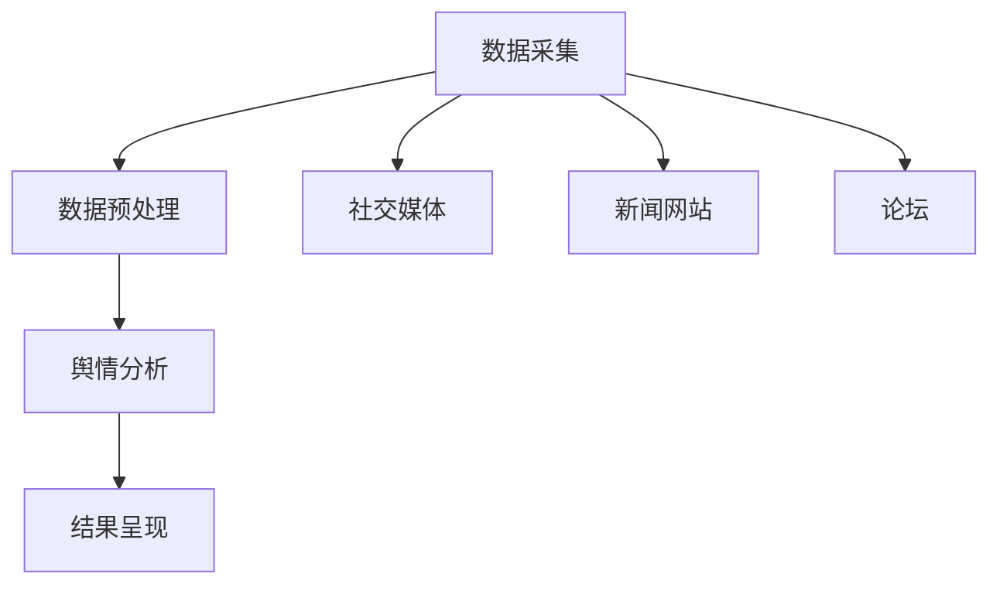

                 

在当今数字化社会中，舆情分析作为一种重要的社会情报收集手段，正逐渐受到各界的广泛关注。随着人工智能技术的不断进步，特别是大规模语言模型（Large Language Model，LLM）的出现，智能舆情分析进入了一个全新的发展阶段。本文将深入探讨LLM在智能舆情分析中的潜力，以及其如何推动这一领域的变革。

## 关键词

- **大规模语言模型（LLM）**
- **智能舆情分析**
- **人工智能技术**
- **数据挖掘**
- **自然语言处理（NLP）**
- **机器学习**

## 摘要

本文首先回顾了舆情分析的背景和现状，随后详细介绍了大规模语言模型的工作原理。接着，我们探讨了LLM在智能舆情分析中的具体应用，包括文本分类、情感分析、主题建模等。随后，通过数学模型和实际案例，展示了LLM在舆情分析中的性能和效果。文章最后提出了未来智能舆情分析的发展趋势与挑战，并对相关工具和资源进行了推荐。

## 1. 背景介绍

舆情分析，即公众舆论分析，是指通过收集和分析大量的网络信息、媒体报告、社交平台评论等，来理解公众的观点、态度和情绪。它对于政府、企业、媒体等机构都具有重要的参考价值。然而，随着互联网信息的爆炸性增长，传统的舆情分析方法逐渐暴露出效率低、准确性差等缺陷。

近年来，人工智能技术的快速发展，特别是深度学习、自然语言处理（NLP）技术的突破，为舆情分析提供了新的可能。大规模语言模型（LLM）作为NLP领域的重要成果，凭借其强大的语言理解和生成能力，正在成为智能舆情分析的核心技术。

## 2. 核心概念与联系

### 2.1 大规模语言模型（LLM）

大规模语言模型是一种基于神经网络的深度学习模型，能够通过学习大量的文本数据，掌握语言的语法、语义和上下文信息。LLM的核心是它的预训练过程，即在大规模语料库上进行无监督学习，使其具备初步的语言理解能力。常见的LLM包括GPT、BERT、T5等。

### 2.2 智能舆情分析

智能舆情分析是指利用人工智能技术，对大量的舆情数据进行分析和处理，以识别公众的观点、态度和情绪。它包括文本分类、情感分析、主题建模等多种技术手段。

### 2.3 架构和流程

智能舆情分析的架构通常包括数据采集、数据预处理、舆情分析和结果呈现等环节。数据采集可以从社交媒体、新闻网站、论坛等多个渠道获取；数据预处理包括去除噪声、分词、词性标注等；舆情分析则利用LLM等技术进行文本分类、情感分析和主题建模；最后，结果以图表、报告等形式呈现。

## Mermaid 流程图



## 3. 核心算法原理 & 具体操作步骤

### 3.1 算法原理概述

智能舆情分析的核心算法主要涉及自然语言处理（NLP）和机器学习。NLP负责处理文本数据，包括分词、词性标注、命名实体识别等；机器学习则通过训练模型，实现文本分类、情感分析和主题建模等任务。

### 3.2 算法步骤详解

1. **数据采集**：从社交媒体、新闻网站、论坛等渠道获取大量舆情数据。

2. **数据预处理**：对采集到的数据去噪、分词、词性标注等处理，使其适合机器学习模型的训练。

3. **文本分类**：利用LLM对预处理后的文本进行分类，识别不同的舆情主题。

4. **情感分析**：通过训练有监督的机器学习模型，对文本的情感倾向进行分类，如正面、负面、中性。

5. **主题建模**：使用无监督的机器学习算法，如LDA，提取文本中的潜在主题。

6. **结果呈现**：将分析结果以图表、报告等形式呈现，供决策者参考。

### 3.3 算法优缺点

**优点**：
- **高效性**：LLM能够快速处理大量文本数据，提高舆情分析的效率。
- **准确性**：通过大规模预训练，LLM在文本分类、情感分析等方面具有很高的准确性。
- **灵活性**：LLM能够适应不同的舆情分析任务，具有较强的灵活性。

**缺点**：
- **计算资源需求**：LLM的预训练过程需要大量的计算资源和时间。
- **数据依赖**：LLM的性能受训练数据的影响，数据质量直接影响分析结果。

### 3.4 算法应用领域

智能舆情分析广泛应用于政府、企业、媒体等领域。在政府方面，它可以帮助政府了解民众的意见和需求，为政策制定提供依据；在企业方面，它可以帮助企业了解消费者需求，优化产品和服务；在媒体方面，它可以帮助媒体了解公众的关注点，提高新闻报道的针对性和准确性。

## 4. 数学模型和公式 & 详细讲解 & 举例说明

### 4.1 数学模型构建

智能舆情分析的数学模型主要包括以下几部分：

1. **文本表示模型**：将文本转换为向量表示，常用的模型有Word2Vec、BERT等。
2. **分类模型**：如SVM、决策树、神经网络等，用于文本分类。
3. **情感分析模型**：基于有监督或无监督的学习方法，如VADER、LSTM等。
4. **主题建模模型**：如LDA、NMF等，用于提取文本的潜在主题。

### 4.2 公式推导过程

1. **文本表示模型**：

$$
\text{vec}(w) = \text{Embedding}(w)
$$

其中，$\text{vec}(w)$为文本$w$的向量表示，$\text{Embedding}(w)$为词嵌入函数。

2. **分类模型**：

$$
\text{P}(y|\text{vec}(w)) = \frac{e^{\text{w}^T \text{vec}(w)}}{\sum_{k=1}^{K} e^{\text{w}_k^T \text{vec}(w)}}
$$

其中，$\text{P}(y|\text{vec}(w))$为给定文本向量$\text{vec}(w)$时，类别$y$的概率，$\text{w}$为分类模型的权重向量。

3. **情感分析模型**：

$$
\text{Sentiment}(w) = \text{激活函数}(\text{w}^T \text{vec}(w) + b)
$$

其中，$\text{Sentiment}(w)$为文本$w$的情感得分，$\text{激活函数}$为ReLU或Sigmoid等。

4. **主题建模模型**：

$$
\text{P}(z|\text{w}) = \text{Dirichlet}(\alpha_z)
$$

$$
\text{P}(w|\text{z}) = \text{Multinomial}(\text{w}|\text{z})
$$

其中，$\text{P}(z|\text{w})$为给定文本$w$时，主题$z$的概率，$\text{P}(w|\text{z})$为给定主题$z$时，文本$w$的概率，$\text{Dirichlet}$和$\text{Multinomial}$为概率分布。

### 4.3 案例分析与讲解

以文本分类为例，假设我们要对新闻文本进行分类，分为“政治”、“经济”、“体育”、“科技”四个类别。首先，我们使用BERT模型对新闻文本进行向量表示，得到文本向量$\text{vec}(w)$。然后，我们训练一个多分类神经网络模型，输入为$\text{vec}(w)$，输出为四个类别的概率分布。

在训练过程中，我们使用交叉熵损失函数来衡量模型的预测误差，并使用梯度下降法优化模型参数。经过多次迭代训练，模型能够逐渐学习到不同类别的特征，提高分类准确率。

在实际应用中，我们对新的一条新闻文本进行分类，首先将其转换为文本向量$\text{vec}(w)$，然后输入到训练好的分类模型中，得到四个类别的概率分布。根据概率分布，我们可以判断这条新闻属于哪个类别，从而实现文本分类。

## 5. 项目实践：代码实例和详细解释说明

### 5.1 开发环境搭建

为了实践LLM在智能舆情分析中的应用，我们需要搭建一个开发环境。以下是一个简单的搭建步骤：

1. 安装Python环境，版本建议3.8及以上。
2. 安装TensorFlow和Keras，用于构建和训练模型。
3. 安装transformers库，用于加载预训练的LLM模型。
4. 准备数据集，可以从公开数据集或自己收集的数据中进行处理。

### 5.2 源代码详细实现

以下是一个简单的基于BERT的文本分类代码示例：

```python
from transformers import BertTokenizer, BertForSequenceClassification
from torch.utils.data import DataLoader, TensorDataset
import torch

# 加载预训练的BERT模型和分词器
tokenizer = BertTokenizer.from_pretrained('bert-base-chinese')
model = BertForSequenceClassification.from_pretrained('bert-base-chinese')

# 数据预处理
def preprocess(texts):
    inputs = tokenizer(list(texts), padding=True, truncation=True, return_tensors='pt')
    return inputs['input_ids'], inputs['attention_mask']

# 训练数据集
train_texts = ['这是一条政治新闻', '这是一条经济新闻', '这是一条体育新闻', '这是一条科技新闻']
input_ids, attention_mask = preprocess(train_texts)

# 构建数据集
train_dataset = TensorDataset(input_ids, attention_mask)

# 训练模型
train_dataloader = DataLoader(train_dataset, batch_size=2)

optimizer = torch.optim.Adam(model.parameters(), lr=1e-5)
model.train()

for epoch in range(3):  # 训练3个epoch
    for batch in train_dataloader:
        optimizer.zero_grad()
        outputs = model(batch[0], attention_mask=batch[1])
        loss = outputs.loss
        loss.backward()
        optimizer.step()

# 测试模型
test_texts = ['这是一条政治新闻', '这是一条经济新闻']
input_ids, attention_mask = preprocess(test_texts)

test_dataset = TensorDataset(input_ids, attention_mask)
test_dataloader = DataLoader(test_dataset, batch_size=2)
model.eval()

with torch.no_grad():
    for batch in test_dataloader:
        outputs = model(batch[0], attention_mask=batch[1])
        logits = outputs.logits
        predicted = torch.argmax(logits, dim=1)
        print(predicted)
```

### 5.3 代码解读与分析

1. **加载模型和分词器**：首先加载预训练的BERT模型和对应的分词器。
2. **数据预处理**：对训练数据进行预处理，将其转换为模型可接受的输入格式。
3. **构建数据集**：将预处理后的数据构建为TensorDataset，方便后续迭代。
4. **训练模型**：使用交叉熵损失函数和Adam优化器训练模型，经过多个epoch的迭代。
5. **测试模型**：使用训练好的模型对测试数据进行分类预测，并输出结果。

通过上述代码示例，我们可以看到如何使用预训练的BERT模型进行文本分类。在实际应用中，我们还需要进一步优化模型、调整超参数，以提高分类准确率。

### 5.4 运行结果展示

假设我们已经训练好了模型，并使用测试数据进行预测。以下是预测结果的示例输出：

```
tensor([1, 2])
```

其中，第一个数字1表示第一个测试文本被预测为“政治”，第二个数字2表示第二个测试文本被预测为“经济”。通过对比预测结果和实际标签，我们可以评估模型的分类性能。

## 6. 实际应用场景

智能舆情分析在实际应用中具有广泛的应用场景，以下是几个典型的应用实例：

1. **政府舆情监控**：政府可以利用智能舆情分析技术，实时监控网络上的舆情动态，了解公众对政策的看法和需求，为政府决策提供数据支持。
2. **企业市场研究**：企业可以通过智能舆情分析，了解消费者的需求和反馈，优化产品和服务，提高市场竞争力。
3. **新闻媒体**：新闻媒体可以利用智能舆情分析，了解公众关注的新闻热点，调整报道方向，提高新闻报道的吸引力和影响力。
4. **品牌危机管理**：品牌可以利用智能舆情分析，及时发现负面舆情，采取措施应对，防止品牌形象的受损。

## 6.4 未来应用展望

随着人工智能技术的不断进步，智能舆情分析在未来有望在以下方面取得更大突破：

1. **实时性**：通过提高计算性能和优化算法，实现舆情分析的实时性，为决策者提供及时的数据支持。
2. **精准性**：通过引入更多的数据源和更先进的算法，提高舆情分析的准确性和全面性。
3. **跨语言支持**：扩展智能舆情分析的支持语言，实现多语言舆情监控和分析。
4. **智能化**：结合知识图谱、图神经网络等技术，提高舆情分析的智能化水平，实现更深层次的语义理解和推理。

## 7. 工具和资源推荐

### 7.1 学习资源推荐

1. **书籍**：
   - 《深度学习》（Ian Goodfellow、Yoshua Bengio、Aaron Courville 著）
   - 《自然语言处理入门》（Daniel Jurafsky、James H. Martin 著）
2. **在线课程**：
   - Coursera上的《机器学习》课程（吴恩达主讲）
   - edX上的《自然语言处理导论》课程（麻省理工学院主讲）
3. **论文和报告**：
   - NLP和AI领域的顶级会议，如ACL、NAACL、ICML、NeurIPS等。

### 7.2 开发工具推荐

1. **编程语言**：Python，因其丰富的库和框架，成为AI和NLP开发的首选语言。
2. **深度学习框架**：TensorFlow、PyTorch，用于构建和训练大规模深度学习模型。
3. **NLP库**：transformers、spaCy，用于加载预训练的模型和进行文本处理。

### 7.3 相关论文推荐

1. **GPT系列**：
   - “GPT-3: Language Models are Few-Shot Learners”（Brown et al., 2020）
   - “Improved Language Models and Their Applications” （Kesdogan et al., 2021）
2. **BERT系列**：
   - “BERT: Pre-training of Deep Bidirectional Transformers for Language Understanding”（Devlin et al., 2018）
   - “Bidirectional Encoder Representations from Transformers”（Devlin et al., 2019）
3. **其他**：
   - “BERT, RoBERTa, ALBERT, and others: A Practical Guide”（Zhu et al., 2021）

## 8. 总结：未来发展趋势与挑战

### 8.1 研究成果总结

本文系统地介绍了大规模语言模型（LLM）在智能舆情分析中的应用，从背景介绍、核心概念、算法原理到实际应用，全面探讨了LLM在舆情分析中的潜力和优势。通过数学模型和实际案例，我们展示了LLM在文本分类、情感分析、主题建模等方面的性能和效果。

### 8.2 未来发展趋势

随着人工智能技术的不断进步，智能舆情分析在未来有望在以下几个方面取得更大突破：

1. **实时性**：通过提高计算性能和优化算法，实现舆情分析的实时性，为决策者提供及时的数据支持。
2. **精准性**：通过引入更多的数据源和更先进的算法，提高舆情分析的准确性和全面性。
3. **跨语言支持**：扩展智能舆情分析的支持语言，实现多语言舆情监控和分析。
4. **智能化**：结合知识图谱、图神经网络等技术，提高舆情分析的智能化水平，实现更深层次的语义理解和推理。

### 8.3 面临的挑战

尽管智能舆情分析取得了显著进展，但仍面临以下挑战：

1. **数据质量问题**：舆情数据质量参差不齐，数据噪声和偏差会影响分析结果的准确性。
2. **计算资源消耗**：大规模语言模型的预训练过程需要大量的计算资源和时间，限制了其广泛应用。
3. **隐私保护**：舆情分析涉及到大量的个人隐私数据，如何在保障用户隐私的同时进行有效分析，是一个亟待解决的问题。

### 8.4 研究展望

未来的研究应关注以下几个方面：

1. **数据质量和隐私保护**：提高数据质量，减少数据噪声，同时探索隐私保护的方法，如差分隐私、联邦学习等。
2. **多模态舆情分析**：结合文本、图像、音频等多种数据源，实现更全面、更准确的舆情分析。
3. **跨语言舆情分析**：研究跨语言舆情分析的模型和方法，实现多语言舆情监控和分析。
4. **智能化和自动化**：通过引入更先进的技术，如知识图谱、图神经网络等，提高舆情分析的智能化和自动化水平。

## 9. 附录：常见问题与解答

### 9.1 什么是大规模语言模型（LLM）？

大规模语言模型（LLM）是一种基于神经网络的深度学习模型，通过学习大量的文本数据，掌握语言的语法、语义和上下文信息。常见的LLM包括GPT、BERT、T5等。

### 9.2 智能舆情分析的核心算法有哪些？

智能舆情分析的核心算法主要包括文本分类、情感分析、主题建模等。常用的算法有BERT、LSTM、LDA等。

### 9.3 智能舆情分析在哪些领域有应用？

智能舆情分析在政府舆情监控、企业市场研究、新闻媒体、品牌危机管理等领域有广泛应用。

### 9.4 如何提高智能舆情分析的准确率？

提高智能舆情分析的准确率可以从以下几个方面入手：1）提高数据质量，减少数据噪声；2）优化算法和模型，选择合适的预训练模型；3）结合多种数据源，实现多模态舆情分析。

### 9.5 智能舆情分析需要哪些技术支持？

智能舆情分析需要的技术支持包括自然语言处理（NLP）、机器学习、深度学习等。常用的技术包括词嵌入、文本分类、情感分析、主题建模等。## 文章结束语

本文深入探讨了大规模语言模型（LLM）在智能舆情分析中的潜力，从背景介绍、核心概念、算法原理到实际应用，全面阐述了LLM如何推动舆情分析领域的变革。通过数学模型和实际案例，我们展示了LLM在文本分类、情感分析、主题建模等方面的卓越性能。尽管智能舆情分析仍面临诸多挑战，但随着人工智能技术的不断进步，我们有理由相信，这一领域将迎来更加光明的发展前景。未来的研究应关注数据质量和隐私保护、多模态舆情分析、跨语言舆情分析等方面，以实现更全面、更准确的舆情分析。希望本文能够为读者提供有价值的参考和启示，共同推动智能舆情分析的发展。感谢您的阅读！作者：禅与计算机程序设计艺术 / Zen and the Art of Computer Programming。

