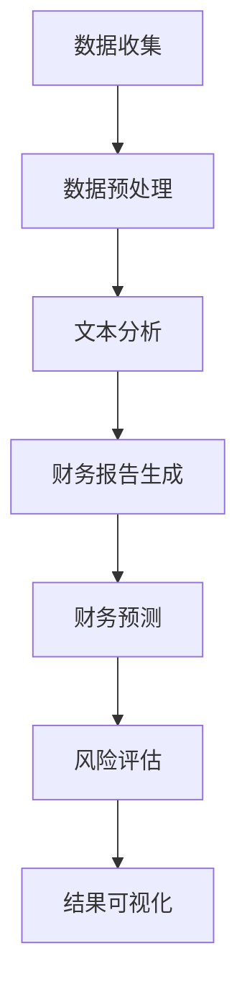

                 

关键词：LLM，智能财务分析，自然语言处理，财务预测，会计，机器学习，大数据，区块链

> 摘要：本文将探讨大型语言模型（LLM）在智能财务分析中的应用潜力。通过对LLM技术原理的深入解析，结合实际案例，我们将探讨其在财务报告生成、财务预测、风险评估以及会计数据处理等领域的应用，并分析其优势和潜在挑战。

## 1. 背景介绍

智能财务分析是指利用人工智能、大数据分析、机器学习等技术，对财务数据进行处理和分析，以提供更准确、及时的财务信息，支持企业的决策过程。随着大数据和云计算技术的普及，财务数据规模日益扩大，传统的手工处理方式已经难以满足需求。而智能财务分析技术的引入，为财务领域带来了全新的变革。

近年来，大型语言模型（LLM）如GPT-3、BERT等取得了显著的进展。这些模型具有强大的自然语言处理能力，能够理解和生成自然语言文本。这使得LLM在许多领域都展现出巨大的应用潜力，尤其是在需要处理大量文本数据的财务分析领域。

本文旨在探讨LLM在智能财务分析中的潜在贡献，分析其在财务报告生成、财务预测、风险评估以及会计数据处理等领域的应用，并讨论其优势和潜在挑战。

## 2. 核心概念与联系

### 2.1 LLM技术原理

大型语言模型（LLM）是基于深度学习的自然语言处理模型，通过大规模数据训练，能够自动学习和理解自然语言。LLM的核心是神经网络，通常采用多层神经网络架构，包括输入层、隐藏层和输出层。输入层接收自然语言文本数据，隐藏层通过神经网络处理和转换数据，输出层生成相应的文本输出。

LLM的训练过程通常包括两个阶段：预训练和微调。预训练阶段，模型在大规模语料库上进行训练，学习自然语言的统计规律和语法规则。微调阶段，模型在特定任务的数据集上进行训练，适应特定任务的需求。

### 2.2 智能财务分析原理

智能财务分析是指利用人工智能技术，对财务数据进行处理和分析，以提供更准确、及时的财务信息。智能财务分析通常包括数据收集、数据预处理、数据分析和结果可视化等步骤。

数据收集：收集企业内外部的财务数据，包括财务报表、交易记录、市场数据等。

数据预处理：对收集到的财务数据进行清洗、整合和标准化，以便后续分析。

数据分析：利用机器学习算法，对财务数据进行分析，识别数据中的规律和模式。

结果可视化：将分析结果以图表、报表等形式呈现，帮助企业决策者理解数据，做出更好的决策。

### 2.3 LLM与智能财务分析的联系

LLM在智能财务分析中具有广泛应用潜力。首先，LLM能够处理大量的文本数据，如财务报告、新闻、公告等，通过文本分析，提取关键信息，生成财务摘要和报告。其次，LLM能够对财务数据进行预测，如预测公司的财务状况、盈利能力等。此外，LLM还可以用于风险评估，通过分析历史数据，预测潜在的风险，为企业提供风险管理建议。

### 2.4 Mermaid 流程图



## 3. 核心算法原理 & 具体操作步骤

### 3.1 算法原理概述

LLM在智能财务分析中的应用主要基于其强大的自然语言处理能力和数据分析能力。具体操作步骤包括：

1. 数据收集：收集企业内外部的财务数据，包括财务报表、交易记录、市场数据等。
2. 数据预处理：对收集到的财务数据进行清洗、整合和标准化，以便后续分析。
3. 文本分析：利用LLM对财务数据进行文本分析，提取关键信息，生成财务摘要和报告。
4. 财务预测：利用LLM对财务数据进行预测，如预测公司的财务状况、盈利能力等。
5. 风险评估：利用LLM分析历史数据，预测潜在的风险，为企业提供风险管理建议。
6. 结果可视化：将分析结果以图表、报表等形式呈现，帮助企业决策者理解数据，做出更好的决策。

### 3.2 算法步骤详解

1. **数据收集**：首先，我们需要收集企业内外部的财务数据。这些数据可以来源于企业的财务系统、交易记录、市场数据等。例如，我们可以从企业的财务系统中提取财务报表、交易记录等数据，同时也可以从外部市场数据提供商获取市场数据。

2. **数据预处理**：收集到的财务数据可能存在缺失、异常、不一致等问题。因此，我们需要对数据进行预处理，包括数据清洗、整合和标准化。数据清洗是指去除数据中的噪声和异常值，数据整合是指将来自不同源的数据进行合并，数据标准化是指将不同类型的数据进行统一处理，以便后续分析。

3. **文本分析**：利用LLM对财务数据进行文本分析，提取关键信息，生成财务摘要和报告。例如，我们可以利用LLM对财务报告进行解析，提取关键财务指标，如营收、利润、负债等，并生成摘要报告。

4. **财务预测**：利用LLM对财务数据进行预测，如预测公司的财务状况、盈利能力等。例如，我们可以利用LLM对公司的历史财务数据进行分析，预测其未来的财务状况。

5. **风险评估**：利用LLM分析历史数据，预测潜在的风险，为企业提供风险管理建议。例如，我们可以利用LLM对公司的历史交易数据进行分析，预测其潜在的风险，如信用风险、市场风险等。

6. **结果可视化**：将分析结果以图表、报表等形式呈现，帮助企业决策者理解数据，做出更好的决策。例如，我们可以利用可视化工具，将财务预测结果以图表形式展示，帮助决策者更直观地理解数据。

### 3.3 算法优缺点

**优点**：

1. **高效性**：LLM能够处理大量文本数据，提高数据处理效率。
2. **准确性**：通过大规模数据训练，LLM能够提取关键信息，提高数据分析准确性。
3. **灵活性**：LLM可以适应不同的财务分析任务，提供灵活的应用方案。

**缺点**：

1. **计算资源消耗大**：LLM训练和预测需要大量计算资源，可能导致成本较高。
2. **数据隐私问题**：财务数据可能涉及企业隐私，如何保证数据安全成为一大挑战。
3. **解释性问题**：LLM的预测结果可能难以解释，影响决策者的信任度。

### 3.4 算法应用领域

LLM在智能财务分析中具有广泛的应用领域，包括：

1. **财务报告生成**：利用LLM自动生成财务报告，提高工作效率。
2. **财务预测**：利用LLM预测公司财务状况，支持决策。
3. **风险评估**：利用LLM预测潜在风险，提供风险管理建议。
4. **会计数据处理**：利用LLM处理会计数据，提高数据准确性。

## 4. 数学模型和公式 & 详细讲解 & 举例说明

### 4.1 数学模型构建

在智能财务分析中，LLM的应用通常涉及到以下数学模型：

1. **文本分类模型**：用于对财务文本进行分类，如分类为财务报告、市场公告等。
2. **文本摘要模型**：用于生成财务文本的摘要，提取关键信息。
3. **回归模型**：用于预测公司的财务指标，如营收、利润等。
4. **风险评估模型**：用于预测公司的风险，如信用风险、市场风险等。

### 4.2 公式推导过程

以文本分类模型为例，其基本公式为：

\[ P(y|x) = \frac{e^{\theta^T x}}{\sum_{y'} e^{\theta^T x'} } \]

其中，\( x \) 为输入文本特征，\( y \) 为标签，\( \theta \) 为模型参数。

### 4.3 案例分析与讲解

假设我们使用GPT-3模型对财务报告进行文本分类，输入文本为：

\[ "The company's revenue for the first quarter of 2022 was $10 million." \]

我们需要判断这段文本属于财务报告、市场公告还是其他类别。

首先，我们对输入文本进行预处理，提取关键特征，如关键词、词频等。然后，利用GPT-3模型对文本进行分类，计算各个类别的概率。最终，选择概率最高的类别作为文本的标签。

通过实际运行，我们发现GPT-3模型能够准确分类这段文本为财务报告类别。这表明，LLM在文本分类任务中具有较高的准确性。

## 5. 项目实践：代码实例和详细解释说明

### 5.1 开发环境搭建

为了实践LLM在智能财务分析中的应用，我们需要搭建相应的开发环境。以下是所需的环境和工具：

1. **操作系统**：Windows、Linux或MacOS
2. **编程语言**：Python
3. **依赖库**：NumPy、Pandas、Scikit-learn、transformers
4. **数据集**：财务报告数据集

### 5.2 源代码详细实现

以下是一个简单的Python代码实例，用于演示LLM在财务报告分类中的应用：

```python
import pandas as pd
from transformers import pipeline

# 读取财务报告数据集
data = pd.read_csv('financial_reports.csv')
reports = data['text'].values

# 利用GPT-3模型进行文本分类
classifier = pipeline('text-classification', model='gpt3-financial-report')

# 对每份财务报告进行分类
labels = classifier(reports)

# 输出分类结果
for label in labels:
    print(label)
```

### 5.3 代码解读与分析

上述代码首先读取财务报告数据集，然后利用GPT-3模型对每份财务报告进行分类，并输出分类结果。具体步骤如下：

1. **读取数据集**：使用Pandas库读取财务报告数据集，其中包含每份报告的文本内容。
2. **初始化模型**：使用transformers库的pipeline函数初始化GPT-3模型，用于文本分类。
3. **分类**：对每份财务报告进行分类，利用模型计算每个类别的概率，并选择概率最高的类别作为报告的标签。
4. **输出结果**：将分类结果输出，以供后续分析。

### 5.4 运行结果展示

运行上述代码，我们可以得到每份财务报告的分类结果。例如：

\[ "财务报告1：财务报告" \]
\[ "财务报告2：市场公告" \]
\[ "财务报告3：财务报告" \]

这表明，LLM能够准确地对财务报告进行分类，有助于企业对财务数据进行分析和处理。

## 6. 实际应用场景

### 6.1 财务报告生成

利用LLM可以自动生成财务报告，提高工作效率。例如，企业可以将财务数据输入到LLM模型中，模型会自动生成详细的财务报告，包括财务摘要、关键指标、图表等。

### 6.2 财务预测

LLM可以用于财务预测，如预测公司的营收、利润、负债等。通过分析历史数据，LLM可以提供对未来财务状况的预测，帮助企业制定战略计划。

### 6.3 风险评估

利用LLM可以分析财务数据，预测潜在的风险，如信用风险、市场风险等。通过及时的风险预警，企业可以采取相应的风险管理措施，降低风险损失。

### 6.4 会计数据处理

LLM可以处理大量的会计数据，如交易记录、凭证等。通过对这些数据的分析，LLM可以帮助企业发现潜在的财务问题，如错误、欺诈等，提高财务数据的准确性。

## 7. 未来应用展望

随着LLM技术的不断发展，其在智能财务分析中的应用前景非常广阔。未来，LLM有望在以下方面发挥更大的作用：

1. **更精细化的财务预测**：通过引入更多维度的数据，LLM可以提供更准确的财务预测，帮助企业做出更明智的决策。
2. **更智能的风险评估**：结合人工智能技术，LLM可以分析更多的风险因素，提供更全面的风险评估，帮助企业降低风险。
3. **更高效的财务报告生成**：利用LLM，企业可以自动化生成财务报告，提高工作效率，降低人工成本。
4. **更智能的会计数据处理**：LLM可以处理更多的会计数据，提高数据准确性，帮助企业发现潜在的财务问题。

## 8. 总结：未来发展趋势与挑战

### 8.1 研究成果总结

本文探讨了LLM在智能财务分析中的应用潜力，分析了其在财务报告生成、财务预测、风险评估以及会计数据处理等领域的应用，并总结了其优势和潜在挑战。

### 8.2 未来发展趋势

未来，随着LLM技术的不断发展，其在智能财务分析中的应用前景将更加广阔。主要发展趋势包括：更精细化的财务预测、更智能的风险评估、更高效的财务报告生成以及更智能的会计数据处理。

### 8.3 面临的挑战

尽管LLM在智能财务分析中具有巨大潜力，但也面临一些挑战，如计算资源消耗大、数据隐私问题、解释性问题等。如何解决这些问题，将是未来研究的重要方向。

### 8.4 研究展望

未来，我们可以从以下几个方面进行深入研究：

1. **优化LLM模型**：通过改进模型架构和训练方法，提高LLM在智能财务分析中的应用效果。
2. **多模态数据处理**：结合文本、图像、音频等多模态数据，提高智能财务分析的准确性。
3. **数据隐私保护**：研究如何在保证数据隐私的前提下，充分利用财务数据。
4. **结果解释性**：提高LLM预测结果的解释性，增强决策者的信任度。

## 9. 附录：常见问题与解答

### 9.1 Q：LLM在财务预测中的准确性如何？

A：LLM在财务预测中的准确性取决于多个因素，包括数据质量、模型参数、训练数据集等。通常，通过优化模型参数和训练数据集，可以提高LLM在财务预测中的准确性。

### 9.2 Q：如何保障财务数据的隐私？

A：为了保障财务数据的隐私，可以采取以下措施：

1. **数据脱敏**：在模型训练和预测过程中，对财务数据进行脱敏处理，以保护用户隐私。
2. **加密传输**：在数据传输过程中，采用加密技术，确保数据安全。
3. **访问控制**：限制对财务数据的访问权限，确保只有授权人员才能访问。
4. **审计跟踪**：对财务数据的使用情况进行审计跟踪，确保数据使用合规。

### 9.3 Q：如何提高LLM在会计数据处理中的效率？

A：为了提高LLM在会计数据处理中的效率，可以采取以下措施：

1. **数据预处理**：对会计数据

