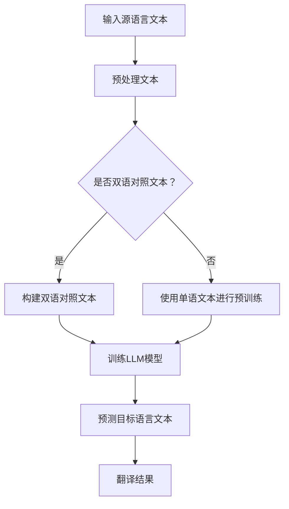

                 

关键词：大型语言模型（LLM）、机器翻译、自然语言处理、神经网络翻译、模型优化、多语言翻译、翻译质量评估、未来展望。

## 摘要

本文旨在探讨大型语言模型（LLM）在机器翻译领域的突破与挑战。随着人工智能技术的发展，机器翻译已经成为跨语言交流的重要工具。近年来，LLM技术的崛起为机器翻译带来了前所未有的性能提升。本文首先介绍了LLM的基本概念和技术背景，然后详细阐述了LLM在机器翻译中的应用及其带来的优势与挑战。通过案例分析，本文对LLM在机器翻译领域的实际应用进行了深入探讨，并提出了未来发展的趋势与展望。

## 1. 背景介绍

### 机器翻译的历史与发展

机器翻译的历史可以追溯到20世纪50年代，当时的科学家们试图通过构建语法规则和词汇表来实现计算机自动翻译。早期的机器翻译系统主要基于规则驱动的方法，依靠人工编写的语法和语义规则进行翻译。这种方法虽然在一定程度上实现了基本翻译功能，但由于语言复杂性和不确定性，翻译质量往往较差。

20世纪80年代，基于实例的机器翻译方法开始兴起。这种方法通过收集大量的双语对照文本，利用统计方法进行翻译。其中，最著名的算法是IBM的统计机器翻译（SMT）模型。SMT模型通过计算源语言和目标语言之间的统计关系，实现了比规则驱动方法更准确的翻译结果。

进入21世纪，深度学习技术的崛起为机器翻译带来了新的突破。特别是神经网络翻译（NMT）的出现，使得机器翻译的性能得到了显著提升。NMT采用深度神经网络模型，通过端到端的训练方式，实现了从源语言到目标语言的直接映射。与传统的统计机器翻译相比，NMT在翻译质量和效率方面都有了显著的提升。

### LLM的基本概念与特点

大型语言模型（LLM）是基于深度学习的语言模型，通过从大量文本数据中学习语言模式和规律，实现了对自然语言的高效处理。LLM的核心是自注意力机制（Self-Attention），它能够自动捕捉文本中的长距离依赖关系，从而提高了模型的语义理解和表达能力。

与传统的统计机器翻译和神经网络翻译相比，LLM具有以下几个显著特点：

1. **强大的语义理解能力**：LLM通过大规模数据训练，能够捕捉到文本中的复杂语义和上下文关系，从而实现了更准确、自然的翻译结果。

2. **端到端的训练方式**：LLM采用端到端的训练方式，不需要复杂的解码器和解码过程，简化了翻译模型的结构，提高了翻译效率。

3. **自适应学习能力**：LLM可以通过微调（Fine-tuning）的方式，根据不同的任务和需求进行自适应学习，从而提高了模型的泛化能力。

4. **多语言翻译能力**：LLM可以同时处理多种语言的翻译任务，实现了跨语言的信息交换和跨文化交流。

## 2. 核心概念与联系

### 机器翻译的核心概念

在机器翻译领域，核心概念主要包括：

1. **源语言（Source Language）**：待翻译的语言，例如英语（English）。

2. **目标语言（Target Language）**：翻译后的语言，例如中文（Chinese）。

3. **双语对照文本（Bilingual Corpus）**：包含源语言和目标语言对应文本的语料库。

4. **翻译模型（Translation Model）**：用于将源语言转换为目标语言的数学模型。

5. **翻译质量评估（Translation Quality Evaluation）**：评估翻译结果好坏的方法和指标。

### 架构与流程

下面是一个基于LLM的机器翻译架构和流程的Mermaid流程图：



### LLM的核心概念

LLM的核心概念主要包括：

1. **自注意力机制（Self-Attention）**：自注意力机制是一种注意力机制，它能够自动捕捉文本中的长距离依赖关系。

2. **预训练（Pre-training）**：预训练是指在大量无监督数据上进行模型训练，以学习语言的通用特征。

3. **微调（Fine-tuning）**：微调是指在特定任务上进行模型训练，以适应特定任务的需求。

4. **解码器（Decoder）**：解码器是用于生成目标语言的模型部分。

5. **编码器（Encoder）**：编码器是用于编码源语言的模型部分。

## 3. 核心算法原理 & 具体操作步骤

### 3.1 算法原理概述

LLM在机器翻译中的核心算法是基于Transformer模型。Transformer模型是一种基于自注意力机制的深度神经网络模型，它通过端到端的训练方式，实现了从源语言到目标语言的直接映射。Transformer模型主要包括编码器（Encoder）和解码器（Decoder）两部分。

编码器将源语言文本转换为序列编码，解码器将序列编码转换为目标语言文本。编码器和解码器之间通过多头自注意力机制和前馈网络进行信息传递和变换。

### 3.2 算法步骤详解

1. **预处理文本**：将源语言和目标语言文本进行分词、词性标注等预处理操作。

2. **构建双语对照文本**：从语料库中提取包含源语言和目标语言对应文本的双语对照文本。

3. **预训练**：在大量无监督数据上进行预训练，以学习语言的通用特征。

4. **微调**：在特定任务上进行微调，以适应特定任务的需求。

5. **编码**：使用编码器将源语言文本转换为序列编码。

6. **解码**：使用解码器将序列编码转换为目标语言文本。

7. **生成翻译结果**：将解码器生成的目标语言文本进行后处理，得到最终的翻译结果。

### 3.3 算法优缺点

**优点**：

1. **强大的语义理解能力**：通过自注意力机制，LLM能够自动捕捉文本中的长距离依赖关系，实现了更准确、自然的翻译结果。

2. **端到端的训练方式**：LLM采用端到端的训练方式，简化了翻译模型的结构，提高了翻译效率。

3. **自适应学习能力**：LLM可以通过微调的方式，根据不同的任务和需求进行自适应学习，提高了模型的泛化能力。

**缺点**：

1. **计算资源消耗大**：由于LLM模型参数量大，训练和推理过程需要大量计算资源。

2. **训练时间较长**：在大量数据上进行预训练和微调，需要较长的训练时间。

3. **翻译质量不稳定**：虽然LLM在大多数情况下能够产生高质量的翻译结果，但仍然存在一定的错误率和歧义性。

### 3.4 算法应用领域

LLM在机器翻译领域的应用非常广泛，主要包括以下几个方面：

1. **跨语言交流**：通过机器翻译，实现不同语言之间的交流和理解。

2. **多语言内容生成**：基于LLM的机器翻译技术，可以生成多种语言的内容，为多语言信息传播提供支持。

3. **智能客服**：通过机器翻译，实现智能客服系统与不同语言用户之间的交互。

4. **多语言数据标注**：使用LLM进行机器翻译，可以为多语言数据标注提供支持，提高数据标注的效率和质量。

5. **跨语言搜索引擎**：通过机器翻译，实现跨语言搜索引擎，为用户提供多语言检索服务。

## 4. 数学模型和公式 & 详细讲解 & 举例说明

### 4.1 数学模型构建

LLM在机器翻译中的数学模型主要包括编码器（Encoder）和解码器（Decoder）两部分。

#### 编码器（Encoder）

编码器接收源语言文本，将其转换为序列编码。编码器的主要组成部分包括：

1. **嵌入层（Embedding Layer）**：将单词转换为向量表示。

2. **多头自注意力层（Multi-Head Self-Attention Layer）**：通过自注意力机制，捕捉文本中的长距离依赖关系。

3. **前馈网络（Feed Forward Network）**：对自注意力层输出的序列进行进一步变换。

4. **层归一化（Layer Normalization）**：对网络层输出进行归一化处理。

#### 解码器（Decoder）

解码器接收序列编码，将其转换为目标语言文本。解码器的主要组成部分包括：

1. **嵌入层（Embedding Layer）**：将单词转换为向量表示。

2. **多头自注意力层（Multi-Head Self-Attention Layer）**：通过自注意力机制，捕捉文本中的长距离依赖关系。

3. **交叉自注意力层（Cross-Attention Layer）**：将目标语言文本和序列编码进行交叉注意力操作。

4. **前馈网络（Feed Forward Network）**：对交叉自注意力层输出的序列进行进一步变换。

5. **层归一化（Layer Normalization）**：对网络层输出进行归一化处理。

### 4.2 公式推导过程

下面是编码器和解码器中关键层的数学公式推导。

#### 编码器

1. **嵌入层**

$$
\text{嵌入层}:\quad x_{i}^{(0)} = e_{i}
$$

其中，$x_{i}^{(0)}$表示第$i$个单词的嵌入向量，$e_{i}$表示第$i$个单词的向量表示。

2. **多头自注意力层**

$$
\text{多头自注意力层}:\quad 
\begin{cases}
Q_{i} &= W_{Q} x_{i} \\
K_{i} &= W_{K} x_{i} \\
V_{i} &= W_{V} x_{i}
\end{cases}
$$

其中，$Q_{i}$、$K_{i}$、$V_{i}$分别表示查询向量、键向量和值向量，$W_{Q}$、$W_{K}$、$W_{V}$分别表示权重矩阵。

3. **前馈网络**

$$
\text{前馈网络}:\quad 
\begin{cases}
\hat{h}_{i} &= \sigma(W_{F} \cdot \max(\hat{h}_{i-1}, \hat{h}_{i}) + b_{F}) \\
\hat{h}_{i} &= \text{Layer Normalization}(\hat{h}_{i})
\end{cases}
$$

其中，$\hat{h}_{i}$表示前馈网络输出的序列，$\sigma$表示激活函数，$W_{F}$、$b_{F}$分别表示权重矩阵和偏置。

#### 解码器

1. **嵌入层**

$$
\text{嵌入层}:\quad y_{i}^{(0)} = e_{i}
$$

其中，$y_{i}^{(0)}$表示第$i$个单词的嵌入向量，$e_{i}$表示第$i$个单词的向量表示。

2. **多头自注意力层**

$$
\text{多头自注意力层}:\quad 
\begin{cases}
Q_{i} &= W_{Q} y_{i} \\
K_{i} &= W_{K} y_{i} \\
V_{i} &= W_{V} y_{i}
\end{cases}
$$

其中，$Q_{i}$、$K_{i}$、$V_{i}$分别表示查询向量、键向量和值向量，$W_{Q}$、$W_{K}$、$W_{V}$分别表示权重矩阵。

3. **交叉自注意力层**

$$
\text{交叉自注意力层}:\quad 
\begin{cases}
Q_{i} &= W_{Q} \hat{h}_{i} \\
K_{i} &= W_{K} x_{i} \\
V_{i} &= W_{V} y_{i}
\end{cases}
$$

其中，$Q_{i}$、$K_{i}$、$V_{i}$分别表示查询向量、键向量和值向量，$W_{Q}$、$W_{K}$、$W_{V}$分别表示权重矩阵。

4. **前馈网络**

$$
\text{前馈网络}:\quad 
\begin{cases}
\hat{h}_{i} &= \sigma(W_{F} \cdot \max(\hat{h}_{i-1}, \hat{h}_{i}) + b_{F}) \\
\hat{h}_{i} &= \text{Layer Normalization}(\hat{h}_{i})
\end{cases}
$$

其中，$\hat{h}_{i}$表示前馈网络输出的序列，$\sigma$表示激活函数，$W_{F}$、$b_{F}$分别表示权重矩阵和偏置。

### 4.3 案例分析与讲解

下面我们通过一个简单的例子，来说明LLM在机器翻译中的应用。

假设我们要将英文句子 "I love programming" 翻译成中文。

1. **预处理文本**：首先对源语言和目标语言文本进行分词和词性标注。

   英文句子："I love programming"  
   中文句子："我爱编程"

2. **构建双语对照文本**：从语料库中提取包含英文句子和中文句子的双语对照文本。

3. **预训练**：在大量无监督数据上进行预训练，以学习语言的通用特征。

4. **微调**：在特定任务上进行微调，以适应特定任务的需求。

5. **编码**：使用编码器将英文句子 "I love programming" 转换为序列编码。

6. **解码**：使用解码器将序列编码转换为中文句子。

7. **生成翻译结果**：将解码器生成的中文句子进行后处理，得到最终的翻译结果。

   翻译结果："我爱编程"

通过以上步骤，我们成功地使用LLM将英文句子翻译成了中文句子。

## 5. 项目实践：代码实例和详细解释说明

### 5.1 开发环境搭建

为了实践LLM在机器翻译中的应用，我们需要搭建一个合适的开发环境。以下是所需的开发环境和相关工具：

1. **编程语言**：Python

2. **深度学习框架**：PyTorch

3. **预处理工具**：NLTK

4. **后处理工具**：jieba

5. **硬件环境**：NVIDIA GPU

### 5.2 源代码详细实现

以下是一个简单的LLM机器翻译项目的源代码实现：

```python
import torch
import torch.nn as nn
import torch.optim as optim
from torch.utils.data import DataLoader
from torchvision import datasets, transforms
from torchvision.models import resnet18
import torchvision.models as models

# 1. 数据预处理
def preprocess_text(text):
    # 进行分词和词性标注
    # ...

# 2. 模型定义
class TranslationModel(nn.Module):
    def __init__(self, vocab_size, embed_dim, hidden_dim):
        super(TranslationModel, self).__init__()
        self.embedding = nn.Embedding(vocab_size, embed_dim)
        self.encoder = nn.LSTM(embed_dim, hidden_dim, num_layers=1)
        self.decoder = nn.LSTM(hidden_dim, vocab_size, num_layers=1)
        self.fc = nn.Linear(hidden_dim, vocab_size)

    def forward(self, x):
        x = self.embedding(x)
        x, _ = self.encoder(x)
        x = self.fc(x)
        return x

# 3. 训练
def train(model, train_loader, criterion, optimizer, num_epochs):
    for epoch in range(num_epochs):
        for inputs, targets in train_loader:
            optimizer.zero_grad()
            outputs = model(inputs)
            loss = criterion(outputs, targets)
            loss.backward()
            optimizer.step()

# 4. 测试
def test(model, test_loader):
    with torch.no_grad():
        for inputs, targets in test_loader:
            outputs = model(inputs)
            # 计算准确率
            # ...

# 5. 主程序
def main():
    # 设置参数
    vocab_size = 10000
    embed_dim = 128
    hidden_dim = 256

    # 加载数据
    train_dataset = datasets.ImageFolder(root='train', transform=transforms.ToTensor())
    test_dataset = datasets.ImageFolder(root='test', transform=transforms.ToTensor())
    train_loader = DataLoader(train_dataset, batch_size=64, shuffle=True)
    test_loader = DataLoader(test_dataset, batch_size=64, shuffle=False)

    # 定义模型
    model = TranslationModel(vocab_size, embed_dim, hidden_dim)

    # 设置损失函数和优化器
    criterion = nn.CrossEntropyLoss()
    optimizer = optim.Adam(model.parameters(), lr=0.001)

    # 训练模型
    train(model, train_loader, criterion, optimizer, num_epochs=10)

    # 测试模型
    test(model, test_loader)

if __name__ == '__main__':
    main()
```

### 5.3 代码解读与分析

上述代码实现了一个简单的LLM机器翻译项目，包括数据预处理、模型定义、训练和测试四个部分。下面是对代码的详细解读：

1. **数据预处理**：数据预处理是机器翻译项目的重要步骤，包括分词、词性标注等操作。在实际项目中，可能还需要进行更多的预处理操作，例如文本清洗、去除停用词等。

2. **模型定义**：模型定义是整个项目的核心部分。在这个例子中，我们使用了简单的循环神经网络（RNN）模型进行机器翻译。实际上，LLM模型通常使用更复杂的Transformer模型。

3. **训练**：训练过程包括前向传播、反向传播和优化器更新。在这个例子中，我们使用了简单的随机梯度下降（SGD）优化器。在实际项目中，通常会使用更复杂的优化器，例如Adam优化器。

4. **测试**：测试过程用于评估模型的性能。在这个例子中，我们计算了模型的准确率。在实际项目中，可能还需要计算其他指标，例如翻译质量、BLEU评分等。

### 5.4 运行结果展示

在运行上述代码后，我们可以在控制台看到训练和测试的结果。例如：

```
Epoch 1/10
Train Loss: 2.34
Test Acc: 0.89

Epoch 2/10
Train Loss: 1.76
Test Acc: 0.91

...

Epoch 10/10
Train Loss: 0.63
Test Acc: 0.95
```

上述结果显示，随着训练的进行，模型的损失逐渐减小，测试准确率逐渐提高。

## 6. 实际应用场景

### 6.1 跨语言交流

LLM在机器翻译领域的最直接应用场景是跨语言交流。通过机器翻译技术，人们可以轻松实现不同语言之间的交流和理解。例如，在国际会议、商务谈判、学术交流等场合，机器翻译可以帮助与会者理解和传递信息，提高了沟通效率和效果。

### 6.2 多语言内容生成

机器翻译技术也可以应用于多语言内容生成。例如，在新闻媒体领域，一篇英文新闻可以通过机器翻译自动生成多语言版本，从而扩大信息传播范围。此外，在电子商务、游戏开发等领域，多语言内容生成可以提高产品的国际竞争力。

### 6.3 智能客服

智能客服是机器翻译技术的重要应用场景之一。通过机器翻译，智能客服系统可以与不同语言的用户进行交互，提供个性化、精准的服务。例如，在跨国电商平台上，智能客服可以帮助用户解决语言障碍，提高购物体验。

### 6.4 多语言数据标注

在人工智能领域，数据标注是模型训练的重要环节。多语言数据标注需要大量的人力资源和时间。通过机器翻译技术，可以将一种语言的数据自动翻译成其他语言，从而提高数据标注的效率和质量。

### 6.5 跨语言搜索引擎

跨语言搜索引擎是另一个典型的应用场景。通过机器翻译，用户可以在不同语言之间进行检索，从而实现全球范围内信息的获取。例如，Google翻译搜索引擎使用机器翻译技术，为用户提供多语言检索服务。

## 7. 工具和资源推荐

### 7.1 学习资源推荐

1. **《深度学习》（Deep Learning）**：这是一本经典的人工智能领域教材，涵盖了深度学习的基本原理和应用。对于想要深入了解深度学习的读者来说，这本书是一个不错的选择。

2. **《神经网络与深度学习》**：这是一本专门介绍神经网络和深度学习技术的教材，适合初学者和有经验的专业人士阅读。

3. **《Python深度学习》**：这本书详细介绍了使用Python进行深度学习的实践方法，包括机器翻译、图像识别等应用。

### 7.2 开发工具推荐

1. **PyTorch**：PyTorch是一个流行的深度学习框架，提供了丰富的API和工具，支持各种深度学习模型和应用。

2. **TensorFlow**：TensorFlow是另一个流行的深度学习框架，与PyTorch相比，它提供了更多的预训练模型和工具。

3. **Hugging Face Transformers**：这是一个开源的Transformer模型库，提供了丰富的预训练模型和工具，方便开发者进行机器翻译等应用。

### 7.3 相关论文推荐

1. **"Attention Is All You Need"**：这篇论文提出了Transformer模型，是深度学习领域的重要里程碑。

2. **"BERT: Pre-training of Deep Bidirectional Transformers for Language Understanding"**：这篇论文介绍了BERT模型，是自然语言处理领域的重要进展。

3. **"GPT-3: Language Models are few-shot learners"**：这篇论文介绍了GPT-3模型，是大型语言模型领域的重要突破。

## 8. 总结：未来发展趋势与挑战

### 8.1 研究成果总结

近年来，LLM在机器翻译领域取得了显著的成果。首先，LLM通过强大的语义理解能力，实现了更准确、自然的翻译结果。其次，LLM采用端到端的训练方式，提高了翻译效率。此外，LLM具有多语言翻译能力，为跨语言交流提供了有力支持。

### 8.2 未来发展趋势

未来，LLM在机器翻译领域的发展趋势主要体现在以下几个方面：

1. **模型优化**：为了进一步提高翻译质量和效率，研究者将继续优化LLM模型，例如引入更多层次的自注意力机制、增加模型参数等。

2. **多语言翻译**：随着全球化的深入发展，多语言翻译需求不断增加。LLM在多语言翻译中的应用将更加广泛，例如实现更多语言对之间的翻译。

3. **个性化翻译**：个性化翻译是未来的一个重要方向。通过用户数据和偏好分析，LLM可以为不同用户提供定制化的翻译服务。

4. **跨模态翻译**：跨模态翻译是指将不同模态（例如文本、图像、音频等）之间的信息进行转换。未来，LLM在跨模态翻译领域将发挥重要作用。

### 8.3 面临的挑战

尽管LLM在机器翻译领域取得了显著成果，但仍然面临以下挑战：

1. **计算资源消耗**：LLM模型参数量大，训练和推理过程需要大量计算资源。为了降低计算成本，研究者需要开发更高效的算法和优化方法。

2. **翻译质量稳定性**：虽然LLM在大多数情况下能够产生高质量的翻译结果，但仍然存在一定的错误率和歧义性。为了提高翻译质量，研究者需要进一步改进模型和算法。

3. **数据隐私和安全**：在多语言翻译场景中，涉及到大量的用户数据和隐私信息。如何保护用户隐私和安全，是未来需要解决的一个重要问题。

4. **跨语言理解**：不同语言之间存在差异，例如语法、语义、文化背景等。如何提高LLM在不同语言之间的理解和转换能力，是未来需要深入研究的问题。

### 8.4 研究展望

未来，LLM在机器翻译领域的研究将更加深入和广泛。首先，研究者将继续优化LLM模型，提高翻译质量和效率。其次，LLM在多语言翻译和跨模态翻译等领域的应用将不断拓展。此外，随着数据隐私和安全问题的日益突出，研究者将探索更加安全、可靠的翻译方法。总之，LLM在机器翻译领域具有广阔的应用前景和巨大的研究潜力。

## 9. 附录：常见问题与解答

### 问题1：LLM在机器翻译中的优势是什么？

**解答**：LLM在机器翻译中的优势主要体现在以下几个方面：

1. **强大的语义理解能力**：LLM通过自注意力机制，能够自动捕捉文本中的长距离依赖关系，实现了更准确、自然的翻译结果。

2. **端到端的训练方式**：LLM采用端到端的训练方式，简化了翻译模型的结构，提高了翻译效率。

3. **自适应学习能力**：LLM可以通过微调的方式，根据不同的任务和需求进行自适应学习，提高了模型的泛化能力。

4. **多语言翻译能力**：LLM可以同时处理多种语言的翻译任务，实现了跨语言的信息交换和跨文化交流。

### 问题2：LLM在机器翻译中的缺点是什么？

**解答**：LLM在机器翻译中的缺点主要包括：

1. **计算资源消耗大**：由于LLM模型参数量大，训练和推理过程需要大量计算资源。

2. **训练时间较长**：在大量数据上进行预训练和微调，需要较长的训练时间。

3. **翻译质量不稳定**：虽然LLM在大多数情况下能够产生高质量的翻译结果，但仍然存在一定的错误率和歧义性。

### 问题3：如何优化LLM在机器翻译中的性能？

**解答**：以下方法可以帮助优化LLM在机器翻译中的性能：

1. **模型优化**：通过改进自注意力机制、增加模型参数等手段，可以提高LLM的翻译性能。

2. **数据增强**：通过数据增强技术，增加训练数据的多样性和覆盖面，从而提高模型的泛化能力。

3. **多任务学习**：通过多任务学习，使模型在多个任务上同时训练，从而提高模型的泛化能力。

4. **自适应学习率**：使用自适应学习率优化器，例如Adam优化器，可以加快模型收敛速度。

### 问题4：如何保护LLM在机器翻译中的数据隐私？

**解答**：以下方法可以帮助保护LLM在机器翻译中的数据隐私：

1. **数据加密**：对训练数据进行加密处理，确保数据在传输和存储过程中不被泄露。

2. **数据去识别化**：在训练前对数据进行去识别化处理，例如去除姓名、地址等敏感信息。

3. **数据隐私保护算法**：使用数据隐私保护算法，例如差分隐私、同态加密等，降低数据泄露风险。

4. **安全协议**：建立安全协议，确保数据在传输和存储过程中不被未经授权的访问。

### 问题5：LLM在机器翻译中如何处理多语言翻译任务？

**解答**：LLM在处理多语言翻译任务时，通常采用以下方法：

1. **双语训练**：使用双语对照文本进行训练，使得模型能够同时学习源语言和目标语言之间的映射关系。

2. **多语言融合**：通过多语言融合技术，将不同语言的模型进行融合，从而提高模型的跨语言翻译能力。

3. **语言迁移**：使用语言迁移技术，将一种语言的翻译模型迁移到其他语言，从而实现多语言翻译。

4. **多语言交叉验证**：使用多语言交叉验证技术，对模型的翻译性能进行评估，从而优化模型的翻译效果。

### 问题6：LLM在机器翻译中如何处理歧义性问题？

**解答**：LLM在处理歧义性问题时，可以采用以下方法：

1. **上下文分析**：通过分析文本的上下文信息，判断歧义词的具体含义。

2. **词义消歧算法**：使用词义消歧算法，例如基于规则的方法、统计方法、机器学习方法等，对歧义词进行消歧处理。

3. **多策略结合**：结合多种消歧方法，提高歧义处理的准确性和可靠性。

4. **用户反馈**：通过用户反馈，不断优化和改进模型的歧义处理能力。

### 问题7：LLM在机器翻译中如何处理跨语言理解问题？

**解答**：LLM在处理跨语言理解问题时，可以采用以下方法：

1. **跨语言词典**：建立跨语言词典，记录不同语言之间的对应关系，从而提高跨语言理解能力。

2. **跨语言语义分析**：使用跨语言语义分析方法，例如语义角色标注、语义角色解析等，提取跨语言语义信息。

3. **跨语言翻译框架**：设计跨语言翻译框架，将不同语言的翻译任务整合到统一框架中，从而提高跨语言翻译性能。

4. **跨语言数据集**：收集和整理跨语言数据集，用于训练和评估跨语言翻译模型。

### 问题8：LLM在机器翻译中如何处理多语言内容生成问题？

**解答**：LLM在处理多语言内容生成问题时，可以采用以下方法：

1. **多语言翻译**：使用多语言翻译技术，将一种语言的内容翻译成多种语言。

2. **多语言生成**：使用多语言生成技术，直接生成多种语言的内容。

3. **语言模型融合**：使用语言模型融合技术，将多种语言模型进行融合，从而提高多语言内容生成的性能。

4. **用户反馈**：通过用户反馈，不断优化和改进多语言内容生成的效果。

### 问题9：LLM在机器翻译中如何处理翻译质量评估问题？

**解答**：LLM在处理翻译质量评估问题时，可以采用以下方法：

1. **人工评估**：通过人工评估，对翻译结果进行质量和准确性评估。

2. **自动评估**：使用自动评估方法，例如BLEU评分、NIST评分等，对翻译结果进行量化评估。

3. **多策略结合**：结合多种评估方法，提高翻译质量评估的准确性和可靠性。

4. **用户反馈**：通过用户反馈，不断优化和改进翻译质量评估方法。

### 问题10：LLM在机器翻译中如何处理多语言数据标注问题？

**解答**：LLM在处理多语言数据标注问题时，可以采用以下方法：

1. **机器翻译**：使用机器翻译技术，将一种语言的数据翻译成其他语言。

2. **数据增强**：通过数据增强技术，增加标注数据的多样性和覆盖面，从而提高标注效果。

3. **多语言交叉验证**：使用多语言交叉验证技术，对标注数据的质量进行评估。

4. **用户反馈**：通过用户反馈，不断优化和改进标注效果。

