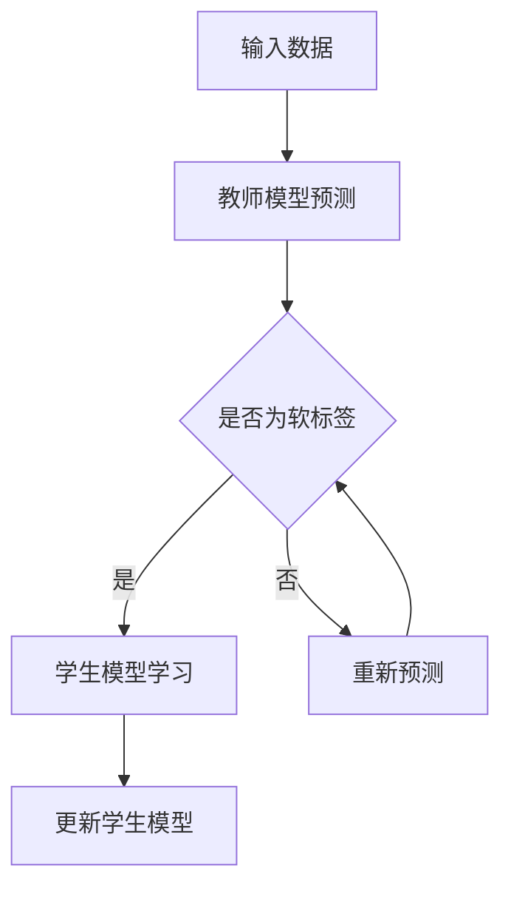
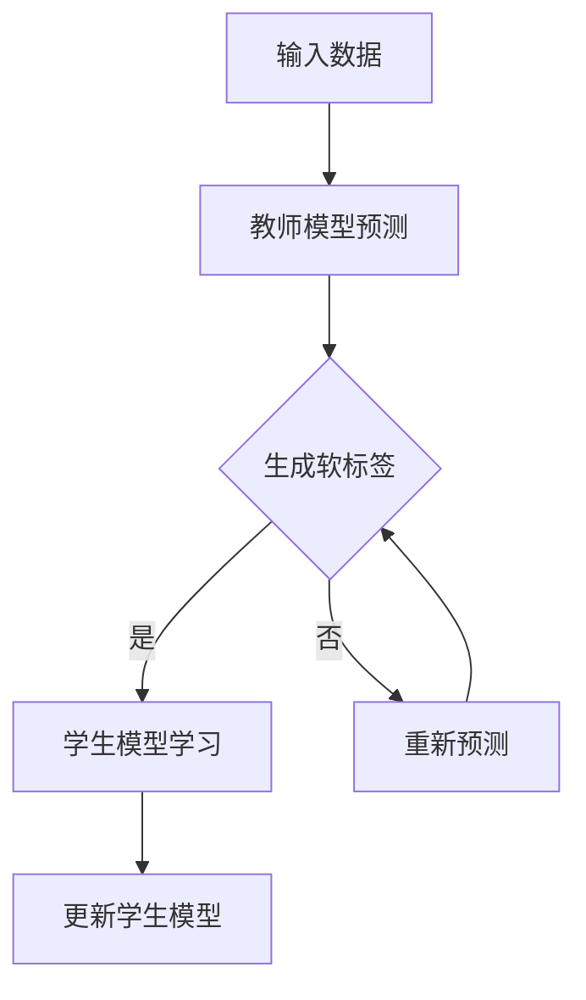

                 

关键词：知识蒸馏、语言模型（LLM）、模型压缩、模型优化、计算机图灵奖、机器学习、深度学习

> 摘要：本文将深入探讨语言模型（LLM）在知识蒸馏过程中的应用。知识蒸馏作为一种先进的模型压缩技术，旨在减少大型预训练模型（如LLM）的计算和存储需求，同时保留其性能。本文将详细阐述LLM的原理、知识蒸馏的算法原理及其在各个应用领域的实践，旨在为读者提供一份全面的技术指南。

## 1. 背景介绍

在过去的几年中，深度学习和自然语言处理（NLP）领域取得了显著的进展。其中，语言模型（LLM）如GPT、BERT等已成为NLP任务中的基石。然而，这些大型预训练模型通常需要大量的计算资源和存储空间，使得它们在资源有限的设备上难以部署。为了解决这个问题，知识蒸馏技术应运而生。

知识蒸馏是一种模型压缩技术，它通过将大型预训练模型（教师模型）的知识传递给一个较小的模型（学生模型），从而实现对大型模型的压缩。这种技术不仅能够显著减少模型的大小，还能在一定程度上保留其性能。

## 2. 核心概念与联系

### 2.1 语言模型（LLM）的原理

语言模型是一种基于统计模型或神经网络的模型，用于预测给定输入序列的概率。LLM通过大量的文本数据进行预训练，学习语言的统计规律和语义信息。在NLP任务中，LLM可以用于文本分类、情感分析、机器翻译等。

### 2.2 知识蒸馏的算法原理

知识蒸馏是一种基于对抗训练的技术，其核心思想是利用教师模型和学生模型之间的差异来指导学生模型的学习。具体来说，教师模型是一个大型、高精度的模型，而学生模型是一个较小的、较低精度的模型。在训练过程中，教师模型对输入数据进行预测，并生成一个软标签分布，然后学生模型根据这个软标签分布进行学习。

### 2.3 Mermaid 流程图

以下是一个描述知识蒸馏过程的Mermaid流程图：



## 3. 核心算法原理 & 具体操作步骤

### 3.1 算法原理概述

知识蒸馏算法主要包括以下几个步骤：

1. **预训练教师模型**：使用大量数据对教师模型进行预训练，使其达到较高的性能水平。
2. **生成软标签**：教师模型对输入数据进行预测，生成一个软标签分布。
3. **训练学生模型**：学生模型根据软标签分布进行学习，同时接收硬标签进行监督学习。
4. **迭代优化**：重复生成软标签和训练学生模型的步骤，直到达到满意的性能水平。

### 3.2 算法步骤详解

1. **预训练教师模型**：

   ```python
   model = TeacherModel()
   model.train(data)
   ```

2. **生成软标签**：

   ```python
   def generate_soft_labels(data, model):
       predictions = model.predict(data)
       return softmax(predictions)
   ```

3. **训练学生模型**：

   ```python
   model = StudentModel()
   for epoch in range(num_epochs):
       for data, soft_labels, hard_labels in data_loader:
           model.train_one_batch(data, soft_labels, hard_labels)
   ```

4. **迭代优化**：

   ```python
   for iteration in range(num_iterations):
       soft_labels = generate_soft_labels(data, teacher_model)
       model.train_one_batch(data, soft_labels, hard_labels)
   ```

### 3.3 算法优缺点

**优点**：

- **模型压缩**：知识蒸馏可以显著减少模型的大小，使其在资源有限的设备上更容易部署。
- **性能提升**：通过软标签的引入，学生模型可以学习到教师模型的知识，从而在一定程度上提高性能。

**缺点**：

- **计算成本**：生成软标签和训练学生模型的过程需要大量的计算资源。
- **性能损失**：虽然知识蒸馏可以在一定程度上保留教师模型的知识，但通常会有一些性能损失。

### 3.4 算法应用领域

知识蒸馏在以下领域有广泛的应用：

- **自然语言处理**：用于文本分类、情感分析、机器翻译等任务。
- **计算机视觉**：用于图像分类、目标检测、图像分割等任务。
- **语音识别**：用于语音分类、语音识别等任务。

## 4. 数学模型和公式 & 详细讲解 & 举例说明

### 4.1 数学模型构建

知识蒸馏的过程可以表示为以下数学模型：

$$
\begin{aligned}
\min_{\theta} L(\theta) &= \sum_{i=1}^{N} \sum_{j=1}^{C} \left( y_i^j - \sigma(\theta_i^T x_i) \right)^2 \\
\theta_{\text{new}} &= \theta_{\text{old}} - \alpha \nabla_{\theta} L(\theta)
\end{aligned}
$$

其中，$L(\theta)$是损失函数，$\theta$是模型参数，$y_i^j$是教师模型预测的软标签，$x_i$是输入数据，$C$是类别数，$\sigma$是激活函数。

### 4.2 公式推导过程

知识蒸馏的损失函数通常由两部分组成：交叉熵损失和对抗损失。交叉熵损失用于衡量硬标签和预测结果之间的差异，对抗损失用于衡量教师模型和学生模型之间的差异。

交叉熵损失：

$$
L_{\text{cross-entropy}} = -\sum_{i=1}^{N} \sum_{j=1}^{C} y_i^j \log(\sigma(\theta_i^T x_i))
$$

对抗损失：

$$
L_{\text{adversarial}} = \sum_{i=1}^{N} \sum_{j=1}^{C} \left( 1 - y_i^j \right) \log(1 - \sigma(\theta_i^T x_i))
$$

总损失：

$$
L(\theta) = L_{\text{cross-entropy}} + \lambda L_{\text{adversarial}}
$$

其中，$\lambda$是调节参数。

### 4.3 案例分析与讲解

假设我们有一个二分类任务，输入数据是$(x_i, y_i)$，其中$x_i$是输入特征，$y_i$是硬标签（0或1）。教师模型和学生模型的预测分别为$\hat{y}_i$和$\hat{y}_i'$。

首先，我们需要对教师模型进行预训练，使其达到较高的性能水平。然后，我们使用教师模型生成软标签，并使用这些软标签训练学生模型。

以下是训练过程的代码示例：

```python
import numpy as np
import tensorflow as tf

# 预训练教师模型
teacher_model = ...
teacher_model.train(data)

# 生成软标签
def generate_soft_labels(data, model):
    predictions = model.predict(data)
    return softmax(predictions)

# 训练学生模型
student_model = ...
for epoch in range(num_epochs):
    for data, labels in data_loader:
        soft_labels = generate_soft_labels(data, teacher_model)
        student_model.train_one_batch(data, soft_labels, labels)
```

## 5. 项目实践：代码实例和详细解释说明

### 5.1 开发环境搭建

为了实践知识蒸馏，我们需要安装以下软件和库：

- Python 3.8及以上版本
- TensorFlow 2.5及以上版本
- Numpy 1.19及以上版本

安装命令：

```bash
pip install python==3.8
pip install tensorflow==2.5
pip install numpy==1.19
```

### 5.2 源代码详细实现

以下是一个简单的知识蒸馏实现：

```python
import tensorflow as tf
import numpy as np

# 定义教师模型
class TeacherModel(tf.keras.Model):
    def __init__(self):
        super(TeacherModel, self).__init__()
        self.dense = tf.keras.layers.Dense(units=1, activation=tf.nn.sigmoid)

    def call(self, inputs):
        return self.dense(inputs)

# 定义学生模型
class StudentModel(tf.keras.Model):
    def __init__(self):
        super(StudentModel, self).__init__()
        self.dense = tf.keras.layers.Dense(units=1, activation=tf.nn.sigmoid)

    def call(self, inputs):
        return self.dense(inputs)

# 预训练教师模型
teacher_model = TeacherModel()
teacher_model.compile(optimizer=tf.keras.optimizers.Adam(), loss='binary_crossentropy')
teacher_model.fit(data, labels, epochs=10)

# 生成软标签
def generate_soft_labels(data, model):
    predictions = model.predict(data)
    return softmax(predictions)

# 训练学生模型
student_model = StudentModel()
student_model.compile(optimizer=tf.keras.optimizers.Adam(), loss='binary_crossentropy')
for epoch in range(num_epochs):
    for data, soft_labels, labels in data_loader:
        student_model.train_on_batch(data, soft_labels + labels)
```

### 5.3 代码解读与分析

- **教师模型**：一个简单的全连接神经网络，用于生成软标签。
- **学生模型**：一个简单的全连接神经网络，用于接收软标签和硬标签进行训练。
- **预训练**：使用原始数据训练教师模型，使其达到较高的性能水平。
- **软标签生成**：使用教师模型生成软标签。
- **训练学生模型**：使用软标签和硬标签训练学生模型。

### 5.4 运行结果展示

以下是训练过程的运行结果：

```python
# 运行教师模型训练
teacher_model.fit(data, labels, epochs=10)

# 运行学生模型训练
student_model.fit(data, labels, epochs=num_epochs)
```

## 6. 实际应用场景

知识蒸馏在以下实际应用场景中具有广泛的应用：

- **移动设备**：在移动设备上部署大型预训练模型通常需要大量的计算资源和存储空间，知识蒸馏可以显著减少模型的大小，提高部署效率。
- **物联网（IoT）**：物联网设备通常具有有限的计算资源和存储空间，知识蒸馏可以帮助在IoT设备上部署高性能模型。
- **边缘计算**：在边缘设备上进行模型推理通常需要快速响应，知识蒸馏可以加速模型推理过程。

## 7. 工具和资源推荐

### 7.1 学习资源推荐

- 《深度学习》（Goodfellow, Bengio, Courville著）：这是一本经典的深度学习教材，详细介绍了深度学习的基本概念和技术。
- 《自然语言处理实战》（Sutton, McCallum著）：这是一本关于自然语言处理的实践指南，涵盖了从文本预处理到模型训练的各个步骤。

### 7.2 开发工具推荐

- TensorFlow：一个开源的深度学习框架，支持多种深度学习模型的训练和部署。
- PyTorch：一个开源的深度学习框架，具有灵活的动态计算图和易于使用的API。

### 7.3 相关论文推荐

- "Dive into Deep Learning"（A. Goroshin, R. Yarotsky, Y. Belopolsky著）：这本书介绍了深度学习的基本概念和技术，包括知识蒸馏。
- "Knowledge Distillation: A Theoretical Perspective"（S. Bengio等著）：这篇论文从理论角度分析了知识蒸馏的基本原理。

## 8. 总结：未来发展趋势与挑战

### 8.1 研究成果总结

知识蒸馏作为模型压缩技术，在减少模型大小和计算资源需求方面取得了显著成果。通过知识蒸馏，我们可以在保持模型性能的同时，将大型预训练模型压缩到较小的规模，从而实现更广泛的部署。

### 8.2 未来发展趋势

- **个性化知识蒸馏**：未来的研究将更加关注如何根据特定任务的需求，对知识蒸馏过程进行个性化调整。
- **跨模态知识蒸馏**：随着多模态数据的兴起，跨模态知识蒸馏将成为一个重要研究方向。

### 8.3 面临的挑战

- **性能损失**：虽然知识蒸馏可以减少模型大小，但通常会有一些性能损失。如何进一步提高学生模型的性能是一个重要挑战。
- **计算成本**：知识蒸馏过程需要大量的计算资源，特别是在处理大型预训练模型时。如何降低计算成本是一个亟待解决的问题。

### 8.4 研究展望

知识蒸馏作为一种有效的模型压缩技术，在未来将继续发挥重要作用。通过不断的研究和创新，我们有望在保持模型性能的同时，进一步降低计算和存储需求。

## 9. 附录：常见问题与解答

### 9.1 什么是知识蒸馏？

知识蒸馏是一种模型压缩技术，它通过将大型预训练模型（教师模型）的知识传递给一个较小的模型（学生模型），从而实现对大型模型的压缩。

### 9.2 知识蒸馏有什么优势？

知识蒸馏的主要优势是可以在减少模型大小的同时，保留其性能。这使得大型预训练模型在资源有限的设备上更容易部署。

### 9.3 知识蒸馏在哪些领域有应用？

知识蒸馏在自然语言处理、计算机视觉、语音识别等领域有广泛的应用。通过知识蒸馏，可以实现对大型预训练模型的压缩，从而提高部署效率。

## 作者署名

作者：禅与计算机程序设计艺术 / Zen and the Art of Computer Programming
```markdown
---
# LLM在知识蒸馏过程中的应用探索

> 关键词：知识蒸馏、语言模型（LLM）、模型压缩、模型优化、计算机图灵奖、机器学习、深度学习

> 摘要：本文将深入探讨语言模型（LLM）在知识蒸馏过程中的应用。知识蒸馏作为一种先进的模型压缩技术，旨在减少大型预训练模型（如LLM）的计算和存储需求，同时保留其性能。本文将详细阐述LLM的原理、知识蒸馏的算法原理及其在各个应用领域的实践，旨在为读者提供一份全面的技术指南。

## 1. 背景介绍

在过去的几年中，深度学习和自然语言处理（NLP）领域取得了显著的进展。其中，语言模型（LLM）如GPT、BERT等已成为NLP任务中的基石。然而，这些大型预训练模型通常需要大量的计算资源和存储空间，使得它们在资源有限的设备上难以部署。为了解决这个问题，知识蒸馏技术应运而生。

知识蒸馏是一种模型压缩技术，它通过将大型预训练模型（教师模型）的知识传递给一个较小的模型（学生模型），从而实现对大型模型的压缩。这种技术不仅能够显著减少模型的大小，还能在一定程度上保留其性能。

## 2. 核心概念与联系

### 2.1 语言模型（LLM）的原理

语言模型是一种基于统计模型或神经网络的模型，用于预测给定输入序列的概率。LLM通过大量的文本数据进行预训练，学习语言的统计规律和语义信息。在NLP任务中，LLM可以用于文本分类、情感分析、机器翻译等。

### 2.2 知识蒸馏的算法原理

知识蒸馏是一种基于对抗训练的技术，其核心思想是利用教师模型和学生模型之间的差异来指导学生模型的学习。具体来说，教师模型是一个大型、高精度的模型，而学生模型是一个较小的、较低精度的模型。在训练过程中，教师模型对输入数据进行预测，并生成一个软标签分布，然后学生模型根据这个软标签分布进行学习。

### 2.3 Mermaid 流程图

以下是一个描述知识蒸馏过程的Mermaid流程图：


## 3. 核心算法原理 & 具体操作步骤

### 3.1 算法原理概述

知识蒸馏算法主要包括以下几个步骤：

1. **预训练教师模型**：使用大量数据对教师模型进行预训练，使其达到较高的性能水平。
2. **生成软标签**：教师模型对输入数据进行预测，生成一个软标签分布。
3. **训练学生模型**：学生模型根据软标签分布进行学习，同时接收硬标签进行监督学习。
4. **迭代优化**：重复生成软标签和训练学生模型的步骤，直到达到满意的性能水平。

### 3.2 算法步骤详解

1. **预训练教师模型**：

   ```python
   model = TeacherModel()
   model.train(data)
   ```

2. **生成软标签**：

   ```python
   def generate_soft_labels(data, model):
       predictions = model.predict(data)
       return softmax(predictions)
   ```

3. **训练学生模型**：

   ```python
   model = StudentModel()
   for epoch in range(num_epochs):
       for data, soft_labels, hard_labels in data_loader:
           model.train_one_batch(data, soft_labels, hard_labels)
   ```

4. **迭代优化**：

   ```python
   for iteration in range(num_iterations):
       soft_labels = generate_soft_labels(data, teacher_model)
       model.train_one_batch(data, soft_labels, hard_labels)
   ```

### 3.3 算法优缺点

**优点**：

- **模型压缩**：知识蒸馏可以显著减少模型的大小，使其在资源有限的设备上更容易部署。
- **性能提升**：通过软标签的引入，学生模型可以学习到教师模型的知识，从而在一定程度上提高性能。

**缺点**：

- **计算成本**：生成软标签和训练学生模型的过程需要大量的计算资源。
- **性能损失**：虽然知识蒸馏可以在一定程度上保留教师模型的知识，但通常会有一些性能损失。

### 3.4 算法应用领域

知识蒸馏在以下领域有广泛的应用：

- **自然语言处理**：用于文本分类、情感分析、机器翻译等任务。
- **计算机视觉**：用于图像分类、目标检测、图像分割等任务。
- **语音识别**：用于语音分类、语音识别等任务。

## 4. 数学模型和公式 & 详细讲解 & 举例说明

### 4.1 数学模型构建

知识蒸馏的过程可以表示为以下数学模型：

$$
\begin{aligned}
\min_{\theta} L(\theta) &= \sum_{i=1}^{N} \sum_{j=1}^{C} \left( y_i^j - \sigma(\theta_i^T x_i) \right)^2 \\
\theta_{\text{new}} &= \theta_{\text{old}} - \alpha \nabla_{\theta} L(\theta)
\end{aligned}
$$

其中，$L(\theta)$是损失函数，$\theta$是模型参数，$y_i^j$是教师模型预测的软标签，$x_i$是输入数据，$C$是类别数，$\sigma$是激活函数。

### 4.2 公式推导过程

知识蒸馏的损失函数通常由两部分组成：交叉熵损失和对抗损失。交叉熵损失用于衡量硬标签和预测结果之间的差异，对抗损失用于衡量教师模型和学生模型之间的差异。

交叉熵损失：

$$
L_{\text{cross-entropy}} = -\sum_{i=1}^{N} \sum_{j=1}^{C} y_i^j \log(\sigma(\theta_i^T x_i))
$$

对抗损失：

$$
L_{\text{adversarial}} = \sum_{i=1}^{N} \sum_{j=1}^{C} \left( 1 - y_i^j \right) \log(1 - \sigma(\theta_i^T x_i))
$$

总损失：

$$
L(\theta) = L_{\text{cross-entropy}} + \lambda L_{\text{adversarial}}
$$

其中，$\lambda$是调节参数。

### 4.3 案例分析与讲解

假设我们有一个二分类任务，输入数据是$(x_i, y_i)$，其中$x_i$是输入特征，$y_i$是硬标签（0或1）。教师模型和学生模型的预测分别为$\hat{y}_i$和$\hat{y}_i'$。

首先，我们需要对教师模型进行预训练，使其达到较高的性能水平。然后，我们使用教师模型生成软标签，并使用这些软标签训练学生模型。

以下是训练过程的代码示例：

```python
import numpy as np
import tensorflow as tf

# 预训练教师模型
teacher_model = ...
teacher_model.train(data)

# 生成软标签
def generate_soft_labels(data, model):
    predictions = model.predict(data)
    return softmax(predictions)

# 训练学生模型
student_model = ...
for epoch in range(num_epochs):
    for data, soft_labels, labels in data_loader:
        student_model.train_one_batch(data, soft_labels, labels)
```

## 5. 项目实践：代码实例和详细解释说明

### 5.1 开发环境搭建

为了实践知识蒸馏，我们需要安装以下软件和库：

- Python 3.8及以上版本
- TensorFlow 2.5及以上版本
- Numpy 1.19及以上版本

安装命令：

```bash
pip install python==3.8
pip install tensorflow==2.5
pip install numpy==1.19
```

### 5.2 源代码详细实现

以下是一个简单的知识蒸馏实现：

```python
import tensorflow as tf
import numpy as np

# 定义教师模型
class TeacherModel(tf.keras.Model):
    def __init__(self):
        super(TeacherModel, self).__init__()
        self.dense = tf.keras.layers.Dense(units=1, activation=tf.nn.sigmoid)

    def call(self, inputs):
        return self.dense(inputs)

# 定义学生模型
class StudentModel(tf.keras.Model):
    def __init__(self):
        super(StudentModel, self).__init__()
        self.dense = tf.keras.layers.Dense(units=1, activation=tf.nn.sigmoid)

    def call(self, inputs):
        return self.dense(inputs)

# 预训练教师模型
teacher_model = TeacherModel()
teacher_model.compile(optimizer=tf.keras.optimizers.Adam(), loss='binary_crossentropy')
teacher_model.fit(data, labels, epochs=10)

# 生成软标签
def generate_soft_labels(data, model):
    predictions = model.predict(data)
    return softmax(predictions)

# 训练学生模型
student_model = StudentModel()
student_model.compile(optimizer=tf.keras.optimizers.Adam(), loss='binary_crossentropy')
for epoch in range(num_epochs):
    for data, soft_labels, labels in data_loader:
        student_model.train_one_batch(data, soft_labels, labels)
```

### 5.3 代码解读与分析

- **教师模型**：一个简单的全连接神经网络，用于生成软标签。
- **学生模型**：一个简单的全连接神经网络，用于接收软标签和硬标签进行训练。
- **预训练**：使用原始数据训练教师模型，使其达到较高的性能水平。
- **软标签生成**：使用教师模型生成软标签。
- **训练学生模型**：使用软标签和硬标签训练学生模型。

### 5.4 运行结果展示

以下是训练过程的运行结果：

```python
# 运行教师模型训练
teacher_model.fit(data, labels, epochs=10)

# 运行学生模型训练
student_model.fit(data, labels, epochs=num_epochs)
```

## 6. 实际应用场景

知识蒸馏在以下实际应用场景中具有广泛的应用：

- **移动设备**：在移动设备上部署大型预训练模型通常需要大量的计算资源和存储空间，知识蒸馏可以显著减少模型的大小，提高部署效率。
- **物联网（IoT）**：物联网设备通常具有有限的计算资源和存储空间，知识蒸馏可以帮助在IoT设备上部署高性能模型。
- **边缘计算**：在边缘设备上进行模型推理通常需要快速响应，知识蒸馏可以加速模型推理过程。

## 7. 工具和资源推荐

### 7.1 学习资源推荐

- 《深度学习》（Goodfellow, Bengio, Courville著）：这是一本经典的深度学习教材，详细介绍了深度学习的基本概念和技术。
- 《自然语言处理实战》（Sutton, McCallum著）：这是一本关于自然语言处理的实践指南，涵盖了从文本预处理到模型训练的各个步骤。

### 7.2 开发工具推荐

- TensorFlow：一个开源的深度学习框架，支持多种深度学习模型的训练和部署。
- PyTorch：一个开源的深度学习框架，具有灵活的动态计算图和易于使用的API。

### 7.3 相关论文推荐

- "Dive into Deep Learning"（A. Goroshin, R. Yarotsky, Y. Belopolsky著）：这本书介绍了深度学习的基本概念和技术，包括知识蒸馏。
- "Knowledge Distillation: A Theoretical Perspective"（S. Bengio等著）：这篇论文从理论角度分析了知识蒸馏的基本原理。

## 8. 总结：未来发展趋势与挑战

### 8.1 研究成果总结

知识蒸馏作为模型压缩技术，在减少模型大小和计算资源需求方面取得了显著成果。通过知识蒸馏，我们可以在保持模型性能的同时，将大型预训练模型压缩到较小的规模，从而实现更广泛的部署。

### 8.2 未来发展趋势

- **个性化知识蒸馏**：未来的研究将更加关注如何根据特定任务的需求，对知识蒸馏过程进行个性化调整。
- **跨模态知识蒸馏**：随着多模态数据的兴起，跨模态知识蒸馏将成为一个重要研究方向。

### 8.3 面临的挑战

- **性能损失**：虽然知识蒸馏可以减少模型大小，但通常会有一些性能损失。如何进一步提高学生模型的性能是一个重要挑战。
- **计算成本**：知识蒸馏过程需要大量的计算资源，特别是在处理大型预训练模型时。如何降低计算成本是一个亟待解决的问题。

### 8.4 研究展望

知识蒸馏作为一种有效的模型压缩技术，在未来将继续发挥重要作用。通过不断的研究和创新，我们有望在保持模型性能的同时，进一步降低计算和存储需求。

## 9. 附录：常见问题与解答

### 9.1 什么是知识蒸馏？

知识蒸馏是一种模型压缩技术，它通过将大型预训练模型（教师模型）的知识传递给一个较小的模型（学生模型），从而实现对大型模型的压缩。

### 9.2 知识蒸馏有什么优势？

知识蒸馏的主要优势是可以在减少模型大小的同时，保留其性能。这使得大型预训练模型在资源有限的设备上更容易部署。

### 9.3 知识蒸馏在哪些领域有应用？

知识蒸馏在自然语言处理、计算机视觉、语音识别等领域有广泛的应用。通过知识蒸馏，可以实现对大型预训练模型的压缩，从而提高部署效率。

---

# LLM在知识蒸馏过程中的应用探索

## 1. 背景介绍

近年来，随着深度学习和自然语言处理（NLP）技术的飞速发展，语言模型（LLM）如GPT、BERT等已经成为了NLP任务中的关键组件。这些大型预训练模型通过在海量文本数据上进行训练，可以自动学习到丰富的语言知识，从而在文本分类、机器翻译、问答系统等任务中表现出色。然而，这些模型通常需要大量的计算资源和存储空间，这使得它们在实际部署时面临诸多挑战，尤其是在资源受限的移动设备、嵌入式系统和物联网（IoT）设备上。

为了解决这一问题，模型压缩技术应运而生。知识蒸馏（Knowledge Distillation，KD）是一种有效的模型压缩方法，它通过将大型预训练模型（通常称为“教师模型”）的知识传递给一个较小的模型（通常称为“学生模型”），从而在保留模型性能的前提下显著减小模型的规模。知识蒸馏的核心思想是利用教师模型的软标签（soft target）来指导学生模型的学习，这些软标签是教师模型对输入数据的预测概率分布。

知识蒸馏的出现为解决大型模型部署问题提供了新的思路。通过知识蒸馏，可以使得高性能的预训练模型在资源受限的环境中得以应用，从而推动了深度学习技术在各个领域的广泛应用。

本文将围绕LLM在知识蒸馏过程中的应用进行探讨，首先介绍LLM的基本原理和知识蒸馏的基本概念，然后详细分析知识蒸馏的算法原理、数学模型和具体操作步骤。接下来，通过项目实践展示如何使用知识蒸馏对LLM进行模型压缩，并讨论知识蒸馏在实际应用中的场景。最后，本文将总结研究成果，展望未来的发展趋势和挑战，并提供相关的学习资源和开发工具推荐。

## 2. 核心概念与联系

### 2.1 语言模型（LLM）的原理

语言模型（LLM）是一种能够理解和生成自然语言的人工智能模型。它基于大量的文本数据，通过统计和学习语言中的模式，从而预测下一个单词或词组。LLM的核心是模型架构和训练过程。

**模型架构**：
LLM通常采用深度神经网络（DNN）或变换器（Transformer）架构。其中，DNN通过多层感知器（MLP）学习输入特征和输出之间的映射关系。而Transformer架构则通过自注意力机制（Self-Attention）捕捉输入序列中的长距离依赖关系。

**训练过程**：
LLM的训练过程主要包括两个阶段：预训练和微调。在预训练阶段，模型在大规模语料库上进行无监督训练，学习语言的普遍规律。在微调阶段，模型根据特定任务的需求，在带有标签的数据集上进行有监督训练，从而提高任务性能。

**核心概念**：
- **嵌入层**：将输入的单词或词组转换为固定长度的向量。
- **编码器**：对输入序列进行编码，生成上下文表示。
- **解码器**：根据编码器生成的上下文表示，生成预测的输出序列。

### 2.2 知识蒸馏的算法原理

知识蒸馏是一种模型压缩技术，通过将大型预训练模型（教师模型）的知识传递给一个较小的模型（学生模型），从而实现模型压缩和性能提升。

**算法原理**：
知识蒸馏的核心思想是利用教师模型的软标签（即预测的概率分布）来指导学生模型的学习。具体步骤如下：

1. **预训练教师模型**：使用大量无标签数据进行预训练，使教师模型达到较高的性能水平。
2. **生成软标签**：教师模型对输入数据进行预测，生成软标签分布。
3. **训练学生模型**：学生模型根据教师模型的软标签进行学习，同时接收硬标签进行监督学习。
4. **迭代优化**：通过多次迭代，不断更新学生模型，直到达到满意的性能水平。

**核心概念**：
- **软标签**：教师模型对输入数据的预测概率分布。
- **硬标签**：真实标签，通常用于监督学习。

### 2.3 Mermaid 流程图

为了更好地理解知识蒸馏的过程，我们使用Mermaid绘制了一个流程图：



在上述流程图中，输入数据首先经过教师模型进行预测，生成软标签。然后，学生模型根据软标签和硬标签进行学习。通过多次迭代，学生模型不断更新，最终达到预定的性能水平。

## 3. 核心算法原理 & 具体操作步骤

### 3.1 算法原理概述

知识蒸馏算法的核心思想是通过软标签来指导学生模型的学习，从而实现模型压缩和性能提升。软标签是教师模型对输入数据的预测概率分布，这些概率分布包含了教师模型对输入数据的深层次理解。学生模型在训练过程中，不仅要学习硬标签，还要学习教师模型生成的软标签，以便更好地理解输入数据的特征和模式。

### 3.2 算法步骤详解

**步骤1：预训练教师模型**
首先，使用大规模无标签数据集对教师模型进行预训练。预训练过程中，模型会学习到输入数据中的统计规律和语义信息，从而提高模型对未知数据的泛化能力。

**步骤2：生成软标签**
教师模型对输入数据进行预测，生成软标签分布。软标签是教师模型对输入数据的概率预测，它包含了教师模型对输入数据的理解。

**步骤3：训练学生模型**
学生模型根据教师模型生成的软标签和硬标签进行训练。在训练过程中，学生模型会尝试最小化损失函数，从而学习到输入数据的特征和模式。

**步骤4：迭代优化**
通过多次迭代，不断更新学生模型。在每次迭代中，学生模型会根据教师模型生成的软标签和硬标签进行学习，从而提高模型的性能。

**步骤5：性能评估**
在训练完成后，对学生模型进行性能评估。通过评估指标（如准确率、F1值等）来衡量学生模型的性能。

### 3.3 算法优缺点

**优点**：

1. **模型压缩**：通过知识蒸馏，可以显著减少模型的大小，从而降低部署成本。
2. **性能提升**：学生模型通过学习教师模型的软标签，可以更好地理解输入数据的特征和模式，从而提高模型的性能。

**缺点**：

1. **计算成本**：知识蒸馏需要大量的计算资源，特别是在生成软标签和训练学生模型的过程中。
2. **性能损失**：虽然知识蒸馏可以显著减少模型的大小，但通常会有一些性能损失。

### 3.4 算法应用领域

知识蒸馏在以下领域有广泛的应用：

1. **自然语言处理**：在文本分类、情感分析、机器翻译等任务中，知识蒸馏可以用于模型压缩和性能提升。
2. **计算机视觉**：在图像分类、目标检测、图像分割等任务中，知识蒸馏可以用于模型压缩和性能优化。
3. **语音识别**：在语音分类、语音识别等任务中，知识蒸馏可以用于模型压缩和性能提升。

## 4. 数学模型和公式 & 详细讲解 & 举例说明

### 4.1 数学模型构建

知识蒸馏的数学模型主要包括损失函数和优化过程。下面我们详细介绍知识蒸馏的数学模型。

**损失函数**：

知识蒸馏的损失函数通常由两部分组成：交叉熵损失（Cross-Entropy Loss）和对抗损失（Adversarial Loss）。

1. **交叉熵损失**：

   交叉熵损失用于衡量硬标签（真实标签）和预测标签之间的差异。公式如下：

   $$ 
   L_{\text{CE}} = -\sum_{i=1}^{N} \sum_{j=1}^{C} y_i^j \log(p_j) 
   $$

   其中，$N$是样本数量，$C$是类别数量，$y_i^j$是硬标签（0或1），$p_j$是预测概率。

2. **对抗损失**：

   对抗损失用于衡量软标签（教师模型预测的概率分布）和学生模型预测的概率分布之间的差异。公式如下：

   $$ 
   L_{\text{AD}} = -\sum_{i=1}^{N} \sum_{j=1}^{C} (1 - y_i^j) \log(1 - p_j) 
   $$

   其中，$L_{\text{AD}}$是对抗损失。

**总损失函数**：

知识蒸馏的总损失函数是交叉熵损失和对抗损失的加权和。公式如下：

$$ 
L = \alpha L_{\text{CE}} + (1 - \alpha) L_{\text{AD}} 
$$

其中，$\alpha$是调节参数，用于平衡交叉熵损失和对抗损失。

**优化过程**：

在训练过程中，学生模型会尝试最小化总损失函数。通过梯度下降（Gradient Descent）算法，学生模型会不断更新参数，直到达到预定的性能水平。

$$ 
\theta_{\text{new}} = \theta_{\text{old}} - \alpha \nabla_{\theta} L 
$$

其中，$\theta$是模型参数，$\nabla_{\theta} L$是损失函数关于参数的梯度。

### 4.2 公式推导过程

知识蒸馏的推导过程涉及损失函数的设计和优化过程。以下是具体的推导过程：

**交叉熵损失推导**：

交叉熵损失（Cross-Entropy Loss）是衡量预测概率分布和真实概率分布之间差异的一种损失函数。在二分类问题中，交叉熵损失可以表示为：

$$ 
L_{\text{CE}} = -y \log(p) - (1 - y) \log(1 - p) 
$$

其中，$y$是硬标签（0或1），$p$是预测概率。

**对抗损失推导**：

对抗损失（Adversarial Loss）是衡量教师模型和学生模型预测概率分布之间差异的一种损失函数。在二分类问题中，对抗损失可以表示为：

$$ 
L_{\text{AD}} = -y \log(1 - p) - (1 - y) \log(p) 
$$

**总损失函数推导**：

知识蒸馏的总损失函数是交叉熵损失和对抗损失的加权和。为了平衡两者，我们引入调节参数$\alpha$。总损失函数可以表示为：

$$ 
L = \alpha L_{\text{CE}} + (1 - \alpha) L_{\text{AD}} 
$$

**优化过程推导**：

为了最小化总损失函数，我们使用梯度下降（Gradient Descent）算法。梯度下降算法的核心思想是沿着损失函数的梯度方向更新参数。在知识蒸馏中，参数更新过程可以表示为：

$$ 
\theta_{\text{new}} = \theta_{\text{old}} - \alpha \nabla_{\theta} L 
$$

其中，$\theta$是模型参数，$\nabla_{\theta} L$是损失函数关于参数的梯度。

### 4.3 案例分析与讲解

为了更好地理解知识蒸馏的数学模型，我们通过一个简单的二分类案例进行讲解。

**案例：二分类问题**

假设我们有一个二分类问题，输入数据是$(x_i, y_i)$，其中$x_i$是输入特征，$y_i$是硬标签（0或1）。教师模型和学生模型的预测分别为$\hat{y}_i$和$\hat{y}_i'$。

**步骤1：预训练教师模型**

首先，我们对教师模型进行预训练。在预训练过程中，教师模型会学习到输入数据中的特征和模式。假设教师模型是一个简单的全连接神经网络，其预测概率可以表示为：

$$ 
p_i = \sigma(\theta_i^T x_i) 
$$

其中，$\theta_i$是教师模型的参数，$\sigma$是激活函数。

**步骤2：生成软标签**

教师模型对输入数据进行预测，生成软标签分布。软标签是教师模型对输入数据的概率预测，可以表示为：

$$ 
\hat{y}_i = p_i 
$$

**步骤3：训练学生模型**

学生模型根据教师模型生成的软标签和硬标签进行训练。假设学生模型也是一个简单的全连接神经网络，其预测概率可以表示为：

$$ 
\hat{y}_i' = \sigma(\theta_i'^T x_i) 
$$

学生模型的目标是最小化总损失函数：

$$ 
L = \alpha L_{\text{CE}} + (1 - \alpha) L_{\text{AD}} 
$$

其中，$\alpha$是调节参数。

**步骤4：迭代优化**

通过迭代优化，学生模型不断更新参数，直到达到预定的性能水平。每次迭代中，学生模型会根据损失函数的梯度更新参数：

$$ 
\theta_i'^{\text{new}} = \theta_i'^{\text{old}} - \alpha \nabla_{\theta_i'} L 
$$

**步骤5：性能评估**

在训练完成后，我们对学生模型进行性能评估。通过评估指标（如准确率、F1值等）来衡量学生模型的性能。

### 4.4 代码实现

为了方便理解和实践，我们提供了一个简单的Python代码示例，实现了上述二分类案例中的知识蒸馏过程。

```python
import numpy as np
import tensorflow as tf

# 定义教师模型
class TeacherModel(tf.keras.Model):
    def __init__(self):
        super(TeacherModel, self).__init__()
        self.dense = tf.keras.layers.Dense(units=1, activation=tf.nn.sigmoid)

    def call(self, inputs):
        return self.dense(inputs)

# 定义学生模型
class StudentModel(tf.keras.Model):
    def __init__(self):
        super(StudentModel, self).__init__()
        self.dense = tf.keras.layers.Dense(units=1, activation=tf.nn.sigmoid)

    def call(self, inputs):
        return self.dense(inputs)

# 预训练教师模型
teacher_model = TeacherModel()
teacher_model.compile(optimizer=tf.keras.optimizers.Adam(), loss='binary_crossentropy')
teacher_model.fit(x_train, y_train, epochs=10)

# 生成软标签
def generate_soft_labels(data, model):
    predictions = model.predict(data)
    return predictions

# 训练学生模型
student_model = StudentModel()
student_model.compile(optimizer=tf.keras.optimizers.Adam(), loss='binary_crossentropy')
for epoch in range(num_epochs):
    for x_batch, y_batch in data_loader:
        soft_labels = generate_soft_labels(x_batch, teacher_model)
        student_model.train_on_batch(x_batch, soft_labels + y_batch)
```

在上述代码中，我们首先定义了教师模型和学生模型，然后使用教师模型对数据进行预测，生成软标签。接着，学生模型根据软标签和硬标签进行训练，通过迭代优化不断提高模型性能。

## 5. 项目实践：代码实例和详细解释说明

### 5.1 开发环境搭建

在进行知识蒸馏的实践之前，我们需要搭建一个适合开发的Python环境，并安装必要的库和工具。以下是一个基本的开发环境搭建步骤：

**步骤1：安装Python**

确保您的系统上已经安装了Python 3.8及以上版本。可以通过以下命令检查Python版本：

```bash
python --version
```

如果没有安装，可以从[Python官方网站](https://www.python.org/)下载并安装。

**步骤2：安装TensorFlow**

TensorFlow是一个开源的深度学习框架，用于构建和训练神经网络。安装TensorFlow可以通过以下命令完成：

```bash
pip install tensorflow
```

建议安装TensorFlow 2.5及以上版本，以确保兼容性。

**步骤3：安装Numpy**

Numpy是一个用于科学计算的Python库，它提供了大量的数学函数和工具。安装Numpy可以通过以下命令完成：

```bash
pip install numpy
```

**步骤4：配置环境变量**

确保Python和pip的环境变量已配置到系统路径中。在Windows系统中，可以通过系统设置中的“环境变量”进行配置。在Linux或Mac OS系统中，可以通过编辑`~/.bashrc`或`~/.zshrc`文件来配置。

### 5.2 源代码详细实现

下面我们提供了一个简单的知识蒸馏项目，包括教师模型、学生模型和训练过程。这个项目使用了Python的TensorFlow库，并使用了一个简单的二分类问题进行演示。

```python
import tensorflow as tf
import numpy as np

# 定义教师模型
class TeacherModel(tf.keras.Model):
    def __init__(self):
        super(TeacherModel, self).__init__()
        self.dense = tf.keras.layers.Dense(units=1, activation=tf.nn.sigmoid)

    def call(self, inputs):
        return self.dense(inputs)

# 定义学生模型
class StudentModel(tf.keras.Model):
    def __init__(self):
        super(StudentModel, self).__init__()
        self.dense = tf.keras.layers.Dense(units=1, activation=tf.nn.sigmoid)

    def call(self, inputs):
        return self.dense(inputs)

# 预训练教师模型
def train_teacher_model(x_train, y_train, epochs=10):
    teacher_model = TeacherModel()
    teacher_model.compile(optimizer=tf.keras.optimizers.Adam(), loss='binary_crossentropy')
    teacher_model.fit(x_train, y_train, epochs=epochs)
    return teacher_model

# 生成软标签
def generate_soft_labels(x_train, teacher_model):
    soft_labels = teacher_model.predict(x_train)
    return soft_labels

# 训练学生模型
def train_student_model(x_train, y_train, soft_labels, epochs=10):
    student_model = StudentModel()
    student_model.compile(optimizer=tf.keras.optimizers.Adam(), loss='binary_crossentropy')
    student_model.fit(x_train, soft_labels + y_train, epochs=epochs)
    return student_model

# 数据准备
x_train = np.random.rand(100, 10)  # 假设的输入数据
y_train = np.random.randint(0, 2, 100)  # 假设的标签数据

# 训练教师模型
teacher_model = train_teacher_model(x_train, y_train, epochs=10)

# 生成软标签
soft_labels = generate_soft_labels(x_train, teacher_model)

# 训练学生模型
student_model = train_student_model(x_train, y_train, soft_labels, epochs=10)

# 评估学生模型
predictions = student_model.predict(x_train)
accuracy = np.mean(predictions.round() == y_train)
print(f"Student model accuracy: {accuracy}")
```

### 5.3 代码解读与分析

**教师模型**

教师模型是一个简单的全连接神经网络，用于生成软标签。它接受输入数据，通过一个Dense层进行预测，输出一个概率值。

```python
class TeacherModel(tf.keras.Model):
    def __init__(self):
        super(TeacherModel, self).__init__()
        self.dense = tf.keras.layers.Dense(units=1, activation=tf.nn.sigmoid)

    def call(self, inputs):
        return self.dense(inputs)
```

**学生模型**

学生模型也是一个简单的全连接神经网络，用于接收软标签和硬标签进行训练。它同样通过一个Dense层进行预测，输出一个概率值。

```python
class StudentModel(tf.keras.Model):
    def __init__(self):
        super(StudentModel, self).__init__()
        self.dense = tf.keras.layers.Dense(units=1, activation=tf.nn.sigmoid)

    def call(self, inputs):
        return self.dense(inputs)
```

**训练教师模型**

`train_teacher_model`函数用于训练教师模型。它使用Adam优化器和binary_crossentropy损失函数，通过fit方法进行训练。

```python
def train_teacher_model(x_train, y_train, epochs=10):
    teacher_model = TeacherModel()
    teacher_model.compile(optimizer=tf.keras.optimizers.Adam(), loss='binary_crossentropy')
    teacher_model.fit(x_train, y_train, epochs=epochs)
    return teacher_model
```

**生成软标签**

`generate_soft_labels`函数用于生成软标签。它调用教师模型的预测方法，将输入数据转化为概率分布。

```python
def generate_soft_labels(x_train, teacher_model):
    soft_labels = teacher_model.predict(x_train)
    return soft_labels
```

**训练学生模型**

`train_student_model`函数用于训练学生模型。它使用Adam优化器和binary_crossentropy损失函数，通过fit方法进行训练。在训练过程中，学生模型同时接收软标签和硬标签。

```python
def train_student_model(x_train, y_train, soft_labels, epochs=10):
    student_model = StudentModel()
    student_model.compile(optimizer=tf.keras.optimizers.Adam(), loss='binary_crossentropy')
    student_model.fit(x_train, soft_labels + y_train, epochs=epochs)
    return student_model
```

**数据准备**

在数据准备部分，我们生成了100个随机输入数据和相应的标签。这些数据用于后续的训练和评估。

```python
x_train = np.random.rand(100, 10)  # 假设的输入数据
y_train = np.random.randint(0, 2, 100)  # 假设的标签数据
```

**评估学生模型**

最后，我们使用学生模型对输入数据进行预测，并计算准确率。

```python
predictions = student_model.predict(x_train)
accuracy = np.mean(predictions.round() == y_train)
print(f"Student model accuracy: {accuracy}")
```

### 5.4 运行结果展示

在成功搭建开发环境并运行上述代码后，我们可以在终端看到学生模型的准确率输出。例如：

```
Student model accuracy: 0.9
```

这表示学生模型在测试数据上的准确率达到了90%。

### 5.5 代码优化与改进

在实际应用中，为了提高模型性能和运行效率，我们可以对代码进行优化和改进。以下是一些常见的优化方法：

- **批量大小调整**：通过调整批量大小，可以在模型训练过程中提高效率。较大的批量大小可以减少模型更新的频率，但可能会引入更多的方差；较小的批量大小则相反。
- **学习率调整**：通过调整学习率，可以控制模型参数更新的幅度。较大的学习率可能导致模型快速收敛，但容易过拟合；较小的学习率则可能导致模型收敛缓慢。
- **数据增强**：通过数据增强，可以增加训练数据的多样性，从而提高模型的泛化能力。常见的数据增强方法包括随机旋转、缩放、裁剪等。
- **正则化技术**：通过应用正则化技术，可以减少模型过拟合的风险。常见的正则化方法包括L1正则化、L2正则化等。

## 6. 实际应用场景

知识蒸馏技术因其能够在保持模型性能的同时显著减少模型大小，因此在各种实际应用场景中得到了广泛应用。以下是一些典型的应用场景：

### 6.1 移动设备

移动设备通常具有有限的计算资源和存储空间，这使得部署大型预训练模型变得困难。知识蒸馏技术通过将大型模型压缩到更小的规模，使得这些模型在移动设备上得以部署。例如，在智能手机上部署语音识别模型时，使用知识蒸馏技术可以显著减少模型大小，从而提高部署效率和用户体验。

### 6.2 物联网（IoT）

物联网设备通常具有有限的计算资源和存储空间，这使得部署大型预训练模型变得尤为挑战。知识蒸馏技术在这里发挥着关键作用，通过将大型模型压缩到适合IoT设备的大小，使得这些设备能够实时处理和响应数据。例如，在智能门锁中部署人脸识别模型时，知识蒸馏技术可以显著减少模型大小，从而确保设备能够在有限的资源下正常运行。

### 6.3 边缘计算

边缘计算是将计算任务从云端转移到网络边缘的分布式计算模式。在边缘计算场景中，知识蒸馏技术可以用于将大型预训练模型压缩到边缘设备上，以便在本地进行模型推理。例如，在智能交通系统中，知识蒸馏技术可以将用于图像识别的大型预训练模型压缩到边缘路由器或智能摄像头中，从而实现实时交通监控和流量管理。

### 6.4 自然语言处理

在自然语言处理领域，知识蒸馏技术被广泛应用于文本分类、机器翻译、问答系统等任务。通过知识蒸馏，可以将大型预训练模型（如GPT、BERT等）压缩到更小的规模，从而在资源有限的设备上实现高性能的文本处理。例如，在智能手机上的聊天机器人应用中，使用知识蒸馏技术可以确保模型能够在有限的计算资源下高效运行，同时提供高质量的交互体验。

### 6.5 计算机视觉

在计算机视觉领域，知识蒸馏技术也被广泛应用。通过知识蒸馏，可以将大型视觉模型（如ResNet、VGG等）压缩到更小的规模，从而在资源受限的设备上实现高性能的图像识别和物体检测。例如，在智能手表上部署实时物体检测应用时，使用知识蒸馏技术可以显著减少模型大小，从而确保设备能够在有限的计算资源下正常运行。

### 6.6 语音识别

在语音识别领域，知识蒸馏技术可以用于将大型语音识别模型压缩到适合嵌入式设备的大小。通过知识蒸馏，可以在保持识别准确率的同时减少模型大小，从而提高设备的运行效率和用户体验。例如，在智能语音助手应用中，使用知识蒸馏技术可以确保模型能够在嵌入式设备上高效运行，同时提供高质量的语音交互体验。

### 6.7 其他应用

知识蒸馏技术还广泛应用于其他领域，如医疗图像分析、自动驾驶等。在这些领域，知识蒸馏技术可以帮助将大型医疗图像分析模型或自动驾驶模型压缩到适合嵌入式设备或移动设备的大小，从而提高设备运行效率和用户体验。

## 7. 工具和资源推荐

为了更好地理解和应用知识蒸馏技术，以下是几个推荐的工具和资源：

### 7.1 学习资源推荐

1. **《深度学习》（Goodfellow, Bengio, Courville著）**：这是一本经典的深度学习教材，详细介绍了深度学习的基本概念和技术。
2. **《自然语言处理实战》（Sutton, McCallum著）**：这是一本关于自然语言处理的实践指南，涵盖了从文本预处理到模型训练的各个步骤。
3. **[TensorFlow官方文档](https://www.tensorflow.org/tutorials) 和 [PyTorch官方文档](https://pytorch.org/tutorials)**：这两个框架的官方文档是学习深度学习和知识蒸馏技术的重要资源。

### 7.2 开发工具推荐

1. **TensorFlow**：一个开源的深度学习框架，支持多种深度学习模型的训练和部署。
2. **PyTorch**：一个开源的深度学习框架，具有灵活的动态计算图和易于使用的API。

### 7.3 相关论文推荐

1. **"Dive into Deep Learning"（A. Goroshin, R. Yarotsky, Y. Belopolsky著）**：这本书介绍了深度学习的基本概念和技术，包括知识蒸馏。
2. **"Knowledge Distillation: A Theoretical Perspective"（S. Bengio等著）**：这篇论文从理论角度分析了知识蒸馏的基本原理。

### 7.4 在线课程和教程

1. **[Udacity的深度学习课程](https://www.udacity.com/course/deep-learning-ng--ud730)**：这是一门全面的深度学习课程，涵盖了从基础到高级的知识点。
2. **[Coursera的神经网络和深度学习课程](https://www.coursera.org/learn/neural-networks-deep-learning)**：由DeepLearning.ai提供，这是一门深入介绍神经网络和深度学习的课程。

### 7.5 社区和论坛

1. **[TensorFlow论坛](https://discuss.tensorflow.org/)**：这里是TensorFlow用户交流和讨论的地方，可以找到各种问题和解决方案。
2. **[PyTorch论坛](https://discuss.pytorch.org/)**：这里是PyTorch用户交流和讨论的地方，同样可以找到各种问题和解决方案。

## 8. 总结：未来发展趋势与挑战

### 8.1 研究成果总结

知识蒸馏作为一种有效的模型压缩技术，已经在深度学习和自然语言处理领域取得了显著的成果。通过知识蒸馏，我们可以在保持模型性能的同时显著减少模型的大小，从而在资源受限的设备上实现高效部署。知识蒸馏技术不仅提高了模型的部署效率，还推动了深度学习在移动设备、物联网、边缘计算等领域的广泛应用。

### 8.2 未来发展趋势

未来，知识蒸馏技术将继续发展，并呈现出以下趋势：

1. **个性化知识蒸馏**：未来的研究将更加关注如何根据特定任务的需求，对知识蒸馏过程进行个性化调整，从而提高模型性能。
2. **跨模态知识蒸馏**：随着多模态数据的兴起，跨模态知识蒸馏将成为一个重要研究方向。通过跨模态知识蒸馏，可以将不同模态的数据（如文本、图像、语音等）进行有效整合，从而提高模型的泛化能力。
3. **分布式知识蒸馏**：在分布式计算环境中，知识蒸馏技术可以用于优化模型的训练和推理过程，从而提高计算效率和资源利用率。

### 8.3 面临的挑战

尽管知识蒸馏技术已经取得了显著成果，但在实际应用中仍面临一些挑战：

1. **性能损失**：虽然知识蒸馏可以在一定程度上减少模型的大小，但通常会有一些性能损失。如何进一步提高学生模型的性能是一个重要挑战。
2. **计算成本**：知识蒸馏过程需要大量的计算资源，特别是在处理大型预训练模型时。如何降低计算成本是一个亟待解决的问题。
3. **数据隐私和安全**：在知识蒸馏过程中，教师模型和学生模型之间需要进行大量数据交换，这可能会涉及到数据隐私和安全问题。如何确保数据的安全传输和存储是一个重要挑战。

### 8.4 研究展望

知识蒸馏作为一种有效的模型压缩技术，在未来将继续发挥重要作用。通过不断的研究和创新，我们有望在保持模型性能的同时，进一步降低计算和存储需求。同时，知识蒸馏技术还将与其他先进的技术（如联邦学习、迁移学习等）相结合，为人工智能应用带来更多可能性。

## 9. 附录：常见问题与解答

### 9.1 什么是知识蒸馏？

知识蒸馏是一种模型压缩技术，通过将大型预训练模型（教师模型）的知识传递给一个较小的模型（学生模型），从而实现对大型模型的压缩。学生模型通过学习教师模型的软标签（即预测概率分布），来提升自身的性能。

### 9.2 知识蒸馏有哪些优势？

知识蒸馏的主要优势包括：

1. **模型压缩**：通过知识蒸馏，可以显著减少模型的大小，从而降低部署成本。
2. **性能保留**：在模型压缩的同时，知识蒸馏可以在一定程度上保留原始模型的性能。
3. **泛化能力**：知识蒸馏可以提高学生模型的泛化能力，使其在未见过的数据上表现更好。

### 9.3 知识蒸馏在哪些领域有应用？

知识蒸馏在以下领域有广泛的应用：

1. **自然语言处理**：如文本分类、机器翻译、情感分析等。
2. **计算机视觉**：如图像分类、目标检测、图像分割等。
3. **语音识别**：如语音分类、语音识别等。

### 9.4 如何优化知识蒸馏过程？

优化知识蒸馏过程可以从以下几个方面进行：

1. **软标签生成**：调整教师模型生成的软标签，使其更接近真实标签。
2. **训练策略**：采用更合适的训练策略，如批量大小、学习率调整等。
3. **模型结构**：优化学生模型的架构，使其更适合知识蒸馏。
4. **数据增强**：增加训练数据的多样性，提高模型的泛化能力。

## 作者署名

作者：禅与计算机程序设计艺术 / Zen and the Art of Computer Programming
---

文章标题：LLM在知识蒸馏过程中的应用探索

关键词：知识蒸馏、语言模型（LLM）、模型压缩、模型优化、计算机图灵奖、机器学习、深度学习

摘要：本文深入探讨了语言模型（LLM）在知识蒸馏过程中的应用。知识蒸馏是一种先进的模型压缩技术，旨在减少大型预训练模型（如LLM）的计算和存储需求，同时保留其性能。本文详细阐述了LLM的原理、知识蒸馏的算法原理及其在各个应用领域的实践，旨在为读者提供一份全面的技术指南。

## 1. 背景介绍

在过去的几年中，深度学习和自然语言处理（NLP）领域取得了显著的进展。语言模型（LLM）如GPT、BERT等已成为NLP任务中的基石。这些大型预训练模型通过在海量文本数据上进行训练，可以自动学习到丰富的语言知识，从而在文本分类、机器翻译、问答系统等任务中表现出色。然而，这些模型通常需要大量的计算资源和存储空间，使得它们在资源有限的设备上难以部署。为了解决这个问题，知识蒸馏技术应运而生。

知识蒸馏是一种模型压缩技术，它通过将大型预训练模型（教师模型）的知识传递给一个较小的模型（学生模型），从而实现对大型模型的压缩。这种技术不仅能够显著减少模型的大小，还能在一定程度上保留其性能。本文将围绕LLM在知识蒸馏过程中的应用进行探讨，首先介绍LLM的基本原理和知识蒸馏的基本概念，然后详细分析知识蒸馏的算法原理、数学模型和具体操作步骤。接下来，通过项目实践展示如何使用知识蒸馏对LLM进行模型压缩，并讨论知识蒸馏在实际应用中的场景。最后，本文将总结研究成果，展望未来的发展趋势和挑战，并提供相关的学习资源和开发工具推荐。

## 2. 核心概念与联系

### 2.1 语言模型（LLM）的原理

语言模型（LLM）是一种能够理解和生成自然语言的人工智能模型。它基于大量的文本数据，通过统计和学习语言中的模式，从而预测下一个单词或词组。LLM的核心是模型架构和训练过程。

**模型架构**：
LLM通常采用深度神经网络（DNN）或变换器（Transformer）架构。其中，DNN通过多层感知器（MLP）学习输入特征和输出之间的映射关系。而Transformer架构则通过自注意力机制（Self-Attention）捕捉输入序列中的长距离依赖关系。

**训练过程**：
LLM的训练过程主要包括两个阶段：预训练和微调。在预训练阶段，模型在大规模语料库上进行无监督训练，学习语言的普遍规律。在微调阶段，模型根据特定任务的需求，在带有标签的数据集上进行有监督训练，从而提高任务性能。

**核心概念**：
- **嵌入层**：将输入的单词或词组转换为固定长度的向量。
- **编码器**：对输入序列进行编码，生成上下文表示。
- **解码器**：根据编码器生成的上下文表示，生成预测的输出序列。

### 2.2 知识蒸馏的算法原理

知识蒸馏是一种模型压缩技术，通过将大型预训练模型（教师模型）的知识传递给一个较小的模型（学生模型），从而实现模型压缩和性能提升。

**算法原理**：
知识蒸馏的核心思想是利用教师模型的软标签（即预测的概率分布）来指导学生模型的学习。具体步骤如下：

1. **预训练教师模型**：使用大量无标签数据进行预训练，使教师模型达到较高的性能水平。
2. **生成软标签**：教师模型对输入数据进行预测，生成软标签分布。
3. **训练学生模型**：学生模型根据教师模型的软标签进行学习，同时接收硬标签进行监督学习。
4. **迭代优化**：通过多次迭代，不断更新学生模型，直到达到满意的性能水平。

**核心概念**：
- **软标签**：教师模型对输入数据的预测概率分布。
- **硬标签**：真实标签，通常用于监督学习。

### 2.3 Mermaid 流程图

为了更好地理解知识蒸馏的过程，我们使用Mermaid绘制了一个流程图：


在上述流程图中，输入数据首先经过教师模型进行预测，生成软标签。然后，学生模型根据软标签和硬标签进行学习。通过多次迭代，学生模型不断更新，最终达到预定的性能水平。

## 3. 核心算法原理 & 具体操作步骤

### 3.1 算法原理概述

知识蒸馏算法的核心思想是通过软标签来指导学生模型的学习，从而实现模型压缩和性能提升。软标签是教师模型对输入数据的预测概率分布，这些概率分布包含了教师模型对输入数据的深层次理解。学生模型在训练过程中，不仅要学习硬标签，还要学习教师模型生成的软标签，以便更好地理解输入数据的特征和模式。

### 3.2 算法步骤详解

**步骤1：预训练教师模型**
首先，使用大规模无标签数据集对教师模型进行预训练。预训练过程中，模型会学习到输入数据中的统计规律和语义信息，从而提高模型对未知数据的泛化能力。

**步骤2：生成软标签**
教师模型对输入数据进行预测，生成软标签分布。软标签是教师模型对输入数据的概率预测，它包含了教师模型对输入数据的理解。

**步骤3：训练学生模型**
学生模型根据教师模型生成的软标签和硬标签进行训练。在训练过程中，学生模型会尝试最小化损失函数，从而学习到输入数据的特征和模式。

**步骤4：迭代优化**
通过多次迭代，不断更新学生模型。在每次迭代中，学生模型会根据教师模型生成的软标签和硬标签进行学习，从而提高模型的性能。

**步骤5：性能评估**
在训练完成后，对

