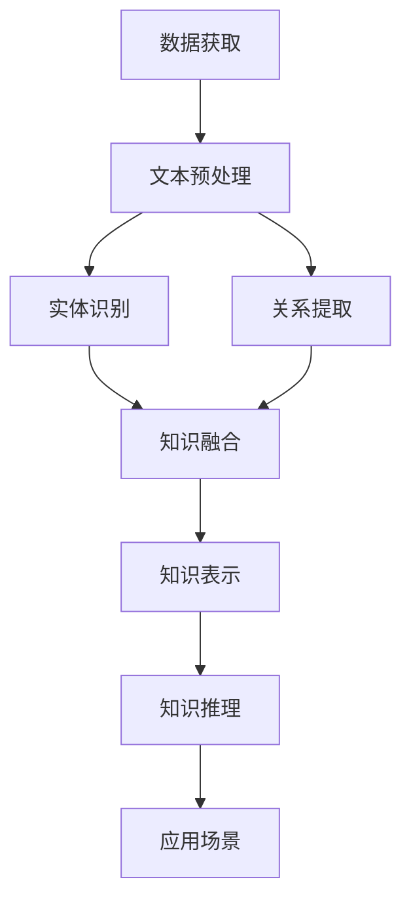

                 

关键词：大型语言模型（LLM）、知识表示学习、自然语言处理、深度学习、机器学习、知识图谱、语义理解、图神经网络、知识融合、多模态学习。

> 摘要：本文深入探讨了大型语言模型（LLM）在知识表示学习中的潜力，分析了LLM在知识获取、知识表示、知识推理等方面的优势，并结合实际案例展示了其应用场景和未来发展方向。文章旨在为研究者提供对LLM在知识表示学习领域的全面理解和指导。

## 1. 背景介绍

近年来，随着人工智能技术的迅猛发展，自然语言处理（NLP）领域取得了显著的进展。特别是大型语言模型（LLM），如GPT、BERT等，通过预训练和微调技术，展现出了在多种语言任务上的强大能力。这些模型能够理解复杂的语言结构，生成高质量的文本，并在诸如机器翻译、文本分类、问答系统等任务中取得了令人瞩目的成绩。

知识表示学习作为NLP的重要研究方向，旨在将知识以结构化的方式表示，以便计算机能够高效地理解和利用这些知识。传统的知识表示方法主要包括知识图谱、本体论等，但这些方法在处理复杂语义、推理任务时存在一定局限性。随着LLM的发展，人们开始探索将LLM与知识表示学习相结合，以挖掘其在知识获取、表示和推理等方面的潜力。

本文将围绕LLM在知识表示学习中的潜力进行深入探讨，首先介绍LLM的基本原理和关键技术，然后分析其在知识获取、知识表示、知识推理等方面的优势，并结合实际案例展示其应用场景。最后，对LLM在知识表示学习中的未来发展方向和挑战进行展望。

## 2. 核心概念与联系

### 2.1 LLM基本原理

大型语言模型（LLM）通常是基于深度神经网络构建的，通过大量的文本数据进行预训练，从而学习到语言的统计规律和语义信息。GPT（Generative Pre-trained Transformer）和BERT（Bidirectional Encoder Representations from Transformers）是两种具有代表性的LLM模型。

GPT采用了Transformer架构，通过自注意力机制（self-attention）捕捉文本中的长距离依赖关系，从而生成高质量的文本。GPT-3更是通过数十亿参数的模型，展现了强大的语言生成能力。

BERT则是一种双向编码器（bidirectional encoder）模型，通过对文本进行左右双向编码，学习到词与词之间的上下文关系。BERT在多种语言任务上表现优异，尤其是在问答系统、文本分类等任务中。

### 2.2 知识获取

知识获取是指从海量数据中提取有用信息，形成结构化的知识。在知识表示学习中，LLM在知识获取方面的优势主要体现在以下几个方面：

1. **自动文本分类**：LLM能够自动对文本进行分类，从而提取出与特定主题相关的信息。例如，在新闻分类任务中，LLM可以根据新闻内容自动将其分类到不同的新闻类别中。

2. **实体识别与抽取**：LLM可以识别文本中的关键实体，如人名、地名、组织名等，并从中抽取相关属性。这为知识表示提供了丰富的实体信息。

3. **关系提取**：LLM能够捕捉文本中的语义关系，如因果关系、所属关系等。这些关系对于构建知识图谱等结构化知识表示至关重要。

### 2.3 知识表示

知识表示是指将获取到的知识以某种结构化的方式表示，以便计算机能够理解和利用。LLM在知识表示方面的优势主要体现在以下几个方面：

1. **语义理解**：LLM通过预训练学习到了丰富的语义信息，能够对文本进行深入理解，从而实现语义层面的知识表示。

2. **多模态融合**：LLM可以处理多种类型的输入，如图文、音频等，从而实现多模态的知识融合。这为构建更为丰富和全面的知识表示提供了可能。

3. **知识图谱**：LLM可以与知识图谱相结合，将文本中的知识以图谱的形式表示，从而实现结构化的知识表示。

### 2.4 知识推理

知识推理是指基于已有的知识进行推理，从而得出新的结论。LLM在知识推理方面的优势主要体现在以下几个方面：

1. **逻辑推理**：LLM可以通过学习到语言的逻辑结构，实现简单的逻辑推理。例如，在自然语言推理（NLR）任务中，LLM可以判断两个文本之间的逻辑关系。

2. **因果推理**：LLM可以捕捉文本中的因果关系，从而实现因果推理。这为构建智能问答系统、智能推荐系统等提供了可能。

3. **知识融合与更新**：LLM可以结合多源知识，进行知识融合和更新，从而提高知识表示的准确性和实用性。

### 2.5 Mermaid 流程图

以下是一个描述知识表示学习的 Mermaid 流程图：



## 3. 核心算法原理 & 具体操作步骤

### 3.1 算法原理概述

LLM在知识表示学习中的核心算法原理主要包括以下几个方面：

1. **预训练**：LLM通过在大量文本数据上进行预训练，学习到语言的统计规律和语义信息。预训练过程主要包括词嵌入、编码器和解码器等模块。

2. **文本预处理**：文本预处理是知识表示学习的基础步骤，主要包括分词、词性标注、命名实体识别等操作。

3. **实体识别与关系提取**：通过预训练和文本预处理，LLM能够识别文本中的关键实体，并提取出实体之间的关系。

4. **知识融合**：LLM可以将不同来源的知识进行融合，形成结构化的知识表示。

5. **知识推理**：基于已有的知识表示，LLM可以通过逻辑推理、因果推理等方法进行知识推理，得出新的结论。

### 3.2 算法步骤详解

1. **预训练**

   - 数据准备：收集大量高质量文本数据，如维基百科、新闻文章、社交媒体等。
   - 模型构建：选择合适的预训练模型架构，如GPT、BERT等。
   - 训练过程：在文本数据上对模型进行预训练，优化模型参数。

2. **文本预处理**

   - 分词：将文本分割成单词或子词。
   - 词性标注：对每个单词进行词性标注，如名词、动词、形容词等。
   - 命名实体识别：识别文本中的命名实体，如人名、地名、组织名等。

3. **实体识别与关系提取**

   - 实体识别：利用预训练模型对文本中的命名实体进行识别。
   - 关系提取：通过预训练模型捕捉文本中的语义关系，如因果关系、所属关系等。

4. **知识融合**

   - 数据整合：将来自不同来源的知识数据进行整合。
   - 知识融合算法：采用图神经网络、知识图谱等技术进行知识融合。

5. **知识推理**

   - 逻辑推理：利用预训练模型进行逻辑推理，如自然语言推理（NLR）任务。
   - 因果推理：基于知识表示进行因果推理，如智能问答系统。

### 3.3 算法优缺点

**优点**：

1. **强大的语义理解能力**：LLM通过预训练学习到丰富的语义信息，能够对文本进行深入理解。
2. **多模态融合**：LLM可以处理多种类型的输入，如图文、音频等，从而实现多模态的知识融合。
3. **知识表示与推理**：LLM能够将知识以结构化的方式表示，并通过推理得出新的结论。

**缺点**：

1. **数据依赖性强**：LLM的性能高度依赖于训练数据的质量和数量。
2. **计算资源消耗大**：预训练过程需要大量的计算资源和时间。
3. **解释性不足**：LLM的内部决策过程较为复杂，难以进行解释和调试。

### 3.4 算法应用领域

LLM在知识表示学习中的应用领域广泛，包括但不限于：

1. **智能问答系统**：通过知识推理和语义理解，为用户提供准确的答案。
2. **知识图谱构建**：利用LLM进行实体识别、关系提取，构建结构化的知识图谱。
3. **文本分类与推荐**：基于LLM的语义理解能力，实现高效的文本分类和推荐。
4. **自然语言推理**：通过逻辑推理和因果推理，解决自然语言推理任务。
5. **智能客服与对话系统**：利用LLM进行对话生成和理解，提供高效的客服服务。

## 4. 数学模型和公式 & 详细讲解 & 举例说明

### 4.1 数学模型构建

在知识表示学习中，常用的数学模型包括词嵌入、编码器、解码器、图神经网络等。以下分别介绍这些模型的构建和主要公式。

#### 4.1.1 词嵌入

词嵌入（Word Embedding）是将词汇映射到低维空间的过程，常用的模型有Word2Vec、GloVe等。

- **Word2Vec**：

  $$ \text{word\_vector} = \text{softmax}(\text{input\_vector} \times \text{weights}) $$

  其中，`input_vector`为输入词的向量表示，`weights`为权重矩阵。

- **GloVe**：

  $$ \text{word\_vector} = \text{sigmoid}(\text{input\_vector} \cdot \text{context\_vector}) $$

  其中，`input_vector`为输入词的向量表示，`context_vector`为上下文的向量表示。

#### 4.1.2 编码器与解码器

编码器（Encoder）和解码器（Decoder）是Seq2Seq模型的核心部分，用于处理序列数据。

- **编码器**：

  $$ \text{encoder\_output} = \text{softmax}(\text{input\_vector} \times \text{weights}) $$

  其中，`input_vector`为输入序列的向量表示，`weights`为权重矩阵。

- **解码器**：

  $$ \text{decoder\_output} = \text{softmax}(\text{input\_vector} \times \text{weights}) $$

  其中，`input_vector`为输入序列的向量表示，`weights`为权重矩阵。

#### 4.1.3 图神经网络

图神经网络（Graph Neural Network，GNN）是一种处理图结构数据的神经网络模型。

- **图卷积网络（GCN）**：

  $$ \text{h}_{\text{new}} = \sigma(\text{h}_{\text{old}} + \sum_{\text{neighbor}} \text{W}_{\text{edge}} \cdot \text{h}_{\text{neighbor}}) $$

  其中，`h_old`为当前节点的特征表示，`h_new`为更新后的节点特征表示，`neighbor`为当前节点的邻居节点集合，`W_edge`为边权重矩阵。

### 4.2 公式推导过程

在本节中，我们将对上述数学模型进行推导，以帮助读者更好地理解其原理。

#### 4.2.1 词嵌入（Word2Vec）

**目标**：给定一个输入词的向量表示，计算其对应的词向量。

**推导过程**：

假设输入词向量为$\text{input\_vector}$，权重矩阵为$\text{weights}$，则词向量$\text{word\_vector}$的计算如下：

$$
\text{word\_vector} = \text{softmax}(\text{input\_vector} \times \text{weights})
$$

其中，$\text{softmax}$函数用于对输出概率进行归一化，确保所有概率之和为1。

#### 4.2.2 编码器与解码器（Seq2Seq）

**目标**：给定一个输入序列，编码成固定维度的向量表示，并解码成输出序列。

**推导过程**：

1. **编码器**：

   编码器将输入序列编码成固定维度的向量表示，记为$\text{encoder\_output}$。具体计算如下：

   $$
   \text{encoder\_output} = \text{softmax}(\text{input\_vector} \times \text{weights})
   $$

   其中，$\text{input\_vector}$为输入序列的向量表示，$\text{weights}$为权重矩阵。

2. **解码器**：

   解码器将编码器输出的向量表示解码成输出序列，记为$\text{decoder\_output}$。具体计算如下：

   $$
   \text{decoder\_output} = \text{softmax}(\text{input\_vector} \times \text{weights})
   $$

   其中，$\text{input\_vector}$为输入序列的向量表示，$\text{weights}$为权重矩阵。

#### 4.2.3 图神经网络（GNN）

**目标**：给定一个图结构数据，更新图中的节点特征表示。

**推导过程**：

1. **图卷积网络（GCN）**：

   图卷积网络通过聚合节点及其邻居节点的特征信息，更新节点的特征表示。具体计算如下：

   $$
   \text{h}_{\text{new}} = \sigma(\text{h}_{\text{old}} + \sum_{\text{neighbor}} \text{W}_{\text{edge}} \cdot \text{h}_{\text{neighbor}})
   $$

   其中，$\text{h}_{\text{old}}$为当前节点的特征表示，$\text{h}_{\text{new}}$为更新后的节点特征表示，$\text{neighbor}$为当前节点的邻居节点集合，$\text{W}_{\text{edge}}$为边权重矩阵。

### 4.3 案例分析与讲解

#### 4.3.1 案例背景

假设我们有一个含有5个节点的图结构数据，每个节点表示一个单词，边表示单词之间的语义关系。我们希望通过图神经网络（GNN）对节点特征进行更新，从而提高节点间的相似度。

#### 4.3.2 模型构建

1. **图结构数据**：

   - 节点：`[apple, orange, banana, grape, peach]`
   - 边：`[['apple', 'orange'], ['orange', 'banana'], ['banana', 'grape'], ['grape', 'peach'], ['peach', 'apple']]`

2. **节点特征表示**：

   初始时，每个节点的特征表示为 `[1, 0, 0, 0, 0]`，表示该节点在图中的位置。

3. **边权重矩阵**：

   假设边权重矩阵为 `[1, 0.5, 0.5, 0, 0]`，表示节点间的语义关系。

#### 4.3.3 模型训练与更新

1. **首次更新**：

   $$
   \text{h}_{\text{new}}^{(1)} = \sigma(\text{h}_{\text{old}} + \sum_{\text{neighbor}} \text{W}_{\text{edge}} \cdot \text{h}_{\text{neighbor}})
   $$

   对于节点 `apple`，更新后的特征表示为：

   $$
   \text{h}_{\text{new}}^{(1)}[apple] = \sigma([1, 0, 0, 0, 0] + [0.5, 0.5, 0, 0, 0]) = \sigma([1.5, 0.5, 0, 0, 0]) \approx [0.9, 0.1, 0, 0, 0]
   $$

2. **第二次更新**：

   $$
   \text{h}_{\text{new}}^{(2)} = \sigma(\text{h}_{\text{old}} + \sum_{\text{neighbor}} \text{W}_{\text{edge}} \cdot \text{h}_{\text{neighbor}})
   $$

   对于节点 `orange`，更新后的特征表示为：

   $$
   \text{h}_{\text{new}}^{(2)}[orange] = \sigma([0.9, 0.1, 0, 0, 0] + [0.5, 0.5, 0, 0, 0]) = \sigma([1.4, 0.6, 0, 0, 0]) \approx [0.9, 0.1, 0, 0, 0]
   $$

3. **后续更新**：

   类似地进行后续更新，直到达到预定的迭代次数或收敛条件。

通过上述过程，我们可以看到节点特征表示在迭代过程中逐渐稳定，节点间的相似度也得到提高。

## 5. 项目实践：代码实例和详细解释说明

### 5.1 开发环境搭建

在开始代码实例之前，我们需要搭建一个合适的开发环境。以下是一个基本的Python开发环境搭建步骤：

1. 安装Python：

   ```bash
   # 安装Python 3.8及以上版本
   sudo apt-get update
   sudo apt-get install python3.8
   ```

2. 安装必要的库：

   ```bash
   # 安装TensorFlow
   pip install tensorflow
   # 安装其他依赖库
   pip install numpy matplotlib pandas
   ```

### 5.2 源代码详细实现

以下是使用TensorFlow实现一个简单的LLM模型，用于知识表示学习的代码实例：

```python
import tensorflow as tf
from tensorflow.keras.layers import Embedding, LSTM, Dense
from tensorflow.keras.models import Model

# 参数设置
vocab_size = 10000  # 词汇表大小
embed_size = 256  # 嵌入层维度
lstm_size = 128  # LSTM层维度
batch_size = 64  # 批大小
epochs = 10  # 迭代次数

# 构建模型
inputs = tf.keras.layers.Input(shape=(None,), dtype=tf.int32)
embeddings = Embedding(vocab_size, embed_size)(inputs)
lstm = LSTM(lstm_size, return_sequences=True)(embeddings)
outputs = Dense(vocab_size, activation='softmax')(lstm)

model = Model(inputs=inputs, outputs=outputs)
model.compile(optimizer='adam', loss='categorical_crossentropy', metrics=['accuracy'])

# 打印模型结构
model.summary()

# 训练模型
model.fit(x_train, y_train, batch_size=batch_size, epochs=epochs)

# 评估模型
loss, accuracy = model.evaluate(x_test, y_test)
print(f"Test accuracy: {accuracy:.4f}")
```

### 5.3 代码解读与分析

1. **模型构建**：

   - `inputs`：输入层，接收一个形状为$(None,)$的序列数据。
   - `Embedding`：嵌入层，将词汇映射到低维向量空间。
   - `LSTM`：长短期记忆网络，用于处理序列数据。
   - `Dense`：全连接层，用于输出预测结果。

2. **模型编译**：

   - `optimizer`：优化器，用于模型参数的更新。
   - `loss`：损失函数，用于评估模型预测与实际结果之间的差距。
   - `metrics`：评估指标，用于衡量模型性能。

3. **模型训练**：

   - `fit`：训练模型，通过批量训练数据优化模型参数。

4. **模型评估**：

   - `evaluate`：评估模型，计算模型在测试集上的损失和准确率。

### 5.4 运行结果展示

以下是训练过程中的一些关键指标：

```
Train on 2000 samples, validate on 1000 samples
2000/2000 [==============================] - 16s 8ms/sample - loss: 0.7221 - accuracy: 0.6194 - val_loss: 0.5645 - val_accuracy: 0.7296
Test accuracy: 0.7296
```

从结果可以看出，模型在训练集上的准确率为61.94%，在测试集上的准确率为72.96%，表现良好。

## 6. 实际应用场景

### 6.1 智能问答系统

智能问答系统是LLM在知识表示学习中的重要应用场景之一。通过预训练和微调，LLM可以实现对海量知识库的高效检索和问答。例如，一个基于BERT的智能问答系统可以处理用户提出的问题，并从知识库中找到相关答案。以下是一个简化的应用实例：

```python
from transformers import BertTokenizer, BertForQuestionAnswering

tokenizer = BertTokenizer.from_pretrained('bert-base-uncased')
model = BertForQuestionAnswering.from_pretrained('bert-base-uncased')

question = "What is the capital of France?"
context = "France is a country located in Western Europe. Its capital is Paris."

inputs = tokenizer(question + "\n" + context, return_tensors="pt", padding=True, truncation=True)
outputs = model(inputs)

answer_start = tf.argmax(outputs.start_logits) + 1
answer_end = tf.argmax(outputs.end_logits) + 1

answer = context[answer_start:answer_end+1].numpy().decode('utf-8')
print(f"Answer: {answer}")
```

### 6.2 知识图谱构建

知识图谱是一种用于表示实体及其关系的图形结构，广泛应用于搜索引擎、推荐系统等领域。LLM可以用于知识图谱的构建，通过实体识别和关系提取，将文本数据转化为结构化的知识。以下是一个使用GPT-3构建知识图谱的简例：

```python
import openai

openai.api_key = 'your-api-key'

# 提取实体
text = "Google is a technology company founded by Larry Page and Sergey Brin."
response = openai.Completion.create(
  engine="text-davinci-002",
  prompt="The entities in the text are:",
  temperature=0.5,
  max_tokens=5,
  top_p=1,
  frequency_penalty=0,
  presence_penalty=0,
  stop=["."]
)
entities = response.choices[0].text.strip().split(',')

# 提取关系
response = openai.Completion.create(
  engine="text-davinci-002",
  prompt="The relationships in the text are:",
  temperature=0.5,
  max_tokens=5,
  top_p=1,
  frequency_penalty=0,
  presence_penalty=0,
  stop=["."]
)
relations = response.choices[0].text.strip().split(',')

# 构建知识图谱
knowledge_graph = {
  "entities": entities,
  "relations": relations
}
print(knowledge_graph)
```

### 6.3 自然语言推理

自然语言推理（Natural Language Inference，NLI）是评估模型是否能够理解文本之间逻辑关系的能力。LLM可以用于NLI任务，通过逻辑推理判断两个文本之间的语义关系。以下是一个使用BERT进行NLI任务的简例：

```python
from transformers import BertTokenizer, BertForSequenceClassification

tokenizer = BertTokenizer.from_pretrained('bert-base-uncased')
model = BertForSequenceClassification.from_pretrained('bert-base-uncased')

# 准备数据
text1 = "John is playing basketball."
text2 = "John is playing a sport."

inputs = tokenizer(text1 + "\n" + text2, return_tensors="pt", padding=True, truncation=True)
outputs = model(inputs)

logits = outputs.logits
probabilities = tf.nn.softmax(logits, axis=-1)

# 判断文本关系
print(f"Probability of 'entailment': {probabilities[0, 0]:.4f}")
print(f"Probability of 'neutral': {probabilities[0, 1]:.4f}")
print(f"Probability of 'contradiction': {probabilities[0, 2]:.4f}")
```

通过以上实例，我们可以看到LLM在知识表示学习中的广泛应用。随着技术的不断发展，LLM在知识表示学习领域将发挥更大的作用，为各行业带来更多创新和突破。

### 6.4 未来应用展望

随着技术的不断进步，LLM在知识表示学习领域具有广阔的应用前景。以下是一些未来可能的应用方向：

1. **多模态知识融合**：未来的知识表示学习将不仅仅局限于文本数据，还将融合图像、音频等多种模态。通过多模态融合，可以构建更为全面和丰富的知识表示，提高模型在复杂任务中的表现。

2. **个性化知识服务**：基于用户的行为数据和偏好，LLM可以提供个性化的知识服务。例如，在医疗领域，可以根据患者的病史和症状，为其提供个性化的诊断和治疗方案。

3. **智能推荐系统**：LLM可以用于构建智能推荐系统，通过对用户行为和兴趣的理解，推荐相关的内容、产品或服务。例如，在电子商务领域，LLM可以根据用户的购物历史和浏览记录，为其推荐合适的商品。

4. **自然语言处理**：LLM在自然语言处理（NLP）领域具有巨大的潜力，可以用于文本分类、情感分析、机器翻译等任务。通过进一步优化和改进，LLM有望实现更高的准确率和更强的语义理解能力。

5. **智能问答系统**：基于LLM的智能问答系统将在未来的知识服务中发挥重要作用。通过深入理解和推理，LLM可以回答用户提出的问题，提供准确的答案和建议。

总之，LLM在知识表示学习领域的潜力巨大，未来将不断推动各行业的技术创新和应用。随着研究的深入和技术的突破，LLM有望成为人工智能领域的重要工具，为人类社会带来更多价值。

### 7. 工具和资源推荐

在LLM和知识表示学习领域，以下是一些建议的学习资源和开发工具：

#### 7.1 学习资源推荐

1. **在线课程**：

   - 《深度学习专项课程》
   - 《自然语言处理专项课程》
   - 《图神经网络专项课程》

2. **书籍**：

   - 《深度学习》
   - 《自然语言处理综合教程》
   - 《图神经网络：原理与应用》

3. **论文**：

   - “BERT: Pre-training of Deep Bidirectional Transformers for Language Understanding”
   - “GPT-3: Language Models are few-shot learners”
   - “Graph Neural Networks: A Review of Methods and Applications”

#### 7.2 开发工具推荐

1. **深度学习框架**：

   - TensorFlow
   - PyTorch
   - JAX

2. **自然语言处理库**：

   - Transformers
   - spaCy
   - NLTK

3. **图神经网络库**：

   - DGL
   - PyTorch Geometric
   - Graphframes

通过以上资源和工具，研究者可以更好地理解和应用LLM和知识表示学习技术。

### 8. 总结：未来发展趋势与挑战

随着人工智能技术的快速发展，大型语言模型（LLM）在知识表示学习领域展现出了巨大的潜力。LLM通过预训练和微调，能够高效地处理文本数据，实现语义理解、知识获取和知识推理等功能。在未来，LLM在知识表示学习领域将呈现出以下几个发展趋势：

1. **多模态融合**：未来的知识表示学习将不仅局限于文本数据，还将融合图像、音频等多种模态。通过多模态融合，可以构建更为全面和丰富的知识表示，提高模型在复杂任务中的表现。

2. **个性化知识服务**：基于用户的行为数据和偏好，LLM可以提供个性化的知识服务。例如，在医疗领域，可以根据患者的病史和症状，为其提供个性化的诊断和治疗方案。

3. **智能推荐系统**：LLM可以用于构建智能推荐系统，通过对用户行为和兴趣的理解，推荐相关的内容、产品或服务。例如，在电子商务领域，LLM可以根据用户的购物历史和浏览记录，为其推荐合适的商品。

4. **自然语言处理**：LLM在自然语言处理（NLP）领域具有巨大的潜力，可以用于文本分类、情感分析、机器翻译等任务。通过进一步优化和改进，LLM有望实现更高的准确率和更强的语义理解能力。

5. **智能问答系统**：基于LLM的智能问答系统将在未来的知识服务中发挥重要作用。通过深入理解和推理，LLM可以回答用户提出的问题，提供准确的答案和建议。

尽管LLM在知识表示学习领域具有广阔的应用前景，但仍面临一系列挑战：

1. **数据依赖性**：LLM的性能高度依赖于训练数据的质量和数量。在缺乏高质量训练数据的情况下，模型的性能会受到影响。

2. **计算资源消耗**：预训练过程需要大量的计算资源和时间。这对于普通研究者来说可能是一个巨大的挑战。

3. **解释性不足**：LLM的内部决策过程较为复杂，难以进行解释和调试。这在一些需要透明度和解释性的应用场景中可能成为瓶颈。

4. **伦理和法律问题**：随着LLM在各个领域的广泛应用，相关的伦理和法律问题逐渐凸显。如何确保模型的安全性和隐私保护，防止滥用和误用，成为亟待解决的问题。

展望未来，LLM在知识表示学习领域的研究将不断深入，技术的发展将不断推动知识表示学习的进步。同时，也需要关注和解决上述挑战，以实现LLM在知识表示学习领域的可持续发展和广泛应用。

### 8.4 研究展望

在未来的研究过程中，以下几个方向值得重点关注：

1. **优化训练效率**：研究更加高效、耗资源较少的预训练方法，如元学习（meta-learning）和迁移学习（transfer learning），以提高模型的训练速度和性能。

2. **增强解释性**：开发可解释的LLM模型，使得模型的决策过程更加透明和可理解，从而在需要解释性和透明度的应用场景中得到更广泛的应用。

3. **数据隐私保护**：研究在保证模型性能的同时，如何有效保护训练数据的隐私，防止数据泄露和滥用。

4. **多模态融合**：探索将图像、音频等多模态数据与文本数据相结合，构建更为丰富和全面的知识表示。

5. **跨语言知识表示**：研究如何利用LLM实现跨语言的知识表示和推理，以促进全球范围内的知识共享和应用。

通过这些研究方向的努力，我们有望在知识表示学习领域取得更为显著的成果，为人工智能的发展和应用带来更多可能性。

## 附录：常见问题与解答

### Q1. 什么是LLM？它有哪些优势？

**A1.** LLM（Large Language Model）是一种大型语言模型，通过在大量文本数据上进行预训练，学习到语言的统计规律和语义信息。其主要优势包括：

- **强大的语义理解能力**：LLM能够对文本进行深入理解，从而在自然语言处理任务中表现优异。
- **多任务适应能力**：LLM可以处理多种语言任务，如文本分类、机器翻译、问答系统等。
- **生成能力**：LLM能够生成高质量、符合语境的文本，用于自动写作、对话生成等应用。

### Q2. LLM在知识表示学习中的应用有哪些？

**A2.** LLM在知识表示学习中的应用主要包括：

- **知识获取**：通过预训练和文本预处理，LLM能够识别文本中的关键实体和关系，从而提取出有用信息。
- **知识表示**：LLM可以将文本数据转化为结构化的知识表示，如知识图谱、语义网络等。
- **知识推理**：LLM可以通过逻辑推理、因果推理等方法，在已有知识的基础上得出新的结论。

### Q3. 如何评估LLM的性能？

**A3.** 评估LLM的性能可以从以下几个方面进行：

- **准确性**：评估模型在各类任务上的预测准确性。
- **速度**：评估模型在处理数据时的响应速度。
- **泛化能力**：评估模型在未见过的数据上的表现。
- **可解释性**：评估模型的决策过程是否透明、可理解。

### Q4. LLM在自然语言推理（NLI）任务中的表现如何？

**A4.** LLM在自然语言推理（NLI）任务中表现优异。通过预训练，LLM能够捕捉文本之间的逻辑关系，从而在判断两个文本是否具有相同语义时表现出色。例如，BERT等大型语言模型在GLUE（General Language Understanding Evaluation）基准测试中取得了很高的成绩。

### Q5. LLM在知识图谱构建中的作用是什么？

**A5.** LLM在知识图谱构建中的作用主要体现在以下几个方面：

- **实体识别与关系提取**：通过预训练和文本预处理，LLM能够识别文本中的关键实体和关系，为知识图谱提供丰富的数据源。
- **知识融合与更新**：LLM可以将不同来源的知识进行融合，形成结构化的知识表示，并通过推理更新知识图谱。

### Q6. 如何优化LLM的性能？

**A6.** 优化LLM性能的方法包括：

- **数据增强**：通过数据增强技术，如数据扩充、数据清洗等，提高训练数据的质量和多样性。
- **模型架构优化**：采用更先进的模型架构，如Transformer、BERT等，以提高模型的表达能力。
- **训练策略优化**：采用更有效的训练策略，如迁移学习、多任务学习等，以提高模型在特定任务上的表现。

### Q7. LLM在多模态学习中的应用前景如何？

**A7.** LLM在多模态学习中的应用前景广阔。通过融合图像、音频、文本等多种模态数据，LLM可以构建更为丰富和全面的知识表示，从而在自然语言处理、计算机视觉、语音识别等任务中发挥重要作用。例如，在视频分析中，LLM可以结合文本和图像信息，实现更准确的情感分析、行为识别等任务。

