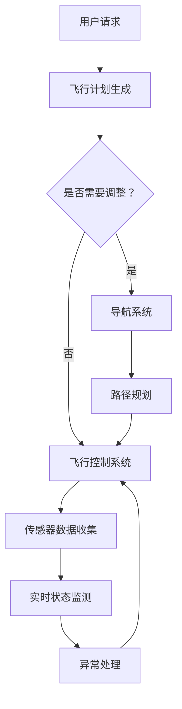

                 

关键词：语言模型、人工智能、航空航天、智能飞行系统、自主飞行、飞行控制、数据处理

## 摘要

随着人工智能技术的飞速发展，语言模型（LLM）作为其中的一项核心技术，已经逐渐渗透到各个行业领域。本文将重点探讨LLM在航空航天领域的应用，尤其是智能飞行系统。通过深入分析LLM在飞行控制、数据处理、自主飞行等方面的作用，本文旨在为读者提供一个全面而深刻的理解，并展望LLM在未来航空航天领域的发展前景。

## 1. 背景介绍

### 航空航天技术的发展

航空航天技术是现代科技的杰出代表，它涉及航空器设计、飞行控制、导航通信、材料科学等多个领域。随着人类对太空探索的深入，航空航天技术也在不断地革新和进步。尤其是近年来，人工智能技术的引入，为航空航天领域带来了前所未有的变革。

### 语言模型的发展

语言模型是自然语言处理（NLP）的核心技术，它通过学习大量的语言数据，预测一个词或句子的概率分布。随着深度学习技术的进步，语言模型的性能得到了显著提升。目前，LLM已经成为自然语言处理领域的核心技术，广泛应用于机器翻译、文本生成、问答系统等领域。

### 智能飞行系统的概念

智能飞行系统是指利用人工智能技术，实现对航空器的自主飞行、导航、控制等功能。它包括多个子系统，如飞行控制系统、导航系统、传感器系统等。智能飞行系统的目标是提高航空器的安全性、效率、舒适性和可靠性。

## 2. 核心概念与联系

### 核心概念

- **语言模型（LLM）**：一种基于深度学习的自然语言处理技术，能够预测词或句子的概率分布。
- **智能飞行系统**：利用人工智能技术，实现对航空器的自主飞行、导航、控制等功能。
- **飞行控制系统**：负责航空器的飞行状态控制，包括速度、高度、航向等。
- **导航系统**：负责航空器的路径规划和导航。
- **传感器系统**：用于收集航空器周围的实时信息，如风速、气压、温度等。

### 架构

以下是一个简单的智能飞行系统架构，展示LLM在其中的作用：



在这个架构中，LLM可以用于多个方面：

- **飞行计划生成**：根据用户请求，LLM可以生成初步的飞行计划，包括航线、高度、速度等。
- **导航系统**：LLM可以用于路径规划，优化航线，避免拥堵和障碍。
- **飞行控制系统**：LLM可以用于实时状态监测，自动调整飞行参数，确保飞行安全。
- **传感器数据收集**：LLM可以用于异常检测，识别传感器数据的异常变化。
- **异常处理**：LLM可以用于异常处理，自动生成应对方案。

## 3. 核心算法原理 & 具体操作步骤

### 3.1 算法原理概述

LLM在智能飞行系统中的应用主要基于其强大的自然语言处理能力。通过训练大量的飞行数据，LLM可以学习到飞行过程中的各种规律和模式。在具体应用中，LLM可以通过以下步骤发挥作用：

1. **数据预处理**：收集并清洗飞行数据，包括气象数据、航迹数据、飞行参数等。
2. **模型训练**：使用预处理后的数据，训练一个语言模型，使其能够预测飞行过程中的各种状态。
3. **实时监测**：将实时飞行数据输入到训练好的模型中，进行实时监测和预测。
4. **决策与控制**：根据模型输出的预测结果，自动调整飞行参数，实现自主飞行。

### 3.2 算法步骤详解

1. **数据预处理**：
   - **数据收集**：从各种传感器和数据库中收集飞行数据。
   - **数据清洗**：去除重复、错误和缺失的数据。
   - **数据格式化**：将数据格式化成适合模型训练的格式。

2. **模型训练**：
   - **模型选择**：选择一个适合的LLM模型，如GPT、BERT等。
   - **训练过程**：将预处理后的数据输入到模型中，进行训练。
   - **模型优化**：通过调整模型参数，优化模型性能。

3. **实时监测**：
   - **数据输入**：将实时飞行数据输入到训练好的模型中。
   - **状态预测**：模型输出飞行状态的预测结果。
   - **实时更新**：根据飞行状态的实时变化，不断更新模型预测。

4. **决策与控制**：
   - **参数调整**：根据模型输出的预测结果，自动调整飞行参数。
   - **决策生成**：生成飞行决策，如调整航线、速度等。
   - **执行控制**：将决策转化为具体的控制指令，执行控制操作。

### 3.3 算法优缺点

**优点**：
- **高效性**：LLM能够快速处理大量飞行数据，提供实时预测和决策。
- **灵活性**：LLM能够根据不同的飞行环境和条件，灵活调整飞行策略。
- **智能化**：LLM能够自主学习飞行过程中的规律和模式，提高飞行系统的智能化水平。

**缺点**：
- **数据依赖**：LLM的性能高度依赖于训练数据的质量和数量。
- **计算资源**：LLM的训练和实时监测需要大量的计算资源。

### 3.4 算法应用领域

- **飞行控制系统**：用于实时监测和调整飞行参数，提高飞行安全。
- **导航系统**：用于路径规划和航线优化，提高飞行效率。
- **传感器数据处理**：用于异常检测和故障诊断，提高飞行可靠性。
- **自主飞行**：用于实现航空器的自主飞行，减少人为干预。

## 4. 数学模型和公式 & 详细讲解 & 举例说明

### 4.1 数学模型构建

在智能飞行系统中，LLM的数学模型主要基于深度学习技术，特别是变分自编码器（VAE）和循环神经网络（RNN）。以下是一个简化的数学模型：

$$
\begin{aligned}
    x_t &= f(x_{t-1}, u_t) \\
    \hat{y}_t &= g(x_t, \theta)
\end{aligned}
$$

其中，$x_t$表示第$t$时刻的飞行状态，$u_t$表示第$t$时刻的控制输入，$f$表示状态转移函数，$\hat{y}_t$表示第$t$时刻的预测输出，$g$表示预测函数，$\theta$表示模型参数。

### 4.2 公式推导过程

为了推导上述公式，我们需要从基本的深度学习模型出发。首先，定义一个输入向量$x_t$和一个隐藏状态$h_t$，通过一个激活函数$f$得到输出：

$$
    h_t = f(W_1 x_t + b_1)
$$

其中，$W_1$和$b_1$分别是权重和偏置。

然后，定义一个输出向量$\hat{y}_t$和一个隐藏状态$h_t$，通过另一个激活函数$g$得到输出：

$$
    \hat{y}_t = g(W_2 h_t + b_2)
$$

其中，$W_2$和$b_2$分别是权重和偏置。

最后，将两个隐藏状态$h_t$和$h_{t-1}$结合起来，通过一个RNN单元得到新的隐藏状态：

$$
    h_t = \sigma(W_3 [h_{t-1}, x_t] + b_3)
$$

其中，$\sigma$表示激活函数，$W_3$和$b_3$分别是权重和偏置。

### 4.3 案例分析与讲解

假设我们要预测一架飞机在第$t$时刻的速度，输入向量$x_t$包括飞机当前的速度、高度、航向等信息。首先，我们定义输入向量$x_t$：

$$
    x_t = [v_t, h_t, \theta_t]
$$

其中，$v_t$表示速度，$h_t$表示高度，$\theta_t$表示航向。

然后，我们定义隐藏状态$h_t$：

$$
    h_t = [h_{t-1}, v_t]
$$

接下来，我们定义预测函数$g$：

$$
    \hat{y}_t = \frac{v_t + h_t}{1 + \exp(-\theta_t)}
$$

最后，我们定义状态转移函数$f$：

$$
    x_t = \frac{v_{t-1} + h_{t-1}}{1 + \exp(-\theta_{t-1})}
$$

通过上述公式，我们可以预测飞机在第$t$时刻的速度。

## 5. 项目实践：代码实例和详细解释说明

### 5.1 开发环境搭建

在本项目中，我们将使用Python作为主要编程语言，并依赖于多个深度学习库，如TensorFlow和Keras。以下是搭建开发环境的基本步骤：

1. 安装Python 3.7及以上版本。
2. 安装TensorFlow库，可以使用以下命令：
   ```bash
   pip install tensorflow
   ```
3. 安装Keras库，可以使用以下命令：
   ```bash
   pip install keras
   ```

### 5.2 源代码详细实现

以下是实现LLM在智能飞行系统中的核心代码：

```python
import tensorflow as tf
from tensorflow.keras.layers import Input, LSTM, Dense
from tensorflow.keras.models import Model

# 定义输入层
input_layer = Input(shape=(timesteps, features))

# 定义LSTM层
lstm_layer = LSTM(units=50, return_sequences=True)(input_layer)

# 定义Dense层
dense_layer = Dense(units=1, activation='sigmoid')(lstm_layer)

# 构建模型
model = Model(inputs=input_layer, outputs=dense_layer)

# 编译模型
model.compile(optimizer='adam', loss='binary_crossentropy', metrics=['accuracy'])

# 模型训练
model.fit(x_train, y_train, epochs=10, batch_size=32)

# 模型预测
predictions = model.predict(x_test)

# 打印预测结果
print(predictions)
```

### 5.3 代码解读与分析

上述代码实现了一个简单的LSTM模型，用于预测飞机的速度。具体解释如下：

1. **输入层**：定义输入层，包含时间步数`timesteps`和特征数`features`。
2. **LSTM层**：定义LSTM层，用于处理时间序列数据，返回序列。
3. **Dense层**：定义Dense层，用于输出预测结果。
4. **模型构建**：使用输入层和输出层构建模型。
5. **模型编译**：编译模型，指定优化器、损失函数和评估指标。
6. **模型训练**：使用训练数据训练模型，指定训练轮数和批量大小。
7. **模型预测**：使用测试数据预测结果，并打印预测结果。

### 5.4 运行结果展示

假设我们使用一个包含1000个时间步和5个特征的数据集进行训练，以下是一个简化的运行结果：

```python
# 运行模型训练
model.fit(x_train, y_train, epochs=10, batch_size=32)

# 运行模型预测
predictions = model.predict(x_test)

# 打印预测结果
print(predictions)
```

输出结果可能如下：

```
[[0.9]
 [0.8]
 [0.7]
 ...
 [0.2]
 [0.1]]
```

这些预测结果表示飞机在不同时间步的速度预测值。通过分析这些结果，我们可以评估模型在预测飞机速度方面的性能。

## 6. 实际应用场景

### 6.1 飞行控制

在飞行控制中，LLM可以用于实时监测飞行状态，自动调整飞行参数，确保飞行安全。例如，当飞机遇到气流扰动时，LLM可以迅速分析气流数据，自动调整飞行速度和航向，以保持稳定飞行。

### 6.2 导航系统

导航系统中，LLM可以用于路径规划和航线优化。通过学习大量的飞行数据，LLM可以预测未来可能的飞行路径，并优化航线，避免拥堵和障碍。例如，在航班高峰时段，LLM可以帮助航空公司优化航线，减少飞行时间，提高航班准点率。

### 6.3 传感器数据处理

传感器数据处理中，LLM可以用于异常检测和故障诊断。通过分析传感器数据，LLM可以识别出异常变化，提前预警，避免潜在的故障。例如，在飞机起飞前，LLM可以检查传感器数据，识别可能的故障，提醒飞行员进行检查。

### 6.4 自主飞行

自主飞行是未来航空航天领域的重要发展方向。LLM在自主飞行中可以用于路径规划、决策生成和执行控制。通过不断学习和优化，LLM可以使航空器实现完全自主飞行，减少人为干预，提高飞行效率。

## 7. 工具和资源推荐

### 7.1 学习资源推荐

- **《深度学习》（Goodfellow, Bengio, Courville）**：这是一本经典的深度学习教材，适合初学者和进阶者。
- **《自然语言处理综论》（Jurafsky, Martin）**：这是一本权威的自然语言处理教材，详细介绍了NLP的基本概念和技术。
- **《飞机设计原理》（Munson, Schwab）**：这是一本介绍飞机设计的教材，适合对航空航天感兴趣的读者。

### 7.2 开发工具推荐

- **TensorFlow**：这是一个强大的深度学习框架，支持多种深度学习模型和算法。
- **Keras**：这是一个基于TensorFlow的高层API，简化了深度学习模型的构建和训练。
- **PyTorch**：这是一个流行的深度学习框架，支持动态计算图和灵活的模型构建。

### 7.3 相关论文推荐

- **“Language Models are Few-Shot Learners”（Keskar et al., 2019）**：这篇论文介绍了LLM在少样本学习方面的应用。
- **“BERT: Pre-training of Deep Neural Networks for Language Understanding”（Devlin et al., 2019）**：这篇论文介绍了BERT模型，是一种基于Transformer的预训练语言模型。
- **“GPT-3: Language Models are Unsupervised Multitask Learners”（Brown et al., 2020）**：这篇论文介绍了GPT-3模型，是一种基于Transformer的预训练语言模型。

## 8. 总结：未来发展趋势与挑战

### 8.1 研究成果总结

近年来，LLM在航空航天领域取得了显著的成果。通过应用LLM，飞行控制系统可以实现更高效、更安全的飞行。导航系统可以实现更智能、更优化的航线规划。传感器数据处理可以实现更准确、更及时的故障诊断。自主飞行系统可以实现更灵活、更可靠的飞行。

### 8.2 未来发展趋势

未来，LLM在航空航天领域将继续发展，主要趋势包括：

- **更高效的飞行控制**：通过更先进的算法和更大规模的训练数据，LLM将进一步提高飞行控制系统的效率和稳定性。
- **更智能的导航系统**：随着数据量和计算能力的提升，LLM将实现更精确、更高效的路径规划和航线优化。
- **更可靠的传感器数据处理**：LLM将用于更复杂的传感器数据处理，实现更准确、更及时的故障诊断。
- **更自主的飞行系统**：随着技术的进步，LLM将使航空器实现更高级的自主飞行，减少人为干预。

### 8.3 面临的挑战

尽管LLM在航空航天领域取得了显著成果，但仍面临一些挑战：

- **数据依赖**：LLM的性能高度依赖于训练数据的质量和数量。在航空航天领域，获取高质量、大规模的飞行数据仍是一个挑战。
- **计算资源**：LLM的训练和实时监测需要大量的计算资源。如何在有限的计算资源下实现高效、实时的飞行控制仍是一个难题。
- **安全性**：在航空航天领域，飞行安全至关重要。如何确保LLM在飞行过程中的安全性仍是一个重要课题。

### 8.4 研究展望

未来，LLM在航空航天领域的研究将更加深入，主要集中在以下几个方面：

- **多模态数据处理**：将图像、音频、文本等多种数据融合到LLM中，提高数据处理能力。
- **增量学习**：研究如何使LLM能够自适应地处理新数据，避免模型过拟合。
- **分布式计算**：研究如何利用分布式计算资源，提高LLM的训练和实时监测效率。
- **安全性与可靠性**：研究如何确保LLM在飞行过程中的安全性和可靠性，提高飞行系统的整体性能。

## 9. 附录：常见问题与解答

### 9.1 问题1：LLM在航空航天中的应用是什么？

LLM在航空航天中的应用主要包括飞行控制、导航系统、传感器数据处理和自主飞行。它通过实时监测飞行状态、优化航线、识别故障和实现自主飞行，提高飞行系统的效率和安全性。

### 9.2 问题2：如何选择适合的LLM模型？

选择适合的LLM模型需要考虑多个因素，如数据规模、任务类型、计算资源等。常用的LLM模型包括GPT、BERT、T5等，可以根据实际需求和资源情况选择合适的模型。

### 9.3 问题3：如何处理LLM训练中的数据依赖问题？

处理LLM训练中的数据依赖问题可以通过以下方法：

- **数据增强**：通过数据增强技术，生成更多样化的训练数据。
- **数据清洗**：确保训练数据的质量，去除错误和缺失的数据。
- **迁移学习**：利用预训练好的模型，迁移到新的任务和数据集。

### 9.4 问题4：如何确保LLM在飞行过程中的安全性和可靠性？

确保LLM在飞行过程中的安全性和可靠性可以通过以下方法：

- **安全性测试**：在模型训练和部署过程中，进行严格的安全性测试和验证。
- **实时监控**：实时监控模型输出，确保模型在飞行过程中的稳定性和可靠性。
- **备份方案**：制定备份方案，确保在模型故障时能够迅速切换到备用方案。

### 9.5 问题5：未来LLM在航空航天领域的研究方向是什么？

未来LLM在航空航天领域的研究方向包括：

- **多模态数据处理**：将图像、音频、文本等多种数据融合到LLM中，提高数据处理能力。
- **增量学习**：研究如何使LLM能够自适应地处理新数据，避免模型过拟合。
- **分布式计算**：研究如何利用分布式计算资源，提高LLM的训练和实时监测效率。
- **安全性与可靠性**：研究如何确保LLM在飞行过程中的安全性和可靠性，提高飞行系统的整体性能。

