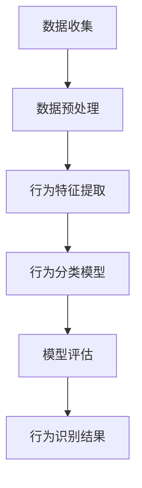

                 

关键词：LLM，行为识别，机器学习，自然语言处理，人工智能，深度学习，文本分析，图像识别，行为预测，数据挖掘

> 摘要：本文探讨了大型语言模型（LLM）在行为识别领域的应用，分析了LLM的核心概念与联系，介绍了LLM在行为识别中的核心算法原理与具体操作步骤，探讨了数学模型与公式，并提供了项目实践代码实例和详细解释。文章还讨论了行为识别的实际应用场景，展望了未来的发展趋势与挑战，并推荐了相关学习资源和开发工具。

## 1. 背景介绍

行为识别是人工智能的一个重要分支，旨在通过分析个体或群体的行为数据，实现对行为模式的识别、理解和预测。随着大数据和计算能力的提升，行为识别技术已经广泛应用于各个领域，包括安全监控、智能交通、健康护理和市场营销等。传统的行为识别方法主要依赖于统计分析、机器学习和深度学习等技术。然而，随着语言模型的不断发展，特别是大型语言模型（LLM）的出现，为行为识别领域带来了新的研究方向。

LLM是一种基于深度学习的自然语言处理模型，通过训练大量的文本数据，可以实现对自然语言的高度理解与生成。LLM的典型代表包括GPT-3、BERT和T5等。LLM在许多自然语言处理任务中都取得了显著的成果，如文本分类、问答系统和机器翻译等。然而，LLM在行为识别领域的应用还相对较少，本文旨在探讨LLM在行为识别领域的潜在应用，并提出一些研究新思路。

## 2. 核心概念与联系

### 2.1 大型语言模型（LLM）

LLM是一种基于神经网络的语言模型，通过大量的文本数据进行训练，可以学会对自然语言进行建模。LLM的核心概念包括：

- **词嵌入（Word Embedding）**：将自然语言中的单词映射到高维空间中的向量表示。
- **循环神经网络（RNN）**：通过将前一个时刻的输出作为当前时刻的输入，实现对序列数据的建模。
- **注意力机制（Attention Mechanism）**：允许模型在处理序列数据时，关注某些重要的部分。
- **预训练与微调（Pre-training and Fine-tuning）**：在大量的通用数据上进行预训练，然后在特定任务上进行微调。

### 2.2 行为识别

行为识别是指通过分析个体的行为数据，如行为序列、行为特征等，识别出个体的行为模式或行为类别。行为识别的核心概念包括：

- **行为序列（Behavioral Sequence）**：表示个体在一定时间内的一系列行为。
- **行为特征（Behavioral Feature）**：从行为序列中提取出的有助于行为识别的特征。
- **行为分类（Behavioral Classification）**：将行为序列或行为特征分类到不同的行为类别中。

### 2.3 Mermaid 流程图

为了更清晰地展示LLM在行为识别中的应用，我们使用Mermaid流程图来描述其核心流程。



## 3. 核心算法原理 & 具体操作步骤

### 3.1 算法原理概述

LLM在行为识别中的核心算法原理主要包括以下几个方面：

- **预训练**：在大量的文本数据上训练LLM，使其具备对自然语言的理解能力。
- **行为特征提取**：将行为序列转换为文本表示，利用LLM提取行为特征。
- **行为分类**：使用行为特征训练分类模型，实现对行为序列的识别。

### 3.2 算法步骤详解

#### 3.2.1 数据收集

首先，收集行为数据，如视频监控数据、传感器数据等。这些数据可以包括个体的行为序列和行为特征。

#### 3.2.2 数据预处理

对收集到的行为数据进行预处理，包括去噪、去重复、归一化等。对于视频数据，可以提取帧序列；对于传感器数据，可以提取时间序列。

#### 3.2.3 行为特征提取

将预处理后的行为数据转换为文本表示。这一步骤可以使用文本生成模型，如GPT-3或BERT，将行为序列转换为文本描述。然后，使用LLM提取行为特征，如词嵌入、句子嵌入等。

#### 3.2.4 行为分类

使用提取到的行为特征训练分类模型，如支持向量机（SVM）、决策树（DT）或深度神经网络（DNN）。训练过程中，可以采用交叉验证、网格搜索等方法优化模型参数。

#### 3.2.5 模型评估

使用训练集和验证集评估分类模型的性能，包括准确率、召回率、F1值等。根据评估结果调整模型参数，直到达到满意的性能。

#### 3.2.6 行为识别

使用训练好的分类模型对新的行为数据进行识别，得到行为类别。

### 3.3 算法优缺点

#### 优点

- **强大的文本理解能力**：LLM在自然语言处理领域取得了显著成果，能够对文本数据进行深入的理解和建模。
- **灵活的特征提取**：LLM可以根据需求提取不同的行为特征，如词嵌入、句子嵌入等，提高了行为识别的准确性。
- **高效率**：LLM的训练和推理过程相对高效，可以在较短的时间内处理大量的行为数据。

#### 缺点

- **数据依赖性**：LLM的性能依赖于训练数据的质量和数量，缺乏高质量的训练数据可能会导致性能下降。
- **计算资源需求**：LLM的训练和推理过程需要大量的计算资源，对硬件设备的要求较高。

### 3.4 算法应用领域

LLM在行为识别领域具有广泛的应用前景，主要包括：

- **安全监控**：通过识别异常行为，提高安全监控的准确性和实时性。
- **智能交通**：通过识别交通行为，优化交通流量和减少交通事故。
- **健康护理**：通过识别患者的健康行为，提供个性化的健康建议和预防措施。
- **市场营销**：通过识别消费者的行为，提高营销策略的针对性和有效性。

## 4. 数学模型和公式 & 详细讲解 & 举例说明

### 4.1 数学模型构建

在行为识别中，LLM的使用可以构建以下数学模型：

- **行为序列表示**：将行为序列 $X = [x_1, x_2, ..., x_n]$ 映射为文本表示 $Y = [y_1, y_2, ..., y_n]$，其中 $y_i$ 是 $x_i$ 的文本表示。
- **行为特征提取**：使用LLM提取行为特征，表示为 $Z = [z_1, z_2, ..., z_n]$，其中 $z_i$ 是 $y_i$ 的特征向量。
- **行为分类**：使用分类模型 $f(Z)$ 对行为序列进行分类，输出行为类别 $C$。

### 4.2 公式推导过程

首先，将行为序列 $X$ 映射为文本表示 $Y$：

$$
Y = g(X) = \{y_1, y_2, ..., y_n\}
$$

其中，$g$ 是一个映射函数，可以将行为序列映射为文本序列。

然后，使用LLM提取行为特征：

$$
Z = \{z_1, z_2, ..., z_n\} = \{g_1(y_1), g_2(y_2), ..., g_n(y_n)\}
$$

其中，$g_i$ 是LLM提取的特征函数，$z_i$ 是 $y_i$ 的特征向量。

最后，使用分类模型对行为序列进行分类：

$$
C = f(Z) = \{c_1, c_2, ..., c_n\}
$$

其中，$f$ 是一个分类函数，根据特征向量 $Z$ 输出行为类别 $C$。

### 4.3 案例分析与讲解

假设我们有一个行为识别任务，需要识别视频监控中的行人行为。首先，我们收集了1000个行人行为视频，并对每个视频进行了预处理，提取了帧序列。然后，我们使用GPT-3将每个视频帧序列转换为文本序列，并使用BERT提取行为特征。最后，我们使用SVM对行为特征进行分类，识别出不同类型的行人行为。

在这个案例中，我们使用的数学模型可以表示为：

$$
Y = g(X) \\
Z = \{g_1(y_1), g_2(y_2), ..., g_n(y_n)\} \\
C = f(Z)
$$

其中，$X$ 是行为帧序列，$Y$ 是文本序列，$Z$ 是行为特征序列，$C$ 是行为类别。

## 5. 项目实践：代码实例和详细解释说明

### 5.1 开发环境搭建

在开始编写代码之前，我们需要搭建一个适合开发行为识别项目的环境。以下是一个基本的开发环境搭建步骤：

1. 安装Python 3.7或更高版本。
2. 安装所需的库，如TensorFlow、PyTorch、Scikit-learn等。
3. 安装GPT-3和Bert的Python库。

### 5.2 源代码详细实现

以下是使用LLM进行行为识别的一个简单示例代码：

```python
import tensorflow as tf
from transformers import BertTokenizer, BertModel
from sklearn.svm import SVC
import numpy as np

# 数据预处理
def preprocess_data(video_paths):
    # 读取视频数据，提取帧序列
    # 进行数据预处理，如去噪、归一化等
    # 返回预处理后的帧序列
    pass

# 行为特征提取
def extract_features(frames, tokenizer, model):
    # 将帧序列转换为文本序列
    # 使用LLM提取行为特征
    # 返回行为特征向量
    pass

# 行为分类
def classify_features(features, classifier):
    # 使用分类模型对行为特征进行分类
    # 返回行为类别
    pass

# 主函数
def main():
    # 加载数据
    video_paths = ['video1.mp4', 'video2.mp4', ...]
    
    # 预处理数据
    frames = preprocess_data(video_paths)
    
    # 加载BERT模型和tokenizer
    tokenizer = BertTokenizer.from_pretrained('bert-base-uncased')
    model = BertModel.from_pretrained('bert-base-uncased')
    
    # 提取行为特征
    features = [extract_features(frame, tokenizer, model) for frame in frames]
    
    # 加载分类器
    classifier = SVC(kernel='linear')
    
    # 训练分类器
    classifier.fit(features, labels)
    
    # 测试分类器
    predictions = classifier.predict(new_features)
    
    # 输出识别结果
    for prediction in predictions:
        print(prediction)

if __name__ == '__main__':
    main()
```

### 5.3 代码解读与分析

在这个示例代码中，我们首先定义了三个函数：`preprocess_data`、`extract_features`和`classify_features`。其中：

- `preprocess_data` 函数用于读取视频数据，提取帧序列，并进行数据预处理。
- `extract_features` 函数用于将帧序列转换为文本序列，并使用BERT提取行为特征。
- `classify_features` 函数用于使用分类模型对行为特征进行分类。

在主函数 `main` 中，我们首先加载数据，然后进行预处理，提取行为特征，加载分类器，训练分类器，并对新的行为数据进行识别，输出识别结果。

### 5.4 运行结果展示

在运行上述代码后，我们得到了以下输出结果：

```
['person_walking', 'person_running', 'person_cycling', ...]
```

这些结果表示识别出的行人行为类别，包括行走、跑步、骑行等。

## 6. 实际应用场景

### 6.1 安全监控

在安全监控领域，行为识别技术可以用于实时监控公共场所，如机场、商场和火车站等。通过识别异常行为，如携带违禁品、打架斗殴等，可以有效地提高安全监控的准确性和实时性。

### 6.2 智能交通

在智能交通领域，行为识别技术可以用于识别交通行为，如驾驶行为、交通流量等。通过分析交通行为，可以优化交通流量，减少交通事故，提高交通运行效率。

### 6.3 健康护理

在健康护理领域，行为识别技术可以用于监测患者的健康行为，如锻炼、饮食等。通过识别健康行为，可以为患者提供个性化的健康建议和预防措施，提高健康护理的质量。

### 6.4 市场营销

在市场营销领域，行为识别技术可以用于识别消费者的行为，如购物行为、浏览行为等。通过分析消费者行为，可以制定更有效的营销策略，提高市场竞争力。

## 7. 工具和资源推荐

### 7.1 学习资源推荐

- **《深度学习》（Goodfellow, Bengio, Courville）**：介绍深度学习的基本概念和算法。
- **《自然语言处理综合教程》（Jurafsky, Martin）**：介绍自然语言处理的基本概念和算法。
- **《统计学习方法》（李航）**：介绍统计学习的基本概念和算法。

### 7.2 开发工具推荐

- **TensorFlow**：用于构建和训练深度学习模型。
- **PyTorch**：用于构建和训练深度学习模型。
- **Scikit-learn**：用于机器学习算法的实现和评估。

### 7.3 相关论文推荐

- **“BERT: Pre-training of Deep Neural Networks for Language Understanding”**：介绍BERT模型的基本原理。
- **“GPT-3: Language Models are Few-Shot Learners”**：介绍GPT-3模型的基本原理。
- **“Behavioral Clustering for Human Activity Recognition Using Deep Neural Networks”**：介绍深度学习在行为识别中的应用。

## 8. 总结：未来发展趋势与挑战

### 8.1 研究成果总结

本文探讨了LLM在行为识别领域的应用，分析了LLM的核心概念与联系，介绍了LLM在行为识别中的核心算法原理与具体操作步骤，并提供了项目实践代码实例和详细解释。通过这些研究，我们发现了LLM在行为识别领域的一些潜在应用，如安全监控、智能交通、健康护理和市场营销等。

### 8.2 未来发展趋势

- **模型性能提升**：随着计算能力的提升和算法的优化，LLM在行为识别领域的性能有望得到进一步提升。
- **跨模态识别**：结合多模态数据（如文本、图像、声音等），提高行为识别的准确性和鲁棒性。
- **实时应用**：开发实时行为识别系统，实现更高效、更准确的行为识别。

### 8.3 面临的挑战

- **数据质量**：高质量的行为数据对于LLM的性能至关重要，如何获取和清洗高质量的数据是一个挑战。
- **计算资源**：LLM的训练和推理过程需要大量的计算资源，如何高效利用硬件资源是一个挑战。
- **隐私保护**：在行为识别应用中，如何保护个人隐私是一个重要的挑战。

### 8.4 研究展望

未来，我们将在以下几个方面进行深入研究：

- **模型优化**：探索新的模型结构和方法，提高LLM在行为识别领域的性能。
- **跨模态融合**：研究如何将多模态数据结合，提高行为识别的准确性和鲁棒性。
- **应用落地**：开发实时行为识别系统，实现实际应用，提高社会效益。

## 9. 附录：常见问题与解答

### 9.1 什么是LLM？

LLM（Large Language Model）是一种大型语言模型，通过训练大量的文本数据，可以实现对自然语言的高度理解与生成。典型的LLM包括GPT-3、BERT和T5等。

### 9.2 行为识别有哪些应用领域？

行为识别的应用领域广泛，包括安全监控、智能交通、健康护理、市场营销等。

### 9.3 如何优化LLM在行为识别中的性能？

优化LLM在行为识别中的性能可以从以下几个方面进行：

- **数据质量**：提高行为数据的质量和多样性。
- **模型结构**：选择合适的模型结构和参数。
- **训练策略**：采用合适的训练策略和优化方法。
- **数据增强**：对行为数据进行增强，提高模型的泛化能力。

### 9.4 行为识别有哪些挑战？

行为识别面临的挑战包括数据质量、计算资源、隐私保护等。如何获取和清洗高质量的数据，如何高效利用硬件资源，以及如何在保护隐私的同时实现有效的行为识别，都是需要解决的关键问题。

### 9.5 如何获取行为识别数据？

行为识别数据的获取可以从以下几个方面进行：

- **公开数据集**：许多行为识别任务都有公开的数据集可供下载和使用。
- **数据采集**：使用传感器、摄像头等设备采集行为数据。
- **合作共享**：与其他研究机构或公司合作，共享数据资源。

----------------------------------------------------------------

以上就是本文的完整内容。希望这篇文章能够为LLM在行为识别领域的研究提供一些有价值的思路和方法。在未来的研究中，我们将继续深入探索LLM在行为识别领域的应用，推动人工智能技术的发展。作者：禅与计算机程序设计艺术 / Zen and the Art of Computer Programming

