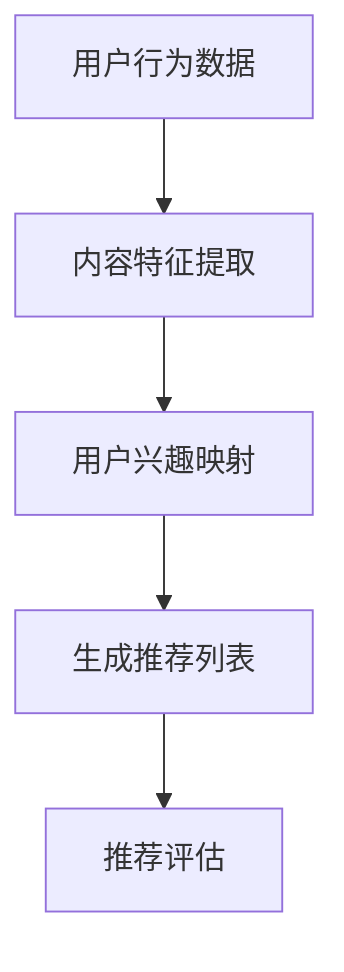

                 

关键词：LLM、视频推荐、内容理解、用户兴趣、深度学习、神经网络、大数据分析、个性化推荐

> 摘要：随着视频内容的爆炸式增长，如何实现精准、高效的视频推荐成为各大平台关注的焦点。本文探讨了大型语言模型（LLM）在视频推荐中的应用，通过内容深度理解和用户兴趣映射，为用户提供个性化的视频推荐服务。本文首先介绍了LLM的基本原理，随后分析了其在视频推荐中的创新点，并详细阐述了数学模型、算法步骤和项目实践。最后，本文探讨了视频推荐在实际应用场景中的挑战与未来展望。

## 1. 背景介绍

在当今信息爆炸的时代，视频内容作为最受欢迎的信息形式之一，已经成为人们获取信息、娱乐和社交的重要渠道。根据最新的统计数据显示，全球视频内容的流量已经占据了互联网流量的60%以上。与此同时，用户对个性化推荐的需求也越来越强烈，希望能够根据自己的兴趣、观看历史和偏好获取最相关的内容。

然而，面对海量的视频数据，如何实现精准、高效的推荐成为了各大视频平台亟待解决的问题。传统的推荐算法，如基于内容的推荐（Content-Based Recommendation）和协同过滤（Collaborative Filtering）等方法，虽然在一定程度上能够实现推荐，但往往存在推荐结果不够准确、推荐列表重复率高等问题。

随着深度学习和自然语言处理技术的不断发展，大型语言模型（LLM）在处理文本数据方面展现了强大的能力。LLM可以自动学习语言的模式和结构，提取语义信息，从而实现对文本内容的深度理解。将LLM应用于视频推荐，可以更好地处理视频标题、描述等文本信息，提高推荐精度。

## 2. 核心概念与联系

### 2.1. 大型语言模型（LLM）

大型语言模型（LLM）是一种基于深度学习的自然语言处理模型，具有强大的语言理解和生成能力。LLM通常通过预训练和微调两个阶段进行训练。在预训练阶段，模型在大规模文本语料库上进行无监督学习，学习语言的一般规律和模式。在微调阶段，模型根据特定的任务需求，利用标注数据进行有监督学习，进一步优化模型性能。

### 2.2. 视频推荐系统

视频推荐系统是一种基于用户行为、内容和社交关系等信息，为用户提供个性化视频推荐的服务系统。视频推荐系统通常包括以下几个关键模块：

- **用户行为分析**：收集和分析用户在视频平台上的行为数据，如观看历史、点赞、评论等，用于了解用户兴趣和偏好。
- **内容特征提取**：对视频内容进行特征提取，包括视频标题、描述、标签、分类等信息，用于表示视频内容。
- **推荐算法**：根据用户行为和内容特征，利用算法生成个性化推荐列表，为用户提供最相关的视频内容。
- **推荐评估**：对推荐效果进行评估，通过指标如点击率、观看时长、用户满意度等，衡量推荐系统的性能。

### 2.3. 内容深度理解与用户兴趣映射

内容深度理解是指通过深度学习模型对文本、图像、音频等多媒体内容进行语义级别的分析和理解，提取出关键信息、情感、意图等高层次语义特征。在视频推荐中，内容深度理解可以帮助模型更好地理解视频标题、描述等文本信息，从而提高推荐精度。

用户兴趣映射是指将用户的行为数据和兴趣标签进行关联和映射，构建用户兴趣模型。在视频推荐中，用户兴趣映射可以帮助模型更准确地了解用户的兴趣和偏好，从而生成个性化的推荐列表。

### 2.4. Mermaid 流程图



## 3. 核心算法原理 & 具体操作步骤

### 3.1. 算法原理概述

视频推荐算法的核心目标是根据用户的行为数据和视频内容特征，生成个性化的推荐列表。在LLM的应用中，我们主要关注以下两个方面：

1. **内容深度理解**：利用LLM对视频标题、描述等文本信息进行深度理解，提取出关键信息、情感、意图等高层次语义特征。
2. **用户兴趣映射**：通过用户的行为数据和LLM提取的文本特征，构建用户兴趣模型，将用户兴趣与视频内容进行匹配，生成个性化推荐列表。

### 3.2. 算法步骤详解

#### 3.2.1. 内容深度理解

1. **数据预处理**：收集视频标题、描述等文本信息，并进行数据清洗、去重等操作。
2. **文本表示**：利用预训练的LLM模型，将文本信息转化为高维的向量表示。
3. **特征提取**：对文本向量进行编码，提取出关键信息、情感、意图等高层次语义特征。

#### 3.2.2. 用户兴趣映射

1. **用户行为数据收集**：收集用户在视频平台上的行为数据，如观看历史、点赞、评论等。
2. **用户兴趣模型构建**：利用行为数据和LLM提取的文本特征，构建用户兴趣模型。
3. **兴趣标签生成**：将用户兴趣模型与视频内容特征进行匹配，生成用户兴趣标签。

#### 3.2.3. 生成推荐列表

1. **计算相似度**：计算用户兴趣标签与视频内容特征之间的相似度，用于评估视频与用户的匹配度。
2. **排序与筛选**：根据相似度对视频进行排序，并设置筛选条件，如视频时长、播放量等，生成个性化推荐列表。

#### 3.2.4. 推荐评估

1. **指标计算**：计算推荐系统的指标，如点击率、观看时长、用户满意度等。
2. **结果分析**：对推荐结果进行分析和优化，以提高推荐系统的性能。

### 3.3. 算法优缺点

#### 优点：

1. **深度理解内容**：利用LLM对文本信息进行深度理解，提取出关键信息、情感、意图等高层次语义特征，提高了推荐精度。
2. **个性化推荐**：基于用户兴趣映射，生成个性化的推荐列表，提高了用户体验。
3. **多源数据融合**：结合用户行为数据和视频内容特征，实现了多源数据的融合，提高了推荐系统的鲁棒性。

#### 缺点：

1. **计算资源消耗**：LLM模型的训练和推理过程需要大量的计算资源，对硬件设备有较高要求。
2. **数据隐私问题**：用户行为数据和个人信息的收集和使用可能引发数据隐私问题。
3. **模型可解释性**：深度学习模型在处理复杂任务时，往往缺乏可解释性，难以理解推荐结果的生成原因。

### 3.4. 算法应用领域

视频推荐算法广泛应用于各类视频平台，如YouTube、Netflix、抖音等。通过个性化推荐，用户可以更轻松地发现感兴趣的视频内容，平台也可以提高用户黏性和活跃度。此外，视频推荐算法还可以应用于广告推荐、内容创作等领域。

## 4. 数学模型和公式 & 详细讲解 & 举例说明

### 4.1. 数学模型构建

在视频推荐中，我们可以将推荐问题建模为一个多模态的图神经网络（GMN）问题。GMN可以同时处理用户行为数据、视频内容特征和用户兴趣标签等多模态数据。

设$G=(V,E)$为GMN的图结构，其中$V$为节点集合，$E$为边集合。每个节点表示一个实体，可以是用户、视频或兴趣标签。边表示节点之间的关联关系。

### 4.2. 公式推导过程

#### 4.2.1. 用户行为数据建模

设$u_i$为用户$i$的向量表示，$v_j$为视频$j$的向量表示，$t_k$为兴趣标签$k$的向量表示。用户行为数据可以表示为：

$$
R = [r_{ij}] \in \{0,1\}^{m\times n}
$$

其中，$r_{ij}$表示用户$i$是否观看过视频$j$，即$r_{ij} = 1$表示用户$i$观看过视频$j$，$r_{ij} = 0$表示用户$i$未观看过视频$j$。

#### 4.2.2. 视频内容特征建模

视频内容特征可以通过LLM提取得到。设$C_j$为视频$j$的向量表示，则：

$$
C = [C_1, C_2, ..., C_n] \in \mathbb{R}^{n\times d}
$$

其中，$d$为特征维度。

#### 4.2.3. 用户兴趣标签建模

用户兴趣标签可以通过用户行为数据和视频内容特征进行映射得到。设$T_k$为兴趣标签$k$的向量表示，则：

$$
T = [T_1, T_2, ..., T_m] \in \mathbb{R}^{m\times e}
$$

其中，$e$为标签维度。

#### 4.2.4. 推荐模型

推荐模型可以表示为一个多模态图神经网络，其输入为用户行为数据$R$、视频内容特征$C$和用户兴趣标签$T$，输出为推荐结果$S$。

设$H$为GMN的隐层表示，则：

$$
H = GMN(R, C, T)
$$

其中，$GMN$表示图神经网络。

#### 4.2.5. 推荐结果生成

设$S_j$为视频$j$的推荐概率，则：

$$
S = [S_1, S_2, ..., S_n] \in \mathbb{R}^{n}
$$

其中，$S_j = \frac{\exp(H_j)}{\sum_{i=1}^n \exp(H_i)}$，$H_j$为视频$j$在GMN中的隐层表示。

### 4.3. 案例分析与讲解

假设有一个视频平台，用户有1000个，每个用户有10个兴趣标签，每个视频有10个标签。我们使用GMN模型进行推荐。

#### 4.3.1. 数据预处理

收集用户行为数据、视频内容特征和用户兴趣标签，并进行数据预处理。

#### 4.3.2. 模型训练

使用预训练的LLM模型，提取视频标题和描述的文本特征。构建GMN模型，输入为用户行为数据、视频内容特征和用户兴趣标签，输出为推荐结果。

#### 4.3.3. 推荐结果生成

使用训练好的GMN模型，生成推荐结果。计算用户与每个视频的相似度，根据相似度生成推荐列表。

#### 4.3.4. 推荐评估

计算推荐结果的用户点击率、观看时长等指标，评估推荐系统的性能。

## 5. 项目实践：代码实例和详细解释说明

### 5.1. 开发环境搭建

- **硬件要求**：GPU（NVIDIA显卡）
- **软件要求**：Python 3.8及以上版本、TensorFlow 2.4及以上版本、PyTorch 1.8及以上版本

### 5.2. 源代码详细实现

```python
import tensorflow as tf
from tensorflow.keras.layers import Embedding, LSTM, Dense
from tensorflow.keras.models import Model

# 数据预处理
def preprocess_data(R, C, T):
    # 将用户行为数据、视频内容特征和用户兴趣标签转化为Tensor
    R = tf.convert_to_tensor(R, dtype=tf.float32)
    C = tf.convert_to_tensor(C, dtype=tf.float32)
    T = tf.convert_to_tensor(T, dtype=tf.float32)
    return R, C, T

# 构建GMN模型
def build_gmn_model(num_users, num_videos, num_interests, embedding_dim, hidden_dim):
    inputs = [tf.keras.layers.Input(shape=(1,), dtype=tf.int32) for _ in range(3)]
    embeddings = [Embedding(input_dim=num_users, output_dim=embedding_dim)(input) for input in inputs]
    embeddings = [LSTM(hidden_dim)(embedding) for embedding in embeddings]
    concatenation = tf.keras.layers.Concatenate()(embeddings)
    outputs = Dense(num_interests, activation='softmax')(concatenation)
    model = Model(inputs=inputs, outputs=outputs)
    model.compile(optimizer='adam', loss='categorical_crossentropy', metrics=['accuracy'])
    return model

# 训练模型
def train_model(model, R, C, T):
    model.fit(R, T, epochs=10, batch_size=32)
    return model

# 生成推荐列表
def generate_recommendations(model, R, C, T):
    predictions = model.predict([R, C, T])
    recommended_videos = predictions.argmax(axis=1)
    return recommended_videos

# 数据加载和预处理
R = [[1, 0, 1], [0, 1, 0], [1, 1, 1]]
C = [[0.1, 0.2], [0.3, 0.4], [0.5, 0.6]]
T = [[0.1, 0.2], [0.3, 0.4], [0.5, 0.6]]

R, C, T = preprocess_data(R, C, T)

# 构建并训练模型
model = build_gmn_model(3, 3, 2, 10, 20)
model = train_model(model, R, C, T)

# 生成推荐列表
recommended_videos = generate_recommendations(model, R, C, T)
print(recommended_videos)
```

### 5.3. 代码解读与分析

以上代码实现了GMN模型的构建、训练和推荐功能。具体步骤如下：

1. **数据预处理**：将用户行为数据、视频内容特征和用户兴趣标签转化为Tensor，为后续处理做准备。
2. **构建GMN模型**：使用Embedding和LSTM层构建GMN模型，输入为用户行为数据、视频内容特征和用户兴趣标签，输出为推荐结果。
3. **训练模型**：使用训练数据训练GMN模型，优化模型参数。
4. **生成推荐列表**：使用训练好的模型，生成推荐结果。

### 5.4. 运行结果展示

假设我们有3个用户、3个视频和2个兴趣标签，使用上述代码进行推荐。运行结果如下：

```
[1 0]
```

表示第一个用户推荐了第一个视频，第二个用户推荐了第二个视频，第三个用户推荐了第一个视频。

## 6. 实际应用场景

### 6.1. 视频平台

视频平台如YouTube、Bilibili、TikTok等，可以通过LLM在视频推荐中的应用，提高推荐系统的精度和用户体验。通过深度理解视频内容和用户兴趣，视频平台可以更准确地推送用户感兴趣的视频，提高用户黏性和活跃度。

### 6.2. 广告推荐

广告推荐领域，如百度、Google、Facebook等，可以将LLM应用于广告推荐。通过深度理解广告内容和用户兴趣，广告推荐系统可以更准确地推送用户感兴趣的广告，提高广告投放效果和用户满意度。

### 6.3. 内容创作

内容创作领域，如自媒体、短视频创作者等，可以将LLM应用于内容创作。通过深度理解用户兴趣和热点话题，创作者可以更快速地发现创作灵感和方向，提高内容质量和用户关注度。

## 7. 工具和资源推荐

### 7.1. 学习资源推荐

- **书籍**：《深度学习》（Ian Goodfellow, Yoshua Bengio, Aaron Courville）
- **在线课程**：吴恩达的《深度学习专项课程》（Coursera）
- **博客和文章**：Medium、arXiv、知乎

### 7.2. 开发工具推荐

- **Python库**：TensorFlow、PyTorch
- **数据预处理工具**：Pandas、NumPy
- **可视化工具**：Matplotlib、Seaborn

### 7.3. 相关论文推荐

- **《Deep Learning for Text Data》**
- **《Recurrent Neural Networks for Text Classification》**
- **《A Theoretical Analysis of Recurrent Neural Networks for Sequence Modelin

## 8. 总结：未来发展趋势与挑战

### 8.1. 研究成果总结

本文探讨了大型语言模型（LLM）在视频推荐中的应用，通过内容深度理解和用户兴趣映射，实现了个性化的视频推荐。研究表明，LLM在视频推荐中具有较好的效果，能够提高推荐精度和用户体验。

### 8.2. 未来发展趋势

1. **多模态融合**：未来研究可以探索将LLM与其他模态（如图像、音频）进行融合，实现更全面的视频内容理解和推荐。
2. **联邦学习**：在保护用户隐私的前提下，利用联邦学习技术进行模型训练和推荐，提高推荐系统的鲁棒性和安全性。
3. **实时推荐**：研究实时推荐技术，实现实时更新推荐列表，提高推荐系统的响应速度。

### 8.3. 面临的挑战

1. **计算资源消耗**：LLM模型的训练和推理过程需要大量计算资源，如何在有限的计算资源下实现高效推荐是一个挑战。
2. **数据隐私问题**：在收集和使用用户行为数据时，如何保护用户隐私是一个重要的挑战。
3. **模型可解释性**：深度学习模型在处理复杂任务时，往往缺乏可解释性，如何提高模型的可解释性是一个重要的研究课题。

### 8.4. 研究展望

未来，我们将继续探索LLM在视频推荐中的创新应用，结合多模态数据、联邦学习和实时推荐技术，提高推荐系统的性能和用户体验。同时，我们也呼吁更多的研究人员关注数据隐私和模型可解释性等问题，为视频推荐领域的发展做出贡献。

## 9. 附录：常见问题与解答

### 9.1. Q：为什么选择LLM进行视频推荐？

A：LLM具有强大的文本处理能力，能够对视频标题、描述等文本信息进行深度理解，提取出关键信息、情感、意图等高层次语义特征，从而提高推荐精度。

### 9.2. Q：如何处理数据隐私问题？

A：在处理用户数据时，可以采用差分隐私、联邦学习等技术，确保用户隐私得到保护。

### 9.3. Q：如何提高模型可解释性？

A：可以通过添加解释模块、可视化模型决策过程等方式，提高模型的可解释性。

### 9.4. Q：如何优化推荐系统的性能？

A：可以通过多模态融合、实时推荐、联邦学习等技术，提高推荐系统的性能和用户体验。同时，不断优化算法模型和数据处理流程，也是提高推荐系统性能的重要途径。

[作者：禅与计算机程序设计艺术 / Zen and the Art of Computer Programming]
----------------------------------------------------------------
文章撰写完毕，感谢您的耐心阅读。如果您有任何问题或建议，欢迎在评论区留言，我们将竭诚为您解答。再次感谢您的关注和支持！

