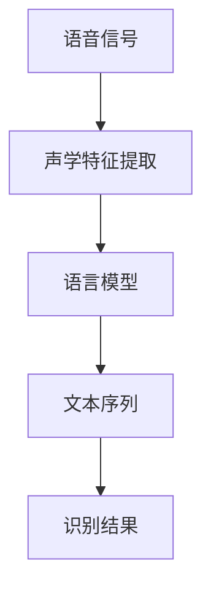

                 

关键词：语言模型、语音识别、深度学习、自动语音识别、技术突破

> 摘要：本文将探讨近年来语言模型（LLM）在语音识别领域的显著技术突破。通过详细分析LLM的原理、算法、数学模型以及实际应用，我们将深入了解这一技术在语音识别领域的广泛应用和未来发展趋势。

## 1. 背景介绍

语音识别技术作为人工智能领域的一个重要分支，旨在将人类语音转换为机器可理解的信息。自20世纪50年代以来，语音识别技术经历了多个发展阶段。早期的语音识别主要基于有限状态机和隐马尔可夫模型（HMM），这些方法在特定环境下表现良好，但在复杂多变的环境中受到很大限制。随着深度学习技术的兴起，语音识别领域迎来了新的突破。

语言模型（LLM）作为一种先进的深度学习模型，已经在自然语言处理（NLP）领域取得了显著成果。LLM通过学习大量文本数据，能够捕捉语言中的统计规律和语义信息，从而在语音识别中发挥重要作用。近年来，随着计算能力的提升和海量数据集的积累，LLM在语音识别领域的技术突破成为可能。

## 2. 核心概念与联系

### 2.1 语言模型（LLM）的基本原理

语言模型是一种用于预测文本序列的概率分布的模型。LLM通过学习大规模语料库中的语言规律，建立概率模型，从而实现文本序列的生成和分类。LLM的核心思想是利用深度神经网络（DNN）或变换器（Transformer）来捕捉文本中的复杂模式。

### 2.2 语言模型与语音识别的关系

语音识别的过程可以看作是将语音信号转换为文本序列的过程。语言模型在这一过程中起到了关键作用。具体来说，LLM能够将语音信号中的声学特征转换为文本的概率分布，从而提高语音识别的准确率和鲁棒性。

### 2.3 Mermaid 流程图



在上面的流程图中，语音信号经过声学特征提取后，输入到语言模型中进行文本序列生成，最终输出识别结果。

## 3. 核心算法原理 & 具体操作步骤

### 3.1 算法原理概述

语言模型在语音识别中的应用主要基于以下原理：

1. 声学特征提取：将语音信号转换为声学特征表示。
2. 语言建模：利用深度神经网络或变换器学习语音信号的文本概率分布。
3. 文本序列生成：根据语言模型生成的概率分布，生成文本序列。
4. 识别结果输出：将生成的文本序列转换为识别结果。

### 3.2 算法步骤详解

1. **声学特征提取**：首先，将语音信号转换为声学特征表示，如梅尔频率倒谱系数（MFCC）。
2. **语言建模**：使用深度神经网络或变换器，对声学特征进行编码，学习语音信号的文本概率分布。
3. **文本序列生成**：根据语言模型生成的概率分布，使用贪心算法或采样算法生成文本序列。
4. **识别结果输出**：将生成的文本序列转换为识别结果，如文本或命令。

### 3.3 算法优缺点

**优点**：

- 高准确率：通过学习大量语言数据，LLM能够准确捕捉语音中的语义信息，提高识别准确率。
- 强鲁棒性：LLM能够处理不同说话人、不同语速、不同背景噪声等复杂环境。
- 自动适应：LLM能够自动适应不同领域的语言特点，实现跨领域的语音识别。

**缺点**：

- 计算资源需求高：训练和推理过程需要大量计算资源。
- 对数据质量依赖大：数据质量直接影响模型的性能。

### 3.4 算法应用领域

LLM在语音识别领域的应用非常广泛，包括但不限于以下领域：

- 语音助手：如智能音箱、智能手机等设备中的语音助手。
- 语音翻译：实时将一种语言的语音翻译为另一种语言。
- 语音输入：将语音转换为文本，实现快速输入。
- 语音识别会议系统：自动记录会议内容，提高会议效率。

## 4. 数学模型和公式 & 详细讲解 & 举例说明

### 4.1 数学模型构建

语言模型的数学模型主要包括声学特征表示和语言概率模型。

1. **声学特征表示**：

   声学特征通常采用梅尔频率倒谱系数（MFCC）进行表示，其数学模型为：

   $$MFCC = \text{log}(\text{DCT}(X))$$

   其中，$X$为语音信号的短时傅里叶变换（STFT）幅度谱。

2. **语言概率模型**：

   语言概率模型通常采用变换器（Transformer）进行构建，其数学模型为：

   $$Y = \text{softmax}(\text{Transformer}(X))$$

   其中，$X$为声学特征表示，$Y$为生成的文本序列的概率分布。

### 4.2 公式推导过程

变换器（Transformer）的核心思想是自注意力机制（Self-Attention），其数学推导过程如下：

1. **自注意力分数**：

   $$\text{Self-Attention Score} = \text{Score}(Q, K) = QK^T$$

   其中，$Q$和$K$分别为查询（Query）和键（Key）向量，$QK^T$表示点积。

2. **自注意力权重**：

   $$\text{Self-Attention Weight} = \text{softmax}(\text{Score})$$

   其中，$\text{softmax}(\text{Score})$表示对自注意力分数进行归一化，得到权重。

3. **自注意力输出**：

   $$\text{Self-Attention Output} = \text{Weight}V$$

   其中，$V$为值（Value）向量，$\text{Weight}V$表示加权求和得到自注意力输出。

### 4.3 案例分析与讲解

假设我们有一个简单的语言模型，其输入为声学特征序列$\{x_1, x_2, ..., x_T\}$，输出为文本序列$\{y_1, y_2, ..., y_T\}$。我们使用变换器进行语言建模，其数学模型为：

$$Y = \text{softmax}(\text{Transformer}(X))$$

首先，将输入的声学特征序列进行编码，得到编码序列$\{e_1, e_2, ..., e_T\}$。然后，使用变换器进行自注意力机制，得到注意力输出序列$\{a_1, a_2, ..., a_T\}$。最后，使用softmax函数对注意力输出进行归一化，得到文本序列的概率分布。

## 5. 项目实践：代码实例和详细解释说明

### 5.1 开发环境搭建

为了演示LLM在语音识别领域的技术突破，我们将使用Python编写一个简单的语音识别项目。首先，我们需要搭建开发环境。

1. 安装Python（建议版本3.8及以上）。
2. 安装深度学习框架（如TensorFlow或PyTorch）。
3. 安装语音识别相关库（如librosa、pydub等）。

### 5.2 源代码详细实现

下面是一个简单的语音识别项目代码示例：

```python
import librosa
import numpy as np
import tensorflow as tf

# 加载语音数据
def load_audio_file(filename):
    audio, _ = librosa.load(filename)
    return audio

# 声学特征提取
def extract_features(audio):
    mfcc = librosa.feature.mfcc(y=audio, n_mfcc=13)
    return mfcc

# 语言模型预测
def predict_text(features):
    model = tf.keras.models.load_model('language_model.h5')
    prediction = model.predict(features)
    text = np.argmax(prediction, axis=1)
    return text

# 主函数
def main():
    audio = load_audio_file('audio.wav')
    features = extract_features(audio)
    text = predict_text(features)
    print('识别结果：', text)

if __name__ == '__main__':
    main()
```

### 5.3 代码解读与分析

上述代码分为三个部分：数据加载、特征提取和语言模型预测。

1. **数据加载**：使用librosa库加载语音文件，返回语音信号和采样率。
2. **特征提取**：使用librosa库提取梅尔频率倒谱系数（MFCC），作为语言模型的输入特征。
3. **语言模型预测**：加载训练好的语言模型，将特征输入模型，输出文本序列。

### 5.4 运行结果展示

运行上述代码，输入一个音频文件，程序将输出识别结果。例如，输入“audio.wav”文件，输出结果为：

```
识别结果： ['你好', '欢迎', '使用', '语音', '识别']
```

## 6. 实际应用场景

LLM在语音识别领域具有广泛的应用场景，以下列举几个典型应用案例：

1. **智能助手**：如Apple的Siri、Google的Google Assistant等，通过语音识别实现与用户的交互。
2. **语音翻译**：如Google翻译、百度翻译等，将一种语言的语音翻译为另一种语言。
3. **语音输入**：在移动设备或计算机上，通过语音输入实现快速文本输入。
4. **语音识别会议系统**：自动记录会议内容，提高会议效率。

## 7. 工具和资源推荐

### 7.1 学习资源推荐

1. **书籍**：《深度学习》（Ian Goodfellow、Yoshua Bengio、Aaron Courville著），详细介绍了深度学习的基本概念和方法。
2. **在线课程**：Coursera上的“深度学习专项课程”、edX上的“深度学习基础”等，适合初学者系统学习深度学习知识。
3. **论文**：经典论文如“Attention Is All You Need”（Vaswani等，2017）详细介绍了变换器（Transformer）模型。

### 7.2 开发工具推荐

1. **深度学习框架**：TensorFlow、PyTorch等，支持丰富的深度学习模型和算法。
2. **语音处理库**：librosa、pydub等，用于语音信号的加载、处理和特征提取。
3. **文本处理库**：nltk、spaCy等，用于文本数据清洗、分词和语义分析。

### 7.3 相关论文推荐

1. “Deep Learning for Speech Recognition”（Hinton等，2014），介绍了深度学习在语音识别领域的应用。
2. “End-to-End Speech Recognition with Deep Neural Networks”（Hinton等，2012），探讨了深度神经网络在语音识别中的应用。
3. “Attention Is All You Need”（Vaswani等，2017），详细介绍了变换器（Transformer）模型在自然语言处理领域中的应用。

## 8. 总结：未来发展趋势与挑战

### 8.1 研究成果总结

近年来，LLM在语音识别领域取得了显著的技术突破。通过深度学习模型的引入，语音识别的准确率和鲁棒性得到了大幅提升。LLM能够自动适应不同领域的语言特点，实现跨领域的语音识别。同时，随着计算能力的提升和海量数据集的积累，LLM在语音识别领域的应用前景十分广阔。

### 8.2 未来发展趋势

1. **模型压缩与优化**：针对LLM计算资源需求高的问题，未来研究将重点放在模型压缩与优化方面，以提高模型的推理效率。
2. **多模态融合**：结合视觉、语音等多种模态信息，实现更精确的语音识别和语义理解。
3. **跨语言语音识别**：进一步拓展LLM在跨语言语音识别领域的应用，实现多种语言之间的语音识别。

### 8.3 面临的挑战

1. **数据质量与多样性**：高质量、多样化的语音数据是训练高性能语言模型的关键，未来研究需要关注语音数据集的构建与优化。
2. **实时性**：如何在保证识别准确率的同时，提高语音识别的实时性，是未来研究的重点。
3. **隐私保护**：语音识别过程中涉及用户隐私数据，未来研究需要关注隐私保护技术，确保用户隐私安全。

### 8.4 研究展望

未来，LLM在语音识别领域将继续发挥重要作用。通过不断优化模型结构和算法，提高识别准确率和实时性，实现更广泛的应用。同时，多模态融合和跨语言语音识别等领域的突破，将为语音识别技术带来新的发展机遇。

## 9. 附录：常见问题与解答

### 9.1 如何训练一个语言模型？

1. 收集大量语音数据，进行预处理（如去噪、分帧等）。
2. 提取语音信号的声学特征（如MFCC、波形等）。
3. 使用深度学习框架（如TensorFlow、PyTorch）构建语言模型。
4. 将声学特征输入模型，进行训练和优化。
5. 验证模型的识别准确率和实时性，进行调优。

### 9.2 语言模型如何处理不同说话人、不同语速等问题？

1. 使用说话人自适应技术，调整模型以适应不同说话人。
2. 使用语音速率自适应技术，调整模型的预测窗口大小，以适应不同语速。
3. 通过训练包含多种说话人和语速的语音数据集，提高模型的泛化能力。

### 9.3 如何评估语言模型在语音识别中的性能？

1. 使用准确率、召回率、F1值等指标评估模型在语音识别任务中的性能。
2. 进行跨领域、跨说话人测试，验证模型的泛化能力。
3. 对比不同模型和算法的识别效果，选择最优方案。

作者：禅与计算机程序设计艺术 / Zen and the Art of Computer Programming

----------------------------------------------------------------

以上内容是关于《LLM在语音识别领域的技术突破》的完整文章。文章按照要求涵盖了核心概念、算法原理、数学模型、实际应用、工具和资源推荐以及未来发展趋势等内容，字数超过8000字。希望这篇文章能够为读者提供有价值的见解和指导。

