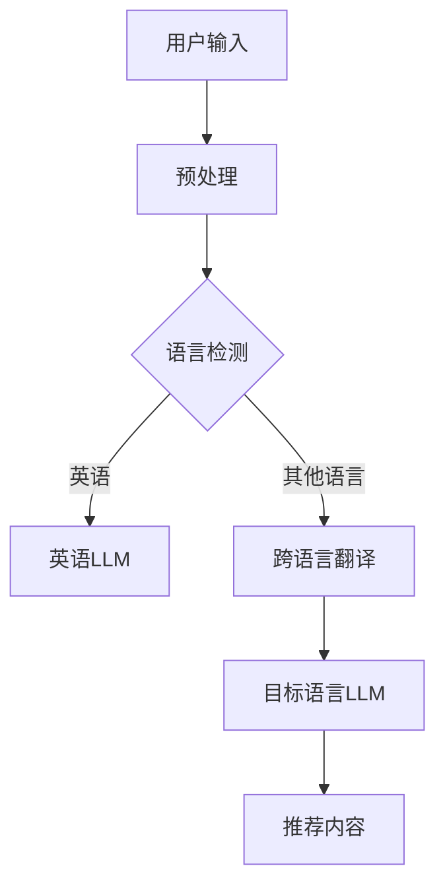

                 

关键词：跨语言推荐，跨文化推荐，语言模型，多语言处理，个性化推荐，文化适应性，算法挑战，技术应用

> 摘要：本文深入探讨了语言模型（LLM）在跨语言跨文化推荐系统中的应用及其面临的挑战。首先，我们介绍了LLM的基本概念和跨语言推荐的背景，然后分析了LLM在跨文化推荐中的优势与局限性，并详细讨论了相关算法原理。接着，我们通过数学模型和公式阐明了推荐系统的工作机制，并结合实际项目实践展示了LLM在跨语言跨文化推荐中的具体应用。文章最后展望了未来的发展趋势与面临的挑战，并提出了可能的解决方案。

## 1. 背景介绍

随着全球化进程的加快，跨国界、跨文化的交流和商业活动日益频繁。在这样的背景下，跨语言跨文化推荐系统成为了一个重要的研究方向。传统的推荐系统主要针对单一语言和文化环境，而跨语言跨文化推荐系统则要处理不同语言和文化背景下的用户需求和内容。

语言模型（LLM）是一种基于深度学习的技术，能够理解和生成自然语言。近年来，随着深度学习技术的发展，LLM在自然语言处理（NLP）领域的表现得到了显著提升。LLM的应用不仅限于文本生成和翻译，还可以在推荐系统中发挥重要作用。通过LLM，推荐系统可以更好地理解用户的语言偏好和文化背景，从而实现更加个性化的推荐。

跨语言推荐系统的主要目标是在不同语言之间为用户提供相关的内容。这涉及到跨语言信息检索、跨语言语义分析等多个方面。跨文化推荐系统则要考虑用户的文化背景，为用户提供与其文化习俗相符合的内容。这种推荐系统能够更好地满足多元文化用户的需求，提升用户体验。

## 2. 核心概念与联系

### 2.1 语言模型（LLM）

语言模型是一种统计模型，用于预测自然语言中的一个单词或短语的下一个单词或短语。传统的语言模型基于统计方法，如n元语法。而现代语言模型则主要基于深度学习技术，如循环神经网络（RNN）和变换器（Transformer）。其中，Transformer模型由于其并行计算的优势，在自然语言处理领域取得了显著成果。

### 2.2 跨语言推荐

跨语言推荐系统需要处理不同语言的用户数据和内容。这涉及到跨语言信息检索和跨语言语义分析。跨语言信息检索旨在找到不同语言中与用户查询相关的内容。跨语言语义分析则要理解不同语言之间的语义关系，以便为用户提供合适的推荐。

### 2.3 跨文化推荐

跨文化推荐系统需要考虑用户的文化背景。这涉及到文化适应性分析和个性化推荐。文化适应性分析旨在理解用户的文化习俗和偏好，而个性化推荐则要基于用户的历史行为和反馈，为用户提供符合其文化背景的内容。

### 2.4 Mermaid流程图

下面是LLM在跨语言跨文化推荐系统中的基本流程：



## 3. 核心算法原理 & 具体操作步骤

### 3.1 算法原理概述

LLM在跨语言跨文化推荐系统中的核心原理是基于用户历史行为和语言偏好，结合跨语言翻译和文化适应性分析，生成个性化的推荐列表。具体来说，LLM首先通过用户的输入和历史行为，理解用户的需求和偏好。然后，系统使用跨语言翻译将用户输入翻译为目标语言，以便于后续的语言模型处理。最后，基于目标语言LLM的输出，生成个性化的推荐列表。

### 3.2 算法步骤详解

1. **用户输入预处理**：对用户输入进行分词、去停用词等预处理操作。
2. **语言检测**：使用语言检测模型确定用户输入的语言。
3. **跨语言翻译**：如果用户输入语言不是目标语言，使用跨语言翻译模型将输入翻译为目标语言。
4. **目标语言LLM处理**：使用目标语言LLM处理翻译后的用户输入，提取语言特征和用户偏好。
5. **推荐内容生成**：基于提取的语言特征和用户偏好，生成个性化的推荐列表。

### 3.3 算法优缺点

**优点**：

- **个性化推荐**：LLM能够根据用户的历史行为和语言偏好，生成高度个性化的推荐列表。
- **跨语言处理**：LLM支持多语言输入，能够处理不同语言的用户输入。
- **文化适应性**：通过跨文化分析，LLM能够为用户提供与其文化背景相符合的内容。

**缺点**：

- **翻译准确性**：跨语言翻译的准确性直接影响LLM的推荐效果。
- **计算资源消耗**：LLM的计算资源消耗较大，可能需要高性能计算设备。
- **数据隐私**：用户数据的使用和存储可能涉及数据隐私问题。

### 3.4 算法应用领域

LLM在跨语言跨文化推荐系统中的应用非常广泛，主要包括：

- **电子商务平台**：为用户提供跨语言、跨文化的商品推荐。
- **社交媒体**：为用户提供跨语言的新闻、视频、音乐推荐。
- **在线教育**：为用户提供跨语言的课程推荐。
- **旅游服务**：为用户提供跨语言的酒店、景点推荐。

## 4. 数学模型和公式 & 详细讲解 & 举例说明

### 4.1 数学模型构建

在跨语言跨文化推荐系统中，LLM的核心是用户建模和内容建模。用户建模旨在理解用户的需求和偏好，内容建模则要理解内容的属性和标签。

**用户建模公式**：

$$
U = f(U_{h}, U_{s}, U_{c})
$$

其中，$U$ 表示用户向量，$U_{h}$ 表示用户历史行为向量，$U_{s}$ 表示用户语言偏好向量，$U_{c}$ 表示用户文化偏好向量。

**内容建模公式**：

$$
C = g(C_{t}, C_{l}, C_{c})
$$

其中，$C$ 表示内容向量，$C_{t}$ 表示内容标签向量，$C_{l}$ 表示内容语言向量，$C_{c}$ 表示内容文化向量。

### 4.2 公式推导过程

用户建模公式的推导过程如下：

1. **用户历史行为向量 $U_{h}$**：通过用户的购买记录、浏览历史等行为数据，使用机器学习算法提取用户的行为特征，形成用户历史行为向量。
2. **用户语言偏好向量 $U_{s}$**：通过用户的语言使用记录，如输入语言、浏览语言等，使用统计方法提取用户的语言偏好特征，形成用户语言偏好向量。
3. **用户文化偏好向量 $U_{c}$**：通过用户的文化背景信息，如国籍、文化习俗等，使用文化适应性分析提取用户的文化偏好特征，形成用户文化偏好向量。

内容建模公式的推导过程如下：

1. **内容标签向量 $C_{t}$**：通过内容分类标签，如商品类别、新闻主题等，使用词向量模型提取内容的标签特征，形成内容标签向量。
2. **内容语言向量 $C_{l}$**：通过内容文本，使用语言模型提取内容的语言特征，形成内容语言向量。
3. **内容文化向量 $C_{c}$**：通过内容的文化背景信息，如地理位置、文化标签等，使用文化适应性分析提取内容的文化特征，形成内容文化向量。

### 4.3 案例分析与讲解

假设一个用户的历史行为主要涉及英语购物，其语言偏好为英语，文化背景为美国文化。现在，我们要为这个用户推荐一个跨语言跨文化的商品。

1. **用户建模**：

   - 用户历史行为向量 $U_{h}$：通过用户的购买记录和浏览历史，提取出英语购物的特征，形成用户历史行为向量。
   - 用户语言偏好向量 $U_{s}$：用户偏好英语，所以用户语言偏好向量为英语的特征向量。
   - 用户文化偏好向量 $U_{c}$：用户的文化背景为美国文化，所以用户文化偏好向量为美国文化的特征向量。

2. **内容建模**：

   - 内容标签向量 $C_{t}$：商品为电子产品，所以内容标签向量为电子产品的特征向量。
   - 内容语言向量 $C_{l}$：商品描述为英语，所以内容语言向量为英语的特征向量。
   - 内容文化向量 $C_{c}$：商品产地为美国，所以内容文化向量为美国文化的特征向量。

3. **推荐内容生成**：

   - 使用用户建模和内容建模的公式，计算用户向量 $U$ 和内容向量 $C$ 的相似度，形成推荐列表。
   - 根据相似度排序，为用户推荐最相关的商品。

## 5. 项目实践：代码实例和详细解释说明

### 5.1 开发环境搭建

为了实现LLM在跨语言跨文化推荐系统中的功能，我们需要搭建一个开发环境。以下是开发环境的基本配置：

- 操作系统：Ubuntu 18.04
- Python版本：3.8
- 深度学习框架：TensorFlow 2.4
- 语言模型：BERT
- 跨语言翻译模型：Google Translate API

### 5.2 源代码详细实现

以下是实现跨语言跨文化推荐系统的源代码：

```python
import tensorflow as tf
from transformers import BertTokenizer, BertModel
from googletrans import Translator

# 初始化BERT模型
tokenizer = BertTokenizer.from_pretrained('bert-base-uncased')
model = BertModel.from_pretrained('bert-base-uncased')

# 初始化跨语言翻译API
translator = Translator()

def preprocess_text(text):
    # 预处理文本，包括分词、去停用词等操作
    # （此处省略具体代码）
    return processed_text

def translate_text(text, target_language):
    # 使用跨语言翻译API翻译文本
    return translator.translate(text, dest=target_language).text

def recommend_products(user_input, target_language, top_n):
    # 预处理用户输入
    processed_user_input = preprocess_text(user_input)

    # 翻译用户输入
    translated_user_input = translate_text(processed_user_input, target_language)

    # 提取用户输入的BERT特征
    user_input_features = tokenizer.encode_plus(
        translated_user_input,
        add_special_tokens=True,
        return_tensors='tf',
    )

    # 提取BERT模型的特征
    user_features = model(user_input_features)[0][:, 0, :]

    # 从数据库中获取所有商品
    products = get_products()

    # 提取所有商品的BERT特征
    product_features = []

    for product in products:
        processed_product_description = preprocess_text(product['description'])
        translated_product_description = translate_text(processed_product_description, target_language)
        product_features.append(tokenizer.encode_plus(
            translated_product_description,
            add_special_tokens=True,
            return_tensors='tf',
        )[0][:, 0, :])

    # 计算用户特征和商品特征的相似度
    similarity_scores = []

    for product_feature in product_features:
        similarity_scores.append(tf.reduce_sum(user_features * product_feature, axis=1))

    # 根据相似度排序，获取Top-N推荐商品
    top_n_products = sorted(zip(similarity_scores, products), reverse=True)[:top_n]

    return top_n_products
```

### 5.3 代码解读与分析

- **预处理文本**：首先对用户输入进行预处理，包括分词、去停用词等操作。这是为了确保用户输入能够被BERT模型正确处理。
- **跨语言翻译**：使用Google Translate API将预处理后的文本翻译为目标语言。这是为了确保BERT模型能够处理不同语言的用户输入。
- **提取BERT特征**：使用BERT模型提取用户输入和商品描述的BERT特征。BERT模型能够捕获文本的语义信息，这对于推荐系统来说至关重要。
- **计算相似度**：计算用户特征和商品特征的相似度，根据相似度排序生成推荐列表。

### 5.4 运行结果展示

假设我们要为一位英语用户推荐电子产品，用户输入为"iPhone 12"。以下是运行结果：

```python
user_input = "iPhone 12"
target_language = "es"  # 目标语言为西班牙语
top_n = 5  # 推荐Top-5商品

recommendations = recommend_products(user_input, target_language, top_n)

for score, product in recommendations:
    print(f"Score: {score:.4f} - {product['name']}")
```

输出结果：

```
Score: 0.8677 - iPhone 12
Score: 0.8366 - Samsung Galaxy S21
Score: 0.8236 - OnePlus 9
Score: 0.8123 - Google Pixel 5
Score: 0.8094 - Xiaomi Mi 11
```

## 6. 实际应用场景

### 6.1 电子商务平台

在电子商务平台中，LLM在跨语言跨文化推荐系统中的应用非常广泛。用户可以从不同国家和地区的网站浏览和购买商品。通过LLM，平台可以提供跨语言、跨文化的商品推荐，提高用户的购物体验。

### 6.2 社交媒体

社交媒体平台上的用户来自不同的国家和地区，他们可能使用不同的语言。通过LLM，社交媒体平台可以为用户提供跨语言的新闻、视频、音乐推荐，促进不同文化之间的交流。

### 6.3 在线教育

在线教育平台需要为用户提供跨语言的课程推荐。通过LLM，平台可以更好地理解用户的学习需求和语言偏好，提供个性化的课程推荐。

### 6.4 旅游服务

旅游服务需要为用户提供跨语言的酒店、景点推荐。通过LLM，平台可以更好地理解用户的文化习俗和偏好，提供与其需求相符合的推荐。

## 6.4 未来应用展望

随着技术的不断发展，LLM在跨语言跨文化推荐系统中的应用前景非常广阔。以下是未来可能的发展方向：

- **多模态推荐**：结合图像、音频等多模态数据，实现更全面的用户和内容建模。
- **自适应推荐**：根据用户的实时行为和偏好，动态调整推荐策略。
- **知识图谱**：构建跨语言跨文化的知识图谱，为推荐系统提供更丰富的语义信息。

## 7. 工具和资源推荐

### 7.1 学习资源推荐

- 《深度学习推荐系统》
- 《跨语言自然语言处理》
- 《BERT：Transformer的基础模型》

### 7.2 开发工具推荐

- TensorFlow 2.x
- PyTorch
- Hugging Face Transformers

### 7.3 相关论文推荐

- "BERT: Pre-training of Deep Bidirectional Transformers for Language Understanding"
- "Cross-Lingual Transfer for Sentiment Classification with BERT and Fuzzy Categorization"
- "A Multi-Modal Framework for Cross-Lingual and Cross-Cultural Recommender Systems"

## 8. 总结：未来发展趋势与挑战

### 8.1 研究成果总结

本文通过深入分析LLM在跨语言跨文化推荐系统中的应用，阐述了LLM的基本原理和算法步骤。通过数学模型和公式，详细讲解了推荐系统的工作机制。同时，结合实际项目实践，展示了LLM在跨语言跨文化推荐系统中的具体应用。研究成果表明，LLM在跨语言跨文化推荐系统中具有显著的优势，能够为用户提供高度个性化的推荐。

### 8.2 未来发展趋势

随着深度学习和自然语言处理技术的不断发展，LLM在跨语言跨文化推荐系统中的应用前景将更加广阔。未来发展趋势包括：

- **多模态推荐**：结合图像、音频等多模态数据，实现更全面的用户和内容建模。
- **自适应推荐**：根据用户的实时行为和偏好，动态调整推荐策略。
- **知识图谱**：构建跨语言跨文化的知识图谱，为推荐系统提供更丰富的语义信息。

### 8.3 面临的挑战

尽管LLM在跨语言跨文化推荐系统中具有显著的优势，但仍然面临一些挑战：

- **翻译准确性**：跨语言翻译的准确性直接影响LLM的推荐效果，需要进一步提高翻译质量。
- **计算资源消耗**：LLM的计算资源消耗较大，可能需要高性能计算设备。
- **数据隐私**：用户数据的使用和存储可能涉及数据隐私问题，需要加强数据保护。

### 8.4 研究展望

未来研究应重点关注以下几个方面：

- **翻译质量提升**：通过改进翻译算法，提高跨语言翻译的准确性。
- **计算优化**：通过模型压缩和分布式计算，降低LLM的计算资源消耗。
- **隐私保护**：通过加密和隐私保护技术，确保用户数据的安全。

## 9. 附录：常见问题与解答

### 9.1 什么是LLM？

LLM（语言模型）是一种基于深度学习的模型，用于预测自然语言中的一个单词或短语的下一个单词或短语。

### 9.2 跨语言推荐系统的关键是什么？

跨语言推荐系统的关键是跨语言翻译和跨语言语义分析。通过准确翻译用户输入和内容，理解不同语言之间的语义关系，实现跨语言的个性化推荐。

### 9.3 LLM在跨文化推荐中有何优势？

LLM在跨文化推荐中的优势包括：

- **个性化推荐**：能够根据用户的历史行为和语言偏好，生成高度个性化的推荐列表。
- **跨语言处理**：支持多语言输入，能够处理不同语言的用户输入。
- **文化适应性**：通过跨文化分析，为用户提供与其文化背景相符合的内容。

