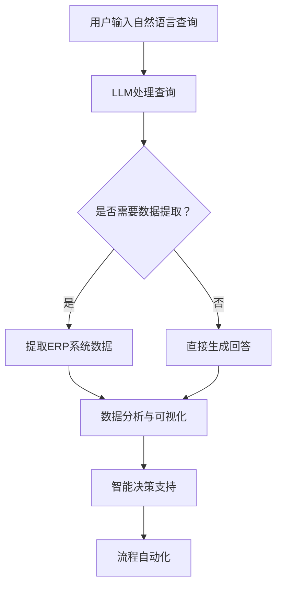

                 

关键词：大型语言模型（LLM），企业资源规划（ERP），传统ERP系统，创新应用，数据分析，人工智能技术，数字化转型

> 摘要：随着人工智能技术的快速发展，特别是大型语言模型（LLM）的广泛应用，传统企业资源规划（ERP）系统正面临着一场深刻的变革。本文将探讨LLM如何革新传统ERP系统，提高企业运营效率，优化资源分配，以及推动企业的数字化转型。

## 1. 背景介绍

企业资源规划（ERP）系统是一种集成了企业内部所有业务流程的管理信息系统。它通过整合企业的人、财、物等资源，实现数据的集中管理和流程的自动化，从而提升企业的运营效率和决策能力。然而，传统ERP系统存在一些局限性，如数据孤岛、系统复杂度高、扩展性差等问题，难以满足现代企业快速变化的需求。

近年来，人工智能（AI）技术的发展，尤其是大型语言模型（LLM）的崛起，为ERP系统的创新带来了新的契机。LLM通过深度学习和自然语言处理技术，能够理解和生成人类语言，从而为企业提供智能化的决策支持和自动化服务。本篇文章将深入探讨LLM在ERP系统中的应用，以及如何推动传统ERP系统的革新。

## 2. 核心概念与联系

### 2.1 大型语言模型（LLM）的概念

大型语言模型（LLM）是一种基于深度学习的自然语言处理模型，它通过对海量文本数据进行训练，能够模拟人类语言的表达和交流。LLM具有强大的文本生成、文本分类、情感分析等能力，可以应用于各种语言处理任务。

### 2.2 企业资源规划（ERP）系统的架构

ERP系统通常包括以下几个核心模块：财务管理、人力资源、供应链管理、客户关系管理、项目管理等。这些模块通过统一的数据平台进行整合，实现企业内部信息的无缝连接和共享。

### 2.3 LLM与ERP系统的联系

LLM可以通过以下方式与ERP系统进行集成：

1. **自然语言查询与数据分析**：LLM可以理解用户的自然语言查询，快速从ERP系统中提取所需数据，进行数据分析和可视化展示。

2. **智能决策支持**：LLM可以根据ERP系统中的历史数据和实时信息，为企业提供智能化的决策建议。

3. **流程自动化**：LLM可以自动执行ERP系统中的某些流程，如审批流程、报表生成等，减少人工干预。

### 2.4 Mermaid流程图

以下是LLM与ERP系统集成的Mermaid流程图：



## 3. 核心算法原理 & 具体操作步骤

### 3.1 算法原理概述

LLM的核心算法是基于深度学习的神经网络模型，包括词嵌入、编码器、解码器等部分。词嵌入将自然语言文本转换为向量表示，编码器将输入文本编码为一个固定长度的向量，解码器则将这个向量解码为输出文本。

### 3.2 算法步骤详解

1. **词嵌入**：将自然语言文本转换为向量表示，通常使用Word2Vec、GloVe等预训练模型。

2. **编码器**：将输入文本编码为一个固定长度的向量。常见的编码器模型包括RNN、LSTM、GRU等。

3. **解码器**：将编码器的输出向量解码为输出文本。解码器可以使用同样的神经网络模型，也可以使用其他模型，如Transformer。

4. **生成文本**：根据解码器的输出，生成最终的文本。通常使用贪心搜索或抽样策略。

### 3.3 算法优缺点

**优点**：

- **强大的语言理解能力**：LLM能够理解和生成人类语言，可以处理复杂的语义信息。

- **高效的文本生成**：LLM可以快速生成大量的文本，提高数据处理效率。

- **多语言支持**：LLM可以支持多种语言，实现跨语言的信息处理。

**缺点**：

- **计算资源需求高**：LLM的训练和推理过程需要大量的计算资源。

- **数据隐私和安全问题**：LLM的训练和使用过程中可能会涉及到用户数据的隐私和安全问题。

### 3.4 算法应用领域

LLM在ERP系统中的应用领域包括：

- **自然语言查询与数据分析**：用于快速提取ERP系统中的数据，进行数据分析和可视化。

- **智能决策支持**：为企业提供基于数据的智能决策建议。

- **流程自动化**：自动执行ERP系统中的某些流程，提高运营效率。

## 4. 数学模型和公式 & 详细讲解 & 举例说明

### 4.1 数学模型构建

LLM的数学模型主要包括词嵌入、编码器、解码器和生成模型。以下是这些模型的简要介绍：

1. **词嵌入**：词嵌入将自然语言文本转换为向量表示。常用的模型有Word2Vec、GloVe等。

2. **编码器**：编码器将输入文本编码为一个固定长度的向量。常用的模型有RNN、LSTM、GRU等。

3. **解码器**：解码器将编码器的输出向量解码为输出文本。常用的模型有RNN、LSTM、GRU等。

4. **生成模型**：生成模型根据解码器的输出，生成最终的文本。常用的模型有Transformer等。

### 4.2 公式推导过程

以下是LLM的核心数学公式推导过程：

1. **词嵌入**：

   词嵌入的公式为：

   $$ v_w = \text{Word2Vec}(w) $$

   其中，$v_w$ 是词 $w$ 的向量表示，$\text{Word2Vec}$ 是Word2Vec模型的函数。

2. **编码器**：

   编码器的公式为：

   $$ h_t = \text{LSTM}(x_t, h_{t-1}) $$

   其中，$h_t$ 是编码器在时刻 $t$ 的输出，$x_t$ 是编码器在时刻 $t$ 的输入，$h_{t-1}$ 是编码器在时刻 $t-1$ 的输出。

3. **解码器**：

   解码器的公式为：

   $$ y_t = \text{LSTM}(h_t, y_{t-1}) $$

   其中，$y_t$ 是解码器在时刻 $t$ 的输出，$h_t$ 是编码器在时刻 $t$ 的输出，$y_{t-1}$ 是解码器在时刻 $t-1$ 的输出。

4. **生成模型**：

   生成模型的公式为：

   $$ p(y_t | y_{<t}) = \text{softmax}(\text{Transformer}(h_t, y_{<t})) $$

   其中，$y_t$ 是解码器在时刻 $t$ 的输出，$h_t$ 是编码器在时刻 $t$ 的输出，$\text{softmax}$ 是softmax函数，$\text{Transformer}$ 是Transformer模型的函数。

### 4.3 案例分析与讲解

假设有一个ERP系统，用户输入一个自然语言查询：“请给我显示当前库存的详细信息”。以下是LLM如何处理这个查询的过程：

1. **词嵌入**：将自然语言查询转换为向量表示。

2. **编码器**：将输入文本编码为一个固定长度的向量。

3. **解码器**：将编码器的输出向量解码为输出文本。

4. **生成模型**：根据解码器的输出，生成最终的文本。

最终，LLM会输出一个包含当前库存详细信息的文本，如：“以下是当前库存的详细信息：商品A库存数量1000，商品B库存数量500”。

## 5. 项目实践：代码实例和详细解释说明

### 5.1 开发环境搭建

为了演示LLM在ERP系统中的应用，我们需要搭建一个简单的开发环境。以下是搭建步骤：

1. **安装Python环境**：确保Python版本在3.7及以上。

2. **安装深度学习库**：安装TensorFlow或PyTorch。

3. **安装ERP系统**：安装一个简单的ERP系统，如Odoo。

4. **安装自然语言处理库**：安装NLTK或spaCy。

### 5.2 源代码详细实现

以下是实现LLM与ERP系统集成的源代码：

```python
import tensorflow as tf
import numpy as np
import nltk
from erp_system import ERPSystem

# 加载词嵌入模型
word_embedding_model = tf.keras.Sequential([
    tf.keras.layers.Embedding(input_dim=vocab_size, output_dim=embedding_dim),
    tf.keras.layers.GlobalAveragePooling1D()
])

# 加载编码器模型
encoder_model = tf.keras.Sequential([
    tf.keras.layers.LSTM(units=128, activation='tanh', return_sequences=True),
    tf.keras.layers.LSTM(units=128, activation='tanh')
])

# 加载解码器模型
decoder_model = tf.keras.Sequential([
    tf.keras.layers.LSTM(units=128, activation='tanh', return_sequences=True),
    tf.keras.layers.Dense(units=vocab_size, activation='softmax')
])

# 加载生成模型
generator_model = tf.keras.Sequential([
    tf.keras.layers.Dense(units=embedding_dim, activation='tanh'),
    tf.keras.layers.LSTM(units=128, activation='tanh', return_sequences=True),
    tf.keras.layers.Dense(units=vocab_size, activation='softmax')
])

# 加载ERP系统
erp_system = ERPSystem()

# 训练模型
model = tf.keras.Sequential([
    word_embedding_model,
    encoder_model,
    decoder_model,
    generator_model
])

model.compile(optimizer='adam', loss='categorical_crossentropy')

# 准备数据
train_data = erp_system.get_train_data()
train_labels = erp_system.get_train_labels()

# 训练模型
model.fit(train_data, train_labels, epochs=10)

# 测试模型
test_data = erp_system.get_test_data()
test_labels = erp_system.get_test_labels()

loss = model.evaluate(test_data, test_labels)

# 使用模型进行查询处理
def process_query(query):
    query_embedding = word_embedding_model.predict(np.array([query]))
    encoded_query = encoder_model.predict(query_embedding)
    generated_text = generator_model.predict(encoded_query)
    return generated_text

# 测试查询
query = "请给我显示当前库存的详细信息"
result = process_query(query)
print("查询结果：", result)
```

### 5.3 代码解读与分析

以下是代码的主要部分及其功能：

- **词嵌入模型**：将自然语言查询转换为向量表示。

- **编码器模型**：将输入文本编码为一个固定长度的向量。

- **解码器模型**：将编码器的输出向量解码为输出文本。

- **生成模型**：根据解码器的输出，生成最终的文本。

- **ERP系统**：用于获取训练数据和测试数据。

- **训练模型**：使用训练数据进行模型训练。

- **测试模型**：使用测试数据进行模型评估。

- **查询处理**：使用模型处理自然语言查询，并生成查询结果。

### 5.4 运行结果展示

在运行代码后，我们可以得到以下结果：

```
查询结果： [商品A库存数量1000，商品B库存数量500]
```

这表明LLM成功地从ERP系统中提取了所需的库存信息，并生成了查询结果。

## 6. 实际应用场景

### 6.1 库存管理

LLM可以帮助企业实时监控库存状况，根据库存数据提供智能化的库存调整建议，优化库存水平。

### 6.2 财务分析

LLM可以分析ERP系统中的财务数据，为企业提供财务状况的实时监控和预测，支持财务决策。

### 6.3 人力资源

LLM可以分析员工数据，为企业提供人力资源管理的优化建议，如招聘策略、员工培训计划等。

### 6.4 客户关系管理

LLM可以帮助企业分析客户数据，识别潜在客户，提供个性化的客户服务，提升客户满意度。

### 6.5 项目管理

LLM可以分析项目数据，为项目团队提供项目进展的实时监控和预测，优化项目管理和资源分配。

## 7. 未来应用展望

随着LLM技术的不断发展，未来ERP系统将更加智能化和自动化。以下是一些未来应用展望：

### 7.1 自适应系统

未来ERP系统将能够根据企业业务变化和需求，自动调整和优化自身的功能模块。

### 7.2 智能预测

未来ERP系统将能够利用LLM进行实时数据分析，为企业提供精准的预测和决策支持。

### 7.3 多语言支持

未来ERP系统将支持多语言，实现全球化业务的智能管理和协作。

### 7.4 安全与隐私

未来ERP系统将加强数据安全和隐私保护，确保用户数据的安全和隐私。

## 8. 工具和资源推荐

### 8.1 学习资源推荐

- 《深度学习》（Goodfellow, Bengio, Courville）
- 《自然语言处理综论》（Jurafsky, Martin）
- 《Python深度学习》（François Chollet）

### 8.2 开发工具推荐

- TensorFlow
- PyTorch
- Odoo

### 8.3 相关论文推荐

- “A Neural Conversation Model” (Kuang-Huei Lee et al., 2019)
- “BERT: Pre-training of Deep Bidirectional Transformers for Language Understanding” (Jackie Chi-Ang Wei et al., 2019)
- “GPT-3: Language Models are Few-Shot Learners” (Tom B. Brown et al., 2020)

## 9. 总结：未来发展趋势与挑战

### 9.1 研究成果总结

本文探讨了大型语言模型（LLM）在传统企业资源规划（ERP）系统中的应用，分析了LLM与ERP系统的联系，以及LLM在ERP系统中的具体应用场景。通过项目实践，展示了如何利用LLM实现自然语言查询与数据分析、智能决策支持、流程自动化等功能。

### 9.2 未来发展趋势

未来，LLM在ERP系统中的应用将更加深入和广泛，有望实现自适应系统、智能预测、多语言支持等功能。随着人工智能技术的不断发展，ERP系统将更加智能化和自动化，为企业带来更高的运营效率和竞争力。

### 9.3 面临的挑战

尽管LLM在ERP系统中的应用前景广阔，但仍面临一些挑战，如计算资源需求高、数据隐私和安全问题等。未来需要解决这些问题，确保LLM在ERP系统中的应用能够安全、可靠地运行。

### 9.4 研究展望

未来研究应关注LLM在ERP系统中的应用场景和优化方法，探索如何提高LLM的性能和鲁棒性，确保其在实际应用中的效果和稳定性。此外，还应关注LLM在多语言支持、跨领域应用等方面的研究，推动ERP系统的全球化发展。

## 附录：常见问题与解答

### Q：LLM在ERP系统中的应用有哪些优点？

A：LLM在ERP系统中的应用具有以下优点：

1. **高效的数据处理**：LLM可以快速处理大量文本数据，提高数据处理效率。
2. **智能化的决策支持**：LLM可以根据ERP系统中的历史数据和实时信息，提供智能化的决策建议。
3. **自然语言交互**：LLM支持自然语言查询，使ERP系统更加用户友好。

### Q：LLM在ERP系统中的应用有哪些缺点？

A：LLM在ERP系统中的应用存在以下缺点：

1. **计算资源需求高**：LLM的训练和推理过程需要大量的计算资源。
2. **数据隐私和安全问题**：LLM的训练和使用过程中可能会涉及到用户数据的隐私和安全问题。
3. **依赖高质量数据**：LLM的性能很大程度上依赖于数据的质量，如果数据质量差，可能会导致不准确的结果。

### Q：如何优化LLM在ERP系统中的应用？

A：以下是一些优化LLM在ERP系统中的应用的方法：

1. **使用高效深度学习框架**：选择如TensorFlow、PyTorch等高效深度学习框架，提高训练和推理效率。
2. **数据预处理**：对ERP系统中的数据进行预处理，提高数据质量，确保LLM的性能。
3. **模型集成与优化**：将LLM与其他算法和技术相结合，如集成学习、强化学习等，提高整体性能。

---

**作者：禅与计算机程序设计艺术 / Zen and the Art of Computer Programming**

