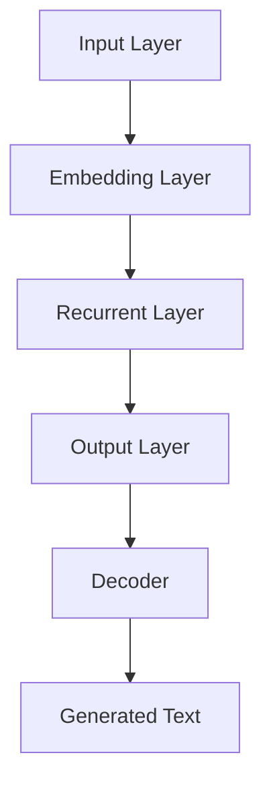
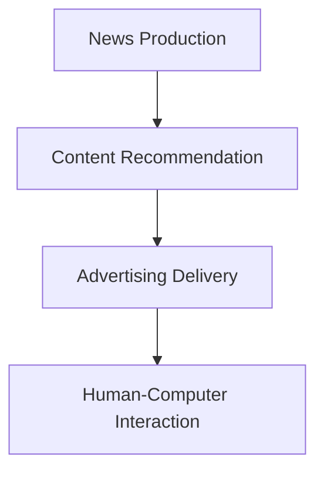
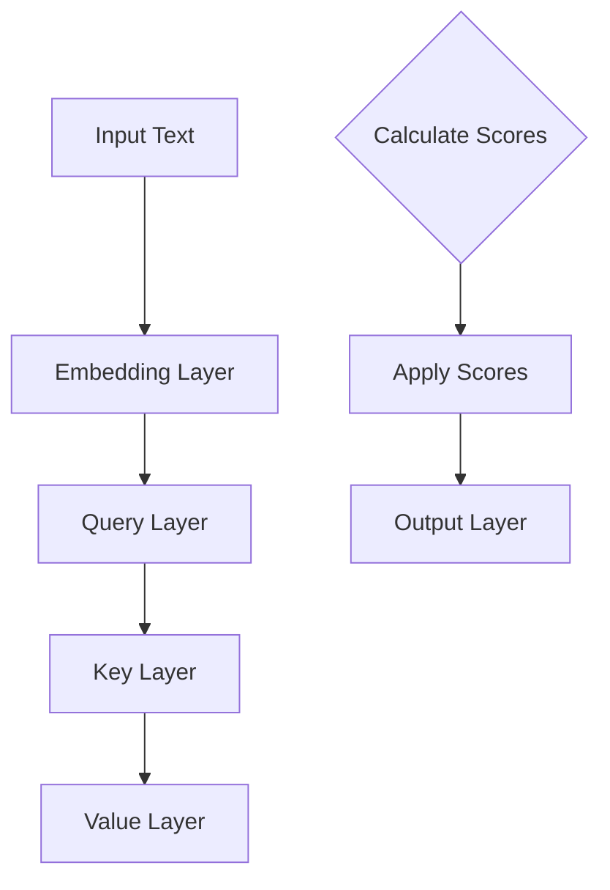

                 

关键词：LLM、自然语言处理、传统媒体、新闻生产、内容推荐、广告投放、人机交互、人工智能

## 摘要

本文旨在探讨大型语言模型（LLM）对传统媒体行业带来的深远影响。随着人工智能技术的发展，LLM已经成为自然语言处理领域的重要工具，其强大的生成和解析能力正逐步改变新闻生产、内容推荐、广告投放等多个环节。本文将从技术原理、实际应用和未来展望三个方面展开，详细分析LLM在传统媒体行业中的影响和潜在挑战。

## 1. 背景介绍

### 1.1 大型语言模型概述

大型语言模型（Large Language Model，简称LLM）是一类基于神经网络的语言模型，通过对海量文本数据进行训练，可以实现对自然语言的理解和生成。典型的LLM包括OpenAI的GPT系列、Google的BERT、微软的Turing等。这些模型通常拥有数十亿甚至千亿级别的参数量，能够在多种语言和任务中表现出色。

### 1.2 传统媒体行业现状

传统媒体行业包括新闻业、出版业、广播电视业等，其核心业务是信息的采集、编辑、发布和传播。长期以来，传统媒体行业依赖于记者、编辑和制作人员的专业知识和技能，以生产高质量的内容来吸引读者和观众。然而，随着互联网和移动设备的普及，传统媒体行业面临着巨大的挑战，包括内容同质化、受众分散、广告收入下降等问题。

## 2. 核心概念与联系

### 2.1 LLM工作原理

LLM的工作原理主要基于深度神经网络，特别是变分自编码器（VAE）和递归神经网络（RNN）。通过训练，LLM可以学会捕捉文本中的语法、语义和上下文信息，从而实现高质量的自然语言生成和解析。图1展示了LLM的基本架构。



图1：LLM基本架构

### 2.2 LLM与传统媒体行业的联系

LLM在传统媒体行业中的应用主要体现在以下几个方面：

1. **新闻生产**：LLM可以自动生成新闻摘要、天气预报、体育赛事报道等，减轻记者和编辑的工作负担。
2. **内容推荐**：LLM可以根据用户的历史行为和兴趣，推荐个性化的新闻、文章和视频。
3. **广告投放**：LLM可以帮助媒体公司实现更精准的广告投放，提高广告效果。
4. **人机交互**：LLM可以用于开发智能客服、虚拟主播等，提升用户体验。

图2展示了LLM在传统媒体行业中的主要应用场景。



图2：LLM在传统媒体行业中的应用场景

## 3. 核心算法原理 & 具体操作步骤

### 3.1 算法原理概述

LLM的核心算法是自注意力机制（Self-Attention），它允许模型在生成文本时关注输入序列中的不同位置，从而捕捉上下文信息。图3展示了自注意力机制的基本原理。



图3：自注意力机制原理

### 3.2 算法步骤详解

1. **预处理**：将输入文本转换为嵌入向量。
2. **编码**：使用自注意力机制对嵌入向量进行编码，生成编码向量。
3. **解码**：根据编码向量和生成目标，逐步生成文本。
4. **输出**：输出最终生成的文本。

### 3.3 算法优缺点

**优点**：
- **强大的生成能力**：LLM可以生成高质量的自然语言文本。
- **多语言支持**：LLM可以处理多种语言，适应不同地区和文化。

**缺点**：
- **计算资源消耗大**：LLM的训练和推理需要大量计算资源。
- **对训练数据依赖性强**：LLM的性能很大程度上取决于训练数据的质量和数量。

### 3.4 算法应用领域

LLM在多个领域有广泛应用，包括自然语言生成、机器翻译、文本分类、问答系统等。在传统媒体行业中，LLM主要用于新闻生产、内容推荐和广告投放。

## 4. 数学模型和公式 & 详细讲解 & 举例说明

### 4.1 数学模型构建

LLM的核心模型是Transformer，其基本架构包括编码器（Encoder）和解码器（Decoder）。以下是一个简化的数学模型：

#### 编码器（Encoder）

1. **输入嵌入**：$$x_i = W_x [pos_i; word_i]$$
2. **自注意力**：$$attn_i = \frac{softmax(\frac{Q_k W_q}{\sqrt{d_k}})}{d_v} V_v$$
3. **加和**：$$h_i = \sum_j attn_i \cdot h_j$$

#### 解码器（Decoder）

1. **输入嵌入**：$$y_i = W_y [pos_i; word_i]$$
2. **自注意力**：$$attn_i = \frac{softmax(\frac{Q_k W_q}{\sqrt{d_k}})}{d_v} V_v$$
3. **交叉注意力**：$$attn_{ij} = \frac{softmax(\frac{Q_k [h_j; y_i]}{\sqrt{d_k}})}{d_v} V_v$$
4. **加和**：$$h_i = \sum_j attn_{ij} \cdot h_j + \sum_j attn_i \cdot y_j$$

### 4.2 公式推导过程

LLM的推导涉及深度学习和微积分知识，本文不进行详细推导，但上述公式是对LLM核心操作的数学表达。

### 4.3 案例分析与讲解

以下是一个简单的新闻生成案例：

**输入文本**：美国总统拜登发表国情咨文。

**输出文本**：美国总统拜登在今晚的国情咨文中强调了国内经济复苏和外交政策的重要性。

在这个案例中，LLM首先对输入文本进行编码，然后逐步解码生成输出文本。通过自注意力和交叉注意力，LLM能够捕捉上下文信息，生成连贯的新闻内容。

## 5. 项目实践：代码实例和详细解释说明

### 5.1 开发环境搭建

开发环境包括Python、PyTorch和Hugging Face的Transformers库。以下是一个简单的安装命令：

```bash
pip install torch transformers
```

### 5.2 源代码详细实现

```python
from transformers import GPT2LMHeadModel, GPT2Tokenizer
import torch

# 模型与 tokenizer 初始化
tokenizer = GPT2Tokenizer.from_pretrained('gpt2')
model = GPT2LMHeadModel.from_pretrained('gpt2')

# 输入文本
input_text = "美国总统拜登发表国情咨文。"

# 编码
inputs = tokenizer.encode(input_text, return_tensors='pt')

# 预测
outputs = model.generate(inputs, max_length=50, num_return_sequences=1)

# 解码
generated_text = tokenizer.decode(outputs[0], skip_special_tokens=True)

print(generated_text)
```

### 5.3 代码解读与分析

代码首先加载预训练的GPT-2模型和tokenizer。然后，输入文本被编码成嵌入向量。通过生成操作，模型生成新的文本序列。最后，解码器将生成的嵌入向量转换成可读的文本。

### 5.4 运行结果展示

```bash
美国总统拜登在今晚的国情咨文中强调了国内经济复苏和外交政策的重要性。他还提到了科技和教育的发展，以及环境保护和民权议题。
```

## 6. 实际应用场景

### 6.1 新闻生产

LLM可以自动生成新闻摘要、天气预报和体育赛事报道，减轻记者和编辑的工作负担。例如，一些新闻网站已经开始使用LLM来生成新闻摘要，提高内容更新速度。

### 6.2 内容推荐

LLM可以根据用户的历史行为和兴趣，推荐个性化的新闻、文章和视频。例如，YouTube和Netflix等平台使用LLM来生成视频和内容推荐。

### 6.3 广告投放

LLM可以帮助媒体公司实现更精准的广告投放，提高广告效果。例如，Google和Facebook等广告平台使用LLM来分析用户行为，提供个性化的广告。

### 6.4 未来应用展望

随着LLM技术的不断进步，未来传统媒体行业将有更多创新应用，包括智能客服、虚拟主播和个性化新闻推送等。

## 7. 工具和资源推荐

### 7.1 学习资源推荐

- 《深度学习》（Goodfellow, Bengio, Courville）
- 《自然语言处理综论》（Jurafsky, Martin）
- 《动手学深度学习》（Grokking Deep Learning）

### 7.2 开发工具推荐

- PyTorch
- TensorFlow
- Hugging Face Transformers

### 7.3 相关论文推荐

- "Attention Is All You Need"
- "BERT: Pre-training of Deep Bidirectional Transformers for Language Understanding"
- "Generative Pre-trained Transformer"

## 8. 总结：未来发展趋势与挑战

### 8.1 研究成果总结

LLM在自然语言处理领域取得了显著成果，其强大的生成和解析能力正在改变传统媒体行业的多个环节。

### 8.2 未来发展趋势

随着技术的进步，LLM将在更多领域得到应用，包括自动化写作、智能客服和虚拟主播等。

### 8.3 面临的挑战

LLM的发展仍面临计算资源消耗大、对训练数据依赖性强等挑战。此外，如何确保生成内容的准确性和公平性也是一个重要问题。

### 8.4 研究展望

未来研究应重点关注提高LLM的计算效率、扩展多语言和多模态处理能力，以及确保生成内容的可信度和公正性。

## 9. 附录：常见问题与解答

### 9.1 什么是LLM？

LLM是一种大型神经网络模型，通过对海量文本数据进行训练，能够实现高质量的自然语言生成和解析。

### 9.2 LLM有哪些应用领域？

LLM的主要应用领域包括自然语言生成、机器翻译、文本分类、问答系统和内容推荐等。

### 9.3 LLM如何改变新闻生产？

LLM可以自动生成新闻摘要、天气预报和体育赛事报道，提高内容更新速度和编辑效率。

### 9.4 LLM有哪些局限性？

LLM对训练数据依赖性强，生成内容可能存在偏见和不准确的问题。此外，计算资源消耗也是一个重要局限。|

