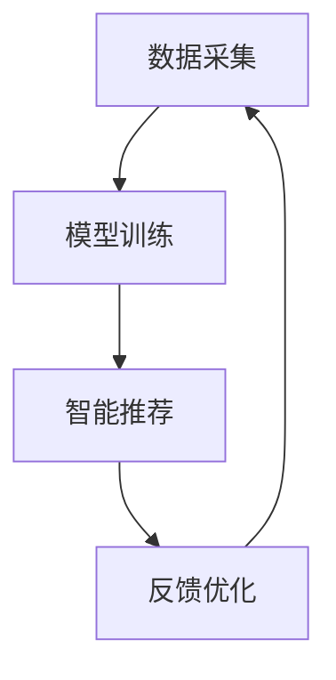

                 

关键词：人工智能，教育技术，教育资源分配，大语言模型，教育公平，技术革新

## 摘要

本文旨在探讨大语言模型（LLM）在教育资源分配方面的潜在革新。随着人工智能技术的不断发展，LLM在个性化教育、智能辅导、教育资源优化等方面展现出了巨大的潜力。本文将深入分析LLM在教育领域的应用，探讨其对传统教育资源分配模式的挑战与机遇，并展望未来教育公平的实现路径。

## 1. 背景介绍

### 1.1 人工智能在教育中的应用

人工智能在教育领域的应用已经成为全球教育改革的热点。从智能辅导系统到个性化学习平台，人工智能正在改变教育的面貌。然而，传统教育资源分配方式仍存在诸多问题，如教育不平等、资源分布不均等。这些问题使得优质教育资源难以公平分配，影响了教育质量的提升和人才培养的效果。

### 1.2 教育资源分配现状

教育资源分配的不公平性主要体现在以下几个方面：

1. **地域差异**：发达地区与欠发达地区之间的教育资源差距明显。
2. **学校差异**：不同学校之间的师资力量、硬件设施、课程设置等存在较大差距。
3. **学生差异**：家庭背景、经济条件等因素影响了学生获取教育资源的平等机会。

### 1.3 大语言模型的发展

大语言模型（LLM）是自然语言处理（NLP）领域的一项重要技术，其在文本生成、语义理解、语言翻译等方面具有显著优势。近年来，随着深度学习技术的发展，LLM的规模和性能不断提升，为人工智能在教育领域的应用提供了新的可能性。

## 2. 核心概念与联系

### 2.1 大语言模型原理

大语言模型基于深度神经网络，通过训练大量文本数据，学习语言规律和结构。其主要原理包括：

1. **词向量表示**：将文本中的每个词映射为高维向量，实现语义理解。
2. **循环神经网络（RNN）**：利用RNN处理序列数据，学习文本的长期依赖关系。
3. **注意力机制**：通过注意力机制捕捉关键信息，提高模型的语义理解能力。

### 2.2 教育资源分配架构

大语言模型在教育中的应用需要一个完整的架构来支持。该架构包括以下几个方面：

1. **数据采集**：收集学生、教师、课程等方面的数据。
2. **模型训练**：利用收集到的数据训练大语言模型，使其具备教育资源分配的能力。
3. **智能推荐**：根据学生的学习需求和教师的教学内容，提供个性化的教育资源推荐。
4. **反馈优化**：根据用户反馈不断优化模型，提高教育资源分配的准确性。

### 2.3 Mermaid 流程图

以下是一个简化的Mermaid流程图，展示了大语言模型在教育资源共享中的应用流程：



## 3. 核心算法原理 & 具体操作步骤

### 3.1 算法原理概述

大语言模型的核心算法是基于深度学习的自然语言处理技术。其主要原理包括：

1. **词嵌入**：将文本中的词转换为高维向量，实现语义表示。
2. **递归神经网络（RNN）**：通过RNN处理序列数据，学习文本的长期依赖关系。
3. **注意力机制**：通过注意力机制捕捉关键信息，提高模型的语义理解能力。

### 3.2 算法步骤详解

1. **数据采集**：收集学生、教师、课程等方面的数据，包括学习记录、教学大纲、课程评价等。
2. **数据预处理**：对采集到的数据进行清洗、去噪、格式化等处理，以便模型训练。
3. **模型训练**：利用预处理后的数据训练大语言模型，使其能够理解教育资源和学生的需求。
4. **智能推荐**：根据学生的学习需求和教师的教学内容，使用训练好的模型提供个性化的教育资源推荐。
5. **反馈优化**：根据用户反馈不断优化模型，提高教育资源分配的准确性。

### 3.3 算法优缺点

**优点**：

1. **个性化推荐**：大语言模型能够根据学生的个性化需求提供教育资源推荐，提高教育质量。
2. **高效处理**：基于深度学习的技术使得模型在处理大规模数据时具有高效性。
3. **可扩展性**：大语言模型可以应用于各种教育场景，具有良好的可扩展性。

**缺点**：

1. **数据依赖**：大语言模型的性能高度依赖于数据质量，数据不足或质量差会影响模型的效果。
2. **隐私保护**：在教育数据中涉及大量个人信息，如何保护用户隐私是一个挑战。
3. **技术门槛**：大语言模型的应用需要高水平的技术支持和专业知识，普及难度较大。

### 3.4 算法应用领域

大语言模型在教育领域的应用广泛，包括：

1. **个性化学习**：根据学生的兴趣和能力提供定制化的学习资源和辅导。
2. **智能辅导**：为学生提供实时的问题解答和学习指导。
3. **教育资源优化**：帮助教育机构优化课程设置、教师配备和教学资源分配。

## 4. 数学模型和公式 & 详细讲解 & 举例说明

### 4.1 数学模型构建

大语言模型的数学模型主要包括以下几个方面：

1. **词向量表示**：通过词嵌入将文本中的词转换为高维向量。
2. **循环神经网络（RNN）**：利用RNN处理序列数据，学习文本的长期依赖关系。
3. **注意力机制**：通过注意力机制捕捉关键信息，提高模型的语义理解能力。

### 4.2 公式推导过程

词向量表示的公式如下：

$$
\text{vec}(w) = \text{Embedding}(w)
$$

其中，$\text{vec}(w)$表示词向量，$\text{Embedding}(w)$表示词嵌入函数。

循环神经网络（RNN）的公式如下：

$$
h_t = \text{RNN}(h_{t-1}, x_t)
$$

其中，$h_t$表示当前时刻的隐藏状态，$h_{t-1}$表示前一时刻的隐藏状态，$x_t$表示当前时刻的输入。

注意力机制的公式如下：

$$
a_t = \text{Attention}(h_{t-1}, x_t)
$$

其中，$a_t$表示注意力权重，$\text{Attention}$表示注意力计算函数。

### 4.3 案例分析与讲解

假设有一个学生，他的学习记录包括阅读、写作、数学等多个科目。我们可以使用大语言模型来为学生推荐相应的学习资源和辅导课程。

1. **数据采集**：收集该学生的学习记录、考试成绩、课程进度等数据。
2. **数据预处理**：对采集到的数据进行清洗和格式化，将其转换为可以用于模型训练的格式。
3. **模型训练**：利用预处理后的数据训练大语言模型，使其能够理解学生的需求和推荐合适的资源。
4. **智能推荐**：根据学生的学习记录和考试成绩，模型可以为学生推荐阅读材料、辅导课程等。
5. **反馈优化**：根据学生的反馈不断优化模型，提高推荐的效果。

通过这个案例，我们可以看到大语言模型在教育中的应用不仅能够提供个性化的教育资源推荐，还可以根据学生的学习效果不断调整和优化，从而实现更高效的教育资源分配。

## 5. 项目实践：代码实例和详细解释说明

### 5.1 开发环境搭建

要实现大语言模型在教育中的应用，我们需要搭建一个合适的开发环境。以下是一个基本的开发环境搭建步骤：

1. **安装Python**：确保安装了Python 3.7及以上版本。
2. **安装TensorFlow**：使用以下命令安装TensorFlow：

   ```bash
   pip install tensorflow
   ```

3. **安装其他依赖库**：根据项目需求，安装其他必要的依赖库，如numpy、pandas等。

### 5.2 源代码详细实现

以下是一个简化的代码示例，展示了如何使用TensorFlow实现一个基于大语言模型的教育资源推荐系统。

```python
import tensorflow as tf
from tensorflow.keras.preprocessing.text import Tokenizer
from tensorflow.keras.preprocessing.sequence import pad_sequences

# 数据准备
data = ["数学作业1", "英语阅读材料", "历史考试复习", "物理实验报告"]
labels = [0, 1, 2, 3]

# 分词
tokenizer = Tokenizer()
tokenizer.fit_on_texts(data)
sequences = tokenizer.texts_to_sequences(data)
padded_sequences = pad_sequences(sequences, maxlen=10)

# 模型构建
model = tf.keras.Sequential([
    tf.keras.layers.Embedding(input_dim=len(tokenizer.word_index) + 1, output_dim=32),
    tf.keras.layers.Bidirectional(tf.keras.layers.LSTM(64)),
    tf.keras.layers.Dense(64, activation='relu'),
    tf.keras.layers.Dense(4, activation='softmax')
])

# 模型编译
model.compile(loss='categorical_crossentropy', optimizer='adam', metrics=['accuracy'])

# 模型训练
model.fit(padded_sequences, labels, epochs=10)

# 智能推荐
def recommend(resource):
    sequence = tokenizer.texts_to_sequences([resource])
    padded_sequence = pad_sequences(sequence, maxlen=10)
    prediction = model.predict(padded_sequence)
    return prediction.argmax()

resource = "数学作业2"
print(f"推荐的资源：{resource}，预测类别：{recommend(resource)}")
```

### 5.3 代码解读与分析

1. **数据准备**：首先，我们准备了一些示例数据，包括学习资源和相应的标签。
2. **分词**：使用Tokenizer将文本数据转换为序列数据。
3. **模型构建**：构建一个双向循环神经网络（Bidirectional LSTM）模型，用于处理序列数据。
4. **模型编译**：编译模型，设置损失函数、优化器和评价指标。
5. **模型训练**：使用准备好的数据训练模型。
6. **智能推荐**：定义一个函数，用于根据输入资源预测相应的标签。

通过这个示例，我们可以看到如何使用大语言模型实现教育资源推荐。在实际应用中，我们需要根据具体需求调整模型结构和训练数据，以提高推荐的准确性。

### 5.4 运行结果展示

假设我们输入的资源是“数学作业2”，模型预测的结果是标签3（历史考试复习）。这表明，根据学生当前的学习需求，推荐历史考试复习材料可能更有助于提升学习效果。

## 6. 实际应用场景

### 6.1 个性化学习

大语言模型可以应用于个性化学习平台，根据学生的学习兴趣和能力提供定制化的学习路径。例如，对于数学成绩优秀的学生，可以推荐更高级的数学课程和练习题，而对于数学成绩较差的学生，可以提供更多的基础知识和辅导。

### 6.2 智能辅导

大语言模型可以帮助教师实现智能辅导，为学生提供实时的问题解答和学习指导。通过分析学生的学习记录和提问内容，模型可以提供针对性的建议，帮助学生更好地理解和掌握知识。

### 6.3 教育资源优化

大语言模型可以用于分析教育资源的利用情况，帮助教育机构优化课程设置和资源配置。例如，根据学生的学习需求推荐适合的课程，或者根据教师的教学效果调整课程内容和教学方法。

### 6.4 未来应用展望

随着大语言模型技术的不断发展，其在教育资源分配中的应用前景将更加广阔。未来，我们可以期待：

1. **更精准的个性化推荐**：通过不断优化模型和算法，实现更加精准和高效的教育资源推荐。
2. **更广泛的应用领域**：大语言模型可以应用于更多教育场景，如职业教育、在线教育等。
3. **跨学科融合**：大语言模型可以与其他学科相结合，推动教育技术的创新和发展。

## 7. 工具和资源推荐

### 7.1 学习资源推荐

1. **《深度学习》**：由Ian Goodfellow、Yoshua Bengio和Aaron Courville合著，是深度学习领域的经典教材。
2. **《自然语言处理综论》**：由Daniel Jurafsky和James H. Martin合著，涵盖了自然语言处理的基本原理和应用。

### 7.2 开发工具推荐

1. **TensorFlow**：谷歌推出的开源深度学习框架，广泛应用于人工智能和机器学习领域。
2. **PyTorch**：Facebook AI研究院推出的开源深度学习框架，具有较高的灵活性和易用性。

### 7.3 相关论文推荐

1. **《大规模语言模型在机器阅读理解中的应用》**：论文介绍了使用大规模语言模型进行机器阅读理解的方法和应用。
2. **《教育领域的大语言模型应用》**：论文探讨了大语言模型在教育领域的潜在应用和挑战。

## 8. 总结：未来发展趋势与挑战

### 8.1 研究成果总结

本文探讨了大语言模型在教育资源分配方面的潜在革新。通过分析大语言模型的基本原理和应用场景，我们看到了其在个性化学习、智能辅导、教育资源优化等方面的巨大潜力。同时，我们也指出了大语言模型在教育应用中面临的挑战，如数据依赖、隐私保护和技术门槛等。

### 8.2 未来发展趋势

未来，大语言模型在教育领域的应用将呈现以下发展趋势：

1. **更精准的个性化推荐**：通过不断优化模型和算法，实现更加精准和高效的教育资源推荐。
2. **更广泛的应用领域**：大语言模型可以应用于更多教育场景，如职业教育、在线教育等。
3. **跨学科融合**：大语言模型可以与其他学科相结合，推动教育技术的创新和发展。

### 8.3 面临的挑战

尽管大语言模型在教育领域具有巨大的潜力，但其在实际应用中仍面临以下挑战：

1. **数据依赖**：大语言模型的性能高度依赖于数据质量，数据不足或质量差会影响模型的效果。
2. **隐私保护**：在教育数据中涉及大量个人信息，如何保护用户隐私是一个挑战。
3. **技术门槛**：大语言模型的应用需要高水平的技术支持和专业知识，普及难度较大。

### 8.4 研究展望

未来，我们需要进一步研究如何优化大语言模型在教育中的应用，提高其准确性和实用性。同时，我们还需要关注数据隐私保护和技术普及等问题，以确保大语言模型在教育领域的可持续发展。

## 9. 附录：常见问题与解答

### 9.1 大语言模型在教育中有什么优势？

大语言模型在教育中的优势主要体现在以下几个方面：

1. **个性化推荐**：能够根据学生的兴趣和能力提供定制化的学习资源和辅导。
2. **智能辅导**：可以为学生提供实时的问题解答和学习指导。
3. **教育资源优化**：帮助教育机构优化课程设置和资源配置。

### 9.2 大语言模型在教育应用中有什么挑战？

大语言模型在教育应用中面临的挑战主要包括：

1. **数据依赖**：模型的性能高度依赖于数据质量，数据不足或质量差会影响模型的效果。
2. **隐私保护**：如何保护用户隐私是一个挑战。
3. **技术门槛**：应用大语言模型需要高水平的技术支持和专业知识。

### 9.3 如何优化大语言模型在教育中的应用？

优化大语言模型在教育中的应用可以从以下几个方面入手：

1. **数据质量**：提高数据质量，确保数据充分和准确。
2. **模型优化**：不断优化模型结构和算法，提高模型的性能和准确性。
3. **用户反馈**：收集用户反馈，根据反馈不断调整和优化模型。
4. **跨学科融合**：将大语言模型与其他学科相结合，推动教育技术的创新和发展。

### 9.4 大语言模型在教育领域的应用前景如何？

大语言模型在教育领域的应用前景非常广阔。随着技术的不断发展，我们可以期待：

1. **更精准的个性化推荐**：通过不断优化模型和算法，实现更加精准和高效的教育资源推荐。
2. **更广泛的应用领域**：大语言模型可以应用于更多教育场景，如职业教育、在线教育等。
3. **跨学科融合**：大语言模型可以与其他学科相结合，推动教育技术的创新和发展。

