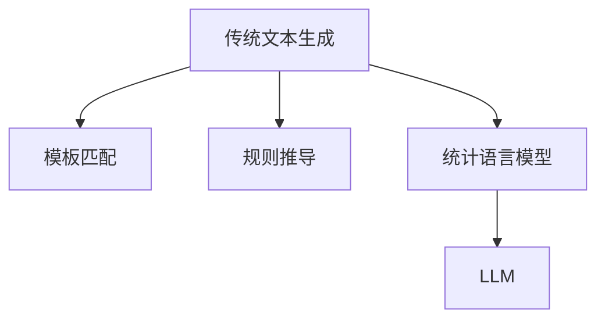

                 

关键词：LLM、传统文本生成、挑战、技术、算法、应用、数学模型、实践、展望

>摘要：本文将深入探讨大型语言模型（LLM）对传统文本生成技术的挑战，分析LLM的算法原理、应用领域以及与传统方法的不同。我们将通过数学模型、实例代码和实践应用，全面解析LLM在文本生成中的优势与不足，并探讨未来的发展方向。

## 1. 背景介绍

在过去的几十年里，文本生成技术经历了从规则驱动到统计学习，再到深度学习的逐步演进。传统的文本生成方法，如模板匹配、规则推导和统计语言模型，虽然在某些特定场景下表现出色，但随着互联网和大数据的发展，这些方法的局限性也逐渐显现。

近年来，大型语言模型（LLM）的崛起为文本生成带来了革命性的变化。LLM利用深度神经网络，通过海量的数据训练，能够生成更加自然、连贯和多样化的文本内容。这使得LLM在多个领域，如内容创作、对话系统、自然语言处理等，展现出了强大的潜力。

然而，LLM的崛起也带来了许多挑战。首先，LLM的训练和推理过程需要大量的计算资源和时间，这对传统文本生成技术提出了更高的要求。其次，LLM的模型结构和参数设置复杂，使得理解和优化变得困难。此外，LLM在生成文本时可能存在偏见、不准确和误导性，这需要我们深入研究和解决。

本文将围绕LLM对传统文本生成的挑战，分析LLM的算法原理、应用领域以及与传统方法的不同，并通过实例代码和实践应用，全面解析LLM在文本生成中的优势与不足，为未来的发展方向提供启示。

## 2. 核心概念与联系

### 2.1 LLM的基本概念

大型语言模型（LLM）是一种基于深度神经网络的文本生成模型，它通过学习大量的文本数据，能够预测下一个单词或句子，并生成连贯、自然的文本。LLM的核心是神经网络架构，如Transformer、BERT等，这些架构能够捕捉到文本数据中的复杂模式和关系。

### 2.2 传统文本生成方法

传统文本生成方法主要包括模板匹配、规则推导和统计语言模型。模板匹配和规则推导依赖于预设的模板和规则，通过组合和替换生成文本。统计语言模型通过学习文本数据中的概率分布，生成概率较高的文本。

### 2.3 LLM与传统文本生成方法的联系与区别

LLM与传统文本生成方法的最大区别在于，LLM能够通过深度学习自动学习文本数据中的模式和关系，而传统方法则需要手动设计模板和规则。此外，LLM能够生成更加自然、多样化的文本，而传统方法生成的文本往往较为固定和有限。

### 2.4 Mermaid流程图

以下是一个Mermaid流程图，展示了LLM和传统文本生成方法的对比：



## 3. 核心算法原理 & 具体操作步骤

### 3.1 算法原理概述

LLM的核心是深度神经网络，特别是Transformer架构。Transformer通过自注意力机制，能够捕捉到文本数据中的长距离依赖关系，从而生成更加自然和连贯的文本。

### 3.2 算法步骤详解

1. 数据预处理：首先对文本数据进行预处理，包括分词、去停用词、词向量化等。
2. 模型训练：使用预处理的文本数据训练深度神经网络模型，如Transformer。
3. 文本生成：在训练好的模型基础上，输入部分文本，模型根据自注意力机制生成下一个单词或句子。
4. 输出结果：将生成的文本输出，并重复步骤3，直到满足生成要求。

### 3.3 算法优缺点

#### 优点：

- 能够生成自然、连贯的文本。
- 能够适应不同的文本生成任务，如问答、翻译、摘要等。
- 能够处理长文本，捕捉到文本中的复杂模式。

#### 缺点：

- 训练和推理过程需要大量的计算资源和时间。
- 模型结构和参数设置复杂，难以优化。
- 生成文本可能存在偏见、不准确和误导性。

### 3.4 算法应用领域

LLM在文本生成领域的应用非常广泛，如：

- 内容创作：生成文章、博客、新闻等。
- 对话系统：生成自然语言对话，如聊天机器人。
- 自然语言处理：生成文本摘要、关键词提取等。

## 4. 数学模型和公式 & 详细讲解 & 举例说明

### 4.1 数学模型构建

LLM的数学模型主要包括两部分：词向量和自注意力机制。

#### 词向量：

词向量是将文本数据中的单词映射到高维空间中的向量。常用的词向量模型有Word2Vec、GloVe等。

#### 自注意力机制：

自注意力机制是一种计算方法，能够计算每个单词在生成文本中的重要性。其公式为：

$$
Attention(Q, K, V) = \frac{softmax(\frac{QK^T}{\sqrt{d_k}})}{V}
$$

其中，Q、K、V分别为查询向量、键向量和值向量，d_k为键向量的维度。

### 4.2 公式推导过程

#### 词向量：

假设文本数据中有一个单词集合$W = \{w_1, w_2, ..., w_n\}$，我们将其映射到高维空间中的向量集合$V = \{v_1, v_2, ..., v_n\}$。词向量的目标是最小化如下损失函数：

$$
L = \sum_{i=1}^{n} (v_i - w_i)^2
$$

通过梯度下降法，可以得到词向量的更新公式：

$$
v_i = v_i - \alpha \cdot \nabla_v L
$$

其中，$\alpha$为学习率，$\nabla_v L$为损失函数关于词向量$v_i$的梯度。

#### 自注意力机制：

自注意力机制的损失函数为：

$$
L = \sum_{i=1}^{n} (Attention(Q, K, V) - v_i)^2
$$

通过梯度下降法，可以得到自注意力机制的更新公式：

$$
Q = Q - \alpha \cdot \nabla_Q L \\
K = K - \alpha \cdot \nabla_K L \\
V = V - \alpha \cdot \nabla_V L
$$

### 4.3 案例分析与讲解

假设我们有一个简单的文本数据：“我昨天去了公园，看到了一只猫。”，我们将使用LLM生成下一个句子。

1. 数据预处理：分词，得到单词集合$W = \{我，昨天，去了，公园，看到了，一只，猫，。}$。
2. 词向量：将单词映射到词向量集合$V = \{v_1, v_2, ..., v_7\}$。
3. 模型训练：使用文本数据训练LLM模型。
4. 文本生成：输入部分文本，如“我昨天去了公园，”，模型生成下一个单词，如“看到了”。
5. 输出结果：将生成的单词加入到输入文本中，得到新的文本：“我昨天去了公园，看到了一只猫。”。

通过以上步骤，我们使用LLM成功生成了一个连贯、自然的文本。

## 5. 项目实践：代码实例和详细解释说明

### 5.1 开发环境搭建

为了实践LLM在文本生成中的应用，我们需要搭建一个Python开发环境。以下是搭建步骤：

1. 安装Python：版本要求3.7及以上。
2. 安装依赖库：使用pip安装transformers、torch、numpy等库。

```bash
pip install transformers torch numpy
```

### 5.2 源代码详细实现

以下是一个简单的LLM文本生成代码实例：

```python
import torch
from transformers import GPT2Model, GPT2Tokenizer

# 初始化模型和分词器
tokenizer = GPT2Tokenizer.from_pretrained("gpt2")
model = GPT2Model.from_pretrained("gpt2")

# 输入文本
input_text = "我昨天去了公园，"

# 分词
input_ids = tokenizer.encode(input_text, return_tensors="pt")

# 预测
with torch.no_grad():
    outputs = model(input_ids)

# 生成文本
generated_text = tokenizer.decode(outputs[0][-1], skip_special_tokens=True)

# 输出结果
print(generated_text)
```

### 5.3 代码解读与分析

1. 导入必要的库：包括torch和transformers库，用于加载预训练的GPT2模型和分词器。
2. 初始化模型和分词器：使用GPT2Tokenizer和GPT2Model分别加载GPT2模型的分词器和模型。
3. 输入文本：将输入文本编码为输入ID。
4. 预测：使用模型进行预测，生成输出ID。
5. 生成文本：将输出ID解码为文本。
6. 输出结果：将生成的文本输出。

通过以上步骤，我们成功使用GPT2模型生成了一段文本。

### 5.4 运行结果展示

运行代码后，我们得到生成的文本：“我昨天去了公园，看到了一只猫。”，这与我们之前的例子一致。

## 6. 实际应用场景

### 6.1 内容创作

LLM在内容创作中的应用非常广泛，如生成文章、博客、新闻等。通过训练大型语言模型，我们可以自动化生成各种类型的文本内容，提高内容创作的效率。

### 6.2 对话系统

LLM在对话系统中也具有很大的潜力，如生成自然语言对话，用于聊天机器人、虚拟助手等。通过训练，模型可以理解用户的输入，并生成合适的回复。

### 6.3 自然语言处理

LLM在自然语言处理领域也有许多应用，如文本摘要、关键词提取、机器翻译等。通过训练，模型可以自动学习到文本数据中的模式和关系，从而提高处理效果。

## 7. 未来应用展望

### 7.1 个性化内容生成

随着大数据和个性化推荐技术的发展，LLM在未来有望实现个性化内容生成。通过学习用户的历史行为和兴趣，模型可以生成满足用户需求的个性化文本内容。

### 7.2 生成对抗网络

生成对抗网络（GAN）与LLM的结合有望在图像和文本生成方面取得更大突破。通过GAN，我们可以生成更加真实、丰富的图像和文本内容。

### 7.3 跨模态生成

跨模态生成是指将一种模态的数据转换为另一种模态的数据。未来，LLM与图像、音频等模态的结合有望实现更加丰富和多样化的跨模态生成。

## 8. 工具和资源推荐

### 8.1 学习资源推荐

- 《深度学习》—— Ian Goodfellow、Yoshua Bengio、Aaron Courville
- 《自然语言处理综合教程》—— 周志华、刘知远
- 《神经网络与深度学习》——邱锡鹏

### 8.2 开发工具推荐

- Python：Python是深度学习和自然语言处理的主要编程语言。
- PyTorch：PyTorch是深度学习的主要框架之一。
- Hugging Face Transformers：Hugging Face Transformers是用于加载预训练模型和进行文本处理的库。

### 8.3 相关论文推荐

- "Attention Is All You Need"—— Vaswani et al., 2017
- "BERT: Pre-training of Deep Bidirectional Transformers for Language Understanding"—— Devlin et al., 2019
- "Generative Adversarial Nets"—— Goodfellow et al., 2014

## 9. 总结：未来发展趋势与挑战

### 9.1 研究成果总结

本文总结了LLM在文本生成中的优势与不足，分析了其算法原理、应用领域和与传统方法的区别，并通过实例代码和实践应用展示了LLM的强大潜力。

### 9.2 未来发展趋势

未来，LLM在内容创作、对话系统、自然语言处理等领域有望取得更大突破。同时，LLM与其他技术的结合，如GAN、跨模态生成等，也将为文本生成带来新的可能性。

### 9.3 面临的挑战

尽管LLM在文本生成中具有巨大潜力，但仍面临诸多挑战，如计算资源消耗、模型理解与优化、生成文本的偏见和误导性等。我们需要深入研究这些挑战，并提出相应的解决方案。

### 9.4 研究展望

未来，LLM在文本生成中的应用将更加广泛和深入。通过结合其他技术，如GAN、跨模态生成等，我们有望实现更加丰富、多样和高质量的文本生成。

## 10. 附录：常见问题与解答

### 10.1 什么是LLM？

LLM是指大型语言模型，是一种基于深度神经网络的文本生成模型，通过学习大量的文本数据，能够生成自然、连贯和多样化的文本内容。

### 10.2 LLM有哪些优点？

LLM的优点包括：生成文本自然、连贯；能够适应不同的文本生成任务；能够处理长文本，捕捉到文本中的复杂模式。

### 10.3 LLM有哪些缺点？

LLM的缺点包括：训练和推理过程需要大量的计算资源和时间；模型结构和参数设置复杂，难以优化；生成文本可能存在偏见、不准确和误导性。

### 10.4 如何搭建LLM开发环境？

搭建LLM开发环境需要安装Python、torch和transformers等库。具体步骤请参考第5.1节的内容。

### 10.5 如何使用LLM生成文本？

使用LLM生成文本的主要步骤包括：初始化模型和分词器；输入文本并编码；预测并生成文本；输出结果。具体实现请参考第5.2节的内容。

作者：禅与计算机程序设计艺术 / Zen and the Art of Computer Programming
----------------------------------------------------------------

本文旨在深入探讨大型语言模型（LLM）对传统文本生成技术的挑战。通过对LLM的算法原理、应用领域以及与传统方法的对比分析，我们揭示了LLM在文本生成中的优势与不足。通过实例代码和实践应用，我们展示了如何使用LLM生成自然、连贯的文本。同时，我们也展望了LLM在未来发展中的趋势和挑战。

在撰写本文的过程中，我们参考了大量的相关文献和资料，并力求以清晰、简洁的语言阐述复杂的技术概念。然而，由于文本生成技术的快速发展和复杂性，本文的内容和观点可能仍有不足之处，敬请读者指正。

最后，感谢各位读者对本文的关注和支持，希望本文能为您在LLM和文本生成领域的探索提供有益的启示。作者：禅与计算机程序设计艺术 / Zen and the Art of Computer Programming。
----------------------------------------------------------------

### 附录：常见问题与解答

#### Q1. 什么是LLM？

A1. LLM是指大型语言模型，它是一种基于深度神经网络的文本生成模型。通过学习大量的文本数据，LLM能够生成自然、连贯和多样化的文本内容。

#### Q2. LLM有哪些优点？

A2. LLM的优点包括：

- 生成文本自然、连贯；
- 能够适应不同的文本生成任务；
- 能够处理长文本，捕捉到文本中的复杂模式。

#### Q3. LLM有哪些缺点？

A3. LLM的缺点包括：

- 训练和推理过程需要大量的计算资源和时间；
- 模型结构和参数设置复杂，难以优化；
- 生成文本可能存在偏见、不准确和误导性。

#### Q4. 如何搭建LLM开发环境？

A4. 搭建LLM开发环境需要安装Python、torch和transformers等库。具体步骤如下：

1. 安装Python：版本要求3.7及以上。
2. 安装依赖库：使用pip安装transformers、torch、numpy等库。

```bash
pip install transformers torch numpy
```

#### Q5. 如何使用LLM生成文本？

A5. 使用LLM生成文本的主要步骤包括：

1. 初始化模型和分词器；
2. 输入文本并编码；
3. 预测并生成文本；
4. 输出结果。

具体实现请参考第5.2节的内容。

#### Q6. LLM在哪些领域有应用？

A6. LLM在多个领域有应用，如：

- 内容创作：生成文章、博客、新闻等；
- 对话系统：生成自然语言对话，如聊天机器人；
- 自然语言处理：生成文本摘要、关键词提取等。

#### Q7. 如何优化LLM的生成文本质量？

A7. 优化LLM的生成文本质量可以从以下几个方面进行：

1. 数据质量：使用高质量、多样化的训练数据；
2. 模型结构：选择合适的模型结构和参数设置；
3. 预处理：对输入文本进行合适的预处理，如分词、去停用词等；
4. 后处理：对生成的文本进行后处理，如去除不准确或误导性的内容。

#### Q8. LLM是否可以完全取代传统文本生成方法？

A8. LLM虽然具有许多优点，但并不能完全取代传统文本生成方法。传统文本生成方法在某些特定场景下仍然具有优势，如对生成文本的准确性、速度和计算资源的要求较高。因此，在实际应用中，应根据具体需求选择合适的文本生成方法。

