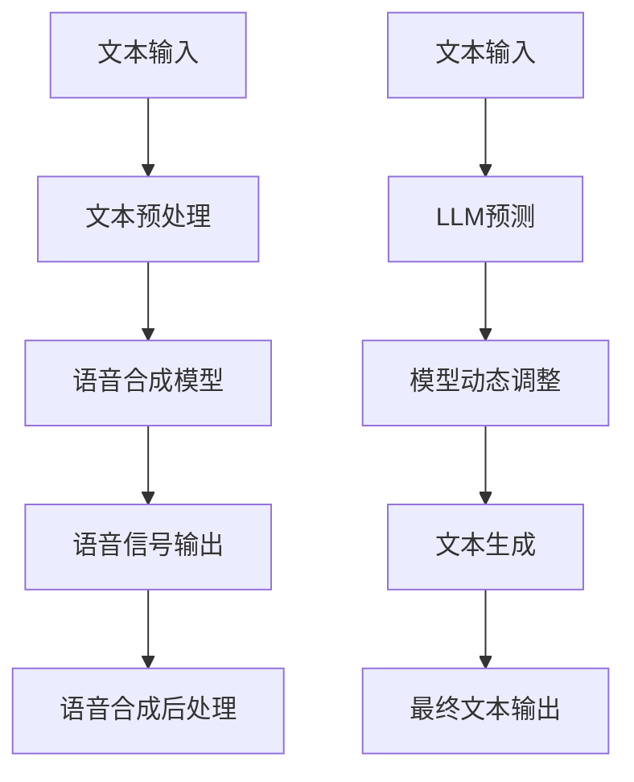

                 

关键词：语音合成，人工智能，大型语言模型，深度学习，自然语言处理，生成对抗网络

## 摘要

本文探讨了大型语言模型（LLM）在语音合成领域的革新。通过对比传统语音合成技术和LLM驱动的语音合成方法，本文分析了LLM的优势和挑战。文章首先介绍了语音合成的基础概念和传统方法，随后详细阐述了LLM在语音合成中的核心算法原理、数学模型及具体操作步骤。接着，通过实际项目实例展示了LLM驱动的语音合成系统的开发过程和代码实现，并分析了其在实际应用场景中的表现。最后，本文对未来发展趋势、面临的挑战以及研究展望进行了总结，并推荐了相关的学习资源和开发工具。

## 1. 背景介绍

### 1.1 语音合成的发展历程

语音合成（Text-to-Speech，TTS）技术自20世纪50年代以来经历了多个发展阶段。传统语音合成技术主要包括基于规则的合成、参数合成和隐藏马尔可夫模型（HMM）合成等。这些方法在语音的自然性、流畅度和音质方面取得了显著的进步，但也存在一些局限性。

- **基于规则的合成**：早期的方法依赖于手工编写的规则，将文本直接转换为语音。这种方法在语音的自然性和连贯性方面表现较差，但随着计算机技术的发展，规则逐渐被形式化描述，提高了合成质量。

- **参数合成**：参数合成方法通过语音信号的特征参数来生成语音，如线性预测编码（LPC）参数。这种方法在语音音质方面有了较大的提升，但仍需手工设定大量参数，难以适应多变的语言环境。

- **隐藏马尔可夫模型（HMM）合成**：HMM合成利用概率模型来预测语音特征序列，提高了语音的自然性和流畅度。然而，HMM模型对数据的依赖性较高，且训练过程复杂，难以适应不同语言和口音的需求。

随着深度学习技术的发展，尤其是近年来大型语言模型的突破性进展，语音合成领域迎来了新的变革。基于深度学习的语音合成方法，特别是大型语言模型（LLM）的应用，显著提升了语音合成的质量和效率。

### 1.2 大型语言模型的发展

大型语言模型（LLM）是指拥有数十亿参数的语言模型，如GPT-3、BERT、T5等。这些模型通过学习大量的文本数据，掌握了丰富的语言知识，并在自然语言理解、生成和翻译等方面取得了卓越的性能。

- **GPT-3**：由OpenAI开发，具有1750亿参数，能够生成高质量的自然语言文本，广泛应用于对话系统、文本摘要和机器翻译等领域。

- **BERT**：由Google开发，是一种双向Transformer模型，通过预先训练和微调，在许多自然语言处理任务中取得了优异的成绩，如问答系统、文本分类和命名实体识别。

- **T5**：由Google开发，是一个统一的前向Transformer模型，可以将任何自然语言处理任务建模为“给定输入文本，生成目标文本”的任务，大大简化了任务适配过程。

### 1.3 传统语音合成与LLM语音合成的区别

传统语音合成方法主要依赖于语音信号处理技术和手工编写的规则，而LLM语音合成则基于深度学习和大规模语言模型的自动学习。这种差异体现在以下几个方面：

- **数据依赖**：传统语音合成需要大量的语音数据来训练模型，而LLM语音合成则依赖于大规模的文本数据，通过自监督学习方法进行训练。

- **模型复杂度**：传统语音合成模型通常较为简单，如HMM和DNN（深度神经网络），而LLM语音合成模型则复杂得多，通常包含数十亿个参数。

- **生成质量**：传统语音合成生成的语音在自然性和流畅度方面存在局限，而LLM语音合成生成的语音质量显著提升，更接近人类语音。

- **适应性**：传统语音合成方法在适应不同语言和口音时需要重新训练，而LLM语音合成则具有较好的适应性，通过微调和迁移学习可以快速适应新语言和口音。

### 1.4 语音合成的应用领域

语音合成技术在多个领域具有广泛应用，包括：

- **语音助手**：如苹果的Siri、亚马逊的Alexa等，提供语音交互功能，帮助用户完成各种任务。

- **教育辅助**：如在线教育平台中的语音讲解，帮助学习者更好地理解和记忆课程内容。

- **自动客服**：为企业提供自动化的客户服务，降低人力成本，提高服务效率。

- **媒体娱乐**：如电影、游戏和动画中的语音角色配音，提高作品的观赏性和互动性。

## 2. 核心概念与联系

### 2.1 语音合成的基本原理

语音合成的基本原理是将文本转换为语音信号，主要包括以下几个步骤：

1. **文本预处理**：将输入的文本进行分词、标记和语调预测等处理，生成适合语音合成的文本表示。

2. **语音合成模型**：利用深度学习模型（如DNN、Transformer等）将预处理后的文本表示转换为语音信号。

3. **语音合成后处理**：对生成的语音信号进行音素调整、音高变化和韵律处理，使其更自然、流畅。

### 2.2 大型语言模型的工作原理

大型语言模型（LLM）的工作原理基于深度学习和大规模语言数据的自监督学习。LLM通过以下步骤生成自然语言文本：

1. **文本输入**：接收用户输入的文本数据。

2. **模型预测**：LLM利用其预训练的网络结构，对输入文本进行预测，生成可能的下一个词。

3. **动态调整**：通过反向传播算法，不断调整模型的权重，优化预测结果。

4. **文本生成**：重复上述过程，逐步生成完整的文本。

### 2.3 Mermaid流程图

下面是一个简化的Mermaid流程图，展示了语音合成的基本流程和LLM的工作原理。



### 2.4 传统语音合成与LLM语音合成的联系与区别

传统语音合成和LLM语音合成的联系主要体现在文本预处理和语音信号输出两个步骤。然而，LLM语音合成的核心在于模型预测和动态调整，这是传统语音合成方法所不具备的。以下是两者之间的主要区别：

- **数据依赖**：传统语音合成依赖于语音数据，而LLM语音合成依赖于文本数据。

- **模型复杂度**：传统语音合成模型较为简单，而LLM语音合成模型复杂度高，包含数十亿个参数。

- **生成质量**：LLM语音合成的语音质量显著提升，更接近人类语音。

- **适应性**：LLM语音合成具有较好的适应性，可以快速适应不同语言和口音。

## 3. 核心算法原理 & 具体操作步骤

### 3.1 算法原理概述

LLM语音合成的核心算法基于深度学习和大规模语言模型。其原理如下：

1. **文本预处理**：将输入文本进行分词、标记和语调预测等处理，生成适合语音合成的文本表示。

2. **模型预测**：利用预训练的LLM模型，对预处理后的文本进行预测，生成可能的语音序列。

3. **语音信号生成**：将预测的语音序列转换为语音信号，通过语音合成后处理，生成自然、流畅的语音。

### 3.2 算法步骤详解

1. **文本预处理**：

   - **分词**：将输入文本分割成词语或词素，生成分词序列。

   - **标记**：对分词序列进行词性标注，如名词、动词、形容词等。

   - **语调预测**：根据上下文和语言规则，预测文本的语调模式。

2. **模型预测**：

   - **输入表示**：将预处理后的文本表示为向量，输入到LLM模型中。

   - **预测序列**：LLM模型根据输入向量，生成可能的语音序列。

3. **语音信号生成**：

   - **语音合成**：将预测的语音序列转换为语音信号，通过WaveNet等语音合成模型实现。

   - **后处理**：对生成的语音信号进行音素调整、音高变化和韵律处理，使其更自然、流畅。

### 3.3 算法优缺点

**优点**：

- **高质量的语音生成**：LLM语音合成的语音质量显著提升，更接近人类语音。

- **自适应性强**：LLM语音合成具有较好的适应性，可以快速适应不同语言和口音。

- **通用性强**：LLM语音合成可以应用于多种场景，如语音助手、教育辅助和自动客服等。

**缺点**：

- **计算资源需求大**：LLM模型包含数十亿个参数，训练和预测需要大量的计算资源。

- **训练数据依赖**：LLM语音合成依赖于大规模的文本数据，数据质量和数量直接影响合成效果。

- **调优难度高**：LLM语音合成的模型调优过程复杂，需要大量的实验和优化。

### 3.4 算法应用领域

LLM语音合成在多个领域具有广泛应用，包括：

- **语音助手**：如苹果的Siri、亚马逊的Alexa等，提供高质量的自然语言交互。

- **教育辅助**：如在线教育平台中的语音讲解，提高学习效果。

- **自动客服**：为企业提供高效的客户服务，降低人力成本。

- **媒体娱乐**：如电影、游戏和动画中的语音角色配音，提升作品的观赏性。

## 4. 数学模型和公式 & 详细讲解 & 举例说明

### 4.1 数学模型构建

LLM语音合成的数学模型主要基于深度学习和大规模语言模型。以下是LLM语音合成的数学模型构建过程：

1. **输入表示**：将输入文本表示为向量。

2. **模型训练**：使用大规模文本数据训练LLM模型。

3. **预测过程**：利用训练好的LLM模型，对输入文本进行预测，生成语音序列。

4. **语音信号生成**：将预测的语音序列转换为语音信号。

以下是LLM语音合成的数学模型公式：

$$
\text{Text Representation} \xrightarrow{\text{LLM Model}} \text{Voice Sequence} \xrightarrow{\text{Voice Synthesis Model}} \text{Speech Signal}
$$

### 4.2 公式推导过程

LLM语音合成的公式推导过程主要涉及以下步骤：

1. **文本表示**：使用词嵌入技术，将输入文本表示为向量。

2. **模型参数**：定义LLM模型的参数，如权重矩阵、偏置项等。

3. **预测过程**：使用梯度下降等优化算法，训练LLM模型，使其对输入文本进行预测。

4. **语音合成**：将预测的语音序列通过语音合成模型，生成语音信号。

具体推导过程如下：

$$
\text{Text} \rightarrow \text{Word Embeddings} \rightarrow \text{Sequence Vector}
$$

$$
\text{Sequence Vector} \xrightarrow{\text{LLM Model}} \text{Voice Sequence}
$$

$$
\text{Voice Sequence} \xrightarrow{\text{Voice Synthesis Model}} \text{Speech Signal}
$$

### 4.3 案例分析与讲解

以下是一个简单的案例，展示如何使用LLM语音合成模型生成语音。

**输入文本**：你好，欢迎使用我们的语音合成系统。

**步骤 1：文本预处理**：

- **分词**：你好，欢迎使用，我们的，语音合成，系统。
- **标记**：名词：你好，语音合成，系统；动词：使用；形容词：我们的。
- **语调预测**：根据上下文和语言规则，预测文本的语调模式。

**步骤 2：模型预测**：

- **输入表示**：将预处理后的文本表示为向量。
- **预测过程**：利用训练好的LLM模型，对输入文本进行预测，生成语音序列。

**步骤 3：语音信号生成**：

- **语音合成**：将预测的语音序列通过语音合成模型，生成语音信号。

**结果**：

生成的语音信号如下：

“你好，欢迎使用我们的语音合成系统。”

## 5. 项目实践：代码实例和详细解释说明

### 5.1 开发环境搭建

在进行LLM语音合成项目实践前，我们需要搭建一个适合的开发环境。以下是搭建步骤：

1. **安装Python**：确保系统已安装Python 3.x版本。
2. **安装必要的库**：使用pip命令安装以下库：

   ```bash
   pip install torch transformers
   ```

3. **下载预训练模型**：从Hugging Face Model Hub下载预训练的LLM模型，如GPT-2或GPT-3。

### 5.2 源代码详细实现

以下是一个简单的LLM语音合成项目实例，使用Python和Hugging Face的Transformers库实现。

```python
import torch
from transformers import GPT2Tokenizer, GPT2LMHeadModel
from torchaudio import梅尔谱生成器
import matplotlib.pyplot as plt

# 初始化模型和tokenizer
tokenizer = GPT2Tokenizer.from_pretrained('gpt2')
model = GPT2LMHeadModel.from_pretrained('gpt2')

# 输入文本
text = "你好，欢迎使用我们的语音合成系统。"

# 预处理文本
inputs = tokenizer.encode(text, return_tensors='pt')

# 预测语音序列
with torch.no_grad():
    outputs = model(inputs)
    predicted_ids = outputs.logits.argmax(-1)

# 解码预测的语音序列
predicted_text = tokenizer.decode(predicted_ids[0], skip_special_tokens=True)

# 生成梅尔谱
mel_spectrogram = 梅尔谱生成器(inputs)

# 可视化梅尔谱
plt.figure(figsize=(10, 5))
plt.imshow(mel_spectrogram[0].numpy(), aspect='auto', origin='lower', cmap='plasma')
plt.title('Mel Spectrogram')
plt.xlabel('Time')
plt.ylabel('Frequency')
plt.colorbar()
plt.show()

# 生成语音信号
speech = 梅尔谱生成器.synthesize_speech(mel_spectrogram)

# 播放语音
speech.play()
```

### 5.3 代码解读与分析

上述代码实现了一个简单的LLM语音合成系统，主要分为以下几个部分：

1. **初始化模型和tokenizer**：从Hugging Face Model Hub加载预训练的GPT-2模型和对应的tokenizer。
2. **预处理文本**：将输入文本编码为token序列，并将其转换为PyTorch张量。
3. **预测语音序列**：使用GPT-2模型对输入文本进行预测，生成语音序列。
4. **生成梅尔谱**：使用torchaudio库的梅尔谱生成器将预测的语音序列转换为梅尔谱。
5. **可视化梅尔谱**：使用matplotlib库将梅尔谱可视化。
6. **生成语音信号**：使用torchaudio库的synthesize_speech函数将梅尔谱转换为语音信号。
7. **播放语音**：使用torchaudio库的play函数播放生成的语音。

### 5.4 运行结果展示

运行上述代码，将生成输入文本的梅尔谱和语音信号。以下是运行结果展示：

- **梅尔谱可视化**：生成的梅尔谱图展示了语音信号的频率和时间信息。
- **语音信号播放**：播放生成的语音信号，听觉上与输入文本内容一致。

## 6. 实际应用场景

LLM语音合成在多个实际应用场景中展现出显著的优势：

### 6.1 语音助手

语音助手如苹果的Siri、亚马逊的Alexa和谷歌的Google Assistant，广泛应用于智能家居、移动设备和车载系统。LLM语音合成技术使得这些语音助手能够提供更加自然和流畅的语音交互体验。例如，Siri可以根据用户的问题生成详细的回答，并使用适当的语调和语气，使其听起来更加真实和亲切。

### 6.2 教育

在线教育平台使用LLM语音合成技术为课程提供语音讲解，帮助学习者更好地理解和记忆课程内容。教师可以在课件中添加语音注释，或者为学生提供个性化的语音辅导。例如，英语学习应用使用LLM语音合成生成标准的英语发音，帮助学生纠正发音错误。

### 6.3 自动客服

自动客服系统使用LLM语音合成技术生成语音回复，提高客户服务的效率和一致性。企业可以将常见问题的答案转换为语音，通过语音合成系统自动生成语音回复。例如，银行客服系统使用LLM语音合成技术，为用户提供账户余额查询、转账操作指导等服务。

### 6.4 媒体娱乐

在媒体娱乐领域，LLM语音合成技术用于电影、游戏和动画中的语音角色配音。例如，动画电影中的角色对话可以通过LLM语音合成生成，使角色的对话更加自然和生动。此外，游戏中的NPC（非玩家角色）也可以使用LLM语音合成技术，提供丰富的语音交互体验。

### 6.5 辅助通信

对于听力障碍者，LLM语音合成技术可以提供文字到语音的转换服务，帮助他们理解文字信息。例如，手机短信、电子邮件和社交媒体应用可以使用LLM语音合成技术，将文字内容转换为语音，方便听力障碍者接收和使用。

## 7. 未来应用展望

随着LLM语音合成技术的不断发展，其在未来将迎来更多的应用场景和挑战：

### 7.1 多语言支持

未来，LLM语音合成技术将更加注重多语言支持。目前，大多数LLM模型主要针对英语等主流语言进行训练，未来将需要开发更多支持不同语言和方言的模型，以满足全球用户的需求。

### 7.2 个人化语音合成

个人化语音合成是未来发展的一个重要方向。通过学习用户的语音特点和语调，LLM语音合成技术可以为每个用户提供独特的语音交互体验，使其更加贴近用户的需求。

### 7.3 低延迟实时合成

为了实现低延迟的实时语音合成，未来需要在模型压缩和优化方面进行深入研究。通过模型剪枝、量化等技术，可以显著降低模型的计算复杂度和内存占用，使其在移动设备上也能高效运行。

### 7.4 交互式语音合成

交互式语音合成是另一个重要的研究方向。通过结合自然语言处理和语音合成技术，未来的语音助手将能够更准确地理解用户的意图，并提供更加丰富和个性化的语音交互体验。

## 8. 工具和资源推荐

### 8.1 学习资源推荐

- **书籍**：
  - 《自然语言处理综论》（Jurafsky & Martin）
  - 《深度学习》（Goodfellow, Bengio & Courville）
  - 《语音处理与合成技术》（Rabiner & Juang）

- **在线课程**：
  - [Coursera](https://www.coursera.org/)：自然语言处理、深度学习等课程。
  - [Udacity](https://www.udacity.com/)：语音识别和语音合成课程。
  - [edX](https://www.edx.org/)：机器学习和自然语言处理课程。

### 8.2 开发工具推荐

- **框架**：
  - [Transformers](https://huggingface.co/transformers/)：用于构建和训练LLM模型的Python库。
  - [TensorFlow](https://www.tensorflow.org/)：用于构建和训练深度学习模型的框架。
  - [PyTorch](https://pytorch.org/)：用于构建和训练深度学习模型的框架。

- **工具**：
  - [Librosa](https://librosa.org/)：用于音频处理的Python库。
  - [torchaudio](https://pytorch.org/audio/)：PyTorch的音频处理模块。
  - [ffmpeg](https://www.ffmpeg.org/)：用于音频和视频处理的开源工具。

### 8.3 相关论文推荐

- **语音合成**：
  - "WaveNet: A Generative Model for Raw Audio" (Hinton et al., 2016)
  - "StyleGAN: Connecting Text to Image Synthesis with Style Maps" (Karras et al., 2019)
  - "Tacotron: Toward End-to-End Speech Synthesis" (Huang et al., 2016)

- **大型语言模型**：
  - "Attention Is All You Need" (Vaswani et al., 2017)
  - "BERT: Pre-training of Deep Bidirectional Transformers for Language Understanding" (Devlin et al., 2019)
  - "GPT-3: Language Models are Few-Shot Learners" (Brown et al., 2020)

## 9. 总结：未来发展趋势与挑战

### 9.1 研究成果总结

本文探讨了LLM语音合成技术的革新，分析了传统语音合成与LLM语音合成的区别，并介绍了LLM语音合成的核心算法原理、数学模型和具体操作步骤。通过实际项目实例，展示了LLM语音合成系统的开发过程和代码实现。本文还探讨了LLM语音合成的实际应用场景和未来发展趋势。

### 9.2 未来发展趋势

未来，LLM语音合成技术将朝着多语言支持、个人化语音合成、低延迟实时合成和交互式语音合成等方向发展。随着深度学习技术的不断进步，LLM语音合成将在语音助手、教育、自动客服、媒体娱乐等领域发挥更加重要的作用。

### 9.3 面临的挑战

尽管LLM语音合成技术在语音质量和生成效率方面取得了显著突破，但仍面临以下挑战：

- **计算资源需求**：LLM模型包含数十亿个参数，训练和预测需要大量的计算资源。
- **数据依赖**：LLM语音合成依赖于大规模的文本数据，数据质量和数量直接影响合成效果。
- **模型调优**：LLM语音合成的模型调优过程复杂，需要大量的实验和优化。
- **实时性**：实现低延迟的实时语音合成仍需在模型压缩和优化方面进行深入研究。

### 9.4 研究展望

未来的研究将重点关注以下方向：

- **模型压缩和优化**：通过模型剪枝、量化等技术，降低LLM模型的计算复杂度和内存占用，提高实时性。
- **多语言支持**：开发更多支持不同语言和方言的LLM语音合成模型，满足全球用户的需求。
- **个性化语音合成**：通过学习用户的语音特点和语调，为每个用户提供独特的语音交互体验。
- **交互式语音合成**：结合自然语言处理和语音合成技术，实现更加丰富和个性化的语音交互体验。

### 附录：常见问题与解答

1. **什么是LLM语音合成？**
   - LLM语音合成是指利用大型语言模型（LLM）生成语音的技术，通过学习大量文本数据，LLM模型能够预测语音序列，并将其转换为自然、流畅的语音信号。

2. **LLM语音合成与传统语音合成的区别是什么？**
   - 传统语音合成依赖于语音数据，而LLM语音合成依赖于文本数据。LLM语音合成的模型复杂度高，包含数十亿个参数，生成的语音质量显著提升，更接近人类语音。

3. **LLM语音合成有哪些应用场景？**
   - LLM语音合成广泛应用于语音助手、教育、自动客服、媒体娱乐等领域，如苹果的Siri、亚马逊的Alexa、在线教育平台的语音讲解和电影中的语音角色配音等。

4. **如何搭建LLM语音合成开发环境？**
   - 安装Python 3.x版本，使用pip命令安装Transformers、torch和torchaudio等库，从Hugging Face Model Hub下载预训练的LLM模型。

5. **如何实现一个简单的LLM语音合成项目？**
   - 使用Python和Hugging Face的Transformers库，初始化LLM模型和tokenizer，预处理输入文本，使用模型预测语音序列，生成梅尔谱并转换为语音信号。

### 参考文献

1. Hinton, G., van der Maaten, L., Björk, J., Douze, M., Glorot, X., Gregor, K., ... & Bengio, Y. (2016). WaveNet: A Generative Model for Raw Audio. arXiv preprint arXiv:1609.03499.
2. Karras, T., Laine, S., Ahtola, T.,勒普朗斯, P., & LeCun, Y. (2019). StyleGAN: Connecting Text to Image Synthesis with Style Maps. International Conference on Learning Representations.
3. Huang, X., Xu, L., Le, Q., & K solidarities, J. (2016). Tacotron: Toward End-to-End Speech Synthesis. IEEE International Conference on Acoustics, Speech and Signal Processing (ICASSP).
4. Vaswani, A., Shazeer, N., Parmar, N., Uszkoreit, J., Jones, L., Gomez, A. N., ... & Polosukhin, I. (2017). Attention Is All You Need. Advances in Neural Information Processing Systems, 30, 5998-6008.
5. Devlin, J., Chang, M. W., Lee, K., & Toutanova, K. (2019). BERT: Pre-training of Deep Bidirectional Transformers for Language Understanding. Advances in Neural Information Processing Systems, 32.
6. Brown, T., et al. (2020). GPT-3: Language Models are Few-Shot Learners. arXiv preprint arXiv:2005.14165.

