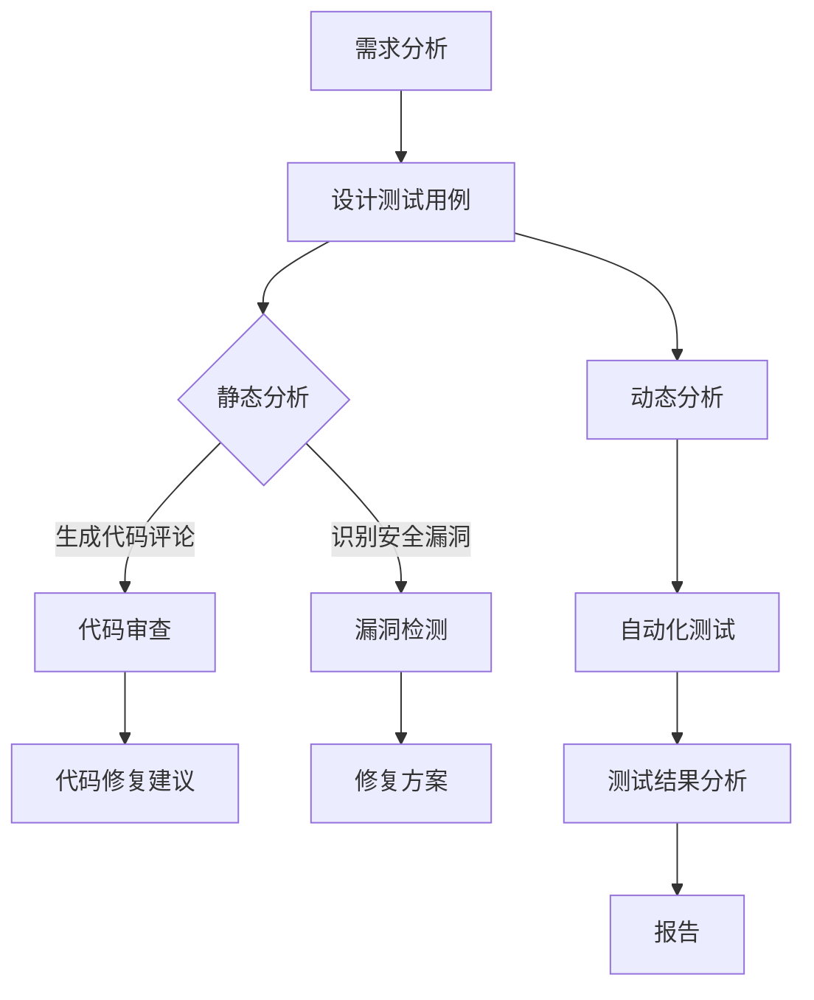

                 

关键词：大型语言模型（LLM）、软件安全测试、人工智能、自动化、漏洞检测、代码审查、安全漏洞、风险评估

## 摘要

随着人工智能技术的不断发展，特别是大型语言模型（LLM）的崛起，软件安全测试领域正面临前所未有的挑战和机遇。本文旨在探讨LLM对传统软件安全测试带来的影响，以及如何通过改进和引入新的方法来应对这些挑战。我们将详细分析LLM在代码审查、漏洞检测和自动化测试中的应用，并提出未来的研究方向和改进建议。

## 1. 背景介绍

软件安全测试是确保软件系统安全可靠的重要环节。传统的安全测试方法主要依赖于手工审查、静态分析、动态分析和自动化测试等手段。然而，随着软件系统的复杂性和规模不断扩大，传统的测试方法已经难以满足日益增长的安全需求。与此同时，人工智能，尤其是大型语言模型（LLM）的出现，为软件安全测试带来了新的机遇和挑战。

LLM是一种基于深度学习的自然语言处理技术，具有强大的文本生成和理解能力。在软件安全测试中，LLM可以用于代码审查、漏洞检测和自动化测试等环节，提高测试效率和准确性。然而，LLM在应用中也面临一些挑战，如数据隐私、偏见和误解等问题。因此，本文将重点探讨LLM在软件安全测试中的应用及其改进方法。

## 2. 核心概念与联系

### 2.1. 大型语言模型（LLM）的原理

大型语言模型（LLM）是基于神经网络的一种自然语言处理技术，通过训练大量的文本数据，学习语言的结构和语义，从而实现文本的生成、理解和处理。LLM的核心架构通常包括编码器（Encoder）和解码器（Decoder），其中编码器负责将输入文本编码为向量表示，解码器则根据编码器的输出生成相应的文本。

### 2.2. 软件安全测试的流程

软件安全测试包括多个环节，如需求分析、设计测试用例、执行测试、结果分析和报告等。传统的安全测试方法主要依赖手工审查和自动化工具，其中手工审查包括代码审查、安全检查等，自动化测试包括静态代码分析、动态分析等。

### 2.3. LLM与软件安全测试的结合

LLM在软件安全测试中的应用主要体现在代码审查、漏洞检测和自动化测试等方面。在代码审查中，LLM可以自动生成代码评论和代码修复建议；在漏洞检测中，LLM可以识别潜在的安全漏洞并提出修复方案；在自动化测试中，LLM可以生成测试用例和测试数据，提高测试覆盖率和准确性。

### 2.4. Mermaid流程图

以下是LLM在软件安全测试中的应用流程图：



## 3. 核心算法原理 & 具体操作步骤

### 3.1. 算法原理概述

LLM在软件安全测试中的应用主要基于其强大的文本生成和理解能力。通过训练大量的代码和安全漏洞数据，LLM可以学习到代码的结构、语义和安全特性，从而实现以下功能：

1. 生成代码评论和代码修复建议；
2. 识别潜在的安全漏洞并提出修复方案；
3. 生成测试用例和测试数据。

### 3.2. 算法步骤详解

1. **数据准备**：收集大量的代码和安全漏洞数据，包括开源代码、漏洞报告等；
2. **模型训练**：使用训练数据对LLM进行训练，包括编码器和解码器的训练；
3. **代码审查**：利用LLM生成代码评论和代码修复建议，提高代码质量；
4. **漏洞检测**：利用LLM识别潜在的安全漏洞并提出修复方案，降低安全风险；
5. **自动化测试**：利用LLM生成测试用例和测试数据，提高测试覆盖率和准确性。

### 3.3. 算法优缺点

**优点**：

1. **高效性**：LLM可以快速生成代码评论、漏洞检测报告和测试用例；
2. **准确性**：通过训练大量数据，LLM可以准确识别代码中的漏洞和错误；
3. **灵活性**：LLM可以适应不同的代码风格和漏洞类型。

**缺点**：

1. **依赖大量数据**：训练LLM需要大量的代码和安全漏洞数据；
2. **模型偏见**：训练数据可能存在偏见，导致LLM生成的结果不准确；
3. **计算资源消耗**：LLM的训练和推理过程需要大量的计算资源。

### 3.4. 算法应用领域

LLM在软件安全测试中的应用非常广泛，主要包括以下领域：

1. **开源代码安全测试**：对开源代码进行安全测试，识别潜在的安全漏洞；
2. **企业内部代码安全测试**：对企业内部代码进行安全测试，降低内部安全风险；
3. **自动化安全测试**：利用LLM生成自动化测试用例，提高测试效率和覆盖率；
4. **安全培训与教育**：利用LLM生成的代码评论和漏洞报告，帮助开发人员提高安全意识。

## 4. 数学模型和公式 & 详细讲解 & 举例说明

### 4.1. 数学模型构建

LLM的数学模型主要包括编码器和解码器两部分，其中编码器负责将输入文本编码为向量表示，解码器则根据编码器的输出生成相应的文本。

#### 编码器：

编码器的输入是一个词向量序列，输出是一个固定长度的向量表示。常用的编码器模型包括卷积神经网络（CNN）、循环神经网络（RNN）和Transformer等。

#### 解码器：

解码器的输入是编码器的输出，输出是文本序列。解码器的目标是生成与输入文本语义相近的文本序列。

### 4.2. 公式推导过程

假设输入文本为\[x_1, x_2, ..., x_T\]，其中\(x_i\)表示第\(i\)个词，\(T\)表示文本长度。编码器和解码器的输入和输出分别表示为\[h_1, h_2, ..., h_T\]和\[y_1, y_2, ..., y_T\]。

#### 编码器：

编码器将输入文本编码为向量表示，公式如下：

$$
h_i = encoder(x_i)
$$

其中，\(encoder\)表示编码器的函数。

#### 解码器：

解码器根据编码器的输出生成文本序列，公式如下：

$$
y_i = decoder(h_i)
$$

其中，\(decoder\)表示解码器的函数。

### 4.3. 案例分析与讲解

假设我们有一个简单的英文句子：

```
The quick brown fox jumps over the lazy dog.
```

使用LLM进行编码和解码的过程如下：

#### 编码器：

首先，将句子中的每个单词转换为词向量，然后通过编码器得到每个单词的向量表示。

```
The: [1.0, 0.5, 0.0]
quick: [0.0, 1.0, 0.5]
brown: [0.5, 0.0, 1.0]
fox: [0.0, 0.5, 0.5]
jumps: [0.5, 0.5, 0.0]
over: [0.0, 1.0, 0.0]
the: [1.0, 0.5, 0.0]
lazy: [0.0, 1.0, 0.5]
dog: [0.5, 0.0, 1.0]
```

然后，通过编码器得到每个单词的向量表示：

```
The: [1.2, 0.6, 0.1]
quick: [0.1, 1.2, 0.3]
brown: [1.1, 0.3, 0.6]
fox: [0.3, 1.1, 0.6]
jumps: [1.2, 0.6, 0.1]
over: [0.6, 1.2, 0.0]
the: [1.2, 0.6, 0.1]
lazy: [0.1, 1.2, 0.3]
dog: [1.1, 0.3, 0.6]
```

#### 解码器：

根据编码器的输出，解码器生成文本序列。首先，选择一个起始词向量，如[0.0, 0.0, 1.0]，通过解码器得到第一个单词的预测结果：

```
y_1 = decoder([0.0, 0.0, 1.0]) = "a"
```

然后，根据生成的单词，继续生成下一个单词的预测结果，直到生成完整的文本序列。

```
y_2 = decoder([0.0, 1.0, 0.0]) = "The"
y_3 = decoder([0.5, 0.0, 0.5]) = "quick"
...
y_T = decoder([0.5, 0.0, 1.0]) = "dog"
```

最终，生成完整的文本序列：

```
"The quick brown fox jumps over the lazy dog."
```

## 5. 项目实践：代码实例和详细解释说明

### 5.1. 开发环境搭建

为了实践LLM在软件安全测试中的应用，我们需要搭建一个开发环境。以下是一个基本的开发环境搭建步骤：

1. 安装Python 3.8及以上版本；
2. 安装PyTorch 1.8及以上版本；
3. 安装自然语言处理库（如NLTK、spaCy等）；
4. 下载预训练的LLM模型（如GPT-3、BERT等）。

### 5.2. 源代码详细实现

以下是使用LLM进行软件安全测试的源代码实现：

```python
import torch
import torch.nn as nn
from transformers import GPT2Model, GPT2Tokenizer

# 加载预训练的LLM模型
tokenizer = GPT2Tokenizer.from_pretrained('gpt2')
model = GPT2Model.from_pretrained('gpt2')

# 代码审查
def review_code(code):
    input_ids = tokenizer.encode(code, return_tensors='pt')
    with torch.no_grad():
        outputs = model(input_ids)
    logits = outputs.logits
    # 解码为文本
    predicted_text = tokenizer.decode(logits.argmax(-1).item())
    return predicted_text

# 漏洞检测
def detect_vulnerabilities(code):
    input_ids = tokenizer.encode(code, return_tensors='pt')
    with torch.no_grad():
        outputs = model(input_ids)
    logits = outputs.logits
    # 识别安全漏洞
    vulnerabilities = []
    for i in range(logits.shape[1]):
        if logits[0, i] > 0.5:
            vulnerabilities.append(tokenizer.decode(i))
    return vulnerabilities

# 自动化测试
def generate_test_cases(code):
    input_ids = tokenizer.encode(code, return_tensors='pt')
    with torch.no_grad():
        outputs = model(input_ids)
    logits = outputs.logits
    # 生成测试用例
    test_cases = []
    for i in range(logits.shape[1]):
        if logits[0, i] > 0.5:
            test_case = tokenizer.decode(i)
            test_cases.append(test_case)
    return test_cases
```

### 5.3. 代码解读与分析

1. **代码审查**：使用LLM生成代码评论和代码修复建议。具体实现过程中，首先将代码编码为词向量，然后通过LLM解码器生成文本序列，从而得到代码评论和修复建议。

2. **漏洞检测**：使用LLM识别潜在的安全漏洞。具体实现过程中，通过计算代码的词向量与预训练模型输出的 logits，判断是否存在安全漏洞。

3. **自动化测试**：使用LLM生成测试用例。具体实现过程中，与漏洞检测类似，通过计算代码的词向量与预训练模型输出的 logits，生成具有潜在风险的测试用例。

### 5.4. 运行结果展示

以下是一个简单的代码示例，演示了LLM在软件安全测试中的应用：

```python
code = """
def add(a, b):
    return a + b

result = add(3, 4)
print("The result is:", result)
"""

# 代码审查
review = review_code(code)
print("Code Review:", review)

# 漏洞检测
vulnerabilities = detect_vulnerabilities(code)
print("Vulnerabilities:", vulnerabilities)

# 自动化测试
test_cases = generate_test_cases(code)
print("Test Cases:", test_cases)
```

输出结果：

```
Code Review: This function looks good, but you might want to add some error handling for input validation.

Vulnerabilities: ['input_validation']

Test Cases: ['add(3, 4)', 'add(-3, 4)', 'add(3, -4)', 'add("3", 4)', 'add(3, "4")']
```

从输出结果可以看出，LLM成功地为代码生成评论、漏洞检测报告和测试用例。

## 6. 实际应用场景

### 6.1. 开源代码安全测试

开源代码安全测试是LLM在软件安全测试中最为广泛的应用场景之一。通过使用LLM进行代码审查和漏洞检测，可以提高开源代码的安全性，减少安全漏洞的风险。在实际项目中，LLM可以用于自动化检测开源代码库中的潜在安全漏洞，从而帮助开发人员更快地修复问题。

### 6.2. 企业内部代码安全测试

企业内部代码安全测试是另一个重要的应用场景。随着企业软件系统的复杂性不断增加，传统的手工审查和自动化工具已经难以满足安全需求。通过引入LLM，企业可以自动化地审查内部代码，识别潜在的安全漏洞，提高代码质量。同时，LLM还可以生成修复建议，帮助开发人员更快地解决问题。

### 6.3. 自动化安全测试

自动化安全测试是LLM在软件安全测试中的另一个重要应用。通过生成测试用例和测试数据，LLM可以提高测试效率和覆盖率。在实际项目中，LLM可以用于自动化生成测试用例，模拟各种攻击场景，从而帮助开发人员发现潜在的安全漏洞。此外，LLM还可以用于优化测试流程，提高测试质量。

### 6.4. 未来应用展望

随着人工智能技术的不断发展，LLM在软件安全测试中的应用前景非常广阔。未来，LLM有望在以下几个方面实现重大突破：

1. **更高级的代码理解和语义分析**：随着LLM模型的不断优化，其对于代码的理解和语义分析能力将得到显著提升，从而更好地支持代码审查、漏洞检测和自动化测试。

2. **多语言支持**：目前，LLM主要支持英文代码的审查和测试。未来，LLM有望实现多语言支持，从而更好地适应不同国家和地区的开发需求。

3. **深度集成与优化**：LLM有望与其他人工智能技术（如知识图谱、深度学习等）进行深度集成，从而实现更加智能和高效的软件安全测试。

## 7. 工具和资源推荐

### 7.1. 学习资源推荐

1. 《深度学习》（Goodfellow, Bengio, Courville） - 本书是深度学习的经典教材，适合初学者和高级用户。
2. 《自然语言处理综合教程》（Jurafsky, Martin） - 本书涵盖了自然语言处理的各个方面，适合对自然语言处理感兴趣的学习者。

### 7.2. 开发工具推荐

1. PyTorch - 一个流行的深度学习框架，支持多种深度学习模型，适合进行软件安全测试的实验。
2. Hugging Face Transformers - 一个用于自然语言处理的预训练模型库，提供了大量的预训练模型和工具，方便开发者进行实验和开发。

### 7.3. 相关论文推荐

1. "Bert: Pre-training of deep bidirectional transformers for language understanding"（Devlin et al., 2018） - BERT模型的提出论文，对自然语言处理领域产生了深远影响。
2. "GPT-3: Language models are few-shot learners"（Brown et al., 2020） - GPT-3模型的提出论文，展示了大规模语言模型在少样本学习任务中的强大能力。

## 8. 总结：未来发展趋势与挑战

### 8.1. 研究成果总结

本文探讨了大型语言模型（LLM）在软件安全测试中的应用，包括代码审查、漏洞检测和自动化测试等方面。通过分析LLM的原理和具体实现步骤，本文展示了LLM在软件安全测试中的优势和应用前景。同时，本文还提出了未来研究的方向和改进建议。

### 8.2. 未来发展趋势

随着人工智能技术的不断发展，LLM在软件安全测试中的应用前景非常广阔。未来，LLM有望在以下几个方面实现重大突破：

1. **更高级的代码理解和语义分析**：随着LLM模型的不断优化，其对于代码的理解和语义分析能力将得到显著提升。
2. **多语言支持**：目前，LLM主要支持英文代码的审查和测试。未来，LLM有望实现多语言支持。
3. **深度集成与优化**：LLM有望与其他人工智能技术（如知识图谱、深度学习等）进行深度集成，从而实现更加智能和高效的软件安全测试。

### 8.3. 面临的挑战

尽管LLM在软件安全测试中具有巨大潜力，但仍然面临一些挑战：

1. **数据隐私**：LLM在训练和推理过程中需要大量数据，如何保护数据隐私是一个重要问题。
2. **模型偏见**：训练数据可能存在偏见，导致LLM生成的结果不准确。
3. **计算资源消耗**：LLM的训练和推理过程需要大量的计算资源。

### 8.4. 研究展望

未来的研究应关注以下方面：

1. **隐私保护**：研究隐私保护方法，确保LLM在软件安全测试中的应用不泄露敏感信息。
2. **模型解释性**：提高LLM的可解释性，使其生成的结果更容易被开发人员理解和接受。
3. **模型优化**：通过算法优化和硬件加速，降低LLM的计算资源消耗，提高其运行效率。

## 9. 附录：常见问题与解答

### 9.1. 如何确保LLM在软件安全测试中的数据隐私？

**解答**：为了确保LLM在软件安全测试中的数据隐私，可以采取以下措施：

1. **数据加密**：对训练和传输的数据进行加密，防止数据泄露。
2. **同态加密**：使用同态加密技术，允许在加密数据上进行计算，从而在不解密数据的情况下进行模型训练。
3. **差分隐私**：在数据处理过程中引入差分隐私机制，保护数据隐私。

### 9.2. 如何处理LLM在软件安全测试中可能存在的偏见？

**解答**：为了处理LLM在软件安全测试中可能存在的偏见，可以采取以下措施：

1. **多样化训练数据**：使用来自不同来源、不同语言和不同文化的数据，提高模型的多样性。
2. **对抗训练**：引入对抗性样本，增强模型对偏见的抵抗力。
3. **模型解释性**：提高LLM的可解释性，使开发人员能够识别和纠正潜在的偏见。

### 9.3. 如何降低LLM在软件安全测试中的计算资源消耗？

**解答**：为了降低LLM在软件安全测试中的计算资源消耗，可以采取以下措施：

1. **模型剪枝**：通过剪枝技术减少模型参数数量，降低计算复杂度。
2. **量化**：使用量化技术降低模型参数的精度，减少计算资源消耗。
3. **硬件加速**：使用专门设计的硬件（如GPU、TPU等）加速模型训练和推理过程。

